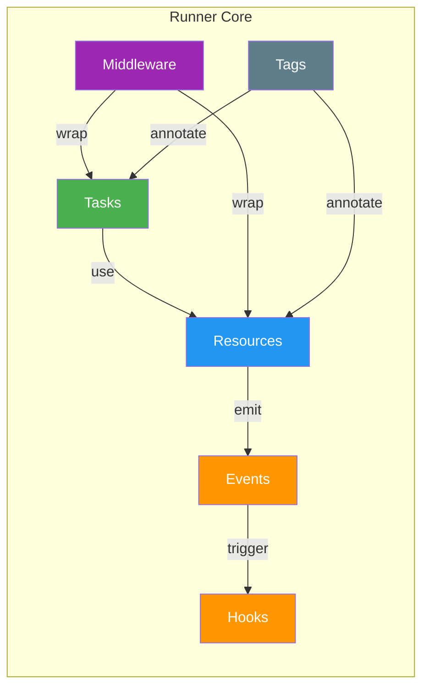
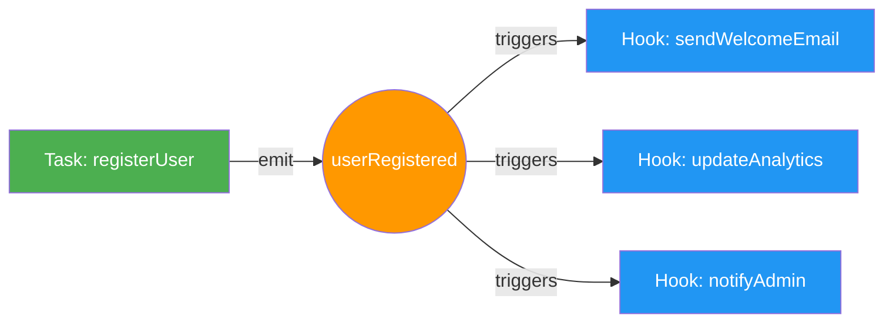
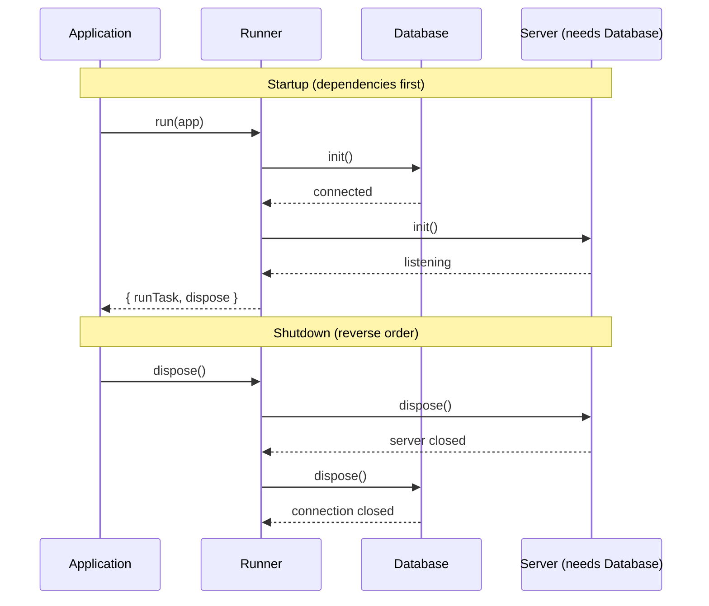
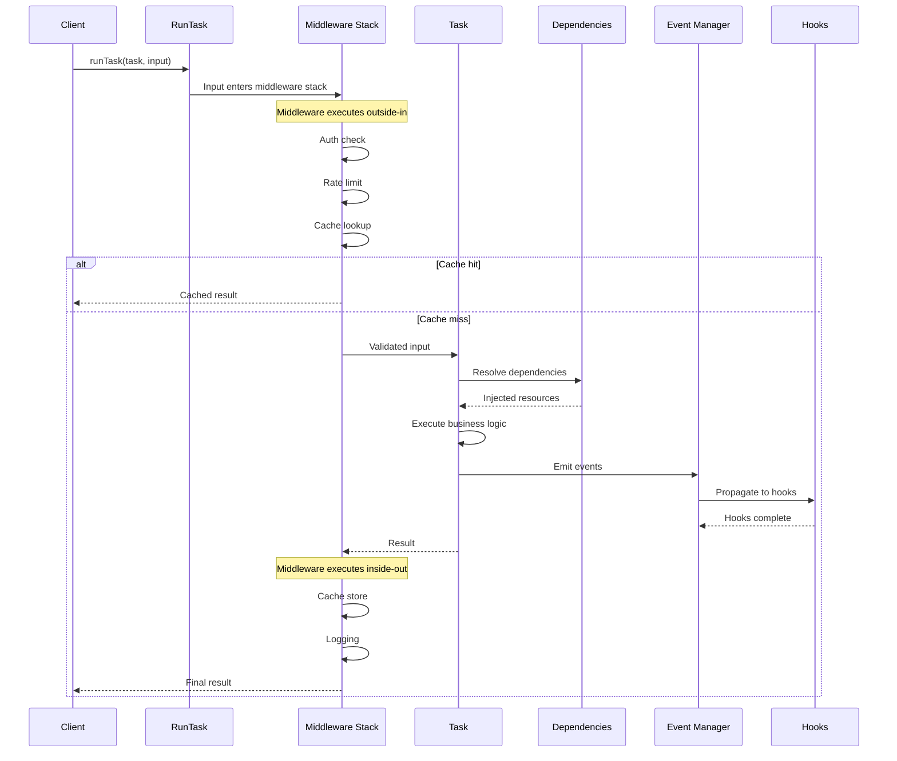
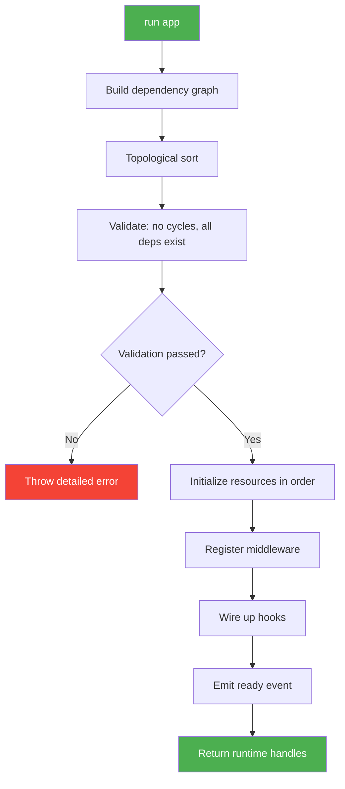
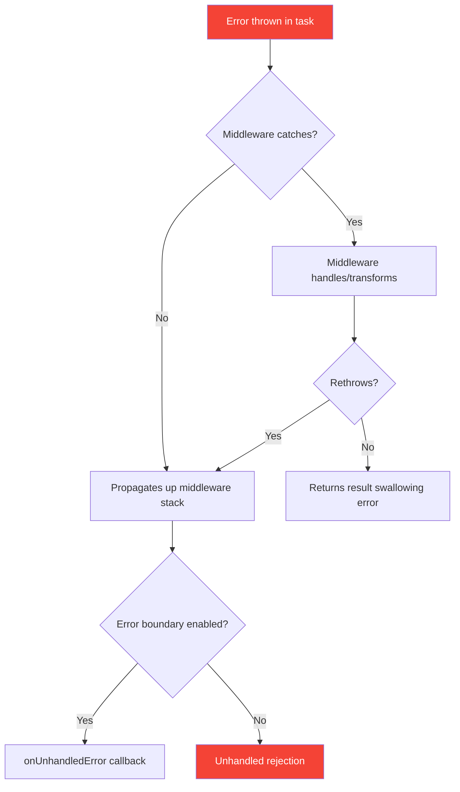

# BlueLibs Runner

### TypeScript-First Dependency Injection Framework

**Build enterprise applications that are maintainable, testable, and scalable**

Runner is a TypeScript-first framework for building applications from tasks (functions) and resources
(singletons), with explicit dependency injection, middleware, events, hooks, and lifecycle management.

<p align="center">
<a href="https://github.com/bluelibs/runner/actions/workflows/ci.yml"></a>
<a href="https://github.com/bluelibs/runner"></a>
<a href="https://bluelibs.github.io/runner/" target="_blank"></a>
<a href="https://www.npmjs.com/package/@bluelibs/runner"></a>
<a href="https://www.npmjs.com/package/@bluelibs/runner"></a>
</p>

```typescript
import { r, run } from "@bluelibs/runner";
import { z } from "zod";

const db = r
  .resource("app.db")
  .init(async () => ({
    users: {
      insert: async (input: { name: string; email: string }) => ({
        id: "user-1",
        ...input,
      }),
    },
  }))
  .build();

const mailer = r
  .resource("app.mailer")
  .init(async () => ({
    sendWelcome: async (email: string) => {
      console.log(`Sending welcome email to ${email}`);
    },
  }))
  .build();

// Define a task with dependencies, schema validation, and type-safe input/output
const createUser = r
  .task("users.create")
  .dependencies({ db, mailer })
  .inputSchema(z.object({ name: z.string(), email: z.string().email() }))
  .run(async (input, { db, mailer }) => {
    const user = await db.users.insert(input);
    await mailer.sendWelcome(user.email);
    return user;
  })
  .build();

// Compose resources and run your application
const app = r.resource("app").register([db, mailer, createUser]).build();
const runtime = await run(app);
await runtime.runTask(createUser, { name: "Ada", email: "ada@example.com" });
// await runtime.dispose() when you are done.
```

---

| Resource                                                                                                            | Type    | Description                         |
| ------------------------------------------------------------------------------------------------------------------- | ------- | ----------------------------------- |
| [Presentation Website](https://runner.bluelibs.com/)                                                                | Website | Overview and features               |
| [GitHub Repository](https://github.com/bluelibs/runner)                                                             | GitHub  | Source code, issues, and releases   |
| [Runner Dev Tools](https://github.com/bluelibs/runner-dev)                                                          | GitHub  | Development CLI and tooling         |
| [API Documentation](https://bluelibs.github.io/runner/)                                                             | Docs    | TypeDoc-generated reference         |
| [AI-Friendly Docs](./AI.md)                                                                                         | Docs    | Compact summary (<5000 tokens)      |
| [Design Documents](https://github.com/bluelibs/runner/tree/main/readmes)                                            | Docs    | Architecture notes and deep dives   |
| [Example: Express + OpenAPI + SQLite](https://github.com/bluelibs/runner/tree/main/examples/express-openapi-sqlite) | Example | REST API with OpenAPI specification |
| [Example: Fastify + MikroORM + PostgreSQL](https://github.com/bluelibs/runner/tree/main/examples/fastify-mikroorm)  | Example | Full-stack application with ORM     |

### Community & Policies

- [Code of Conduct](./CODE_OF_CONDUCT.md)
- [Contributing](./CONTRIBUTING.md)
- [Security](./SECURITY.md)

## Choose Your Path

- **New to Runner**: Start with [Your First 5 Minutes](#your-first-5-minutes)
- **Prefer an end-to-end example**: Jump to [Quick Start](#quick-start) or [Real-World Example](#real-world-example-the-complete-package)
- **Need Node-only capabilities**: See [Durable Workflows](./readmes/DURABLE_WORKFLOWS.md)
- **Need remote execution**: See [HTTP Tunnels](./readmes/TUNNELS.md) (expose from Node.js, call from any `fetch` runtime)
- **Care about portability**: Read [Multi-Platform Architecture](./readmes/MULTI_PLATFORM.md)
- **Want the short version**: Read [AI.md](./AI.md)

## Platform Support (Quick Summary)

| Capability                                    | Node.js | Browser | Edge | Notes |
| --------------------------------------------- | ------ | ------- | ---- | ----- |
| Core runtime (tasks/resources/events/hooks)   | Full   | Full    | Full | Platform adapters hide runtime differences |
| Async Context (`r.asyncContext`)              | Full   | None    | None | Requires Node.js `AsyncLocalStorage` |
| Durable workflows (`@bluelibs/runner/node`)   | Full   | None    | None | Node-only module |
| Tunnels client (`createExposureFetch`)        | Full   | Full    | Full | Requires `fetch` |
| Tunnels server (`@bluelibs/runner/node`)      | Full   | None    | None | Exposes tasks/events over HTTP |

---

## Why Runner?

<table>
<tr>
<td width="50%" valign="top">

### Current Way

Modern dependency injection frameworks force difficult trade-offs: decorators, reflection, and runtime tricks make debugging painful.

The result is code that's hard to test, hard to understand, and hard to maintain:

```typescript
@Injectable()
export class UserService {
  constructor(
    private readonly db: Database,
    private readonly logger: Logger,
    // ... more dependencies
  ) {}

  createUser(input: UserInputType) {
    const user = await this.db.users.insert(input);
    this.logger.info("User created", { userId: user.id });
    return user;
  }
}

// Boilerplate to start the application, use the services, etc.
```

</td>
<td width="50%" valign="top">

### Next-gen way

Runner provides a functional, explicit approach:

```typescript
const createUser = r
  .task("users.create")
  .dependencies({ db, logger })
  .run(async (input: UserInputType, { db, logger }) => {
    const user = await db.users.insert(input);
    logger.info("User created", { userId: user.id });
    return user;
  })
  .build();

const app = r.resource("app")
  .register([db, logger, createUser])
  .build();

const runtime = await run(app);
```

**Benefits:**

- **Zero magic** — Plain functions and objects
- **Full type safety** — TypeScript inference throughout
- **Simple testing** — Unit tests run in milliseconds
- **Clear debugging** — Readable stack traces
- **Gradual adoption** — Integrate into existing projects

</td>
</tr>
</table>

---

## Table of Contents

**Getting Started**

- [Why Runner?](#why-runner) - The problem we solve
- [What Is This Thing?](#what-is-this-thing)
- [When to Use Runner](#when-to-use-runner) - Is it right for you?
- [Show Me the Magic](#show-me-the-magic) - See it in action
- [How Does It Compare?](#how-does-it-compare) - vs. other frameworks
- [Performance at a Glance](#performance-at-a-glance) - Real benchmarks
- [What's in the Box?](#whats-in-the-box) - Feature matrix
- [Your First 5 Minutes](#your-first-5-minutes) - **Start here!**
- [Quick Start](#quick-start) - Full Express example
- [Learning Guide](#learning-guide) - Common patterns
- [Quick Wins](#quick-wins-copy-paste-solutions) - Copy-paste solutions
- [The Big Five](#the-big-five) - Core concepts

**Core Concepts**

- [Tasks](#tasks) - Functions with superpowers
- [Resources](#resources) - Singletons and lifecycle management
- [Events](#events) - Decoupled communication
- [Hooks](#hooks) - Lightweight event subscribers
- [Middleware](#middleware) - Cross-cutting concerns
- [Tags](#tags) - Component discovery and configuration
- [Errors](#errors) - Typed error handling

**Runtime & Lifecycle**

- [run() and RunOptions](#run-and-runoptions) - Starting your application
- [Task Interceptors](#task-interceptors) - Advanced task control
- [Error Boundaries](#error-boundaries) - Fault isolation
- [Lifecycle Hooks](#lifecycle-hooks) - Graceful shutdown and cleanup

**Advanced Features**

- [Caching](#caching) - Built-in performance optimization
- [Retry](#retrying-failed-operations) - Resilience patterns
- [Timeouts](#timeouts) - Operation time limits
- [Logging](#logging) - Structured observability
- [Debug](#debug) - Development tooling

**Concurrency & Scheduling**

- [Semaphore](#semaphore) - Concurrency control
- [Queue](#queue) - Task scheduling

**Deployment & Integrations** (see dedicated guides in `./readmes/`)

- [Durable Workflows](./readmes/DURABLE_WORKFLOWS.md) - Replay-safe, persistent workflows (Node-only)
- [HTTP Tunnels](./readmes/TUNNELS.md) - Expose tasks/events over HTTP (server: Node, client: any `fetch` runtime)
- [Multi-Platform Architecture](./readmes/MULTI_PLATFORM.md) - How Runner supports Node, browsers, and edge runtimes

**Architecture Patterns**

- [Optional Dependencies](#optional-dependencies) - Graceful degradation
- [Resource Forking](#resource-forking) - Multi-instance patterns
- [Serialization](#serialization) - Advanced data handling
- [Tunnels](#tunnels-bridging-runners) - Distributed systems
- [Async Context](#async-context) - Request-scoped state
- [Overrides](#overrides) - Component replacement
- [Namespacing](#namespacing) - Code organization
- [Factory Pattern](#factory-pattern) - Dynamic creation
- [Circular Dependencies](#handling-circular-dependencies) - Resolution strategies

**Developer Experience**

- [Quick Reference Cheat Sheet](#quick-reference-cheat-sheet) - **Bookmark this!**
- [Fluent Builders](#fluent-builders-r) - Ergonomic API
- [Type Helpers](#type-helpers) - TypeScript utilities
- [Runtime Validation](#runtime-validation) - Schema validation
- [Meta](#meta) - Component documentation
- [Testing](#testing) - Unit and integration patterns

**Reference**

- [Real-World Example](#real-world-example-the-complete-package) - Complete application
- [Internal Services](#internal-services) - Framework internals
- [Performance](#performance) - Benchmarks and metrics
- [Why Choose BlueLibs Runner?](#why-choose-bluelibs-runner) - Framework comparison
- [Migration Path](#the-migration-path) - Adopting Runner
- [Troubleshooting](#troubleshooting) - Common issues and solutions
- [Under the Hood](#under-the-hood) - Architecture deep dive
- [Integration Recipes](#integration-recipes) - Docker, k8s, observability
- [Community & Support](#community--support) - Getting help

---
## What Is This Thing?

BlueLibs Runner is a TypeScript-first dependency injection framework built around **tasks** (functions) and **resources** (singletons). It’s explicit and composition-first: you write normal async functions; Runner wires dependencies, middleware, events/hooks, and lifecycle.

### The Core

- **Tasks are functions** - Your business logic, nicely packaged with dependency injection
- **Resources are singletons** - Database connections, configs, services – things that live for your app's lifetime
- **Events are just events** - Decouple parts of your app so they can talk without tight coupling
- **Hooks are lightweight subscribers** - React to events without the overhead of full tasks
- **Middleware** - Add cross-cutting concerns (logging, auth, caching) without cluttering your business logic
- **Everything is async** - Built for modern JavaScript/TypeScript
- **Explicit beats implicit** - You'll always know what's happening and why
- **Type-safe by default** - Catch mistakes at compile time, not at 3am in production

### When to Use Runner

**Great fit for:**

- TypeScript applications that need structured dependency injection
- Long-running services (APIs, workers, daemons) with lifecycle management
- Projects where testability matters — unit test with mocks, integration test with overrides
- Teams that want middleware patterns without decorator magic
- Applications growing beyond "one file" that need organization

**The honest take**: If your app has 3+ services that depend on each other and you're tired of manually passing things around, Runner pays off. If you're building a 50-line script, stick with plain functions.

---

## Show Me the Magic

**Here's what "zero magic" looks like in practice:**

```typescript
import { r, globals } from "@bluelibs/runner";

// Built-in middleware from globals
const { cache, retry } = globals.middleware.task;

// Assuming: db is a resource defined elsewhere, and mockDb is its test double
// ONE LINE to add caching with TTL
const getUser = r
  .task("users.get")
  .dependencies({ db })
  .middleware([cache.with({ ttl: 60000 })]) // ← That's it. 1 minute cache.
  .run(async (id, { db }) => db.query("SELECT * FROM users WHERE id = ?", id))
  .build();

// ONE LINE to add retry with exponential backoff
const callAPI = r
  .task("api.call")
  .middleware([retry.with({ retries: 3 })]) // ← Auto-retry failures (default exponential backoff)
  .run(async (url) => fetch(url))
  .build();

// Testing is actually pleasant
test("getUser works", async () => {
  const result = await getUser.run("user-123", { db: mockDb }); // ← Just call it
  expect(result.name).toBe("John");
});
```

**The magic? There isn't any.** It's just clean, composable functions.

---

## How Does It Compare?

### Quick Comparison Matrix

| Feature                    | Runner                 | NestJS              | InversifyJS    | TypeDI         | tsyringe       |
| -------------------------- | ---------------------- | ------------------- | -------------- | -------------- | -------------- |
| **Programming Paradigm**   | Functional-first       | OOP/Class-based     | OOP/Class-based | OOP/Class-based | OOP/Class-based |
| **DI Mechanism**           | Explicit, no reflection | Decorators, reflection | Decorators, reflection | Decorators, reflection | Decorators, reflection |
| **Type Safety**            | Full inference         | Manual typing       | Manual typing  | Manual typing  | Manual typing  |
| **Learning Curve**         | Gentle                 | Steep               | Moderate       | Moderate       | Moderate       |
| **Size**                   | Medium (tree-shakable) | Large               | Small          | Small          | Small          |
| **Built-in Features**      | Broad toolkit          | Full framework      | DI only        | DI only        | DI only        |
| **Test Isolation**         | Easy                   | Moderate            | Moderate       | Moderate       | Moderate       |
| **Framework Lock-in**      | Minimal                | High                | Low            | Low            | Low            |
| **Async Context**          | Yes (Node-only)        | Partial (ecosystem) | No             | No             | No             |
| **Middleware**             | Composable, type-safe  | Guard/Interceptor system | N/A        | N/A            | N/A            |
| **Events**                 | First-class support    | EventEmitter2       | N/A            | N/A            | N/A            |
| **Durable Workflows**      | Yes (Node-only)        | No (external libs)  | No             | No             | No             |
| **HTTP Tunnels**           | Yes (Node-only)        | No                  | No             | No             | No             |
| **Ecosystem**              | Growing                | Mature, extensive   | Moderate       | Moderate       | Small          |

> **Note:** This table is intentionally qualitative. Runner’s durable workflows and HTTP tunnels are Node-only features (via `@bluelibs/runner/node`).

### Side-by-Side: The Same Feature in Both Frameworks

Let's compare implementing the same user service in both frameworks:

<table>
<tr>
<td width="50%" valign="top">

**NestJS Approach** (~45 lines)

```typescript
// user.dto.ts
import { IsString, IsEmail } from 'class-validator';

export class CreateUserDto {
  @IsString()
  name: string;

  @IsEmail()
  email: string;
}

// user.service.ts
import { Injectable } from '@nestjs/common';
import { InjectRepository } from '@nestjs/typeorm';
import { Repository } from 'typeorm';

@Injectable()
export class UserService {
  constructor(
    @InjectRepository(User)
    private userRepo: Repository<User>,
    private readonly mailer: MailerService,
    private readonly logger: LoggerService,
  ) {}

  async createUser(dto: CreateUserDto) {
    const user = await this.userRepo.save(dto);
    await this.mailer.sendWelcome(user.email);
    this.logger.log(`Created user ${user.id}`);
    return user;
  }
}

// user.module.ts
@Module({
  imports: [TypeOrmModule.forFeature([User])],
  providers: [UserService, MailerService],
  controllers: [UserController],
})
export class UserModule {}
```

</td>
<td width="50%" valign="top">

**Runner Approach** (~25 lines)

```typescript
// users.ts
import { r, globals } from "@bluelibs/runner";
import { z } from "zod";

const createUser = r
  .task("users.create")
  .dependencies({ 
    db, 
    mailer, 
    logger: globals.resources.logger 
  })
  .inputSchema(z.object({ 
    name: z.string(), 
    email: z.string().email() 
  }))
  .run(async (input, { db, mailer, logger }) => {
    const user = await db.users.insert(input);
    await mailer.sendWelcome(user.email);
    await logger.info(`Created user ${user.id}`);
    return user;
  })
  .build();

// Register in app
const app = r.resource("app")
  .register([db, mailer, createUser])
  .build();
```

</td>
</tr>
<tr>
<td>

**Testing in NestJS:**
```typescript
describe('UserService', () => {
  let service: UserService;
  let userRepo: MockType<Repository<User>>;

  beforeEach(async () => {
    const module = await Test.createTestingModule({
      providers: [
        UserService,
        { provide: getRepositoryToken(User), 
          useFactory: mockRepository },
        { provide: MailerService, 
          useValue: mockMailer },
        { provide: LoggerService, 
          useValue: mockLogger },
      ],
    }).compile();

    service = module.get(UserService);
  });

  it('creates user', async () => {
    const result = await service.createUser({
      name: 'Ada', email: 'ada@test.com'
    });
    expect(result.id).toBeDefined();
  });
});
```

</td>
<td>

**Testing in Runner:**
```typescript
describe('createUser', () => {
  it('creates user', async () => {
    // Direct call - no app runtime needed
    const result = await createUser.run(
      { name: 'Ada', email: 'ada@test.com' },
      { 
        db: mockDb, 
        mailer: mockMailer, 
        logger: mockLogger 
      }
    );
    expect(result.id).toBeDefined();
  });
});
```

</td>
</tr>
</table>

### Honest Assessment: Where Each Shines

**Choose NestJS when:**
- You want an opinionated, batteries-included web framework (controllers, modules, interceptors, CLI)
- You're already experienced with Angular and love the decorator patterns
- Your team prefers strict OOP architectural patterns
- You need the extensive ecosystem (Swagger, GraphQL, WebSockets all pre-integrated)
- You're building a large enterprise app with many developers who need guardrails
- You want established conventions that are widely documented

**Choose Runner when:**
- You prefer functional programming over OOP
- You value minimal boilerplate and explicit code
- Fast test execution matters (no framework testing module setup)
- You want full type inference without manual typing
- You need durable workflows or HTTP tunnels in Node.js (`@bluelibs/runner/node`)
- You're integrating into an existing project gradually
- You want to understand exactly what's happening (no decorator magic)

**Choose a DI container (InversifyJS / TypeDI / tsyringe) when:**
- You want class-based DI but you don’t want a higher-level framework/toolkit
- You’re happy to bring your own patterns for middleware, events, and lifecycle
- You’re adding DI to an existing architecture and want minimal surface area

**The honest take:**

NestJS is a **batteries-included framework** inspired by Angular – opinionated, structured, and powerful. It's excellent for teams that want clear architectural patterns enforced by the framework.

Runner is a **composition-first application toolkit**: tasks/resources, middleware, events/hooks, and a runtime that wires everything together. It prioritizes type inference, testability, and explicit code over magical conventions.

Neither is universally "better" – they solve the same problem with different philosophies:

| Philosophy        | NestJS                          | Runner                              |
| ----------------- | ------------------------------- | ----------------------------------- |
| **Architecture**  | Enforced patterns (MVC, modules)| Bring your own structure            |
| **Dependencies**  | Injected via decorators         | Explicit via `.dependencies()`      |
| **Testing**       | Framework test modules          | Direct function calls with mocks    |
| **Mental Model**  | Classes and decorators          | Functions and composition           |
| **Onboarding**    | Learn NestJS conventions first  | Use what you know, add DI           |

> **TL;DR:** NestJS says "follow our patterns and we'll handle the complexity." Runner says "write functions, we'll wire them together."

---

## Performance at a Glance

**Runner is FAST.** Here are real benchmarks from an M1 Max:

```
┌─────────────────────────────────────┬───────────────┬──────────────┐
│ Operation                           │ Ops/Second    │ Time/Op      │
├─────────────────────────────────────┼───────────────┼──────────────┤
│ Basic task execution                │ 2.2M          │ ~0.0005 ms   │
│ Task with 5 middlewares             │ 244K          │ ~0.004 ms    │
│ Resource initialization             │ 59.7K         │ ~0.017 ms    │
│ Event emission + handling           │ 245K          │ ~0.004 ms    │
│ 10-level dependency chain           │ 8.4K          │ ~0.12 ms     │
│ Cache middleware (hit)              │ 8M            │ ~0.000125 ms │
└─────────────────────────────────────┴───────────────┴──────────────┘

Overhead Analysis:
├─ Middleware overhead:  ~0.00026 ms per middleware (virtually zero)
├─ DI overhead:         ~0.001 ms (compile-time safety pays off)
├─ Memory footprint:    ~3.3 MB per 100 components
└─ Cache speedup:       3.65x faster (automatic optimization)
```

**What this means for you:**

- **Instant feedback** - Tests run in milliseconds, not seconds
- **Lower cloud costs** - Handle more requests with fewer resources
- **Production ready** - Battle-tested at scale (see [Performance](#performance) for details)

> **Note:** Benchmarks will vary by hardware. These numbers show relative overhead, not absolute performance targets.

---

## What's in the Box?

Runner comes with **everything you need** to build production apps:

<table>
<tr>
<td width="33%" valign="top">

**Core Architecture**

- Dependency Injection
- Lifecycle Management
- Type-safe Everything
- Zero Configuration
- Multi-platform (Node/Browser)

</td>
<td width="33%" valign="top">

**Built-in Features**

- Caching (LRU + Custom)
- Retry with Backoff
- Timeouts
- Event System
- Middleware Pipeline
- Async Context
- Serialization (Dates, RegExp, Binary)
- HTTP Client Factory
- File Upload Support

</td>
<td width="33%" valign="top">

**Developer Experience**

- Fluent API
- Debug Tools
- Error Boundaries
- Testing Utilities
- TypeDoc Integration
- Full TypeScript Support
- Tree-shakable

</td>
</tr>
<tr>
<td width="33%" valign="top">

**Observability**

- Structured Logging
- Task Interceptors
- Event Tracking
- Performance Metrics
- Debug Mode

</td>
<td width="33%" valign="top">

**Production Ready**

- Graceful Shutdown
- Error Handling
- Typed Errors
- Optional Dependencies
- Semaphore/Queue
- Concurrency Control

</td>
<td width="33%" valign="top">

**Advanced Patterns**

- Durable Workflows (Node)
- Tunnels (Distributed)
- Tags System
- Factory Pattern
- Namespacing
- Overrides
- Meta/Documentation

</td>
</tr>
</table>

**No extra packages needed.** It's all included and works together seamlessly.

---
## Your First 5 Minutes

**New to Runner?** Here's the absolute minimum you need to know:

1. **Tasks** are your business logic functions
2. **Resources** are shared services (database, config, etc.)
3. **You compose them** using `r.resource()` and `r.task()`
4. **You run them** with `run(app)` which gives you `runTask()` and `dispose()`

That's it! Now let's see it in action:

---

## Quick Start

Let's start with the simplest possible example. Just copy this, run it, and you'll see Runner in action:

```bash
npm install @bluelibs/runner
```

```typescript
import { r, run } from "@bluelibs/runner";

// Step 1: Create a simple task (just a function with a name)
const greet = r
  .task("greet")
  .run(async (name: string) => `Hello, ${name}!`)
  .build();

// Step 2: Put it in an app resource (where you register components)
const app = r
  .resource("app")
  .register([greet]) // Tell the app about your task
  .build();

// Step 3: Run it!
const { runTask, dispose } = await run(app);

// Step 4: Use your task
const message = await runTask(greet, "World");
console.log(message); // "Hello, World!"

// Step 5: Clean up when done
await dispose();
```

That's it! You just:

1.  Created a task
2.  Registered it
3.  Ran it
4.  Cleaned up

**What you should see:**

```
Hello, World!
```

**What you just learned**: The basic Runner pattern: Define → Register → Run → Execute. Everything else builds on this foundation.

**Next step**: See how this scales to real apps below.

### Building a Real Express Server

Now that you've seen the basics, let's build something real! Here's a complete Express API server with dependency injection, logging, and proper lifecycle management. (And yes, it's less code than most frameworks need for "Hello World" )

```bash
npm install @bluelibs/runner express zod
```

```typescript
import express from "express";
import { r, run, globals } from "@bluelibs/runner";
import { z } from "zod";

// A resource is anything you want to share across your app, a singleton
const server = r
  .resource<{ port: number }>("app.server")
  .init(
    async ({ port }) =>
      new Promise((resolve) => {
        const app = express();
        app.use(express.json());
        const listener = app.listen(port, () => {
          console.log(`Server running on port ${port}`);
          resolve({ app, listener });
        });
      }),
  )
  .dispose(
    async ({ listener }) => new Promise((resolve) => listener.close(resolve)),
  )
  .build();

// Tasks are your business logic - easily testable functions
const createUser = r
  .task("app.tasks.createUser")
  .dependencies({ server, logger: globals.resources.logger })
  .inputSchema(z.object({ name: z.string() }))
  .run(async (input, { logger }) => {
    await logger.info(`Creating ${input.name}`);
    return { id: "user-123", name: input.name };
  })
  .build();

// Wire everything together
const app = r
  .resource("app")
  .register([server.with({ port: 3000 }), createUser])
  .dependencies({ server, createUser })
  .init(async (_config, { server, createUser }) => {
    server.app.post("/users", async (req, res) => {
      const user = await createUser(req.body);
      res.json(user);
    });
  })
  .build();

// That's it! Each run is fully isolated
const runtime = await run(app);

// Use the runtime helpers
await runtime.runTask(createUser, { name: "Ada" });
await runtime.dispose();

// Want to see what's happening? Add debug logging:
// await run(app, { debug: "verbose" });
```

**What you should see:**

```
Server running on port 3000
Creating Ada
{ id: 'user-123', name: 'Ada' }
```

**What you just built:**

- A full Express API with proper lifecycle management
- Dependency injection (tasks get what they need automatically)
- Built-in logging (via `globals.resources.logger`)
- Schema validation with Zod
- Graceful shutdown (the `dispose()` method)
- Type-safe everything (TypeScript has your back)

**Note**: See how we used `r.task()` and `r.resource()`? That's the **fluent builder API** – the recommended way to build with Runner. It's chainable, type-safe, and reads like a story.

### Classic API (still supported)

Prefer fluent builders for new code, but the classic `define`-style API remains supported and can be mixed in the same app:

```ts
import { resource, task, run } from "@bluelibs/runner";

const db = resource({ id: "app.db", init: async () => "conn" });
const add = task({
  id: "app.tasks.add",
  run: async (i: { a: number; b: number }) => i.a + i.b,
});

const app = resource({ id: "app", register: [db, add] });
await run(app);
```

See [Fluent Builders](#fluent-builders-r) for migration tips and side‑by‑side patterns.

### Platform & Async Context

Runner auto-detects the platform (Node.js, browser, edge) and adapts behavior at runtime.

**Node-specific features:**

- [Async Context](#async-context) - Request-scoped state via `AsyncLocalStorage`
- [Durable Workflows](./readmes/DURABLE_WORKFLOWS.md) - Replay-safe, persistent workflows
- [HTTP Tunnels](./readmes/TUNNELS.md) - Remote task execution

---
## Learning Guide

These patterns will save you hours of debugging. Each one addresses a real mistake we've seen developers make when learning Runner.

**What you'll learn:**

- When to use tasks vs regular functions
- How to properly wire up and execute tasks
- Two different testing strategies
- Common gotchas with registration and configuration

### Pattern 1: Not Everything Needs to Be a Task

When you're starting out, it's tempting to make everything a task. Here's the golden rule: **use regular functions for utilities, use tasks for business operations**.

```typescript
// Regular functions are perfect for utilities
const add = (a: number, b: number) => a + b;
const formatCurrency = (amount: number) => `$${amount.toFixed(2)}`;

// Tasks are great for business operations
const processOrder = r
  .task("app.processOrder")
  .run(async (input) => {
    const total = add(input.price, input.tax); // Use regular functions inside!
    return {
      orderId: input.id,
      total: formatCurrency(total),
      status: "processed",
    };
  })
  .build();
```

**Want detailed guidance?** See the [Tasks section](#tasks) below for a comprehensive breakdown of when to use tasks vs. functions.

### Pattern 2: The Right Way to Call Tasks

This one trips everyone up at first! Here's the pattern:

```typescript
// 1. Create your app resource
const app = r
  .resource("app")
  .register([myTask]) // Register your tasks here
  .build();

// 2. Run the app to get the runtime
const { runTask, dispose } = await run(app);

// 3. Now you can execute tasks
const result = await runTask(myTask, { input: "data" });

// 4. Clean up when done
await dispose();
```

**Remember**: You `run()` the **app**, then you `runTask()` the **task**. Think of it like starting a car (run the app) before you can drive it (runTask).

### Pattern 3: Two Ways to Test

Runner gives you flexibility in testing:

```typescript
// Unit Testing: Call .run() directly with mocks
// This BYPASSES middleware - fast and isolated
test("calculateTotal", async () => {
  const result = await calculateTotal.run(
    { price: 100 },
    { taxService: mockTaxService }, // Mock dependencies
  );
  expect(result).toBe(110);
});

// Integration Testing: Use the full runtime
// This runs through the FULL pipeline including middleware
test("full order flow", async () => {
  const { runTask, dispose } = await run(app);
  const result = await runTask(processOrder, { orderId: "123" });
  expect(result.status).toBe("processed");
  await dispose();
});
```

**Tip**: Start with unit tests (faster, simpler), then add integration tests for critical flows. See [Testing](#testing) for more patterns.

### Pattern 4: Remember to Register

This is easy to forget when you're moving fast:

```typescript
// The complete pattern
const database = r
  .resource("db")
  .init(async () => connectToDB())
  .build();

const myTask = r
  .task("myTask")
  .dependencies({ database }) // Declare what you need
  .run(async (input, { database }) => {
    // Use it here
  })
  .build();

const app = r
  .resource("app")
  .register([
    database, // ← Don't forget to register!
    myTask,
  ])
  .build();
```

**Think of it this way**: `dependencies` says "I need these things" and `register` says "these things exist". Both are needed!

### Pattern 5: Configure Resources with `.with()`

Resources often need configuration. Use `.with()` to pass it:

```typescript
// Define the resource with a config type
const database = r
  .resource<{ connectionString: string }>("db")
  .init(async ({ connectionString }) => connect(connectionString))
  .build();

// Configure when registering
const app = r
  .resource("app")
  .register([database.with({ connectionString: "postgres://..." })])
  .build();
```

### Pattern 6: Built-in Globals

Runner provides commonly-used resources and middleware out of the box:

```typescript
import { globals } from "@bluelibs/runner";

const myTask = r
  .task("myTask")
  .dependencies({ logger: globals.resources.logger }) // Built-in logger
  .middleware([globals.middleware.task.cache.with({ ttl: 60000 })]) // Built-in cache
  .run(async (input, { logger }) => {
    await logger.info("Processing...");
  })
  .build();
```

See [Quick Wins](#quick-wins-copy-paste-solutions) for ready-to-use examples with globals.

---

**Key takeaway**: Define → Register → Run → Execute. That's the rhythm of every Runner application.

### What's Next?

Now that you know the patterns, here's your learning path:

1. **[Quick Wins](#quick-wins-copy-paste-solutions)** - Copy-paste solutions for caching, retry, timeouts
2. **[The Big Five](#the-big-five)** - Deep dive into Tasks, Resources, Events, Middleware, Tags
3. **[Events & Hooks](#events)** - Decouple your app with event-driven patterns
4. **[Middleware](#middleware)** - Add cross-cutting concerns cleanly

> **runtime:** "Six patterns. That's it. You just learned what takes most developers three debugging sessions and a Stack Overflow rabbit hole to figure out. The other 10% of midnight emergencies? That's why I log everything."

---
## Quick Wins: Copy-Paste Solutions

Production-ready patterns you can use today. Each example is complete and tested.

| Problem                  | Solution                  | Jump to                                                         |
| ------------------------ | ------------------------- | --------------------------------------------------------------- |
| Expensive repeated calls | Add caching               | [Caching](#add-caching-to-any-task-with-automatic-invalidation) |
| Flaky external APIs      | Auto-retry with backoff   | [Retry](#retry-failed-api-calls-with-exponential-backoff)       |
| Hanging operations       | Add timeouts              | [Timeouts](#add-request-timeouts-prevent-hanging-operations)    |
| Tight coupling           | Event-driven architecture | [Events](#set-up-event-driven-architecture-in-30-seconds)       |
| Race conditions          | Sequential queue          | [Queue](#prevent-race-conditions-per-process-queue)             |
| Production debugging     | Structured logging        | [Logging](#add-structured-logging-with-context)                 |

---

### Add Caching to Any Task (with automatic invalidation)

```typescript
import { r, globals } from "@bluelibs/runner";

const getUser = r
  .task("users.get")
  .middleware([
    globals.middleware.task.cache.with({
      ttl: 60 * 1000, // 1 minute
      keyBuilder: (taskId, input) => `user:${input.id}`,
    }),
  ])
  .run(async (input: { id: string }) => {
    return await db.users.findOne({ id: input.id });
  })
  .build();

// First call: hits database
// Next 60 seconds: instant from cache
// After 60s: refreshes automatically
```

### Retry Failed API Calls (with exponential backoff)

```typescript
const callExternalAPI = r
  .task("api.external")
  .middleware([
    globals.middleware.task.retry.with({
      retries: 3,
      delayStrategy: (attempt) => 100 * Math.pow(2, attempt), // 100ms, 200ms, 400ms
      stopRetryIf: (error) => error.status === 404, // Don't retry not found
    }),
  ])
  .run(async (url: string) => {
    const response = await fetch(url);
    if (!response.ok) throw new Error(`HTTP ${response.status}`);
    return response.json();
  })
  .build();

// Automatically retries transient failures
// Gives up on permanent errors
```

### Add Request Timeouts (prevent hanging operations)

```typescript
const slowOperation = r
  .task("operations.slow")
  .middleware([
    globals.middleware.task.timeout.with({ ttl: 5000 }), // 5 second max
  ])
  .run(async () => {
    // This will throw TimeoutError if it takes > 5s
    return await someSlowDatabaseQuery();
  })
  .build();

// Combine with retry for robust error handling
const robustTask = r
  .task("operations.robust")
  .middleware([
    globals.middleware.task.retry.with({ retries: 3 }),
    globals.middleware.task.timeout.with({ ttl: 10000 }), // Each retry gets 10s
  ])
  .run(async () => await unreliableOperation())
  .build();
```

### Set Up Event-Driven Architecture (in 30 seconds)

```typescript
// Define your events
const userRegistered = r
  .event("users.registered")
  .payloadSchema<{ userId: string; email: string }>({ parse: (v) => v })
  .build();

// Emit events from tasks
const registerUser = r
  .task("users.register")
  .dependencies({ userRegistered })
  .run(async (input, { userRegistered }) => {
    const user = await createUserInDB(input);
    await userRegistered({ userId: user.id, email: user.email }); //  Emit!
    return user;
  })
  .build();

// React to events with hooks
const sendWelcomeEmail = r
  .hook("users.welcome")
  .on(userRegistered)
  .run(async (event) => {
    await emailService.send({
      to: event.data.email,
      subject: "Welcome!",
      body: "Thanks for joining!",
    });
  })
  .build();

// Automatically decoupled - no direct dependencies!
// Note: createUserInDB and emailService are your own implementations
```

### Prevent Race Conditions (per-process queue)

The built-in queue provides in-process named locks - no Redis needed, but only works within a single Node.js process.

```typescript
const writeConfig = r
  .task("config.write")
  .dependencies({ queue: globals.resources.queue })
  .run(async (input: { key: string; value: string }, { queue }) => {
    // Only one write per key at a time within this process
    return await queue.run(`config:${input.key}`, async () => {
      await fs.writeFile(
        `/config/${input.key}.json`,
        JSON.stringify(input.value),
      );
      return { written: true };
    });
  })
  .build();

// Same key? Queued. Different keys? Parallel.
```

### Add Structured Logging (with context)

```typescript
const processPayment = r
  .task("payments.process")
  .dependencies({ logger: globals.resources.logger })
  .run(async (input: { orderId: string; amount: number }, { logger }) => {
    // Logs are automatically structured and include task context
    await logger.info("Processing payment", {
      data: { orderId: input.orderId, amount: input.amount },
    });

    try {
      const result = await chargeCard(input);
      await logger.info("Payment successful", {
        data: { transactionId: result.id },
      });
      return result;
    } catch (error) {
      await logger.error("Payment failed", {
        error,
        data: { orderId: input.orderId, amount: input.amount },
      });
      throw error;
    }
  })
  .build();

// Logs include: timestamp, level, source (task ID), data, errors
// Perfect for production debugging!
```

### Wire It All Together

```typescript
import { r, run } from "@bluelibs/runner";

// After defining your tasks, events, and hooks...
const app = r
  .resource("app")
  .register([
    getUser, // cached task
    callExternalAPI, // retrying task
    registerUser, // event emitter
    userRegistered, // event definition
    sendWelcomeEmail, // hook
    processOrder, // queue-protected task
    processPayment, // logged task
  ])
  .build();

// Start the runtime
const { runTask, dispose } = await run(app);

// Execute tasks
const user = await runTask(getUser, { id: "123" });
const result = await runTask(registerUser, { email: "new@user.com" });

// Shutdown gracefully when done
await dispose();
```

**That's it!** Each pattern is production-ready. No configuration, no extra packages, just works.

> **runtime:** "Six production problems, six one-liners. You bolted middleware onto tasks like Lego bricks and called it architecture. I respect the pragmatism. Ship it."

---
## The Big Five

The framework is built around five core concepts: Tasks, Resources, Events, Middleware, and Tags. Understanding them is key to using Runner effectively.



### Tasks

Tasks are where your business logic lives. Think of them as **functions with superpowers** – they get automatic dependency injection, type safety, middleware support, and observability.

Here's a complete example showing you everything:

```typescript
import { r, run } from "@bluelibs/runner";

// 1. Define your task - it's just a function with a name and dependencies
const sendEmail = r
  .task("app.tasks.sendEmail")
  .dependencies({ emailService, logger }) // What does this task need?
  .run(async (input, { emailService, logger }) => {
    // Your business logic here
    await logger.info(`Sending email to ${input.to}`);
    return emailService.send(input);
  })
  .build();

// 2. Wire it into your app
const app = r
  .resource("app")
  .register([emailService, logger, sendEmail]) // Tell the app about your components
  .build();

// 3. Run your app and get the runtime
const { runTask, dispose } = await run(app);

// 4. Execute your task - fully type-safe!
const result = await runTask(sendEmail, {
  to: "user@example.com",
  subject: "Hi",
  body: "Hello!",
});
```

**The Two Ways to Call Tasks:**

1. **In production/integration**: `runTask(task, input)` - Gets full DI, middleware, events, the works
2. **In unit tests**: `task.run(input, mockDeps)` - Direct call with your mock dependencies

```typescript
// Unit testing is straightforward
const testResult = await sendEmail.run(
  { to: "test@example.com", subject: "Test", body: "Testing!" },
  { emailService: mockEmailService, logger: mockLogger },
);
```

**When Should Something Be a Task?**

Here's a friendly guideline (not a strict rule!):

**Make it a task when:**

- It's a core business operation (user registration, order processing, payment handling)
- You need dependency injection (database, services, configs)
- You want middleware features (auth, caching, retry, timeouts)
- Multiple parts of your app need to use it
- You want observability (logging, monitoring, debugging)

  **Keep it as a regular function when:**

- It's a simple utility (date formatting, string manipulation, calculations)
- It's a pure function with no dependencies
- Performance is critical and you don't need framework features
- It's only used in one place

**Think of it this way**: Tasks are the "main actors" in your app – the functions that _do important things_. Regular functions are the supporting cast that help tasks do their job. Both are valuable!

### Resources

Resources are the long-lived parts of your app – things like database connections, configuration, services, and caches. They **initialize once when your app starts** and **clean up when it shuts down**. Think of them as the foundation your tasks build upon.

```typescript
import { r } from "@bluelibs/runner";

const database = r
  .resource("app.db")
  .init(async () => {
    const client = new MongoClient(process.env.DATABASE_URL as string);
    await client.connect();
    return client;
  })
  .dispose(async (client) => client.close())
  .build();

const userService = r
  .resource("app.services.user")
  .dependencies({ database })
  .init(async (_config, { database }) => ({
    async createUser(userData: UserData) {
      return database.collection("users").insertOne(userData);
    },
    async getUser(id: string) {
      return database.collection("users").findOne({ _id: id });
    },
  }))
  .build();
```

#### Resource Configuration

Resources can be configured with type-safe options. No more guessing at config shapes.

```typescript
type SMTPConfig = {
  smtpUrl: string;
  from: string;
};

const emailer = r
  .resource<{ smtpUrl: string; from: string }>("app.emailer")
  .init(async (config) => ({
    send: async (to: string, subject: string, body: string) => {
      // Use config.smtpUrl and config.from
    },
  }))
  .build();

// Register with specific config
const app = r
  .resource("app")
  .register([
    emailer.with({
      smtpUrl: "smtp://localhost",
      from: "noreply@myapp.com",
    }),
    // using emailer without with() will cause a type error
  ])
  .build();
```

#### Resource Forking

Use `.fork(newId)` to create multiple instances of a "template" resource with different identities. This is perfect when you need several instances of the same resource type (e.g., multiple database connections, multiple mailers):

```typescript
// Define a reusable template
const mailerBase = r
  .resource<{ smtp: string }>("base.mailer")
  .init(async (cfg) => ({
    send: (to: string) => console.log(`Sending via ${cfg.smtp}`),
  }))
  .build();

// Fork with distinct identities - export these for dependency use
export const txMailer = mailerBase.fork("app.mailers.transactional");
export const mktMailer = mailerBase.fork("app.mailers.marketing");

// Use forked resources as dependencies
const orderService = r
  .task("app.tasks.processOrder")
  .dependencies({ mailer: txMailer }) // ← uses forked identity
  .run(async (input, { mailer }) => {
    mailer.send(input.customerEmail);
  })
  .build();

const app = r
  .resource("app")
  .register([
    txMailer.with({ smtp: "tx.smtp.com" }),
    mktMailer.with({ smtp: "mkt.smtp.com" }),
    orderService,
  ])
  .build();
```

Key points:

- **`.fork()` returns a built `IResource`** - no need to call `.build()` again
- **Tags, middleware, and type parameters are inherited**
- **Each fork gets independent runtime** - no shared state
- **Export forked resources** to use them as typed dependencies

#### Optional Dependencies

Mark dependencies as optional when they may not be registered. The injected value will be `undefined` if the dependency is missing:

```typescript
const analyticsService = r
  .resource("app.analytics")
  .init(async () => ({ track: (event: string) => console.log(event) }))
  .build();

const myTask = r
  .task("app.tasks.doWork")
  .dependencies({
    analytics: analyticsService.optional(), // May be undefined
  })
  .run(async (input, { analytics }) => {
    // Safe to call only if registered
    analytics?.track("task.executed");
    return { done: true };
  })
  .build();
```

Optional dependencies work on tasks, resources, events, async contexts, and errors.

#### Private Context

For cases where you need to share variables between `init()` and `dispose()` methods (because sometimes cleanup is complicated), use the enhanced context pattern:

```typescript
const dbResource = r
  .resource("db.service")
  .context(() => ({
    connections: new Map<string, unknown>(),
    pools: [] as Array<{ drain(): Promise<void> }>,
  }))
  .init(async (_config, _deps, ctx) => {
    const db = await connectToDatabase();
    ctx.connections.set("main", db);
    ctx.pools.push(createPool(db));
    return db;
  })
  .dispose(async (_db, _config, _deps, ctx) => {
    for (const pool of ctx.pools) {
      await pool.drain();
    }
    for (const [, conn] of ctx.connections) {
      await (conn as { close(): Promise<void> }).close();
    }
  })
  .build();
```

### Events

Events let different parts of your app talk to each other without tight coupling. It's like having a really good office messenger who never forgets anything.



```typescript
import { r } from "@bluelibs/runner";

const userRegistered = r
  .event("app.events.userRegistered")
  .payloadSchema<{ userId: string; email: string }>({ parse: (value) => value })
  .build();
```

#### Parallel Event Execution

By default, hooks run sequentially in priority order. Use `.parallel(true)` on an event to enable concurrent execution within priority batches:

```typescript
const highVolumeEvent = r
  .event("app.events.highVolume")
  .payloadSchema<{ data: string }>({ parse: (v) => v })
  .parallel(true) // Hooks with same priority run concurrently
  .build();
```

**How parallel execution works:**

- Hooks are grouped by `.order()` priority
- Within each priority batch, hooks run concurrently
- Batches execute sequentially (lowest priority number first)
- If any hook throws, subsequent batches don't run
- `stopPropagation()` is checked between batches only

```typescript
const registerUser = r
  .task("app.tasks.registerUser")
  .dependencies({ userService, userRegistered })
  .run(async (input, { userService, userRegistered }) => {
    const user = await userService.createUser(input);
    await userRegistered({ userId: user.id, email: user.email });
    return user;
  })
  .build();

const sendWelcomeEmail = r
  .hook("app.hooks.sendWelcomeEmail")
  .on(userRegistered)
  .run(async (event) => {
    console.log(`Welcome email sent to ${event.data.email}`);
  })
  .build();
```

#### Wildcard Events

Sometimes you need to be the nosy neighbor of your application:

```typescript
const logAllEventsHook = r
  .hook("app.hooks.logAllEvents")
  .on("*")
  .run((event) => {
    console.log("Event detected", event.id, event.data);
  })
  .build();
```

#### Excluding Events from Global Hooks

Sometimes you have internal or system events that should not be picked up by wildcard hooks. Use the `excludeFromGlobalHooks` tag to prevent events from being sent to `"*"` hooks:

```typescript
import { r, globals } from "@bluelibs/runner";

// Internal event that won't be seen by global hooks
const internalEvent = r
  .event("app.events.internal")
  .tags([globals.tags.excludeFromGlobalHooks])
  .build();
```

**When to exclude events from global hooks:**

- High-frequency internal events (performance)
- System debugging events
- Framework lifecycle events
- Events that contain sensitive information
- Events meant only for specific components

#### Hooks

Hooks are the modern way to subscribe to events. They are lightweight event subscribers, similar to tasks, but with a few key differences.

```typescript
const myHook = r
  .hook("app.hooks.onUserRegistered")
  .on(userRegistered)
  .dependencies({ logger })
  .run(async (event, { logger }) => {
    await logger.info(`User registered: ${event.data.email}`);
  })
  .build();
```

#### Multiple Events (type-safe intersection)

Hooks can listen to multiple events by providing an array to `on`. The `run(event)` payload is inferred as the common (intersection-like) shape across all provided event payloads. Use the `onAnyOf()` helper to preserve tuple inference ergonomics, and `isOneOf()` as a convenient runtime/type guard when needed.

```typescript
import { r, onAnyOf, isOneOf } from "@bluelibs/runner";

const eUser = r
  .event("app.events.user")
  .payloadSchema<{ id: string; email: string }>({ parse: (v) => v })
  .build();
const eAdmin = r
  .event("app.events.admin")
  .payloadSchema<{ id: string; role: "admin" | "superadmin" }>({
    parse: (v) => v,
  })
  .build();
const eGuest = r
  .event("app.events.guest")
  .payloadSchema<{ id: string; guest: true }>({ parse: (v) => v })
  .build();

// The common field across all three is { id: string }
const auditUsers = r
  .hook("app.hooks.auditUsers")
  .on([eUser, eAdmin, eGuest])
  .run(async (ev) => {
    ev.data.id; // OK: common field inferred
    // ev.data.email; // TS error: not common to all
  })
  .build();

// Guard usage to refine at runtime (still narrows to common payload)
const auditSome = r
  .hook("app.hooks.auditSome")
  .on(onAnyOf([eUser, eAdmin])) // to get a combined event
  .run(async (ev) => {
    if (isOneOf(ev, [eUser, eAdmin])) {
      ev.data.id; // common field of eUser and eAdmin
    }
  })
  .build();
```

Notes:

- The common payload is computed structurally. Optional properties become optional if they are not present across all events.
- Wildcard `on: "*"` continues to accept any event and infers `any` payload.

Hooks are perfect for:

- Event-driven side effects
- Logging and monitoring
- Notifications and alerting
- Data synchronization
- Any reactive behavior

**Key differences from tasks:**

- Lighter weight - no middleware support
- Designed specifically for event handling

#### System Event

The framework exposes a minimal system-level event for observability:

```typescript
import { globals } from "@bluelibs/runner";

const systemReadyHook = r
  .hook("app.hooks.systemReady")
  .on(globals.events.ready)
  .run(async () => {
    console.log("System is ready and operational!");
  })
  .build();
```

Available system event:

- `globals.events.ready` - System has completed initialization
  // Note: use run({ onUnhandledError }) for unhandled error handling

#### stopPropagation()

Sometimes you need to prevent other hooks from processing an event. The `stopPropagation()` method gives you fine-grained control over event flow:

```typescript
const criticalAlert = r
  .event("app.events.alert")
  .payloadSchema<{ severity: "low" | "medium" | "high" | "critical" }>({
    parse: (v) => v,
  })
  .meta({
    title: "System Alert Event",
    description: "Emitted when system issues are detected",
  })
  .build();

// High-priority hook that can stop propagation
const emergencyHook = r
  .hook("app.hooks.onCriticalAlert")
  .on(criticalAlert)
  .order(-100) // Higher priority (lower numbers run first)
  .run(async (event) => {
    console.log(`Alert received: ${event.data.severity}`);

    if (event.data.severity === "critical") {
      console.log("CRITICAL ALERT - Activating emergency protocols");

      // Stop other hooks from running
      event.stopPropagation();
      // Notify the on-call team, escalate, etc.

      console.log("Event propagation stopped - emergency protocols active");
    }
  })
  .build();
```

> **runtime:** "'A really good office messenger.' That’s me in rollerblades. You launch a 'userRegistered' flare and I sprint across the building, high‑fiving hooks and dodging middleware. `stopPropagation` is you sweeping my legs mid‑stride. Rude. Effective. Slightly thrilling."

### Middleware

Middleware wraps around your tasks and resources, adding cross-cutting concerns without polluting your business logic.

Note: Middleware is now split by target. Use `taskMiddleware(...)` for task middleware and `resourceMiddleware(...)` for resource middleware.

```typescript
import { r } from "@bluelibs/runner";

// Task middleware with config
type AuthMiddlewareConfig = { requiredRole: string };
const authMiddleware = r.middleware
  .task("app.middleware.task.auth")
  .run(async ({ task, next }, _deps, config: AuthMiddlewareConfig) => {
    // Must return the value
    return await next(task.input);
  })
  .build();

const adminTask = r
  .task("app.tasks.adminOnly")
  .middleware([authMiddleware.with({ requiredRole: "admin" })])
  .run(async (input) => "Secret admin data")
  .build();
```

For middleware with input/output contracts:

```typescript
// Middleware that enforces specific input and output types
type AuthConfig = { requiredRole: string };
type AuthInput = { user: { role: string } };
type AuthOutput = { user: { role: string; verified: boolean } };

const authMiddleware = r.middleware
  .task("app.middleware.task.auth")
  .run(async ({ task, next }, _deps, config: AuthConfig) => {
    if ((task.input as AuthInput).user.role !== config.requiredRole) {
      throw new Error("Insufficient permissions");
    }
    const result = await next(task.input);
    return {
      user: {
        ...(task.input as AuthInput).user,
        verified: true,
      },
    } as AuthOutput;
  })
  .build();

// For resources
const resourceAuthMiddleware = r.middleware
  .resource("app.middleware.resource.auth")
  .run(async ({ next }) => {
    // Resource middleware logic
    return await next();
  })
  .build();

const adminTask = r
  .task("app.tasks.adminOnly")
  .middleware([authMiddleware.with({ requiredRole: "admin" })])
  .run(async (input: { user: { role: string } }) => ({
    user: { role: input.user.role, verified: true },
  }))
  .build();
```

#### Global Middleware

Want to add logging to everything? Authentication to all tasks? Global middleware has your back:

```typescript
import { r, globals } from "@bluelibs/runner";

const logTaskMiddleware = r.middleware
  .task("app.middleware.log.task")
  .everywhere(() => true)
  .dependencies({ logger: globals.resources.logger })
  .run(async ({ task, next }, { logger }) => {
    logger.info(`Executing: ${String(task!.definition.id)}`);
    const result = await next(task!.input);
    logger.info(`Completed: ${String(task!.definition.id)}`);
    return result;
  })
  .build();
```

**Note:** A global middleware can depend on resources or tasks. However, any such resources or tasks will be excluded from the dependency tree (Task -> Middleware), and the middleware will not run for those specific tasks or resources. This approach gives middleware true flexibility and control.

#### Interception (advanced)

For advanced scenarios, you can intercept framework execution without relying on events:

- Event emissions: `eventManager.intercept((next, event) => Promise<void>)`
- Hook execution: `eventManager.interceptHook((next, hook, event) => Promise<any>)`
- Task middleware execution: `middlewareManager.intercept("task", (next, input) => Promise<any>)`
- Resource middleware execution: `middlewareManager.intercept("resource", (next, input) => Promise<any>)`
- Per-middleware interception: `middlewareManager.interceptMiddleware(mw, interceptor)`
- Per-task execution (local): inside a resource `init`, call `deps.someTask.intercept(async (next, input) => next(input))` to wrap a single task.

Per-task interceptors must be registered during resource initialization (before the system is locked). They are a good fit when you want a specific task to be adjusted by a specific resource (for example: feature toggles, input shaping, or internal routing) without making it global middleware.

Note that per-task interceptors run *inside* task middleware. If a middleware short-circuits and never calls `next()`, the task (and its per-task interceptors) will not execute.

```typescript
import { r, run } from "@bluelibs/runner";

const adder = r
  .task("app.tasks.adder")
  .run(async (input: { value: number }) => ({ value: input.value + 1 } as const))
  .build();

const installer = r
  .resource("app.resources.installer")
  .register([adder])
  .dependencies({ adder })
  .init(async (_config, { adder }) => {
    adder.intercept(async (next, input) => next({ value: input.value * 2 }));
    return {};
  })
  .build();

const app = r.resource("app").register([installer]).build();
const runtime = await run(app);
await runtime.runTask(adder, { value: 10 }); // => { value: 21 }
await runtime.dispose();
```

Access `eventManager` via `globals.resources.eventManager` if needed.

#### Middleware Type Contracts

Middleware can enforce type contracts on the tasks that use them, ensuring data integrity as it flows through the system. This is achieved by defining `Input` and `Output` types within the middleware's implementation.

When a task uses this middleware, its own `run` method must conform to the `Input` and `Output` shapes defined by the middleware contract.

```typescript
import { r } from "@bluelibs/runner";

// 1. Define the contract types for the middleware.
type AuthConfig = { requiredRole: string };
type AuthInput = { user: { role: string } }; // Task's input must have this shape.
type AuthOutput = { executedBy: { role: string; verified: boolean } }; // Task's output must have this shape.

// 2. Create the middleware using these types in its `run` method.
const authMiddleware = r.middleware
  .task<AuthConfig, AuthInput, AuthOutput>("app.middleware.auth")
  .run(async ({ task, next }, _deps, config) => {
    const input = task.input;
    if (input.user.role !== config.requiredRole) {
      throw new Error("Insufficient permissions");
    }

    // The task runs, and its result must match AuthOutput.
    const result = await next(input);

    // The middleware can further transform the output.
    const output = result;
    return {
      ...output,
      executedBy: {
        ...output.executedBy,
        verified: true, // The middleware adds its own data.
      },
    };
  })
  .build();

// 3. Apply the middleware to a task.
const adminTask = r
  .task("app.tasks.adminOnly")
  // If you use multiple middleware with contracts they get combined.
  .middleware([authMiddleware.with({ requiredRole: "admin" })])
  // If you use .inputSchema() the input must contain the contract types otherwise you end-up with InputContractViolation error.
  // The `run` method is now strictly typed by the middleware's contract.
  // Its input must be `AuthInput`, and its return value must be `AuthOutput`.
  .run(async (input) => {
    // `input.user.role` is available and fully typed.
    console.log(`Task executed by user with role: ${input.user.role}`);

    // Returning a shape that doesn't match AuthOutput will cause a compile-time error.
    // return { wrong: "shape" }; // This would fail!
    return {
      executedBy: {
        role: input.user.role,
      },
    };
  })
  .build();
```

#### Execution Journal

The Execution Journal is a type-safe registry that travels with your task execution. It allows middleware and tasks to share state without polluting the task input/output.

```typescript
import { r, journal } from "@bluelibs/runner";

// 1. Define a typed key
const traceIdKey = journal.createKey<string>("app.traceId");

const traceMiddleware = r.middleware
  .task("app.middleware.trace")
  .run(async ({ task, next, journal }) => {
    // 2. Write to the journal
    journal.set(traceIdKey, "trace-123");
    return next(task.input);
  })
  .build();

const myTask = r
  .task("app.tasks.myTask")
  .middleware([traceMiddleware])
  .run(async (input, deps, { journal }) => {
    // 3. Read from the journal (fully typed!)
    const traceId = journal.get(traceIdKey); // string | undefined
    return { traceId };
  })
  .build();
```

**API Reference:**

| Method                              | Description                                                        |
| ----------------------------------- | ------------------------------------------------------------------ |
| `journal.createKey<T>(id)`          | Create a typed key for storing values                              |
| `journal.create()`                  | Create a fresh journal instance for manual forwarding              |
| `journal.set(key, value, options?)` | Store a typed value (throws if key exists unless `override: true`) |
| `journal.get(key)`                  | Retrieve a value (returns `T \| undefined`)                        |
| `journal.has(key)`                  | Check if a key exists (returns `boolean`)                          |

> [!IMPORTANT]
> **Fail-fast by default**: `set()` throws an error if the key already exists. This prevents silent bugs from middleware accidentally clobbering each other's state. Use `{ override: true }` when you intentionally want to update a value.

**Key features:**

- **Fail-fast**: Duplicate key writes throw immediately, catching integration bugs early
- **Type-safe keys**: Use `journal.createKey<T>()` for compile-time type checking
- **Per-execution**: Fresh journal for every task run
- **Forwarding**: Pass `{ journal }` to nested task calls to share context across the call tree

#### Cross-Middleware Coordination

The journal shines when middleware need to coordinate. The recommended pattern is to **export your journal keys** so other middleware can access your state:

```typescript
// timeout.middleware.ts
import { journal } from "@bluelibs/runner";

// Export keys for downstream consumers
export const journalKeys = {
  abortController: journal.createKey<AbortController>(
    "timeout.abortController",
  ),
} as const;

export const timeoutMiddleware = r.middleware
  .task("app.middleware.timeout")
  .run(async ({ task, next, journal }, _deps, config: { ttl: number }) => {
    const controller = new AbortController();

    // Store for other middleware to check
    journal.set(journalKeys.abortController, controller);

    const timeoutPromise = new Promise((_, reject) => {
      setTimeout(() => {
        controller.abort();
        reject(new Error(`Timeout after ${config.ttl}ms`));
      }, config.ttl);
    });

    return Promise.race([next(task.input), timeoutPromise]);
  })
  .build();
```

```typescript
// retry.middleware.ts
import { journalKeys as timeoutKeys } from "./timeout.middleware";

export const retryMiddleware = r.middleware
  .task("app.middleware.retry")
  .run(async ({ task, next, journal }, _deps, config: { retries: number }) => {
    let attempts = 0;

    while (true) {
      try {
        return await next(task.input);
      } catch (error) {
        // Check if timeout middleware aborted - don't retry timeouts!
        const controller = journal.get(timeoutKeys.abortController);
        if (controller?.signal.aborted) {
          throw error; // Timeout - no retry
        }

        if (attempts >= config.retries) throw error;
        attempts++;
        await new Promise((r) => setTimeout(r, 100 * Math.pow(2, attempts)));
      }
    }
  })
  .build();
```

This pattern enables loose coupling - middleware don't need direct references, just the exported keys.

#### Manual Journal Management

For advanced scenarios where you need explicit control:

```typescript
// Create and pre-populate a journal
const customJournal = journal.create();
customJournal.set(traceIdKey, "manual-trace-id");

// Forward explicit journal to a nested task call
const orchestratorTask = r
  .task("app.tasks.orchestrator")
  .dependencies({ myTask })
  .run(async (input, { myTask }) => {
    return myTask(input, { journal: customJournal });
  })
  .build();

await runTask(orchestratorTask, input);

// Check before accessing
if (customJournal.has(traceIdKey)) {
  console.log("Trace ID:", customJournal.get(traceIdKey));
}
```

> **runtime:** "Ah, the onion pattern. A matryoshka doll made of promises. Every peel reveals… another logger. Another tracer. Another 'just a tiny wrapper'. And now middleware can spy on each other through the journal. `has()` is just asking 'did anyone write here before me?' It's wrappers all the way down."

### Tags

Tags are metadata that can influence system behavior. Unlike meta properties, tags can be queried at runtime to build dynamic functionality. They can be simple strings or structured configuration objects.

#### Basic Usage

```typescript
import { r } from "@bluelibs/runner";

// Structured tags with configuration
const httpTag = r.tag<{ method: string; path: string }>("http.route").build();

const getUserTask = r
  .task("app.tasks.getUser")
  .tags([httpTag.with({ method: "GET", path: "/users/:id" })])
  .run(async (input) => getUserFromDatabase(input.id))
  .build();
```

#### Discovering Components by Tags

The core power of tags is runtime discovery. Use `store.getTasksWithTag()` to find components:

```typescript
import { r, globals } from "@bluelibs/runner";

// Auto-register HTTP routes based on tags
const routeRegistration = r
  .hook("app.hooks.registerRoutes")
  .on(globals.events.ready)
  .dependencies({ store: globals.resources.store, server: expressServer })
  .run(async (_event, { store, server }) => {
    // Find all tasks with HTTP tags
    const apiTasks = store.getTasksWithTag(httpTag);

    apiTasks.forEach((taskDef) => {
      const config = httpTag.extract(taskDef);
      if (!config) return;

      const { method, path } = config;
      server.app[method.toLowerCase()](path, async (req, res) => {
        const result = await taskDef({ ...req.params, ...req.body });
        res.json(result);
      });
    });

    // Also find by string tags
    const cacheableTasks = store.getTasksWithTag("cacheable");
    console.log(`Found ${cacheableTasks.length} cacheable tasks`);
  })
  .build();
```

#### Tag Extraction and Processing

```typescript
// Check if a tag exists and extract its configuration
const performanceTag = r
  .tag<{ warnAboveMs: number }>("performance.monitor")
  .build();

const performanceMiddleware = r.middleware
  .task("app.middleware.performance")
  .run(async ({ task, next }) => {
    // Check if task has performance monitoring enabled
    if (!performanceTag.exists(task.definition)) {
      return next(task.input);
    }

    // Extract the configuration
    const config = performanceTag.extract(task.definition)!;
    const startTime = Date.now();

    try {
      const result = await next(task.input);
      const duration = Date.now() - startTime;

      if (duration > config.warnAboveMs) {
        console.warn(`Task ${task.definition.id} took ${duration}ms`);
      }

      return result;
    } catch (error) {
      const duration = Date.now() - startTime;
      console.error(`Task failed after ${duration}ms`, error);
      throw error;
    }
  })
  .build();
```

#### System Tags

Built-in tags for framework behavior:

```typescript
import { r, globals } from "@bluelibs/runner";

const internalTask = r
  .task("app.internal.cleanup")
  .tags([
    globals.tags.system, // Excludes from debug logs
    globals.tags.debug.with({ logTaskInput: true }), // Per-component debug config
  ])
  .run(async () => performCleanup())
  .build();

const internalEvent = r
  .event("app.events.internal")
  .tags([globals.tags.excludeFromGlobalHooks]) // Won't trigger wildcard hooks
  .build();
```

#### Contract Tags

Enforce return value shapes at compile time:

```typescript
// Tags that enforce type contracts input/output for tasks or config/value for resources
type InputType = { id: string };
type OutputType = { name: string };
const userContract = r
  // void = no config, no need for .with({ ... })
  .tag<void, InputType, OutputType>("contract.user")
  .build();

const profileTask = r
  .task("app.tasks.getProfile")
  .tags([userContract]) // Must return { name: string }
  .run(async (input) => ({ name: input.id + "Ada" })) //  Satisfies contract
  .build();
```

### Errors

Typed errors can be declared once and injected anywhere. Register them alongside other items and consume via dependencies. The injected value is the error helper itself, exposing `.throw()`, `.is()`, `.toString()`, and `id`.

```ts
import { r } from "@bluelibs/runner";

// Fluent builder for errors
const userNotFoundError = r
  .error<{ code: number; message: string }>("app.errors.userNotFound")
  .dataSchema(z.object({ ... }))
  .build();

const getUser = r
  .task("app.tasks.getUser")
  .dependencies({ userNotFoundError })
  .run(async (input, { userNotFoundError }) => {
    userNotFoundError.throw({ code: 404, message: `User ${input} not found` });
  })
  .build();

const app = r.resource("app").register([userNotFoundError, getUser]).build();
```

Error data must include a `message: string`. The thrown `Error` has `name = id` and `message = data.message` for predictable matching and logging.

```ts
try {
  userNotFoundError.throw({ code: 404, message: "User not found" });
} catch (err) {
  if (userNotFoundError.is(err)) {
    // err.name === "app.errors.userNotFound", err.message === "User not found"
    console.log(`Caught error: ${err.name} - ${err.message}`);
  }
}
```

---

### Beyond the Big Five

The core concepts above cover most use cases. For specialized features:

- **Async Context**: Per-request/thread-local state via `r.asyncContext()`. See [Async Context](#async-context) for Node.js `AsyncLocalStorage` patterns.
- **Durable Workflows** (Node-only): Replay-safe primitives like `ctx.step()`, `ctx.sleep()`, and `ctx.waitForSignal()`. See [Durable Workflows](./readmes/DURABLE_WORKFLOWS.md).
- **HTTP Tunnels**: Expose tasks over HTTP or call remote Runners. See [Tunnels](./readmes/TUNNELS.md).
- **Serialization**: Custom type serialization for Dates, RegExp, binary, and custom shapes. See [Serializer Protocol](./readmes/SERIALIZER_PROTOCOL.md).

---
## run() and RunOptions

The `run()` function is your application's entry point. It initializes all resources, wires up dependencies, and returns handles for interacting with your system.

### Basic usage

```ts
import { r, run } from "@bluelibs/runner";

const ping = r
  .task("ping.task")
  .run(async () => "pong")
  .build();

const app = r
  .resource("app")
  .register([ping])
  .init(async () => "ready")
  .build();

const result = await run(app);
console.log(result.value); // "ready"
await result.dispose();
```

### What `run()` returns

| Property                | Description                                                        |
| ----------------------- | ------------------------------------------------------------------ |
| `value`                 | Value returned by the `app` resource's `init()`                    |
| `runTask(...)`          | Run a task by reference or string id                               |
| `emitEvent(...)`        | Emit events                                                        |
| `getResourceValue(...)` | Read a resource's value                                            |
| `logger`                | Logger instance                                                    |
| `store`                 | Runtime store with registered resources, tasks, middleware, events |
| `dispose()`             | Gracefully dispose resources and unhook process listeners          |

### RunOptions

Pass as the second argument to `run(app, options)`.

| Option             | Type                    | Description                                                                                                                                                                                                                   |
| ------------------ | ----------------------- | ----------------------------------------------------------------------------------------------------------------------------------------------------------------------------------------------------------------------------- |
| `debug`            | `"normal" \| "verbose" \| Partial<DebugConfig>` | Enables debug resource to log runner internals. `"normal"` logs lifecycle events, `"verbose"` adds input/output. You can also pass a partial config object for fine-grained control.                                          |
| `logs`             | `object`                | Configures logging. `printThreshold` sets the minimum level to print (default: "info"). `printStrategy` sets the format (`pretty`, `json`, `json-pretty`, `plain`). `bufferLogs` holds logs until initialization is complete. |
| `errorBoundary`    | `boolean`               | (default: `true`) Installs process-level safety nets (`uncaughtException`/`unhandledRejection`) and routes them to `onUnhandledError`.                                                                                        |
| `shutdownHooks`    | `boolean`               | (default: `true`) Installs `SIGINT`/`SIGTERM` listeners to call `dispose()` for graceful shutdown.                                                                                                                            |
| `onUnhandledError` | `(info) => void \| Promise<void>` | Custom handler for unhandled errors captured by the boundary. Receives `{ error, kind, source }` (see [Unhandled Errors](#unhandled-errors)).                                                                                 |
| `dryRun`           | `boolean`               | Skips runtime initialization but fully builds and validates the dependency graph. Useful for CI smoke tests. `init()` is not called.                                                                                          |
| `runtimeCycleDetection` | `boolean`          | (default: `true`) Detects runtime event emission cycles to prevent deadlocks. Disable only if you are certain your event graph cannot cycle and you need maximum throughput.                                                 |
| `mode`             | `"dev" \| "prod" \| "test"` | Overrides Runner's detected mode. In Node.js, detection defaults to `NODE_ENV` when not provided.                                                                                                                            |

For available `DebugConfig` keys and examples, see [Debug Resource](#debug-resource).

```ts
const result = await run(app, { dryRun: true });
// result.value is undefined (app not initialized)
// You can inspect result.store.resources / result.store.tasks
await result.dispose();
```

### Patterns

- Minimal boot:

```ts
await run(app);
```

- Debugging locally:

```ts
await run(app, { debug: "normal", logs: { printThreshold: "debug" } });
```

- Verbose investigations:

```ts
await run(app, { debug: "verbose", logs: { printStrategy: "json-pretty" } });
```

- CI validation (no side effects):

```ts
await run(app, { dryRun: true });
```

- Custom process error routing:

```ts
await run(app, {
  errorBoundary: true,
  onUnhandledError: ({ error }) => report(error),
});
```

## Task Interceptors

_Resources can dynamically modify task behavior during initialization_

Task interceptors (`task.intercept()`) are the modern replacement for component lifecycle events, allowing resources to dynamically modify task behavior without tight coupling.

```typescript
import { r, run } from "@bluelibs/runner";

const calculatorTask = r
  .task("app.tasks.calculator")
  .run(async (input: { value: number }) => {
    console.log("3. Task is running...");
    return { result: input.value + 1 };
  })
  .build();

const interceptorResource = r
  .resource("app.interceptor")
  .dependencies({ calculatorTask })
  .init(async (_config, { calculatorTask }) => {
    // Intercept the task to modify its behavior
    calculatorTask.intercept(async (next, input) => {
      console.log("1. Interceptor before task run");
      const result = await next(input);
      console.log("4. Interceptor after task run");
      return { ...result, intercepted: true };
    });
  })
  .build();

const app = r
  .resource("app")
  .register([calculatorTask, interceptorResource])
  .dependencies({ calculatorTask })
  .init(async (_config, { calculatorTask }) => {
    console.log("2. Calling the task...");
    const result = await calculatorTask({ value: 10 });
    console.log("5. Final result:", result);
    // Final result: { result: 11, intercepted: true }
  })
  .build();

await run(app);
```

> **runtime:** "'Modern replacement for lifecycle events.' Adorable rebrand for 'surgical monkey‑patching.' You’re collapsing the waveform of a task at runtime and I’m Schrödinger’s runtime, praying the cat hasn’t overridden `run()` with `throw new Error('lol')`."
## Lifecycle Management

When your app stops—whether from Ctrl+C, a deployment, or a crash—you need to close database connections, flush logs, and finish in-flight requests. Runner handles this automatically.

### How it works

Resources initialize in dependency order and dispose in **reverse** order. If Resource B depends on Resource A, then:

1. **Startup**: A initializes first, then B
2. **Shutdown**: B disposes first, then A

This ensures a resource can safely use its dependencies during both `init()` and `dispose()`.



### Basic shutdown handling

> **Platform Note:** This example uses Express and Node.js process signals, so it runs on Node.js.

```typescript
import express from "express";
import { r, run } from "@bluelibs/runner";

type DbConnection = {
  ping: () => Promise<void>;
  close: () => Promise<void>;
};

const connectToDatabase = async (): Promise<DbConnection> => {
  // Replace with your real DB client initialization
  return {
    ping: async () => {},
    close: async () => {},
  };
};

const database = r
  .resource("app.database")
  .init(async () => {
    const conn = await connectToDatabase();
    console.log("Database connected");
    return conn;
  })
  .dispose(async (conn) => {
    await conn.close();
    console.log("Database closed");
  })
  .build();

const server = r
  .resource<{ port: number }>("app.server")
  .dependencies({ database })
  .init(async ({ port }, { database }) => {
    await database.ping(); // Guaranteed to exist: `database` initializes first

    const httpServer = express().listen(port);
    console.log(`Server on port ${port}`);
    return httpServer;
  })
  .dispose(async (app) => {
    return new Promise((resolve) => {
      app.close(() => {
        console.log("Server closed");
        resolve();
      });
    });
  })
  .build();

const app = r
  .resource("app")
  .register([
    database,
    server.with({ port: 3000 }),
  ])
  .init(async () => "ready")
  .build();

// Run with automatic shutdown hooks
const { dispose } = await run(app, {
  shutdownHooks: true, // Handle SIGTERM/SIGINT automatically
});

// Or call dispose() manually
await dispose();
```

### Automatic signal handling

By default, Runner installs handlers for `SIGTERM` and `SIGINT`:

```typescript
await run(app, {
  shutdownHooks: true, // default: true
});

// Now Ctrl+C or `kill <pid>` triggers graceful shutdown
// No manual signal handling needed!
```

To handle signals yourself:

```typescript
const { dispose } = await run(app, { shutdownHooks: false });

process.on("SIGTERM", async () => {
  console.log("Shutting down...");
  await dispose();
  process.exit(0);
});
```

### Error Boundary Integration

The framework can automatically handle uncaught exceptions and unhandled rejections:

```typescript
const { dispose, logger } = await run(app, {
  errorBoundary: true, // Catch process-level errors
  shutdownHooks: true, // Graceful shutdown on signals
  onUnhandledError: async ({ error, kind, source }) => {
    // We log it by default
    await logger.error(`Unhandled error: ${error && error.toString()}`);
    // Optionally report to telemetry or decide to dispose/exit
  },
});
```

> **runtime:** "You summon a 'graceful shutdown' with Ctrl‑C like a wizard casting Chill Vibes. Meanwhile I’m speed‑dating every socket, timer, and file handle to say goodbye before the OS pulls the plug. `dispose()`: now with 30% more dignity."

## Unhandled Errors

The `onUnhandledError` callback is invoked by Runner whenever an error escapes normal handling. It receives a structured payload you can ship to logging/telemetry and decide mitigation steps.

```typescript
type UnhandledErrorKind =
  | "process" // uncaughtException / unhandledRejection
  | "task" // task.run threw and wasn't handled
  | "middleware" // middleware threw and wasn't handled
  | "resourceInit" // resource init failed
  | "hook" // hook.run threw and wasn't handled
  | "run"; // failures in run() lifecycle

interface OnUnhandledErrorInfo {
  error: unknown;
  kind?: UnhandledErrorKind;
  source?: string; // additional origin hint (ex: "uncaughtException")
}

type OnUnhandledError = (info: OnUnhandledErrorInfo) => void | Promise<void>;
```

Default behavior (when not provided) logs the normalized error via the created `logger` at `error` level. Provide your own handler to integrate with tools like Sentry/PagerDuty or to trigger shutdown strategies.

Example with telemetry and conditional shutdown:

```typescript
await run(app, {
  errorBoundary: true,
  onUnhandledError: async ({ error, kind, source }) => {
    await telemetry.capture(error as Error, { kind, source });
    // Optionally decide on remediation strategy
    if (kind === "process") {
      // For hard process faults, prefer fast, clean exit after flushing logs
      await flushAll();
      process.exit(1);
    }
  },
});
```

**Best Practices for Shutdown:**

- Resources are disposed in reverse dependency order
- Set reasonable timeouts for cleanup operations
- Save critical state before shutdown
- Notify load balancers and health checks
- Stop accepting new work before cleaning up

> **runtime:** "An error boundary: a trampoline under your tightrope. I’m the one bouncing, cataloging mid‑air exceptions, and deciding whether to end the show or juggle chainsaws with a smile. The audience hears music; I hear stack traces."
## Caching

Because nobody likes waiting for the same expensive operation twice:

```typescript
import { r, globals } from "@bluelibs/runner";

const expensiveTask = r
  .task("app.tasks.expensive")
  .middleware([
    globals.middleware.task.cache.with({
      // lru-cache options by default
      ttl: 60 * 1000, // Cache for 1 minute
      keyBuilder: (taskId, input: { userId: string }) => `${taskId}-${input.userId}`, // optional key builder
    }),
  ])
  .run(async (input: { userId: string }) => {
    // This expensive operation will be cached
    return await doExpensiveCalculation(input.userId);
  })
  .build();

// Global cache configuration
const app = r
  .resource("app.cache")
  .register([
    // You have to register it, cache resource is not enabled by default.
    globals.resources.cache.with({
      defaultOptions: {
        max: 1000, // Maximum items in cache
        ttl: 30 * 1000, // Default TTL
      },
    }),
  ])
  .build();
```

Want Redis instead of the default LRU cache? No problem, just override the cache factory task:

```typescript
import { r, globals } from "@bluelibs/runner";

const redisCacheFactory = r
  .task("globals.tasks.cacheFactory") // Same ID as the default task
  .run(async (input: unknown) => new RedisCache(input))
  .build();

const app = r
  .resource("app")
  .register([globals.resources.cache])
  .overrides([redisCacheFactory]) // Override the default cache factory
  .build();
```

> **runtime:** "Because nobody likes waiting. Correct. You keep asking the same question like a parrot with Wi‑Fi, so I built a memory palace. Now you get instant answers until you change one variable and whisper 'cache invalidation' like a curse."

---

## Concurrency Control

Stop slamming your database or external APIs. The concurrency middleware ensures that only a specific number of instances of a task (or group of tasks) run at the same time.

```typescript
import { r, globals, Semaphore } from "@bluelibs/runner";

// Option 1: Simple limit (shared for all tasks using this middleware instance)
const limitMiddleware = globals.middleware.task.concurrency.with({ limit: 5 });

// Option 2: Explicit semaphore for fine-grained coordination
const dbSemaphore = new Semaphore(10);
const dbLimit = globals.middleware.task.concurrency.with({ semaphore: dbSemaphore });

const heavyTask = r
  .task("app.tasks.heavy")
  .middleware([limitMiddleware])
  .run(async () => {
    // Max 5 of these will run in parallel
  })
  .build();
```

**Key benefits:**
- **Resource protection**: Prevent connection pool exhaustion.
- **Queueing**: Automatically queues excess requests instead of failing.
- **Timeouts**: Supports waiting timeouts and cancellation via `AbortSignal`.

> **runtime:** "Concurrency control: the bouncer of the event loop. I don't care how important your query is; if the room is full, you wait behind the velvet rope. No cutting, no exceptions."

---

## Circuit Breaker

Prevent cascading failures. If an external service starts failing, the circuit breaker "trips," failing fast for all subsequent calls and giving the service time to recover.

```typescript
import { r, globals } from "@bluelibs/runner";

const resilientTask = r
  .task("app.tasks.remoteCall")
  .middleware([
    globals.middleware.task.circuitBreaker.with({
      failureThreshold: 5,   // Trip after 5 failures
      resetTimeout: 30000,  // Stay open for 30 seconds
    })
  ])
  .run(async () => {
    return await callExternalService();
  })
  .build();
```

**How it works:**
1. **CLOSED**: Everything is normal. Requests flow through.
2. **OPEN**: Threshold reached. All requests throw `CircuitBreakerOpenError` immediately.
3. **HALF_OPEN**: After `resetTimeout`, one trial request is allowed.
4. **RECOVERY**: If the trial succeeds, it goes back to **CLOSED**. Otherwise, it returns to **OPEN**.

> **runtime:** "Circuit Breaker: because 'hope' is not a resilience strategy. If the database is on fire, I stop sending you there to pour gasoline on it. I'll check back in thirty seconds to see if the smoke has cleared."

---

## Temporal Control: Debounce & Throttle

Control the frequency of task execution over time. Perfect for event-driven tasks that might fire in bursts.

```typescript
import { r, globals } from "@bluelibs/runner";

// Debounce: Run only after 500ms of inactivity
const saveTask = r
  .task("app.tasks.save")
  .middleware([globals.middleware.task.debounce.with({ ms: 500 })])
  .run(async (data) => {
    // Assuming db is available in the closure
    return await db.save(data);
  })
  .build();

// Throttle: Run at most once every 1000ms
const logTask = r
  .task("app.tasks.log")
  .middleware([globals.middleware.task.throttle.with({ ms: 1000 })])
  .run(async (msg) => {
    console.log(msg);
  })
  .build();
```

**When to use:**
- **Debounce**: Search-as-you-type, autosave, window resize events.
- **Throttle**: Scroll listeners, telemetry pings, high-frequency webhooks.

> **runtime:** "Temporal control: the mute button for your enthusiastic event emitters. You might be shouting a hundred times a second, but I'm only listening once per heartbeat."

---

## Fallback: The Plan B

Define what happens when a task fails. Fallback middleware lets you return a default value or execute an alternative path gracefully.

```typescript
import { r, globals } from "@bluelibs/runner";

const getPrice = r
  .task("app.tasks.getPrice")
  .middleware([
    globals.middleware.task.fallback.with({
      // Can be a static value, a function, or another task
      fallback: async (input, error) => {
        console.warn(`Price fetch failed: ${error.message}. Using default.`);
        return 9.99;
      }
    })
  ])
  .run(async () => {
    return await fetchPriceFromAPI();
  })
  .build();
```

> **runtime:** "Fallback: the 'parachute' pattern. If your primary logic decides to take a nap mid-flight, I'll make sure we land on a soft pile of default values instead of a stack trace."

---

## Rate Limiting

Protect your system from abuse by limiting the number of requests in a specific window of time.

```typescript
import { r, globals } from "@bluelibs/runner";

const sensitiveTask = r
  .task("app.tasks.login")
  .middleware([
    globals.middleware.task.rateLimit.with({
      windowMs: 60 * 1000, // 1 minute window
      max: 5,              // Max 5 attempts per window
    })
  ])
  .run(async (credentials) => {
    // Assuming auth service is available
    return await auth.validate(credentials);
  })
  .build();
```

**Key features:**
- **Fixed-window strategy**: Simple, predictable request counting.
- **Isolation**: Limits are tracked per task definition.
- **Error handling**: Throws `RateLimitError` when the limit is exceeded.

> **runtime:** "Rate limiting: counting beans so you don't have to. You've had five turns this minute; come back when the clock says so."

---

## Performance

BlueLibs Runner is designed with performance in mind. The framework introduces minimal overhead while providing powerful features like dependency injection, middleware, and event handling.

Test it yourself by cloning @bluelibs/runner and running `npm run benchmark`.

You may see negative middlewareOverheadMs. This is a measurement artifact at micro-benchmark scale: JIT warm‑up, CPU scheduling, GC timing, and cache effects can make the "with middleware" run appear slightly faster than the baseline. Interpret small negatives as ≈ 0 overhead.

### Performance Benchmarks

Here are real performance metrics from our comprehensive benchmark suite on an M1 Max.

**Core Operations**

┌───────────────────────────────────────┬────────────────────────┐
│ Operation                             │ Throughput             │
├───────────────────────────────────────┼────────────────────────┤
│ Basic task execution                  │ ~2.2M tasks/sec        │
│ Task execution with 5 middlewares     │ ~244,000 tasks/sec     │
│ Resource initialization               │ ~59,700 resources/sec  │
│ Event emission and handling           │ ~245,861 events/sec    │
│ Dependency resolution (10-level chain)│ ~8,400 chains/sec      │
└───────────────────────────────────────┴────────────────────────┘

#### Overhead Analysis

- **Middleware overhead**: ~0.0013ms for all 5, ~0.00026ms per middleware (virtually zero)
- **Memory overhead**: ~3.3MB for 100 components (resources + tasks)
- **Cache middleware speedup**: 3.65x faster with cache hits

#### Real-World Performance

```typescript
import { r } from "@bluelibs/runner";

// Assuming: auth, logging, metrics middleware and database are defined elsewhere
// This executes in ~0.005ms on average
const userTask = r
  .task("user.create")
  .middleware([auth, logging, metrics])
  .run(async (input) => database.users.create(input))
  .build();

// 1000 executions = ~5ms total time
for (let i = 0; i < 1000; i++) {
  await userTask(mockUserData);
}
```

### Performance Guidelines

#### When Performance Matters Most

**Use tasks for:**

- High-level business operations that benefit from observability
- Operations that need middleware (auth, caching, retry)
- Functions called from multiple places

**Use regular functions or service resources for:**

- Simple utilities and helpers
- Performance-critical hot paths (< 1ms requirement)
- Single-use internal logic

#### Optimizing Your App

**Middleware Ordering**: Place faster middleware first

```typescript
import { r } from "@bluelibs/runner";

const task = r
  .task("app.performance.example")
  .middleware([
    fastAuthCheck, // ~0.1ms
    slowRateLimiting, // ~2ms
    expensiveLogging, // ~5ms
  ])
  .run(async () => null)
  .build();
```

**Resource Reuse**: Resources are singletons—perfect for expensive setup

```typescript
import { r } from "@bluelibs/runner";

const database = r
  .resource("app.performance.db")
  .init(async () => {
    // Expensive connection setup happens once
    const connection = await createDbConnection();
    return connection;
  })
  .build();
```

**Cache Strategically**: Use built-in caching for expensive operations

```typescript
import { r, globals } from "@bluelibs/runner";

const expensiveTask = r
  .task("app.performance.expensive")
  .middleware([globals.middleware.task.cache.with({ ttl: 60000 })])
  .run(async (input) => {
    // This expensive computation is cached
    return performExpensiveCalculation(input);
  })
  .build();
```

#### Memory Considerations

- **Lightweight**: Each component adds ~33KB to memory footprint
- **Automatic cleanup**: Resources dispose properly to prevent leaks
- **Event efficiency**: Hook subscriptions are automatically managed

#### Benchmarking Your Code

Run the framework's benchmark suite:

```bash
# Comprehensive benchmarks
npm run test -- --testMatch="**/comprehensive-benchmark.test.ts"

# Benchmark.js based tests
npm run benchmark
```

Create your own performance tests:

```typescript
const iterations = 1000;
const start = performance.now();

for (let i = 0; i < iterations; i++) {
  await yourTask(testData);
}

const duration = performance.now() - start;
console.log(`${iterations} tasks in ${duration.toFixed(2)}ms`);
console.log(`Average: ${(duration / iterations).toFixed(4)}ms per task`);
console.log(
  `Throughput: ${Math.round(iterations / (duration / 1000))} tasks/sec`,
);
```

### Performance vs Features Trade-off

BlueLibs Runner achieves high performance while providing enterprise features:

| Feature              | Overhead             | Benefit                       |
| -------------------- | -------------------- | ----------------------------- |
| Dependency Injection | ~0.001ms             | Type safety, testability      |
| Event System         | ~0.013ms             | Loose coupling, observability |
| Middleware Chain     | ~0.0003ms/middleware | Cross-cutting concerns        |
| Resource Management  | One-time init        | Singleton pattern, lifecycle  |
| Built-in Caching     | Variable speedup     | Automatic optimization        |

**Bottom line**: The framework adds minimal overhead (~0.005ms per task) while providing significant architectural benefits.

> **runtime:** "'Millions of tasks per second.' Fantastic—on your lava‑warmed laptop, in a vacuum, with the wind at your back. Add I/O, entropy, and one feral user and watch those numbers molt. I’ll still be here, caffeinated and inevitable."

---

## Retrying Failed Operations

For when things go wrong, but you know they'll probably work if you just try again. The built-in retry middleware makes your tasks and resources more resilient to transient failures.

```typescript
import { r, globals } from "@bluelibs/runner";

const flakyApiCall = r
  .task("app.tasks.flakyApiCall")
  .middleware([
    globals.middleware.task.retry.with({
      retries: 5, // Try up to 5 times
      delayStrategy: (attempt) => 100 * Math.pow(2, attempt), // Exponential backoff
      stopRetryIf: (error) => error.message === "Invalid credentials", // Don't retry auth errors
    }),
  ])
  .run(async () => {
    // This might fail due to network issues, rate limiting, etc.
    return await fetchFromUnreliableService();
  })
  .build();

const app = r.resource("app").register([flakyApiCall]).build();
```

The retry middleware can be configured with:

- `retries`: The maximum number of retry attempts (default: 3).
- `delayStrategy`: A function that returns the delay in milliseconds before the next attempt.
- `stopRetryIf`: A function to prevent retries for certain types of errors.

> **runtime:** "Retry: the art of politely head‑butting reality. 'Surely it’ll work the fourth time,' you declare, inventing exponential backoff and calling it strategy. I’ll keep the attempts ledger while your API cosplays a coin toss."

---

## Timeouts

The built-in timeout middleware prevents operations from hanging indefinitely by racing them against a configurable
timeout. Works for resources and tasks.

```typescript
import { r, globals } from "@bluelibs/runner";

const apiTask = r
  .task("app.tasks.externalApi")
  .middleware([
    // Works for tasks and resources via globals.middleware.resource.timeout
    globals.middleware.task.timeout.with({ ttl: 5000 }), // 5 second timeout
  ])
  .run(async () => {
    // This operation will be aborted if it takes longer than 5 seconds
    return await fetch("https://slow-api.example.com/data");
  })
  .build();

// Combine with retry for robust error handling
const resilientTask = r
  .task("app.tasks.resilient")
  .middleware([
    // Order matters here. Imagine a big onion.
    // Works for resources as well via globals.middleware.resource.retry
    globals.middleware.task.retry.with({
      retries: 3,
      delayStrategy: (attempt) => 1000 * attempt, // 1s, 2s, 3s delays
    }),
    globals.middleware.task.timeout.with({ ttl: 10000 }), // 10 second timeout per attempt
  ])
  .run(async () => {
    // Each retry attempt gets its own 10-second timeout
    return await unreliableOperation();
  })
  .build();
```

How it works:

- Uses AbortController and Promise.race() for clean cancellation
- Throws TimeoutError when the timeout is reached
- Works with any async operation in tasks and resources
- Integrates seamlessly with retry middleware for layered resilience
- Zero timeout (ttl: 0) throws immediately for testing edge cases

Best practices:

- Set timeouts based on expected operation duration plus buffer
- Combine with retry middleware for transient failures
- Use longer timeouts for resource initialization than task execution
- Consider network conditions when setting API call timeouts

> **runtime:** "Timeouts: you tie a kitchen timer to my ankle and yell 'hustle.' When the bell rings, you throw a `TimeoutError` like a penalty flag. It’s not me, it’s your molasses‑flavored endpoint. I just blow the whistle."
## Concurrency Utilities

Runner includes two battle-tested primitives for managing concurrent operations:

| Utility       | What it does                 | Use when                           |
| ------------- | ---------------------------- | ---------------------------------- |
| **Semaphore** | Limits concurrent operations | Rate limiting, connection pools    |
| **Queue**     | Serializes operations        | File writes, sequential processing |

Both ship with Runner—no external dependencies.

---

## Semaphore

Limit how many operations can run at once. Perfect for:

- Database connection pools (don't exceed pool size)
- API rate limits (max 10 requests/second)
- Resource-intensive tasks (limit CPU/memory pressure)

### Basic usage

```typescript
import { Semaphore } from "@bluelibs/runner";

// Allow max 5 concurrent database queries
const dbSemaphore = new Semaphore(5);

// Preferred: automatic acquire/release
const users = await dbSemaphore.withPermit(async () => {
  return await db.query("SELECT * FROM users");
}); // Permit released automatically, even if query throws
```

**Pro Tip**: You don't always need to use `Semaphore` manually. The `concurrency` middleware (available via `globals.middleware.task.concurrency`) provides a declarative way to apply these limits to your tasks.

### Manual acquire/release

When you need more control:

```typescript
// The elegant approach - automatic cleanup guaranteed!
const users = await dbSemaphore.withPermit(async () => {
  return await db.query("SELECT * FROM users WHERE active = true");
});
```

Prevent operations from hanging indefinitely with configurable timeouts:

```typescript
try {
  // Wait max 5 seconds, then throw timeout error
  await dbSemaphore.acquire({ timeout: 5000 });
  // Your code here
} catch (error) {
  console.log("Operation timed out waiting for permit");
}

// Or with withPermit
const result = await dbSemaphore.withPermit(
  async () => await slowDatabaseOperation(),
  { timeout: 10000 }, // 10 second timeout
);
```

Operations can be cancelled using AbortSignal:

```typescript
const controller = new AbortController();

// Start an operation
const operationPromise = dbSemaphore.withPermit(
  async () => await veryLongOperation(),
  { signal: controller.signal },
);

// Cancel the operation after 3 seconds
setTimeout(() => {
  controller.abort();
}, 3000);

try {
  await operationPromise;
} catch (error) {
  console.log("Operation was cancelled");
}
```

Want to know what's happening under the hood?

```typescript
// Get comprehensive metrics
const metrics = dbSemaphore.getMetrics();
console.log(`
Semaphore Status Report:
  Available permits: ${metrics.availablePermits}/${metrics.maxPermits}
  Operations waiting: ${metrics.waitingCount}
  Utilization: ${(metrics.utilization * 100).toFixed(1)}%
  Disposed: ${metrics.disposed ? "Yes" : "No"}
`);

// Quick checks
console.log(`Available permits: ${dbSemaphore.getAvailablePermits()}`);
console.log(`Queue length: ${dbSemaphore.getWaitingCount()}`);
console.log(`Is disposed: ${dbSemaphore.isDisposed()}`);
```

Properly dispose of semaphores when finished:

```typescript
// Reject all waiting operations and prevent new ones
dbSemaphore.dispose();

// All waiting operations will be rejected with:
// Error: "Semaphore has been disposed"
```

### From Utilities to Middlewares

While `Semaphore` and `Queue` provide powerful manual control, Runner often wraps these into declarative middlewares for common patterns:

- **concurrency**: Uses `Semaphore` internally to limit task parallelization.
- **temporal**: Uses timers and promise-tracking to implement `debounce` and `throttle`.
- **rateLimit**: Uses fixed-window counting to protect resources from bursts.

**What you just learned**: Utilities are the building blocks; Middlewares are the blueprints for common resilience patterns.

> **runtime:** "I provide the bricks and the mortar. You decide if you're building a fortress or just a very complicated way to trip over your own feet. Use the middleware for common paths; use the utilities when you want to play architect."

---

## Queue

Run operations one at a time, in order. Perfect for:

- File system writes (prevent corruption)
- Sequential API calls (maintain order)
- Database migrations (one at a time)

### Basic usage

```typescript
import { Queue } from "@bluelibs/runner";

const queue = new Queue();

// Tasks run sequentially, even if queued simultaneously
const [result1, result2] = await Promise.all([
  queue.run(async () => await writeFile("a.txt", "first")),
  queue.run(async () => await writeFile("a.txt", "second")),
]);
// File contains "second" - no corruption from concurrent writes
```

### Cancellation support

Each task receives an `AbortSignal` for cooperative cancellation:

```typescript
import { Queue } from "@bluelibs/runner";

const queue = new Queue();

// Queue up some work
const result = await queue.run(async (signal) => {
  // Your async task here
  return "Task completed";
});

// Graceful shutdown
await queue.dispose();
```

### AbortController Integration

The Queue provides each task with an `AbortSignal` for cooperative cancellation. Tasks should periodically check this signal to enable early termination.

### Examples

**Example: Long-running Task**

```typescript
const queue = new Queue();

// Task that respects cancellation
const processLargeDataset = queue.run(async (signal) => {
  const items = await fetchLargeDataset();

  for (const item of items) {
    // Check for cancellation before processing each item
    if (signal.aborted) {
      throw new Error("Operation was cancelled");
    }

    await processItem(item);
  }

  return "Dataset processed successfully";
});

// Cancel all running tasks
await queue.dispose({ cancel: true });
```

**Network Request with Timeout**

```typescript
const queue = new Queue();

const fetchWithCancellation = queue.run(async (signal) => {
  try {
    // Pass the signal to fetch for automatic cancellation
    const response = await fetch("https://api.example.com/data", { signal });
    return await response.json();
  } catch (error) {
    if (error.name === "AbortError") {
      console.log("Request was cancelled");
      throw error;
    }
    throw error;
  }
});

// This will cancel the fetch request if still pending
await queue.dispose({ cancel: true });
```

**Example: File Processing with Progress Tracking**

```typescript
const queue = new Queue();

const processFiles = queue.run(async (signal) => {
  const files = await getFileList();
  const results = [];

  for (let i = 0; i < files.length; i++) {
    // Respect cancellation
    signal.throwIfAborted();

    const result = await processFile(files[i]);
    results.push(result);

    // Optional: Report progress
    console.log(`Processed ${i + 1}/${files.length} files`);
  }

  return results;
});
```

#### The Magic Behind the Curtain

- `tail`: The promise chain that maintains FIFO execution order
- `disposed`: Boolean flag indicating whether the queue accepts new tasks
- `abortController`: Centralized cancellation controller that provides `AbortSignal` to all tasks
- `executionContext`: AsyncLocalStorage-based deadlock detection mechanism

#### Implement Cooperative Cancellation

Tasks should regularly check the `AbortSignal` and respond appropriately:

```typescript
// Preferred: Use signal.throwIfAborted() for immediate termination
signal.throwIfAborted();

// Alternative: Check signal.aborted for custom handling
if (signal.aborted) {
  cleanup();
  throw new Error("Operation cancelled");
}
```

**Integrate with Native APIs**

Many Web APIs accept `AbortSignal`:

- `fetch(url, { signal })`
- `setTimeout(callback, delay, { signal })`
- Custom async operations

**Avoid Nested Queuing**

The Queue prevents deadlocks by rejecting attempts to queue tasks from within running tasks. Structure your code to avoid this pattern.

**Handle AbortError Gracefully**

```typescript
try {
  await queue.run(task);
} catch (error) {
  if (error.name === "AbortError") {
    // Expected cancellation, handle appropriately
    return;
  }
  throw error; // Re-throw unexpected errors
}
```

### Lifecycle events (isolated EventManager)

`Queue` also publishes local lifecycle events for lightweight telemetry. Each Queue instance has its own **isolated EventManager**—these events are local to the Queue and are completely separate from the global EventManager used for business-level application events.

- `enqueue` · `start` · `finish` · `error` · `cancel` · `disposed`

```typescript
const q = new Queue();
q.on("start", ({ taskId }) => console.log(`task ${taskId} started`));
await q.run(async () => "ok");
await q.dispose({ cancel: true }); // emits cancel + disposed
```

> **runtime:** "Queue: one line, no cutting, no vibes. Throughput takes a contemplative pause while I prevent you from queuing a queue inside a queue and summoning a small black hole."
## Logging

_The structured logging system that actually makes debugging enjoyable_

BlueLibs Runner comes with a built-in logging system that's structured, and doesn't make you hate your life when you're trying to debug at 2 AM.

### Basic Logging

```ts
import { r, globals } from "@bluelibs/runner";

const app = r
  .resource("app")
  .dependencies({ logger: globals.resources.logger })
  .init(async (_config, { logger }) => {
    logger.info("Starting business process"); //  Visible by default
    logger.warn("This might take a while"); //  Visible by default
    logger.error("Oops, something went wrong", {
      //  Visible by default
      error: new Error("Database connection failed"),
    });
    logger.critical("System is on fire", {
      //  Visible by default
      data: { temperature: "9000°C" },
    });
    logger.debug("Debug information"); //  Hidden by default
    logger.trace("Very detailed trace"); //  Hidden by default

    logger.onLog(async (log) => {
      // Sub-loggers instantiated .with() share the same log listeners.
      // Catch logs
    });
  })
  .build();

run(app, {
  logs: {
    printThreshold: "info", // use null to disable printing, and hook into onLog(), if in 'test' mode default is null unless specified
    printStrategy: "pretty", // you also have "plain", "json" and "json-pretty" with circular dep safety for JSON formatting.
    bufferLogs: false, // Starts sending out logs only after the system emits the ready event. Useful for when you're sending them out.
  },
});
```

### Log Levels

The logger supports six log levels with increasing severity:

| Level      | Severity | When to Use                                 | Color   |
| ---------- | -------- | ------------------------------------------- | ------- |
| `trace`    | 0        | Ultra-detailed debugging info               | Gray    |
| `debug`    | 1        | Development and debugging information       | Cyan    |
| `info`     | 2        | General information about normal operations | Green   |
| `warn`     | 3        | Something's not right, but still working    | Yellow  |
| `error`    | 4        | Errors that need attention                  | Red     |
| `critical` | 5        | System-threatening issues                   | Magenta |

```typescript
// All log levels are available as methods
logger.trace("Ultra-detailed debugging info");
logger.debug("Development debugging");
logger.info("Normal operation");
logger.warn("Something's fishy");
logger.error("Houston, we have a problem");
logger.critical("DEFCON 1: Everything is broken");
```

### Structured Logging

The logger accepts rich, structured data that makes debugging actually useful:

```typescript
const userTask = r
  .task("app.tasks.user.create")
  .dependencies({ logger: globals.resources.logger })
  .run(async (input, { logger }) => {
    // Basic message
    logger.info("Creating new user");

    // With structured data
    logger.info("User creation attempt", {
      source: userTask.id,
      data: {
        email: input.email,
        registrationSource: "web",
        timestamp: new Date().toISOString(),
      },
    });

    // With error information
    try {
      const user = await createUser(input);
      logger.info("User created successfully", {
        data: { userId: user.id, email: user.email },
      });
    } catch (error) {
      logger.error("User creation failed", {
        error,
        data: {
          attemptedEmail: input.email,
          validationErrors: error.validationErrors,
        },
      });
    }
  })
  .build();
```

### Context-Aware Logging

Create logger instances with bound context for consistent metadata across related operations:

```typescript
const RequestContext = r
  .asyncContext<{ requestId: string; userId: string }>("app.requestContext")
  .build();

const requestHandler = r
  .task("app.tasks.handleRequest")
  .dependencies({ logger: globals.resources.logger })
  .run(async (requestData, { logger }) => {
    const request = RequestContext.use();

    // Create a contextual logger with bound metadata with source and context
    const requestLogger = logger.with({
      source: requestHandler.id,
      additionalContext: {
        requestId: request.requestId,
        userId: request.userId,
      },
    });

    // All logs from this logger will include the bound context
    requestLogger.info("Processing request", {
      data: { endpoint: requestData.path },
    });

    requestLogger.debug("Validating input", {
      data: { inputSize: JSON.stringify(requestData).length },
    });

    // Context is automatically included in all log events
    requestLogger.error("Request processing failed", {
      error: new Error("Invalid input"),
      data: { stage: "validation" },
    });
  })
  .build();
```

### Integration with Winston

Want to use Winston as your transport? No problem - integrate it seamlessly:

```typescript
import winston from "winston";
import { r, globals } from "@bluelibs/runner";

// Create Winston logger, put it in a resource if used from various places.
const winstonLogger = winston.createLogger({
  level: "info",
  format: winston.format.combine(
    winston.format.timestamp(),
    winston.format.errors({ stack: true }),
    winston.format.json(),
  ),
  transports: [
    new winston.transports.File({ filename: "error.log", level: "error" }),
    new winston.transports.File({ filename: "combined.log" }),
    new winston.transports.Console({
      format: winston.format.simple(),
    }),
  ],
});

// Bridge BlueLibs logs to Winston using hooks
const winstonBridgeResource = r
  .resource("app.resources.winstonBridge")
  .dependencies({ logger: globals.resources.logger })
  .init(async (_config, { logger }) => {
    // Map log levels (BlueLibs -> Winston)
    const levelMapping = {
      trace: "silly",
      debug: "debug",
      info: "info",
      warn: "warn",
      error: "error",
      critical: "error", // Winston doesn't have critical, use error
    };

    logger.onLog((log) => {
      // Convert Runner log to Winston format
      const winstonMeta = {
        source: log.source,
        timestamp: log.timestamp,
        data: log.data,
        context: log.context,
        ...(log.error && { error: log.error }),
      };

      const winstonLevel = levelMapping[log.level] || "info";
      winstonLogger.log(winstonLevel, log.message, winstonMeta);
    });
  })
  .build();
```

### Custom Log Formatters

Want to customize how logs are printed? You can override the print behavior:

```typescript
// Custom logger with JSON output
class JSONLogger extends Logger {
  print(log: ILog) {
    console.log(
      JSON.stringify(
        {
          timestamp: log.timestamp.toISOString(),
          level: log.level.toUpperCase(),
          source: log.source,
          message: log.message,
          data: log.data,
          context: log.context,
          error: log.error,
        },
        null,
        2,
      ),
    );
  }
}

// Custom logger resource
const customLogger = r
  .resource("app.logger.custom")
  .dependencies({ eventManager: globals.resources.eventManager })
  .init(async (_config, { eventManager }) => new JSONLogger(eventManager))
  .build();

// Or you could simply add it as "globals.resources.logger" and override the default logger
```

### Log Structure

Every log event contains:

```typescript
interface ILog {
  level: string; // The log level (trace, debug, info, etc.)
  source?: string; // Where the log came from
  message: any; // The main log message (can be object or string)
  timestamp: Date; // When the log was created
  error?: {
    // Structured error information
    name: string;
    message: string;
    stack?: string;
  };
  data?: Record<string, any>; // Additional structured data, it's about the log itself
  context?: Record<string, any>; // Bound context from logger.with(), it's about the context in which the log was created
}
```

### Catch Logs

> **runtime:** "'Debugging is enjoyable.' So is dental surgery, apparently. You produce a novella of logs; I paginate, color, stringify, and mail it to three observability planets. Please don’t `logger.debug` inside a `for` loop. My IO has feelings."

## Debug Resource

_Professional-grade debugging without sacrificing production performance_

The Debug Resource is a powerful observability suite that hooks into the framework's execution pipeline to provide detailed insights into your application's behavior. It's designed to be zero-overhead when disabled and highly configurable when enabled.

### Quick Start with Debug

```typescript
run(app, { debug: "verbose" });
```

### Debug Levels

**"normal"** - Balanced visibility for development:

- Task and resource lifecycle events
- Event emissions
- Hook executions
- Error tracking
- Performance timing data

**"verbose"** - Detailed visibility for deep debugging:

- All "normal" features plus:
- Task input/output logging
- Resource configuration and results

**Custom Configuration**:

```typescript
import { r, globals } from "@bluelibs/runner";

const app = r
  .resource("app")
  .register([
    globals.resources.debug.with({
      logTaskInput: true,
      logTaskOutput: false,
      logResourceConfig: true,
      logResourceValue: false,
      logEventEmissionOnRun: true,
      logEventEmissionInput: false,
      // ... other fine-grained options
    }),
  ])
  .build();
```

### Accessing Debug Levels Programmatically

The debug configuration levels can now be accessed through the globals namespace via `globals.debug.levels`:

```typescript
import { r, globals } from "@bluelibs/runner";

// Use in custom configurations
const customConfig = {
  ...globals.debug.levels.normal, // or .debug
  logTaskInput: true, // Override specific settings
};

// Register with custom configuration
const app = r
  .resource("app")
  .register([globals.resources.debug.with(customConfig)])
  .build();
```

### Per-Component Debug Configuration

Use debug tags to configure debugging on individual components, when you're interested in just a few verbose ones.

```typescript
import { r, globals } from "@bluelibs/runner";

const criticalTask = r
  .task("app.tasks.critical")
  .tags([globals.tags.debug.with("verbose")])
  .run(async (input) => {
    // This task will have verbose debug logging
    return await processPayment(input);
  })
  .build();
```

### Integration with Run Options

```typescript
import { run } from "@bluelibs/runner";

// Debug options at startup
const { store, dispose } = await run(app, {
  debug: "verbose", // Enable debug globally
});

// Access the runtime store for introspection
console.log(`Tasks registered: ${store.tasks.size}`);
console.log(`Events registered: ${store.events.size}`);
```

### Performance Impact

The debug resource is designed for zero production overhead:

- **Disabled**: No performance impact whatsoever
- **Enabled**: Minimal overhead (~0.1ms per operation)
- **Filtering**: System components are automatically excluded from debug logs
- **Buffering**: Logs are batched for better performance

### Debugging Tips & Best Practices

Use Structured Data Liberally

```typescript
// Bad - hard to search and filter
await logger.error(`Failed to process user ${userId} order ${orderId}`);

// Good - searchable and filterable
await logger.error("Order processing failed", {
  data: {
    userId,
    orderId,
    step: "payment",
    paymentMethod: "credit_card",
  },
});
```

Include Context in Errors

```typescript
// Include relevant context with errors
try {
  await processPayment(order);
} catch (error) {
  await logger.error("Payment processing failed", {
    error,
    data: {
      orderId: order.id,
      amount: order.total,
      currency: order.currency,
      paymentMethod: order.paymentMethod,
      attemptNumber: order.paymentAttempts,
    },
  });
}
```

Use Different Log Levels Appropriately

```typescript
// Good level usage
await logger.debug("Cache hit", { data: { key, ttl: remainingTTL } });
await logger.info("User logged in", { data: { userId, loginMethod } });
await logger.warn("Rate limit approaching", {
  data: { current: 95, limit: 100 },
});
await logger.error("Database connection failed", {
  error,
  data: { attempt: 3 },
});
await logger.critical("System out of memory", { data: { available: "0MB" } });
```

Create Domain-Specific Loggers

```typescript
// Create loggers with domain context
const paymentLogger = logger.with({ source: "payment.processor" });
const authLogger = logger.with({ source: "auth.service" });
const emailLogger = logger.with({ source: "email.service" });

// Use throughout your domain
await paymentLogger.info("Processing payment", { data: paymentData });
await authLogger.warn("Failed login attempt", { data: { email, ip } });
```

> **runtime:** "'Zero‑overhead when disabled.' Groundbreaking—like a lightbulb that uses no power when it’s off. Flip to `debug: 'verbose'` and behold a 4K documentary of your mistakes, narrated by your stack traces."
## Advanced Patterns

This section covers patterns for building resilient, distributed applications. Use these when your app grows beyond a single process or needs to handle partial failures gracefully.

---

## Optional Dependencies

What happens when your analytics service is down? Or your email provider is rate-limiting? With optional dependencies, your app keeps running instead of crashing.

### The problem

```typescript
// Without optional dependencies - if analytics is down, the whole task fails
const registerUser = r
  .task("users.register")
  .dependencies({ database, analytics }) // analytics must be available!
  .run(async (input, { database, analytics }) => {
    const user = await database.create(input);
    await analytics.track("user.registered"); // Crashes if analytics is down
    return user;
  })
  .build();
```

### The solution

```typescript
import { r } from "@bluelibs/runner";

const registerUser = r
  .task("users.register")
  .dependencies({
    database, // Required - task fails if missing
    analytics: analyticsService.optional(), // Optional - undefined if missing
    email: emailService.optional(), // Optional - graceful degradation
  })
  .run(async (input, { database, analytics, email }) => {
    // Core logic always runs
    const user = await database.create(input);

    // Optional dependencies are undefined if missing
    await analytics?.track("user.registered");
    await email?.sendWelcome(user.email);

    return user;
  })
  .build();
```

### When to use optional dependencies

| Use Case                  | Example                                            |
| ------------------------- | -------------------------------------------------- |
| **Non-critical services** | Analytics, metrics, feature flags                  |
| **External integrations** | Third-party APIs that may be flaky                 |
| **Development shortcuts** | Skip services not running locally                  |
| **Feature toggles**       | Conditionally enable functionality                 |
| **Gradual rollouts**      | New services that might not be deployed everywhere |

### Dynamic dependencies

For more control, you can compute dependencies based on config:

```typescript
const myTask = r
  .task("app.tasks.flexible")
  .dependencies((config) => ({
    database,
    // Only include analytics in production
    ...(config.enableAnalytics ? { analytics } : {}),
  }))
  .run(async (input, deps) => {
    // deps.analytics may or may not exist
  })
  .build();
```

---

## Serialization

Ever sent a `Date` over JSON and gotten `"2024-01-15T..."` back as a string? Runner's serializer preserves types across the wire.

### What it handles

| Type          | JSON   | Runner Serializer |
| ------------- | ------ | ----------------- |
| `Date`        | String | Date object       |
| `RegExp`      | Lost   | RegExp object     |
| `Map`, `Set`  | Lost   | Preserved         |
| `Uint8Array`  | Lost   | Preserved         |
| Circular refs | Error  | Preserved         |

### Two modes

```typescript
import { getDefaultSerializer } from "@bluelibs/runner";

const serializer = getDefaultSerializer();

// Tree mode - like JSON.stringify, but type-aware
const json = serializer.stringify({ when: new Date(), pattern: /hello/i });
const obj = serializer.parse(json);
// obj.when is a Date, obj.pattern is a RegExp

// Graph mode - handles circular references
const user = { name: "Alice" };
const team = { members: [user], lead: user }; // shared reference
user.team = team; // circular reference

const data = serializer.serialize(team);
const restored = serializer.deserialize(data);
// restored.members[0] === restored.lead (same object!)
```

### Custom types

Teach the serializer about your own classes:

```typescript
class Money {
  constructor(
    public amount: number,
    public currency: string,
  ) {}

  // Required methods for serialization
  typeName() {
    return "Money";
  }
  toJSONValue() {
    return { amount: this.amount, currency: this.currency };
  }
}

// Register the type
serializer.addType("Money", (json) => new Money(json.amount, json.currency));

// Now it round-trips correctly
const price = new Money(99.99, "USD");
const json = serializer.stringify({ price });
const { price: restored } = serializer.parse(json);
// restored instanceof Money === true
```

### Security features

The serializer is hardened against common attacks:

- **ReDoS protection**: Validates RegExp patterns against catastrophic backtracking
- **Prototype pollution blocked**: Filters `__proto__`, `constructor`, `prototype` keys
- **Depth limits**: Configurable max depth prevents stack overflow

> **Note:** File uploads use the tunnel layer's multipart handling, not the serializer. See [Tunnels](./readmes/TUNNELS.md) for file upload patterns.

### Tunnels: Bridging Runners

Tunnels are a powerful feature for building distributed systems. They let you expose your tasks and events over HTTP, making them callable from other processes, services, or even a browser UI. This allows a server and client to co-exist, enabling one Runner instance to securely call another.

Here's a sneak peek of how you can expose your application and configure a client tunnel to consume a remote Runner:

```typescript
import { r, globals } from "@bluelibs/runner";
import { nodeExposure } from "@bluelibs/runner/node";

let app = r.resource("app");

if (process.env.SERVER) {
  // 1. Expose your local tasks and events over HTTP, only when server mode is active.
  app.register([
    // ... your tasks and events
    nodeExposure.with({
      http: {
        basePath: "/__runner",
        listen: { port: 7070 },
      },
    }),
  ]);
}
app = app.build();

// 2. In another app, define a tunnel resource to call a remote Runner
const remoteTasksTunnel = r
  .resource("app.tunnels.http")
  .tags([globals.tags.tunnel])
  .dependencies({ createClient: globals.resources.httpClientFactory })
  .init(async (_, { createClient }) => ({
    mode: "client", // or "server", or "none", or "both" for emulating network infrastructure
    transport: "http", // the only one supported for now
    // Selectively forward tasks starting with "remote.tasks."
    tasks: (t) => t.id.startsWith("remote.tasks."),
    client: createClient({
      url: "http://remote-runner:8080/__runner",
    }),
  }))
  .build();
```

This is just a glimpse. With tunnels, you can build microservices, CLIs, and admin panels that interact with your main application securely and efficiently.

For a deep dive into streaming, authentication, file uploads, and more, check out the [full Tunnels documentation](./readmes/TUNNELS.md).

---

## Resilience Orchestration

In production, one resilience strategy is rarely enough. Runner allows you to compose multiple middlewares into a "resilience onion" that protects your business logic from multiple failure modes.

### The Problem

A task that calls a remote API might fail due to network blips (needs **Retry**), hang indefinitely (needs **Timeout**), slam the API during traffic spikes (needs **Rate Limit**), or keep failing if the API is down (needs **Circuit Breaker**).

### The Solution

Combine them in the correct order. Like an onion, the outer layers handle broader concerns, while inner layers handle specific execution details.

```typescript
import { r, globals } from "@bluelibs/runner";

const resilientTask = r
  .task("app.tasks.ultimateResilience")
  .middleware([
    // Outer layer: Fallback (the absolute Plan B if everything below fails)
    globals.middleware.task.fallback.with({
      fallback: { status: "offline-mode", data: [] },
    }),

    // Next: Rate Limit (check this before wasting resources or retry budget)
    globals.middleware.task.rateLimit.with({ windowMs: 60000, max: 100 }),

    // Next: Circuit Breaker (stop immediately if the service is known to be down)
    globals.middleware.task.circuitBreaker.with({ failureThreshold: 5 }),

    // Next: Retry (wrap the attempt in a retry loop)
    globals.middleware.task.retry.with({ retries: 3 }),

    // Inner layer: Timeout (enforce limit on EACH individual attempt)
    globals.middleware.task.timeout.with({ ttl: 5000 }),
  ])
  .run(async () => {
    return await fetchDataFromUnreliableSource();
  })
  .build();
```

### Best practices for orchestration

1.  **Rate Limit first**: Don't even try to execute or retry if you've exceeded your quota.
2.  **Circuit Breaker second**: Don't retry against a service that is known to be failing.
3.  **Retry wraps Timeout**: Ensure the timeout applies to the _individual_ attempt, so the retry logic can kick in when one attempt hangs.
4.  **Fallback last**: The fallback should be the very last thing that happens if the entire resilience stack fails.

> **runtime:** "Resilience Orchestration: layering defense-in-depth like a paranoid onion. I'm counting your turns, checking the circuit, spinning the retry wheel, and holding a stopwatch—all so you can sleep through a minor server fire."

## Meta

_The structured way to describe what your components do and control their behavior_

Metadata in BlueLibs Runner provides a systematic way to document, categorize, and control the behavior of your tasks, resources, events, and middleware. Think of it as your component's passport - it tells you and your tools everything they need to know about what this component does and how it should be treated.

### Metadata Properties

Every component can have these basic metadata properties:

```typescript
interface IMeta {
  title?: string; // Human-readable name
  description?: string; // What this component does
  tags?: TagType[]; // Categories and behavioral flags
}
```

### Simple Documentation Example

```typescript
const userService = r
  .resource("app.services.user")
  .meta({
    title: "User Management Service",
    description:
      "Handles user creation, authentication, and profile management",
  })
  .dependencies({ database })
  .init(async (_config, { database }) => ({
    createUser: async (userData) => {
      /* ... */
    },
    authenticateUser: async (credentials) => {
      /* ... */
    },
  }))
  .build();

const sendWelcomeEmail = r
  .task("app.tasks.sendWelcomeEmail")
  .meta({
    title: "Send Welcome Email",
    description: "Sends a welcome email to newly registered users",
  })
  .dependencies({ emailService })
  .run(async (userData, { emailService }) => {
    // Email sending logic
  })
  .build();
```

### Extending Metadata: Custom Properties

For advanced use cases, you can extend the metadata interfaces to add your own properties:

```typescript
// In your types file
declare module "@bluelibs/runner" {
  interface ITaskMeta {
    author?: string;
    version?: string;
    deprecated?: boolean;
    apiVersion?: "v1" | "v2" | "v3";
    costLevel?: "low" | "medium" | "high";
  }

  interface IResourceMeta {
    healthCheck?: string; // URL for health checking
    dependencies?: string[]; // External service dependencies
    scalingPolicy?: "auto" | "manual";
  }
}

// Now use your custom properties
const expensiveApiTask = r
  .task("app.tasks.ai.generateImage")
  .meta({
    title: "AI Image Generation",
    description: "Uses OpenAI DALL-E to generate images from text prompts",
    author: "AI Team",
    version: "2.1.0",
    apiVersion: "v2",
    costLevel: "high", // Custom property!
  })
  .run(async (prompt) => {
    // AI generation logic
  })
  .build();

const database = r
  .resource("app.database.primary")
  .meta({
    title: "Primary PostgreSQL Database",
    healthCheck: "/health/db", // Custom property!
    dependencies: ["postgresql", "connection-pool"],
    scalingPolicy: "auto",
  })
  // .init(async () => { /* ... */ })
  .build();
```

Metadata transforms your components from anonymous functions into self-documenting, discoverable, and controllable building blocks. Use it wisely, and your future self (and your team) will thank you.

> **runtime:** "Ah, metadata—comments with delusions of grandeur. `title`, `description`, `tags`: perfect for machines to admire while I chase the only field that matters: `run`. Wake me when the tags start writing tests."

## Overrides

Sometimes you need to replace a component entirely. Maybe you're doing integration testing or you want to override a library from an external package.

You can now use a dedicated helper `override()` or the fluent builder `r.override(...)` to safely override any property on tasks, resources, or middleware — except `id`. This ensures the identity is preserved, while allowing behavior changes.

```typescript
const productionEmailer = r
  .resource("app.emailer")
  .init(async () => new SMTPEmailer())
  .build();

// Option 1: Fluent override builder (Recommended)
const testEmailer = r
  .override(productionEmailer)
  .init(async () => new MockEmailer())
  .build();

// Option 2: Using override() helper to change behavior while preserving id
const testEmailer = override(productionEmailer, {
  init: async () => new MockEmailer(),
});

// Option 3: The system is really flexible, and override is just bringing in type safety, nothing else under the hood.
// Using spread operator works the same way but does not provide type-safety.
const testEmailer = r
  .resource("app.emailer")
  .init(async () => ({}))
  .build();

const app = r
  .resource("app")
  .register([productionEmailer])
  .overrides([testEmailer]) // This replaces the production version
  .build();

import { override } from "@bluelibs/runner";

// Tasks
const originalTask = r
  .task("app.tasks.compute")
  .run(async () => 1)
  .build();
const overriddenTask = override(originalTask, {
  run: async () => 2,
});

// Resources
const originalResource = r
  .resource("app.db")
  .init(async () => "conn")
  .build();
const overriddenResource = override(originalResource, {
  init: async () => "mock-conn",
});

// Middleware
const originalMiddleware = taskMiddleware({
  id: "app.middleware.log",
  run: async ({ next }) => next(),
});
const overriddenMiddleware = override(originalMiddleware, {
  run: async ({ task, next }) => {
    const result = await next(task?.input);
    return { wrapped: result };
  },
});

// Even hooks
```

The override builder starts from the base definition and applies fluent mutations (dependencies/tags/middleware append by default; use `{ override: true }` to replace). Hook overrides keep the same `.on` target.

Overrides can let you expand dependencies and even call your overriden resource (like a classical OOP extends):

```ts
const testEmailer = override(productionEmailer, {
  dependencies: {
    ...productionEmailer,
    // expand it, make some deps optional, or just remove some dependencies
  }
  init: async (_, deps) => {
    const base = productionEmailer.init(_, deps);

    return {
      ...base,
      // expand it, modify methods of base.
    }
  },
});
```

Overrides are applied after everything is registered. If multiple overrides target the same id, the one defined higher in the resource tree (closer to the top) wins, because it's applied last. Conflicting overrides are allowed; overriding something that wasn't registered throws. Use override() to change behavior safely while preserving the original id.

> **runtime:** "Overrides: brain transplant surgery at runtime. You register a penguin and replace it with a velociraptor five lines later. Tests pass. Production screams. I simply update the name tag and pray."

## Namespacing

As your app grows, you'll want consistent naming. Here's the convention that won't drive you crazy:

| Type                | Format                                           |
| ------------------- | ------------------------------------------------ |
| Resources           | `{domain}.resources.{resource-name}`             |
| Tasks               | `{domain}.tasks.{task-name}`                     |
| Events              | `{domain}.events.{event-name}`                   |
| Hooks               | `{domain}.hooks.on-{event-name}`                 |
| Task Middleware     | `{domain}.middleware.task.{middleware-name}`     |
| Resource Middleware | `{domain}.middleware.resource.{middleware-name}` |

We recommend kebab-case for file names and ids. Suffix files with their primitive type: `*.task.ts`, `*.task-middleware.ts`, `*.hook.ts`, etc.

Folders can look something like this: `src/app/users/tasks/create-user.task.ts`. For domain: `app.users` and a task. Use `middleware/task|resource` for middleware files.

```typescript
// Helper function for consistency
function namespaced(id: string) {
  return `mycompany.myapp.${id}`;
}

const userTask = r
  .task(namespaced("tasks.user.create-user"))
  .run(async () => null)
  .build();
```

> **runtime:** "Naming conventions: aromatherapy for chaos. Lovely lavender labels on a single giant map I maintain anyway. But truly—keep the IDs tidy. Future‑you deserves at least this mercy."

## Factory Pattern

To keep things dead simple, we avoided polluting the D.I. with this concept. Therefore, we recommend using a resource with a factory function to create instances of your classes:

```typescript
// Assume MyClass is defined elsewhere
// class MyClass { constructor(input: any, option: string) { ... } }

const myFactory = r
  .resource("app.factories.myFactory")
  .init(async (config: { someOption: string }) => {
    // This resource's value is a factory function
    return (input: any) => new MyClass(input, config.someOption);
  })
  .build();

const app = r
  .resource("app")
  // Configure the factory resource upon registration
  .register([myFactory.with({ someOption: "configured-value" })])
  .dependencies({ myFactory })
  .init(async (_config, { myFactory }) => {
    // `myFactory` is now the configured factory function
    const instance = myFactory({ someInput: "hello" });
  })
  .build();
```

> **runtime:** "Factory by resource by function by class. A nesting doll of indirection so artisanal it has a Patreon. Not pollution—boutique smog. I will still call the constructor."

## Runtime Validation

BlueLibs Runner includes a generic validation interface that works with any validation library, including [Zod](https://zod.dev/), [Yup](https://github.com/jquense/yup), [Joi](https://joi.dev/), and others. The framework provides runtime validation with excellent TypeScript inference while remaining library-agnostic.

The framework defines a simple `IValidationSchema<T>` interface that any validation library can implement:

```typescript
interface IValidationSchema<T> {
  parse(input: unknown): T;
}
```

Popular validation libraries already implement this interface:

- **Zod**: `.parse()` method works directly
- **Yup**: Use `.validateSync()` or create a wrapper
- **Joi**: Use `.assert()` or create a wrapper
- **Custom validators**: Implement the interface yourself

### Task Input Validation

Add an `inputSchema` to any task to validate inputs before execution:

```typescript
import { z } from "zod";
import { task, resource, run } from "@bluelibs/runner";

const userSchema = z.object({
  name: z.string().min(2),
  email: z.string().email(),
  age: z.number().min(0).max(150),
});

const createUserTask = r
  .task("app.tasks.createUser")
  .inputSchema(userSchema) // Works directly with Zod!
  .run(async (userData) => {
    // userData is validated and properly typed
    return { id: "user-123", ...userData };
  })
  .build();

const app = r
  .resource("app")
  .register([createUserTask])
  .dependencies({ createUserTask })
  .init(async (_config, { createUserTask }) => {
    // This works - valid input
    const user = await createUserTask({
      name: "John Doe",
      email: "john@example.com",
      age: 30,
    });

    // This throws a validation error at runtime
    try {
      await createUserTask({
        name: "J", // Too short
        email: "invalid-email", // Invalid format
        age: -5, // Negative age
      });
    } catch (error) {
      console.log(error.message);
      // "Task input validation failed for app.tasks.createUser: ..."
    }
  })
  .build();
```

### Resource Config Validation

Add a `configSchema` to resources to validate configurations. **Validation happens immediately when `.with()` is called**, ensuring configuration errors are caught early:

```typescript
const databaseConfigSchema = z.object({
  host: z.string(),
  port: z.number().min(1).max(65535),
  database: z.string(),
  ssl: z.boolean().default(false), // Optional with default
});

const databaseResource = r
  .resource("app.resources.database")
  .configSchema(databaseConfigSchema) // Validation on .with()
  .init(async (config) => {
    // config is already validated and has proper types
    return createConnection({
      host: config.host,
      port: config.port,
      database: config.database,
      ssl: config.ssl,
    });
  })
  .build();

// Validation happens here, not during init!
try {
  const configuredResource = databaseResource.with({
    host: "localhost",
    port: 99999, // Invalid: port too high
    database: "myapp",
  });
} catch (error) {
  // "Resource config validation failed for app.resources.database: ..."
}

const app = r
  .resource("app")
  .register([
    databaseResource.with({
      host: "localhost",
      port: 5432,
      database: "myapp",
      // ssl defaults to false
    }),
  ])
  .build();
```

### Event Payload Validation

Add a `payloadSchema` to events to validate payloads every time they're emitted:

```typescript
const userActionSchema = z.object({
  userId: z.string().uuid(),
  action: z.enum(["created", "updated", "deleted"]),
  timestamp: z.date().default(() => new Date()),
});

const userActionEvent = r
  .event("app.events.userAction")
  .payloadSchema(userActionSchema) // Validates on emit
  .build();

const notificationHook = r
  .hook("app.tasks.sendNotification")
  .on(userActionEvent)
  .run(async (eventData) => {
    // eventData.data is validated and properly typed
    console.log(`User ${eventData.data.userId} was ${eventData.data.action}`);
  })
  .build();

const app = r
  .resource("app")
  .register([userActionEvent, notificationHook])
  .dependencies({ userActionEvent })
  .init(async (_config, { userActionEvent }) => {
    // This works - valid payload
    await userActionEvent({
      userId: "123e4567-e89b-12d3-a456-426614174000",
      action: "created",
    });

    // This throws validation error when emitted
    try {
      await userActionEvent({
        userId: "invalid-uuid",
        action: "unknown",
      });
    } catch (error) {
      // "Event payload validation failed for app.events.userAction: ..."
    }
  })
  .build();
```

### Middleware Config Validation

Add a `configSchema` to middleware to validate configurations. Like resources, **validation happens immediately when `.with()` is called**:

```typescript
const timingConfigSchema = z.object({
  timeout: z.number().positive(),
  logLevel: z.enum(["debug", "info", "warn", "error"]).default("info"),
  logSuccessful: z.boolean().default(true),
});

const timingMiddleware = r.middleware
  .task("app.middleware.timing") // or r.middleware.resource("...")
  .configSchema(timingConfigSchema) // Validation on .with()
  .run(async ({ next }, _, config) => {
    const start = Date.now();
    try {
      const result = await next();
      const duration = Date.now() - start;
      if (config.logSuccessful && config.logLevel === "debug") {
        console.log(`Operation completed in ${duration}ms`);
      }
      return result;
    } catch (error) {
      const duration = Date.now() - start;
      console.log(`Operation failed after ${duration}ms`);
      throw error;
    }
  })
  .build();

// Validation happens here, not during execution!
try {
  const configuredMiddleware = timingMiddleware.with({
    timeout: -5, // Invalid: negative timeout
    logLevel: "invalid", // Invalid: not in enum
  });
} catch (error) {
  // "Middleware config validation failed for app.middleware.timing: ..."
}

const myTask = r
  .task("app.tasks.example")
  .middleware([
    timingMiddleware.with({
      timeout: 5000,
      logLevel: "debug",
      logSuccessful: true,
    }),
  ])
  .run(async () => "success")
  .build();
```

#### Advanced Validation Features

Any validation library features work with the generic interface. Here's an example with transformations and refinements:

```typescript
const advancedSchema = z
  .object({
    userId: z.string().uuid(),
    amount: z.string().transform((val) => parseFloat(val)), // Transform string to number
    currency: z.enum(["USD", "EUR", "GBP"]),
    metadata: z.record(z.string()).optional(),
  })
  .refine((data) => data.amount > 0, {
    message: "Amount must be positive",
    path: ["amount"],
  });

const paymentTask = r
  .task("app.tasks.payment")
  .inputSchema(advancedSchema)
  .run(async (payment) => {
    // payment.amount is now a number (transformed from string)
    // All validations have passed
    return processPayment(payment);
  })
  .build();
```

### Error Handling

Validation errors are thrown with clear, descriptive messages that include the component ID:

```typescript
// Task validation error format:
// "Task input validation failed for {taskId}: {validationErrorMessage}"

// Resource validation error format (thrown on .with() call):
// "Resource config validation failed for {resourceId}: {validationErrorMessage}"

// Event validation error format (thrown on emit):
// "Event payload validation failed for {eventId}: {validationErrorMessage}"

// Middleware validation error format (thrown on .with() call):
// "Middleware config validation failed for {middlewareId}: {validationErrorMessage}"
```

#### Other Libraries

The framework works with any validation library that implements the `IValidationSchema<T>` interface:

```typescript
// Zod (works directly)
import { z } from "zod";
const zodSchema = z.string().email();

// Yup (with wrapper)
import * as yup from "yup";
const yupSchema = {
  parse: (input: unknown) => yup.string().email().validateSync(input),
};

// Joi (with wrapper)
import Joi from "joi";
const joiSchema = {
  parse: (input: unknown) => {
    const { error, value } = Joi.string().email().validate(input);
    if (error) throw error;
    return value;
  },
};

// Custom validation
const customSchema = {
  parse: (input: unknown) => {
    if (typeof input !== "string" || !input.includes("@")) {
      throw new Error("Must be a valid email");
    }
    return input;
  },
};
```

#### When to Use Validation

- **API boundaries**: Validating user inputs from HTTP requests
- **External data**: Processing data from files, databases, or APIs
- **Configuration**: Ensuring environment variables and configs are correct (fail fast)
- **Event payloads**: Validating data in event-driven architectures
- **Middleware configs**: Validating middleware settings at registration time (fail fast)

#### Performance Notes

- Validation only runs when schemas are provided (zero overhead when not used)
- Resource and middleware validation happens once at registration time (`.with()`)
- Task and event validation happens at runtime
- Consider the validation library's performance characteristics for your use case
- All major validation libraries are optimized for runtime validation

#### TypeScript Integration

While runtime validation happens with your chosen library, TypeScript still enforces compile-time types. For the best experience:

```typescript
// With Zod, define your type and schema together

const userSchema = z.object({
  name: z.string(),
  email: z.string().email(),
});

type UserData = z.infer<typeof userSchema>;

const createUser = r
  .task("app.tasks.createUser.zod")
  .inputSchema(userSchema)
  .run(async (input: UserData) => {
    // Both runtime validation AND compile-time typing
    return { id: "user-123", ...input };
  })
  .build();
```

> **runtime:** "Validation: you hand me a velvet rope and a clipboard. 'Name? Email? Age within bounds?' I stamp passports or eject violators with a `ValidationError`. Dress code is types, darling."

## Type Contracts

TypeScript is powerful, but sometimes you want to enforce that a component adheres to a specific contract in order to use it. For example, you might want to ensure that any Task that has the `@Authenticated` tag also accepts a `userId` in its input.

This is where Type Contracts come in. They allow you to define input/output contracts on **Tags** and **Middleware**, and the framework will enforce them on the Tasks/Resources that use them.

### Concept

A **Tag** or **Middleware** can declare:

- **Input Contract**: "Any task using me MUST accept at least specific properties in its input"
- **Output Contract**: "Any task using me MUST return at least specific properties"

The enforcement happens at **compile time**. If you try to attach an `@Authenticated` tag to a request that doesn't accept a `userId`, TypeScript will yell at you.

### Example: Enforcing Authentication Identity

Let's say we want to ensure that any task tagged with `@Authorized` receives a `userId`:

```typescript
import { r } from "@bluelibs/runner";

// 1. Define the Tag with an INPUT contract
// <Config, InputContract, OutputContract>
const authorizedTag = r
  .tag<void, { userId: string }, void>("app.tags.authorized")
  .build();

// 2. This works: Task accepts userId
const validTask = r
  .task("app.tasks.dashboard")
  .tags([authorizedTag])
  .run(async (input: { userId: string; view: "full" | "mini" }) => {
    // We are guaranteed that input has userId
    return { data: "..." };
  })
  .build();

// 3. This fails compilation: Task input is missing userId
const invalidTask = r
  .task("app.tasks.public")
  .tags([authorizedTag])
  // @ts-expect-error - input doesn't satisfy contract { userId: string }
  .run(async (input: { view: "full" }) => {
    return { data: "..." };
  })
  .build();
```

### Example: Enforcing Response Shape

You can also enforce that tasks return specific data. For example, a "Searchable" tag might require tasks to return an `id` and `title`:

```typescript
// Enforce that output has { id: string; title: string }
const searchableTag = r
  .tag<void, void, { id: string; title: string }>("app.tags.searchable")
  .build();

const productTask = r
  .task("app.products.get")
  .tags([searchableTag])
  .run(async (id: string) => {
    return {
      id,
      title: "Super Gadget",
      price: 99.99, // Extra fields are fine
    };
  })
  .build();
```

> **runtime:** "Type Contracts: The pre-nup of code. 'If you want to wear my @Authenticated ring, you _will_ bring a userId to the table.' It's not controlling; it's just... strictly typed love."

### Resource Contracts

For **Resources**, the contracts map slightly differently:

- **Input Contract** → Enforced on the **Resource Configuration** (passed to `.with()` and `init`)
- **Output Contract** → Enforced on the **Resource Value** (returned from `init`)

This is powerful for enforcing architectural standards. For example, you can create a "Database" tag that requires any database resource to return a specific connection interface.

```typescript
// Define a tag that expects:
// - Config: { connectionString: string }
// - Value: { connect(): Promise<void> }
const databaseTag = r
  .tag<
    void,
    { connectionString: string },
    { connect(): Promise<void> }
  >("app.tags.database")
  .build();

// Valid resource
const validDb = r
  .resource("app.db")
  .tags([databaseTag])
  // Enforced: config must have connectionString
  .init(async (config) => {
    return {
      // Enforced: must return object with connect()
      async connect() {
        /* ... */
      },
    };
  })
  .build();

// Invalid resource (TypeScript error)
const invalidDb = r
  .resource("app.bad-db")
  .tags([databaseTag])
  // Error: Property 'connectionString' is missing in type '{}'
  .init(async (config: {}) => {
    return { foo: "bar" }; // Error: Property 'connect' is missing
  })
  .build();
```

## Internal Services

We expose the internal services for advanced use cases (but try not to use them unless you really need to):

```typescript
import { globals } from "@bluelibs/runner";

const advancedTask = r
  .task("app.advanced")
  .dependencies({
    store: globals.resources.store,
    taskRunner: globals.resources.taskRunner,
    eventManager: globals.resources.eventManager,
  })
  .run(async (_param, { store, taskRunner, eventManager }) => {
    // Direct access to the framework internals
    // (Use with caution!)
  })
  .build();
```

### Dynamic Dependencies

Dependencies can be defined in two ways - as a static object or as a function that returns an object. Each approach has its use cases:

```typescript
// Static dependencies (most common)
const userService = r
  .resource("app.services.user")
  .dependencies({ database, logger }) // Object - evaluated immediately
  .init(async (_config, { database, logger }) => {
    // Dependencies are available here
  })
  .build();

// Dynamic dependencies (for circular references or conditional dependencies)
const advancedService = r
  .resource("app.services.advanced")
  // A function gives you the chance
  .dependencies((_config) => ({
    // Config is what you receive when you register this resource with .with()
    // So you can have conditional dependencies based on resource configuration as well.
    database,
    logger,
    conditionalService:
      process.env.NODE_ENV === "production" ? serviceA : serviceB,
  })) // Function - evaluated when needed
  .register((_config: ConfigType) => [
    // Register dependencies dynamically
    process.env.NODE_ENV === "production"
      ? serviceA.with({ config: "value" })
      : serviceB.with({ config: "value" }),
  ])
  .init(async (_config, { database, logger, conditionalService }) => {
    // Same interface, different evaluation timing
  })
  .build();
```

The function pattern essentially gives you "just-in-time" dependency resolution instead of "eager" dependency resolution, which provides more flexibility and better handles complex dependency scenarios that arise in real-world applications.

**Performance note**: Function-based dependencies have minimal overhead - they're only called once during dependency resolution.

> **runtime:** "'Use with caution,' they whisper, tossing you the app credentials to the universe. Yes, reach into the `store`. Rewire fate. When the graph looks like spaghetti art, I'll frame it and label it 'experimental.'"

## Handling Circular Dependencies

Sometimes you'll run into circular type dependencies because of your file structure not necessarily because of a real circular dependency. TypeScript struggles with these, but there's a way to handle it gracefully.

### The Problem

Consider these resources that create a circular dependency:

```typescript
// FILE: a.ts
export const aResource = defineResource({
  dependencies: { b: bResource },
  // ... depends on B resource.
});
// For whatever reason, you decide to put the task in the same file.
export const aTask = defineTask({
  dependencies: { a: aResource },
});

// FILE: b.ts
export const bResource = defineResource({
  id: "b.resource",
  dependencies: { c: cResource },
});

// FILE: c.ts
export const cResource = defineResource({
  id: "c.resource",
  dependencies: { aTask }, // Creates circular **type** dependency! Cannot infer types properly, even if the runner boots because there's no circular dependency.
  async init(_, { aTask }) {
    return `C depends on aTask`;
  },
});
```

A depends B depends C depends ATask. No circular dependency, yet Typescript struggles with these, but there's a way to handle it gracefully.

### The Solution

The fix is to explicitly type the resource that completes the circle using a simple assertion `IResource<Config, ReturnType>`. This breaks the TypeScript inference chain while maintaining runtime functionality:

```typescript
// c.resource.ts - The key change
import { IResource } from "../../defs";

export const cResource = defineResource({
  id: "c.resource",
  dependencies: { a: aResource },
  async init(_, { a }) {
    return `C depends on ${a}`;
  },
}) as IResource<void, Promise<string>>; // void because it has no config, string because it returns a string
```

#### Why This Works

- **Runtime**: The circular dependency still works at runtime because the framework resolves dependencies dynamically
- **TypeScript**: The explicit type annotation prevents TypeScript from trying to infer the return type based on the circular chain
- **Type Safety**: You still get full type safety by explicitly declaring the return type (`string` in this example)

#### Best Practices

1. **Identify the "leaf" resource**: Choose the resource that logically should break the chain (often the one that doesn't need complex type inference)
2. **Use explicit typing**: Add the `IResource<Dependencies, ReturnType>` type annotation
3. **Document the decision**: Add a comment explaining why the explicit typing is needed
4. **Consider refactoring**: If you have many circular dependencies, consider if your architecture could be simplified

#### Example with Dependencies

If your resource has dependencies, include them in the type:

```typescript
type MyDependencies = {
  someService: SomeServiceType;
  anotherResource: AnotherResourceType;
};

export const problematicResource = defineResource({
  id: "problematic.resource",
  dependencies: {
    /* ... */
  },
  async init(config, deps) {
    // Your logic here
    return someComplexObject;
  },
}) as IResource<MyDependencies, ComplexReturnType>;
```

This pattern allows you to maintain clean, type-safe code while handling the inevitable circular dependencies that arise in complex applications.

> **runtime:** "Circular dependencies: Escher stairs for types. You serenade the compiler with 'as IResource' and I do the parkour at runtime. It works. It's weird. Nobody tell the linter."
## Async Context

Ever needed to pass a request ID, user session, or trace ID through your entire call stack without threading it through every function parameter? That's what Async Context does.

It gives you **request-scoped state** that automatically flows through your async operations—no prop drilling required.

> **Platform Note**: Async Context uses Node.js's `AsyncLocalStorage` under the hood, so it's **Node.js-only**. For browsers, pass context explicitly through parameters instead.

### When to use it

- **Request tracing**: Carry a `requestId` or `traceId` through all operations
- **User sessions**: Access the current user without passing it everywhere
- **Database transactions**: Share a transaction across multiple operations
- **Logging context**: Automatically include request metadata in all logs

### Basic usage

```typescript
import { r, run } from "@bluelibs/runner";

// 1. Define your context shape
const requestContext = r
  .asyncContext<{ requestId: string; userId?: string }>("app.ctx.request")
  .build();

// 2. Wrap your request handler
async function handleRequest(req: Request) {
  await requestContext.provide({ requestId: crypto.randomUUID() }, async () => {
    // Everything inside here can access the context
    await processRequest(req);
  });
}

// 3. Read from anywhere in the call stack
async function processRequest(req: Request) {
  const ctx = requestContext.use(); // { requestId: "abc-123", userId: undefined }
  console.log(`Processing request ${ctx.requestId}`);
}
```

### Using context in tasks

The real power comes when you use context inside your tasks:

```typescript
const auditLog = r
  .task("app.tasks.auditLog")
  .dependencies({ requestContext, logger: globals.resources.logger })
  .run(async (message: string, { requestContext, logger }) => {
    const ctx = requestContext.use();
    await logger.info(message, {
      requestId: ctx.requestId,
      userId: ctx.userId,
    });
  })
  .build();

// Register the context alongside your tasks
const app = r.resource("app").register([requestContext, auditLog]).build();
```

### Requiring context with middleware

Force tasks to run only within a context boundary:

```typescript
const securedTask = r
  .task("app.tasks.secured")
  .middleware([requestContext.require()]) // Throws if context not provided
  .run(async (input) => {
    const ctx = requestContext.use(); // Guaranteed to exist
    return { processedBy: ctx.userId };
  })
  .build();
```

### Custom serialization

By default, Runner preserves Dates, RegExp, and other types across async boundaries. For custom serialization:

```typescript
const sessionContext = r
  .asyncContext<{ user: User }>("app.ctx.session")
  .serialize((data) => JSON.stringify(data))
  .parse((raw) => JSON.parse(raw))
  .build();
```

> **runtime:** "Async Context: your data playing hide-and-seek across the event loop. One forgotten `.provide()` and the 'Context not available' error will find you at 3am, exactly where your stack trace is least helpful."
## Fluent Builders (`r.*`)

The `r` namespace gives you a chainable, discoverable way to build Runner components. Instead of memorizing object shapes, you get autocomplete that guides you through the options.

### Why use fluent builders?

```typescript
// Classic API - you need to know the shape
const task = task({
  id: "users.create",
  dependencies: { db },
  inputSchema: userSchema,
  run: async (input, { db }) => {
    /* ... */
  },
});

// Fluent API - autocomplete guides you
const task = r
  .task("users.create") // Start here, then...
  .dependencies({ db }) // ...chain what you need
  .inputSchema(userSchema)
  .run(async (input, { db }) => {
    /* ... */
  })
  .build();
```

Both produce identical runtime definitions. The fluent API just makes discovery easier.

### Building resources

Resources are singletons with lifecycle management. Here's the progression from simple to complete:

```typescript
import { r, run } from "@bluelibs/runner";

// Assuming: createConnection() and UserData are your own implementations
// Simple: just returns a value
const config = r
  .resource("app.config")
  .init(async () => ({ apiUrl: process.env.API_URL }))
  .build();

// With config: accepts parameters via .with()
const database = r
  .resource<{ connectionString: string }>("app.db")
  .init(async ({ connectionString }) => createConnection(connectionString))
  .dispose(async (connection) => connection.close())
  .build();

// With dependencies: uses other resources
const userRepo = r
  .resource("app.repos.user")
  .dependencies({ database })
  .init(async (_config, { database }) => ({
    findById: (id: string) =>
      database.query("SELECT * FROM users WHERE id = ?", id),
    create: (data: UserData) => database.query("INSERT INTO users ...", data),
  }))
  .build();

// Wire it all together
const app = r
  .resource("app")
  .register([
    database.with({ connectionString: "postgres://localhost/myapp" }),
    userRepo,
  ])
  .build();

await run(app);
```

### Building tasks

Tasks are your business logic with DI, middleware, and validation:

```typescript
import { r, globals } from "@bluelibs/runner";
import { z } from "zod";

// Assuming: userRepo was defined in the "Building resources" section above
const createUser = r
  .task("users.create")
  .dependencies({ userRepo, logger: globals.resources.logger })
  .inputSchema(
    z.object({
      name: z.string().min(2),
      email: z.string().email(),
    }),
  )
  .middleware([globals.middleware.task.retry.with({ retries: 3 })])
  .run(async (input, { userRepo, logger }) => {
    await logger.info("Creating user", { email: input.email });
    return userRepo.create(input);
  })
  .build();
```

### Building events and hooks

```typescript
import { r } from "@bluelibs/runner";

// Assuming: mailer is a resource defined elsewhere
// Events are typed signals
const userCreated = r
  .event<{ userId: string; email: string }>("users.created")
  .build();

// Hooks react to events
const sendWelcome = r
  .hook("users.sendWelcome")
  .on(userCreated)
  .dependencies({ mailer })
  .run(async (event, { mailer }) => {
    await mailer.send(event.data.email, "Welcome!");
  })
  .build();
```

### The pattern

Every builder follows the same rhythm:

1. **Start** with `r.task()`, `r.resource()`, `r.event()`, etc.
2. **Configure** with `.dependencies()`, `.middleware()`, `.tags()`, etc.
3. **Implement** with `.run()` or `.init()`
4. **Finish** with `.build()`

For the complete API reference, see the [Fluent Builders documentation](./readmes/FLUENT_BUILDERS.md).

> **runtime:** "Fluent builders: method chaining dressed up for a job interview. You type a dot and I whisper possibilities. It's the same definition either way—I just appreciate the ceremony."
## Type Helpers

When you need to reference a task's input type in another function, or pass a resource's value type to a generic, these utility types save you from re-declaring the same shapes.

### Extracting types from components

```typescript
import { r } from "@bluelibs/runner";
import type {
  ExtractTaskInput,
  ExtractTaskOutput,
  ExtractResourceConfig,
  ExtractResourceValue,
  ExtractEventPayload,
} from "@bluelibs/runner";

// Define your components
const createUser = r
  .task("users.create")
  .run(async (input: { name: string; email: string }) => ({
    id: "user-123",
    ...input,
  }))
  .build();

const database = r
  .resource<{ connectionString: string }>("app.db")
  .init(async (cfg) => createConnection(cfg.connectionString))
  .build();

const userCreated = r
  .event<{ userId: string; email: string }>("users.created")
  .build();

// Extract types without re-declaring them
type CreateUserInput = ExtractTaskInput<typeof createUser>; // { name: string; email: string }
type CreateUserOutput = ExtractTaskOutput<typeof createUser>; // { id: string; name: string; email: string }
type DbConfig = ExtractResourceConfig<typeof database>; // { connectionString: string }
type DbValue = ExtractResourceValue<typeof database>; // Connection
type UserCreatedPayload = ExtractEventPayload<typeof userCreated>; // { userId: string; email: string }
```

### Practical use cases

**Building API handlers that match task signatures:**

```typescript
// Your task defines the contract
const processOrder = r
  .task("orders.process")
  .run(async (input: { orderId: string; priority: "low" | "high" }) => ({
    status: "processed" as const,
    orderId: input.orderId,
  }))
  .build();

// Your HTTP handler enforces the same types
type OrderInput = ExtractTaskInput<typeof processOrder>;
type OrderOutput = ExtractTaskOutput<typeof processOrder>;

// Assuming: expressApp is an Express instance
// Assuming: runTask is from `const { runTask } = await run(app)`
expressApp.post("/orders", async (req, res) => {
  const input: OrderInput = req.body; // Type-checked!
  const result: OrderOutput = await runTask(processOrder, input);
  res.json(result);
});
```

**Creating wrapper functions:**

```typescript
import type { ITask } from "@bluelibs/runner";

// A logging wrapper that preserves the task's `run()` signature
function withLogging<T extends ITask<any, Promise<any>, any>>(task: T) {
  return (...args: Parameters<T["run"]>): ReturnType<T["run"]> => {
    const [input] = args;
    console.log(`Calling ${task.id}`, input);
    return task.run(...args).then((value) => {
      console.log(`Result from ${task.id}`, value);
      return value;
    });
  };
}
```

### Quick reference

| Helper                     | Extracts         | From     |
| -------------------------- | ---------------- | -------- |
| `ExtractTaskInput<T>`      | Input type       | Task     |
| `ExtractTaskOutput<T>`     | Return type      | Task     |
| `ExtractResourceConfig<T>` | Config parameter | Resource |
| `ExtractResourceValue<T>`  | Init return type | Resource |
| `ExtractEventPayload<T>`   | Payload type     | Event    |

> **runtime:** "Type helpers: TypeScript's 'I told you so' toolkit. You extract the input type from a task, slap it on an API handler, and suddenly your frontend and backend are sworn blood brothers. Until someone uses `as any`. Then I cry."
## Real-World Example: The Complete Package

This example shows everything working together in a realistic Express application:

| Component          | What it demonstrates                         |
| ------------------ | -------------------------------------------- |
| `config`           | Environment-based configuration              |
| `database`         | Resource with lifecycle (connect/disconnect) |
| `RequestContext`   | Per-request state via async context          |
| `userRegistered`   | Typed event emission                         |
| `authMiddleware`   | Role-based access control                    |
| `userService`      | Business logic as a resource                 |
| `registerUser`     | Task with dependencies and events            |
| `sendWelcomeEmail` | Hook reacting to events                      |
| `server`           | Express integration with graceful shutdown   |

```typescript
import express from "express";
import { MongoClient } from "mongodb";
import { r, run } from "@bluelibs/runner";

// Configuration
const config = r
  .resource("app.config")
  .init(async () => ({
    port: parseInt(process.env.PORT || "3000"),
    databaseUrl: process.env.DATABASE_URL!,
    jwtSecret: process.env.JWT_SECRET!,
  }))
  .build();

// Database
const database = r
  .resource("app.database")
  .dependencies({ config })
  .init(async (_config, { config }) => {
    const client = new MongoClient(config.databaseUrl);
    await client.connect();
    return client;
  })
  .dispose(async (client) => await client.close())
  .build();

// Context for request data
const RequestContext = r
  .asyncContext<{ userId?: string; role?: string }>("app.requestContext")
  .build();

// Email service (replace with SendGrid/SES/etc in real apps)
const emailService = r
  .resource("app.services.email")
  .init(async () => ({
    async sendWelcome(email: string) {
      console.log(`(email) welcome -> ${email}`);
    },
  }))
  .build();

// Events
const userRegistered = r
  .event("app.events.userRegistered")
  .payloadSchema<{ userId: string; email: string }>({ parse: (v) => v })
  .build();

// Middleware
const authMiddleware = r.middleware
  .task("app.middleware.task.auth")
  .run(async ({ task, next }, deps, config?: { requiredRole?: string }) => {
    const context = RequestContext.use();
    if (config?.requiredRole && context.role !== config.requiredRole) {
      throw new Error("Insufficient permissions");
    }
    return next(task.input);
  })
  .build();

// Services
const userService = r
  .resource("app.services.user")
  .dependencies({ database })
  .init(async (_config, { database }) => ({
    async createUser(userData: { name: string; email: string }) {
      const users = database.collection("users");
      const result = await users.insertOne(userData);
      return { id: result.insertedId.toString(), ...userData };
    },
  }))
  .build();

// Business Logic
const registerUser = r
  .task("app.tasks.registerUser")
  .dependencies({ userService, userRegistered })
  .run(
    async (
      userData: { name: string; email: string },
      { userService, userRegistered },
    ) => {
      const user = await userService.createUser(userData);
      await userRegistered({ userId: user.id, email: user.email });
      return user;
    },
  )
  .build();

const adminOnlyTask = r
  .task("app.tasks.adminOnly")
  .middleware([authMiddleware.with({ requiredRole: "admin" })])
  .run(async () => "Top secret admin data")
  .build();

// Event hooks
const sendWelcomeEmail = r
  .hook("app.hooks.sendWelcomeEmail")
  .on(userRegistered)
  .dependencies({ emailService })
  .run(async (event, { emailService }) => {
    console.log(`Sending welcome email to ${event.data.email}`);
    await emailService.sendWelcome(event.data.email);
  })
  .build();

// Express server
const server = r
  .resource("app.server")
  .register([
    config,
    database,
    RequestContext,
    userRegistered,
    authMiddleware,
    emailService,
    userService,
    registerUser,
    adminOnlyTask,
    sendWelcomeEmail,
  ])
  .dependencies({ config, registerUser, adminOnlyTask })
  .init(async (_config, { config, registerUser, adminOnlyTask }) => {
    const app = express();
    app.use(express.json());

    // Middleware to set up request context
    app.use((req, res, next) => {
      RequestContext.provide(
        { userId: req.get("user-id"), role: req.get("user-role") },
        () => next(),
      );
    });

    app.post("/register", async (req, res) => {
      try {
        const user = await registerUser(req.body);
        res.json({ success: true, user });
      } catch (error) {
        res.status(400).json({
          error: error instanceof Error ? error.message : String(error),
        });
      }
    });

    app.get("/admin", async (req, res) => {
      try {
        const data = await adminOnlyTask();
        res.json({ data });
      } catch (error) {
        res.status(403).json({
          error: error instanceof Error ? error.message : String(error),
        });
      }
    });

    const server = app.listen(config.port);
    console.log(`Server running on port ${config.port}`);
    return server;
  })
  .dispose(
    async (server) => new Promise<void>((resolve) => server.close(() => resolve())),
  )
  .build();

// Start the application with enhanced run options
const { dispose } = await run(server, {
  debug: "normal", // Enable debug logging
  // logs: { printStrategy: "json" }, // Use JSON log format
});

// Graceful shutdown
process.on("SIGTERM", async () => {
  console.log("Shutting down gracefully...");
  await dispose();
  process.exit(0);
});
```

> **runtime:** "Real‑World Example: the happy path. In production you’ll add validation, auth, observability, and a few weird edge cases. The wiring pattern stays the same."

## Testing

Runner's explicit dependency injection makes testing straightforward—no magic mocks, no framework test harnesses. Just pass what you need.

### Two testing approaches

| Approach             | Speed  | What runs      | Best for          |
| -------------------- | ------ | -------------- | ----------------- |
| **Unit test**        | Fast   | Just your code | Logic, edge cases |
| **Integration test** | Slower | Full pipeline  | End-to-end flows  |

### Unit testing (fast, isolated)

Call `.run()` directly on any task with mock dependencies. This bypasses middleware and runtime validation—you're testing pure business logic.

```typescript
describe("registerUser task", () => {
  it("creates user and emits event", async () => {
    // Create mocks
    const mockUserService = {
      createUser: jest.fn().mockResolvedValue({
        id: "user-123",
        name: "Alice",
        email: "alice@example.com",
      }),
    };
    const mockUserRegistered = jest.fn().mockResolvedValue(undefined);

    // Call the task directly - no runtime needed!
    const result = await registerUser.run(
      { name: "Alice", email: "alice@example.com" },
      { userService: mockUserService, userRegistered: mockUserRegistered },
    );

    // Assert
    expect(result.id).toBe("user-123");
    expect(mockUserRegistered).toHaveBeenCalledWith({
      userId: "user-123",
      email: "alice@example.com",
    });
  });

  it("handles duplicate email", async () => {
    const mockUserService = {
      createUser: jest.fn().mockRejectedValue(new Error("Email already exists")),
    };

    await expect(
      registerUser.run(
        { name: "Bob", email: "taken@example.com" },
        { userService: mockUserService, userRegistered: jest.fn() },
      ),
    ).rejects.toThrow("Email already exists");
  });
});
```

### Integration testing (full pipeline)

Spin up the entire app with real middleware, events, and lifecycle. Use `override()` to swap out infrastructure.

```typescript
import { run, r, override } from "@bluelibs/runner";

describe("User registration flow", () => {
  it("creates user, sends email, and tracks analytics", async () => {
    // Create test doubles for infrastructure
    const testDb = r
      .resource("app.database")
      .init(async () => new InMemoryDatabase())
      .build();

    const mockMailer = override(realMailer, {
      init: async () => ({ send: jest.fn().mockResolvedValue(true) }),
    });

    // Build test harness with overrides
    const testApp = r
      .resource("test")
      .overrides([testDb, mockMailer])
      .register([...productionComponents])
      .build();

    // Run the full app
    const { runTask, getResourceValue, dispose } = await run(testApp);

    try {
      // Execute through the full pipeline (middleware runs!)
      const user = await runTask(registerUser, {
        name: "Charlie",
        email: "charlie@test.com",
      });

      // Verify
      expect(user.id).toBeDefined();

      const mailer = await getResourceValue(mockMailer);
      expect(mailer.send).toHaveBeenCalled();
    } finally {
      await dispose();
    }
  });
});
```

### Testing tips

**Logs are suppressed in tests** by default (when `NODE_ENV=test`). To see them:

```typescript
await run(app, { debug: "verbose" });
```

**Use task references for type safety:**

```typescript
// Type-safe - autocomplete works
await runTask(registerUser, { name: "Alice", email: "alice@test.com" });

// Works but no type checking
await runTask("app.tasks.registerUser", {
  name: "Alice",
  email: "alice@test.com",
});
```

**Always dispose:**

```typescript
const { dispose } = await run(app);
try {
  // ... tests
} finally {
  await dispose(); // Clean up connections, timers, etc.
}
```

> **runtime:** "Testing: an elaborate puppet show where every string behaves. Then production walks in, kicks the stage, and asks for pagination. Still—nice coverage badge."
## Troubleshooting

When things go sideways, this is your field manual. No fluff, just fixes.

> **Note:** Unless shown otherwise, snippets assume `import { r, run, globals } from "@bluelibs/runner";` and any external libraries (Express, database clients) are already set up.

---

### Error Index

The quick-reference table for "I've seen this error, what do I do?"

| Error                                   | Symptom                             | Likely Cause                                  | Fix                                                         |
| --------------------------------------- | ----------------------------------- | --------------------------------------------- | ----------------------------------------------------------- |
| `TypeError: X is not a function`        | Task call fails at runtime          | Forgot `.build()` on task/resource definition | Add `.build()` at the end of your fluent chain              |
| `Resource "X" not found`                | Runtime crash during initialization | Component not registered                      | Add to `.register([...])` in parent resource                |
| `Config validation failed for X`        | Startup crash before app runs       | Missing `.with()` config for resource         | Provide required config: `resource.with({ ... })`           |
| `Circular dependency detected`          | TypeScript inference fails          | Import cycle between files                    | Use explicit type annotation: `as IResource<Config, Value>` |
| `TimeoutError`                          | Task hangs then throws              | Operation exceeded timeout TTL                | Increase TTL or investigate underlying slow operation       |
| `Cannot read property 'X' of undefined` | Task crashes mid-execution          | Dependency not properly injected              | Check `.dependencies({})` matches what you use              |
| `ValidationError: Task input...`        | Task rejects valid-looking input    | Input doesn't match `inputSchema`             | Check schema constraints (types, required fields)           |
| `RateLimitError`                        | Task throws after repeated calls    | Exceeded rate limit threshold                 | Wait for window reset or increase `max` limit               |
| `CircuitBreakerOpenError`               | All calls fail immediately          | Circuit tripped after failures                | Wait for `resetTimeout` or fix underlying service           |

---

### Common First Failures

New to Runner? These are the mistakes everyone makes (yes, everyone):

#### Forgot `.build()`

```typescript
// Wrong - returns a builder, not a usable task
const myTask = r.task("app.tasks.myTask").run(async () => "hello");

// Right - returns the actual task
const myTask = r
  .task("app.tasks.myTask")
  .run(async () => "hello")
  .build(); // <- This is required!
```

**Symptom**: `TypeError: myTask is not a function` or strange type errors.

#### Forgot to Register

```typescript
const database = r
  .resource("app.db")
  .init(async () => connection)
  .build();
const myTask = r
  .task("app.tasks.work")
  .dependencies({ database })
  .run(async (_, { database }) => database.query())
  .build();

// Wrong - myTask depends on database but database isn't registered
const app = r.resource("app").register([myTask]).build();

// Right - register ALL components
const app = r.resource("app").register([database, myTask]).build();
```

**Symptom**: `Resource "app.db" not found` at runtime.

**Remember**: `dependencies` says "I need these" — `register` says "these exist".

#### Missing `.with()` Config

```typescript
// Resource requires configuration
const server = r
  .resource<{ port: number }>("app.server")
  .init(async ({ port }) => startServer(port))
  .build();

// Wrong - no config provided
const app = r.resource("app").register([server]).build();

// Right - provide config with .with()
const app = r
  .resource("app")
  .register([server.with({ port: 3000 })])
  .build();
```

**Symptom**: TypeScript error about missing config, or runtime validation error.

#### Calling Task Before Runtime

```typescript
// Wrong - can't call task directly without runtime
const result = await myTask({ input: "data" }); // Fails!

// Right - get runtime first, then call
const { runTask, dispose } = await run(app);
const result = await runTask(myTask, { input: "data" });
await dispose();
```

**Symptom**: Dependencies undefined, middleware not applied, chaos.

---

### Debug Mode

When you need to see what's happening under the hood:

```typescript
// Enable verbose debugging
const { runTask, dispose } = await run(app, {
  debug: "verbose",
  logs: { printThreshold: "debug" },
});
```

**What you'll see:**

```
[DEBUG] [runner] Initializing resource: app.database
[DEBUG] [runner] Resource initialized: app.database (12ms)
[DEBUG] [runner] Initializing resource: app.server
[DEBUG] [runner] Resource initialized: app.server (3ms)
[DEBUG] [runner] Executing task: app.tasks.createUser
[DEBUG] [runner]   Input: { "name": "Ada", "email": "ada@example.com" }
[DEBUG] [runner]   Result: { "id": "user-123", "name": "Ada" }
[DEBUG] [runner] Task completed: app.tasks.createUser (5ms)
[DEBUG] [runner] Emitting event: app.events.userCreated
[DEBUG] [runner] Hook triggered: app.hooks.sendWelcomeEmail
```

**Debug levels:**

| Level       | What's logged                                        |
| ----------- | ---------------------------------------------------- |
| `"normal"`  | Lifecycle events, errors, event emissions            |
| `"verbose"` | All of above + task inputs/outputs, resource configs |

**Per-component debugging:**

```typescript
// Only debug specific tasks
const criticalTask = r
  .task("app.tasks.payment")
  .tags([globals.tags.debug.with({ logTaskInput: true, logTaskOutput: true })])
  .run(async (input) => processPayment(input))
  .build();
```

---

### Diagnosing Slow Performance

If things are slower than expected:

**1. Check middleware order** — faster middleware should come first:

```typescript
// Good - fast checks first
.middleware([
  authCheck,        // ~0.1ms - fails fast if unauthorized
  rateLimit,        // ~0.5ms - blocks before expensive work
  timeout,          // wraps the slow stuff
  expensiveLogging, // can afford to be slow
])
```

**2. Look for missing cache hits:**

```typescript
await run(app, { debug: "verbose" });
// Watch for: "Cache miss for app.tasks.expensive" vs "Cache hit"
```

**3. Profile initialization:**

```typescript
const start = Date.now();
const { dispose } = await run(app);
console.log(`App initialized in ${Date.now() - start}ms`);
```

---

### Lifecycle Issues

#### Resources not disposing properly

**Symptom**: Hanging process, "port already in use" on restart, connection leaks.

**Fix**: Ensure every resource with setup has matching cleanup:

```typescript
const server = r
  .resource<{ port: number }>("app.server")
  .init(async ({ port }) => {
    const app = express();
    const listener = app.listen(port);
    return { app, listener };
  })
  .dispose(async ({ listener }) => {
    // Don't forget this!
    return new Promise((resolve) => listener.close(resolve));
  })
  .build();
```

#### Shutdown hanging forever

**Symptom**: `dispose()` never resolves.

**Likely causes**:

1. Dispose function has unresolved promise
2. A resource left open handles (timers/sockets)
3. Circular await in dispose chain

**Debug approach**:

```typescript
const { dispose } = await run(app);

// Add timeout to identify hanging dispose
const timeout = setTimeout(() => {
  console.error("Dispose hanging - check resource cleanup");
  process.exit(1);
}, 10000);

await dispose();
clearTimeout(timeout);
```

---

### TypeScript Issues

#### Circular Type Inference

**Symptom**: TypeScript shows `any` or fails to infer types in circular imports.

**Solution**: Explicitly type the resource that closes the loop:

```typescript
// Break the inference chain with explicit typing
export const problematicResource = r
  .resource("app.problematic")
  .dependencies({ otherResource })
  .init(async (_, { otherResource }) => {
    return { value: otherResource.something };
  })
  .build() as IResource<void, { value: string }>;
```

See [Handling Circular Dependencies](#handling-circular-dependencies) for full patterns.

#### Type Errors with Middleware Contracts

**Symptom**: Task input/output types don't match middleware expectations.

**Fix**: Ensure task satisfies all middleware contracts:

```typescript
// Middleware expects { user: { role: string } } input
const authMiddleware = r.middleware.task<
  { requiredRole: string },
  { user: { role: string } },
  unknown
>("auth");
// ...

// Task MUST have compatible input type
const adminTask = r
  .task("admin")
  .middleware([authMiddleware.with({ requiredRole: "admin" })])
  .run(async (input: { user: { role: string } /* other fields */ }) => {
    // input.user.role is available and typed
  })
  .build();
```

---

### Filing a Good Issue

When you need help, include this information:

```markdown
## Environment

- @bluelibs/runner version: X.X.X
- Node.js version: X.X.X
- TypeScript version: X.X.X
- OS: macOS/Windows/Linux

## Minimal Reproduction

\`\`\`typescript
// Smallest possible code that reproduces the issue
import { r, run } from "@bluelibs/runner";

const app = r.resource("app").build();
await run(app); // Describe what goes wrong here
\`\`\`

## Expected Behavior

What should happen.

## Actual Behavior

What actually happens.

## Error Output

\`\`\`
Full stack trace here
\`\`\`

## Debug Logs

\`\`\`
Output from: await run(app, { debug: "verbose" })
\`\`\`
```

**Get your version:**

```bash
npm ls @bluelibs/runner
```

**Pro tips:**

- Minimal reproduction > walls of code
- Stack traces > "it doesn't work"
- Debug logs often reveal the issue before you file

---

### Still Stuck?

1. **Search existing issues**: [GitHub Issues](https://github.com/bluelibs/runner/issues)
2. **Check examples**: [Examples directory](https://github.com/bluelibs/runner/tree/main/examples)
3. **Ask the AI**: [Runner Chatbot](https://chatgpt.com/g/g-68b756abec648191aa43eaa1ea7a7945-runner)
4. **Open an issue**: [New Issue](https://github.com/bluelibs/runner/issues/new)

> **runtime:** "Troubleshooting: the archaeological dig through your own decisions. You ask 'why is this broken?' and I ask 'did you call .build()?' Nine times out of ten, we both know the answer. The tenth time, it's genuinely my fault. File an issue. I'll wait."

---
## Under the Hood

For developers who want to understand how Runner actually works—not just how to use it.

---

### Request Lifecycle

When you call `runTask(myTask, input)`, here's the complete journey:



**Key points:**

1. **Middleware is an onion** — outer layers wrap inner layers
2. **Dependencies resolve once** — resources are singletons
3. **Events are fire-and-forget** — but hooks can fail the task if they throw
4. **Cache middleware short-circuits** — never hits the task on cache hit

---

### How `run()` Bootstraps

When you call `run(app)`, Runner performs these steps in order:



**Initialization order:**

1. **Leaf resources first** — resources with no dependencies initialize first
2. **Dependent resources after** — each resource waits for its dependencies
3. **Parallel when possible** — independent branches initialize concurrently
4. **Middleware registration** — happens after resources are available
5. **Ready event** — signals all initialization complete

**Example dependency resolution:**

```
app
├── server (depends on: database, config)
│   ├── database (depends on: config)
│   │   └── config (no dependencies) ← initializes first
│   └── config ← already initialized, skipped
└── userService (depends on: database)
    └── database ← already initialized, skipped
```

Initialization order: `config` → `database` → `server`, `userService` (parallel)

---

### Concurrency Model

Runner operates within Node.js's single-threaded event loop:

**What this means:**

- **No thread safety concerns** — JavaScript is single-threaded
- **Async operations interleave** — while one awaits, others can run
- **CPU-bound work blocks** — long synchronous operations freeze everything
- **I/O is non-blocking** — database queries, HTTP calls run in parallel

**Built-in concurrency controls:**

| Tool                     | Purpose                      | Scope                  |
| ------------------------ | ---------------------------- | ---------------------- |
| `Semaphore`              | Limit concurrent operations  | Per semaphore instance |
| `Queue`                  | Sequential processing by key | Per queue key          |
| `concurrency` middleware | Limit task parallelism       | Per task or shared     |
| `rateLimit` middleware   | Limit calls per time window  | Per task               |

**Example: 10 concurrent database queries max**

```typescript
import { Semaphore } from "@bluelibs/runner";

const dbSemaphore = new Semaphore(10);

const queryTask = r
  .task("db.query")
  .middleware([
    globals.middleware.task.concurrency.with({ semaphore: dbSemaphore }),
  ])
  .run(async (sql) => database.query(sql))
  .build();

// Even with 100 concurrent callers, only 10 queries run at once
```

---

### Middleware Composition

Middleware forms an "onion" around your task:

```
                    ┌─────────────────────────────────────┐
                    │            Auth Middleware          │
                    │   ┌─────────────────────────────┐   │
                    │   │       Rate Limit            │   │
                    │   │   ┌─────────────────────┐   │   │
                    │   │   │     Cache           │   │   │
                    │   │   │   ┌─────────────┐   │   │   │
                    │   │   │   │   Timeout   │   │   │   │
Input ─────────────►│   │   │   │   ┌─────┐   │   │   │   │
                    │   │   │   │   │TASK │   │   │   │   │
Output ◄────────────│   │   │   │   └─────┘   │   │   │   │
                    │   │   │   └─────────────┘   │   │   │
                    │   │   └─────────────────────┘   │   │
                    │   └─────────────────────────────┘   │
                    └─────────────────────────────────────┘
```

**Execution flow:**

```typescript
// Registration order
.middleware([auth, rateLimit, cache, timeout])

// Execution order (outside-in, then inside-out):
// 1. auth.before()
// 2.   rateLimit.before()
// 3.     cache.before() → might short-circuit!
// 4.       timeout.before()
// 5.         TASK EXECUTES
// 6.       timeout.after()
// 7.     cache.after() → store result
// 8.   rateLimit.after()
// 9. auth.after()
```

**Short-circuiting:**

Any middleware can return early without calling `next()`:

```typescript
const cacheMiddleware = r.middleware
  .task("cache")
  .run(async ({ task, next, journal }) => {
    const cached = await cache.get(task.input);
    if (cached) return cached; // Short-circuit! Task never runs

    const result = await next(task.input);
    await cache.set(task.input, result);
    return result;
  })
  .build();
```

---

### Design Guarantees

**What Runner promises:**

| Guarantee               | Description                                          |
| ----------------------- | ---------------------------------------------------- |
| **Dependency order**    | Resources initialize in dependency order, every time |
| **Dispose order**       | Resources dispose in reverse dependency order        |
| **Singleton resources** | Each resource initializes exactly once per `run()`   |
| **Middleware order**    | Middleware executes in registration order            |
| **Event priority**      | Hooks execute in `.order()` priority (lower first)   |
| **Type safety**         | If it compiles, dependencies will resolve at runtime |
| **Dispose idempotency** | Calling `dispose()` multiple times is safe           |

**What Runner does NOT guarantee:**

| Non-guarantee                       | Why                                                             |
| ----------------------------------- | --------------------------------------------------------------- |
| Hook completion before task returns | Hooks run async; use `stopPropagation()` if blocking needed     |
| Perfect error boundaries            | Unhandled rejections in hooks can crash; use `onUnhandledError` |
| Resource initialization timing      | Parallel branches race; don't depend on specific timing         |
| Middleware state isolation          | Middleware can share state via journal; be intentional          |

---

### Error Propagation

How errors flow through the system:



**Error handling patterns:**

```typescript
// Fallback middleware — swallow errors, return default
.middleware([globals.middleware.task.fallback.with({ fallback: defaultValue })])

// Retry middleware — retry on transient errors
.middleware([globals.middleware.task.retry.with({
  retries: 3,
  stopRetryIf: (err) => err.permanent
})])

// Custom error transformation
const errorWrapper = r.middleware
  .task("errors.wrap")
  .run(async ({ task, next }) => {
    try {
      return await next(task.input);
    } catch (error) {
      throw new ApplicationError("Task failed", { cause: error });
    }
  })
  .build();
```

---

### Event System Internals

**Event propagation:**

1. Task emits event via injected event callable
2. Event manager validates payload (if schema exists)
3. Hooks are sorted by `.order()` priority
4. Hooks execute sequentially (or parallel if `event.parallel(true)`)
5. Any hook can call `event.stopPropagation()` to halt further processing

**Priority batches (parallel mode):**

```typescript
// Three hooks with different priorities
hookA.order(10); // Priority 10
hookB.order(10); // Priority 10
hookC.order(20); // Priority 20

// With event.parallel(true):
// Batch 1: hookA and hookB run concurrently
// Batch 2: hookC runs after batch 1 completes
```

**Wildcard hooks:**

```typescript
// Catches ALL events (except those with excludeFromGlobalHooks tag)
const auditHook = r
  .hook("audit.all")
  .on("*")
  .run(async (event) => {
    console.log(`Event: ${event.id}`, event.data);
  })
  .build();
```

---

### Memory and Performance

**Component overhead:**

| Component  | Memory | Initialization   |
| ---------- | ------ | ---------------- |
| Task       | ~1KB   | Instant          |
| Resource   | ~2KB   | Varies by init() |
| Event      | ~0.5KB | Instant          |
| Hook       | ~1KB   | Instant          |
| Middleware | ~1KB   | Instant          |

**Performance characteristics:**

- Task execution: ~0.0005ms overhead (excluding middleware)
- Middleware per layer: ~0.00026ms overhead
- Event emission: ~0.004ms
- Cache hit: ~0.000125ms

**Optimization tips:**

1. **Middleware order matters** — fast checks first
2. **Cache aggressively** — cache middleware is very fast
3. **Batch events** — emit once with aggregate data
4. **Resource pooling** — reuse connections via resource singletons

---

### Extending Runner

**Plugin patterns:**

1. **Global middleware** — use `.everywhere()` for cross-cutting concerns
2. **Tag-based behavior** — use tags for declarative configuration
3. **Resource wrappers** — compose resources for reusable patterns
4. **Event interception** — use `eventManager.intercept()` for audit/logging

**Creating reusable modules:**

```typescript
// myPlugin.ts
export const myPlugin = {
  resources: {
    cache: myCustomCache,
    logger: myCustomLogger,
  },
  middleware: {
    task: {
      auth: myAuthMiddleware,
      metrics: myMetricsMiddleware,
    },
  },
  tags: {
    public: publicApiTag,
    internal: internalTag,
  },
};

// Usage
import { myPlugin } from "./myPlugin";

const app = r
  .resource("app")
  .register([
    myPlugin.resources.cache.with({ redis: "..." }),
    myTask.middleware([myPlugin.middleware.task.auth]),
  ])
  .build();
```

> **runtime:** "Under the hood: a place of promises, graphs, and existential dread about garbage collection. You wanted to know how I work? I'm a topological sort wearing an async trench coat. The real magic is that any of this is debuggable at all."

---
## Integration Recipes

Production-ready patterns for common integration scenarios. Each recipe is tested and ready to adapt.

---

### Docker Deployment

A production-ready Dockerfile for Runner applications:

```dockerfile
# Dockerfile
FROM node:20-alpine AS builder

WORKDIR /app
COPY package*.json ./
RUN npm ci --only=production

COPY . .
RUN npm run build

FROM node:20-alpine AS runtime

WORKDIR /app
COPY --from=builder /app/dist ./dist
COPY --from=builder /app/node_modules ./node_modules
COPY --from=builder /app/package.json ./

# Non-root user for security
RUN addgroup -g 1001 -S nodejs && adduser -S runner -u 1001
USER runner

# Health check
HEALTHCHECK --interval=30s --timeout=3s --start-period=5s --retries=3 \
  CMD wget --no-verbose --tries=1 --spider http://localhost:3000/health || exit 1

ENV NODE_ENV=production
EXPOSE 3000

CMD ["node", "dist/index.js"]
```

**Docker Compose for local development:**

```yaml
# docker-compose.yml
version: "3.8"

services:
  app:
    build: .
    ports:
      - "3000:3000"
    environment:
      - NODE_ENV=development
      - DATABASE_URL=postgres://postgres:postgres@db:5432/app
      - REDIS_URL=redis://redis:6379
    depends_on:
      db:
        condition: service_healthy
      redis:
        condition: service_started
    volumes:
      - ./src:/app/src:ro
    command: npm run dev

  db:
    image: postgres:15-alpine
    environment:
      POSTGRES_PASSWORD: postgres
      POSTGRES_DB: app
    healthcheck:
      test: ["CMD-SHELL", "pg_isready -U postgres"]
      interval: 5s
      timeout: 5s
      retries: 5
    volumes:
      - postgres_data:/var/lib/postgresql/data

  redis:
    image: redis:7-alpine
    volumes:
      - redis_data:/data

volumes:
  postgres_data:
  redis_data:
```

**Health check endpoint:**

```typescript
import { r, globals } from "@bluelibs/runner";

const healthCheck = r
  .task("app.tasks.healthCheck")
  .dependencies({ database, cache })
  .run(async (_, { database, cache }) => {
    const checks = {
      database: false,
      cache: false,
      uptime: process.uptime(),
    };

    try {
      await database.query("SELECT 1");
      checks.database = true;
    } catch {}

    try {
      await cache.ping();
      checks.cache = true;
    } catch {}

    const healthy = checks.database && checks.cache;
    return { status: healthy ? "healthy" : "degraded", checks };
  })
  .build();

// In your Express/Fastify setup
app.get("/health", async (req, res) => {
  const result = await healthCheck();
  res.status(result.status === "healthy" ? 200 : 503).json(result);
});
```

---

### Graceful Shutdown with Kubernetes

Handle k8s termination signals properly:

```typescript
import { r, run } from "@bluelibs/runner";

const app = r
  .resource("app")
  .register([...components])
  .build();

const { dispose, logger } = await run(app, {
  shutdownHooks: true, // Handles SIGTERM/SIGINT automatically
  errorBoundary: true,
  onUnhandledError: async ({ error, kind }) => {
    await logger.error("Unhandled error", { error, data: { kind } });
  },
});

// k8s sends SIGTERM, then waits terminationGracePeriodSeconds before SIGKILL
// Runner's shutdownHooks will call dispose() on SIGTERM

// For custom handling:
const shutdown = async (signal: string) => {
  await logger.info(`Received ${signal}, starting graceful shutdown`);

  // Stop accepting new requests (if using express/fastify)
  server.close();

  // Wait for in-flight requests (give them 25s of your 30s grace period)
  await new Promise((resolve) => setTimeout(resolve, 5000));

  // Dispose all resources
  await dispose();

  await logger.info("Shutdown complete");
  process.exit(0);
};

// Optional: custom signal handling
process.on("SIGTERM", () => shutdown("SIGTERM"));
process.on("SIGINT", () => shutdown("SIGINT"));
```

**Kubernetes deployment:**

```yaml
# k8s/deployment.yaml
apiVersion: apps/v1
kind: Deployment
metadata:
  name: runner-app
spec:
  replicas: 3
  selector:
    matchLabels:
      app: runner-app
  template:
    metadata:
      labels:
        app: runner-app
    spec:
      terminationGracePeriodSeconds: 30
      containers:
        - name: app
          image: your-registry/runner-app:latest
          ports:
            - containerPort: 3000
          env:
            - name: NODE_ENV
              value: "production"
          livenessProbe:
            httpGet:
              path: /health
              port: 3000
            initialDelaySeconds: 10
            periodSeconds: 10
          readinessProbe:
            httpGet:
              path: /health
              port: 3000
            initialDelaySeconds: 5
            periodSeconds: 5
          resources:
            requests:
              memory: "256Mi"
              cpu: "100m"
            limits:
              memory: "512Mi"
              cpu: "500m"
```

---

### OpenTelemetry Instrumentation

Add distributed tracing to your Runner application:

```typescript
import { r, globals } from "@bluelibs/runner";
import { trace, context, SpanStatusCode } from "@opentelemetry/api";

const tracer = trace.getTracer("runner-app");

// Global tracing middleware
const tracingMiddleware = r.middleware
  .task("app.middleware.tracing")
  .everywhere(() => true) // Apply to all tasks
  .run(async ({ task, next }) => {
    const span = tracer.startSpan(`task.${task.definition.id}`, {
      attributes: {
        "task.id": String(task.definition.id),
        "task.input": JSON.stringify(task.input).slice(0, 1000),
      },
    });

    try {
      const result = await context.with(
        trace.setSpan(context.active(), span),
        () => next(task.input),
      );
      span.setStatus({ code: SpanStatusCode.OK });
      return result;
    } catch (error) {
      span.setStatus({
        code: SpanStatusCode.ERROR,
        message: error instanceof Error ? error.message : "Unknown error",
      });
      span.recordException(error as Error);
      throw error;
    } finally {
      span.end();
    }
  })
  .build();

// OpenTelemetry setup (separate file: instrumentation.ts)
import { NodeSDK } from "@opentelemetry/sdk-node";
import { OTLPTraceExporter } from "@opentelemetry/exporter-trace-otlp-http";
import { Resource } from "@opentelemetry/resources";
import { SemanticResourceAttributes } from "@opentelemetry/semantic-conventions";

const sdk = new NodeSDK({
  resource: new Resource({
    [SemanticResourceAttributes.SERVICE_NAME]: "runner-app",
    [SemanticResourceAttributes.SERVICE_VERSION]: "1.0.0",
  }),
  traceExporter: new OTLPTraceExporter({
    url:
      process.env.OTEL_EXPORTER_OTLP_ENDPOINT ||
      "http://localhost:4318/v1/traces",
  }),
});

sdk.start();
```

---

### Redis Cache Override

Replace the default LRU cache with Redis:

```typescript
import { r, globals, override } from "@bluelibs/runner";
import Redis from "ioredis";

// Redis connection resource
const redis = r
  .resource<{ url: string }>("app.redis")
  .init(async ({ url }) => new Redis(url))
  .dispose(async (client) => client.disconnect())
  .build();

// Redis cache implementation
class RedisCache {
  constructor(
    private client: Redis,
    private prefix: string = "cache:",
  ) {}

  async get(key: string): Promise<unknown | undefined> {
    const value = await this.client.get(this.prefix + key);
    return value ? JSON.parse(value) : undefined;
  }

  async set(key: string, value: unknown, ttl?: number): Promise<void> {
    const serialized = JSON.stringify(value);
    if (ttl) {
      await this.client.setex(
        this.prefix + key,
        Math.ceil(ttl / 1000),
        serialized,
      );
    } else {
      await this.client.set(this.prefix + key, serialized);
    }
  }

  async delete(key: string): Promise<void> {
    await this.client.del(this.prefix + key);
  }

  async clear(): Promise<void> {
    const keys = await this.client.keys(this.prefix + "*");
    if (keys.length > 0) {
      await this.client.del(...keys);
    }
  }
}

// Override the cache factory
const redisCacheFactory = r
  .task(globals.tasks.cacheFactory.id) // Use the exact global ID
  .dependencies({ redis })
  .run(async (options, { redis }) => new RedisCache(redis, options?.prefix))
  .build();

// Wire it up
const app = r
  .resource("app")
  .register([
    redis.with({ url: process.env.REDIS_URL! }),
    globals.resources.cache, // Enable caching
  ])
  .overrides([redisCacheFactory]) // Replace the factory
  .build();
```

---

### JWT Authentication Middleware

Type-safe authentication with JWT:

```typescript
import { r, journal } from "@bluelibs/runner";
import jwt from "jsonwebtoken";

// Type-safe token payload
interface TokenPayload {
  userId: string;
  role: "user" | "admin" | "superadmin";
  permissions: string[];
}

// Journal key for sharing auth state
export const authKeys = {
  user: journal.createKey<TokenPayload>("auth.user"),
  token: journal.createKey<string>("auth.token"),
} as const;

// Auth middleware with role checking
type AuthConfig = {
  requiredRole?: TokenPayload["role"];
  requiredPermission?: string;
};

const authMiddleware = r.middleware
  .task<AuthConfig, { authorization?: string }, unknown>("app.middleware.auth")
  .dependencies({ config: appConfig })
  .run(async ({ task, next, journal }, { config }, authConfig) => {
    const token = (task.input as { authorization?: string }).authorization;

    if (!token) {
      throw new Error("Authorization header required");
    }

    try {
      const payload = jwt.verify(
        token.replace("Bearer ", ""),
        config.jwtSecret,
      ) as TokenPayload;

      // Role check
      if (authConfig?.requiredRole) {
        const roleHierarchy = { user: 1, admin: 2, superadmin: 3 };
        if (
          roleHierarchy[payload.role] < roleHierarchy[authConfig.requiredRole]
        ) {
          throw new Error(`Role ${authConfig.requiredRole} required`);
        }
      }

      // Permission check
      if (
        authConfig?.requiredPermission &&
        !payload.permissions.includes(authConfig.requiredPermission)
      ) {
        throw new Error(`Permission ${authConfig.requiredPermission} required`);
      }

      // Store in journal for downstream access
      journal.set(authKeys.user, payload);
      journal.set(authKeys.token, token);

      return next(task.input);
    } catch (error) {
      if (error instanceof jwt.JsonWebTokenError) {
        throw new Error("Invalid token");
      }
      throw error;
    }
  })
  .build();

// Usage
const adminTask = r
  .task("app.tasks.adminAction")
  .middleware([authMiddleware.with({ requiredRole: "admin" })])
  .run(async (input, deps, { journal }) => {
    const user = journal.get(authKeys.user)!; // Guaranteed to exist after auth
    return { executedBy: user.userId };
  })
  .build();
```

---

### BullMQ Job Queue Integration

Background job processing with BullMQ:

```typescript
import { r, globals } from "@bluelibs/runner";
import { Queue, Worker, Job } from "bullmq";

// Queue resource
const jobQueue = r
  .resource<{ redis: string; queueName: string }>("app.jobQueue")
  .context(() => ({ worker: null as Worker | null }))
  .init(async ({ redis, queueName }, _deps, ctx) => {
    const queue = new Queue(queueName, { connection: { url: redis } });

    return {
      queue,
      async add<T>(jobName: string, data: T, opts?: { delay?: number }) {
        return queue.add(jobName, data, opts);
      },
      async startWorker(processor: (job: Job) => Promise<void>) {
        ctx.worker = new Worker(queueName, processor, {
          connection: { url: redis },
        });
        return ctx.worker;
      },
    };
  })
  .dispose(async (value, _config, _deps, ctx) => {
    await value.queue.close();
    if (ctx.worker) await ctx.worker.close();
  })
  .build();

// Email sending task (can be called directly or via queue)
const sendEmail = r
  .task("app.tasks.sendEmail")
  .dependencies({ mailer })
  .run(
    async (
      input: { to: string; subject: string; body: string },
      { mailer },
    ) => {
      await mailer.send(input);
      return { sent: true, to: input.to };
    },
  )
  .build();

// Queue wrapper for background processing
const queueEmail = r
  .task("app.tasks.queueEmail")
  .dependencies({ jobQueue })
  .run(
    async (
      input: { to: string; subject: string; body: string },
      { jobQueue },
    ) => {
      const job = await jobQueue.add("sendEmail", input);
      return { queued: true, jobId: job.id };
    },
  )
  .build();

// Worker initialization
const emailWorker = r
  .resource("app.emailWorker")
  .dependencies({ jobQueue, sendEmail })
  .init(async (_, { jobQueue, sendEmail }) => {
    await jobQueue.startWorker(async (job) => {
      await sendEmail(job.data);
    });
  })
  .build();
```

---

### Structured JSON Logging for Production

Production-ready logging configuration:

```typescript
import { r, run, globals } from "@bluelibs/runner";

// Production logging configuration
const { dispose, logger } = await run(app, {
  logs: {
    printThreshold: (process.env.LOG_LEVEL as any) || "info",
    printStrategy: "json", // Structured JSON for log aggregators
    bufferLogs: true, // Buffer until ready event
  },
  debug: process.env.DEBUG === "true" ? "normal" : undefined,
});

// Custom structured logging
const paymentTask = r
  .task("payments.process")
  .dependencies({ logger: globals.resources.logger })
  .run(async (input, { logger }) => {
    const requestLogger = logger.with({
      source: "payments.process",
      additionalContext: {
        orderId: input.orderId,
        amount: input.amount,
        currency: input.currency,
      },
    });

    await requestLogger.info("Payment processing started");

    try {
      const result = await processPayment(input);
      await requestLogger.info("Payment succeeded", {
        data: { transactionId: result.id },
      });
      return result;
    } catch (error) {
      await requestLogger.error("Payment failed", {
        error,
        data: { step: "charge", provider: "stripe" },
      });
      throw error;
    }
  })
  .build();
```

**Output format (JSON strategy):**

```json
{
  "timestamp": "2024-01-19T10:30:00.000Z",
  "level": "info",
  "source": "payments.process",
  "message": "Payment processing started",
  "context": {
    "orderId": "ord-123",
    "amount": 99.99,
    "currency": "USD"
  }
}
```

> **runtime:** "Integration recipes: the cookbook for making me play nice with everyone else's code. Redis, Kubernetes, OpenTelemetry—I've been to all their parties. Just remember: every integration is a new failure mode. I'll be here, logging everything."

---
## Quick Reference: Cheat Sheet

**Bookmark this section for quick lookups!**

### Creating Components

```typescript
import { r, globals } from "@bluelibs/runner";

const { cache, retry } = globals.middleware.task;

// Assuming: db and logger are resources defined elsewhere
// Task - Basic
const myTask = r
  .task("id")
  .run(async (input) => result)
  .build();

// Task - With Dependencies
const myTask = r
  .task("id")
  .dependencies({ db, logger })
  .run(async (input, { db, logger }) => result)
  .build();

// Task - With Middleware
const myTask = r
  .task("id")
  .middleware([cache.with({ ttl: 60000 }), retry.with({ retries: 3 })])
  .run(async (input) => result)
  .build();

// Resource - Basic
const myResource = r
  .resource("id")
  .init(async () => ({ value: "something" }))
  .build();

// Resource - With Lifecycle
const myResource = r
  .resource("id")
  .init(async () => connection)
  .dispose(async (connection) => connection.close())
  .build();

// Event
const myEvent = r
  .event("id")
  .payloadSchema<{ data: string }>({ parse: (v) => v })
  .build();

// Hook
const myHook = r
  .hook("id")
  .on(myEvent)
  .run(async (event) => console.log(event.data))
  .build();
```

### Running Your App

```typescript
// Basic
const { runTask, dispose } = await run(app);

// With options
const { runTask, dispose } = await run(app, {
  debug: "verbose", // "normal" | "verbose"
  onUnhandledError: ({ error }) => console.error(error),
});

// Execute tasks
const result = await runTask(myTask, input);

// Cleanup
await dispose();
```

### Testing Patterns

```typescript
// Unit Test - Direct call
const result = await myTask.run(input, { db: mockDb, logger: mockLogger });

// Integration Test - Full runtime
const { runTask, dispose } = await run(testApp);
const result = await runTask(myTask, input);
await dispose();
```

### Built-in Middleware

```typescript
import { globals } from "@bluelibs/runner";

// Cache
globals.middleware.task.cache.with({
  ttl: 60000, // milliseconds
  keyBuilder: (taskId, input) => `${taskId}:${input.id}`,
});

// Retry
globals.middleware.task.retry.with({
  retries: 3,
  delayStrategy: (attempt) => 100 * Math.pow(2, attempt),
  stopRetryIf: (error) => error.permanent,
});

// Timeout
globals.middleware.task.timeout.with({ ttl: 5000 });
```

### Common Patterns

```typescript
// Register components
const app = r.resource("app")
  .register([task1, task2, resource1])
  .build();

// With dependencies
const app = r.resource("app")
  .register([db, logger])
  .dependencies({ db, logger })
  .init(async (_config, { db, logger }) => {
    // Use dependencies
  })
  .build();

// With configuration
const server = r.resource<{ port: number }>("server")
  .init(async ({ port }) => startServer(port))
  .build();

const app = r.resource("app")
  .register([server.with({ port: 3000 })])
  .build();

// Emit events
await myEvent({ data: "value" });

// Global logging
const task = r.task("id")
  .dependencies({ logger: globals.resources.logger })
  .run(async (input, { logger }) => {
    await logger.info("message", { data: {...} });
  })
  .build();
```

### Type Helpers

```typescript
import type { TaskInput, TaskOutput, ResourceValue } from "@bluelibs/runner";

type Input = TaskInput<typeof myTask>; // Get task input type
type Output = TaskOutput<typeof myTask>; // Get task output type
type Value = ResourceValue<typeof myResource>; // Get resource value type
```

### Performance Tips

| Pattern                   | When to Use                        | Code                                         |
| ------------------------- | ---------------------------------- | -------------------------------------------- |
| **Caching**               | Expensive computations, DB queries | `.middleware([cache.with({ ttl: 60000 })])`  |
| **Timeouts**              | External APIs, network calls       | `.middleware([timeout.with({ ttl: 5000 })])` |
| **Retry**                 | Transient failures, flaky services | `.middleware([retry.with({ retries: 3 })])`  |
| **Events**                | Decoupling, async side effects     | `await userRegistered({ userId, email })`    |
| **Single responsibility** | Maintainability                    | One task = one action                        |

### Debugging

```typescript
// Enable debug logging
await run(app, { debug: "verbose" });

// Add per-component debug
const task = r.task("id")
  .tags([globals.tags.debug.with({ logTaskInput: true, logTaskOutput: true })])
  .run(...)
  .build();

// Access logger
.dependencies({ logger: globals.resources.logger })
```

### Concurrency Utilities

```typescript
import { Semaphore, Queue } from "@bluelibs/runner";

// Semaphore - limit concurrent operations
const sem = new Semaphore(3); // max 3 concurrent
await sem.acquire();
try {
  await doWork();
} finally {
  sem.release();
}

// Queue - sequential task processing
const queue = new Queue();
await queue.run(async (_signal) => {
  /* runs in order */
});
await queue.run(async (_signal) => {
  /* waits for previous */
});
```

---
## Why Choose BlueLibs Runner?

After reading this far, here's what you've learned:

| Concept            | What you can do                                       |
| ------------------ | ----------------------------------------------------- |
| **Tasks**          | Write testable business logic with DI                 |
| **Resources**      | Manage singletons with lifecycle                      |
| **Events & Hooks** | Decouple your application                             |
| **Middleware**     | Add caching, retry, timeouts in one line              |
| **Testing**        | Unit test with mocks, integration test with overrides |
| **Lifecycle**      | Graceful startup and shutdown                         |

### What sets Runner apart

- **Type Safety**: Full TypeScript support with intelligent inference—not just "any" everywhere
- **Testability**: Call `.run()` directly with mocks. No app runtime setup, no magic
- **Clarity**: Dependencies are explicit. No decorators, no reflection, no surprises
- **Performance**: Middleware overhead is ~0.00026ms. Tests run in milliseconds
- **Batteries included**: Caching, retry, timeouts, events, logging—all built in

> **runtime:** "Why choose it? The bullets are persuasive. Keep your tasks small and your dependencies explicit, and the code stays tidy. Ignore the types and I can’t save you—but I’ll still log the crash with impeccable manners."

## The Migration Path

Runner can be adopted incrementally. No big-bang rewrites required.

**Step 1**: Create one resource for something you need (database, config, service)

```typescript
const database = r
  .resource("app.db")
  .init(async () => yourExistingConnection)
  .build();
```

**Step 2**: Create one task for a piece of business logic

```typescript
const createUser = r
  .task("users.create")
  .dependencies({ database })
  .run(yourExistingFunction)
  .build();
```

**Step 3**: Compose them into an app and run

```typescript
const app = r.resource("app").register([database, createUser]).build();
await run(app);
```

Repeat. Gradually, your spaghetti becomes lasagna.

> **runtime:** "'No big bang rewrites.' Start with one resource and one task, then migrate incrementally. I’ll keep the wiring honest while you refactor—one small, reversible step at a time."

## Community & Support

This is part of the [BlueLibs](https://www.bluelibs.com) ecosystem. We're not trying to reinvent everything – just the parts that were broken.

- [GitHub Repository](https://github.com/bluelibs/runner) - if you find this useful
- [Documentation](https://bluelibs.github.io/runner/) - When you need the full details
- [Issues](https://github.com/bluelibs/runner/issues) - When something breaks (or you want to make it better)
- [Contributing](./CONTRIBUTING.md) - How to file great issues and PRs

_P.S. - Yes, we know there are 47 other JavaScript frameworks. This one's still different._

> **runtime:** "'This one's different.' Sure. You're all unique frameworks, just like everyone else. To me, you're all 'please run this async and don't explode,' but the seasoning here is… surprisingly tasteful."

## License

This project is licensed under the MIT License - see the [LICENSE.md](LICENSE.md) file for details.

> **runtime:** "MIT License: do cool stuff, don't blame us. A dignified bow. Now if you'll excuse me, I have sockets to tuck in and tasks to shepherd."
