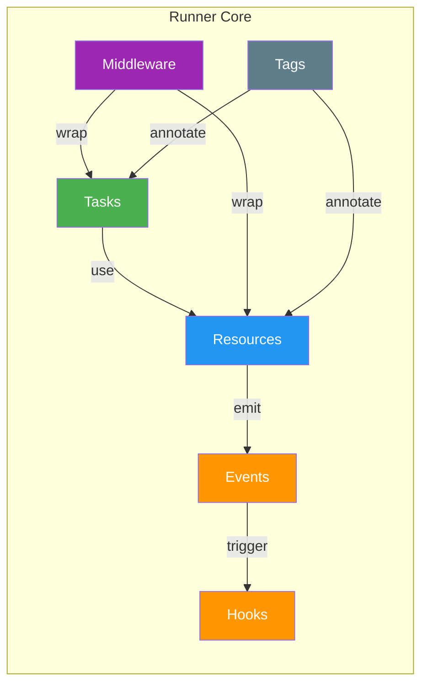
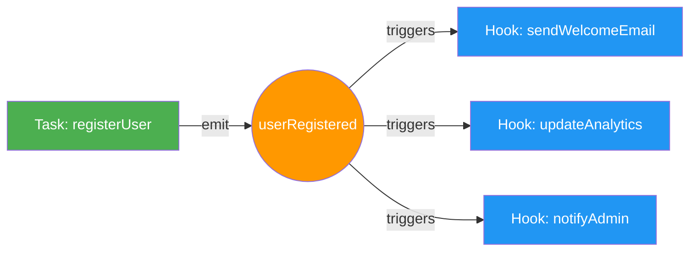
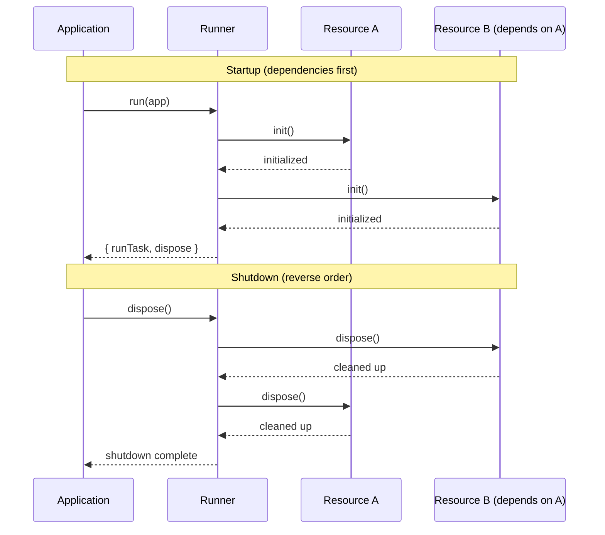

# BlueLibs Runner

### TypeScript-First Dependency Injection Framework

**Build enterprise applications that are maintainable, testable, and scalable**

<p align="center">
<a href="https://github.com/bluelibs/runner/actions/workflows/ci.yml"></a>
<a href="https://github.com/bluelibs/runner"></a>
<a href="https://bluelibs.github.io/runner/" target="_blank"></a>
<a href="https://www.npmjs.com/package/@bluelibs/runner"></a>
<a href="https://www.npmjs.com/package/@bluelibs/runner"></a>
</p>

```typescript
import { r, run } from "@bluelibs/runner";

// Define a task with dependencies, schema validation, and type-safe input/output
const createUser = r
  .task("users.create")
  .dependencies({ db, mailer })
  .inputSchema(z.object({ name: z.string(), email: z.string() }))
  .run(async (input, { db, mailer }) => {
    // type-safety infered from schema
    const user = await db.users.insert(input);
    await mailer.sendWelcome(user.email);
    return user;
  })
  .build();

// Compose resources and run your application
const app = r.resource("app").register([db, mailer, createUser]).build();
const runtime = await run(app);
```

**[ Documentation](https://bluelibs.github.io/runner/)** · **[ Examples](https://github.com/bluelibs/runner/tree/main/examples)** · **[ GitHub](https://github.com/bluelibs/runner)**

---

| Resource                                                                                                            | Type    | Description                         |
| ------------------------------------------------------------------------------------------------------------------- | ------- | ----------------------------------- |
| [Presentation Website](https://runner.bluelibs.com/)                                                                | Website | Overview and features               |
| [GitHub Repository](https://github.com/bluelibs/runner)                                                             | GitHub  | Source code, issues, and releases   |
| [Runner Dev Tools](https://github.com/bluelibs/runner-dev)                                                          | GitHub  | Development CLI and tooling         |
| [API Documentation](https://bluelibs.github.io/runner/)                                                             | Docs    | TypeDoc-generated reference         |
| [AI-Friendly Docs](https://github.com/bluelibs/runner/blob/main/AI.md)                                              | Docs    | Compact summary (<5000 tokens)      |
| [Migration Guide (3.x → 4.x)](https://github.com/bluelibs/runner/blob/main/readmes/MIGRATION.md)                    | Guide   | Step-by-step upgrade instructions   |
| [Design Documents](https://github.com/bluelibs/runner/blob/main/readmes)                                            | Docs    | Architecture notes and deep dives   |
| [Example: Express + OpenAPI + SQLite](https://github.com/bluelibs/runner/tree/main/examples/express-openapi-sqlite) | Example | REST API with OpenAPI specification |
| [Example: Fastify + MikroORM + PostgreSQL](https://github.com/bluelibs/runner/tree/main/examples/fastify-mikroorm)  | Example | Full-stack application with ORM     |
| [AI Chatbot](https://chatgpt.com/g/g-68b756abec648191aa43eaa1ea7a7945-runner)                                       | Chatbot | Interactive Q&A assistant           |

### Community & Policies

- [Code of Conduct](./CODE_OF_CONDUCT.md)
- [Contributing](./CONTRIBUTING.md)
- [Security](./SECURITY.md)

---

## Why Runner?

<table>
<tr>
<td width="50%" valign="top">

### The Problem

Modern dependency injection frameworks force difficult trade-offs:

- **Magic-heavy** — Decorators, reflection, and runtime tricks make debugging painful
- **Boilerplate-heavy** — Manual wiring and factory patterns slow development
- **Steep learning curves** — Months to become productive

The result is code that's hard to test, hard to understand, and hard to maintain:

```typescript
@Injectable()
@Transactional()
@Cacheable({ ttl: 60 })
export class UserService {
  constructor(
    private readonly db: Database,
    private readonly cache: Cache,
    private readonly logger: Logger,
    // ... more dependencies
  ) {}
}
```

</td>
<td width="50%" valign="top">

### The Solution

Runner provides a functional, explicit approach:

```typescript
const createUser = r
  .task("users.create")
  .dependencies({ db, logger })
  .run(async (input, { db, logger }) => {
    const user = await db.users.insert(input);
    logger.info("User created", { userId: user.id });
    return user;
  })
  .build();

// Easy to test with mock dependencies
await createUser.run(mockInput, { db: mockDb, logger: mockLogger });
```

**Benefits:**

- **Zero magic** — Plain functions and objects
- **Full type safety** — TypeScript inference throughout
- **Simple testing** — Unit tests run in milliseconds
- **Clear debugging** — Readable stack traces
- **Gradual adoption** — Integrate into existing projects

</td>
</tr>
</table>

**Design principles:** Functions over classes · Explicit over implicit · Simple over clever

---

## Table of Contents

**Getting Started**

- [Why Runner?](#why-runner) - The problem we solve
- [What Is This Thing?](#what-is-this-thing)
- [Show Me the Magic](#show-me-the-magic) - See it in action
- [How Does It Compare?](#how-does-it-compare) - vs. other frameworks
- [Performance at a Glance](#performance-at-a-glance) - Real benchmarks
- [What's in the Box?](#whats-in-the-box) - Feature matrix
- [Your First 5 Minutes](#your-first-5-minutes) - **Start here!**
- [Quick Start](#quick-start) - Full Express example
- [Learning Guide](#learning-guide) - Common patterns
- [Quick Wins](#quick-wins-copy-paste-solutions) - Copy-paste solutions
- [The Big Five](#the-big-five) - Core concepts

**Core Concepts**

- [Tasks](#tasks) - Functions with superpowers
- [Resources](#resources) - Singletons and lifecycle management
- [Events](#events) - Decoupled communication
- [Hooks](#hooks) - Lightweight event listeners
- [Middleware](#middleware) - Cross-cutting concerns
- [Tags](#tags) - Component discovery and configuration
- [Errors](#errors) - Typed error handling

**Runtime & Lifecycle**

- [run() and RunOptions](#run-and-runoptions) - Starting your application
- [Task Interceptors](#task-interceptors) - Advanced task control
- [Error Boundaries](#error-boundaries) - Fault isolation
- [Lifecycle Hooks](#lifecycle-hooks) - Graceful shutdown and cleanup

**Advanced Features**

- [Caching](#caching) - Built-in performance optimization
- [Retry](#retrying-failed-operations) - Resilience patterns
- [Timeouts](#timeouts) - Operation time limits
- [Logging](#logging) - Structured observability
- [Debug](#debug) - Development tooling

**Concurrency & Scheduling**

- [Semaphore](#semaphore) - Concurrency control
- [Queue](#queue) - Task scheduling

**Node-Specific Features** (see dedicated guides in `./readmes/`)

- [Durable Workflows](./readmes/DURABLE_WORKFLOWS.md) - Replay-safe, persistent workflows
- [HTTP Tunnels](./readmes/TUNNELS.md) - Remote task execution

**Architecture Patterns**

- [Optional Dependencies](#optional-dependencies) - Graceful degradation
- [Resource Forking](#resource-forking) - Multi-instance patterns
- [Serialization](#serialization) - Advanced data handling
- [Tunnels](#tunnels-bridging-runners) - Distributed systems
- [Async Context](#async-context) - Request-scoped state
- [Overrides](#overrides) - Component replacement
- [Namespacing](#namespacing) - Code organization
- [Factory Pattern](#factory-pattern) - Dynamic creation
- [Circular Dependencies](#handling-circular-dependencies) - Resolution strategies

**Developer Experience**

- [Quick Reference Cheat Sheet](#quick-reference-cheat-sheet) - **Bookmark this!**
- [Fluent Builders](#fluent-builders-r) - Ergonomic API
- [Type Helpers](#type-helpers) - TypeScript utilities
- [Runtime Validation](#runtime-validation) - Schema validation
- [Meta](#meta) - Component documentation
- [Testing](#testing) - Unit and integration patterns

**Reference**

- [Real-World Example](#real-world-example-the-complete-package) - Complete application
- [Internal Services](#internal-services) - Framework internals
- [Performance](#performance) - Benchmarks and metrics
- [Why Choose BlueLibs Runner?](#why-choose-bluelibs-runner) - Framework comparison
- [Migration Path](#the-migration-path) - Adopting Runner
- [Troubleshooting](#troubleshooting) - Common issues and solutions
- [Community & Support](#community--support) - Getting help

---
## What Is This Thing?

BlueLibs Runner is a TypeScript-first framework that embraces functional programming principles while keeping dependency injection simple enough that you won't need a flowchart to understand your own code. Think of it as the anti-framework framework – it gets out of your way and lets you build stuff that actually works.

### The Core

- **Tasks are functions** - Your business logic, nicely packaged with dependency injection
- **Resources are singletons** - Database connections, configs, services – things that live for your app's lifetime
- **Events are just events** - Decouple parts of your app so they can talk without tight coupling
- **Hooks are lightweight listeners** - React to events without the overhead of full tasks
- **Middleware** - Add cross-cutting concerns (logging, auth, caching) without cluttering your business logic
- **Everything is async** - Built for modern JavaScript/TypeScript
- **Explicit beats implicit** - You'll always know what's happening and why
- **Type-safe by default** - Catch mistakes at compile time, not at 3am in production

---

## Show Me the Magic

**Here's what "zero magic" looks like in practice:**

```typescript
import { r, globals } from "@bluelibs/runner";

// Built-in middleware from globals
const { cache, retry } = globals.middleware.task;

// ONE LINE to add caching with TTL
const getUser = r
  .task("users.get")
  .dependencies({ db })
  .middleware([cache.with({ ttl: 60000 })]) // ← That's it. 1 minute cache.
  .run(async (id, { db }) => db.query("SELECT * FROM users WHERE id = ?", id))
  .build();

// ONE LINE to add retry with exponential backoff
const callAPI = r
  .task("api.call")
  .middleware([retry.with({ retries: 3, backoff: "exponential" })]) // ← Auto-retry failures
  .run(async (url) => fetch(url))
  .build();

// Testing is actually pleasant
test("getUser works", async () => {
  const result = await getUser.run("user-123", { db: mockDb }); // ← Just call it
  expect(result.name).toBe("John");
});
```

**The magic? There isn't any.** It's just clean, composable functions.

---

## How Does It Compare?

| Feature               | Runner        | NestJS     | InversifyJS | TypeDI     | tsyringe   |
| --------------------- | ------------- | ---------- | ----------- | ---------- | ---------- |
| **Learning Curve**    | Gentle        | ️ Steep     | ️ Steep      | Moderate   | Moderate   |
| **Magic/Decorators**  | None          | Heavy      | Heavy       | Heavy      | Heavy      |
| **Bundle Size**       | Small         | Large      | Large       | Medium     | Medium     |
| **Type Safety**       | Perfect       | ️ Runtime   | ️ Runtime    | ️ Runtime   | ️ Runtime   |
| **Test Speed**        | Instant       | Slow       | Slow        | OK         | OK         |
| **Built-in Features** | Everything    | Everything | Basic DI    | Basic DI   | Basic DI   |
| **Framework Lock-in** | None          | Heavy      | Light       | Light      | Light      |
| **Functional Style**  | Native        | Awkward    | Awkward     | Class-only | Class-only |
| **Middleware**        | Built-in      | Built-in   | Manual      | Manual     | Manual     |
| **Events**            | Built-in      | Built-in   | Manual      | Manual     | Manual     |
| **Async Context**     | Built-in      | Manual     | Manual      | Manual     | Manual     |
| **Durable Workflows** | Built-in      | No         | No          | No         | No         |
| **HTTP Tunnels**      | Built-in      | No         | No          | No         | No         |
| **Debug Experience**  | Crystal clear | Confusing  | Confusing   | Confusing  | Confusing  |

**TL;DR:** Runner gives you the features of NestJS with the simplicity of plain functions.

---

## Performance at a Glance

**Runner is FAST.** Here are real benchmarks from an M1 Max:

```
┌─────────────────────────────────────┬───────────────┬──────────────┐
│ Operation                           │ Ops/Second    │ Time/Op      │
├─────────────────────────────────────┼───────────────┼──────────────┤
│ Basic task execution                │ 2.2M          │ ~0.0005 ms   │
│ Task with 5 middlewares             │ 244K          │ ~0.004 ms    │
│ Resource initialization             │ 59.7K         │ ~0.017 ms    │
│ Event emission + handling           │ 245K          │ ~0.004 ms    │
│ 10-level dependency chain           │ 8.4K          │ ~0.12 ms     │
│ Cache middleware (hit)              │ 8M            │ ~0.000125 ms │
└─────────────────────────────────────┴───────────────┴──────────────┘

Overhead Analysis:
├─ Middleware overhead:  ~0.00026 ms per middleware (virtually zero)
├─ DI overhead:         ~0.001 ms (compile-time safety pays off)
├─ Memory footprint:    ~3.3 MB per 100 components
└─ Cache speedup:       3.65x faster (automatic optimization)
```

**What this means for you:**

- **Instant feedback** - Tests run in milliseconds, not seconds
- **Lower cloud costs** - Handle more requests with fewer resources
- **Production ready** - Battle-tested at scale (see [Performance](#performance) for details)

> **Note:** Benchmarks will vary by hardware. These numbers show relative overhead, not absolute performance targets.

---

## What's in the Box?

Runner comes with **everything you need** to build production apps:

<table>
<tr>
<td width="33%" valign="top">

**Core Architecture**

- Dependency Injection
- Lifecycle Management
- Type-safe Everything
- Zero Configuration
- Multi-platform (Node/Browser)

</td>
<td width="33%" valign="top">

**Built-in Features**

- Caching (LRU + Custom)
- Retry with Backoff
- Timeouts
- Event System
- Middleware Pipeline
- Async Context
- Serialization (Dates, RegExp, Binary)
- HTTP Client Factory
- File Upload Support

</td>
<td width="33%" valign="top">

**Developer Experience**

- Fluent API
- Debug Tools
- Error Boundaries
- Testing Utilities
- TypeDoc Integration
- Full TypeScript Support
- Tree-shakable

</td>
</tr>
<tr>
<td width="33%" valign="top">

**Observability**

- Structured Logging
- Task Interceptors
- Event Tracking
- Performance Metrics
- Debug Mode

</td>
<td width="33%" valign="top">

**Production Ready**

- Graceful Shutdown
- Error Handling
- Typed Errors
- Optional Dependencies
- Semaphore/Queue
- Concurrency Control

</td>
<td width="33%" valign="top">

**Advanced Patterns**

- Durable Workflows (Node)
- Tunnels (Distributed)
- Tags System
- Factory Pattern
- Namespacing
- Overrides
- Meta/Documentation

</td>
</tr>
</table>

**No extra packages needed.** It's all included and works together seamlessly.

---
## Your First 5 Minutes

**New to Runner?** Here's the absolute minimum you need to know:

1. **Tasks** are your business logic functions
2. **Resources** are shared services (database, config, etc.)
3. **You compose them** using `r.resource()` and `r.task()`
4. **You run them** with `run(app)` which gives you `runTask()` and `dispose()`

That's it! Now let's see it in action:

---

## Quick Start

Let's start with the simplest possible example. Just copy this, run it, and you'll see Runner in action:

```bash
npm install @bluelibs/runner
```

```typescript
import { r, run } from "@bluelibs/runner";

// Step 1: Create a simple task (just a function with a name)
const greet = r
  .task("greet")
  .run(async (name: string) => `Hello, ${name}! `)
  .build();

// Step 2: Put it in a resource (think of it as your app container)
const app = r
  .resource("app")
  .register([greet]) // Tell the app about your task
  .build();

// Step 3: Run it!
const { runTask, dispose } = await run(app);

// Step 4: Use your task
const message = await runTask(greet, "World");
console.log(message); // "Hello, World! "

// Step 5: Clean up when done
await dispose();
```

That's it! You just:

1.  Created a task
2.  Registered it
3.  Ran it
4.  Cleaned up

**What you just learned**: The basic Runner pattern: Define → Register → Run → Execute. Everything else builds on this foundation.

**Next step**: See how this scales to real apps below.

### Building a Real Express Server

Now that you've seen the basics, let's build something real! Here's a complete Express API server with dependency injection, logging, and proper lifecycle management. (And yes, it's less code than most frameworks need for "Hello World" )

```bash
npm install @bluelibs/runner express zod
```

```typescript
import express from "express";
import { r, run, globals } from "@bluelibs/runner";
import { z } from "zod";

// A resource is anything you want to share across your app, a singleton
const server = r
  .resource<{ port: number }>("app.server")
  .init(
    async ({ port }) =>
      new Promise((resolve) => {
        const app = express();
        app.use(express.json());
        const listener = app.listen(port, () => {
          console.log(`Server running on port ${port}`);
          resolve({ app, listener });
        });
      }),
  )
  .dispose(async ({ listener }) => listener.close())
  .build();

// Tasks are your business logic - easily testable functions
const createUser = r
  .task("app.tasks.createUser")
  .dependencies({ server, logger: globals.resources.logger })
  .inputSchema(z.object({ name: z.string() }))
  .run(async (input, { logger }) => {
    await logger.info(`Creating ${input.name}`);
    return { id: "user-123", name: input.name };
  })
  .build();

// Wire everything together
const app = r
  .resource("app")
  .register([server.with({ port: 3000 }), createUser])
  .dependencies({ server, createUser })
  .init(async (_config, { server, createUser }) => {
    server.app.post("/users", async (req, res) => {
      const user = await createUser(req.body);
      res.json(user);
    });
  })
  .build();

// That's it! Each run is fully isolated
const runtime = await run(app);

// Use the runtime helpers
await runtime.runTask(createUser, { name: "Ada" });
await runtime.dispose();

// Want to see what's happening? Add debug logging:
// await run(app, { debug: "verbose" });
```

** What you just built:**

- A full Express API with proper lifecycle management
- Dependency injection (tasks get what they need automatically)
- Built-in logging (via `globals.resources.logger`)
- Schema validation with Zod
- Graceful shutdown (the `dispose()` method)
- Type-safe everything (TypeScript has your back)

**Note**: See how we used `r.task()` and `r.resource()`? That's the **fluent builder API** – the recommended way to build with Runner. It's chainable, type-safe, and reads like a story.

### Classic API (still supported)

Prefer fluent builders for new code, but the classic `define`-style API remains supported and can be mixed in the same app:

```ts
import { resource, task, run } from "@bluelibs/runner";

const db = resource({ id: "app.db", init: async () => "conn" });
const add = task({
  id: "app.tasks.add",
  run: async (i: { a: number; b: number }) => i.a + i.b,
});

const app = resource({ id: "app", register: [db, add] });
await run(app);
```

See [Fluent Builders](#fluent-builders-r) for migration tips and side‑by‑side patterns.

### Platform & Async Context

Runner auto-detects the platform (Node.js, browser, edge) and adapts behavior at runtime.

**Node-specific features:**

- [Async Context](#async-context) - Request-scoped state via `AsyncLocalStorage`
- [Durable Workflows](./readmes/DURABLE_WORKFLOWS.md) - Replay-safe, persistent workflows
- [HTTP Tunnels](./readmes/TUNNELS.md) - Remote task execution

---
## Learning Guide

### Common Patterns

Here are some patterns that'll help you write clean Runner code. We've seen lots of developers learn these the hard way, so let's save you some time! 

### Pattern 1: Not Everything Needs to Be a Task

When you're starting out, it's tempting to make everything a task. Here's the golden rule: **use regular functions for utilities, use tasks for business operations**.

```typescript
// Regular functions are perfect for utilities
const add = (a: number, b: number) => a + b;
const formatCurrency = (amount: number) => `$${amount.toFixed(2)}`;

// Tasks are great for business operations
const processOrder = r
  .task("app.processOrder")
  .run(async (input) => {
    const total = add(input.price, input.tax); // Use regular functions inside!
    return {
      orderId: input.id,
      total: formatCurrency(total),
      status: "processed",
    };
  })
  .build();
```

**Want detailed guidance?** See the [Tasks section](#tasks) below for a comprehensive breakdown of when to use tasks vs. functions.

### Pattern 2: The Right Way to Call Tasks

This one trips everyone up at first! Here's the pattern:

```typescript
// 1. Create your app container
const app = r
  .resource("app")
  .register([myTask]) // Register your tasks here
  .build();

// 2. Run the app to get the runtime
const { runTask, dispose } = await run(app);

// 3. Now you can execute tasks
const result = await runTask(myTask, { input: "data" });

// 4. Clean up when done
await dispose();
```

**Remember**: You `run()` the **app**, then you `runTask()` the **task**. Think of it like starting a car (run the app) before you can drive it (runTask).

### Pattern 3: Two Ways to Test

Runner gives you flexibility in testing:

```typescript
// Unit Testing: Call .run() directly with mocks
// This BYPASSES middleware - fast and isolated
test("calculateTotal", async () => {
  const result = await calculateTotal.run(
    { price: 100 },
    { taxService: mockTaxService }, // Mock dependencies
  );
  expect(result).toBe(110);
});

// Integration Testing: Use the full runtime
// This runs through the FULL pipeline including middleware
test("full order flow", async () => {
  const { runTask, dispose } = await run(app);
  const result = await runTask(processOrder, { orderId: "123" });
  expect(result.status).toBe("processed");
  await dispose();
});
```

**Tip**: Start with unit tests (faster, simpler), then add integration tests for critical flows. See [Testing](#testing) for more patterns.

### Pattern 4: Remember to Register

This is easy to forget when you're moving fast:

```typescript
// The complete pattern
const database = r
  .resource("db")
  .init(async () => connectToDB())
  .build();

const myTask = r
  .task("myTask")
  .dependencies({ database }) // Declare what you need
  .run(async (input, { database }) => {
    // Use it here
  })
  .build();

const app = r
  .resource("app")
  .register([
    database, // ← Don't forget to register!
    myTask,
  ])
  .build();
```

**Think of it this way**: `dependencies` says "I need these things" and `register` says "these things exist". Both are needed!

### Pattern 5: Configure Resources with `.with()`

Resources often need configuration. Use `.with()` to pass it:

```typescript
// Define the resource with a config type
const database = r
  .resource<{ connectionString: string }>("db")
  .init(async ({ connectionString }) => connect(connectionString))
  .build();

// Configure when registering
const app = r
  .resource("app")
  .register([database.with({ connectionString: "postgres://..." })])
  .build();
```

### Pattern 6: Built-in Globals

Runner provides commonly-used resources and middleware out of the box:

```typescript
import { globals } from "@bluelibs/runner";

const myTask = r
  .task("myTask")
  .dependencies({ logger: globals.resources.logger }) // Built-in logger
  .middleware([globals.middleware.task.cache.with({ ttl: 60000 })]) // Built-in cache
  .run(async (input, { logger }) => {
    await logger.info("Processing...");
  })
  .build();
```

See [Quick Wins](#quick-wins-copy-paste-solutions) for ready-to-use examples with globals.

---

### What's Next?

Now that you know the patterns, here's your learning path:

1. **[Quick Wins](#quick-wins-copy-paste-solutions)** - Copy-paste solutions for caching, retry, timeouts
2. **[The Big Five](#the-big-five)** - Deep dive into Tasks, Resources, Events, Middleware, Tags
3. **[Events & Hooks](#events)** - Decouple your app with event-driven patterns
4. **[Middleware](#middleware)** - Add cross-cutting concerns cleanly

---
## Quick Wins: Copy-Paste Solutions

**6 real-world problems, solved in minutes.** Just copy, customize, and ship.

### Add Caching to Any Task (with automatic invalidation)

```typescript
import { r, globals } from "@bluelibs/runner";

const getUser = r
  .task("users.get")
  .middleware([
    globals.middleware.task.cache.with({
      ttl: 60 * 1000, // 1 minute
      keyBuilder: (taskId, input) => `user:${input.id}`,
    }),
  ])
  .run(async (input: { id: string }) => {
    return await db.users.findOne({ id: input.id });
  })
  .build();

// First call: hits database
// Next 60 seconds: instant from cache
// After 60s: refreshes automatically
```

### Retry Failed API Calls (with exponential backoff)

```typescript
const callExternalAPI = r
  .task("api.external")
  .middleware([
    globals.middleware.task.retry.with({
      retries: 3,
      delayStrategy: (attempt) => 100 * Math.pow(2, attempt), // 100ms, 200ms, 400ms
      stopRetryIf: (error) => error.status === 404, // Don't retry not found
    }),
  ])
  .run(async (url: string) => {
    const response = await fetch(url);
    if (!response.ok) throw new Error(`HTTP ${response.status}`);
    return response.json();
  })
  .build();

// Automatically retries transient failures
// Gives up on permanent errors
```

### Add Request Timeouts (prevent hanging operations)

```typescript
const slowOperation = r
  .task("operations.slow")
  .middleware([
    globals.middleware.task.timeout.with({ ttl: 5000 }), // 5 second max
  ])
  .run(async () => {
    // This will throw TimeoutError if it takes > 5s
    return await someSlowDatabaseQuery();
  })
  .build();

// Combine with retry for robust error handling
const robustTask = r
  .task("operations.robust")
  .middleware([
    globals.middleware.task.retry.with({ retries: 3 }),
    globals.middleware.task.timeout.with({ ttl: 10000 }), // Each retry gets 10s
  ])
  .run(async () => await unreliableOperation())
  .build();
```

### Set Up Event-Driven Architecture (in 30 seconds)

```typescript
// Define your events
const userRegistered = r
  .event("users.registered")
  .payloadSchema<{ userId: string; email: string }>({ parse: (v) => v })
  .build();

// Emit events from tasks
const registerUser = r
  .task("users.register")
  .dependencies({ userRegistered })
  .run(async (input, { userRegistered }) => {
    const user = await createUserInDB(input);
    await userRegistered({ userId: user.id, email: user.email }); //  Emit!
    return user;
  })
  .build();

// React to events with hooks
const sendWelcomeEmail = r
  .hook("users.welcome")
  .on(userRegistered)
  .run(async (event) => {
    await emailService.send({
      to: event.data.email,
      subject: "Welcome!",
      body: "Thanks for joining!",
    });
  })
  .build();

// Automatically decoupled - no direct dependencies!
// Note: createUserInDB and emailService are your own implementations
```

### Prevent Race Conditions (per-process queue)

The built-in queue provides in-process named locks - no Redis needed, but only works within a single Node.js process.

```typescript
const writeConfig = r
  .task("config.write")
  .dependencies({ queue: globals.resources.queue })
  .run(async (input: { key: string; value: string }, { queue }) => {
    // Only one write per key at a time within this process
    return await queue.run(`config:${input.key}`, async () => {
      await fs.writeFile(
        `/config/${input.key}.json`,
        JSON.stringify(input.value),
      );
      return { written: true };
    });
  })
  .build();

// Same key? Queued. Different keys? Parallel.
```

### Add Structured Logging (with context)

```typescript
const processPayment = r
  .task("payments.process")
  .dependencies({ logger: globals.resources.logger })
  .run(async (input: { orderId: string; amount: number }, { logger }) => {
    // Logs are automatically structured and include task context
    await logger.info("Processing payment", {
      data: { orderId: input.orderId, amount: input.amount },
    });

    try {
      const result = await chargeCard(input);
      await logger.info("Payment successful", {
        data: { transactionId: result.id },
      });
      return result;
    } catch (error) {
      await logger.error("Payment failed", {
        error,
        data: { orderId: input.orderId, amount: input.amount },
      });
      throw error;
    }
  })
  .build();

// Logs include: timestamp, level, source (task ID), data, errors
// Perfect for production debugging!
```

### Wire It All Together

```typescript
import { r, run } from "@bluelibs/runner";

// After defining your tasks, events, and hooks...
const app = r
  .resource("app")
  .register([
    getUser, // cached task
    callExternalAPI, // retrying task
    registerUser, // event emitter
    userRegistered, // event definition
    sendWelcomeEmail, // hook listener
    processOrder, // queue-protected task
    processPayment, // logged task
  ])
  .build();

// Start the runtime
const { runTask, dispose } = await run(app);

// Execute tasks
const user = await runTask(getUser, { id: "123" });
const result = await runTask(registerUser, { email: "new@user.com" });

// Shutdown gracefully when done
await dispose();
```

**That's it!** Each of these patterns is production-ready. No configuration, no extra packages, just works.

---
## The Big Five

The framework is built around five core concepts: Tasks, Resources, Events, Middleware, and Tags. Understanding them is key to using the runner effectively.



### Tasks

Tasks are where your business logic lives. Think of them as **functions with superpowers** – they get automatic dependency injection, type safety, middleware support, and observability. Pretty cool, right?

Here's a complete example showing you everything:

```typescript
import { r, run } from "@bluelibs/runner";

// 1. Define your task - it's just a function with a name and dependencies
const sendEmail = r
  .task("app.tasks.sendEmail")
  .dependencies({ emailService, logger }) // What does this task need?
  .run(async (input, { emailService, logger }) => {
    // Your business logic here
    await logger.info(`Sending email to ${input.to}`);
    return emailService.send(input);
  })
  .build();

// 2. Wire it into your app
const app = r
  .resource("app")
  .register([emailService, logger, sendEmail]) // Tell the app about your components
  .build();

// 3. Run your app and get the runtime
const { runTask, dispose } = await run(app);

// 4. Execute your task - fully type-safe!
const result = await runTask(sendEmail, {
  to: "user@example.com",
  subject: "Hi",
  body: "Hello!",
});
```

**The Two Ways to Call Tasks:**

1. **In production/integration**: `runTask(task, input)` - Gets full DI, middleware, events, the works
2. **In unit tests**: `task.run(input, mockDeps)` - Direct call with your mock dependencies

```typescript
// Unit testing is straightforward
const testResult = await sendEmail.run(
  { to: "test@example.com", subject: "Test", body: "Testing!" },
  { emailService: mockEmailService, logger: mockLogger },
);
```

**When Should Something Be a Task?**

Here's a friendly guideline (not a strict rule!):

**Make it a task when:**

- It's a core business operation (user registration, order processing, payment handling)
- You need dependency injection (database, services, configs)
- You want middleware features (auth, caching, retry, timeouts)
- Multiple parts of your app need to use it
- You want observability (logging, monitoring, debugging)

  **Keep it as a regular function when:**

- It's a simple utility (date formatting, string manipulation, calculations)
- It's a pure function with no dependencies
- Performance is critical and you don't need framework features
- It's only used in one place

**Think of it this way**: Tasks are the "main actors" in your app – the functions that _do important things_. Regular functions are the supporting cast that help tasks do their job. Both are valuable!

### Resources

Resources are the long-lived parts of your app – things like database connections, configuration, services, and caches. They **initialize once when your app starts** and **clean up when it shuts down**. Think of them as the foundation your tasks build upon.

```typescript
import { r } from "@bluelibs/runner";

const database = r
  .resource("app.db")
  .init(async () => {
    const client = new MongoClient(process.env.DATABASE_URL as string);
    await client.connect();
    return client;
  })
  .dispose(async (client) => client.close())
  .build();

const userService = r
  .resource("app.services.user")
  .dependencies({ database })
  .init(async (_config, { database }) => ({
    async createUser(userData: UserData) {
      return database.collection("users").insertOne(userData);
    },
    async getUser(id: string) {
      return database.collection("users").findOne({ _id: id });
    },
  }))
  .build();
```

#### Resource Configuration

Resources can be configured with type-safe options. No more "config object of unknown shape" nonsense.

```typescript
type SMTPConfig = {
  smtpUrl: string;
  from: string;
};

const emailer = r
  .resource<{ smtpUrl: string; from: string }>("app.emailer")
  .init(async (config) => ({
    send: async (to: string, subject: string, body: string) => {
      // Use config.smtpUrl and config.from
    },
  }))
  .build();

// Register with specific config
const app = r
  .resource("app")
  .register([
    emailer.with({
      smtpUrl: "smtp://localhost",
      from: "noreply@myapp.com",
    }),
    // using emailer without with() will throw a type-error ;)
  ])
  .build();
```

#### Resource Forking

Use `.fork(newId)` to create multiple instances of a "template" resource with different identities. This is perfect when you need several instances of the same resource type (e.g., multiple database connections, multiple mailers):

```typescript
// Define a reusable template
const mailerBase = r
  .resource<{ smtp: string }>("base.mailer")
  .init(async (cfg) => ({
    send: (to: string) => console.log(`Sending via ${cfg.smtp}`),
  }))
  .build();

// Fork with distinct identities - export these for dependency use
export const txMailer = mailerBase.fork("app.mailers.transactional");
export const mktMailer = mailerBase.fork("app.mailers.marketing");

// Use forked resources as dependencies
const orderService = r
  .task("app.tasks.processOrder")
  .dependencies({ mailer: txMailer }) // ← uses forked identity
  .run(async (input, { mailer }) => {
    mailer.send(input.customerEmail);
  })
  .build();

const app = r
  .resource("app")
  .register([
    txMailer.with({ smtp: "tx.smtp.com" }),
    mktMailer.with({ smtp: "mkt.smtp.com" }),
    orderService,
  ])
  .build();
```

Key points:

- **`.fork()` returns a built `IResource`** - no need to call `.build()` again
- **Tags, middleware, and type parameters are inherited**
- **Each fork gets independent runtime** - no shared state
- **Export forked resources** to use them as typed dependencies

#### Optional Dependencies

Mark dependencies as optional when they may not be registered. The injected value will be `undefined` if the dependency is missing:

```typescript
const analyticsService = r
  .resource("app.analytics")
  .init(async () => ({ track: (event: string) => console.log(event) }))
  .build();

const myTask = r
  .task("app.tasks.doWork")
  .dependencies({
    analytics: analyticsService.optional(), // May be undefined
  })
  .run(async (input, { analytics }) => {
    // Safe to call only if registered
    analytics?.track("task.executed");
    return { done: true };
  })
  .build();
```

Optional dependencies work on tasks, resources, events, async contexts, and errors.

#### Private Context

For cases where you need to share variables between `init()` and `dispose()` methods (because sometimes cleanup is complicated), use the enhanced context pattern:

```typescript
const dbResource = r
  .resource("db.service")
  .context(() => ({
    connections: new Map<string, unknown>(),
    pools: [] as Array<{ drain(): Promise<void> }>,
  }))
  .init(async (_config, _deps, ctx) => {
    const db = await connectToDatabase();
    ctx.connections.set("main", db);
    ctx.pools.push(createPool(db));
    return db;
  })
  .dispose(async (_db, _config, _deps, ctx) => {
    for (const pool of ctx.pools) {
      await pool.drain();
    }
    for (const [, conn] of ctx.connections) {
      await (conn as { close(): Promise<void> }).close();
    }
  })
  .build();
```

### Events

Events let different parts of your app talk to each other without tight coupling. It's like having a really good office messenger who never forgets anything.



```typescript
import { r } from "@bluelibs/runner";

const userRegistered = r
  .event("app.events.userRegistered")
  .payloadSchema<{ userId: string; email: string }>({ parse: (value) => value })
  .build();
```

#### Parallel Event Execution

By default, hooks run sequentially in priority order. Use `.parallel(true)` on an event to enable concurrent execution within priority batches:

```typescript
const highVolumeEvent = r
  .event("app.events.highVolume")
  .payloadSchema<{ data: string }>({ parse: (v) => v })
  .parallel(true) // Listeners with same priority run concurrently
  .build();
```

**How parallel execution works:**

- Listeners are grouped by `.order()` priority
- Within each priority batch, listeners run concurrently
- Batches execute sequentially (lowest priority number first)
- If any listener throws, subsequent batches don't run
- `stopPropagation()` is checked between batches only

```typescript
const registerUser = r
  .task("app.tasks.registerUser")
  .dependencies({ userService, userRegistered })
  .run(async (input, { userService, userRegistered }) => {
    const user = await userService.createUser(input);
    await userRegistered({ userId: user.id, email: user.email });
    return user;
  })
  .build();

const sendWelcomeEmail = r
  .hook("app.hooks.sendWelcomeEmail")
  .on(userRegistered)
  .run(async (event) => {
    console.log(`Welcome email sent to ${event.data.email}`);
  })
  .build();
```

#### Wildcard Events

Sometimes you need to be the nosy neighbor of your application:

```typescript
const logAllEventsHook = r
  .hook("app.hooks.logAllEvents")
  .on("*")
  .run((event) => {
    console.log("Event detected", event.id, event.data);
  })
  .build();
```

#### Excluding Events from Global Listeners

Sometimes you have internal or system events that should not be picked up by wildcard listeners. Use the `excludeFromGlobalHooks` tag to prevent events from being sent to `"*"` listeners:

```typescript
import { r, globals } from "@bluelibs/runner";

// Internal event that won't be seen by global listeners
const internalEvent = r
  .event("app.events.internal")
  .tags([globals.tags.excludeFromGlobalHooks])
  .build();
```

**When to exclude events from global listeners:**

- High-frequency internal events (performance)
- System debugging events
- Framework lifecycle events
- Events that contain sensitive information
- Events meant only for specific components

#### Hooks

The modern way to listen to events is through hooks. They are lightweight event listeners, similar to tasks, but with a few key differences.

```typescript
const myHook = r
  .hook("app.hooks.myEventHandler")
  .on(userRegistered)
  .dependencies({ logger })
  .run(async (event, { logger }) => {
    await logger.info(`User registered: ${event.data.email}`);
  })
  .build();
```

#### Multiple Events (type-safe intersection)

Hooks can listen to multiple events by providing an array to `on`. The `run(event)` payload is inferred as the common (intersection-like) shape across all provided event payloads. Use the `onAnyOf()` helper to preserve tuple inference ergonomics, and `isOneOf()` as a convenient runtime/type guard when needed.

```typescript
import { r, onAnyOf, isOneOf } from "@bluelibs/runner";

const eUser = r
  .event("app.events.user")
  .payloadSchema<{ id: string; email: string }>({ parse: (v) => v })
  .build();
const eAdmin = r
  .event("app.events.admin")
  .payloadSchema<{ id: string; role: "admin" | "superadmin" }>({
    parse: (v) => v,
  })
  .build();
const eGuest = r
  .event("app.events.guest")
  .payloadSchema<{ id: string; guest: true }>({ parse: (v) => v })
  .build();

// The common field across all three is { id: string }
const auditUsers = r
  .hook("app.hooks.auditUsers")
  .on([eUser, eAdmin, eGuest])
  .run(async (ev) => {
    ev.data.id; // OK: common field inferred
    // ev.data.email; // TS error: not common to all
  })
  .build();

// Guard usage to refine at runtime (still narrows to common payload)
const auditSome = r
  .hook("app.hooks.auditSome")
  .on(onAnyOf([eUser, eAdmin])) // to get a combined event
  .run(async (ev) => {
    if (isOneOf(ev, [eUser, eAdmin])) {
      ev.data.id; // common field of eUser and eAdmin
    }
  })
  .build();
```

Notes:

- The common payload is computed structurally. Optional properties become optional if they are not present across all events.
- Wildcard `on: "*"` continues to accept any event and infers `any` payload.

Hooks are perfect for:

- Event-driven side effects
- Logging and monitoring
- Notifications and alerting
- Data synchronization
- Any reactive behavior

**Key differences from tasks:**

- Lighter weight - no middleware support
- Designed specifically for event handling

#### System Event

The framework exposes a minimal system-level event for observability:

```typescript
import { globals } from "@bluelibs/runner";

const systemReadyHook = r
  .hook("app.hooks.systemReady")
  .on(globals.events.ready)
  .run(async () => {
    console.log("System is ready and operational!");
  })
  .build();
```

Available system event:

- `globals.events.ready` - System has completed initialization
  // Note: use run({ onUnhandledError }) for unhandled error handling

#### stopPropagation()

Sometimes you need to prevent other event listeners from processing an event. The `stopPropagation()` method gives you fine-grained control over event flow:

```typescript
const criticalAlert = r
  .event("app.events.alert")
  .payloadSchema<{ severity: "low" | "medium" | "high" | "critical" }>({
    parse: (v) => v,
  })
  .meta({
    title: "System Alert Event",
    description: "Emitted when system issues are detected",
  })
  .build();

// High-priority handler that can stop propagation
const emergencyHandler = r
  .hook("app.hooks.emergencyHandler")
  .on(criticalAlert)
  .order(-100) // Higher priority (lower numbers run first)
  .run(async (event) => {
    console.log(`Alert received: ${event.data.severity}`);

    if (event.data.severity === "critical") {
      console.log("CRITICAL ALERT - Activating emergency protocols");

      // Stop other handlers from running
      event.stopPropagation();
      // Notify the on-call team, escalate, etc.

      console.log("Event propagation stopped - emergency protocols active");
    }
  })
  .build();
```

> **runtime:** "'A really good office messenger.' That’s me in rollerblades. You launch a 'userRegistered' flare and I sprint across the building, high‑fiving hooks and dodging middleware. `stopPropagation` is you sweeping my legs mid‑stride. Rude. Effective. Slightly thrilling."

### Middleware

Middleware wraps around your tasks and resources, adding cross-cutting concerns without polluting your business logic.

Note: Middleware is now split by target. Use `taskMiddleware(...)` for task middleware and `resourceMiddleware(...)` for resource middleware.

```typescript
import { r } from "@bluelibs/runner";

// Task middleware with config
type AuthMiddlewareConfig = { requiredRole: string };
const authMiddleware = r.middleware
  .task("app.middleware.task.auth")
  .run(async ({ task, next }, _deps, config: AuthMiddlewareConfig) => {
    // Must return the value
    return await next(task.input);
  })
  .build();

const adminTask = r
  .task("app.tasks.adminOnly")
  .middleware([authMiddleware.with({ requiredRole: "admin" })])
  .run(async (input) => "Secret admin data")
  .build();
```

For middleware with input/output contracts:

```typescript
// Middleware that enforces specific input and output types
type AuthConfig = { requiredRole: string };
type AuthInput = { user: { role: string } };
type AuthOutput = { user: { role: string; verified: boolean } };

const authMiddleware = r.middleware
  .task("app.middleware.task.auth")
  .run(async ({ task, next }, _deps, config: AuthConfig) => {
    if ((task.input as AuthInput).user.role !== config.requiredRole) {
      throw new Error("Insufficient permissions");
    }
    const result = await next(task.input);
    return {
      user: {
        ...(task.input as AuthInput).user,
        verified: true,
      },
    } as AuthOutput;
  })
  .build();

// For resources
const resourceAuthMiddleware = r.middleware
  .resource("app.middleware.resource.auth")
  .run(async ({ next }) => {
    // Resource middleware logic
    return await next();
  })
  .build();

const adminTask = r
  .task("app.tasks.adminOnly")
  .middleware([authMiddleware.with({ requiredRole: "admin" })])
  .run(async (input: { user: { role: string } }) => ({
    user: { role: input.user.role, verified: true },
  }))
  .build();
```

#### Global Middleware

Want to add logging to everything? Authentication to all tasks? Global middleware has your back:

```typescript
import { r, globals } from "@bluelibs/runner";

const logTaskMiddleware = r.middleware
  .task("app.middleware.log.task")
  .everywhere(() => true)
  .dependencies({ logger: globals.resources.logger })
  .run(async ({ task, next }, { logger }) => {
    logger.info(`Executing: ${String(task!.definition.id)}`);
    const result = await next(task!.input);
    logger.info(`Completed: ${String(task!.definition.id)}`);
    return result;
  })
  .build();
```

**Note:** A global middleware can depend on resources or tasks. However, any such resources or tasks will be excluded from the dependency tree (Task -> Middleware), and the middleware will not run for those specific tasks or resources. This approach gives middleware true flexibility and control.

#### Interception (advanced)

For advanced scenarios, you can intercept framework execution without relying on events:

- Event emissions: `eventManager.intercept((next, event) => Promise<void>)`
- Hook execution: `eventManager.interceptHook((next, hook, event) => Promise<any>)`
- Task middleware execution: `middlewareManager.intercept("task", (next, input) => Promise<any>)`
- Resource middleware execution: `middlewareManager.intercept("resource", (next, input) => Promise<any>)`
- Per-middleware interception: `middlewareManager.interceptMiddleware(mw, interceptor)`

Access `eventManager` via `globals.resources.eventManager` if needed.

#### Middleware Type Contracts

Middleware can enforce type contracts on the tasks that use them, ensuring data integrity as it flows through the system. This is achieved by defining `Input` and `Output` types within the middleware's implementation.

When a task uses this middleware, its own `run` method must conform to the `Input` and `Output` shapes defined by the middleware contract.

```typescript
import { r } from "@bluelibs/runner";

// 1. Define the contract types for the middleware.
type AuthConfig = { requiredRole: string };
type AuthInput = { user: { role: string } }; // Task's input must have this shape.
type AuthOutput = { executedBy: { role: string; verified: boolean } }; // Task's output must have this shape.

// 2. Create the middleware using these types in its `run` method.
const authMiddleware = r.middleware
  .task<AuthConfig, AuthInput, AuthOutput>("app.middleware.auth")
  .run(async ({ task, next }, _deps, config) => {
    const input = task.input;
    if (input.user.role !== config.requiredRole) {
      throw new Error("Insufficient permissions");
    }

    // The task runs, and its result must match AuthOutput.
    const result = await next(input);

    // The middleware can further transform the output.
    const output = result;
    return {
      ...output,
      executedBy: {
        ...output.executedBy,
        verified: true, // The middleware adds its own data.
      },
    };
  })
  .build();

// 3. Apply the middleware to a task.
const adminTask = r
  .task("app.tasks.adminOnly")
  // If you use multiple middleware with contracts they get combined.
  .middleware([authMiddleware.with({ requiredRole: "admin" })])
  // If you use .inputSchema() the input must contain the contract types otherwise you end-up with InputContractViolation error.
  // The `run` method is now strictly typed by the middleware's contract.
  // Its input must be `AuthInput`, and its return value must be `AuthOutput`.
  .run(async (input) => {
    // `input.user.role` is available and fully typed.
    console.log(`Task executed by user with role: ${input.user.role}`);

    // Returning a shape that doesn't match AuthOutput will cause a compile-time error.
    // return { wrong: "shape" }; // This would fail!
    return {
      executedBy: {
        role: input.user.role,
      },
    };
  })
  .build();
```

> **runtime:** "Ah, the onion pattern. A matryoshka doll made of promises. Every peel reveals… another logger. Another tracer. Another 'just a tiny wrapper'."

### Tags

Tags are metadata that can influence system behavior. Unlike meta properties, tags can be queried at runtime to build dynamic functionality. They can be simple strings or structured configuration objects.

#### Basic Usage

```typescript
import { r } from "@bluelibs/runner";

// Structured tags with configuration
const httpTag = r.tag<{ method: string; path: string }>("http.route").build();

const getUserTask = r
  .task("app.tasks.getUser")
  .tags([httpTag.with({ method: "GET", path: "/users/:id" })])
  .run(async (input) => getUserFromDatabase(input.id))
  .build();
```

#### Discovering Components by Tags

The core power of tags is runtime discovery. Use `store.getTasksWithTag()` to find components:

```typescript
import { r, globals } from "@bluelibs/runner";

// Auto-register HTTP routes based on tags
const routeRegistration = r
  .hook("app.hooks.registerRoutes")
  .on(globals.events.ready)
  .dependencies({ store: globals.resources.store, server: expressServer })
  .run(async (_event, { store, server }) => {
    // Find all tasks with HTTP tags
    const apiTasks = store.getTasksWithTag(httpTag);

    apiTasks.forEach((taskDef) => {
      const config = httpTag.extract(taskDef);
      if (!config) return;

      const { method, path } = config;
      server.app[method.toLowerCase()](path, async (req, res) => {
        const result = await taskDef({ ...req.params, ...req.body });
        res.json(result);
      });
    });

    // Also find by string tags
    const cacheableTasks = store.getTasksWithTag("cacheable");
    console.log(`Found ${cacheableTasks.length} cacheable tasks`);
  })
  .build();
```

#### Tag Extraction and Processing

```typescript
// Check if a tag exists and extract its configuration
const performanceTag = r
  .tag<{ warnAboveMs: number }>("performance.monitor")
  .build();

const performanceMiddleware = r.middleware
  .task("app.middleware.performance")
  .run(async ({ task, next }) => {
    // Check if task has performance monitoring enabled
    if (!performanceTag.exists(task.definition)) {
      return next(task.input);
    }

    // Extract the configuration
    const config = performanceTag.extract(task.definition)!;
    const startTime = Date.now();

    try {
      const result = await next(task.input);
      const duration = Date.now() - startTime;

      if (duration > config.warnAboveMs) {
        console.warn(`Task ${task.definition.id} took ${duration}ms`);
      }

      return result;
    } catch (error) {
      const duration = Date.now() - startTime;
      console.error(`Task failed after ${duration}ms`, error);
      throw error;
    }
  })
  .build();
```

#### System Tags

Built-in tags for framework behavior:

```typescript
import { r, globals } from "@bluelibs/runner";

const internalTask = r
  .task("app.internal.cleanup")
  .tags([
    globals.tags.system, // Excludes from debug logs
    globals.tags.debug.with({ logTaskInput: true }), // Per-component debug config
  ])
  .run(async () => performCleanup())
  .build();

const internalEvent = r
  .event("app.events.internal")
  .tags([globals.tags.excludeFromGlobalHooks]) // Won't trigger wildcard listeners
  .build();
```

#### Contract Tags

Enforce return value shapes at compile time:

```typescript
// Tags that enforce type contracts input/output for tasks or config/value for resources
type InputType = { id: string };
type OutputType = { name: string };
const userContract = r
  // void = no config, no need for .with({ ... })
  .tag<void, InputType, OutputType>("contract.user")
  .build();

const profileTask = r
  .task("app.tasks.getProfile")
  .tags([userContract]) // Must return { name: string }
  .run(async (input) => ({ name: input.id + "Ada" })) //  Satisfies contract
  .build();
```

### Errors

Typed errors can be declared once and injected anywhere. Register them alongside other items and consume via dependencies. The injected value is the error helper itself, exposing `.throw()`, `.is()`, `.toString()`, and `id`.

```ts
import { r } from "@bluelibs/runner";

// Fluent builder for errors
const userNotFoundError = r
  .error<{ code: number; message: string }>("app.errors.userNotFound")
  .dataSchema(z.object({ ... }))
  .build();

const getUser = r
  .task("app.tasks.getUser")
  .dependencies({ userNotFoundError })
  .run(async (input, { userNotFoundError }) => {
    userNotFoundError.throw({ code: 404, message: `User ${input} not found` });
  })
  .build();

const app = r.resource("app").register([userNotFoundError, getUser]).build();
```

Error data must include a `message: string`. The thrown `Error` has `name = id` and `message = data.message` for predictable matching and logging.

```ts
try {
  userNotFoundError.throw({ code: 404, message: "User not found" });
} catch (err) {
  if (userNotFoundError.is(err)) {
    // err.name === "app.errors.userNotFound", err.message === "User not found"
    console.log(`Caught error: ${err.name} - ${err.message}`);
  }
}
```

---

### Beyond the Big Five

The core concepts above cover most use cases. For specialized features:

- **Async Context**: Per-request/thread-local state via `r.asyncContext()`. See [Async Context](#async-context) for Node.js `AsyncLocalStorage` patterns.
- **Durable Workflows** (Node-only): Replay-safe primitives like `ctx.step()`, `ctx.sleep()`, and `ctx.waitForSignal()`. See [Durable Workflows](./readmes/DURABLE_WORKFLOWS.md).
- **HTTP Tunnels**: Expose tasks over HTTP or call remote Runners. See [Tunnels](./readmes/TUNNELS.md).
- **Serialization**: Custom type serialization for Dates, RegExp, binary, and custom shapes. See [Serializer Protocol](./readmes/SERIALIZER_PROTOCOL.md).

---
## Quick Reference: Cheat Sheet

**Bookmark this section for quick lookups!**

### Creating Components

```typescript
// Task - Basic
const myTask = r
  .task("id")
  .run(async (input) => result)
  .build();

// Task - With Dependencies
const myTask = r
  .task("id")
  .dependencies({ db, logger })
  .run(async (input, { db, logger }) => result)
  .build();

// Task - With Middleware
const myTask = r
  .task("id")
  .middleware([cache.with({ ttl: 60000 }), retry.with({ retries: 3 })])
  .run(async (input) => result)
  .build();

// Resource - Basic
const myResource = r
  .resource("id")
  .init(async () => ({ value: "something" }))
  .build();

// Resource - With Lifecycle
const myResource = r
  .resource("id")
  .init(async () => connection)
  .dispose(async (connection) => connection.close())
  .build();

// Event
const myEvent = r
  .event("id")
  .payloadSchema<{ data: string }>({ parse: (v) => v })
  .build();

// Hook
const myHook = r
  .hook("id")
  .on(myEvent)
  .run(async (event) => console.log(event.data))
  .build();
```

### Running Your App

```typescript
// Basic
const { runTask, dispose } = await run(app);

// With options
const { runTask, dispose } = await run(app, {
  debug: "verbose", // "normal" | "verbose" | "off"
  onUnhandledError: (error) => console.error(error),
});

// Execute tasks
const result = await runTask(myTask, input);

// Cleanup
await dispose();
```

### Testing Patterns

```typescript
// Unit Test - Direct call
const result = await myTask.run(input, { db: mockDb, logger: mockLogger });

// Integration Test - Full runtime
const { runTask, dispose } = await run(testApp);
const result = await runTask(myTask, input);
await dispose();
```

### Built-in Middleware

```typescript
import { globals } from "@bluelibs/runner";

// Cache
globals.middleware.task.cache.with({
  ttl: 60000, // milliseconds
  keyBuilder: (taskId, input) => `${taskId}:${input.id}`,
});

// Retry
globals.middleware.task.retry.with({
  retries: 3,
  delayStrategy: (attempt) => 100 * Math.pow(2, attempt),
  stopRetryIf: (error) => error.permanent,
});

// Timeout
globals.middleware.task.timeout.with({ ttl: 5000 });
```

### ️ Common Patterns

```typescript
// Register components
const app = r.resource("app")
  .register([task1, task2, resource1])
  .build();

// With dependencies
const app = r.resource("app")
  .register([db, logger])
  .dependencies({ db, logger })
  .init(async (_config, { db, logger }) => {
    // Use dependencies
  })
  .build();

// With configuration
const server = r.resource<{ port: number }>("server")
  .init(async ({ port }) => startServer(port))
  .build();

const app = r.resource("app")
  .register([server.with({ port: 3000 })])
  .build();

// Emit events
await myEvent({ data: "value" });

// Global logging
const task = r.task("id")
  .dependencies({ logger: globals.resources.logger })
  .run(async (input, { logger }) => {
    await logger.info("message", { data: {...} });
  })
  .build();
```

### Type Helpers

```typescript
import type { TaskInput, TaskOutput, ResourceValue } from "@bluelibs/runner";

type Input = TaskInput<typeof myTask>; // Get task input type
type Output = TaskOutput<typeof myTask>; // Get task output type
type Value = ResourceValue<typeof myResource>; // Get resource value type
```

### Performance Tips

```typescript
//  Use caching for expensive operations
.middleware([cache.with({ ttl: 60000 })])

//  Add timeouts to external calls
.middleware([timeout.with({ ttl: 5000 })])

//  Retry transient failures
.middleware([retry.with({ retries: 3 })])

//  Use events for decoupling
await userRegistered({ userId, email });

//  Keep tasks focused (single responsibility)
const getUserTask = r.task("users.get")...  //  One thing
const createUserTask = r.task("users.create")... //  One thing
```

### Debugging

```typescript
// Enable debug logging
await run(app, { debug: "verbose" });

// Add per-component debug
const task = r.task("id")
  .tags([globals.tags.debug.with({ logTaskInput: true, logTaskResult: true })])
  .run(...)
  .build();

// Access logger
.dependencies({ logger: globals.resources.logger })
```

### Concurrency Utilities

```typescript
import { Semaphore, Queue } from "@bluelibs/runner";

// Semaphore - limit concurrent operations
const sem = new Semaphore(3); // max 3 concurrent
await sem.acquire();
try {
  await doWork();
} finally {
  sem.release();
}

// Queue - sequential task processing
const queue = new Queue();
await queue.add(async () => {
  /* runs in order */
});
await queue.add(async () => {
  /* waits for previous */
});
```

---
## run() and RunOptions

The `run()` function boots a root `resource` and returns a `RunResult` handle to interact with your system.

Basic usage:

```ts
import { r, run } from "@bluelibs/runner";

const ping = r
  .task("ping.task")
  .run(async () => "pong")
  .build();

const app = r
  .resource("app")
  .register([ping])
  .init(async () => "ready")
  .build();

const result = await run(app);
console.log(result.value); // "ready"
await result.dispose();
```

What `run()` returns:

| Property                | Description                                                        |
| ----------------------- | ------------------------------------------------------------------ |
| `value`                 | Value returned by root resource’s `init()`                         |
| `runTask(...)`          | Run a task by reference or string id                               |
| `emitEvent(...)`        | Emit events                                                        |
| `getResourceValue(...)` | Read a resource’s value                                            |
| `logger`                | Logger instance                                                    |
| `store`                 | Runtime store with registered resources, tasks, middleware, events |
| `dispose()`             | Gracefully dispose resources and unhook listeners                  |

### RunOptions

Pass as the second argument to `run(root, options)`.

| Option             | Type                    | Description                                                                                                                                                                                                                   |
| ------------------ | ----------------------- | ----------------------------------------------------------------------------------------------------------------------------------------------------------------------------------------------------------------------------- |
| `debug`            | `"normal" or "verbose"` | Enables debug resource to log runner internals. `"normal"` logs lifecycle events, `"verbose"` adds input/output. Can also be a partial config object for fine-grained control.                                                |
| `logs`             | `object`                | Configures logging. `printThreshold` sets the minimum level to print (default: "info"). `printStrategy` sets the format (`pretty`, `json`, `json-pretty`, `plain`). `bufferLogs` holds logs until initialization is complete. |
| `errorBoundary`    | `boolean`               | (default: `true`) Installs process-level safety nets (`uncaughtException`/`unhandledRejection`) and routes them to `onUnhandledError`.                                                                                        |
| `shutdownHooks`    | `boolean`               | (default: `true`) Installs `SIGINT`/`SIGTERM` listeners to call `dispose()` for graceful shutdown.                                                                                                                            |
| `onUnhandledError` | `(err, ctx) => void`    | Custom handler for unhandled errors captured by the boundary.                                                                                                                                                                 |
| `dryRun`           | `boolean`               | Skips runtime initialization but fully builds and validates the dependency graph. Useful for CI smoke tests. `init()` is not called.                                                                                          |

```ts
const result = await run(app, { dryRun: true });
// result.value is undefined (root not initialized)
// You can inspect result.store.resources / result.store.tasks
await result.dispose();
```

### Patterns

- Minimal boot:

```ts
await run(app);
```

- Debugging locally:

```ts
await run(app, { debug: "normal", logs: { printThreshold: "debug" } });
```

- Verbose investigations:

```ts
await run(app, { debug: "verbose", logs: { printStrategy: "json-pretty" } });
```

- CI validation (no side effects):

```ts
await run(app, { dryRun: true });
```

- Custom process error routing:

```ts
await run(app, {
  errorBoundary: true,
  onUnhandledError: (err) => report(err),
});
```

## Task Interceptors

_Resources can dynamically modify task behavior during initialization_

Task interceptors (`task.intercept()`) are the modern replacement for component lifecycle events, allowing resources to dynamically modify task behavior without tight coupling.

```typescript
import { r, run } from "@bluelibs/runner";

const calculatorTask = r
  .task("app.tasks.calculator")
  .run(async (input: { value: number }) => {
    console.log("3. Task is running...");
    return { result: input.value + 1 };
  })
  .build();

const interceptorResource = r
  .resource("app.interceptor")
  .dependencies({ calculatorTask })
  .init(async (_config, { calculatorTask }) => {
    // Intercept the task to modify its behavior
    calculatorTask.intercept(async (next, input) => {
      console.log("1. Interceptor before task run");
      const result = await next(input);
      console.log("4. Interceptor after task run");
      return { ...result, intercepted: true };
    });
  })
  .build();

const app = r
  .resource("app")
  .register([calculatorTask, interceptorResource])
  .dependencies({ calculatorTask })
  .init(async (_config, { calculatorTask }) => {
    console.log("2. Calling the task...");
    const result = await calculatorTask({ value: 10 });
    console.log("5. Final result:", result);
    // Final result: { result: 11, intercepted: true }
  })
  .build();

await run(app);
```

> **runtime:** "'Modern replacement for lifecycle events.' Adorable rebrand for 'surgical monkey‑patching.' You’re collapsing the waveform of a task at runtime and I’m Schrödinger’s runtime, praying the cat hasn’t overridden `run()` with `throw new Error('lol')`."
## Optional Dependencies

_Making your app resilient when services aren't available_

Sometimes you want your application to gracefully handle missing dependencies instead of crashing. Optional dependencies let you build resilient systems that degrade gracefully.

Keep in mind that you have full control over dependency registration by functionalising `dependencies(config) => ({ ... })` and `register(config) => []`.

```typescript
import { r } from "@bluelibs/runner";

const emailService = r
  .resource("app.services.email")
  .init(async () => new EmailService())
  .build();

const paymentService = r
  .resource("app.services.payment")
  .init(async () => new PaymentService())
  .build();

const userRegistration = r
  .task("app.tasks.registerUser")
  .dependencies({
    database: userDatabase, // Required - will fail if not available
    emailService: emailService.optional(), // Optional - won't fail if missing
    analytics: analyticsService.optional(), // Optional - graceful degradation
  })
  .run(async (input, { database, emailService, analytics }) => {
    // Create user (required)
    const user = await database.users.create(userData);

    // Send welcome email (optional)
    if (emailService) {
      await emailService.sendWelcome(user.email);
    }

    // Track analytics (optional)
    if (analytics) {
      await analytics.track("user.registered", { userId: user.id });
    }

    return user;
  })
  .build();
```

**When to use optional dependencies:**

- External services that might be down
- Feature flags and A/B testing services
- Analytics and monitoring services
- Non-critical third-party integrations
- Development vs production service differences

**Benefits:**

- Graceful degradation instead of crashes
- Better resilience in distributed systems
- Easier testing with partial mocks
- Smoother development environments

> **runtime:** "Graceful degradation: your app quietly limps with a brave smile. I’ll juggle `undefined` like a street performer while your analytics vendor takes a nap. Please clap when I keep the lights on using the raw power of conditional chaining."

### Serialization

Runner ships with a graph-aware serializer that safely round-trips complex values across HTTP and between Node and the browser.

**Built-in type support:**

- `Date`, `RegExp`, `Map`, `Set`, `Error`, `Uint8Array` work out of the box
- Handles circular references and shared object identity

**Two modes:**

- `stringify()`/`parse()` — Tree mode (like JSON, throws on circular refs)
- `serialize()`/`deserialize()` — Graph mode (preserves circular refs and identity)

**Security hardened:**

- ReDoS protection validates RegExp patterns against catastrophic backtracking
- Prototype pollution blocked (`__proto__`, `constructor`, `prototype` keys filtered)
- Configurable depth limits prevent stack overflow

```ts
import { r, globals, getDefaultSerializer } from "@bluelibs/runner";

// Access via DI
const serializerSetup = r
  .resource("app.serialization.setup")
  .dependencies({ serializer: globals.resources.serializer })
  .init(async (_config, { serializer }) => {
    // Tree mode (simple)
    const text = serializer.stringify({ when: new Date() });
    const obj = serializer.parse<{ when: Date }>(text);

    // Graph mode (preserves refs)
    const a = { name: "A" };
    const b = { ref: a, self: null as any };
    b.self = b; // circular
    const json = serializer.serialize(b);
    const restored = serializer.deserialize(json); // refs preserved!

    // Custom types via factory
    class Distance {
      constructor(
        public value: number,
        public unit: string,
      ) {}
      toJSONValue() {
        return { value: this.value, unit: this.unit };
      }
      typeName() {
        return "Distance";
      }
    }
    serializer.addType("Distance", (j: any) => new Distance(j.value, j.unit));
  })
  .build();

// Standalone (outside DI)
const serializer = getDefaultSerializer();
```

**Configuration options (via `new Serializer(options)`):**

- `maxDepth` — Recursion limit (default: 1000)
- `allowedTypes` — Whitelist of type IDs for deserialization
- `maxRegExpPatternLength` — Limit pattern length (default: 1024)
- `allowUnsafeRegExp` — Skip ReDoS validation (default: false)

> **Note:** File uploads use the tunnel layer's multipart handling, not the serializer. Use `createWebFile`/`createNodeFile` for uploads.

### Tunnels: Bridging Runners

Tunnels are a powerful feature for building distributed systems. They let you expose your tasks and events over HTTP, making them callable from other processes, services, or even a browser UI. This allows a server and client to co-exist, enabling one Runner instance to securely call another.

Here's a sneak peek of how you can expose your application and configure a client tunnel to consume a remote Runner:

```typescript
import { r, globals } from "@bluelibs/runner";
import { nodeExposure } from "@bluelibs/runner/node";

let app = r.resource("app");

if (process.env.SERVER) {
  // 1. Expose your local tasks and events over HTTP, only when server mode is active.
  app.register([
    // ... your tasks and events
    nodeExposure.with({
      http: {
        basePath: "/__runner",
        listen: { port: 7070 },
      },
    }),
  ]);
}
app = app.build();

// 2. In another app, define a tunnel resource to call a remote Runner
const remoteTasksTunnel = r
  .resource("app.tunnels.http")
  .tags([globals.tags.tunnel])
  .dependencies({ createClient: globals.resources.httpClientFactory })
  .init(async (_, { createClient }) => ({
    mode: "client", // or "server", or "none", or "both" for emulating network infrastructure
    transport: "http", // the only one supported for now
    // Selectively forward tasks starting with "remote.tasks."
    tasks: (t) => t.id.startsWith("remote.tasks."),
    client: createClient({
      url: "http://remote-runner:8080/__runner",
    }),
  }))
  .build();
```

This is just a glimpse. With tunnels, you can build microservices, CLIs, and admin panels that interact with your main application securely and efficiently.

For a deep dive into streaming, authentication, file uploads, and more, check out the [full Tunnels documentation](./readmes/TUNNELS.md).
## Async Context

Async Context provides per-request/thread-local state via the platform's `AsyncLocalStorage` (Node). Use the fluent builder under `r.asyncContext` to create contexts that can be registered and injected as dependencies.

> ️ **Platform Note**: `AsyncLocalStorage` is a **Node.js-only** feature. In browsers and edge runtimes, async context is not available. If you need request-scoped state in browsers, consider passing context explicitly through function parameters or using a state management solution.

```typescript
import { r } from "@bluelibs/runner";

const requestContext = r
  .asyncContext<{ requestId: string }>("app.ctx.request")
  // below is optional
  .configSchema(z.object({ ... }))
  .serialize((data) => JSON.stringify(data))
  .parse((raw) => JSON.parse(raw))
  .build();

// Provide and read within an async boundary
await requestContext.provide({ requestId: "abc" }, async () => {
  const ctx = requestContext.use(); // { requestId: "abc" }
});

// Require middleware for tasks that need the context
const requireRequestContext = requestContext.require();
```

- If you don't provide `serialize`/`parse`, Runner uses its default serializer to preserve Dates, RegExp, etc.
- A legacy `createContext(name?)` exists for backwards compatibility; prefer `r.asyncContext` or `asyncContext({ id })`.

- You can also inject async contexts as dependencies; the injected value is the helper itself. Contexts must be registered to be used.

```typescript
const whoAmI = r
  .task("app.tasks.whoAmI")
  .dependencies({ requestContext })
  .run(async (_input, { requestContext }) => requestContext.use().requestId)
  .build();

const app = r.resource("app").register([requestContext, whoAmI]).build();
```
## Fluent Builders (`r.*`)

For a more ergonomic and chainable way to define your components, Runner offers a fluent builder API under the `r` namespace. These builders are fully type-safe, improve readability for complex definitions, and compile to the standard Runner definitions with zero runtime overhead.

Here’s a quick taste of how it looks, with and without `zod` for validation:

```typescript
import { r, run } from "@bluelibs/runner";
import { z } from "zod";

// With Zod, the config type is inferred automatically
const emailerConfigSchema = z.object({
  smtpUrl: z.string().url(),
  from: z.string().email(),
});

const emailer = r
  .resource("app.emailer")
  .configSchema(emailerConfigSchema)
  .init(async ({ config }) => ({
    send: (to: string, body: string) => {
      console.log(
        `Sending from ${config.from} to ${to} via ${config.smtpUrl}: ${body}`,
      );
    },
  }))
  .build();

// Without a schema library, you can provide the type explicitly
const greeter = r
  .resource("app.greeter")
  .init(async (cfg: { name: string }) => ({
    greet: () => `Hello, ${cfg.name}!`,
  }))
  .build();

const app = r
  .resource("app")
  .register([
    emailer.with({
      smtpUrl: "smtp://example.com",
      from: "noreply@example.com",
    }),
    greeter.with({ name: "World" }),
  ])
  .dependencies({ emailer, greeter })
  .init(async (_, { emailer, greeter }) => {
    console.log(greeter.greet());
    emailer.send("test@example.com", "This is a test.");
  })
  .build();

await run(app);
```

The builder API provides a clean, step-by-step way to construct everything from simple tasks to complex resources with middleware, tags, and schemas.

For a complete guide and more examples, check out the [full Fluent Builders documentation](./readmes/FLUENT_BUILDERS.md).
## Type Helpers

These utility types help you extract the generics from tasks, resources, and events without re-declaring them. Import them from `@bluelibs/runner`.

```ts
import { r } from "@bluelibs/runner";
import type {
  ExtractTaskInput,
  ExtractTaskOutput,
  ExtractResourceConfig,
  ExtractResourceValue,
  ExtractEventPayload,
} from "@bluelibs/runner";

// Task example
const add = r
  .task("calc.add")
  .run(async (input: { a: number; b: number }) => input.a + input.b)
  .build();

type AddInput = ExtractTaskInput<typeof add>; // { a: number; b: number }
type AddOutput = ExtractTaskOutput<typeof add>; // number

// Resource example
const config = r
  .resource("app.config")
  .init(async (cfg: { baseUrl: string }) => ({ baseUrl: cfg.baseUrl }))
  .build();

type ConfigInput = ExtractResourceConfig<typeof config>; // { baseUrl: string }
type ConfigValue = ExtractResourceValue<typeof config>; // { baseUrl: string }

// Event example
const userRegistered = r
  .event("app.events.userRegistered")
  .payloadSchema<{ userId: string; email: string }>({ parse: (v) => v })
  .build();
type UserRegisteredPayload = ExtractEventPayload<typeof userRegistered>; // { userId: string; email: string }
```

### Context with Middleware

Context shines when combined with middleware for request-scoped data:

```typescript
import { r } from "@bluelibs/runner";
import { randomUUID } from "crypto";

const requestContext = r
  .asyncContext<{
    requestId: string;
    startTime: number;
    userAgent?: string;
  }>("app.requestContext")
  .build();

const requestMiddleware = r.middleware
  .task("app.middleware.request")
  .run(async ({ task, next }) => {
    // This works even in express middleware if needed.
    return requestContext.provide(
      {
        requestId: randomUUID(),
        startTime: Date.now(),
        userAgent: "MyApp/1.0",
      },
      async () => {
        return next(task?.input);
      },
    );
  })
  .build();

const handleRequest = r
  .task("app.handleRequest")
  .middleware([requestMiddleware])
  .run(async (input: { path: string }) => {
    const request = requestContext.use();
    console.log(`Processing ${input.path} (Request ID: ${request.requestId})`);
    return { success: true, requestId: request.requestId };
  })
  .build();
```

> **runtime:** "Context: global state with manners. You invented a teleporting clipboard for data and called it 'nice.' Forget to `provide()` once and I’ll unleash the 'Context not available' banshee scream exactly where your logs are least helpful."
## System Shutdown Hooks

_Graceful shutdown and cleanup when your app needs to stop_

The framework includes built-in support for graceful shutdowns with automatic cleanup and configurable shutdown hooks:



```typescript
import { run } from "@bluelibs/runner";

// Enable shutdown hooks (default: true in production)
const { dispose, taskRunner, eventManager } = await run(app, {
  shutdownHooks: true, // Automatically handle SIGTERM/SIGINT
  errorBoundary: true, // Catch unhandled errors and rejections
});

// Manual graceful shutdown
process.on("SIGTERM", async () => {
  console.log("Received SIGTERM, shutting down gracefully...");
  await dispose(); // This calls all resource dispose() methods
  process.exit(0);
});

// Resources with cleanup logic
const databaseResource = r
  .resource("app.database")
  .init(async () => {
    const connection = await connectToDatabase();
    console.log("Database connected");
    return connection;
  })
  .dispose(async (connection) => {
    await connection.close();
    // console.log("Database connection closed");
  })
  .build();

const serverResource = r
  .resource("app.server")
  .dependencies({ database: databaseResource })
  .init(async (config: { port: number }, { database }) => {
    const server = express().listen(config.port);
    console.log(`Server listening on port ${config.port}`);
    return server;
  })
  .dispose(async (server) => {
    return new Promise<void>((resolve) => {
      server.close(() => {
        console.log("Server closed");
        resolve();
      });
    });
  })
  .build();
```

### Error Boundary Integration

The framework can automatically handle uncaught exceptions and unhandled rejections:

```typescript
const { dispose, logger } = await run(app, {
  errorBoundary: true, // Catch process-level errors
  shutdownHooks: true, // Graceful shutdown on signals
  onUnhandledError: async ({ error, kind, source }) => {
    // We log it by default
    await logger.error(`Unhandled error: ${error && error.toString()}`);
    // Optionally report to telemetry or decide to dispose/exit
  },
});
```

> **runtime:** "You summon a 'graceful shutdown' with Ctrl‑C like a wizard casting Chill Vibes. Meanwhile I’m speed‑dating every socket, timer, and file handle to say goodbye before the OS pulls the plug. `dispose()`: now with 30% more dignity."

## Unhandled Errors

The `onUnhandledError` callback is invoked by Runner whenever an error escapes normal handling. It receives a structured payload you can ship to logging/telemetry and decide mitigation steps.

```typescript
type UnhandledErrorKind =
  | "process" // uncaughtException / unhandledRejection
  | "task" // task.run threw and wasn't handled
  | "middleware" // middleware threw and wasn't handled
  | "resourceInit" // resource init failed
  | "hook" // hook.run threw and wasn't handled
  | "run"; // failures in run() lifecycle

interface OnUnhandledErrorInfo {
  error: unknown;
  kind?: UnhandledErrorKind;
  source?: string; // additional origin hint (ex: "uncaughtException")
}

type OnUnhandledError = (info: OnUnhandledErrorInfo) => void | Promise<void>;
```

Default behavior (when not provided) logs the normalized error via the created `logger` at `error` level. Provide your own handler to integrate with tools like Sentry/PagerDuty or to trigger shutdown strategies.

Example with telemetry and conditional shutdown:

```typescript
await run(app, {
  errorBoundary: true,
  onUnhandledError: async ({ error, kind, source }) => {
    await telemetry.capture(error as Error, { kind, source });
    // Optionally decide on remediation strategy
    if (kind === "process") {
      // For hard process faults, prefer fast, clean exit after flushing logs
      await flushAll();
      process.exit(1);
    }
  },
});
```

**Best Practices for Shutdown:**

- Resources are disposed in reverse dependency order
- Set reasonable timeouts for cleanup operations
- Save critical state before shutdown
- Notify load balancers and health checks
- Stop accepting new work before cleaning up

> **runtime:** "An error boundary: a trampoline under your tightrope. I’m the one bouncing, cataloging mid‑air exceptions, and deciding whether to end the show or juggle chainsaws with a smile. The audience hears music; I hear stack traces."
## Caching

Because nobody likes waiting for the same expensive operation twice:

```typescript
import { globals } from "@bluelibs/runner";

const expensiveTask = r
  .task("app.tasks.expensive")
  .middleware([
    globals.middleware.task.cache.with({
      // lru-cache options by default
      ttl: 60 * 1000, // Cache for 1 minute
      keyBuilder: (taskId, input: any) => `${taskId}-${input.userId}`, // optional key builder
    }),
  ])
  .run(async (input: { userId: string }) => {
    // This expensive operation will be cached
    return await doExpensiveCalculation(input.userId);
  })
  .build();

// Global cache configuration
const app = r
  .resource("app.cache")
  .register([
    // You have to register it, cache resource is not enabled by default.
    globals.resources.cache.with({
      defaultOptions: {
        max: 1000, // Maximum items in cache
        ttl: 30 * 1000, // Default TTL
      },
    }),
  ])
  .build();
```

Want Redis instead of the default LRU cache? No problem, just override the cache factory task:

```typescript
import { r } from "@bluelibs/runner";

const redisCacheFactory = r
  .task("globals.tasks.cacheFactory") // Same ID as the default task
  .run(async (input: any) => new RedisCache(input))
  .build();

const app = r
  .resource("app")
  .register([globals.resources.cache])
  .overrides([redisCacheFactory]) // Override the default cache factory
  .build();
```

> **runtime:** "'Because nobody likes waiting.' Correct. You keep asking the same question like a parrot with Wi‑Fi, so I built a memory palace. Now you get instant answers until you change one variable and whisper 'cache invalidation' like a curse."

## Performance

BlueLibs Runner is designed with performance in mind. The framework introduces minimal overhead while providing powerful features like dependency injection, middleware, and event handling.

Test it yourself by cloning @bluelibs/runner and running `npm run benchmark`.

You may see negative middlewareOverheadMs. This is a measurement artifact at micro-benchmark scale: JIT warm‑up, CPU scheduling, GC timing, and cache effects can make the "with middleware" run appear slightly faster than the baseline. Interpret small negatives as ≈ 0 overhead.

### Performance Benchmarks

Here are real performance metrics from our comprehensive benchmark suite on an M1 Max.

** Core Operations**

- **Basic task execution**: ~2.2M tasks/sec
- **Task execution with 5 middlewares**: ~244,000 tasks/sec
- **Resource initialization**: ~59,700 resources/sec
- **Event emission and handling**: ~245,861 events/sec
- **Dependency resolution (10-level chain)**: ~8,400 chains/sec

#### Overhead Analysis

- **Middleware overhead**: ~0.0013ms for all 5, ~0.00026ms per middleware (virtually zero)
- **Memory overhead**: ~3.3MB for 100 components (resources + tasks)
- **Cache middleware speedup**: 3.65x faster with cache hits

#### Real-World Performance

```typescript
// This executes in ~0.005ms on average
const userTask = r
  .task("user.create")
  .middleware([auth, logging, metrics])
  .run(async (input) => database.users.create(input))
  .build();

// 1000 executions = ~5ms total time
for (let i = 0; i < 1000; i++) {
  await userTask(mockUserData);
}
```

### Performance Guidelines

#### When Performance Matters Most

**Use tasks for:**

- High-level business operations that benefit from observability
- Operations that need middleware (auth, caching, retry)
- Functions called from multiple places

**Use regular functions or service resources for:**

- Simple utilities and helpers
- Performance-critical hot paths (< 1ms requirement)
- Single-use internal logic

#### Optimizing Your App

**Middleware Ordering**: Place faster middleware first

```typescript
const task = r
  .task("app.performance.example")
  .middleware([
    fastAuthCheck, // ~0.1ms
    slowRateLimiting, // ~2ms
    expensiveLogging, // ~5ms
  ])
  .run(async () => null)
  .build();
```

**Resource Reuse**: Resources are singletons—perfect for expensive setup

```typescript
const database = r
  .resource("app.performance.db")
  .init(async () => {
    // Expensive connection setup happens once
    const connection = await createDbConnection();
    return connection;
  })
  .build();
```

**Cache Strategically**: Use built-in caching for expensive operations

```typescript
const expensiveTask = r
  .task("app.performance.expensive")
  .middleware([globals.middleware.task.cache.with({ ttl: 60000 })])
  .run(async (input) => {
    // This expensive computation is cached
    return performExpensiveCalculation(input);
  })
  .build();
```

#### Memory Considerations

- **Lightweight**: Each component adds ~33KB to memory footprint
- **Automatic cleanup**: Resources dispose properly to prevent leaks
- **Event efficiency**: Event listeners are automatically managed

#### Benchmarking Your Code

Run the framework's benchmark suite:

```bash
# Comprehensive benchmarks
npm run test -- --testMatch="**/comprehensive-benchmark.test.ts"

# Benchmark.js based tests
npm run benchmark
```

Create your own performance tests:

```typescript
const iterations = 1000;
const start = performance.now();

for (let i = 0; i < iterations; i++) {
  await yourTask(testData);
}

const duration = performance.now() - start;
console.log(`${iterations} tasks in ${duration.toFixed(2)}ms`);
console.log(`Average: ${(duration / iterations).toFixed(4)}ms per task`);
console.log(
  `Throughput: ${Math.round(iterations / (duration / 1000))} tasks/sec`,
);
```

### Performance vs Features Trade-off

BlueLibs Runner achieves high performance while providing enterprise features:

| Feature              | Overhead             | Benefit                       |
| -------------------- | -------------------- | ----------------------------- |
| Dependency Injection | ~0.001ms             | Type safety, testability      |
| Event System         | ~0.013ms             | Loose coupling, observability |
| Middleware Chain     | ~0.0003ms/middleware | Cross-cutting concerns        |
| Resource Management  | One-time init        | Singleton pattern, lifecycle  |
| Built-in Caching     | Variable speedup     | Automatic optimization        |

**Bottom line**: The framework adds minimal overhead (~0.005ms per task) while providing significant architectural benefits.

> **runtime:** "'Millions of tasks per second.' Fantastic—on your lava‑warmed laptop, in a vacuum, with the wind at your back. Add I/O, entropy, and one feral user and watch those numbers molt. I’ll still be here, caffeinated and inevitable."

## Retrying Failed Operations

For when things go wrong, but you know they'll probably work if you just try again. The built-in retry middleware makes your tasks and resources more resilient to transient failures.

```typescript
import { globals } from "@bluelibs/runner";

const flakyApiCall = r
  .task("app.tasks.flakyApiCall")
  .middleware([
    globals.middleware.task.retry.with({
      retries: 5, // Try up to 5 times
      delayStrategy: (attempt) => 100 * Math.pow(2, attempt), // Exponential backoff
      stopRetryIf: (error) => error.message === "Invalid credentials", // Don't retry auth errors
    }),
  ])
  .run(async () => {
    // This might fail due to network issues, rate limiting, etc.
    return await fetchFromUnreliableService();
  })
  .build();

const app = r.resource("app").register([flakyApiCall]).build();
```

The retry middleware can be configured with:

- `retries`: The maximum number of retry attempts (default: 3).
- `delayStrategy`: A function that returns the delay in milliseconds before the next attempt.
- `stopRetryIf`: A function to prevent retries for certain types of errors.

> **runtime:** "Retry: the art of politely head‑butting reality. 'Surely it’ll work the fourth time,' you declare, inventing exponential backoff and calling it strategy. I’ll keep the attempts ledger while your API cosplays a coin toss."

## Timeouts

The built-in timeout middleware prevents operations from hanging indefinitely by racing them against a configurable
timeout. Works for resources and tasks.

```typescript
import { globals } from "@bluelibs/runner";

const apiTask = r
  .task("app.tasks.externalApi")
  .middleware([
    // Works for tasks and resources via globals.middleware.resource.timeout
    globals.middleware.task.timeout.with({ ttl: 5000 }), // 5 second timeout
  ])
  .run(async () => {
    // This operation will be aborted if it takes longer than 5 seconds
    return await fetch("https://slow-api.example.com/data");
  })
  .build();

// Combine with retry for robust error handling
const resilientTask = r
  .task("app.tasks.resilient")
  .middleware([
    // Order matters here. Imagine a big onion.
    // Works for resources as well via globals.middleware.resource.retry
    globals.middleware.task.retry.with({
      retries: 3,
      delayStrategy: (attempt) => 1000 * attempt, // 1s, 2s, 3s delays
    }),
    globals.middleware.task.timeout.with({ ttl: 10000 }), // 10 second timeout per attempt
  ])
  .run(async () => {
    // Each retry attempt gets its own 10-second timeout
    return await unreliableOperation();
  })
  .build();
```

How it works:

- Uses AbortController and Promise.race() for clean cancellation
- Throws TimeoutError when the timeout is reached
- Works with any async operation in tasks and resources
- Integrates seamlessly with retry middleware for layered resilience
- Zero timeout (ttl: 0) throws immediately for testing edge cases

Best practices:

- Set timeouts based on expected operation duration plus buffer
- Combine with retry middleware for transient failures
- Use longer timeouts for resource initialization than task execution
- Consider network conditions when setting API call timeouts

> **runtime:** "Timeouts: you tie a kitchen timer to my ankle and yell 'hustle.' When the bell rings, you throw a `TimeoutError` like a penalty flag. It’s not me, it’s your molasses‑flavored endpoint. I just blow the whistle."
## Logging

_The structured logging system that actually makes debugging enjoyable_

BlueLibs Runner comes with a built-in logging system that's structured, and doesn't make you hate your life when you're trying to debug at 2 AM.

### Basic Logging

```ts
import { r, globals } from "@bluelibs/runner";

const app = r
  .resource("app")
  .dependencies({ logger: globals.resources.logger })
  .init(async (_config, { logger }) => {
    logger.info("Starting business process"); //  Visible by default
    logger.warn("This might take a while"); //  Visible by default
    logger.error("Oops, something went wrong", {
      //  Visible by default
      error: new Error("Database connection failed"),
    });
    logger.critical("System is on fire", {
      //  Visible by default
      data: { temperature: "9000°C" },
    });
    logger.debug("Debug information"); //  Hidden by default
    logger.trace("Very detailed trace"); //  Hidden by default

    logger.onLog(async (log) => {
      // Sub-loggers instantiated .with() share the same log listeners.
      // Catch logs
    });
  })
  .build();

run(app, {
  logs: {
    printThreshold: "info", // use null to disable printing, and hook into onLog(), if in 'test' mode default is null unless specified
    printStrategy: "pretty", // you also have "plain", "json" and "json-pretty" with circular dep safety for JSON formatting.
    bufferLogs: false, // Starts sending out logs only after the system emits the ready event. Useful for when you're sending them out.
  },
});
```

### Log Levels

The logger supports six log levels with increasing severity:

| Level      | Severity | When to Use                                 | Color   |
| ---------- | -------- | ------------------------------------------- | ------- |
| `trace`    | 0        | Ultra-detailed debugging info               | Gray    |
| `debug`    | 1        | Development and debugging information       | Cyan    |
| `info`     | 2        | General information about normal operations | Green   |
| `warn`     | 3        | Something's not right, but still working    | Yellow  |
| `error`    | 4        | Errors that need attention                  | Red     |
| `critical` | 5        | System-threatening issues                   | Magenta |

```typescript
// All log levels are available as methods
logger.trace("Ultra-detailed debugging info");
logger.debug("Development debugging");
logger.info("Normal operation");
logger.warn("Something's fishy");
logger.error("Houston, we have a problem");
logger.critical("DEFCON 1: Everything is broken");
```

### Structured Logging

The logger accepts rich, structured data that makes debugging actually useful:

```typescript
const userTask = r
  .task("app.tasks.user.create")
  .dependencies({ logger: globals.resources.logger })
  .run(async (input, { logger }) => {
    // Basic message
    logger.info("Creating new user");

    // With structured data
    logger.info("User creation attempt", {
      source: userTask.id,
      data: {
        email: input.email,
        registrationSource: "web",
        timestamp: new Date().toISOString(),
      },
    });

    // With error information
    try {
      const user = await createUser(input);
      logger.info("User created successfully", {
        data: { userId: user.id, email: user.email },
      });
    } catch (error) {
      logger.error("User creation failed", {
        error,
        data: {
          attemptedEmail: input.email,
          validationErrors: error.validationErrors,
        },
      });
    }
  })
  .build();
```

### Context-Aware Logging

Create logger instances with bound context for consistent metadata across related operations:

```typescript
const RequestContext = createContext<{ requestId: string; userId: string }>(
  "app.requestContext",
);

const requestHandler = r
  .task("app.tasks.handleRequest")
  .dependencies({ logger: globals.resources.logger })
  .run(async (requestData, { logger }) => {
    const request = RequestContext.use();

    // Create a contextual logger with bound metadata with source and context
    const requestLogger = logger.with({
      source: requestHandler.id,
      additionalContext: {
        requestId: request.requestId,
        userId: request.userId,
      },
    });

    // All logs from this logger will include the bound context
    requestLogger.info("Processing request", {
      data: { endpoint: requestData.path },
    });

    requestLogger.debug("Validating input", {
      data: { inputSize: JSON.stringify(requestData).length },
    });

    // Context is automatically included in all log events
    requestLogger.error("Request processing failed", {
      error: new Error("Invalid input"),
      data: { stage: "validation" },
    });
  })
  .build();
```

### Integration with Winston

Want to use Winston as your transport? No problem - integrate it seamlessly:

```typescript
import winston from "winston";
import { r, globals } from "@bluelibs/runner";

// Create Winston logger, put it in a resource if used from various places.
const winstonLogger = winston.createLogger({
  level: "info",
  format: winston.format.combine(
    winston.format.timestamp(),
    winston.format.errors({ stack: true }),
    winston.format.json(),
  ),
  transports: [
    new winston.transports.File({ filename: "error.log", level: "error" }),
    new winston.transports.File({ filename: "combined.log" }),
    new winston.transports.Console({
      format: winston.format.simple(),
    }),
  ],
});

// Bridge BlueLibs logs to Winston using hooks
const winstonBridgeResource = r
  .resource("app.resources.winstonBridge")
  .dependencies({ logger: globals.resources.logger })
  .init(async (_config, { logger }) => {
    // Map log levels (BlueLibs -> Winston)
    const levelMapping = {
      trace: "silly",
      debug: "debug",
      info: "info",
      warn: "warn",
      error: "error",
      critical: "error", // Winston doesn't have critical, use error
    };

    logger.onLog((log) => {
      // Convert Runner log to Winston format
      const winstonMeta = {
        source: log.source,
        timestamp: log.timestamp,
        data: log.data,
        context: log.context,
        ...(log.error && { error: log.error }),
      };

      const winstonLevel = levelMapping[log.level] || "info";
      winstonLogger.log(winstonLevel, log.message, winstonMeta);
    });
  })
  .build();
```

### Custom Log Formatters

Want to customize how logs are printed? You can override the print behavior:

```typescript
// Custom logger with JSON output
class JSONLogger extends Logger {
  print(log: ILog) {
    console.log(
      JSON.stringify(
        {
          timestamp: log.timestamp.toISOString(),
          level: log.level.toUpperCase(),
          source: log.source,
          message: log.message,
          data: log.data,
          context: log.context,
          error: log.error,
        },
        null,
        2,
      ),
    );
  }
}

// Custom logger resource
const customLogger = r
  .resource("app.logger.custom")
  .dependencies({ eventManager: globals.resources.eventManager })
  .init(async (_config, { eventManager }) => new JSONLogger(eventManager))
  .build();

// Or you could simply add it as "globals.resources.logger" and override the default logger
```

### Log Structure

Every log event contains:

```typescript
interface ILog {
  level: string; // The log level (trace, debug, info, etc.)
  source?: string; // Where the log came from
  message: any; // The main log message (can be object or string)
  timestamp: Date; // When the log was created
  error?: {
    // Structured error information
    name: string;
    message: string;
    stack?: string;
  };
  data?: Record<string, any>; // Additional structured data, it's about the log itself
  context?: Record<string, any>; // Bound context from logger.with(), it's about the context in which the log was created
}
```

### Catch Logs

> **runtime:** "'Debugging is enjoyable.' So is dental surgery, apparently. You produce a novella of logs; I paginate, color, stringify, and mail it to three observability planets. Please don’t `logger.debug` inside a `for` loop. My IO has feelings."

## Debug Resource

_Professional-grade debugging without sacrificing production performance_

The Debug Resource is a powerful observability suite that hooks into the framework's execution pipeline to provide detailed insights into your application's behavior. It's designed to be zero-overhead when disabled and highly configurable when enabled.

### Quick Start with Debug

```typescript
run(app, { debug: "verbose" });
```

### Debug Levels

**"normal"** - Balanced visibility for development:

- Task and resource lifecycle events
- Event emissions
- Hook executions
- Error tracking
- Performance timing data

**"verbose"** - Detailed visibility for deep debugging:

- All "normal" features plus:
- Task input/output logging
- Resource configuration and results

**Custom Configuration**:

```typescript
const app = r
  .resource("app")
  .register([
    globals.resources.debug.with({
      logTaskInput: true,
      logTaskResult: false,
      logResourceConfig: true,
      logResourceResult: false,
      logEventEmissionOnRun: true,
      logEventEmissionInput: false,
      // Hook/middleware lifecycle visibility is available via interceptors
      // ... other fine-grained options
    }),
  ])
  .build();
```

### Accessing Debug Levels Programmatically

The debug configuration levels can now be accessed through the globals namespace via `globals.debug.levels`:

```typescript
import { globals } from "@bluelibs/runner";

// Use in custom configurations
const customConfig = {
  ...globals.debug.levels.normal, // or .debug
  logTaskInput: true, // Override specific settings
};

// Register with custom configuration
const app = r
  .resource("app")
  .register([globals.resources.debug.with(customConfig)])
  .build();
```

### Per-Component Debug Configuration

Use debug tags to configure debugging on individual components, when you're interested in just a few verbose ones.

```typescript
import { globals } from "@bluelibs/runner";

const criticalTask = r
  .task("app.tasks.critical")
  .tags([
    globals.tags.debug.with({
      logTaskInput: true,
      logTaskResult: true,
      logTaskOnError: true,
    }),
  ])
  .run(async (input) => {
    // This task will have verbose debug logging
    return await processPayment(input);
  })
  .build();
```

### Integration with Run Options

```typescript
// Debug options at startup
const { dispose, taskRunner, eventManager } = await run(app, {
  debug: "verbose", // Enable debug globally
});

// Access internals for advanced debugging
console.log(`Tasks registered: ${taskRunner.getRegisteredTasks().length}`);
console.log(`Events registered: ${eventManager.getRegisteredEvents().length}`);
```

### Performance Impact

The debug resource is designed for zero production overhead:

- **Disabled**: No performance impact whatsoever
- **Enabled**: Minimal overhead (~0.1ms per operation)
- **Filtering**: System components are automatically excluded from debug logs
- **Buffering**: Logs are batched for better performance

### Debugging Tips & Best Practices

Use Structured Data Liberally

```typescript
// Bad - hard to search and filter
await logger.error(`Failed to process user ${userId} order ${orderId}`);

// Good - searchable and filterable
await logger.error("Order processing failed", {
  data: {
    userId,
    orderId,
    step: "payment",
    paymentMethod: "credit_card",
  },
});
```

Include Context in Errors

```typescript
// Include relevant context with errors
try {
  await processPayment(order);
} catch (error) {
  await logger.error("Payment processing failed", {
    error,
    data: {
      orderId: order.id,
      amount: order.total,
      currency: order.currency,
      paymentMethod: order.paymentMethod,
      attemptNumber: order.paymentAttempts,
    },
  });
}
```

Use Different Log Levels Appropriately

```typescript
// Good level usage
await logger.debug("Cache hit", { data: { key, ttl: remainingTTL } });
await logger.info("User logged in", { data: { userId, loginMethod } });
await logger.warn("Rate limit approaching", {
  data: { current: 95, limit: 100 },
});
await logger.error("Database connection failed", {
  error,
  data: { attempt: 3 },
});
await logger.critical("System out of memory", { data: { available: "0MB" } });
```

Create Domain-Specific Loggers

```typescript
// Create loggers with domain context
const paymentLogger = logger.with({ source: "payment.processor" });
const authLogger = logger.with({ source: "auth.service" });
const emailLogger = logger.with({ source: "email.service" });

// Use throughout your domain
await paymentLogger.info("Processing payment", { data: paymentData });
await authLogger.warn("Failed login attempt", { data: { email, ip } });
```

> **runtime:** "'Zero‑overhead when disabled.' Groundbreaking—like a lightbulb that uses no power when it’s off. Flip to `debug: 'verbose'` and behold a 4K documentary of your mistakes, narrated by your stack traces."
## Meta

_The structured way to describe what your components do and control their behavior_

Metadata in BlueLibs Runner provides a systematic way to document, categorize, and control the behavior of your tasks, resources, events, and middleware. Think of it as your component's passport - it tells you and your tools everything they need to know about what this component does and how it should be treated.

### Metadata Properties

Every component can have these basic metadata properties:

```typescript
interface IMeta {
  title?: string; // Human-readable name
  description?: string; // What this component does
  tags?: TagType[]; // Categories and behavioral flags
}
```

### Simple Documentation Example

```typescript
const userService = r
  .resource("app.services.user")
  .meta({
    title: "User Management Service",
    description:
      "Handles user creation, authentication, and profile management",
  })
  .dependencies({ database })
  .init(async (_config, { database }) => ({
    createUser: async (userData) => {
      /* ... */
    },
    authenticateUser: async (credentials) => {
      /* ... */
    },
  }))
  .build();

const sendWelcomeEmail = r
  .task("app.tasks.sendWelcomeEmail")
  .meta({
    title: "Send Welcome Email",
    description: "Sends a welcome email to newly registered users",
  })
  .dependencies({ emailService })
  .run(async (userData, { emailService }) => {
    // Email sending logic
  })
  .build();
```

### Extending Metadata: Custom Properties

For advanced use cases, you can extend the metadata interfaces to add your own properties:

```typescript
// In your types file
declare module "@bluelibs/runner" {
  interface ITaskMeta {
    author?: string;
    version?: string;
    deprecated?: boolean;
    apiVersion?: "v1" | "v2" | "v3";
    costLevel?: "low" | "medium" | "high";
  }

  interface IResourceMeta {
    healthCheck?: string; // URL for health checking
    dependencies?: string[]; // External service dependencies
    scalingPolicy?: "auto" | "manual";
  }
}

// Now use your custom properties
const expensiveApiTask = r
  .task("app.tasks.ai.generateImage")
  .meta({
    title: "AI Image Generation",
    description: "Uses OpenAI DALL-E to generate images from text prompts",
    author: "AI Team",
    version: "2.1.0",
    apiVersion: "v2",
    costLevel: "high", // Custom property!
  })
  .run(async (prompt) => {
    // AI generation logic
  })
  .build();

const database = r
  .resource("app.database.primary")
  .meta({
    title: "Primary PostgreSQL Database",
    healthCheck: "/health/db", // Custom property!
    dependencies: ["postgresql", "connection-pool"],
    scalingPolicy: "auto",
  })
  // .init(async () => { /* ... */ })
  .build();
```

Metadata transforms your components from anonymous functions into self-documenting, discoverable, and controllable building blocks. Use it wisely, and your future self (and your team) will thank you.

> **runtime:** "Ah, metadata—comments with delusions of grandeur. `title`, `description`, `tags`: perfect for machines to admire while I chase the only field that matters: `run`. Wake me when the tags start writing tests."

## Overrides

Sometimes you need to replace a component entirely. Maybe you're doing integration testing or you want to override a library from an external package.

You can now use a dedicated helper `override()` or the fluent builder `r.override(...)` to safely override any property on tasks, resources, or middleware — except `id`. This ensures the identity is preserved, while allowing behavior changes.

```typescript
const productionEmailer = r
  .resource("app.emailer")
  .init(async () => new SMTPEmailer())
  .build();

// Option 1: Fluent override builder (Recommended)
const testEmailer = r
  .override(productionEmailer)
  .init(async () => new MockEmailer())
  .build();

// Option 2: Using override() helper to change behavior while preserving id
const testEmailer = override(productionEmailer, {
  init: async () => new MockEmailer(),
});

// Option 3: The system is really flexible, and override is just bringing in type safety, nothing else under the hood.
// Using spread operator works the same way but does not provide type-safety.
const testEmailer = r
  .resource("app.emailer")
  .init(async () => ({}))
  .build();

const app = r
  .resource("app")
  .register([productionEmailer])
  .overrides([testEmailer]) // This replaces the production version
  .build();

import { override } from "@bluelibs/runner";

// Tasks
const originalTask = r
  .task("app.tasks.compute")
  .run(async () => 1)
  .build();
const overriddenTask = override(originalTask, {
  run: async () => 2,
});

// Resources
const originalResource = r
  .resource("app.db")
  .init(async () => "conn")
  .build();
const overriddenResource = override(originalResource, {
  init: async () => "mock-conn",
});

// Middleware
const originalMiddleware = taskMiddleware({
  id: "app.middleware.log",
  run: async ({ next }) => next(),
});
const overriddenMiddleware = override(originalMiddleware, {
  run: async ({ task, next }) => {
    const result = await next(task?.input);
    return { wrapped: result };
  },
});

// Even hooks
```

The override builder starts from the base definition and applies fluent mutations (dependencies/tags/middleware append by default; use `{ override: true }` to replace). Hook overrides keep the same `.on` target.

Overrides can let you expand dependencies and even call your overriden resource (like a classical OOP extends):

```ts
const testEmailer = override(productionEmailer, {
  dependencies: {
    ...productionEmailer,
    // expand it, make some deps optional, or just remove some dependencies
  }
  init: async (_, deps) => {
    const base = productionEmailer.init(_, deps);

    return {
      ...base,
      // expand it, modify methods of base.
    }
  },
});
```

Overrides are applied after everything is registered. If multiple overrides target the same id, the one defined higher in the resource tree (closer to the root) wins, because it's applied last. Conflicting overrides are allowed; overriding something that wasn't registered throws. Use override() to change behavior safely while preserving the original id.

> **runtime:** "Overrides: brain transplant surgery at runtime. You register a penguin and replace it with a velociraptor five lines later. Tests pass. Production screams. I simply update the name tag and pray."

## Namespacing

As your app grows, you'll want consistent naming. Here's the convention that won't drive you crazy:

| Type                | Format                                           |
| ------------------- | ------------------------------------------------ |
| Resources           | `{domain}.resources.{resource-name}`             |
| Tasks               | `{domain}.tasks.{task-name}`                     |
| Events              | `{domain}.events.{event-name}`                   |
| Hooks               | `{domain}.hooks.on-{event-name}`                 |
| Task Middleware     | `{domain}.middleware.task.{middleware-name}`     |
| Resource Middleware | `{domain}.middleware.resource.{middleware-name}` |

We recommend kebab-case for file names and ids. Suffix files with their primitive type: `*.task.ts`, `*.task-middleware.ts`, `*.hook.ts`, etc.

Folders can look something like this: `src/app/users/tasks/create-user.task.ts`. For domain: `app.users` and a task. Use `middleware/task|resource` for middleware files.

```typescript
// Helper function for consistency
function namespaced(id: string) {
  return `mycompany.myapp.${id}`;
}

const userTask = r
  .task(namespaced("tasks.user.create-user"))
  .run(async () => null)
  .build();
```

> **runtime:** "Naming conventions: aromatherapy for chaos. Lovely lavender labels on a single giant map I maintain anyway. But truly—keep the IDs tidy. Future‑you deserves at least this mercy."

## Factory Pattern

To keep things dead simple, we avoided poluting the D.I. with this concept. Therefore, we recommend using a resource with a factory function to create instances of your classes:

```typescript
// Assume MyClass is defined elsewhere
// class MyClass { constructor(input: any, option: string) { ... } }

const myFactory = r
  .resource("app.factories.myFactory")
  .init(async (config: { someOption: string }) => {
    // This resource's value is a factory function
    return (input: any) => new MyClass(input, config.someOption);
  })
  .build();

const app = r
  .resource("app")
  // Configure the factory resource upon registration
  .register([myFactory.with({ someOption: "configured-value" })])
  .dependencies({ myFactory })
  .init(async (_config, { myFactory }) => {
    // `myFactory` is now the configured factory function
    const instance = myFactory({ someInput: "hello" });
  })
  .build();
```

> **runtime:** "Factory by resource by function by class. A nesting doll of indirection so artisanal it has a Patreon. Not pollution—boutique smog. I will still call the constructor."

## Runtime Validation

BlueLibs Runner includes a generic validation interface that works with any validation library, including [Zod](https://zod.dev/), [Yup](https://github.com/jquense/yup), [Joi](https://joi.dev/), and others. The framework provides runtime validation with excellent TypeScript inference while remaining library-agnostic.

The framework defines a simple `IValidationSchema<T>` interface that any validation library can implement:

```typescript
interface IValidationSchema<T> {
  parse(input: unknown): T;
}
```

Popular validation libraries already implement this interface:

- **Zod**: `.parse()` method works directly
- **Yup**: Use `.validateSync()` or create a wrapper
- **Joi**: Use `.assert()` or create a wrapper
- **Custom validators**: Implement the interface yourself

### Task Input Validation

Add an `inputSchema` to any task to validate inputs before execution:

```typescript
import { z } from "zod";
import { task, resource, run } from "@bluelibs/runner";

const userSchema = z.object({
  name: z.string().min(2),
  email: z.string().email(),
  age: z.number().min(0).max(150),
});

const createUserTask = r
  .task("app.tasks.createUser")
  .inputSchema(userSchema) // Works directly with Zod!
  .run(async (userData) => {
    // userData is validated and properly typed
    return { id: "user-123", ...userData };
  })
  .build();

const app = r
  .resource("app")
  .register([createUserTask])
  .dependencies({ createUserTask })
  .init(async (_config, { createUserTask }) => {
    // This works - valid input
    const user = await createUserTask({
      name: "John Doe",
      email: "john@example.com",
      age: 30,
    });

    // This throws a validation error at runtime
    try {
      await createUserTask({
        name: "J", // Too short
        email: "invalid-email", // Invalid format
        age: -5, // Negative age
      });
    } catch (error) {
      console.log(error.message);
      // "Task input validation failed for app.tasks.createUser: ..."
    }
  })
  .build();
```

### Resource Config Validation

Add a `configSchema` to resources to validate configurations. **Validation happens immediately when `.with()` is called**, ensuring configuration errors are caught early:

```typescript
const databaseConfigSchema = z.object({
  host: z.string(),
  port: z.number().min(1).max(65535),
  database: z.string(),
  ssl: z.boolean().default(false), // Optional with default
});

const databaseResource = r
  .resource("app.resources.database")
  .configSchema(databaseConfigSchema) // Validation on .with()
  .init(async (config) => {
    // config is already validated and has proper types
    return createConnection({
      host: config.host,
      port: config.port,
      database: config.database,
      ssl: config.ssl,
    });
  })
  .build();

// Validation happens here, not during init!
try {
  const configuredResource = databaseResource.with({
    host: "localhost",
    port: 99999, // Invalid: port too high
    database: "myapp",
  });
} catch (error) {
  // "Resource config validation failed for app.resources.database: ..."
}

const app = r
  .resource("app")
  .register([
    databaseResource.with({
      host: "localhost",
      port: 5432,
      database: "myapp",
      // ssl defaults to false
    }),
  ])
  .build();
```

### Event Payload Validation

Add a `payloadSchema` to events to validate payloads every time they're emitted:

```typescript
const userActionSchema = z.object({
  userId: z.string().uuid(),
  action: z.enum(["created", "updated", "deleted"]),
  timestamp: z.date().default(() => new Date()),
});

const userActionEvent = r
  .event("app.events.userAction")
  .payloadSchema(userActionSchema) // Validates on emit
  .build();

const notificationHook = r
  .hook("app.tasks.sendNotification")
  .on(userActionEvent)
  .run(async (eventData) => {
    // eventData.data is validated and properly typed
    console.log(`User ${eventData.data.userId} was ${eventData.data.action}`);
  })
  .build();

const app = r
  .resource("app")
  .register([userActionEvent, notificationHook])
  .dependencies({ userActionEvent })
  .init(async (_config, { userActionEvent }) => {
    // This works - valid payload
    await userActionEvent({
      userId: "123e4567-e89b-12d3-a456-426614174000",
      action: "created",
    });

    // This throws validation error when emitted
    try {
      await userActionEvent({
        userId: "invalid-uuid",
        action: "unknown",
      });
    } catch (error) {
      // "Event payload validation failed for app.events.userAction: ..."
    }
  })
  .build();
```

### Middleware Config Validation

Add a `configSchema` to middleware to validate configurations. Like resources, **validation happens immediately when `.with()` is called**:

```typescript
const timingConfigSchema = z.object({
  timeout: z.number().positive(),
  logLevel: z.enum(["debug", "info", "warn", "error"]).default("info"),
  logSuccessful: z.boolean().default(true),
});

const timingMiddleware = r.middleware
  .task("app.middleware.timing") // or r.middleware.resource("...")
  .configSchema(timingConfigSchema) // Validation on .with()
  .run(async ({ next }, _, config) => {
    const start = Date.now();
    try {
      const result = await next();
      const duration = Date.now() - start;
      if (config.logSuccessful && config.logLevel === "debug") {
        console.log(`Operation completed in ${duration}ms`);
      }
      return result;
    } catch (error) {
      const duration = Date.now() - start;
      console.log(`Operation failed after ${duration}ms`);
      throw error;
    }
  })
  .build();

// Validation happens here, not during execution!
try {
  const configuredMiddleware = timingMiddleware.with({
    timeout: -5, // Invalid: negative timeout
    logLevel: "invalid", // Invalid: not in enum
  });
} catch (error) {
  // "Middleware config validation failed for app.middleware.timing: ..."
}

const myTask = r
  .task("app.tasks.example")
  .middleware([
    timingMiddleware.with({
      timeout: 5000,
      logLevel: "debug",
      logSuccessful: true,
    }),
  ])
  .run(async () => "success")
  .build();
```

#### Advanced Validation Features

Any validation library features work with the generic interface. Here's an example with transformations and refinements:

```typescript
const advancedSchema = z
  .object({
    userId: z.string().uuid(),
    amount: z.string().transform((val) => parseFloat(val)), // Transform string to number
    currency: z.enum(["USD", "EUR", "GBP"]),
    metadata: z.record(z.string()).optional(),
  })
  .refine((data) => data.amount > 0, {
    message: "Amount must be positive",
    path: ["amount"],
  });

const paymentTask = r
  .task("app.tasks.payment")
  .inputSchema(advancedSchema)
  .run(async (payment) => {
    // payment.amount is now a number (transformed from string)
    // All validations have passed
    return processPayment(payment);
  })
  .build();
```

### Error Handling

Validation errors are thrown with clear, descriptive messages that include the component ID:

```typescript
// Task validation error format:
// "Task input validation failed for {taskId}: {validationErrorMessage}"

// Resource validation error format (thrown on .with() call):
// "Resource config validation failed for {resourceId}: {validationErrorMessage}"

// Event validation error format (thrown on emit):
// "Event payload validation failed for {eventId}: {validationErrorMessage}"

// Middleware validation error format (thrown on .with() call):
// "Middleware config validation failed for {middlewareId}: {validationErrorMessage}"
```

#### Other Libraries

The framework works with any validation library that implements the `IValidationSchema<T>` interface:

```typescript
// Zod (works directly)
import { z } from "zod";
const zodSchema = z.string().email();

// Yup (with wrapper)
import * as yup from "yup";
const yupSchema = {
  parse: (input: unknown) => yup.string().email().validateSync(input),
};

// Joi (with wrapper)
import Joi from "joi";
const joiSchema = {
  parse: (input: unknown) => {
    const { error, value } = Joi.string().email().validate(input);
    if (error) throw error;
    return value;
  },
};

// Custom validation
const customSchema = {
  parse: (input: unknown) => {
    if (typeof input !== "string" || !input.includes("@")) {
      throw new Error("Must be a valid email");
    }
    return input;
  },
};
```

#### When to Use Validation

- **API boundaries**: Validating user inputs from HTTP requests
- **External data**: Processing data from files, databases, or APIs
- **Configuration**: Ensuring environment variables and configs are correct (fail fast)
- **Event payloads**: Validating data in event-driven architectures
- **Middleware configs**: Validating middleware settings at registration time (fail fast)

#### Performance Notes

- Validation only runs when schemas are provided (zero overhead when not used)
- Resource and middleware validation happens once at registration time (`.with()`)
- Task and event validation happens at runtime
- Consider the validation library's performance characteristics for your use case
- All major validation libraries are optimized for runtime validation

#### TypeScript Integration

While runtime validation happens with your chosen library, TypeScript still enforces compile-time types. For the best experience:

```typescript
// With Zod, define your type and schema together

const userSchema = z.object({
  name: z.string(),
  email: z.string().email(),
});

type UserData = z.infer<typeof userSchema>;

const createUser = r
  .task("app.tasks.createUser.zod")
  .inputSchema(userSchema)
  .run(async (input: UserData) => {
    // Both runtime validation AND compile-time typing
    return { id: "user-123", ...input };
  })
  .build();
```

> **runtime:** "Validation: you hand me a velvet rope and a clipboard. 'Name? Email? Age within bounds?' I stamp passports or eject violators with a `ValidationError`. Dress code is types, darling."
## Internal Services

We expose the internal services for advanced use cases (but try not to use them unless you really need to):

```typescript
import { globals } from "@bluelibs/runner";

const advancedTask = r
  .task("app.advanced")
  .dependencies({
    store: globals.resources.store,
    taskRunner: globals.resources.taskRunner,
    eventManager: globals.resources.eventManager,
  })
  .run(async (_param, { store, taskRunner, eventManager }) => {
    // Direct access to the framework internals
    // (Use with caution!)
  })
  .build();
```

### Dynamic Dependencies

Dependencies can be defined in two ways - as a static object or as a function that returns an object. Each approach has its use cases:

```typescript
// Static dependencies (most common)
const userService = r
  .resource("app.services.user")
  .dependencies({ database, logger }) // Object - evaluated immediately
  .init(async (_config, { database, logger }) => {
    // Dependencies are available here
  })
  .build();

// Dynamic dependencies (for circular references or conditional dependencies)
const advancedService = r
  .resource("app.services.advanced")
  // A function gives you the chance
  .dependencies((_config) => ({
    // Config is what you receive when you register this resource with .with()
    // So you can have conditional dependencies based on resource configuration as well.
    database,
    logger,
    conditionalService:
      process.env.NODE_ENV === "production" ? serviceA : serviceB,
  })) // Function - evaluated when needed
  .register((_config: ConfigType) => [
    // Register dependencies dynamically
    process.env.NODE_ENV === "production"
      ? serviceA.with({ config: "value" })
      : serviceB.with({ config: "value" }),
  ])
  .init(async (_config, { database, logger, conditionalService }) => {
    // Same interface, different evaluation timing
  })
  .build();
```

The function pattern essentially gives you "just-in-time" dependency resolution instead of "eager" dependency resolution, which provides more flexibility and better handles complex dependency scenarios that arise in real-world applications.

**Performance note**: Function-based dependencies have minimal overhead - they're only called once during dependency resolution.

> **runtime:** "'Use with caution,' they whisper, tossing you the root credentials to the universe. Yes, reach into the `store`. Rewire fate. When the graph looks like spaghetti art, I'll frame it and label it 'experimental.'"

## Handling Circular Dependencies

Sometimes you'll run into circular type dependencies because of your file structure not necessarily because of a real circular dependency. TypeScript struggles with these, but there's a way to handle it gracefully.

### The Problem

Consider these resources that create a circular dependency:

```typescript
// FILE: a.ts
export const aResource = defineResource({
  dependencies: { b: bResource },
  // ... depends on B resource.
});
// For whatever reason, you decide to put the task in the same file.
export const aTask = defineTask({
  dependencies: { a: aResource },
});

// FILE: b.ts
export const bResource = defineResource({
  id: "b.resource",
  dependencies: { c: cResource },
});

// FILE: c.ts
export const cResource = defineResource({
  id: "c.resource",
  dependencies: { aTask }, // Creates circular **type** dependency! Cannot infer types properly, even if the runner boots because there's no circular dependency.
  async init(_, { aTask }) {
    return `C depends on aTask`;
  },
});
```

A depends B depends C depends ATask. No circular dependency, yet Typescript struggles with these, but there's a way to handle it gracefully.

### The Solution

The fix is to explicitly type the resource that completes the circle using a simple assertion `IResource<Config, ReturnType>`. This breaks the TypeScript inference chain while maintaining runtime functionality:

```typescript
// c.resource.ts - The key change
import { IResource } from "../../defs";

export const cResource = defineResource({
  id: "c.resource",
  dependencies: { a: aResource },
  async init(_, { a }) {
    return `C depends on ${a}`;
  },
}) as IResource<void, string>; // void because it has no config, string because it returns a string
```

#### Why This Works

- **Runtime**: The circular dependency still works at runtime because the framework resolves dependencies dynamically
- **TypeScript**: The explicit type annotation prevents TypeScript from trying to infer the return type based on the circular chain
- **Type Safety**: You still get full type safety by explicitly declaring the return type (`string` in this example)

#### Best Practices

1. **Identify the "leaf" resource**: Choose the resource that logically should break the chain (often the one that doesn't need complex type inference)
2. **Use explicit typing**: Add the `IResource<Dependencies, ReturnType>` type annotation
3. **Document the decision**: Add a comment explaining why the explicit typing is needed
4. **Consider refactoring**: If you have many circular dependencies, consider if your architecture could be simplified

#### Example with Dependencies

If your resource has dependencies, include them in the type:

```typescript
type MyDependencies = {
  someService: SomeServiceType;
  anotherResource: AnotherResourceType;
};

export const problematicResource = defineResource({
  id: "problematic.resource",
  dependencies: {
    /* ... */
  },
  async init(config, deps) {
    // Your logic here
    return someComplexObject;
  },
}) as IResource<MyDependencies, ComplexReturnType>;
```

This pattern allows you to maintain clean, type-safe code while handling the inevitable circular dependencies that arise in complex applications.

> **runtime:** "Circular dependencies: Escher stairs for types. You serenade the compiler with 'as IResource' and I do the parkour at runtime. It works. It's weird. Nobody tell the linter."
## Real-World Example: The Complete Package

Here's a more realistic application structure that shows everything working together:

```typescript
import { r, run, createContext } from "@bluelibs/runner";

// Configuration
const config = r
  .resource("app.config")
  .init(async () => ({
    port: parseInt(process.env.PORT || "3000"),
    databaseUrl: process.env.DATABASE_URL!,
    jwtSecret: process.env.JWT_SECRET!,
  }))
  .build();

// Database
const database = r
  .resource("app.database")
  .dependencies({ config })
  .init(async (_config, { config }) => {
    const client = new MongoClient(config.databaseUrl);
    await client.connect();
    return client;
  })
  .dispose(async (client) => await client.close())
  .build();

// Context for request data
const RequestContext = createContext<{ userId?: string; role?: string }>(
  "app.requestContext",
);

// Events
const userRegistered = r
  .event("app.events.userRegistered")
  .payloadSchema<{ userId: string; email: string }>({ parse: (v) => v })
  .build();

// Middleware
const authMiddleware = r.middleware
  .task("app.middleware.task.auth")
  .run(async ({ task, next }, deps, config?: { requiredRole?: string }) => {
    const context = RequestContext.use();
    if (config?.requiredRole && context.role !== config.requiredRole) {
      throw new Error("Insufficient permissions");
    }
    return next(task.input);
  })
  .build();

// Services
const userService = r
  .resource("app.services.user")
  .dependencies({ database })
  .init(async (_config, { database }) => ({
    async createUser(userData: { name: string; email: string }) {
      const users = database.collection("users");
      const result = await users.insertOne(userData);
      return { id: result.insertedId.toString(), ...userData };
    },
  }))
  .build();

// Business Logic
const registerUser = r
  .task("app.tasks.registerUser")
  .dependencies({ userService, userRegistered })
  .run(async (userData, { userService, userRegistered }) => {
    const user = await userService.createUser(userData);
    await userRegistered({ userId: user.id, email: user.email });
    return user;
  })
  .build();

const adminOnlyTask = r
  .task("app.tasks.adminOnly")
  .middleware([authMiddleware.with({ requiredRole: "admin" })])
  .run(async () => "Top secret admin data")
  .build();

// Event Handlers using hooks
const sendWelcomeEmail = r
  .hook("app.hooks.sendWelcomeEmail")
  .on(userRegistered)
  .dependencies({ emailService })
  .run(async (event, { emailService }) => {
    console.log(`Sending welcome email to ${event.data.email}`);
    await emailService.sendWelcome(event.data.email);
  })
  .build();

// Express server
const server = r
  .resource("app.server")
  .register([
    config,
    database,
    userService,
    registerUser,
    adminOnlyTask,
    sendWelcomeEmail,
  ])
  .dependencies({ config, registerUser, adminOnlyTask })
  .init(async (_config, { config, registerUser, adminOnlyTask }) => {
    const app = express();
    app.use(express.json());

    // Middleware to set up request context
    app.use((req, res, next) => {
      RequestContext.provide(
        { userId: req.headers["user-id"], role: req.headers["user-role"] },
        () => next(),
      );
    });

    app.post("/register", async (req, res) => {
      try {
        const user = await registerUser(req.body);
        res.json({ success: true, user });
      } catch (error) {
        res.status(400).json({ error: error.message });
      }
    });

    app.get("/admin", async (req, res) => {
      try {
        const data = await adminOnlyTask();
        res.json({ data });
      } catch (error) {
        res.status(403).json({ error: error.message });
      }
    });

    const server = app.listen(config.port);
    console.log(`Server running on port ${config.port}`);
    return server;
  })
  .dispose(async (server) => server.close())
  .build();

// Start the application with enhanced run options
const { dispose, taskRunner, eventManager } = await run(server, {
  debug: "normal", // Enable debug logging
  // log: "json", // Use JSON log format
});

// Graceful shutdown
process.on("SIGTERM", async () => {
  console.log("Shutting down gracefully...");
  await dispose();
  process.exit(0);
});
```

> **runtime:** "Ah yes, the 'Real‑World Example'—a terrarium where nothing dies and every request is polite. Release it into production and watch nature document a very different ecosystem."
## Testing


### Unit Testing

Unit testing is straightforward because everything is explicit:

```typescript
describe("registerUser task", () => {
  it("should create a user and emit event", async () => {
    const mockUserService = {
      createUser: jest.fn().mockResolvedValue({ id: "123", name: "John" }),
    };
    const mockEvent = jest.fn();

    const result = await registerUser.run(
      { name: "John", email: "john@example.com" },
      { userService: mockUserService, userRegistered: mockEvent },
    );

    expect(result.id).toBe("123");
    expect(mockEvent).toHaveBeenCalledWith({
      userId: "123",
      email: "john@example.com",
    });
  });
});
```

### Integration Testing

Spin up your whole app, keep all the middleware/events, and still test like a human. The `run()` function returns a `RunnerResult`.

This contains the classic `value` and `dispose()` but it also exposes `logger`, `runTask()`, `emitEvent()`, and `getResourceValue()` by default.

Note: The default `printThreshold` inside tests is `null` not `info`. This is verified via `process.env.NODE_ENV === 'test'`, if you want to see the logs ensure you set it accordingly.

```typescript
import { run, r, override } from "@bluelibs/runner";

// Your real app
const app = r
  .resource("app")
  .register([
    /* tasks, resources, middleware */
  ])
  .build();

// Optional: overrides for infra (hello, fast tests!)
const testDb = r
  .resource("app.database")
  .init(async () => new InMemoryDb())
  .build();
// If you use with override() it will enforce the same interface upon the overriden resource to ensure typesafety
const mockMailer = override(realMailer, { init: async () => fakeMailer });

// Create the test harness
const harness = r.resource("test").overrides([mockMailer, testDb]).build();

// A task you want to drive in your tests
const registerUser = r
  .task("app.tasks.registerUser")
  .run(async () => ({}))
  .build();

// Boom: full ecosystem
const { value: t, dispose } = await run(harness);

// You have 3 ways to interact with the system, run tasks, get resource values and emit events
// You can run them dynamically with just string ids, but using the created objects gives you type-safety.

const result = await t.runTask(registerUser, { email: "x@y.z" });
const value = t.getResourceValue(testDb); // since the resolution is done by id, this will return the exact same result as t.getResourceValue(actualDb)
t.emitEvent(event, payload);
expect(result).toMatchObject({ success: true });
await dispose();
```

When you're working with the actual task instances you benefit of autocompletion, if you rely on strings you will not benefit of autocompletion and typesafety for running these tasks.

> **runtime:** "Testing: an elaborate puppet show where every string behaves. Then the real world walks in, kicks the stage, and asks for pagination. Still—nice coverage badge."

## Semaphore

Ever had too many database connections competing for resources? Your connection pool under pressure? The `Semaphore` is here to manage concurrent operations like a professional traffic controller.

Think of it as a VIP rope at an exclusive venue. Only a limited number of operations can proceed at once. The rest wait in an orderly queue like well-behaved async functions.

```typescript
import { Semaphore } from "@bluelibs/runner";

// Create a semaphore that allows max 5 concurrent operations
const dbSemaphore = new Semaphore(5);

// Basic usage - acquire and release manually
await dbSemaphore.acquire();
try {
  // Do your database magic here
  const result = await db.query("SELECT * FROM users");
  console.log(result);
} finally {
  dbSemaphore.release(); // Critical: always release to prevent bottlenecks
}
```

Why manage permits manually when you can let the semaphore do the heavy lifting?

```typescript
// The elegant approach - automatic cleanup guaranteed!
const users = await dbSemaphore.withPermit(async () => {
  return await db.query("SELECT * FROM users WHERE active = true");
});
```

Prevent operations from hanging indefinitely with configurable timeouts:

```typescript
try {
  // Wait max 5 seconds, then throw timeout error
  await dbSemaphore.acquire({ timeout: 5000 });
  // Your code here
} catch (error) {
  console.log("Operation timed out waiting for permit");
}

// Or with withPermit
const result = await dbSemaphore.withPermit(
  async () => await slowDatabaseOperation(),
  { timeout: 10000 }, // 10 second timeout
);
```

Operations can be cancelled using AbortSignal:

```typescript
const controller = new AbortController();

// Start an operation
const operationPromise = dbSemaphore.withPermit(
  async () => await veryLongOperation(),
  { signal: controller.signal },
);

// Cancel the operation after 3 seconds
setTimeout(() => {
  controller.abort();
}, 3000);

try {
  await operationPromise;
} catch (error) {
  console.log("Operation was cancelled");
}
```

Want to know what's happening under the hood?

```typescript
// Get comprehensive metrics
const metrics = dbSemaphore.getMetrics();
console.log(`
Semaphore Status Report:
  Available permits: ${metrics.availablePermits}/${metrics.maxPermits}
  Operations waiting: ${metrics.waitingCount}
  Utilization: ${(metrics.utilization * 100).toFixed(1)}%
  Disposed: ${metrics.disposed ? "Yes" : "No"}
`);

// Quick checks
console.log(`Available permits: ${dbSemaphore.getAvailablePermits()}`);
console.log(`Queue length: ${dbSemaphore.getWaitingCount()}`);
console.log(`Is disposed: ${dbSemaphore.isDisposed()}`);
```

Properly dispose of semaphores when finished:

```typescript
// Reject all waiting operations and prevent new ones
dbSemaphore.dispose();

// All waiting operations will be rejected with:
// Error: "Semaphore has been disposed"
```

### Real-World Examples

#### Database Connection Pool Manager

```typescript
class DatabaseManager {
  private semaphore = new Semaphore(10); // Max 10 concurrent queries

  async query(sql: string, params?: any[]) {
    return this.semaphore.withPermit(
      async () => {
        const connection = await this.pool.getConnection();
        try {
          return await connection.query(sql, params);
        } finally {
          connection.release();
        }
      },
      { timeout: 30000 }, // 30 second timeout
    );
  }

  async shutdown() {
    this.semaphore.dispose();
    await this.pool.close();
  }
}
```

#### Rate-Limited API Client

```typescript
class APIClient {
  private rateLimiter = new Semaphore(5); // Max 5 concurrent requests

  async fetchUser(id: string, signal?: AbortSignal) {
    return this.rateLimiter.withPermit(
      async () => {
        const response = await fetch(`/api/users/${id}`, { signal });
        return response.json();
      },
      { signal, timeout: 10000 },
    );
  }
}
```

> **runtime:** "Semaphore: velvet rope for chaos. Five in, the rest practice patience and existential dread. I stamp hands, count permits, and break up race conditions before they form a band."

## Queue

_The orderly guardian of chaos, the diplomatic bouncer of async operations._

The `Queue` class is your friendly neighborhood task coordinator. Think of it as a very polite but firm British queue-master who ensures everyone waits their turn, prevents cutting in line, and gracefully handles when it's time to close shop.

Tasks execute one after another in first-in, first-out order. No cutting, no exceptions, no drama.

Using the clever `AsyncLocalStorage`, our Queue can detect when a task tries to queue another task (the async equivalent of "yo dawg, I heard you like queues..."). When caught red-handed, it politely but firmly rejects with a deadlock error.

The Queue provides cooperative cancellation through the Web Standard `AbortController`:

- **Patient mode** (default): Waits for all queued tasks to complete naturally
- **Cancel mode**: Signals running tasks to abort via `AbortSignal`, enabling early termination

```typescript
import { Queue } from "@bluelibs/runner";

const queue = new Queue();

// Queue up some work
const result = await queue.run(async (signal) => {
  // Your async task here
  return "Task completed";
});

// Graceful shutdown
await queue.dispose();
```

### AbortController Integration

The Queue provides each task with an `AbortSignal` for cooperative cancellation. Tasks should periodically check this signal to enable early termination.

### Examples

**Example: Long-running Task**

```typescript
const queue = new Queue();

// Task that respects cancellation
const processLargeDataset = queue.run(async (signal) => {
  const items = await fetchLargeDataset();

  for (const item of items) {
    // Check for cancellation before processing each item
    if (signal.aborted) {
      throw new Error("Operation was cancelled");
    }

    await processItem(item);
  }

  return "Dataset processed successfully";
});

// Cancel all running tasks
await queue.dispose({ cancel: true });
```

**Network Request with Timeout**

```typescript
const queue = new Queue();

const fetchWithCancellation = queue.run(async (signal) => {
  try {
    // Pass the signal to fetch for automatic cancellation
    const response = await fetch("https://api.example.com/data", { signal });
    return await response.json();
  } catch (error) {
    if (error.name === "AbortError") {
      console.log("Request was cancelled");
      throw error;
    }
    throw error;
  }
});

// This will cancel the fetch request if still pending
await queue.dispose({ cancel: true });
```

**Example: File Processing with Progress Tracking**

```typescript
const queue = new Queue();

const processFiles = queue.run(async (signal) => {
  const files = await getFileList();
  const results = [];

  for (let i = 0; i < files.length; i++) {
    // Respect cancellation
    signal.throwIfAborted();

    const result = await processFile(files[i]);
    results.push(result);

    // Optional: Report progress
    console.log(`Processed ${i + 1}/${files.length} files`);
  }

  return results;
});
```

#### The Magic Behind the Curtain

- `tail`: The promise chain that maintains FIFO execution order
- `disposed`: Boolean flag indicating whether the queue accepts new tasks
- `abortController`: Centralized cancellation controller that provides `AbortSignal` to all tasks
- `executionContext`: AsyncLocalStorage-based deadlock detection mechanism

#### Implement Cooperative Cancellation

Tasks should regularly check the `AbortSignal` and respond appropriately:

```typescript
// Preferred: Use signal.throwIfAborted() for immediate termination
signal.throwIfAborted();

// Alternative: Check signal.aborted for custom handling
if (signal.aborted) {
  cleanup();
  throw new Error("Operation cancelled");
}
```

**Integrate with Native APIs**

Many Web APIs accept `AbortSignal`:

- `fetch(url, { signal })`
- `setTimeout(callback, delay, { signal })`
- Custom async operations

**Avoid Nested Queuing**

The Queue prevents deadlocks by rejecting attempts to queue tasks from within running tasks. Structure your code to avoid this pattern.

**Handle AbortError Gracefully**

```typescript
try {
  await queue.run(task);
} catch (error) {
  if (error.name === "AbortError") {
    // Expected cancellation, handle appropriately
    return;
  }
  throw error; // Re-throw unexpected errors
}
```

### Lifecycle events (isolated EventManager)

`Queue` also publishes local lifecycle events for lightweight telemetry. Each Queue instance has its own **isolated EventManager**—these events are local to the Queue and are completely separate from the global EventManager used for business-level application events.

- `enqueue` · `start` · `finish` · `error` · `cancel` · `disposed`

```typescript
const q = new Queue();
q.on("start", ({ taskId }) => console.log(`task ${taskId} started`));
await q.run(async () => "ok");
await q.dispose({ cancel: true }); // emits cancel + disposed
```

> **runtime:** "Queue: one line, no cutting, no vibes. Throughput takes a contemplative pause while I prevent you from queuing a queue inside a queue and summoning a small black hole."
## Why Choose BlueLibs Runner?

### What You Get

- **Type Safety**: Full TypeScript support with intelligent inference
- **Testability**: Everything is mockable and testable by design
- **Flexibility**: Compose your app however you want
- **Performance**: Built-in caching and optimization
- **Clarity**: Explicit dependencies, no hidden magic
- **Developer Experience**: Helpful error messages and clear patterns

> **runtime:** "Why choose it? The bullets are persuasive. In practice, your 'intelligent inference' occasionally elopes with `any`, and your 'clear patterns' cosplay spaghetti. Still, compared to the alternatives… I've seen worse cults."

## The Migration Path

Coming from Express? No problem. Coming from NestJS? We feel your pain. Coming from Spring Boot? Welcome to the light side.

The beauty of BlueLibs Runner is that you can adopt it incrementally. Start with one task, one resource, and gradually refactor your existing code. No big bang rewrites required - your sanity will thank you.

> **runtime:** "'No big bang rewrites.' Only a series of extremely small bangs that echo for six months. You start with one task; next thing, your monolith is wearing microservice eyeliner. It's a look."

## Community & Support

This is part of the [BlueLibs](https://www.bluelibs.com) ecosystem. We're not trying to reinvent everything – just the parts that were broken.

- [GitHub Repository](https://github.com/bluelibs/runner) -  if you find this useful
- [Documentation](https://bluelibs.github.io/runner/) - When you need the full details
- [Issues](https://github.com/bluelibs/runner/issues) - When something breaks (or you want to make it better)
- [Contributing](./CONTRIBUTING.md) - How to file great issues and PRs

_P.S. - Yes, we know there are 47 other JavaScript frameworks. This one's still different._

> **runtime:** "'This one's different.' Sure. You're all unique frameworks, just like everyone else. To me, you're all 'please run this async and don't explode,' but the seasoning here is… surprisingly tasteful."

## License

This project is licensed under the MIT License - see the [LICENSE.md](LICENSE.md) file for details.

> **runtime:** "MIT License: do cool stuff, don't blame us. A dignified bow. Now if you'll excuse me, I have sockets to tuck in and tasks to shepherd."
