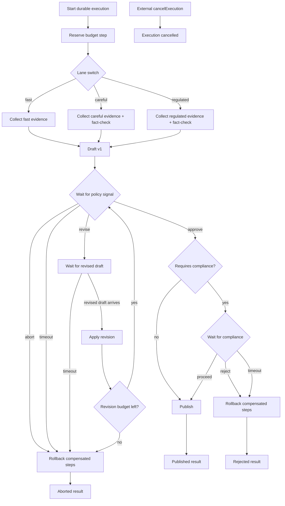

# Agent Orchestration Example

This example models a more realistic agent workflow than the landing-page snippet:

- a planner creates a research plan
- a tool step gathers evidence
- the agent drafts version 1
- a reviewer can approve or request revisions
- the workflow waits for a revised draft and loops back into review
- failures and timeouts are handled explicitly

The same durable execution stays alive across the whole review cycle.

## Flow Diagram



This is the stress path used by the richer example and live Redis + RabbitMQ tests:
it exercises durable branching, signal waits, revision loops, compensation, compliance gates, and explicit cancellation.

## Real backend shape

The production path uses a real durable runtime:

- `RedisStore` for authoritative workflow state
- `RedisEventBus` for fast notifications
- `RabbitMQQueue` for `execute` and `resume` work distribution
- an embedded worker with polling enabled so signal timeouts and recovery timers can fire

That is the same architecture described in the main durable workflow docs. The tests run mostly against an in-memory backend for deterministic coverage, and there is an opt-in Redis + RabbitMQ integration test that boots the real backend, discovers the registered durable workflow, describes it, and runs it end-to-end.

## Scenarios covered

- success after one revision round
- 10 parallel mixed review workflows with waits, revisions, and re-approval
- 100 parallel approval workflows using `wait()` in parallel
- review timeout
- revision timeout
- terminal escalation after too many revisions
- tool-step failure that marks the execution as failed

## Files

- `src/app.ts` builds either a memory-backed or Redis + RabbitMQ-backed durable app
- `src/workflow.ts` contains the agent workflow and result contracts
- `src/index.ts` runs the scenarios and exports helpers for tests
- `src/index.test.ts` covers the full memory-backed behavior
- `src/redis-runtime.test.ts` validates the Redis/RabbitMQ runtime shape and optionally runs real backend integration, including `10` and `100` parallel workflows under a `10s` test budget

## Running

Install the example dependencies first:

```bash
cd examples/agent-orchestration
npm install
```

Run the full local QA for the example:

```bash
npm run qa
```

Run the happy-path demo in memory mode:

```bash
AGENT_ORCH_DRIVER=memory npm start
```

Run the same demo against Redis + RabbitMQ:

```bash
AGENT_ORCH_DRIVER=redis \
REDIS_URL=redis://localhost:6379 \
RABBITMQ_URL=amqp://localhost \
npm start
```

Run the opt-in real-backend integration test:

```bash
DURABLE_INTEGRATION=1 \
DURABLE_TEST_REDIS_URL=redis://localhost:6379 \
DURABLE_TEST_RABBIT_URL=amqp://localhost \
npm test
```

Run the benchmark harness in memory mode:

```bash
npm run bench
```

Run the same benchmark against Redis + RabbitMQ:

```bash
AGENT_ORCH_DRIVER=redis \
REDIS_URL=redis://localhost:6379 \
RABBITMQ_URL=amqp://localhost \
npm run bench
```

## Benchmark Results

These are real measured runs from this example, not hand-wavy aspirational numbers.
They were recorded on an `Apple M1 Max` CPU.

### Memory backend

| Scenario | 10 workflows | Throughput | 100 workflows | Throughput | 1000 workflows | Throughput |
| --- | ---: | ---: | ---: | ---: | ---: | ---: |
| Approval | 40.57ms | 246.51 wf/s | 40.14ms | 2491.38 wf/s | 331.03ms | 3020.85 wf/s |
| Mixed review | 67.87ms | 147.34 wf/s | 77.46ms | 1291.07 wf/s | 288.66ms | 3464.30 wf/s |
| Stress mixed | 67.06ms | 149.12 wf/s | 74.35ms | 1344.94 wf/s | 284.00ms | 3521.14 wf/s |

### Live Redis + RabbitMQ backend

The live benchmark currently targets the richer `stress-mixed` scenario because that is where the orchestration engine has to earn its lunch.

| Scenario | 10 workflows | Throughput | 100 workflows | Throughput | 1000 workflows | Throughput |
| --- | ---: | ---: | ---: | ---: | ---: | ---: |
| Stress mixed | 273.74ms | 36.53 wf/s | 462.08ms | 216.41 wf/s | 9549.09ms | 104.72 wf/s |

### Live integration timings

These came from the Redis + RabbitMQ test suite rather than `npm run bench`, so they are useful as “does it work under a real budget?” checkpoints:

| Test case | Result |
| --- | ---: |
| 10 mixed parallel workflows | 122.38ms |
| 100 parallel approvals | 354.19ms |
| 50 complex stress workflows | 402.37ms |

## Benchmark Methodology

- The benchmark driver is [src/benchmark.ts](/Users/theodordiaconu/Projects/runner/examples/agent-orchestration/src/benchmark.ts).
- Each run starts a batch of workflows, drives them with signals, waits for completion, and measures wall-clock elapsed time.
- Memory mode runs three scenarios: `approval`, `mixed-review`, and `stress-mixed`.
- Redis mode runs the `stress-mixed` scenario against the real `RedisStore`, `RedisEventBus`, and `RabbitMQQueue` path.
- The stress workload is intentionally not “AI expensive”: agent work is cheap map/string shaping so the benchmark mostly measures durable orchestration overhead.
- The stress path exercises lane switching, waits, signal delivery, revision loops, compliance checks, rollback, and explicit cancellation.
- The Redis/RabbitMQ stress helper also performs cleanup of the durable Redis keys and RabbitMQ queues after each run so repeated benches do not accumulate stale state.

## Takeaways

- The memory backend is extremely fast, which is what you want for deterministic tests and local iteration.
- The live Redis + RabbitMQ path is much slower than memory, but it is still comfortably under a `10s` budget for `1000` complex workflows in this workload.
- `1000 workflows per second` is not what this example currently demonstrates on live brokers. The real broker-backed stress run landed around `104.72 wf/s`.
- The interesting part is that the live path is handling branching, signals, rollbacks, compliance gates, and cancellation, not just a one-step fire-and-forget workflow.
- If your agent orchestration includes real LLM/tool latency, that external latency will dominate these numbers. This benchmark mostly shows the framework tax, not the full application bill.

## What the `revise` branch really means

It is not a terminal `status: "needs_revision"` unless you choose to model it that way.
In this example the `revise` branch keeps the same execution alive:

```ts
const revision = await durableContext.waitForSignal(RevisedDraft, {
  stepId: `wait-revision-${round}`,
  timeoutMs: 2_000,
});

draft = await durableContext.step(`apply-revision-${round}`, async () => ({
  ...draft,
  version: round + 1,
  summary: revision.payload.summary,
}));
```

That means a human editor, another agent, or an external system can come back later, signal the revised draft, and continue the same workflow instead of stitching together multiple executions by hand.
