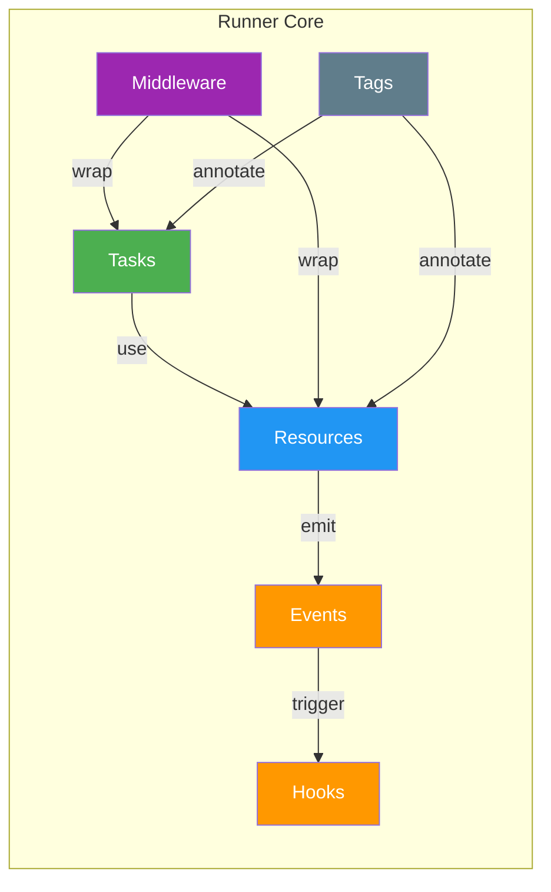

## Why Runner?

When a TypeScript service grows past a few dependencies, the pain usually shows up in the same places: startup order becomes tribal knowledge, cross-cutting concerns leak into business logic, and testing means reconstructing half the app. Runner makes those seams explicit. You wire dependencies in code, keep lifecycle in one place, and choose when to execute a unit directly versus through the full runtime.

### The Core Promise

Runner is for teams that want explicit composition without class decorators, reflection, or framework-owned magic.

- **Before Runner**: manual wiring, ad hoc startup and shutdown, inconsistent test setup, policies scattered across handlers
- **With Runner**: explicit dependency maps, resource lifecycle, middleware for cross-cutting concerns, direct unit testing or full runtime execution

### A Small, Runnable Example

Start with one resource, one task, and one app. This example is intentionally small enough to run as-is.

```typescript
import { r, run } from "@bluelibs/runner";

const userStore = r
  .resource("userStore")
  .init(async () => new Map<string, { id: string; email: string }>())
  .build();

const createUser = r
  .task<{ email: string }>("createUser")
  .dependencies({ userStore })
  .run(async (input, { userStore }) => {
    const user = { id: "user-1", email: input.email };
    userStore.set(user.id, user);
    return user;
  })
  .build();

const app = r
  .resource("app")
  .register([userStore, createUser])
  .build();

const { runTask, dispose } = await run(app);

console.log(await runTask(createUser, { email: "ada@example.com" }));
await dispose();
```

**What this proves**: the smallest Runner app still has explicit wiring, a runtime boundary, and reusable units.

### Starter Map

Use this instead of scanning the whole guide first:

- [Your First 5 Minutes](#your-first-5-minutes) - shortest path to a working runtime
- [What Is This Thing?](#what-is-this-thing) - the mental model
- [How Does It Compare?](#how-does-it-compare) - where Runner fits
- [Resources](./02-resources.md#resources) - shared state, lifecycle, and boundaries
- [Tasks](./02b-tasks.md#tasks) - typed execution with runtime or unit-test entry points
- [Events and Hooks](./02c-events-hooks.md#events-and-hooks) - decoupled reactions and orchestration
- [Middleware](./02d-middleware.md#middleware) - cross-cutting execution policies
- [Tags](./02e-tags.md#tags) - typed discovery and scheduling metadata
- [Testing](#testing) - unit vs runtime execution
- [Multi-Platform Architecture](./readmes/MULTI_PLATFORM.md) - Node, browser, and edge boundaries

### Why It Appeals to Senior TypeScript Teams

- **Explicit wiring**: dependencies are declared in code, not discovered at runtime
- **Honest execution boundaries**: call `.run()` for isolated unit tests or `runTask()` for the full runtime path
- **Lifecycle as a first-class concern**: startup and shutdown live with the resource, not in scattered bootstrap code
- **Incremental adoption**: wrap one service or one task before deciding whether to expand
- **Traceability**: ids, logs, and runtime behavior stay aligned with source code

### Tradeoffs and Boundaries

Runner is not trying to be the lowest-ceremony option for tiny scripts.

- You write some setup code up front so the graph stays explicit later.
- The best payoff appears once your app has multiple long-lived services or cross-cutting policies.
- Some features are intentionally platform-specific.
  Async Context, Durable Workflows, and server-side Remote Lanes are Node-only.

### Resources, Tasks, Events, Hooks, Middleware, and Tags

Runner stays understandable because the runtime is built from a small set of definition types with explicit contracts.

> **Naming rule:** User-defined ids are local ids and must not contain `.`. Prefer `send-email` or `user-store`. Dotted `runner.*` and `system.*` ids are reserved for framework internals.



Use the next chapters in this order:

- **Resources**: lifecycle-owned services, config, boundaries, and ownership
- **Tasks**: typed business operations and execution-local context
- **Events & Hooks**: decoupled signaling, reactions, and emission controls
- **Middleware**: reusable policies around tasks and resources
- **Tags**: typed discovery, metadata, and framework behaviors
- **Errors**: reusable typed error helpers and declarative `.throws()` contracts

For specialized features beyond the core concepts:

- **Async Context**: per-request or thread-local state via `r.asyncContext()`
- **Durable Workflows** (Node-only): replay-safe orchestration primitives in [DURABLE_WORKFLOWS.md](../readmes/DURABLE_WORKFLOWS.md)
- **Remote Lanes** (Node): distributed events and RPC in [REMOTE_LANES.md](../readmes/REMOTE_LANES.md)
- **Serialization**: custom value transport in [SERIALIZER_PROTOCOL.md](../readmes/SERIALIZER_PROTOCOL.md)

**Next step**: go to [Your First 5 Minutes](#your-first-5-minutes) if you want the fastest proof, or [How Does It Compare?](#how-does-it-compare) if you are still evaluating alternatives.
