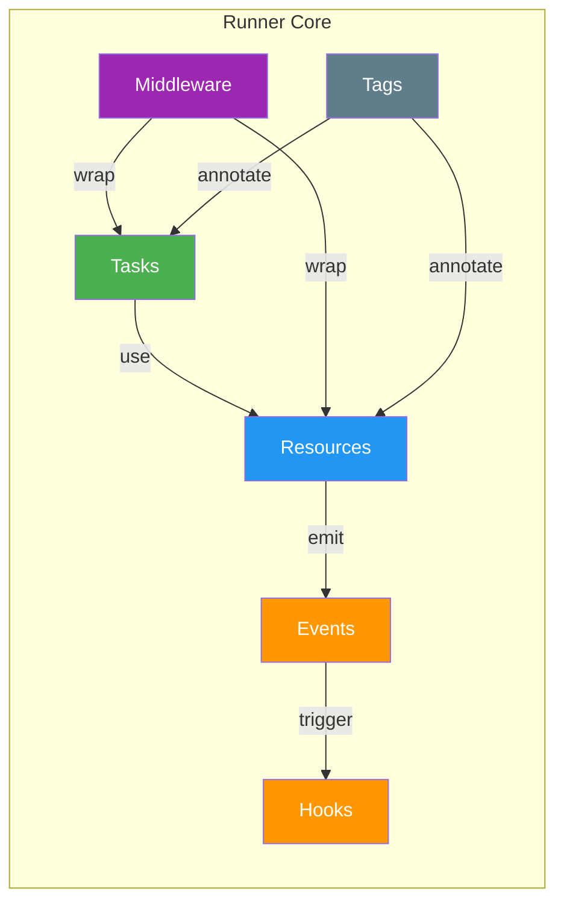
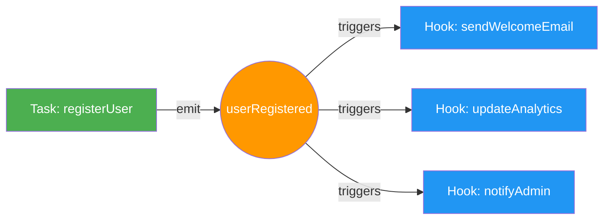

## The Big Five

The framework is built around five core concepts: Tasks, Resources, Events, Middleware, and Tags. Understanding them is key to using Runner effectively.



### Tasks

Tasks are where your business logic lives. They are async functions with explicit dependency injection, type-safe inputs/outputs, middleware support, and observability baked in.

Here's a complete example showing you everything:

```typescript
import { r, run } from "@bluelibs/runner";

// 1. Define your task - it's just a function with a name and dependencies
const sendEmail = r
  .task("app.tasks.sendEmail")
  .dependencies({ emailService, logger }) // What does this task need?
  .run(async (input, { emailService, logger }) => {
    // Your business logic here
    await logger.info(`Sending email to ${input.to}`);
    return emailService.send(input);
  })
  .build();

// 2. Wire it into your app
const app = r
  .resource("app")
  .register([emailService, logger, sendEmail]) // Tell the app about your components
  .build();

// 3. Run your app and get the runtime
const { runTask, dispose } = await run(app);

// 4. Execute your task - fully type-safe!
const result = await runTask(sendEmail, {
  to: "user@example.com",
  subject: "Hi",
  body: "Hello!",
});
```

**The Two Ways to Call Tasks:**

1. **In production/integration**: `runTask(task, input)` - Gets full DI, middleware, events, the works
2. **In unit tests**: `task.run(input, mockDeps)` - Direct call with your mock dependencies

```typescript
// Unit testing is straightforward
const testResult = await sendEmail.run(
  { to: "test@example.com", subject: "Test", body: "Testing!" },
  { emailService: mockEmailService, logger: mockLogger },
);
```

**When Should Something Be a Task?**

Here's a friendly guideline (not a strict rule!):

**Make it a task when:**

- It's a core business operation (user registration, order processing, payment handling)
- You need dependency injection (database, services, configs)
- You want middleware features (auth, caching, retry, timeouts)
- Multiple parts of your app need to use it
- You want observability (logging, monitoring, debugging)

**Keep it as a regular function when:**

- It's a simple utility (date formatting, string manipulation, calculations)
- It's a pure function with no dependencies
- Performance is critical and you don't need framework features
- It's only used in one place

**Think of it this way**: Tasks are the "main actors" in your app – the functions that _do important things_. Regular functions are the supporting cast that help tasks do their job. Both are valuable!

### Resources

Resources are the long-lived parts of your app – things like database connections, configuration, services, and caches. They **initialize once when your app starts** and **clean up when it shuts down**. Think of them as the foundation your tasks build upon.

```typescript
import { r } from "@bluelibs/runner";

const database = r
  .resource("app.db")
  .init(async () => {
    const client = new MongoClient(process.env.DATABASE_URL as string);
    await client.connect();
    return client;
  })
  .dispose(async (client) => client.close())
  .build();

const userService = r
  .resource("app.services.user")
  .dependencies({ database })
  .init(async (_config, { database }) => ({
    async createUser(userData: UserData) {
      return database.collection("users").insertOne(userData);
    },
    async getUser(id: string) {
      return database.collection("users").findOne({ _id: id });
    },
  }))
  .build();
```

#### Resource Configuration

Resources can be configured with type-safe options. No more guessing at config shapes.

```typescript
type SMTPConfig = {
  smtpUrl: string;
  from: string;
};

const emailer = r
  .resource<{ smtpUrl: string; from: string }>("app.emailer")
  .init(async (config) => ({
    send: async (to: string, subject: string, body: string) => {
      // Use config.smtpUrl and config.from
    },
  }))
  .build();

// Register with specific config
const app = r
  .resource("app")
  .register([
    emailer.with({
      smtpUrl: "smtp://localhost",
      from: "noreply@myapp.com",
    }),
    // using emailer without with() will cause a type error
  ])
  .build();
```

#### Resource Forking

Use `.fork(newId)` to create multiple instances of a "template" resource with different identities. If the base resource registers other items, use `.fork(newId, { register: "drop" })` to avoid re-registering them, or `.fork(newId, { register: "deep", reId })` to clone them with new ids. This is perfect when you need several instances of the same resource type (e.g., multiple database connections, multiple mailers):

```typescript
// Define a reusable template
const mailerBase = r
  .resource<{ smtp: string }>("base.mailer")
  .init(async (cfg) => ({
    send: (to: string) => console.log(`Sending via ${cfg.smtp}`),
  }))
  .build();

// Fork with distinct identities - export these for dependency use
export const txMailer = mailerBase.fork("app.mailers.transactional");
export const mktMailer = mailerBase.fork("app.mailers.marketing");

// Use forked resources as dependencies
const orderService = r
  .task("app.tasks.processOrder")
  .dependencies({ mailer: txMailer }) // ← uses forked identity
  .run(async (input, { mailer }) => {
    mailer.send(input.customerEmail);
  })
  .build();

const app = r
  .resource("app")
  .register([
    txMailer.with({ smtp: "tx.smtp.com" }),
    mktMailer.with({ smtp: "mkt.smtp.com" }),
    orderService,
  ])
  .build();
```

If the base resource registers other items and you want a clean clone of the whole tree, use `register: "deep"` with a re-id function:

```typescript
import { r } from "@bluelibs/runner";

const base = r
  .resource("app.base")
  .register([r.task("app.base.task").run(async () => "ok").build()])
  .build();

const forked = base.fork("app.base.forked", {
  register: "deep",
  reId: (id) => `forked.${id}`,
});

const app = r.resource("app").register([base, forked]).build();
```

Key points:

- **`.fork()` returns a built `IResource`** - no need to call `.build()` again
- **Tags, middleware, and type parameters are inherited**
- **Each fork gets independent runtime** - no shared state
- **`register` defaults to `"keep"`**; use `"drop"` for leaf resources or `"deep"` when you want cloned registrations
- **Export forked resources** to use them as typed dependencies

#### Optional Dependencies

Mark dependencies as optional when they may not be registered. The injected value will be `undefined` if the dependency is missing:

```typescript
const analyticsService = r
  .resource("app.analytics")
  .init(async () => ({ track: (event: string) => console.log(event) }))
  .build();

const myTask = r
  .task("app.tasks.doWork")
  .dependencies({
    analytics: analyticsService.optional(), // May be undefined
  })
  .run(async (input, { analytics }) => {
    // Safe to call only if registered
    analytics?.track("task.executed");
    return { done: true };
  })
  .build();
```

Optional dependencies work on tasks, resources, events, async contexts, and errors.

#### Private Context

For cases where you need to share variables between `init()` and `dispose()` methods (because sometimes cleanup is complicated), use the enhanced context pattern:

```typescript
const dbResource = r
  .resource("db.service")
  .context(() => ({
    connections: new Map<string, unknown>(),
    pools: [] as Array<{ drain(): Promise<void> }>,
  }))
  .init(async (_config, _deps, ctx) => {
    const db = await connectToDatabase();
    ctx.connections.set("main", db);
    ctx.pools.push(createPool(db));
    return db;
  })
  .dispose(async (_db, _config, _deps, ctx) => {
    for (const pool of ctx.pools) {
      await pool.drain();
    }
    for (const [, conn] of ctx.connections) {
      await (conn as { close(): Promise<void> }).close();
    }
  })
  .build();
```

### Events

Events let different parts of your app communicate without direct references. They carry typed payloads to hooks so producers stay decoupled from consumers.



```typescript
import { r } from "@bluelibs/runner";

const userRegistered = r
  .event("app.events.userRegistered")
  .payloadSchema<{ userId: string; email: string }>({ parse: (value) => value })
  .build();
```

#### Parallel Event Execution

By default, hooks run sequentially in priority order. Use `.parallel(true)` on an event to enable concurrent execution within priority batches:

```typescript
const highVolumeEvent = r
  .event("app.events.highVolume")
  .payloadSchema<{ data: string }>({ parse: (v) => v })
  .parallel(true) // Hooks with same priority run concurrently
  .build();
```

**How parallel execution works:**

- Hooks are grouped by `.order()` priority
- Within each priority batch, hooks run concurrently
- Batches execute sequentially (lowest priority number first)
- If any hook throws, subsequent batches don't run
- `stopPropagation()` is checked between batches only

```typescript
const registerUser = r
  .task("app.tasks.registerUser")
  .dependencies({ userService, userRegistered })
  .run(async (input, { userService, userRegistered }) => {
    const user = await userService.createUser(input);
    await userRegistered({ userId: user.id, email: user.email });
    return user;
  })
  .build();

const sendWelcomeEmail = r
  .hook("app.hooks.sendWelcomeEmail")
  .on(userRegistered)
  .run(async (event) => {
    console.log(`Welcome email sent to ${event.data.email}`);
  })
  .build();
```

#### Wildcard Events

Sometimes you need to be the nosy neighbor of your application:

```typescript
const logAllEventsHook = r
  .hook("app.hooks.logAllEvents")
  .on("*")
  .run((event) => {
    console.log("Event detected", event.id, event.data);
  })
  .build();
```

#### Excluding Events from Global Hooks

Sometimes you have internal or system events that should not be picked up by wildcard hooks. Use the `excludeFromGlobalHooks` tag to prevent events from being sent to `"*"` hooks:

```typescript
import { r, globals } from "@bluelibs/runner";

// Internal event that won't be seen by global hooks
const internalEvent = r
  .event("app.events.internal")
  .tags([globals.tags.excludeFromGlobalHooks])
  .build();
```

**When to exclude events from global hooks:**

- High-frequency internal events (performance)
- System debugging events
- Framework lifecycle events
- Events that contain sensitive information
- Events meant only for specific components

#### Hooks

Hooks are the modern way to subscribe to events. They are lightweight event subscribers, similar to tasks, but with a few key differences.

```typescript
const myHook = r
  .hook("app.hooks.onUserRegistered")
  .on(userRegistered)
  .dependencies({ logger })
  .run(async (event, { logger }) => {
    await logger.info(`User registered: ${event.data.email}`);
  })
  .build();
```

#### Multiple Events (type-safe intersection)

Hooks can listen to multiple events by providing an array to `on`. The `run(event)` payload is inferred as the common (intersection-like) shape across all provided event payloads. Use the `onAnyOf()` helper to preserve tuple inference ergonomics, and `isOneOf()` as a convenient runtime/type guard when needed.

```typescript
import { r, onAnyOf, isOneOf } from "@bluelibs/runner";

const eUser = r
  .event("app.events.user")
  .payloadSchema<{ id: string; email: string }>({ parse: (v) => v })
  .build();
const eAdmin = r
  .event("app.events.admin")
  .payloadSchema<{ id: string; role: "admin" | "superadmin" }>({
    parse: (v) => v,
  })
  .build();
const eGuest = r
  .event("app.events.guest")
  .payloadSchema<{ id: string; guest: true }>({ parse: (v) => v })
  .build();

// The common field across all three is { id: string }
const auditUsers = r
  .hook("app.hooks.auditUsers")
  .on([eUser, eAdmin, eGuest])
  .run(async (ev) => {
    ev.data.id; // OK: common field inferred
    // ev.data.email; // TS error: not common to all
  })
  .build();

// Guard usage to refine at runtime (still narrows to common payload)
const auditSome = r
  .hook("app.hooks.auditSome")
  .on(onAnyOf([eUser, eAdmin])) // to get a combined event
  .run(async (ev) => {
    if (isOneOf(ev, [eUser, eAdmin])) {
      ev.data.id; // common field of eUser and eAdmin
    }
  })
  .build();
```

Notes:

- The common payload is computed structurally. Optional properties become optional if they are not present across all events.
- Wildcard `on: "*"` continues to accept any event and infers `any` payload.

Hooks are perfect for:

- Event-driven side effects
- Logging and monitoring
- Notifications and alerting
- Data synchronization
- Any reactive behavior

**Key differences from tasks:**

- Lighter weight - no middleware support
- Designed specifically for event handling

#### System Event

The framework exposes a minimal system-level event for observability:

```typescript
import { globals } from "@bluelibs/runner";

const systemReadyHook = r
  .hook("app.hooks.systemReady")
  .on(globals.events.ready)
  .run(async () => {
    console.log("System is ready and operational!");
  })
  .build();
```

Available system event:

- `globals.events.ready` - System has completed initialization
  // Note: use run({ onUnhandledError }) for unhandled error handling

#### stopPropagation()

Sometimes you need to prevent other hooks from processing an event. The `stopPropagation()` method gives you fine-grained control over event flow:

```typescript
const criticalAlert = r
  .event("app.events.alert")
  .payloadSchema<{ severity: "low" | "medium" | "high" | "critical" }>({
    parse: (v) => v,
  })
  .meta({
    title: "System Alert Event",
    description: "Emitted when system issues are detected",
  })
  .build();

// High-priority hook that can stop propagation
const emergencyHook = r
  .hook("app.hooks.onCriticalAlert")
  .on(criticalAlert)
  .order(-100) // Higher priority (lower numbers run first)
  .run(async (event) => {
    console.log(`Alert received: ${event.data.severity}`);

    if (event.data.severity === "critical") {
      console.log("CRITICAL ALERT - Activating emergency protocols");

      // Stop other hooks from running
      event.stopPropagation();
      // Notify the on-call team, escalate, etc.

      console.log("Event propagation stopped - emergency protocols active");
    }
  })
  .build();
```

> **runtime:** "'A really good office messenger.' That’s me in rollerblades. You launch a 'userRegistered' flare and I sprint across the building, high‑fiving hooks and dodging middleware. `stopPropagation` is you sweeping my legs mid‑stride. Rude. Effective. Slightly thrilling."

### Middleware

Middleware wraps around your tasks and resources, adding cross-cutting concerns without polluting your business logic.

Note: Middleware is now split by target. Use `taskMiddleware(...)` for task middleware and `resourceMiddleware(...)` for resource middleware.

```typescript
import { r } from "@bluelibs/runner";

// Task middleware with config
type AuthMiddlewareConfig = { requiredRole: string };
const authMiddleware = r.middleware
  .task("app.middleware.task.auth")
  .run(async ({ task, next }, _deps, config: AuthMiddlewareConfig) => {
    // Must return the value
    return await next(task.input);
  })
  .build();

const adminTask = r
  .task("app.tasks.adminOnly")
  .middleware([authMiddleware.with({ requiredRole: "admin" })])
  .run(async (input) => "Secret admin data")
  .build();
```

For middleware with input/output contracts:

```typescript
// Middleware that enforces specific input and output types
type AuthConfig = { requiredRole: string };
type AuthInput = { user: { role: string } };
type AuthOutput = { user: { role: string; verified: boolean } };

const authMiddleware = r.middleware
  .task("app.middleware.task.auth")
  .run(async ({ task, next }, _deps, config: AuthConfig) => {
    if ((task.input as AuthInput).user.role !== config.requiredRole) {
      throw new Error("Insufficient permissions");
    }
    const result = await next(task.input);
    return {
      user: {
        ...(task.input as AuthInput).user,
        verified: true,
      },
    } as AuthOutput;
  })
  .build();

// For resources
const resourceAuthMiddleware = r.middleware
  .resource("app.middleware.resource.auth")
  .run(async ({ next }) => {
    // Resource middleware logic
    return await next();
  })
  .build();

const adminTask = r
  .task("app.tasks.adminOnly")
  .middleware([authMiddleware.with({ requiredRole: "admin" })])
  .run(async (input: { user: { role: string } }) => ({
    user: { role: input.user.role, verified: true },
  }))
  .build();
```

#### Global Middleware

Want to add logging to everything? Authentication to all tasks? Global middleware has your back:

```typescript
import { r, globals } from "@bluelibs/runner";

const logTaskMiddleware = r.middleware
  .task("app.middleware.log.task")
  .everywhere(() => true)
  .dependencies({ logger: globals.resources.logger })
  .run(async ({ task, next }, { logger }) => {
    logger.info(`Executing: ${String(task!.definition.id)}`);
    const result = await next(task!.input);
    logger.info(`Completed: ${String(task!.definition.id)}`);
    return result;
  })
  .build();
```

**Note:** A global middleware can depend on resources or tasks. However, any such resources or tasks will be excluded from the dependency tree (Task -> Middleware), and the middleware will not run for those specific tasks or resources. This approach gives middleware true flexibility and control.

#### Interception (advanced)

For advanced scenarios, you can intercept framework execution without relying on events:

- Event emissions: `eventManager.intercept((next, event) => Promise<void>)`
- Hook execution: `eventManager.interceptHook((next, hook, event) => Promise<any>)`
- Task middleware execution: `middlewareManager.intercept("task", (next, input) => Promise<any>)`
- Resource middleware execution: `middlewareManager.intercept("resource", (next, input) => Promise<any>)`
- Per-middleware interception: `middlewareManager.interceptMiddleware(mw, interceptor)`
- Per-task execution (local): inside a resource `init`, call `deps.someTask.intercept(async (next, input) => next(input))` to wrap a single task.

Per-task interceptors must be registered during resource initialization (before the system is locked). They are a good fit when you want a specific task to be adjusted by a specific resource (for example: feature toggles, input shaping, or internal routing) without making it global middleware.

Note that per-task interceptors run _inside_ task middleware. If a middleware short-circuits and never calls `next()`, the task (and its per-task interceptors) will not execute.

```typescript
import { r, run } from "@bluelibs/runner";

const adder = r
  .task("app.tasks.adder")
  .run(
    async (input: { value: number }) => ({ value: input.value + 1 }) as const,
  )
  .build();

const installer = r
  .resource("app.resources.installer")
  .register([adder])
  .dependencies({ adder })
  .init(async (_config, { adder }) => {
    adder.intercept(async (next, input) => next({ value: input.value * 2 }));
    return {};
  })
  .build();

const app = r.resource("app").register([installer]).build();
const runtime = await run(app);
await runtime.runTask(adder, { value: 10 }); // => { value: 21 }
await runtime.dispose();
```

Access `eventManager` via `globals.resources.eventManager` if needed.

#### Middleware Type Contracts

Middleware can enforce type contracts on the tasks that use them, ensuring data integrity as it flows through the system. This is achieved by defining `Input` and `Output` types within the middleware's implementation.

When a task uses this middleware, its own `run` method must conform to the `Input` and `Output` shapes defined by the middleware contract.

```typescript
import { r } from "@bluelibs/runner";

// 1. Define the contract types for the middleware.
type AuthConfig = { requiredRole: string };
type AuthInput = { user: { role: string } }; // Task's input must have this shape.
type AuthOutput = { executedBy: { role: string; verified: boolean } }; // Task's output must have this shape.

// 2. Create the middleware using these types in its `run` method.
const authMiddleware = r.middleware
  .task<AuthConfig, AuthInput, AuthOutput>("app.middleware.auth")
  .run(async ({ task, next }, _deps, config) => {
    const input = task.input;
    if (input.user.role !== config.requiredRole) {
      throw new Error("Insufficient permissions");
    }

    // The task runs, and its result must match AuthOutput.
    const result = await next(input);

    // The middleware can further transform the output.
    const output = result;
    return {
      ...output,
      executedBy: {
        ...output.executedBy,
        verified: true, // The middleware adds its own data.
      },
    };
  })
  .build();

// 3. Apply the middleware to a task.
const adminTask = r
  .task("app.tasks.adminOnly")
  // If you use multiple middleware with contracts they get combined.
  .middleware([authMiddleware.with({ requiredRole: "admin" })])
  // If you use .inputSchema() the input must contain the contract types otherwise you end-up with InputContractViolation error.
  // The `run` method is now strictly typed by the middleware's contract.
  // Its input must be `AuthInput`, and its return value must be `AuthOutput`.
  .run(async (input) => {
    // `input.user.role` is available and fully typed.
    console.log(`Task executed by user with role: ${input.user.role}`);

    // Returning a shape that doesn't match AuthOutput will cause a compile-time error.
    // return { wrong: "shape" }; // This would fail!
    return {
      executedBy: {
        role: input.user.role,
      },
    };
  })
  .build();
```

#### Execution Journal

The Execution Journal is a type-safe registry that travels with your task execution. It allows middleware and tasks to share state without polluting the task input/output.

```typescript
import { r, journal } from "@bluelibs/runner";

// 1. Define a typed key
const traceIdKey = journal.createKey<string>("app.traceId");

const traceMiddleware = r.middleware
  .task("app.middleware.trace")
  .run(async ({ task, next, journal }) => {
    // 2. Write to the journal
    journal.set(traceIdKey, "trace-123");
    return next(task.input);
  })
  .build();

const myTask = r
  .task("app.tasks.myTask")
  .middleware([traceMiddleware])
  .run(async (input, deps, { journal }) => {
    // 3. Read from the journal (fully typed!)
    const traceId = journal.get(traceIdKey); // string | undefined
    return { traceId };
  })
  .build();
```

**API Reference:**

| Method                              | Description                                                        |
| ----------------------------------- | ------------------------------------------------------------------ |
| `journal.createKey<T>(id)`          | Create a typed key for storing values                              |
| `journal.create()`                  | Create a fresh journal instance for manual forwarding              |
| `journal.set(key, value, options?)` | Store a typed value (throws if key exists unless `override: true`) |
| `journal.get(key)`                  | Retrieve a value (returns `T \| undefined`)                        |
| `journal.has(key)`                  | Check if a key exists (returns `boolean`)                          |

> [!IMPORTANT]
> **Fail-fast by default**: `set()` throws an error if the key already exists. This prevents silent bugs from middleware accidentally clobbering each other's state. Use `{ override: true }` when you intentionally want to update a value.

**Key features:**

- **Fail-fast**: Duplicate key writes throw immediately, catching integration bugs early
- **Type-safe keys**: Use `journal.createKey<T>()` for compile-time type checking
- **Per-execution**: Fresh journal for every task run
- **Forwarding**: Pass `{ journal }` to nested task calls to share context across the call tree

#### Cross-Middleware Coordination

The journal shines when middleware need to coordinate. The recommended pattern is to **export your journal keys** so other middleware can access your state:

```typescript
// timeout.middleware.ts
import { journal } from "@bluelibs/runner";

// Export keys for downstream consumers
export const journalKeys = {
  abortController: journal.createKey<AbortController>(
    "timeout.abortController",
  ),
} as const;

export const timeoutMiddleware = r.middleware
  .task("app.middleware.timeout")
  .run(async ({ task, next, journal }, _deps, config: { ttl: number }) => {
    const controller = new AbortController();

    // Store for other middleware to check
    journal.set(journalKeys.abortController, controller);

    const timeoutPromise = new Promise((_, reject) => {
      setTimeout(() => {
        controller.abort();
        reject(new Error(`Timeout after ${config.ttl}ms`));
      }, config.ttl);
    });

    return Promise.race([next(task.input), timeoutPromise]);
  })
  .build();
```

```typescript
// retry.middleware.ts
import { journalKeys as timeoutKeys } from "./timeout.middleware";

export const retryMiddleware = r.middleware
  .task("app.middleware.retry")
  .run(async ({ task, next, journal }, _deps, config: { retries: number }) => {
    let attempts = 0;

    while (true) {
      try {
        return await next(task.input);
      } catch (error) {
        // Check if timeout middleware aborted - don't retry timeouts!
        const controller = journal.get(timeoutKeys.abortController);
        if (controller?.signal.aborted) {
          throw error; // Timeout - no retry
        }

        if (attempts >= config.retries) throw error;
        attempts++;
        await new Promise((r) => setTimeout(r, 100 * Math.pow(2, attempts)));
      }
    }
  })
  .build();
```

This pattern enables loose coupling - middleware don't need direct references, just the exported keys.

#### Manual Journal Management

For advanced scenarios where you need explicit control:

```typescript
// Create and pre-populate a journal
const customJournal = journal.create();
customJournal.set(traceIdKey, "manual-trace-id");

// Forward explicit journal to a nested task call
const orchestratorTask = r
  .task("app.tasks.orchestrator")
  .dependencies({ myTask })
  .run(async (input, { myTask }) => {
    return myTask(input, { journal: customJournal });
  })
  .build();

await runTask(orchestratorTask, input);

// Check before accessing
if (customJournal.has(traceIdKey)) {
  console.log("Trace ID:", customJournal.get(traceIdKey));
}
```

> **runtime:** "Ah, the onion pattern. A matryoshka doll made of promises. Every peel reveals… another logger. Another tracer. Another 'just a tiny wrapper'. And now middleware can spy on each other through the journal. `has()` is just asking 'did anyone write here before me?' It's wrappers all the way down."

### Tags

Tags are metadata that can influence system behavior. Unlike meta properties, tags can be queried at runtime to build dynamic functionality. They can be simple strings or structured configuration objects.

#### Basic Usage

```typescript
import { r } from "@bluelibs/runner";

// Structured tags with configuration
const httpTag = r.tag<{ method: string; path: string }>("http.route").build();

const getUserTask = r
  .task("app.tasks.getUser")
  .tags([httpTag.with({ method: "GET", path: "/users/:id" })])
  .run(async (input) => getUserFromDatabase(input.id))
  .build();
```

#### Discovering Components by Tags

The core power of tags is runtime discovery. Use `store.getTasksWithTag()` to find components:

```typescript
import { r, globals } from "@bluelibs/runner";

// Auto-register HTTP routes based on tags
const routeRegistration = r
  .hook("app.hooks.registerRoutes")
  .on(globals.events.ready)
  .dependencies({ store: globals.resources.store, server: expressServer })
  .run(async (_event, { store, server }) => {
    // Find all tasks with HTTP tags
    const apiTasks = store.getTasksWithTag(httpTag);

    apiTasks.forEach((taskDef) => {
      const config = httpTag.extract(taskDef);
      if (!config) return;

      const { method, path } = config;
      server.app[method.toLowerCase()](path, async (req, res) => {
        const result = await taskDef({ ...req.params, ...req.body });
        res.json(result);
      });
    });

    // Also find by string tags
    const cacheableTasks = store.getTasksWithTag("cacheable");
    console.log(`Found ${cacheableTasks.length} cacheable tasks`);
  })
  .build();
```

#### Tag Extraction and Processing

```typescript
// Check if a tag exists and extract its configuration
const performanceTag = r
  .tag<{ warnAboveMs: number }>("performance.monitor")
  .build();

const performanceMiddleware = r.middleware
  .task("app.middleware.performance")
  .run(async ({ task, next }) => {
    // Check if task has performance monitoring enabled
    if (!performanceTag.exists(task.definition)) {
      return next(task.input);
    }

    // Extract the configuration
    const config = performanceTag.extract(task.definition)!;
    const startTime = Date.now();

    try {
      const result = await next(task.input);
      const duration = Date.now() - startTime;

      if (duration > config.warnAboveMs) {
        console.warn(`Task ${task.definition.id} took ${duration}ms`);
      }

      return result;
    } catch (error) {
      const duration = Date.now() - startTime;
      console.error(`Task failed after ${duration}ms`, error);
      throw error;
    }
  })
  .build();
```

#### System Tags

Built-in tags for framework behavior:

```typescript
import { r, globals } from "@bluelibs/runner";

const internalTask = r
  .task("app.internal.cleanup")
  .tags([
    globals.tags.system, // Excludes from debug logs
    globals.tags.debug.with({ logTaskInput: true }), // Per-component debug config
  ])
  .run(async () => performCleanup())
  .build();

const internalEvent = r
  .event("app.events.internal")
  .tags([globals.tags.excludeFromGlobalHooks]) // Won't trigger wildcard hooks
  .build();
```

#### Contract Tags

Enforce return value shapes at compile time:

```typescript
// Tags that enforce type contracts input/output for tasks or config/value for resources
type InputType = { id: string };
type OutputType = { name: string };
const userContract = r
  // void = no config, no need for .with({ ... })
  .tag<void, InputType, OutputType>("contract.user")
  .build();

const profileTask = r
  .task("app.tasks.getProfile")
  .tags([userContract]) // Must return { name: string }
  .run(async (input) => ({ name: input.id + "Ada" })) //  Satisfies contract
  .build();
```

### Errors

Typed errors can be declared once and injected anywhere. Register them alongside other items and consume via dependencies. The injected value is the error helper itself, exposing `.throw()`, `.is()`, `.toString()`, and `id`.

```ts
import { r } from "@bluelibs/runner";

// Fluent builder for errors
const userNotFoundError = r
  .error<{ code: number; message: string }>("app.errors.userNotFound")
  .dataSchema(z.object({ ... }))
  .build();

const getUser = r
  .task("app.tasks.getUser")
  .dependencies({ userNotFoundError })
  .run(async (input, { userNotFoundError }) => {
    userNotFoundError.throw({ code: 404, message: `User ${input} not found` });
  })
  .build();

const app = r.resource("app").register([userNotFoundError, getUser]).build();
```

Error data must include a `message: string`. The thrown `Error` has `name = id` and `message = data.message` for predictable matching and logging.

```ts
try {
  userNotFoundError.throw({ code: 404, message: "User not found" });
} catch (err) {
  if (userNotFoundError.is(err)) {
    // err.name === "app.errors.userNotFound", err.message === "User not found"
    console.log(`Caught error: ${err.name} - ${err.message}`);
  }
}
```

---

### Beyond the Big Five

The core concepts above cover most use cases. For specialized features:

- **Async Context**: Per-request/thread-local state via `r.asyncContext()`. See [Async Context](#async-context) for Node.js `AsyncLocalStorage` patterns.
- **Durable Workflows** (Node-only): Replay-safe primitives like `ctx.step()`, `ctx.sleep()`, and `ctx.waitForSignal()`. See [Durable Workflows](./readmes/DURABLE_WORKFLOWS.md).
- **HTTP Tunnels**: Expose tasks over HTTP or call remote Runners. See [Tunnels](./readmes/TUNNELS.md).
- **Serialization**: Custom type serialization for Dates, RegExp, binary, and custom shapes. See [Serializer Protocol](./readmes/SERIALIZER_PROTOCOL.md).

---
