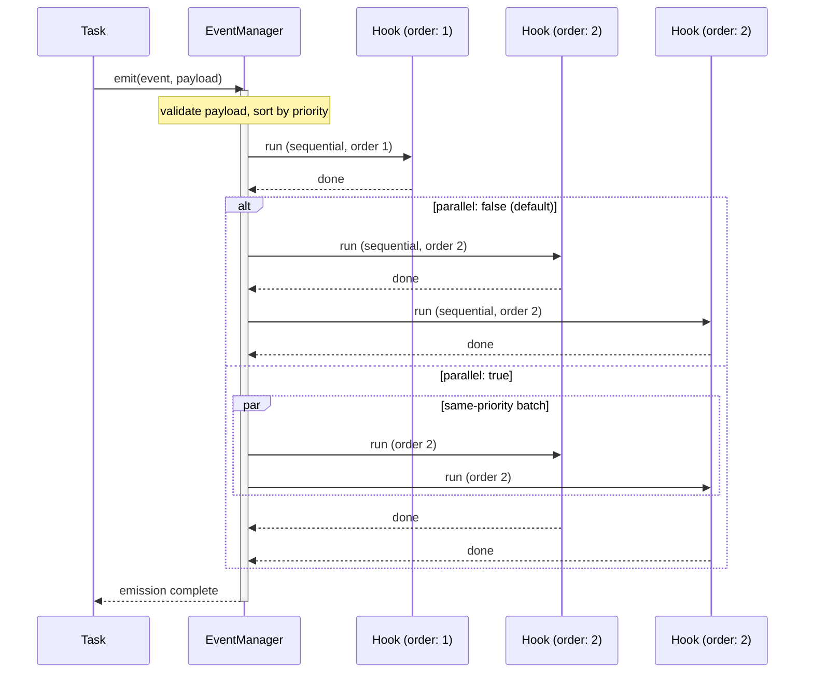
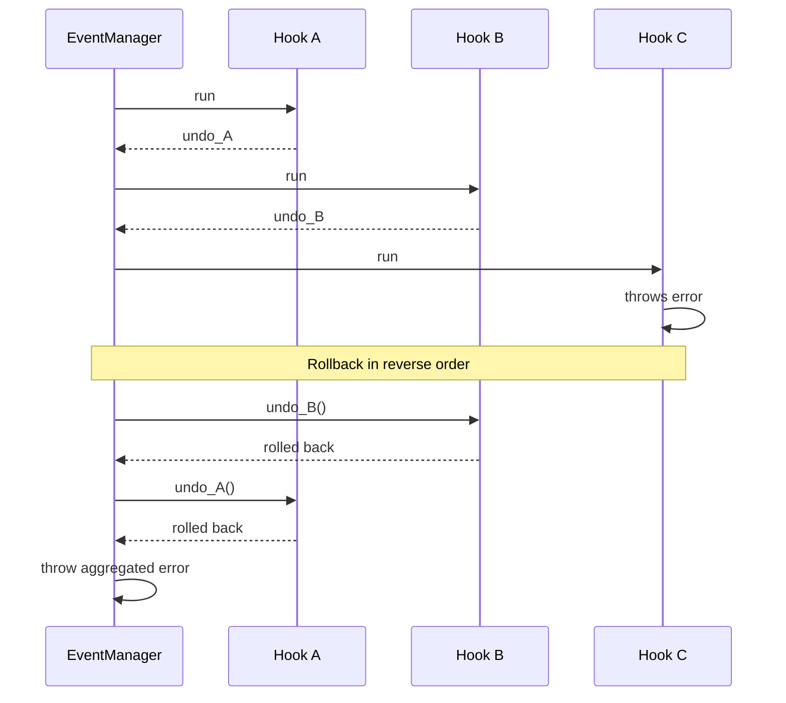
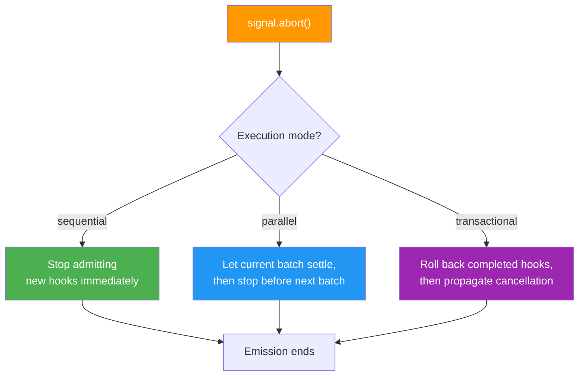

## Events and Hooks

Events let different parts of your app communicate without direct references. Hooks subscribe to those events so producers stay decoupled from downstream reactions.

```typescript
import { Match, r } from "@bluelibs/runner";

// Assuming: userService is a resource defined elsewhere.
const userRegistered = r
  .event("userRegistered")
  .payloadSchema({ userId: String, email: Match.Email })
  .build();

const registerUser = r
  .task("registerUser")
  .dependencies({ userService, userRegistered })
  .run(async (input, { userService, userRegistered }) => {
    const user = await userService.createUser(input);
    await userRegistered({ userId: user.id, email: user.email });
    return user;
  })
  .build();

const sendWelcomeEmail = r
  .hook("sendWelcomeEmail")
  .on(userRegistered)
  .run(async (event) => {
    console.log(`Welcome email sent to ${event.data.email}`);
  })
  .build();

// Events, tasks, and hooks must all be registered in a resource to be active.
const app = r
  .resource("app")
  .register([userService, userRegistered, registerUser, sendWelcomeEmail])
  .build();
```

**What you just learned**: Events are typed signals, hooks subscribe to them, and tasks emit events through dependency injection. Producers stay decoupled from hook execution.



Events follow a few core rules that keep the system predictable:

- events carry typed payloads validated by `.payloadSchema()`
- hooks subscribe with exact events, `onAnyOf(...)`, `subtreeOf(resource)`, predicates, or arrays mixing those selector forms
- `.order(priority)` controls hook priority
- wildcard `.on("*")` listens to all events except those tagged with `tags.excludeFromGlobalHooks`
- `event.stopPropagation()` prevents downstream hooks from running

### Hooks

Hooks are lightweight event subscribers:

- designed for event handling, not task middleware
- can declare dependencies
- do not have task middleware support
- are ideal for side effects, notifications, logging, and synchronization

### Transactional Events

Use transactional events when hooks must be reversible.

```typescript
const orderPlaced = r
  .event("orderPlaced")
  .payloadSchema({ orderId: Match.NonEmptyString })
  .transactional()
  .build();

const reserveInventory = r
  .hook("reserveInventory")
  .on(orderPlaced)
  .run(async (event) => {
    await reserve(event.data.orderId);

    return async () => {
      await release(event.data.orderId);
    };
  })
  .build();
```

Transactional behavior:

- transactional is event-level metadata, not hook-level metadata
- every executed hook must return an async undo closure
- if a hook fails, previously completed hooks are rolled back in reverse order
- rollback continues even if one undo fails; Runner throws an aggregated rollback error
- `transactional + parallel` is invalid
- `transactional + eventLane.applyTo(...)` is invalid



### Parallel Event Execution

By default, hooks run sequentially in priority order.
Use `.parallel(true)` on an event to enable concurrent execution within same-priority batches.

### Emission Reports and Failure Modes

Event emitters accept optional controls:

- `failureMode`: `"fail-fast"` or `"aggregate"`
- `throwOnError`: `true` by default
- `report: true`: returns `IEventEmitReport`

```typescript
const report = await userRegistered(
  { userId: input.userId },
  {
    report: true,
    throwOnError: false,
    failureMode: "aggregate",
  },
);
```

For transactional events, fail-fast rollback semantics are enforced regardless of aggregate options.

### Event Cancellation

Injected event emitters accept a cooperative signal, and hooks receive it as `event.signal` when the emission is cancellation-aware:

```typescript
const controller = new AbortController();

await userCreated({ userId: "u1" }, { signal: controller.signal });
```

Cancellation behavior:

- `signal` is optional
- top-level callers can pass `emit(payload, { signal })`
- with execution context enabled, nested task and event dependency calls can inherit the ambient execution signal automatically
- sequential events stop admitting new hooks once cancelled
- parallel events let the current batch settle, then stop before the next batch
- transactional events roll back already-completed hooks before the cancellation escapes



`event.signal` stays `undefined` until a real source is explicitly provided or inherited from the current execution. Internal framework code can call `eventManager.emit(event, payload, { source, signal })` when it needs explicit source control.

For the full propagation model, including lightweight execution context, see [Execution Context and Signal Propagation](#execution-context-and-signal-propagation).

Low-level note:

- `EventManager.emit(...)`, `emitLifecycle(...)`, and `emitWithResult(...)` prefer a merged call-options object: `{ source, signal, report, failureMode, throwOnError }`
- dependency-injected event emitters do not ask for `source` because Runner fills that in for you

### Event-Driven Task Wiring

When a task should announce something happened without owning every downstream side effect, emit an event and let hooks react. Inline Match patterns are usually the clearest option:

```typescript
import { Match, r } from "@bluelibs/runner";

// Assuming `createUserInDb` is your own persistence collaborator.
const userCreated = r
  .event("userCreated")
  .payloadSchema({
    userId: Match.NonEmptyString,
    email: Match.Email,
  })
  .build();

const registerUser = r
  .task("registerUser")
  .dependencies({ userCreated })
  .run(async (input, { userCreated }) => {
    const user = await createUserInDb(input);
    await userCreated({ userId: user.id, email: user.email });
    return user;
  })
  .build();
```

### Wildcard Events and Global Hook Exclusions

Wildcard hooks are useful for broad observability or debugging:

```typescript
const logAllEventsHook = r
  .hook("logAllEvents")
  .on("*")
  .run((event) => {
    console.log("Event detected", event.id, event.data);
  })
  .build();
```

Use `tags.excludeFromGlobalHooks` when an event should stay out of wildcard hooks.

```typescript
import { tags, r } from "@bluelibs/runner";

const internalEvent = r
  .event("internalEvent")
  .tags([tags.excludeFromGlobalHooks])
  .build();
```

`tags.excludeFromGlobalHooks` affects only literal wildcard hooks. Explicit selector-based hooks such as `subtreeOf(...)` and predicates can still match those events when they are otherwise visible.

### Selector-Based Hook Targets

Hooks can subscribe structurally at bootstrap time:

```typescript
import { defineHook, subtreeOf, tags } from "@bluelibs/runner";

const subtreeListener = defineHook({
  id: "subtreeListener",
  on: subtreeOf(featureResource),
  run: async (event) => {
    console.log(event.id);
  },
});

const taggedListener = defineHook({
  id: "taggedListener",
  on: (event) => tags.audit.exists(event),
  run: async (event) => {
    console.log(event.id);
  },
});
```

Selector rules:

- selectors resolve once against registered canonical event definitions during bootstrap
- selector matches are narrowed to events the hook may listen to on the `listening` channel
- exact direct event refs still fail fast when visibility is violated
- arrays may mix exact events, `subtreeOf(...)`, and predicates, but `"*"` must remain standalone
- selector-based hooks lose payload autocomplete because the final matched set is runtime-resolved
- exact event refs and `onAnyOf(...)` keep the usual payload inference

### Listening to Multiple Events

Use `onAnyOf()` for tuple-friendly exact-event inference and `isOneOf()` as a runtime guard.
`isOneOf()` is intended for Runner-provided emissions that retain definition
identity. Plain `{ id }`-shaped objects are not treated as exact event matches.

```typescript
import { Match, isOneOf, onAnyOf, r } from "@bluelibs/runner";

const eUser = r
  .event("userEvent")
  .payloadSchema({ id: String, email: Match.Email })
  .build();
const eAdmin = r
  .event("adminEvent")
  .payloadSchema({
    id: String,
    role: Match.OneOf("admin", "superadmin"),
  })
  .build();

const auditSome = r
  .hook("auditSome")
  .on(onAnyOf(eUser, eAdmin))
  .run(async (ev) => {
    if (isOneOf(ev, [eUser, eAdmin])) {
      ev.data.id;
    }
  })
  .build();
```

### System Events

Runner exposes a minimal system event surface:

- `events.ready`
- `events.disposing`
- `events.drained`

```typescript
const systemReadyHook = r
  .hook("systemReady")
  .on(events.ready)
  .run(async () => {
    console.log("System is ready and operational!");
  })
  .build();
```

### `stopPropagation()`

Use `stopPropagation()` when a higher-priority hook must prevent later hooks from running.

```typescript
// Assuming: criticalAlert is an event defined elsewhere.
const emergencyHook = r
  .hook("onCriticalAlert")
  .on(criticalAlert)
  .order(-100)
  .run(async (event) => {
    if (event.data.severity === "critical") {
      event.stopPropagation();
    }
  })
  .build();
```

### Event Interception APIs

Use `eventManager` to intercept event operations globally during resource initialization:

- Event emission: `eventManager.intercept((next, event) => Promise<void>)` — wraps the entire emit batch.
- Hook execution: `eventManager.interceptHook((next, hook, event) => Promise<any>)` — wraps a single hook's callback.

Always await the `next` function and pass the correct arguments.

```typescript
import { r, resources } from "@bluelibs/runner";

const eventTelemetry = r
  .resource("eventTelemetry")
  .dependencies({
    eventManager: resources.eventManager,
    logger: resources.logger,
  })
  .init(async (_config, { eventManager, logger }) => {
    // Intercept individual hook executions (e.g. for benchmarking)
    eventManager.interceptHook(async (next, hook, event) => {
      const start = Date.now();
      try {
        return await next(hook, event);
      } finally {
        await logger.debug(
          `Hook ${String(hook.id)} handled ${String(event.id)} in ${Date.now() - start}ms`,
        );
      }
    });

    // Intercept the entire event emission cycle
    eventManager.intercept(async (next, event) => {
      await logger.info(`Event emitted: ${String(event.id)}`);
      // Warning: you must pass the exact 'event' object reference to next()
      return await next(event);
    });
  })
  .build();
```
