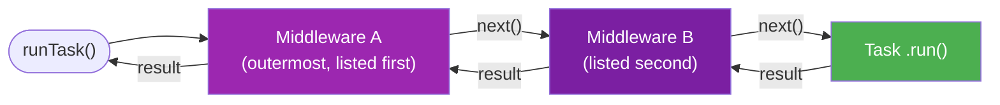
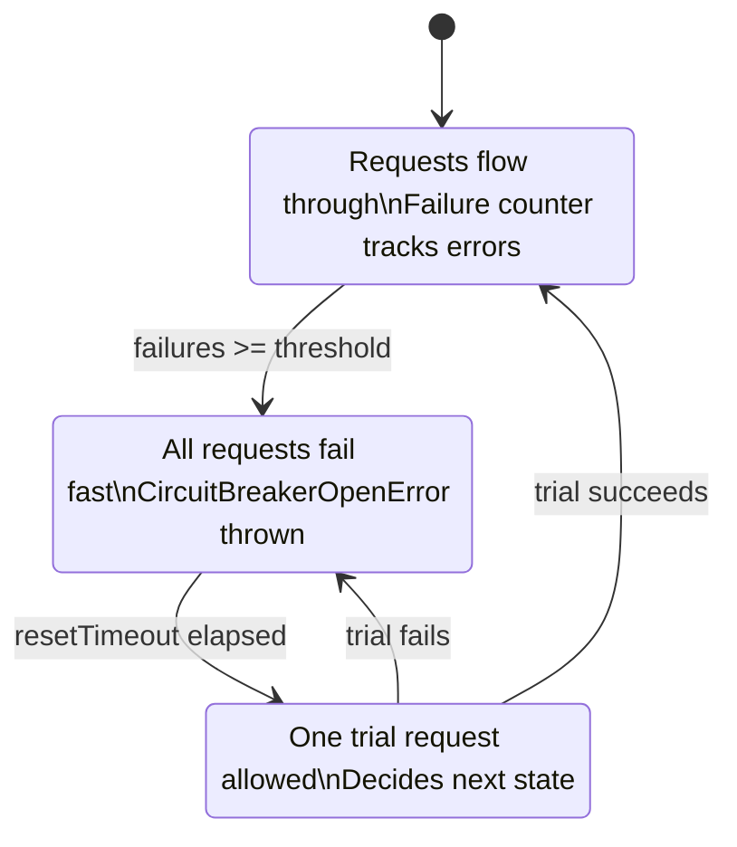
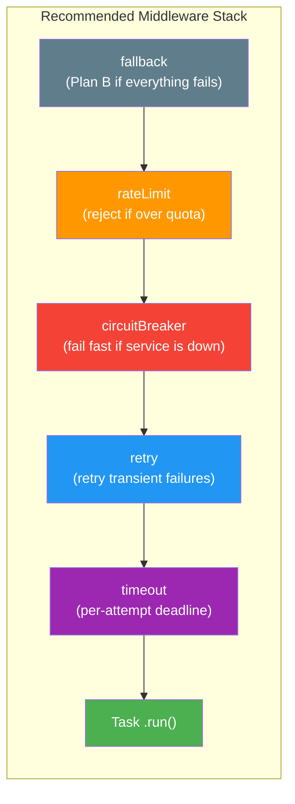

## Middleware

Middleware wraps tasks and resources so cross-cutting behavior stays explicit and reusable instead of leaking into business logic.

```typescript
import { errors, r } from "@bluelibs/runner";

type AuthConfig = { requiredRole: string };

const authMiddleware = r.middleware
  .task("authMiddleware")
  .run(async ({ task, next }, _deps, config: AuthConfig) => {
    return await next(task.input);
  })
  .build();

const adminTask = r
  .task("adminTask")
  .middleware([authMiddleware.with({ requiredRole: "admin" })])
  .run(async () => "Secret admin data")
  .build();

// Tasks (and resources) must be registered in a resource before the runtime can use them.
// Inline middleware definitions do not need to be registered separately.
const app = r.resource("app").register([adminTask]).build();
```

**What you just learned**: Middleware wraps tasks or resources with reusable, configurable behavior. Attach it with `.middleware([...])` and configure with `.with()`.

Key rules that keep the middleware model predictable:

- create task middleware with `r.middleware.task(id)`
- create resource middleware with `r.middleware.resource(id)`
- attach middleware with `.middleware([...])`
- first listed middleware is the outermost wrapper
- task middleware can attach only to tasks or `subtree.tasks.middleware`
- resource middleware can attach only to resources or `subtree.resources.middleware`
- middleware definitions expose `.extract(entry)` to read config from a matching configured middleware attachment
- custom task middleware can declare reusable journal keys and expose them through `.journalKeys`



### Task and Resource Middleware

The two middleware channels serve different wrapping targets:

- task middleware wraps task execution and receives `{ task, next, journal }`
- resource middleware wraps resource initialization or resource value resolution and receives `{ resource, next }`
- task middleware is where auth, retry, cache, timeout, tracing, and admission policies usually live
- resource middleware is where retry or timeout around startup/resource creation usually lives

### Custom Middleware Journal Keys

When your task middleware needs stable execution-local slots, create keys with `journal.createKey<T>(id)` and expose them through the middleware definition.

- For middleware-local state, use short local labels such as `journal.createKey<string>("traceId")`.
- Sharing is by key object reuse, not by matching id strings. Reuse an existing key only when you intentionally want to share the same journal slot with another runtime path.

```typescript
import { journal, r } from "@bluelibs/runner";

const traceMiddleware = r.middleware
  .task("traceMiddleware")
  .journal({
    traceId: journal.createKey<string>("traceId"),
  })
  .run(async ({ task, next, journal }) => {
    journal.set(
      traceMiddleware.journalKeys.traceId,
      `trace:${task.definition.id}`,
      { override: true },
    );
    return next(task.input);
  })
  .build();

const tracedTask = r
  .task("tracedTask")
  .middleware([traceMiddleware])
  .run(async (_input, _deps, context) => {
    return context!.journal.get(traceMiddleware.journalKeys.traceId);
  })
  .build();

const app = r
  .resource("app")
  .register([traceMiddleware, tracedTask])
  .build();
```

This matches the ergonomics of built-in middleware such as `middleware.task.cache.journalKeys` and `middleware.task.retry.journalKeys`.

### Cross-Cutting Middleware

Attach middleware at the owning resource when you want subtree-wide behavior.

```typescript
import { resources, r } from "@bluelibs/runner";

const logTaskMiddleware = r.middleware
  .task("logTaskMiddleware")
  .dependencies({ logger: resources.logger })
  .run(async ({ task, next }, { logger }) => {
    await logger.info(`Executing: ${String(task.definition.id)}`);
    const result = await next(task.input);
    await logger.info(`Completed: ${String(task.definition.id)}`);
    return result;
  })
  .build();

const app = r
  .resource("app")
  .register([logTaskMiddleware])
  .subtree({
    tasks: {
      middleware: [logTaskMiddleware],
    },
  })
  .build();
```

Subtree rules:

Subtree validation is return-based. You can import `SubtreeViolation` from Runner, or return the same `{ code, message }` shape inline.

- subtree middleware entries can be conditional with `{ use, when }`
- subtree middleware resolves before local `.middleware([...])`
- if subtree and local middleware resolve to the same middleware id, Runner fails fast instead of letting the local middleware override the subtree one

```typescript
import { isTask, r, run } from "@bluelibs/runner";
import type { SubtreeViolation } from "@bluelibs/runner";

const app = r
  .resource("app")
  .subtree({
    validate: (definition): SubtreeViolation[] => {
      if (!isTask(definition) || definition.meta?.title) {
        return [];
      }

      return [
        {
          code: "missing-meta-title",
          message: `Task "${definition.id}" must define meta.title`,
        },
      ];
    },
  })
  .build();

await run(app);
```

Rules:

- use exported type guards inside `subtree.validate(...)` when the policy only targets tasks, resources, events, hooks, tags, or middleware
- return `SubtreeViolation[]` for expected policy failures
- do not throw for normal validation failures
- invalid validator returns are aggregated into one subtree validation error

### Middleware Type Contracts

Middleware can enforce input and output contracts on the tasks that use it, and middleware tags can also enforce middleware config contracts. This is useful for:

- **Authentication**: ensure all tasks using auth-middleware have `userId` in input
- **API standardization**: enforce consistent response shapes across task groups
- **Validation**: guarantee tasks return required fields

```typescript
import { r } from "@bluelibs/runner";

type AuthConfig = { requiredRole: string };
type AuthInput = { user: { role: string } };
type AuthOutput = { executedBy: { role: string; verified: boolean } };

const authMiddleware = r.middleware
  .task<AuthConfig, AuthInput, AuthOutput>("authMiddleware")
  .run(async ({ task, next }, _deps, config) => {
    const input = task.input;
    if (input.user.role !== config.requiredRole) {
      throw errors.genericError.new({ message: "Insufficient permissions" });
    }

    const output = await next(input);
    return {
      ...output,
      executedBy: {
        ...output.executedBy,
        verified: true,
      },
    };
  })
  .build();
```

If you use multiple contract middleware, their contracts combine.
If you tag middleware with a contract tag whose config includes extra fields, that contract also flows into the middleware's dependency callbacks, `run(...)`, `.with(...)`, `.config`, and `.extract(...)`.

### Built-In Middleware

Runner ships with built-in middleware for common reliability, admission-control, caching, and context-enforcement concerns:

| Middleware      | Config                                     | Notes                                                                                 |
| --------------- | ------------------------------------------ | ------------------------------------------------------------------------------------- |
| cache           | `{ ttl, max, ttlAutopurge, keyBuilder }`   | backed by `resources.cache`; `keyBuilder` may return a string or `{ cacheKey, refs }` |
| concurrency     | `{ limit, key?, semaphore? }`              | limits in-flight executions                                                           |
| circuitBreaker  | `{ failureThreshold, resetTimeout }`       | opens after failures, then fails fast                                                 |
| debounce        | `{ ms, keyBuilder?, maxKeys? }`            | waits for inactivity, then runs once with the latest input for that key               |
| throttle        | `{ ms, keyBuilder?, maxKeys? }`            | runs immediately, then suppresses burst calls until the window ends                   |
| fallback        | `{ fallback }`                             | static value, function, or task fallback                                              |
| identityChecker | `{ tenant?, user?, roles? }`               | blocks task execution unless the active identity satisfies the gate                   |
| rateLimit       | `{ windowMs, max, keyBuilder?, maxKeys? }` | fixed-window admission limit per key, for cases like "50 per second"                  |
| requireContext  | `{ context }`                              | fails fast when a specific async context must exist before task execution             |
| retry           | `{ retries, stopRetryIf, delayStrategy }`  | transient failures with configurable logic                                            |
| timeout         | `{ ttl }`                                  | rejects after the deadline and aborts cooperative work via `AbortSignal`              |

Resource equivalents:

- `middleware.resource.retry`
- `middleware.resource.timeout`

Recommended ordering:

- fallback outermost
- identityChecker near the outside when auth should fail before expensive work
- timeout inside retry when you want per-attempt budgets
- rate-limit for admission control such as "max 50 calls per second"
- concurrency for in-flight control
- cache for idempotent reads

### Caching

Avoid recomputing expensive work by caching task results with TTL-based eviction.
Cache is opt-in: register `resources.cache` so Runner wires the backing store and auto-registers `middleware.task.cache` for cached tasks.

#### Provider Contract

When you provide a custom cache backend, this is the contract:

```typescript
import type { ICacheProvider } from "@bluelibs/runner";

interface CacheProviderInput {
  taskId: string;
  options: {
    ttl?: number;
    max?: number;
    ttlAutopurge?: boolean;
  };
  totalBudgetBytes?: number;
}

type CacheProviderFactory = (
  input: CacheProviderInput,
) => Promise<ICacheProvider>;

interface ICacheProvider {
  get(key: string): unknown | Promise<unknown>;
  set(
    key: string,
    value: unknown,
    metadata?: { refs?: readonly string[] },
  ): unknown | Promise<unknown>;
  clear(): void | Promise<void>;
  invalidateKeys(keys: readonly string[]): number | Promise<number>;
  invalidateRefs(refs: readonly string[]): number | Promise<number>;
  has?(key: string): boolean | Promise<boolean>;
}
```

Notes:

- `input.options` are merged from `resources.cache.with({ defaultOptions })` and middleware-level cache options.
- `input.taskId` identifies the task-specific cache instance being created.
- `defaultOptions` remain inherited per-task provider options, not a shared global budget.
- `resources.cache.with({ totalBudgetBytes })` is passed to providers as `input.totalBudgetBytes`.
- The built-in in-memory provider supports `totalBudgetBytes` out of the box.
- Node also ships with `resources.redisCacheProvider`, which supports `totalBudgetBytes` with Redis-backed storage.
- Custom providers should enforce their own backend budget policy when `input.totalBudgetBytes` is provided.
- `keyBuilder` is middleware-only and is not passed to the provider.
- When `keyBuilder(...)` returns `{ cacheKey, refs }`, middleware passes those refs to `set(..., metadata)` for provider-side indexing.
- Without `keyBuilder`, cache keys default to `taskId + serialized input` and fail fast when the input cannot be serialized.
- `resources.cache.invalidateKeys(key | key[], options?)` fans out across cache-enabled tasks and deletes matching concrete storage keys.
- `resources.cache.invalidateRefs(ref | ref[])` fans out across cache-enabled tasks and deletes matching entries.
- `has()` is optional, but recommended when `undefined` can be a valid cached value.

#### Default Usage

```typescript
import { middleware, r, resources } from "@bluelibs/runner";

const expensiveTask = r
  .task("expensiveTask")
  .middleware([
    middleware.task.cache.with({
      // lru-cache options by default
      ttl: 60 * 1000, // Cache for 1 minute
      keyBuilder: (_taskId, input: { userId: string }) =>
        `user:${input.userId}`, // optional when the default serialized-input key is too granular
    }),
  ])
  .run(async (input: { userId: string }) => {
    // This expensive operation will be cached
    return await doExpensiveCalculation(input.userId);
  })
  .build();

// Resource-level cache configuration
const app = r
  .resource("app")
  .register([
    resources.cache.with({
      totalBudgetBytes: 50 * 1024 * 1024, // Shared 50MB budget across built-in task caches
      defaultOptions: {
        max: 1000, // Per-task maximum items in cache
        ttl: 30 * 1000, // Per-task default TTL
      },
    }),
  ])
  .build();
```

#### Ref-Based Invalidation

Use semantic refs when multiple cached tasks should be refreshed after the same write.

```typescript
import { asyncContexts, middleware, r, resources } from "@bluelibs/runner";

const CacheRefs = {
  getTenantId() {
    return asyncContexts.identity.use().tenantId;
  },
  user(id: string) {
    return `tenant:${this.getTenantId()}:user:${id}` as const;
  },
};

const getUser = r
  .task<{ userId: string; includeTeams?: boolean }>("getUser")
  .middleware([
    middleware.task.cache.with({
      ttl: 60_000,
      keyBuilder: (_taskId, input) => ({
        cacheKey: `user:${input.userId}:teams:${input.includeTeams ? "1" : "0"}`,
        refs: [CacheRefs.user(input.userId)],
      }),
    }),
  ])
  .run(async (input, _deps, context) => {
    const cacheRefCollector = context!.journal.get(
      middleware.task.cache.journalKeys.refs,
    )!;

    cacheRefCollector.add(
      `tenant:${CacheRefs.getTenantId()}:user-profile:${input.userId}`,
    );
    return await doExpensiveCalculation(input.userId);
  })
  .build();

const updateUser = r
  .task<{ userId: string }>("updateUser")
  .dependencies({ cache: resources.cache })
  .run(async (input, { cache }) => {
    await saveUser(input.userId);
    await cache.invalidateRefs(CacheRefs.user(input.userId)); // or array of refs for multiple invalidations
    return { ok: true };
  })
  .build();
```

Notes:

- `keyBuilder(canonicalTaskId, input)` may return either a plain string or `{ cacheKey, refs? }`.
- During an active cache miss, tasks may attach additional refs through `context.journal.get(middleware.task.cache.journalKeys.refs)!.add(...)`.
- Refs from `keyBuilder(...)` and refs added through the journal collector accumulate into the same cached entry metadata.
- `resources.cache.invalidateKeys(...)` is raw by default and expects the concrete storage key.
- Pass `resources.cache.invalidateKeys(key, { identityScope })` when you want Runner to scope the provided base key through the active identity namespace before invalidation.
- Runner stores refs as plain strings. Type safety usually lives in app helpers such as `CacheRefs.user(id)`. (refs are used for cache invalidation)
- Refs do not follow `identityScope` intentionally. If you want tenant-aware invalidation, read the active identity inside your app helper, for example `CacheRefs.getTenantId()`, and build the ref string there so writes and invalidations always match.

`totalBudgetBytes` is distinct from `defaultOptions.maxSize`:

- `totalBudgetBytes`: one shared budget across cache instances for providers that enforce shared budgets, including the built-in in-memory provider and `resources.redisCacheProvider`
- `defaultOptions.maxSize`: the inherited `lru-cache` size limit for each task cache instance

#### Node Redis Cache Provider

Node includes an official Redis-backed cache provider built on top of the optional `ioredis` dependency.

```typescript
import { middleware, r, resources } from "@bluelibs/runner/node";

const cachedTask = r
  .task("cachedTask")
  .middleware([
    middleware.task.cache.with({
      ttl: 60 * 1000,
    }),
  ])
  .run(async () => doExpensiveCalculation())
  .build();

const app = r
  .resource("app")
  .register([
    resources.cache.with({
      provider: resources.redisCacheProvider.with({
        redis: process.env.REDIS_URL,
        prefix: "app:cache",
      }),
      totalBudgetBytes: 50 * 1024 * 1024,
      defaultOptions: {
        ttl: 30 * 1000,
      },
    }),
    cachedTask,
  ])
  .build();
```

Notes:

- `redis` accepts either a Redis connection string or a compatible client instance.
- `prefix` scopes the Redis keys used for entries, LRU ordering, and byte accounting.
- When `prefix` is omitted, Runner generates an isolated per-container namespace.
- Set an explicit `prefix` when you want multiple Node processes to share the same cache namespace and budget.
- Redis-backed cache entries are not cleared by `runtime.dispose()`. Persistence is controlled by Redis TTLs, the chosen `prefix`, and your cache limits.

#### Custom Redis Provider Example

```typescript
import { r, resources } from "@bluelibs/runner";
import Redis from "ioredis";

const redis = r
  .resource<{ url: string }>("redis")
  .init(async ({ url }) => new Redis(url))
  .dispose(async (client) => client.disconnect())
  .build();

class RedisCache {
  constructor(
    private client: Redis,
    private ttlMs?: number,
    private prefix: string = "cache:",
  ) {}

  async get(key: string): Promise<unknown | undefined> {
    const value = await this.client.get(this.prefix + key);
    return value ? JSON.parse(value) : undefined;
  }

  async set(
    key: string,
    value: unknown,
    _metadata?: { refs?: readonly string[] },
  ): Promise<void> {
    const payload = JSON.stringify(value);
    if (this.ttlMs && this.ttlMs > 0) {
      await this.client.setex(
        this.prefix + key,
        Math.ceil(this.ttlMs / 1000),
        payload,
      );
      return;
    }
    await this.client.set(this.prefix + key, payload);
  }

  async invalidateRefs(_refs: readonly string[]): Promise<number> {
    return 0;
  }

  async invalidateKeys(_keys: readonly string[]): Promise<number> {
    return 0;
  }

  async clear(): Promise<void> {
    const keys = await this.client.keys(this.prefix + "*");
    if (keys.length > 0) {
      await this.client.del(...keys);
    }
  }
}

const redisCacheProvider = r
  .resource("redisCacheProvider")
  .dependencies({ redis })
  .init(async (_config, { redis }) => {
    return async ({ options }) => new RedisCache(redis, options.ttl);
  })
  .build();

const app = r
  .resource("app")
  .register([
    redis.with({ url: process.env.REDIS_URL! }),
    resources.cache.with({ provider: redisCacheProvider }),
  ])
  .build();
```

**Why would you need this?** For monitoring and metrics, you want to know cache hit rates to optimize your application.

**Journal Introspection**: On cache hits the task `run()` is not executed, but you can still detect cache hits from a wrapping middleware:

```typescript
import { middleware, r } from "@bluelibs/runner";

const cacheJournalKeys = middleware.task.cache.journalKeys;

const cacheLogger = r.middleware
  .task("cacheLogger")
  .run(async ({ task, next, journal }) => {
    const result = await next(task.input);
    const wasHit = journal.get(cacheJournalKeys.hit);
    if (wasHit) console.log("Served from cache");
    return result;
  })
  .build();

const myTask = r
  .task("cachedTask")
  .middleware([cacheLogger, middleware.task.cache.with({ ttl: 60000 })])
  .run(async () => "result")
  .build();
```

### Concurrency Control

Limit concurrent executions to protect databases and external APIs. The concurrency middleware keeps only a fixed number of task instances running at once.

```typescript
import { Semaphore, middleware, r } from "@bluelibs/runner";

// Option 1: Simple limit (shared for all tasks using this middleware instance)
const limitMiddleware = middleware.task.concurrency.with({ limit: 5 });

// Option 2: Explicit semaphore for fine-grained coordination
const dbSemaphore = new Semaphore(10);
const dbLimit = middleware.task.concurrency.with({
  semaphore: dbSemaphore,
});

const heavyTask = r
  .task("heavyTask")
  .middleware([limitMiddleware])
  .run(async () => {
    // Max 5 of these will run in parallel
  })
  .build();
```

**Key benefits:**

- **Resource protection**: Prevent connection pool exhaustion.
- **Queueing**: Automatically queues excess requests instead of failing.
- **Timeouts**: Supports waiting timeouts and cancellation via `AbortSignal`.

### Circuit Breaker

Trip repeated failures early. When an external service starts failing, the circuit breaker opens so subsequent calls fail fast until a cool-down passes.

```typescript
import { middleware, r } from "@bluelibs/runner";

const resilientTask = r
  .task("remoteCall")
  .middleware([
    middleware.task.circuitBreaker.with({
      failureThreshold: 5, // Trip after 5 failures
      resetTimeout: 30000, // Stay open for 30 seconds
    }),
  ])
  .run(async () => {
    return await callExternalService();
  })
  .build();
```

**How it works:**

1. **CLOSED**: Everything is normal. Requests flow through.
2. **OPEN**: Threshold reached. All requests throw `CircuitBreakerOpenError` immediately.
3. **HALF_OPEN**: After `resetTimeout`, one trial request is allowed.
4. **RECOVERY**: If the trial succeeds, it goes back to **CLOSED**. Otherwise, it returns to **OPEN**.



**Why would you need this?** For alerting, you want to know when the circuit opens to alert on-call engineers.

**Journal Introspection**: Access the circuit breaker's state and failure count within your task when it runs:

```typescript
import { middleware, r } from "@bluelibs/runner";

const circuitBreakerJournalKeys = middleware.task.circuitBreaker.journalKeys;

const myTask = r
  .task("monitoredTask")
  .middleware([
    middleware.task.circuitBreaker.with({
      failureThreshold: 5,
      resetTimeout: 30000,
    }),
  ])
  .run(async (_input, _deps, context) => {
    const state = context?.journal.get(circuitBreakerJournalKeys.state);
    const failures = context?.journal.get(circuitBreakerJournalKeys.failures); // number
    console.log(`Circuit state: ${state}, failures: ${failures}`);
    return "result";
  })
  .build();
```

### Temporal Control: Debounce & Throttle

Control the frequency of task execution over time. This is useful for event-driven tasks that might fire in bursts.

By default, Runner buckets `debounce` and `throttle` by `taskId + serialized input`, so different payloads stay isolated unless you intentionally provide a broader `keyBuilder(...)`.

```typescript
import { middleware, r } from "@bluelibs/runner";

// Debounce: Run only after 500ms of inactivity
const saveTask = r
  .task<{ docId: string; content: string }>("saveTask")
  .middleware([
    middleware.task.debounce.with({
      ms: 500,
      keyBuilder: (_taskId, input) => `doc:${input.docId}`,
    }),
  ])
  .run(async (data) => {
    // Assuming db is available in the closure
    return await db.save(data);
  })
  .build();

// Throttle: Run at most once every 1000ms
const logTask = r
  .task<{ channel: string; message: string }>("logTask")
  .middleware([
    middleware.task.throttle.with({
      ms: 1000,
      keyBuilder: (_taskId, input) => `channel:${input.channel}`,
    }),
  ])
  .run(async (msg) => {
    console.log(msg);
  })
  .build();
```

**When to use:**

- **Debounce**: Search-as-you-type, autosave, window resize events.
- **Throttle**: Scroll listeners, telemetry pings, high-frequency webhooks.

### Fallback: The Plan B

Define what happens when a task fails. Fallback middleware lets you return a default value or execute an alternative path gracefully.

```typescript
import { errors, middleware, r } from "@bluelibs/runner";

const getPrice = r
  .task("getPrice")
  .middleware([
    middleware.task.fallback.with({
      // Can be a static value, a function, or another task
      fallback: async (input, error) => {
        console.warn(`Price fetch failed: ${error.message}. Using default.`);
        return 9.99;
      },
    }),
  ])
  .run(async () => {
    return await fetchPriceFromAPI();
  })
  .build();
```

**Why would you need this?** For audit trails, you want to know when fallback values were used instead of real data.

**Journal Introspection**: The original task that throws does not continue execution, but you can detect fallback activation from a wrapping middleware:

```typescript
import { middleware, r } from "@bluelibs/runner";

const fallbackJournalKeys = middleware.task.fallback.journalKeys;

const fallbackLogger = r.middleware
  .task("fallbackLogger")
  .run(async ({ task, next, journal }) => {
    const result = await next(task.input);
    const wasActivated = journal.get(fallbackJournalKeys.active);
    const err = journal.get(fallbackJournalKeys.error);
    if (wasActivated) console.log(`Fallback used after: ${err?.message}`);
    return result;
  })
  .build();

const myTask = r
  .task("taskWithFallback")
  .middleware([
    fallbackLogger,
    middleware.task.fallback.with({ fallback: "default" }),
  ])
  .run(async () => {
    throw errors.genericError.new({ message: "Primary failed" });
  })
  .build();
```

### Rate Limiting

Protect your system from abuse by limiting the number of requests in a specific window of time.

```typescript
import { middleware, r } from "@bluelibs/runner";

const sensitiveTask = r
  .task("loginTask")
  .middleware([
    middleware.task.rateLimit.with({
      windowMs: 60 * 1000, // 1 minute window
      max: 5, // Max 5 attempts per window
      maxKeys: 1_000, // Optional hard cap for distinct live keys
      keyBuilder: (_taskId, input: { email: string }) =>
        input.email.toLowerCase(),
    }),
  ])
  .run(async (credentials) => {
    // Assuming auth service is available
    return await auth.validate(credentials);
  })
  .build();
```

**Key features:**

- **Fixed-window strategy**: Simple, predictable request counting.
- **Isolation**: Limits are tracked per task storage identity by default.
- **Error handling**: Throws the built-in typed Runner rate-limit error.

**Why would you need this?** For monitoring, you want to see remaining quota to implement client-side throttling.

**Journal Introspection**: When the task runs and the request is allowed, you can read the rate-limit state from the execution journal:

```typescript
import { middleware, r } from "@bluelibs/runner";

const rateLimitJournalKeys = middleware.task.rateLimit.journalKeys;

const myTask = r
  .task("rateLimitedTask")
  .middleware([middleware.task.rateLimit.with({ windowMs: 60000, max: 10 })])
  .run(async (_input, _deps, context) => {
    const remaining = context?.journal.get(rateLimitJournalKeys.remaining); // number
    const resetTime = context?.journal.get(rateLimitJournalKeys.resetTime); // timestamp (ms)
    const limit = context?.journal.get(rateLimitJournalKeys.limit); // number
    console.log(
      `${remaining}/${limit} requests remaining, resets at ${new Date(resetTime)}`,
    );
    return "result";
  })
  .build();
```

### Require Context (Async Context Guard)

Fail fast when a task must run inside a specific async context. This middleware is useful for request-scoped metadata such as request ids, tenant ids, and auth claims where continuing without context would produce incorrect behavior.

```typescript
import { r } from "@bluelibs/runner";

const RequestContext = r
  .asyncContext<{ requestId: string }>("requestContext")
  .build();

const getAuditTrail = r
  .task("getAuditTrail")
  // Shortcut: creates middleware.task.requireContext with this context
  .middleware([RequestContext.require()])
  .run(async () => {
    const { requestId } = RequestContext.use();
    return { requestId, entries: [] };
  })
  .build();
```

If you prefer the explicit middleware form, which is useful in documentation and composition helpers:

```typescript
import { middleware, r } from "@bluelibs/runner";

const IdentityContext = r
  .asyncContext<{ tenantId: string }>("tenantContext")
  .build();

const listProjects = r
  .task("listProjects")
  .middleware([
    middleware.task.requireContext.with({ context: IdentityContext }),
  ])
  .run(async () => {
    const { tenantId } = IdentityContext.use();
    return await projectRepo.findByTenant(tenantId);
  })
  .build();
```

**What it protects you from:**

- Running tenant-sensitive logic without tenant context.
- Logging and auditing tasks that silently lose request correlation ids.
- Hidden bugs where context is only present in some call paths.

> **Platform Note:** Async context requires `AsyncLocalStorage`. The Node build supports it directly, and compatible Bun/Deno runtimes can support it through the universal path when that primitive is available. In browsers and runtimes without async-local storage, async context APIs are not available.

**What you just learned**: `requireContext` turns missing async context into an immediate, explicit failure instead of a delayed business-logic bug.

### Retrying Failed Operations

When things go wrong but are likely to work on a subsequent attempt, the built-in retry middleware makes tasks and resources more resilient to transient failures.

```typescript
import { middleware, r } from "@bluelibs/runner";

const flakyApiCall = r
  .task("flakyApiCall")
  .middleware([
    middleware.task.retry.with({
      retries: 5, // Try up to 5 times
      delayStrategy: (attempt) => 100 * Math.pow(2, attempt), // Exponential backoff
      stopRetryIf: (error) => error.message === "Invalid credentials", // Do not retry auth errors
    }),
  ])
  .run(async () => {
    // This might fail due to network issues, rate limiting, etc.
    return await fetchFromUnreliableService();
  })
  .build();

const app = r.resource("app").register([flakyApiCall]).build();
```

The retry middleware can be configured with:

- `retries`: The maximum number of retry attempts (default: 3).
- `delayStrategy`: A function that returns the delay in milliseconds before the next attempt.
- `stopRetryIf`: A function to prevent retries for certain types of errors.

It also works on resources, which is especially useful for startup initialization:

```typescript
import { middleware, r } from "@bluelibs/runner";

const database = r
  .resource<{ connectionString: string }>("database")
  .middleware([
    middleware.resource.retry.with({
      retries: 4,
      delayStrategy: (attempt) => 250 * Math.pow(2, attempt),
    }),
  ])
  .init(async ({ connectionString }) => {
    return await connectToDatabase(connectionString);
  })
  .dispose(async (value) => {
    await value.close();
  })
  .build();
```

**Why would you need this?** For logging, you want to log which attempt succeeded or what errors occurred during retries.

**Journal Introspection**: Access the current retry attempt and the last error within your task:

```typescript
import { middleware, r } from "@bluelibs/runner";

const retryJournalKeys = middleware.task.retry.journalKeys;

const myTask = r
  .task("retryableTask")
  .middleware([middleware.task.retry.with({ retries: 5 })])
  .run(async (_input, _deps, context) => {
    const attempt = context?.journal.get(retryJournalKeys.attempt); // 0-indexed attempt number
    const lastError = context?.journal.get(retryJournalKeys.lastError); // Error from previous attempt, if any
    if ((attempt ?? 0) > 0)
      console.log(`Retry attempt ${attempt} after: ${lastError?.message}`);
    return "result";
  })
  .build();
```

### Timeouts

The built-in timeout middleware prevents operations from hanging indefinitely by racing them against a configurable timeout. It works for both tasks and resources.

```typescript
import { middleware, r } from "@bluelibs/runner";

const apiTask = r
  .task("externalApiTask")
  .middleware([
    // Works for tasks and resources via middleware.resource.timeout
    middleware.task.timeout.with({ ttl: 5000 }), // 5 second timeout
  ])
  .run(async () => {
    // This operation will be aborted if it takes longer than 5 seconds
    return await fetch("https://slow-api.example.com/data");
  })
  .build();

// Combine with retry for robust error handling
const resilientTask = r
  .task("resilientTask")
  .middleware([
    // Order matters here. Imagine a big onion.
    // Works for resources as well via middleware.resource.retry
    middleware.task.retry.with({
      retries: 3,
      delayStrategy: (attempt) => 1000 * attempt, // 1s, 2s, 3s delays
    }),
    middleware.task.timeout.with({ ttl: 10000 }), // 10 second timeout per attempt
  ])
  .run(async () => {
    // Each retry attempt gets its own 10-second timeout
    return await unreliableOperation();
  })
  .build();
```

How it works:

- Uses `AbortController` and `Promise.race()` for clean cancellation.
- Throws `TimeoutError` when the timeout is reached.
- Works with any async operation in tasks and resources.
- Integrates seamlessly with retry middleware for layered resilience.
- Zero timeout (`ttl: 0`) throws immediately for testing edge cases.

Best practices:

- Set timeouts based on expected operation duration plus buffer.
- Combine with retry middleware for transient failures.
- Use longer timeouts for resource initialization than task execution.
- Consider network conditions when setting API call timeouts.

Resource timeouts help prevent startup hangs when a dependency never becomes ready:

```typescript
import { middleware, r } from "@bluelibs/runner";

const messageBroker = r
  .resource("broker")
  .middleware([
    middleware.resource.timeout.with({ ttl: 15000 }),
    middleware.resource.retry.with({ retries: 2 }),
  ])
  .init(async () => {
    return await connectBroker();
  })
  .dispose(async (value) => {
    await value.close();
  })
  .build();
```

### Policy Examples Worth Keeping

Use timeout and retry when the dangerous failure mode is a task that hangs or a collaborator that fails transiently:

```typescript
import { middleware, r } from "@bluelibs/runner";

// Assuming `unreliableOperation` is your own collaborator.
const robustTask = r
  .task("robustTask")
  .middleware([
    middleware.task.retry.with({ retries: 3 }),
    middleware.task.timeout.with({ ttl: 10_000 }),
  ])
  .run(async () => await unreliableOperation())
  .build();
```

Use cache when the same deterministic request repeats often enough to justify memoization:

```typescript
import { middleware, r } from "@bluelibs/runner";

// Assuming `db` is a resource defined elsewhere.
const getUser = r
  .task<{ id: string }>("getUser")
  .dependencies({ db })
  .middleware([
    middleware.task.cache.with({
      ttl: 60_000,
      keyBuilder: (_taskId, input) => ({
        cacheKey: `user:${input.id}`,
        refs: [`user:${input.id}`],
      }),
    }),
  ])
  .run(async (input, { db }) => {
    return await db.users.findOne({ id: input.id });
  })
  .build();
```

> **Note:** `throttle` and `debounce` shape bursty traffic, but they do not express quotas like "50 calls per second". Use `rateLimit` for that kind of policy.

> **Note:** `cache`, `debounce`, and `throttle` default to partitioning by `canonicalTaskId + ":" + serialized input`, and they fail fast when the input cannot be serialized. `rateLimit` defaults to `canonicalTaskId` so quotas stay meaningful even when inputs vary. Provide `keyBuilder(canonicalTaskId, input)` when you want broader grouping such as per-user, per-tenant, or per-IP behavior, or when your input includes non-serializable values for the middlewares that serialize by default. The `canonicalTaskId` passed to the builder is the full runtime task id, so sibling resources with the same local task id do not share middleware state by accident. Use `identityScope: { tenant: false }` when the key should stay global even if identity context exists, then read your identity async context directly inside `keyBuilder` only if your app-specific grouping still needs it.

> **Note:** When identity-aware middleware runs with tenant partitioning enabled, Runner prefixes the final internal key as `<tenantId>:<baseKey>`. For example, a `keyBuilder` result of `search:ada` becomes `acme:search:ada`. Use `identityScope: { tenant: true }` for strict tenant partitioning, add `user: true` for `<tenantId>:<userId>:<baseKey>`, and set `required: false` when identity should only refine the key when available. Omit `identityScope` to use the default tenant-aware keyspace whenever identity context exists, or set `identityScope: { tenant: false }` to keep one shared keyspace across all identities. If your app has users but no tenant model, provide a constant tenant such as `tenantId: "app"` at ingress and then use tenant+user scoping normally. Cache refs stay raw and are invalidated exactly as returned by `keyBuilder`.

### Resilience Orchestration

In production, one resilience strategy is rarely enough. Runner allows you to compose multiple middleware layers into a "resilience onion" that protects your business logic from multiple failure modes.

A task that calls a remote API might fail due to network blips (needs **Retry**), hang indefinitely (needs **Timeout**), slam the API during traffic spikes (needs **Rate Limit**), or keep failing if the API is down (needs **Circuit Breaker**).

Combine them in the correct order. Like an onion, the outer layers handle broader concerns, while inner layers handle specific execution details.



```typescript
import { r } from "@bluelibs/runner";

const resilientTask = r
  .task("ultimateResilience")
  .middleware([
    // Outer layer: Fallback (the absolute Plan B if everything below fails)
    middleware.task.fallback.with({
      fallback: { status: "offline-mode", data: [] },
    }),

    // Next: Rate Limit (check this before wasting resources or retry budget)
    middleware.task.rateLimit.with({ windowMs: 60000, max: 100 }),

    // Next: Circuit Breaker (stop immediately if the service is known to be down)
    middleware.task.circuitBreaker.with({ failureThreshold: 5 }),

    // Next: Retry (wrap the attempt in a retry loop)
    middleware.task.retry.with({ retries: 3 }),

    // Inner layer: Timeout (enforce limit on EACH individual attempt)
    middleware.task.timeout.with({ ttl: 5000 }),
  ])
  .run(async () => {
    return await fetchDataFromUnreliableSource();
  })
  .build();
```

Best practices for orchestration:

1. **Rate Limit first**: Don't even try to execute or retry if you've exceeded your quota.
2. **Circuit Breaker second**: Don't retry against a service that is known to be failing.
3. **Retry wraps Timeout**: Ensure the timeout applies to the _individual_ attempt, so the retry logic can kick in when one attempt hangs.
4. **Fallback last**: The fallback should be the very last thing that happens if the entire resilience stack fails.

### Middleware Interception

Use interception when behavior must wrap the middleware composition layer globally or target a single middleware across all its uses.

Available APIs:

- Task middleware layer: `middlewareManager.intercept("task", (next, input) => Promise<any>)`
- Resource middleware layer: `middlewareManager.intercept("resource", (next, input) => Promise<any>)`
- Per-middleware: `middlewareManager.interceptMiddleware(middleware, interceptor)`

Register interceptors during resource `init` before the runtime locks.

`middlewareManager.intercept(...)` wraps every middleware execution on the targeted channel:

```typescript
import { r, resources } from "@bluelibs/runner";

const observabilityInstaller = r
  .resource("observability")
  .dependencies({
    middlewareManager: resources.middlewareManager,
    logger: resources.logger,
  })
  .init(async (_config, { middlewareManager, logger }) => {
    middlewareManager.intercept("task", async (next, input) => {
      await logger.info(
        `Middleware entering: ${String(input.task.definition.id)}`,
      );
      const result = await next(input);
      await logger.info(
        `Middleware exiting: ${String(input.task.definition.id)}`,
      );
      return result;
    });
  })
  .build();
```

`interceptMiddleware` targets a single middleware wherever it is applied:

```typescript
middlewareManager.interceptMiddleware(authMiddleware, async (next, input) => {
  // runs every time authMiddleware executes, regardless of which task uses it
  return next(input);
});
```

For context enforcement, use `middleware.task.requireContext.with({ context })` to assert that a specific `IAsyncContext` is present before a task runs. If the context is missing, the task fails immediately with `middlewareContextRequiredError`.
