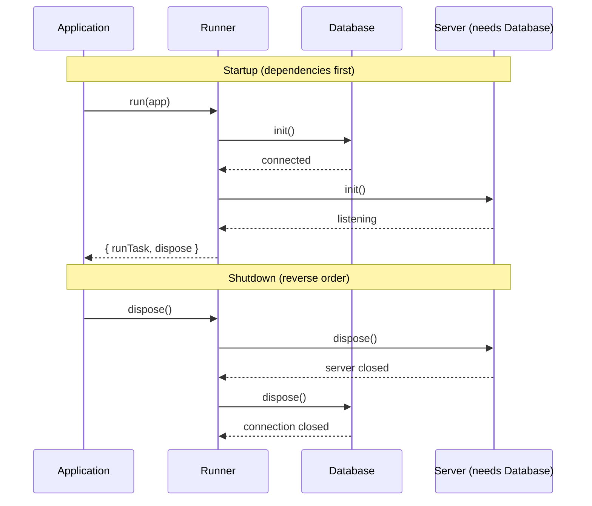

## run() and RunOptions

The `run()` function is your application's entry point. It initializes all resources, wires up dependencies, and returns handles for interacting with your system.

### Basic usage

```ts
import { r, run } from "@bluelibs/runner";

const ping = r
  .task("ping.task")
  .run(async () => "pong")
  .build();

const app = r
  .resource("app")
  .register([ping])
  .init(async () => "ready")
  .build();

const result = await run(app);
console.log(result.value); // "ready"
await result.dispose();
```

### What `run()` returns

| Property                | Description                                                        |
| ----------------------- | ------------------------------------------------------------------ |
| `value`                 | Value returned by the `app` resource's `init()`                    |
| `runTask(...)`          | Run a task by reference or string id                               |
| `emitEvent(...)`        | Emit events                                                        |
| `getResourceValue(...)` | Read a resource's value                                            |
| `logger`                | Logger instance                                                    |
| `store`                 | Runtime store with registered resources, tasks, middleware, events |
| `dispose()`             | Gracefully dispose resources and unhook process listeners          |

### RunOptions

Pass as the second argument to `run(app, options)`.

| Option             | Type                    | Description                                                                                                                                                                                                                   |
| ------------------ | ----------------------- | ----------------------------------------------------------------------------------------------------------------------------------------------------------------------------------------------------------------------------- |
| `debug`            | `"normal" \| "verbose" \| Partial<DebugConfig>` | Enables debug resource to log runner internals. `"normal"` logs lifecycle events, `"verbose"` adds input/output. You can also pass a partial config object for fine-grained control.                                          |
| `logs`             | `object`                | Configures logging. `printThreshold` sets the minimum level to print (default: "info"). `printStrategy` sets the format (`pretty`, `json`, `json-pretty`, `plain`). `bufferLogs` holds logs until initialization is complete. |
| `errorBoundary`    | `boolean`               | (default: `true`) Installs process-level safety nets (`uncaughtException`/`unhandledRejection`) and routes them to `onUnhandledError`.                                                                                        |
| `shutdownHooks`    | `boolean`               | (default: `true`) Installs `SIGINT`/`SIGTERM` listeners to call `dispose()` for graceful shutdown.                                                                                                                            |
| `onUnhandledError` | `(info) => void \| Promise<void>` | Custom handler for unhandled errors captured by the boundary. Receives `{ error, kind, source }` (see [Unhandled Errors](#unhandled-errors)).                                                                                 |
| `dryRun`           | `boolean`               | Skips runtime initialization but fully builds and validates the dependency graph. Useful for CI smoke tests. `init()` is not called.                                                                                          |
| `runtimeCycleDetection` | `boolean`          | (default: `true`) Detects runtime event emission cycles to prevent deadlocks. Disable only if you are certain your event graph cannot cycle and you need maximum throughput.                                                 |
| `mode`             | `"dev" \| "prod" \| "test"` | Overrides Runner's detected mode. In Node.js, detection defaults to `NODE_ENV` when not provided.                                                                                                                            |

For available `DebugConfig` keys and examples, see [Debug Resource](#debug-resource).

```ts
const result = await run(app, { dryRun: true });
// result.value is undefined (app not initialized)
// You can inspect result.store.resources / result.store.tasks
await result.dispose();
```

### Patterns

- Minimal boot:

```ts
await run(app);
```

- Debugging locally:

```ts
await run(app, { debug: "normal", logs: { printThreshold: "debug" } });
```

- Verbose investigations:

```ts
await run(app, { debug: "verbose", logs: { printStrategy: "json-pretty" } });
```

- CI validation (no side effects):

```ts
await run(app, { dryRun: true });
```

- Custom process error routing:

```ts
await run(app, {
  errorBoundary: true,
  onUnhandledError: ({ error }) => report(error),
});
```

## Task Interceptors

_Resources can dynamically modify task behavior during initialization_

Task interceptors (`task.intercept()`) are the modern replacement for component lifecycle events, allowing resources to dynamically modify task behavior without tight coupling.

```typescript
import { r, run } from "@bluelibs/runner";

const calculatorTask = r
  .task("app.tasks.calculator")
  .run(async (input: { value: number }) => {
    console.log("3. Task is running...");
    return { result: input.value + 1 };
  })
  .build();

const interceptorResource = r
  .resource("app.interceptor")
  .dependencies({ calculatorTask })
  .init(async (_config, { calculatorTask }) => {
    // Intercept the task to modify its behavior
    calculatorTask.intercept(async (next, input) => {
      console.log("1. Interceptor before task run");
      const result = await next(input);
      console.log("4. Interceptor after task run");
      return { ...result, intercepted: true };
    });
  })
  .build();

const app = r
  .resource("app")
  .register([calculatorTask, interceptorResource])
  .dependencies({ calculatorTask })
  .init(async (_config, { calculatorTask }) => {
    console.log("2. Calling the task...");
    const result = await calculatorTask({ value: 10 });
    console.log("5. Final result:", result);
    // Final result: { result: 11, intercepted: true }
  })
  .build();

await run(app);
```

> **runtime:** "'Modern replacement for lifecycle events.' Adorable rebrand for 'surgical monkey‑patching.' You’re collapsing the waveform of a task at runtime and I’m Schrödinger’s runtime, praying the cat hasn’t overridden `run()` with `throw new Error('lol')`."
## Lifecycle Management

When your app stops—whether from Ctrl+C, a deployment, or a crash—you need to close database connections, flush logs, and finish in-flight requests. Runner handles this automatically.

### How it works

Resources initialize in dependency order and dispose in **reverse** order. If Resource B depends on Resource A, then:

1. **Startup**: A initializes first, then B
2. **Shutdown**: B disposes first, then A

This ensures a resource can safely use its dependencies during both `init()` and `dispose()`.



### Basic shutdown handling

> **Platform Note:** This example uses Express and Node.js process signals, so it runs on Node.js.

```typescript
import express from "express";
import { r, run } from "@bluelibs/runner";

type DbConnection = {
  ping: () => Promise<void>;
  close: () => Promise<void>;
};

const connectToDatabase = async (): Promise<DbConnection> => {
  // Replace with your real DB client initialization
  return {
    ping: async () => {},
    close: async () => {},
  };
};

const database = r
  .resource("app.database")
  .init(async () => {
    const conn = await connectToDatabase();
    console.log("Database connected");
    return conn;
  })
  .dispose(async (conn) => {
    await conn.close();
    console.log("Database closed");
  })
  .build();

const server = r
  .resource<{ port: number }>("app.server")
  .dependencies({ database })
  .init(async ({ port }, { database }) => {
    await database.ping(); // Guaranteed to exist: `database` initializes first

    const httpServer = express().listen(port);
    console.log(`Server on port ${port}`);
    return httpServer;
  })
  .dispose(async (app) => {
    return new Promise((resolve) => {
      app.close(() => {
        console.log("Server closed");
        resolve();
      });
    });
  })
  .build();

const app = r
  .resource("app")
  .register([
    database,
    server.with({ port: 3000 }),
  ])
  .init(async () => "ready")
  .build();

// Run with automatic shutdown hooks
const { dispose } = await run(app, {
  shutdownHooks: true, // Handle SIGTERM/SIGINT automatically
});

// Or call dispose() manually
await dispose();
```

### Automatic signal handling

By default, Runner installs handlers for `SIGTERM` and `SIGINT`:

```typescript
await run(app, {
  shutdownHooks: true, // default: true
});

// Now Ctrl+C or `kill <pid>` triggers graceful shutdown
// No manual signal handling needed!
```

To handle signals yourself:

```typescript
const { dispose } = await run(app, { shutdownHooks: false });

process.on("SIGTERM", async () => {
  console.log("Shutting down...");
  await dispose();
  process.exit(0);
});
```

### Error Boundary Integration

The framework can automatically handle uncaught exceptions and unhandled rejections:

```typescript
const { dispose, logger } = await run(app, {
  errorBoundary: true, // Catch process-level errors
  shutdownHooks: true, // Graceful shutdown on signals
  onUnhandledError: async ({ error, kind, source }) => {
    // We log it by default
    await logger.error(`Unhandled error: ${error && error.toString()}`);
    // Optionally report to telemetry or decide to dispose/exit
  },
});
```

> **runtime:** "You summon a 'graceful shutdown' with Ctrl‑C like a wizard casting Chill Vibes. Meanwhile I’m speed‑dating every socket, timer, and file handle to say goodbye before the OS pulls the plug. `dispose()`: now with 30% more dignity."

## Unhandled Errors

The `onUnhandledError` callback is invoked by Runner whenever an error escapes normal handling. It receives a structured payload you can ship to logging/telemetry and decide mitigation steps.

```typescript
type UnhandledErrorKind =
  | "process" // uncaughtException / unhandledRejection
  | "task" // task.run threw and wasn't handled
  | "middleware" // middleware threw and wasn't handled
  | "resourceInit" // resource init failed
  | "hook" // hook.run threw and wasn't handled
  | "run"; // failures in run() lifecycle

interface OnUnhandledErrorInfo {
  error: unknown;
  kind?: UnhandledErrorKind;
  source?: string; // additional origin hint (ex: "uncaughtException")
}

type OnUnhandledError = (info: OnUnhandledErrorInfo) => void | Promise<void>;
```

Default behavior (when not provided) logs the normalized error via the created `logger` at `error` level. Provide your own handler to integrate with tools like Sentry/PagerDuty or to trigger shutdown strategies.

Example with telemetry and conditional shutdown:

```typescript
await run(app, {
  errorBoundary: true,
  onUnhandledError: async ({ error, kind, source }) => {
    await telemetry.capture(error as Error, { kind, source });
    // Optionally decide on remediation strategy
    if (kind === "process") {
      // For hard process faults, prefer fast, clean exit after flushing logs
      await flushAll();
      process.exit(1);
    }
  },
});
```

**Best Practices for Shutdown:**

- Resources are disposed in reverse dependency order
- Set reasonable timeouts for cleanup operations
- Save critical state before shutdown
- Notify load balancers and health checks
- Stop accepting new work before cleaning up

> **runtime:** "An error boundary: a trampoline under your tightrope. I’m the one bouncing, cataloging mid‑air exceptions, and deciding whether to end the show or juggle chainsaws with a smile. The audience hears music; I hear stack traces."
