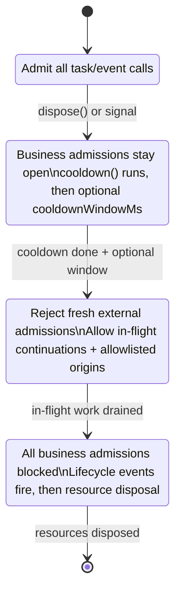
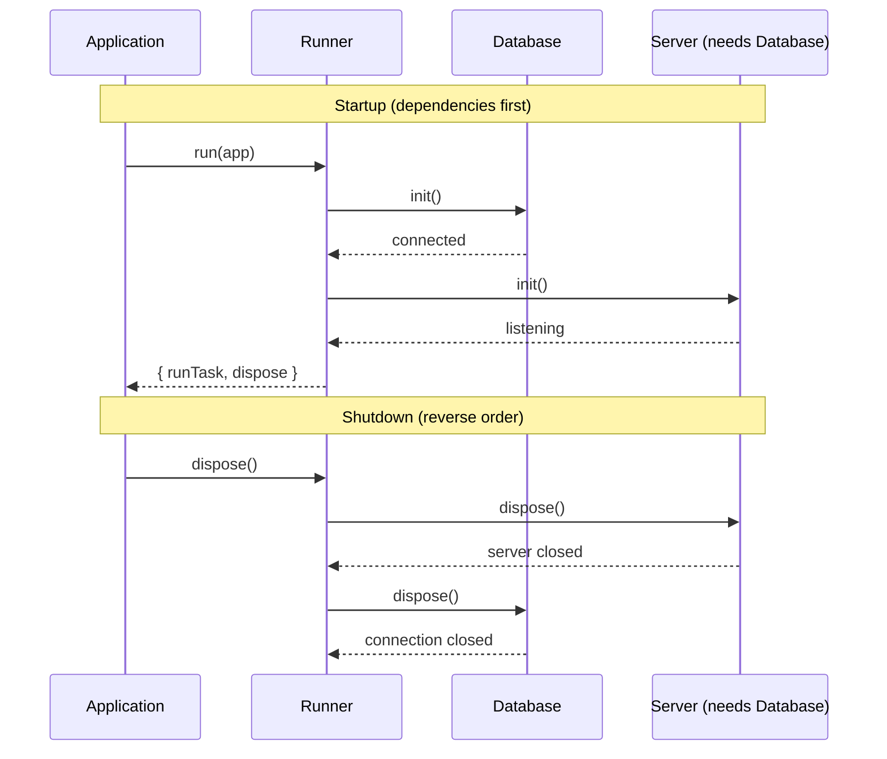
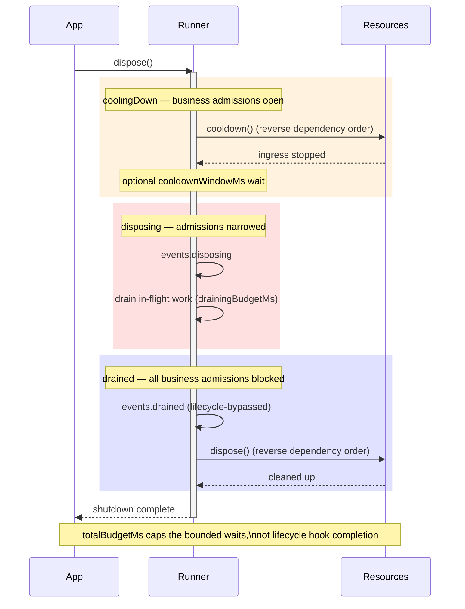

## run() and RunOptions

The `run()` function is your application's entry point. It initializes all resources, wires up dependencies, and returns handles for interacting with your system.

### Basic Usage

```typescript
import { r, run } from "@bluelibs/runner";

const ping = r
  .task("ping")
  .run(async () => "pong")
  .build();

const app = r
  .resource("app")
  .register([ping])
  .init(async () => "ready")
  .build();

const result = await run(app);
console.log(result.value); // "ready"
await result.dispose();
```

### What `run()` Returns

An object with the following properties and methods:

| Property                    | Description |
| --------------------------- | ----------- |
| `value`                     | Value returned by the root resource `init()`. |
| `runOptions`                | Normalized effective `run(...)` options for this runtime. |
| `runTask(...)`              | Run a task by definition or string id. |
| `emitEvent(...)`            | Emit an event with optional failure/report controls. |
| `getResourceValue(...)`     | Read an already initialized resource value. |
| `getLazyResourceValue(...)` | Initialize and read a resource on demand in lazy mode. |
| `getResourceConfig(...)`    | Read a resource's resolved config. |
| `getHealth(resourceDefs?)`  | Evaluate health probes for visible health-enabled resources. |
| `state`                     | Current admission state: `"running"` or `"paused"`. |
| `pause(reason?)`            | Stop new runtime/resource-origin admissions while in-flight work continues. |
| `resume()`                  | Reopen admissions immediately. |
| `recoverWhen(...)`          | Register paused-state recovery conditions. |
| `root`                      | Root resource definition for this runtime. |
| `logger`                    | Logger instance for the runtime. |
| `store`                     | Runtime store with registered definitions and internals. |
| `dispose()`                 | Start graceful shutdown and await full disposal. |
| `dispose({ force: true })`  | Skip graceful shutdown orchestration and jump straight to resource disposal. |

Note: `dispose()` is blocked while `run()` is still bootstrapping and becomes available once initialization completes. `force: true` is manual-only; signal-based shutdown stays graceful.

This object is your main interface to interact with the running application. It can also be declared as a dependency via `resources.runtime`.

Mode access:

- `runtime.mode` is the resolved effective mode for this container.
- Inside resources, prefer `resources.mode` when you only need the mode and not the full runtime capability surface.

Important bootstrap note: when `runtime` is declared as a dependency inside a resource `init()`, startup may still be in progress. You are guaranteed your current resource dependencies are ready, but not that all registered resources in the app are already initialized.

`runtime.getHealth(...)` and `resources.health.getHealth(...)` are available only after `run(...)` finishes bootstrapping and before disposal starts. They only evaluate resources that define `health()`. Resources without `health()` are skipped, and startup-unused lazy resources stay asleep instead of being probed.

For lifecycle-owned polling and delayed work inside resources, depend on `resources.timers`. It is available during `init()`, stops accepting new timers when its `cooldown()` starts, and clears pending timers during `dispose()`.

`runtime.pause()` is not a shutdown. It is a synchronous idempotent admission switch: new runtime/resource-origin task runs and event emissions are rejected immediately, while already-running tasks, hooks, and middleware can continue and finish. `runtime.resume()` reopens admissions immediately. When you want automatic recovery, register one or more `runtime.recoverWhen({ everyMs, check })` conditions while paused; Runner resumes only after every active condition for that pause episode is satisfied.

### Ready-Phase Startup Orchestration

Use `events.ready` for components that should start only after bootstrap is fully complete.

`resource.ready(...)` runs right before `events.ready`:

- Runner locks the store/event manager/logger first.
- Then it runs `ready()` for initialized resources in dependency order.
- Then it emits `events.ready`.

Example:

- In `eventLanesResource` `mode: "network"` (default), Event Lanes consumers attach dequeue workers on `events.ready`.
- This guarantees serializer/resource setup done during `init()` is available before first consumed message is re-emitted.
- Event Lanes also resolves queue `prefetch` from lane bindings at this phase, before `network`-mode consumers start.
- RPC Lanes (`rpcLanesResource`) resolve task/event routing + serve allow-list during `init()`; they do not require a separate ready-phase consumer start.
- Full Event/RPC lane behavior is documented in [REMOTE_LANES.md](../readmes/REMOTE_LANES.md).

If a component may process external work immediately, prefer `ready` over direct startup in `init()`.

### RunOptions

Pass as the second argument to `run(app, options)`.

| Option             | Type                                            | Description |
| ------------------ | ----------------------------------------------- | ----------- |
| `debug`            | `"normal" \| "verbose" \| Partial<DebugConfig>` | Enable runtime debug output. |
| `logs`             | `object`                                        | Configure log printing, formatting, and buffering. |
| `errorBoundary`    | `boolean`                                       | Install process-level unhandled error capture. |
| `shutdownHooks`    | `boolean`                                       | Install `SIGINT` / `SIGTERM` graceful shutdown hooks. |
| `signal`           | `AbortSignal`                                   | Outer runtime shutdown trigger. Aborting it cancels bootstrap before readiness or starts graceful disposal after readiness, and stays separate from `context.signal`. |
| `dispose`          | `object`                                        | Configure shutdown budgets: `totalBudgetMs`, `drainingBudgetMs`, `abortWindowMs`, and `cooldownWindowMs`. |
| `onUnhandledError` | `(info) => void \| Promise<void>`               | Custom handler for unhandled errors caught by Runner. |
| `dryRun`           | `boolean`                                       | Validate the graph without running resource lifecycle. |
| `lazy`             | `boolean`                                       | Skip startup-unused resources until `getLazyResourceValue(...)` wakes them. |
| `lifecycleMode`    | `"sequential" \| "parallel"`                    | Control startup and disposal scheduling strategy. |
| `executionContext` | `boolean \| ExecutionContextOptions`            | Enable correlation ids, execution frames, and inherited execution signals. |
| `identity`         | `IAsyncContext<IIdentity>`                      | Override which async context Runner reads for identity-aware framework behavior. |
| `mode`             | `"dev" \| "prod" \| "test"`                     | Override Runner's detected runtime mode. |

For available `DebugConfig` keys and examples, see [Debug Resource](#debug-resource).

### Execution Context

When enabled, Runner exposes the current execution state via `asyncContexts.execution`.
Treat that surface as a runtime-owned accessor for correlation ids, inherited execution signals, and optional frame tracing. Use `r.asyncContext(...)` for business state; use `asyncContexts.execution` for runtime execution metadata.

```typescript
import { asyncContexts, run } from "@bluelibs/runner";

const runtime = await run(app, {
  executionContext: { frames: "off", cycleDetection: false },
});

const executionContext = asyncContexts.execution.use();
executionContext.correlationId;
executionContext.signal;
```

When `executionContext` is enabled, Runner automatically creates execution context for top-level runtime task runs and event emissions. You do not need `provide()` just to turn propagation on.

`use()` fails fast when no execution is active. Use `asyncContexts.execution.tryUse()` when the context is optional.

Use `executionContext: true` for full tracing, or `executionContext: { frames: "off", cycleDetection: false }` for the lightweight signal/correlation mode.

Use `provide()` only when you want to seed execution metadata from an external boundary such as a correlation id or an existing `AbortSignal`.
Use `record()` when you want the execution tree back.

The important signal split is:

- pass a signal explicitly at the boundary with `runTask(..., { signal })` or `emitEvent(..., { signal })`
- once execution context is enabled, nested injected task and event calls can inherit that ambient execution signal automatically

See [Execution Context and Signal Propagation](#execution-context-and-signal-propagation) in Advanced Features for the full snapshot shapes, propagation rules, `provide()` / `record()` patterns, and a minimal HTTP request example.

```typescript
const result = await run(app, { dryRun: true });
// result.value is undefined (app not initialized)
// You can inspect result.store.resources / result.store.tasks
await result.dispose();
```

### Patterns

- Minimal boot:

```typescript
await run(app);
```

- Debugging locally:

```typescript
await run(app, { debug: "normal", logs: { printThreshold: "debug" } });
```

- Verbose investigations:

```typescript
await run(app, { debug: "verbose", logs: { printStrategy: "json_pretty" } });
```

- CI validation (no side effects):

```typescript
await run(app, { dryRun: true });
```

- Lazy startup + explicit on-demand resource init:

```typescript
const runtime = await run(app, { lazy: true, lifecycleMode: "parallel" });
const db = await runtime.getLazyResourceValue("app.db");
```

- Custom process error routing:

```typescript
await run(app, {
  errorBoundary: true,
  onUnhandledError: ({ error }) => report(error),
});
```

## Lifecycle Management

When your app stops—whether from Ctrl+C, a deployment, or a crash—you need to stop admitting new work and close resources cleanly. Runner handles this automatically.

### Shutdown Admission Semantics

Runner applies source-aware admission rules during shutdown:

| Phase         | Admission Policy                                                                                                                                                                                                                               |
| ------------- | ---------------------------------------------------------------------------------------------------------------------------------------------------------------------------------------------------------------------------------------------- |
| `running`     | Admit all task/event calls.                                                                                                                                                                                                                    |
| `coolingDown` | Shutdown has started and resources are running `cooldown()`. Business admissions remain open through cooldown execution and, when configured, the bounded `dispose.cooldownWindowMs` window that follows.                                      |
| `disposing`   | Reject fresh external admissions (`runtime`, `resource`) except for cooldown-assembled resource-origin allowances. Allow in-flight internal continuations (`task`, `hook`, `middleware`) while their originating execution is still active.    |
| `drained`     | Reject all new business task/event admissions. Lifecycle events (`events.drained`) are lifecycle-bypassed — their hooks fire, but those hooks cannot start new tasks or emit additional events. Lifecycle flow continues to resource disposal. |

Practical effect for HTTP resources:

- In `coolingDown`, stop ingress quickly and assemble any shutdown-specific admission allowances.
- In `disposing`, stop accepting new requests and apply the final shutdown admission policy.
- Let already in-flight request work finish during the drain budget window.
- If the drain budget expires first and `dispose.abortWindowMs > 0`, Runner aborts its active task signals and waits that extra bounded window before continuing into `drained`.
  These are the task-local cooperative `AbortSignal`s Runner created for currently in-flight task trees, not arbitrary external caller signals.
- If `dispose.drainingBudgetMs` is `0`, Runner skips the graceful wait but still checks whether business work is already drained; when it is not and `dispose.abortWindowMs > 0`, the cooperative-abort window starts immediately.
- In `drained`, business admissions are fully closed; resource cleanup/disposal starts.


```mermaid
stateDiagram-v2
    [*] --> running
    running --> coolingDown : dispose() or signal
    coolingDown --> disposing : cooldown done + optional window
    disposing --> drained : in‑flight work drained
    drained --> [*] : resources disposed

    running : Admit all task/event calls
    coolingDown : Business admissions stay open\ncooldown() runs, then optional cooldownWindowMs
    disposing : Reject fresh external admissions\nAllow in‑flight continuations + allowlisted origins
    drained : All business admissions blocked\nLifecycle events fire, then resource disposal
```

### Resource `cooldown()` in Shutdown

`resource.cooldown(...)` is a pre-drain ingress-stop hook. It runs during `coolingDown`, before any optional `dispose.cooldownWindowMs` window, before `disposing`, before `events.disposing`, and before drain waiting.

- Use it to stop intake quickly (for example: stop accepting HTTP requests, mark readiness as false, stop new queue consumption).
- It can be async, but keep it fast and return promptly. Let Runner's drain phase wait for business work.
- After all cooldown hooks finish, Runner keeps the broader `coolingDown` admission policy open for `dispose.cooldownWindowMs` only when that value is greater than `0`. Once `disposing` begins, fresh admissions narrow to allowlisted resource-origin calls and in-flight continuations.
- Do not use `cooldown()` as "wait until all work is done"; that is the runtime drain phase (`dispose.drainingBudgetMs`).
- `dispose.drainingBudgetMs: 0` means "do not wait gracefully", not "pretend in-flight work does not exist". Runner still probes the current drain state before deciding whether to enter `dispose.abortWindowMs`.
- Apply `cooldown()` primarily to ingress/front-door resources that admit external work into Runner (HTTP APIs, tRPC gateways, queue consumers, websocket gateways).
- Supporting resources that in-flight tasks depend on (for example: database pools, cache clients, message producers) should usually not perform teardown in `cooldown()`. Keep them available until `dispose()`.
- Execution order mirrors resource disposal: reverse dependency waves, with same-wave parallelism when `lifecycleMode: "parallel"` is enabled.

### Resource `ready()` in Startup

`resource.ready(...)` is a post-init startup hook. It runs after Runner locks mutation surfaces and before `events.ready` is emitted.

- Use it to start ingress or consumers only when startup wiring is complete.
- It follows dependency-safe startup order (dependencies before dependents), with same-wave parallelism in `lifecycleMode: "parallel"` mode.
- In lazy mode, if a startup-unused resource is initialized later on-demand, its `ready()` runs immediately once after that lazy initialization.

### How It Works

Resources initialize in dependency order and dispose in **reverse** order. If Resource B depends on Resource A, then:

1. **Startup init**: A initializes first, then B
2. **Startup ready**: A `ready()` runs before B `ready()`
3. **Shutdown**: B disposes first, then A

This ensures a resource can safely use its dependencies during `init()`, `ready()`, `cooldown()`, and `dispose()`.


```mermaid
sequenceDiagram
    participant App as Application
    participant Runner
    participant R1 as Database
    participant R2 as Server (needs Database)

    Note over App,R2: Startup (dependencies first)
    App->>Runner: run(app)
    Runner->>R1: init()
    R1-->>Runner: connected
    Runner->>R2: init()
    R2-->>Runner: listening
    Runner-->>App: { runTask, dispose }

    Note over App,R2: Shutdown (reverse order)
    App->>Runner: dispose()
    Runner->>R2: dispose()
    R2-->>Runner: server closed
    Runner->>R1: dispose()
    R1-->>Runner: connection closed
```

### Basic Shutdown Handling

> **Platform Note:** This example uses Express and Node.js process signals, so it runs on Node.js.

```typescript
import express from "express";
import { r, run } from "@bluelibs/runner";

type DbConnection = {
  ping: () => Promise<void>;
  close: () => Promise<void>;
};

const connectToDatabase = async (): Promise<DbConnection> => {
  // Replace with your real DB client initialization
  return {
    ping: async () => {},
    close: async () => {},
  };
};

const database = r
  .resource("database")
  .init(async () => {
    const conn = await connectToDatabase();
    console.log("Database connected");
    return conn;
  })
  .dispose(async (conn) => {
    await conn.close();
    console.log("Database closed");
  })
  .build();

const server = r
  .resource<{ port: number }>("server")
  .dependencies({ database })
  .context(() => ({ isReady: true as boolean }))
  .init(async ({ port }, { database }) => {
    await database.ping(); // Guaranteed to exist: `database` initializes first

    const httpServer = express().listen(port);
    console.log(`Server on port ${port}`);
    return httpServer;
  })
  .cooldown(async (httpServer, _config, _deps, context) => {
    // Intake stop phase: signal "not ready" and stop new connections quickly.
    context.isReady = false;
    httpServer.close();
  })
  .dispose(async (app) => {
    // Final teardown phase: close leftovers, free resources.
    return new Promise((resolve) => {
      app.close(() => {
        console.log("Server closed");
        resolve();
      });
    });
  })
  .build();

const app = r
  .resource("app")
  .register([database, server.with({ port: 3000 })])
  .init(async () => "ready")
  .build();

// Run with automatic shutdown hooks
const { dispose } = await run(app, {
  shutdownHooks: true, // Handle SIGTERM/SIGINT automatically
});

// Or call dispose() manually
await dispose();
```

### Automatic Signal Handling

By default, Runner installs handlers for `SIGTERM` and `SIGINT`.
Signal-based shutdown follows the standard disposal lifecycle sequence described in [Disposal Lifecycle Events](#disposal-lifecycle-events) below.

If a signal arrives while `run(...)` is still bootstrapping, Runner cancels startup, stops remaining `ready()` / `events.ready` work at the next safe boundary, and performs the same graceful teardown path.

Signal-based shutdown, `run(..., { signal })`, and manual `runtime.dispose()` follow the same graceful shutdown lifecycle (`coolingDown`, `disposing`, `drained`) and the same admission rules.

```typescript
await run(app, {
  shutdownHooks: true, // default: true
  dispose: {
    totalBudgetMs: 30_000,
    drainingBudgetMs: 20_000,
    abortWindowMs: 0,
    cooldownWindowMs: 0,
  },
});
```

You can also let an outer owner drive shutdown directly:

```typescript
const controller = new AbortController();
const runtime = await run(app, {
  shutdownHooks: false,
  signal: controller.signal,
});

controller.abort("container shutdown");
```

That signal cancels bootstrap before readiness or starts runtime disposal after readiness. It does not become `context.signal` and is not exposed through the injected `runtime` resource.

To handle signals yourself:

```typescript
const { dispose } = await run(app, { shutdownHooks: false });

process.on("SIGTERM", async () => {
  console.log("Shutting down...");
  await dispose();
  process.exit(0);
});
```

### Disposal Lifecycle Events

Manual `runtime.dispose()` and signal-based shutdown both follow:

1. transition to `coolingDown`
2. resource `cooldown()` (reverse dependency order)
3. optionally keep business admissions open for `dispose.cooldownWindowMs`
4. transition to `disposing`
5. `events.disposing` (awaited)
6. drain wait (`dispose.drainingBudgetMs`, capped by remaining `dispose.totalBudgetMs`)
7. optionally abort Runner-owned active task signals and wait `dispose.abortWindowMs` (also capped by remaining `dispose.totalBudgetMs`)
8. transition to `drained`
9. `events.drained` (lifecycle-bypassed, awaited)
10. fully awaited resource disposal

`runtime.dispose({ force: true })` is the exception:

1. transition directly to shutdown lockdown
2. skip any remaining graceful phases that have not started yet
3. this can skip `cooldown()`
4. this can skip `dispose.cooldownWindowMs`
5. this can skip `events.disposing`
6. this can skip drain wait
7. this can skip `dispose.abortWindowMs`
8. this can skip `events.drained`
9. fully awaited resource disposal

Important: `force: true` does not preempt lifecycle work that is already in flight, such as an active `cooldown()` call that has already started running.


```mermaid
sequenceDiagram
    participant App
    participant Runner
    participant Resources

    App->>Runner: dispose()
    activate Runner

    rect rgb(255, 243, 224)
        Note over Runner: coolingDown — business admissions open
        Runner->>Resources: cooldown() (reverse dependency order)
        Resources-->>Runner: ingress stopped
        Note over Runner: optional cooldownWindowMs wait
    end

    rect rgb(255, 224, 224)
        Note over Runner: disposing — admissions narrowed
        Runner->>Runner: events.disposing
        Runner->>Runner: drain in‑flight work (drainingBudgetMs)
    end

    rect rgb(224, 224, 255)
        Note over Runner: drained — all business admissions blocked
        Runner->>Runner: events.drained (lifecycle‑bypassed)
        Runner->>Resources: dispose() (reverse dependency order)
        Resources-->>Runner: cleaned up
    end

    Runner-->>App: shutdown complete
    deactivate Runner

    Note over App,Resources: totalBudgetMs caps the bounded waits,\nnot lifecycle hook completion
```

Important: hooks registered on `events.drained` **do fire** (the emission is lifecycle-bypassed), but those hooks cannot start new tasks or emit additional events — all regular business admissions are blocked once `drained` begins.

Important: `runtime.dispose({ force: true })` does not emit `events.disposing` or `events.drained`. It is meant for operator-controlled "stop waiting and tear down now" situations.

### Error Boundary Integration

The framework can automatically handle uncaught exceptions and unhandled rejections:

```typescript
const { dispose, logger } = await run(app, {
  errorBoundary: true, // Catch process-level errors
  shutdownHooks: true, // Graceful shutdown on signals
  onUnhandledError: async ({ error, kind, source }) => {
    // We log it by default
    await logger.error(`Unhandled error: ${error && error.toString()}`);
    // Optionally report to telemetry or decide to dispose/exit
  },
});
```

## Unhandled Errors

The `onUnhandledError` callback is invoked by Runner whenever an error escapes normal handling. It receives a structured payload you can ship to logging/telemetry and decide mitigation steps.

```typescript
type UnhandledErrorKind =
  | "process" // uncaughtException / unhandledRejection
  | "task" // task.run threw and wasn't handled
  | "middleware" // middleware threw and wasn't handled
  | "resourceInit" // resource init failed
  | "hook" // hook.run threw and wasn't handled
  | "run"; // failures in run() lifecycle

interface OnUnhandledErrorInfo {
  error: unknown;
  kind?: UnhandledErrorKind;
  source?: string; // additional origin hint (ex: "uncaughtException")
}

type OnUnhandledError = (info: OnUnhandledErrorInfo) => void | Promise<void>;
```

Default behavior (when not provided) logs the normalized error via the created `logger` at `error` level. Provide your own handler to integrate with tools like Sentry/PagerDuty or to trigger shutdown strategies.

Example with telemetry and conditional shutdown:

```typescript
await run(app, {
  errorBoundary: true,
  onUnhandledError: async ({ error, kind, source }) => {
    await telemetry.capture(error as Error, { kind, source });
    // Optionally decide on remediation strategy
    if (kind === "process") {
      // For hard process faults, prefer fast, clean exit after flushing logs
      await flushAll();
      process.exit(1);
    }
  },
});
```

**Best Practices for Shutdown:**

- Resources are disposed in reverse dependency order
- Set reasonable timeouts for cleanup operations
- Save critical state before shutdown
- Notify load balancers and health checks
- Stop accepting new work before cleaning up
