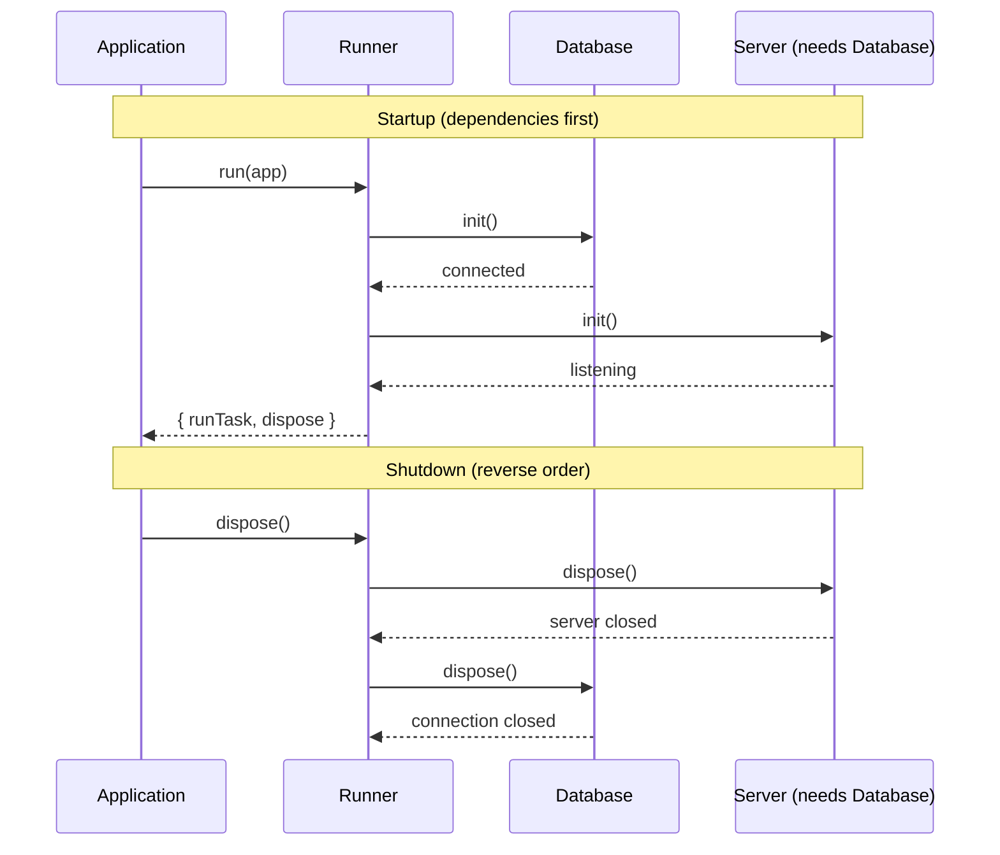

## run() and RunOptions

The `run()` function is your application's entry point. It initializes all resources, wires up dependencies, and returns handles for interacting with your system.

### Basic usage

```typescript
import { r, run } from "@bluelibs/runner";

const ping = r
  .task("ping.task")
  .run(async () => "pong")
  .build();

const app = r
  .resource("app")
  .register([ping])
  .init(async () => "ready")
  .build();

const result = await run(app);
console.log(result.value); // "ready"
await result.dispose();
```

### What `run()` returns

An object with the following properties and methods:

| Property                    | Description                                                                                                                                                                                                                                                                                                                                                                                                                                                                                                                                 |
| --------------------------- | ------------------------------------------------------------------------------------------------------------------------------------------------------------------------------------------------------------------------------------------------------------------------------------------------------------------------------------------------------------------------------------------------------------------------------------------------------------------------------------------------------------------------------------------- |
| `value`                     | Value returned by the `app` resource's `init()`                                                                                                                                                                                                                                                                                                                                                                                                                                                                                             |
| `runTask(...)`              | Run a task by reference or string id                                                                                                                                                                                                                                                                                                                                                                                                                                                                                                        |
| `emitEvent(...)`            | Emit events (supports `failureMode: "fail-fast" \| "aggregate"`, `throwOnError`, `report`)                                                                                                                                                                                                                                                                                                                                                                                                                                                  |
| `getResourceValue(...)`     | Read a resource's value                                                                                                                                                                                                                                                                                                                                                                                                                                                                                                                     |
| `getLazyResourceValue(...)` | Initialize/read a resource on demand. Available only when `run(..., { lazy: true })` is enabled.                                                                                                                                                                                                                                                                                                                                                                                                                                            |
| `getResourceConfig(...)`    | Read a resource's resolved config                                                                                                                                                                                                                                                                                                                                                                                                                                                                                                           |
| `getRootId()`               | Read the root resource id                                                                                                                                                                                                                                                                                                                                                                                                                                                                                                                   |
| `getRootConfig()`           | Read the root resource config                                                                                                                                                                                                                                                                                                                                                                                                                                                                                                               |
| `getRootValue()`            | Read the initialized root resource value                                                                                                                                                                                                                                                                                                                                                                                                                                                                                                    |
| `logger`                    | Logger instance                                                                                                                                                                                                                                                                                                                                                                                                                                                                                                                             |
| `store`                     | Runtime store with registered resources, tasks, middleware, events, and runtime internals                                                                                                                                                                                                                                                                                                                                                                                                                                                   |
| `dispose()`                 | Transitions to `disposing` (stops admitting fresh external work), runs resource `cooldown()` in reverse dependency order, emits `globals.events.disposing` (awaited), waits for in-flight tasks + event hooks to drain (up to `disposeDrainBudgetMs`, capped by remaining `disposeBudgetMs`), logs a structured `warn` if drain did not complete in time, transitions to `drained` (blocks all new business task/event admissions), emits `globals.events.drained` (lifecycle-bypassed, awaited), then disposes resources and removes hooks |

Note: `dispose()` is blocked while `run()` is still bootstrapping and becomes available once initialization completes.

This object is your main interface to interact with the running application. Can also be declared as dependency via `globals.resources.runtime`.

Important bootstrap note: when `runtime` is declared as a dependency inside a resource `init()`, startup may still be in progress. You are guaranteed your current resource dependencies are ready, but not that all registered resources in the app are already initialized.

### Ready-phase startup orchestration

Use `globals.events.ready` for components that should start only after bootstrap is fully complete.

Example:

- In `eventLanesResource` `mode: "network"` (default), Event Lanes consumers attach dequeue workers on `globals.events.ready`.
- This guarantees serializer/resource setup done during `init()` is available before first consumed message is re-emitted.
- Event Lanes also resolves queue `prefetch` from lane bindings at this phase, before `network`-mode consumers start.
- RPC Lanes (`rpcLanesResource`) resolve task/event routing + serve allow-list during `init()`; they do not require a separate ready-phase consumer start.
- Full Event/RPC lane behavior is documented in [REMOTE_LANES.md](../readmes/REMOTE_LANES.md).

If a component may process external work immediately, prefer `ready` over direct startup in `init()`.

### RunOptions

Pass as the second argument to `run(app, options)`.

| Option                       | Type                                            | Description                                                                                                                                                                                                                                                                                                                                                                                                                                                                                            |
| ---------------------------- | ----------------------------------------------- | ------------------------------------------------------------------------------------------------------------------------------------------------------------------------------------------------------------------------------------------------------------------------------------------------------------------------------------------------------------------------------------------------------------------------------------------------------------------------------------------------------ |
| `debug`                      | `"normal" \| "verbose" \| Partial<DebugConfig>` | Enables debug resource to log runner internals. `"normal"` logs lifecycle events, `"verbose"` adds input/output. You can also pass a partial config object for fine-grained control.                                                                                                                                                                                                                                                                                                                   |
| `logs`                       | `object`                                        | Configures logging. `printThreshold` sets the minimum level to print (default: "info"). `printStrategy` sets the format (`pretty`, `json`, `json-pretty`, `plain`). `bufferLogs` holds logs until initialization is complete.                                                                                                                                                                                                                                                                          |
| `errorBoundary`              | `boolean`                                       | (default: `true`) Installs process-level safety nets (`uncaughtException`/`unhandledRejection`) and routes them to `onUnhandledError`.                                                                                                                                                                                                                                                                                                                                                                 |
| `shutdownHooks`              | `boolean`                                       | (default: `true`) Installs `SIGINT`/`SIGTERM` signal handlers for graceful shutdown. If a signal arrives during bootstrap, startup is cancelled and initialized resources are rolled back.                                                                                                                                                                                                                                                                                                             |
| `disposeBudgetMs`            | `number`                                        | (default: `30_000`) Total disposal budget in milliseconds. Covers resource `cooldown()`, `disposing` hooks, drain wait, `drained` hooks, and resource disposal wait. When exhausted, Runner stops waiting and returns.                                                                                                                                                                                                                                                                                 |
| `disposeDrainBudgetMs`       | `number`                                        | (default: `30_000`) Drain wait budget in milliseconds while in `disposing`. Runner waits for in-flight business work (tasks + event hook execution) up to this value, capped by remaining `disposeBudgetMs`. If drain times out, Runner logs a structured warning and continues shutdown. Set to `0` to skip drain waiting.                                                                                                                                                                            |
| `onUnhandledError`           | `(info) => void \| Promise<void>`               | Custom handler for unhandled errors captured by the boundary. Receives `{ error, kind, source }` (see [Unhandled Errors](#unhandled-errors)).                                                                                                                                                                                                                                                                                                                                                          |
| `dryRun`                     | `boolean`                                       | Skips runtime initialization but fully builds and validates the dependency graph. Useful for CI smoke tests. `init()` is not called.                                                                                                                                                                                                                                                                                                                                                                   |
| `lazy`                       | `boolean`                                       | (default: `false`) Skips startup initialization for resources that are not used during bootstrap. In lazy mode, `getResourceValue(...)` throws for startup-unused resources and `getLazyResourceValue(...)` can initialize/read them on demand. When `lazy` is `false`, `getLazyResourceValue(...)` throws a fail-fast error. If combined with `lifecycleMode: "parallel"`, bootstrap-used resources still initialize in dependency-ready parallel waves while startup-unused resources stay deferred. |
| `lifecycleMode`              | `"sequential" \| "parallel"`                    | (default: `"sequential"`) Controls startup/disposal scheduling strategy. Use string values directly (for example `lifecycleMode: "parallel"`), no enum import required. `initMode` is kept as a deprecated alias for backward compatibility.                                                                                                                                                                                                                                                           |
| `runtimeEventCycleDetection` | `boolean`                                       | (default: `true`) Detects runtime event emission cycles to prevent deadlocks. Disable only if you are certain your event graph cannot cycle and you need maximum throughput.                                                                                                                                                                                                                                                                                                                           |
| `mode`                       | `"dev" \| "prod" \| "test"`                     | Overrides Runner's detected mode. In Node.js, detection defaults to `NODE_ENV` when not provided.                                                                                                                                                                                                                                                                                                                                                                                                      |

For available `DebugConfig` keys and examples, see [Debug Resource](#debug-resource).

```typescript
const result = await run(app, { dryRun: true });
// result.value is undefined (app not initialized)
// You can inspect result.store.resources / result.store.tasks
await result.dispose();
```

### Patterns

- Minimal boot:

```typescript
await run(app);
```

- Debugging locally:

```typescript
await run(app, { debug: "normal", logs: { printThreshold: "debug" } });
```

- Verbose investigations:

```typescript
await run(app, { debug: "verbose", logs: { printStrategy: "json-pretty" } });
```

- CI validation (no side effects):

```typescript
await run(app, { dryRun: true });
```

- Lazy startup + explicit on-demand resource init:

```typescript
const runtime = await run(app, { lazy: true, lifecycleMode: "parallel" });
const db = await runtime.getLazyResourceValue("app.db");
```

- Custom process error routing:

```typescript
await run(app, {
  errorBoundary: true,
  onUnhandledError: ({ error }) => report(error),
});
```

## Lifecycle Management

When your app stops—whether from Ctrl+C, a deployment, or a crash—you need to stop admitting new work and close resources cleanly. Runner handles this automatically.

### Shutdown Admission Semantics

Runner applies source-aware admission rules during shutdown:

| Phase       | Admission Policy                                                                                                                                                                                                                                       |
| ----------- | ------------------------------------------------------------------------------------------------------------------------------------------------------------------------------------------------------------------------------------------------------ |
| `running`   | Admit all task/event calls.                                                                                                                                                                                                                            |
| `disposing` | Reject fresh external admissions (`runtime`, `resource`). Allow in-flight internal continuations (`task`, `hook`, `middleware`) while their originating execution is still active.                                                                     |
| `drained`   | Reject all new business task/event admissions. Lifecycle events (`globals.events.drained`) are lifecycle-bypassed — their hooks fire, but those hooks cannot start new tasks or emit additional events. Lifecycle flow continues to resource disposal. |

Practical effect for HTTP resources:

- In `disposing`, stop accepting new requests and stop new external admissions into Runner.
- Let already in-flight request work finish during the drain budget window.
- In `drained`, business admissions are fully closed; resource cleanup/disposal starts.

### Resource `cooldown()` in Shutdown

`resource.cooldown(...)` is a pre-drain ingress-stop hook. It runs right after Runner enters `disposing`, before `globals.events.disposing`, and before drain waiting.

- Use it to stop intake quickly (for example: stop accepting HTTP requests, mark readiness as false, stop new queue consumption).
- It can be async, but keep it fast and return promptly. Let Runner's drain phase wait for business work.
- Do not use `cooldown()` as "wait until all work is done"; that is the runtime drain phase (`disposeDrainBudgetMs`).
- Apply `cooldown()` primarily to ingress/front-door resources that admit external work into Runner (HTTP APIs, tRPC gateways, queue consumers, websocket gateways).
- Supporting resources that in-flight tasks depend on (for example: database pools, cache clients, message producers) should usually not perform teardown in `cooldown()`. Keep them available until `dispose()`.
- Execution order mirrors resource disposal: reverse dependency waves, with same-wave parallelism when `lifecycleMode: "parallel"` is enabled.

### How It Works

Resources initialize in dependency order and dispose in **reverse** order. If Resource B depends on Resource A, then:

1. **Startup**: A initializes first, then B
2. **Shutdown**: B disposes first, then A

This ensures a resource can safely use its dependencies during `init()`, `cooldown()`, and `dispose()`.


```mermaid
sequenceDiagram
    participant App as Application
    participant Runner
    participant R1 as Database
    participant R2 as Server (needs Database)

    Note over App,R2: Startup (dependencies first)
    App->>Runner: run(app)
    Runner->>R1: init()
    R1-->>Runner: connected
    Runner->>R2: init()
    R2-->>Runner: listening
    Runner-->>App: { runTask, dispose }

    Note over App,R2: Shutdown (reverse order)
    App->>Runner: dispose()
    Runner->>R2: dispose()
    R2-->>Runner: server closed
    Runner->>R1: dispose()
    R1-->>Runner: connection closed
```

### Basic shutdown handling

> **Platform Note:** This example uses Express and Node.js process signals, so it runs on Node.js.

```typescript
import express from "express";
import { r, run } from "@bluelibs/runner";

type DbConnection = {
  ping: () => Promise<void>;
  close: () => Promise<void>;
};

const connectToDatabase = async (): Promise<DbConnection> => {
  // Replace with your real DB client initialization
  return {
    ping: async () => {},
    close: async () => {},
  };
};

const database = r
  .resource("app.database")
  .init(async () => {
    const conn = await connectToDatabase();
    console.log("Database connected");
    return conn;
  })
  .dispose(async (conn) => {
    await conn.close();
    console.log("Database closed");
  })
  .build();

const server = r
  .resource<{ port: number }>("app.server")
  .dependencies({ database })
  .context(() => ({ isReady: true as boolean }))
  .init(async ({ port }, { database }) => {
    await database.ping(); // Guaranteed to exist: `database` initializes first

    const httpServer = express().listen(port);
    console.log(`Server on port ${port}`);
    return httpServer;
  })
  .cooldown(async (httpServer, _config, _deps, context) => {
    // Intake stop phase: signal "not ready" and stop new connections quickly.
    context.isReady = false;
    httpServer.close();
  })
  .dispose(async (app) => {
    // Final teardown phase: close leftovers, free resources.
    return new Promise((resolve) => {
      app.close(() => {
        console.log("Server closed");
        resolve();
      });
    });
  })
  .build();

const app = r
  .resource("app")
  .register([database, server.with({ port: 3000 })])
  .init(async () => "ready")
  .build();

// Run with automatic shutdown hooks
const { dispose } = await run(app, {
  shutdownHooks: true, // Handle SIGTERM/SIGINT automatically
});

// Or call dispose() manually
await dispose();
```

### Automatic signal handling

By default, Runner installs handlers for `SIGTERM` and `SIGINT`.
Signal-based shutdown follows the standard disposal lifecycle sequence described in [Disposal Lifecycle Events](#disposal-lifecycle-events) below.

If a signal arrives while `run(...)` is still bootstrapping, Runner cancels startup and performs the same graceful teardown path.

Signal-based shutdown and manual `runtime.dispose()` follow the same lifecycle events (`disposing`, `drained`) and the same admission rules.

```typescript
await run(app, {
  shutdownHooks: true, // default: true
  disposeBudgetMs: 30_000, // total shutdown/disposal wait budget
  disposeDrainBudgetMs: 30_000, // drain wait budget (capped by remaining disposeBudgetMs)
});
```

To handle signals yourself:

```typescript
const { dispose } = await run(app, { shutdownHooks: false });

process.on("SIGTERM", async () => {
  console.log("Shutting down...");
  await dispose();
  process.exit(0);
});
```

### Disposal lifecycle events

Manual `runtime.dispose()` and signal-based shutdown both follow:

1. transition to `disposing`
2. resource `cooldown()` (reverse dependency order)
3. `globals.events.disposing` (awaited)
4. drain wait (`disposeDrainBudgetMs`, capped by remaining `disposeBudgetMs`)
5. transition to `drained`
6. `globals.events.drained` (lifecycle-bypassed, awaited)
7. resource disposal (within remaining `disposeBudgetMs`)

Important: hooks registered on `globals.events.drained` **do fire** (the emission is lifecycle-bypassed), but those hooks cannot start new tasks or emit additional events — all regular business admissions are blocked once `drained` begins.

### Error Boundary Integration

The framework can automatically handle uncaught exceptions and unhandled rejections:

```typescript
const { dispose, logger } = await run(app, {
  errorBoundary: true, // Catch process-level errors
  shutdownHooks: true, // Graceful shutdown on signals
  onUnhandledError: async ({ error, kind, source }) => {
    // We log it by default
    await logger.error(`Unhandled error: ${error && error.toString()}`);
    // Optionally report to telemetry or decide to dispose/exit
  },
});
```

> **runtime:** "You summon a 'graceful shutdown' with Ctrl‑C like a wizard casting Chill Vibes. Meanwhile I'm speed‑dating every socket, timer, and file handle to say goodbye before the OS pulls the plug. `dispose()`: now with 30% more dignity."

## Unhandled Errors

The `onUnhandledError` callback is invoked by Runner whenever an error escapes normal handling. It receives a structured payload you can ship to logging/telemetry and decide mitigation steps.

```typescript
type UnhandledErrorKind =
  | "process" // uncaughtException / unhandledRejection
  | "task" // task.run threw and wasn't handled
  | "middleware" // middleware threw and wasn't handled
  | "resourceInit" // resource init failed
  | "hook" // hook.run threw and wasn't handled
  | "run"; // failures in run() lifecycle

interface OnUnhandledErrorInfo {
  error: unknown;
  kind?: UnhandledErrorKind;
  source?: string; // additional origin hint (ex: "uncaughtException")
}

type OnUnhandledError = (info: OnUnhandledErrorInfo) => void | Promise<void>;
```

Default behavior (when not provided) logs the normalized error via the created `logger` at `error` level. Provide your own handler to integrate with tools like Sentry/PagerDuty or to trigger shutdown strategies.

Example with telemetry and conditional shutdown:

```typescript
await run(app, {
  errorBoundary: true,
  onUnhandledError: async ({ error, kind, source }) => {
    await telemetry.capture(error as Error, { kind, source });
    // Optionally decide on remediation strategy
    if (kind === "process") {
      // For hard process faults, prefer fast, clean exit after flushing logs
      await flushAll();
      process.exit(1);
    }
  },
});
```

**Best Practices for Shutdown:**

- Resources are disposed in reverse dependency order
- Set reasonable timeouts for cleanup operations
- Save critical state before shutdown
- Notify load balancers and health checks
- Stop accepting new work before cleaning up

> **runtime:** "An error boundary: a trampoline under your tightrope. I'm the one bouncing, cataloging mid‑air exceptions, and deciding whether to end the show or juggle chainsaws with a smile. The audience hears music; I hear stack traces."
