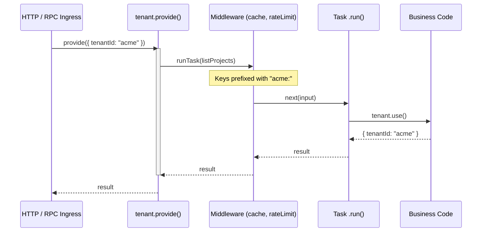

## Multi-Tenant Systems

Multi-tenant work in Runner usually means one `run(app)` serving many tenants without mixing their logical state.
The built-in same-runtime pattern uses `asyncContexts.tenant`: provide tenant identity at ingress, require it where correctness depends on it, and let tenant-aware middleware partition its internal state when tenant context exists.

```typescript
import { asyncContexts, middleware, r, run } from "@bluelibs/runner";

const { tenant } = asyncContexts;

const projectRepo = r
  .resource("projectRepo")
  .init(async () => {
    const storage = new Map<string, string[]>();

    return {
      async list() {
        const { tenantId } = tenant.use();
        return storage.get(tenantId) ?? [];
      },
      async add(name: string) {
        const { tenantId } = tenant.use();
        const current = storage.get(tenantId) ?? [];
        current.push(name);
        storage.set(tenantId, current);
      },
    };
  })
  .build();

const listProjects = r
  .task("listProjects")
  .middleware([tenant.require(), middleware.task.cache.with({ ttl: 30_000 })])
  .dependencies({ projectRepo })
  .run(async (_input, { projectRepo }) => projectRepo.list())
  .build();

const app = r.resource("app").register([projectRepo, listProjects]).build();
const runtime = await run(app);

// Starting a task with our custom tenant provider.
const projects = await tenant.provide({ tenantId: "acme" }, async () =>
  runtime.runTask(listProjects),
);
```

This pattern keeps tenant identity in async context instead of global mutable state.
The flow is: ingress provides the tenant, tenant-sensitive tasks require it, downstream code reads it, and middleware such as `cache` uses it to partition internal keys.



Use the built-in tenant accessor in two modes:

- strict: `tenant.use()` when tenant context must exist, throws if not.
- safe: `tenant.tryUse()` or `tenant.has()` in shared or frontend-safe helpers

```typescript
import { asyncContexts } from "@bluelibs/runner";

const { tenant } = asyncContexts;

export function getTelemetryTenantId(): string | undefined {
  return tenant.tryUse()?.tenantId;
}
```

Tenant-sensitive middleware defaults to `tenantScope: "auto"`.
That means `cache`, `rateLimit`, `debounce`, `throttle`, and `concurrency` prefix their internal keys with `tenantId` when tenant context exists, and fall back to the shared non-tenant keyspace when it does not.

- Use `tenant.provide({ tenantId }, fn)` at HTTP, RPC, queue, or job ingress.
- Use `tenant.require()` or `tenant.use()` when running without a tenant would be a correctness bug.
- Omit `tenantScope` for the default `"auto"` behavior.
- Use `tenantScope: "auto"` when you want to make that default explicit in config.
- Use `tenantScope: "required"` when middleware correctness depends on tenant context being present.
- Use `tenantScope: "off"` only for intentional cross-tenant sharing.
- `tenantId` must be a non-empty string, cannot contain `:`, and cannot be `__global__` because tenant-aware middleware reserves those for internal namespace partitioning.

```typescript
import { middleware } from "@bluelibs/runner";

middleware.task.rateLimit.with({
  windowMs: 60_000,
  max: 10,
  tenantScope: "required",
});
```

Runner still reads tenant identity from `asyncContexts.tenant`. Destructure it as `const { tenant } = asyncContexts` to keep call sites concise.
That `tenant` accessor is an application async context contract; unlike `asyncContexts.execution`, it exists to carry your business state rather than expose runtime tracing metadata.
If a specific provider or middleware family needs extra metadata, keep that on that provider's own config instead of overloading `tenantScope`.

`TenantContextValue` now extends `ITenant`, so you can layer app-specific tenant metadata onto the built-in contract without replacing Runner's `tenantId` requirement.

```typescript
import { asyncContexts, type TenantContextValue } from "@bluelibs/runner";

declare module "@bluelibs/runner" {
  interface TenantContextValue {
    region: string;
    plan: "free" | "enterprise";
  }
}

const { tenant } = asyncContexts;

await tenant.provide(
  {
    // type-safety on proide and use()
    tenantId: "acme",
    region: "eu-west",
    plan: "enterprise",
  },
  async () => {
    const currentTenant = tenant.use();
    await runtime.runTask(listProjects);

    console.log(currentTenant.region);
  },
);
```

Runner still validates `tenantId` at runtime. Extra fields are part of your app-level contract, so validate them where that metadata enters your system if correctness depends on them.

> **Platform Note:** Tenant propagation requires `AsyncLocalStorage`. That works on the Node build and on compatible Bun/Deno runtimes when async-local storage is exposed. On platforms without it, `provide()` still runs the callback but does not propagate tenant state, so shared or frontend-compatible code should treat tenant presence as optional and use `tenant.tryUse()` or `tenant.has()` when probing.
