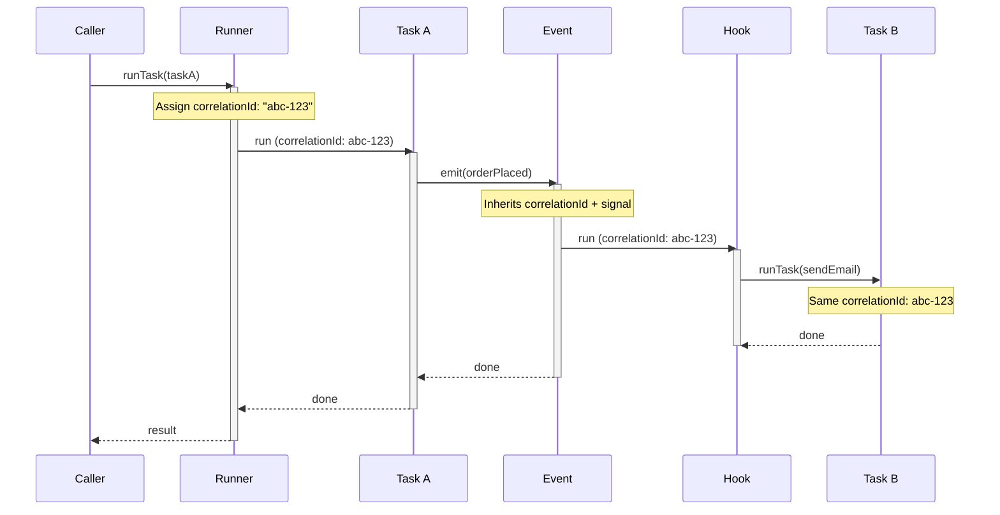

## Observability Strategy (Logs, Metrics, and Traces)

Runner gives you integration points for the three core observability signals:

- **Logs**: structured runtime and business events through `resources.logger`
- **Metrics**: counters, timers, and gauges you record from interceptors, tasks, and resources
- **Traces**: correlation ids and execution boundaries that you can bridge into your tracing stack

Use all three together. Logs explain what happened, metrics tell you whether it keeps happening, and traces show where latency and failures accumulate.

For resource-level operational status, Runner also supports optional `resource.health(...)` probes and aggregates them through `resources.health.getHealth(...)` and `runtime.getHealth(...)`. Health is opt-in and intentionally separate from logs/metrics/traces.

### Naming Conventions

Keep names stable and low-cardinality:

- **Metric names**: `{domain}_{action}_{unit}` such as `tasks_total`, `tasks_duration_ms`, `http_requests_total`
- **Metric labels**: bounded values such as `task_id`, `result`, `env`, `dependency`
- **Trace span names**: `{component}:{operation}` such as `task:createUser` or `resource:database.init`
- **Log source**: a stable component id or subsystem name such as `createUser`, `database`, or `billing.http`

Avoid user ids, emails, payload bodies, or request paths with unbounded values as labels. Cardinality explosions are very educational right until they start billing you.

## Logging

Runner ships a structured logger with consistent fields, print controls, and `onLog(...)` hooks for custom transports.

### Basic Logging

```typescript
import { resources, r, run } from "@bluelibs/runner";

const app = r
  .resource("app")
  .dependencies({ logger: resources.logger })
  .init(async (_config, { logger }) => {
    await logger.info("Starting business process");
    await logger.warn("This may take a while");
    await logger.error("Database connection failed", {
      error: new Error("Connection refused"),
    });
    await logger.critical("System is on fire", {
      data: { subsystem: "billing" },
    });
    await logger.debug("Debug details");
    await logger.trace("Very detailed trace");
  })
  .build();

await run(app, {
  logs: {
    printThreshold: "info",
    printStrategy: "pretty",
    bufferLogs: true,
  },
});
```

`bufferLogs: true` buffers log output until startup completes. Leave it `false` when you want logs printed as they happen during bootstrap.

### Log Levels

The logger supports six levels:

| Level      | Use for                                           |
| ---------- | ------------------------------------------------- |
| `trace`    | Ultra-detailed debugging                          |
| `debug`    | Development-time diagnostics                      |
| `info`     | Normal lifecycle and business progress            |
| `warn`     | Degraded but still functioning behavior           |
| `error`    | Failures that need attention                      |
| `critical` | System-threatening failures or emergency fallback |

### Print Controls

Use `run(app, { logs })` to control console output:

| Option           | Meaning                                                                                  |
| ---------------- | ---------------------------------------------------------------------------------------- |
| `printThreshold` | Lowest printed level. Use `null` to disable console printing entirely.                   |
| `printStrategy`  | `"pretty"`, `"plain"`, `"json"`, or `"json_pretty"`.                                     |
| `bufferLogs`     | When `true`, buffer logs until startup completes, then flush them in order.              |

> **Note:** In `NODE_ENV=test`, Runner defaults `logs.printThreshold` to `null`. If you want test logs printed, set `logs.printThreshold` explicitly.

### Structured Logging

Structured data makes logs useful after the adrenaline hits.

```typescript
import { resources, r } from "@bluelibs/runner";

const createUser = r
  .task<{ email: string }>("createUser")
  .dependencies({ logger: resources.logger })
  .run(async (input, { logger }) => {
    await logger.info("User creation attempt", {
      source: "createUser",
      data: {
        email: input.email,
        registrationSource: "web",
      },
    });

    try {
      const user = await Promise.resolve({
        id: "user-1",
        email: input.email,
      });

      await logger.info("User created successfully", {
        data: { userId: user.id },
      });

      return user;
    } catch (error) {
      await logger.error("User creation failed", {
        error,
        data: { attemptedEmail: input.email },
      });
      throw error;
    }
  })
  .build();
```

### Context-Aware Logging

Use `logger.with(...)` when a request, tenant, or workflow needs stable metadata across multiple log calls.

```typescript
import { resources, r } from "@bluelibs/runner";

const requestContext = r
  .asyncContext<{ requestId: string; userId: string }>("requestContext")
  .build();

const handleRequest = r
  .task<{ path: string }>("handleRequest")
  .dependencies({ logger: resources.logger })
  .run(async (input, { logger }) => {
    const request = requestContext.use();

    const requestLogger = logger.with({
      source: "http.request",
      additionalContext: {
        requestId: request.requestId,
        userId: request.userId,
      },
    });

    await requestLogger.info("Processing request", {
      data: { path: input.path },
    });
  })
  .build();
```

### Transport Hooks

`logger.onLog(...)` is the simplest bridge to external sinks such as Winston, Datadog, OTLP exporters, or a custom transport resource.

```typescript
import { resources, r } from "@bluelibs/runner";

// Assuming `shipLogToCollector` is your transport function.
const logShipping = r
  .resource("logShipping")
  .dependencies({ logger: resources.logger })
  .init(async (_config, { logger }) => {
    logger.onLog(async (log) => {
      await shipLogToCollector(log);
    });
  })
  .build();
```

## Metrics

Runner does not ship a metrics backend. The intended pattern is: install counters/timers in interceptors, then publish them to Prometheus, OpenTelemetry metrics, StatsD, or your own telemetry service.

### Task Metrics with `taskRunner.intercept(...)`

```typescript
import { resources, r } from "@bluelibs/runner";

type Metrics = {
  increment: (
    name: string,
    labels?: Record<string, string>,
  ) => Promise<void> | void;
  observe: (
    name: string,
    value: number,
    labels?: Record<string, string>,
  ) => Promise<void> | void;
};

const metrics = r
  .resource<Metrics>("metrics")
  .init(async () => ({
    increment: async () => {},
    observe: async () => {},
  }))
  .build();

const taskMetrics = r
  .resource("taskMetrics")
  .dependencies({
    taskRunner: resources.taskRunner,
    metrics,
  })
  .init(async (_config, { taskRunner, metrics }) => {
    taskRunner.intercept(async (next, input) => {
      const startedAt = Date.now();
      const labels = { task_id: input.task.definition.id };

      try {
        const result = await next(input);
        await metrics.increment("tasks_total", { ...labels, result: "ok" });
        await metrics.observe(
          "tasks_duration_ms",
          Date.now() - startedAt,
          labels,
        );
        return result;
      } catch (error) {
        await metrics.increment("tasks_total", { ...labels, result: "error" });
        await metrics.observe(
          "tasks_duration_ms",
          Date.now() - startedAt,
          labels,
        );
        throw error;
      }
    });
  })
  .build();
```

This keeps metrics policy in one place and avoids duplicating timer logic in every task.

### Event Metrics with `eventManager.intercept(...)`

```typescript
import { resources, r } from "@bluelibs/runner";

const eventMetrics = r
  .resource("eventMetrics")
  .dependencies({
    eventManager: resources.eventManager,
    metrics,
  })
  .init(async (_config, { eventManager, metrics }) => {
    eventManager.intercept(async (next, emission) => {
      const labels = { event_id: emission.definition.id };
      await metrics.increment("events_emitted_total", labels);
      return next(emission);
    });
  })
  .build();
```

## Traces

Runner does not include a tracer backend, but it does provide the execution metadata needed to correlate work across nested task and event calls.

### Correlation via `executionContext`

Enable execution context at runtime when you want correlation ids and inherited execution signals:



```typescript
import { run } from "@bluelibs/runner";

const runtime = await run(app, {
  executionContext: { frames: "off", cycleDetection: false },
});
```

Then read the current execution context from inside tasks, hooks, or interceptors:

```typescript
import { asyncContexts, resources, r } from "@bluelibs/runner";

const traceAwareTask = r
  .task("traceAwareTask")
  .dependencies({ logger: resources.logger })
  .run(async (_input, { logger }) => {
    const execution = asyncContexts.execution.tryUse();

    await logger.info("Running task", {
      data: {
        correlationId: execution?.correlationId,
      },
    });
  })
  .build();
```

### Bridging to a Tracer

Install tracing bridges during resource `init()` so they wrap the full runtime pipeline:

```typescript
import { asyncContexts, resources, r } from "@bluelibs/runner";

// Assuming `tracer` is your tracing SDK instance.
const tracing = r
  .resource("tracing")
  .dependencies({ taskRunner: resources.taskRunner })
  .init(async (_config, { taskRunner }) => {
    taskRunner.intercept(async (next, input) => {
      const execution = asyncContexts.execution.tryUse();
      const span = tracer.startSpan(`task:${input.task.definition.id}`, {
        attributes: {
          correlationId: execution?.correlationId,
          taskId: input.task.definition.id,
        },
      });

      try {
        return await next(input);
      } catch (error) {
        span.recordException(error);
        throw error;
      } finally {
        span.end();
      }
    });
  })
  .build();
```

This pattern keeps tracing backend choice in your app while Runner provides the stable runtime boundaries.

## Debug Resource

`debug` is Runner's built-in runtime instrumentation surface. Use it when you want to inspect lifecycle, middleware, task, or hook behavior without changing application code.

```typescript
await run(app, {
  debug: "normal",
  logs: { printThreshold: "debug", printStrategy: "pretty" },
});
```

Common modes:

- `debug: "normal"` for lifecycle and execution flow
- `debug: "verbose"` when you also want more detailed payload-level inspection
- `debug: { ...partialConfig }` for targeted instrumentation

Use `debug` for temporary diagnosis, not as a substitute for durable logs or metrics.
