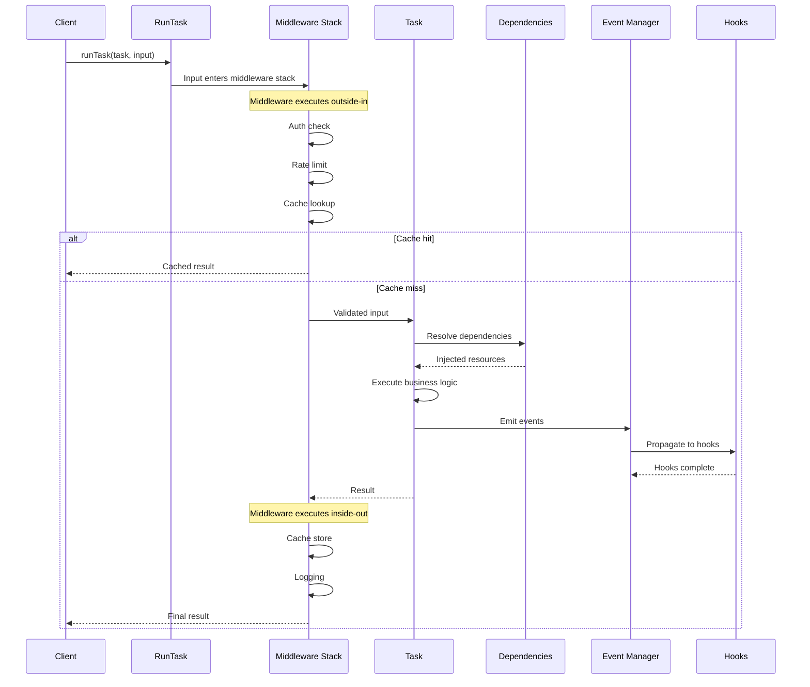
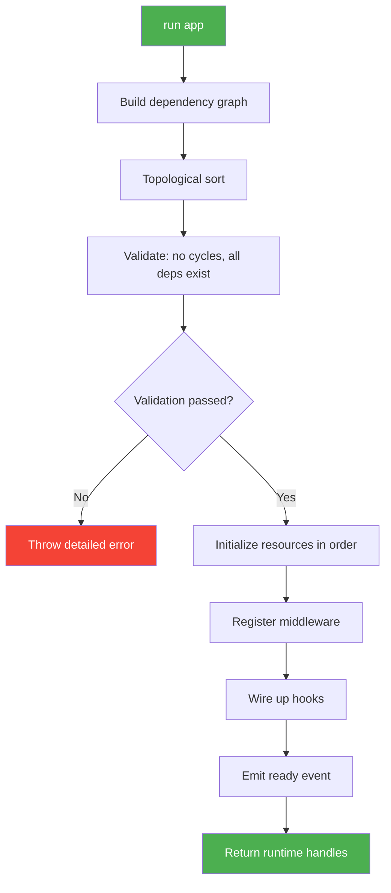
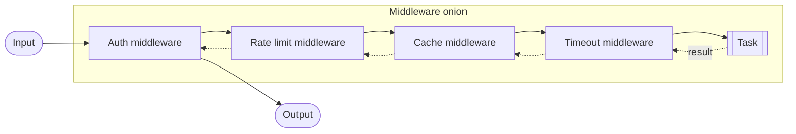
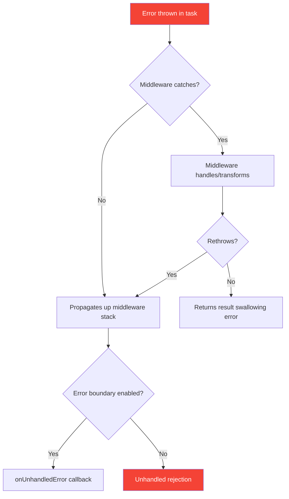

## Under the Hood

For developers who want to understand how Runner actually works—not just how to use it.

---

### Request Lifecycle

When you call `runTask(myTask, input)`, here's the complete journey:



**Key points:**

1. **Middleware is an onion** — outer layers wrap inner layers
2. **Dependencies resolve once** — resources are singletons
3. **Events are fire-and-forget** — but hooks can fail the task if they throw
4. **Cache middleware short-circuits** — never hits the task on cache hit

---

### How `run()` Bootstraps

When you call `run(app)`, Runner performs these steps in order:



**Initialization order:**

1. **Leaf resources first** — resources with no dependencies initialize first
2. **Dependent resources after** — each resource waits for its dependencies
3. **Parallel when possible** — independent branches initialize concurrently
4. **Middleware registration** — happens after resources are available
5. **Ready event** — signals all initialization complete

**Example dependency resolution:**

```typescript
app
├── server (depends on: database, config)
│   ├── database (depends on: config)
│   │   └── config (no dependencies) ← initializes first
│   └── config ← already initialized, skipped
└── userService (depends on: database)
    └── database ← already initialized, skipped
```

Initialization order: `config` → `database` → `server`, `userService` (parallel)

---

### Concurrency Model

Runner operates within Node.js's single-threaded event loop:

**What this means:**

- **No thread safety concerns** — JavaScript is single-threaded
- **Async operations interleave** — while one awaits, others can run
- **CPU-bound work blocks** — long synchronous operations freeze everything
- **I/O is non-blocking** — database queries, HTTP calls run in parallel

**Built-in concurrency controls:**

| Tool                     | Purpose                      | Scope                  |
| ------------------------ | ---------------------------- | ---------------------- |
| `Semaphore`              | Limit concurrent operations  | Per semaphore instance |
| `Queue`                  | Sequential processing by key | Per queue key          |
| `concurrency` middleware | Limit task parallelism       | Per task or shared     |
| `rateLimit` middleware   | Limit calls per time window  | Per task               |

**Example: 10 concurrent database queries max**

```typescript
import { Semaphore } from "@bluelibs/runner";

const dbSemaphore = new Semaphore(10);

const queryTask = r
  .task("db.query")
  .middleware([
    globals.middleware.task.concurrency.with({ semaphore: dbSemaphore }),
  ])
  .run(async (sql) => database.query(sql))
  .build();

// Even with 100 concurrent callers, only 10 queries run at once
```

---

### Middleware Composition

Middleware forms an "onion" around your task:



**Execution flow:**

```typescript
// Registration order
.middleware([auth, rateLimit, cache, timeout])

// Execution order (outside-in, then inside-out):
// 1. auth.before()
// 2.   rateLimit.before()
// 3.     cache.before() → might short-circuit!
// 4.       timeout.before()
// 5.         TASK EXECUTES
// 6.       timeout.after()
// 7.     cache.after() → store result
// 8.   rateLimit.after()
// 9. auth.after()
```

**Short-circuiting:**

Any middleware can return early without calling `next()`:

```typescript
const cacheMiddleware = r.middleware
  .task("cache")
  .run(async ({ task, next, journal }) => {
    const cached = await cache.get(task.input);
    if (cached) return cached; // Short-circuit! Task never runs

    const result = await next(task.input);
    await cache.set(task.input, result);
    return result;
  })
  .build();
```

---

### Design Guarantees

**What Runner promises:**

| Guarantee               | Description                                          |
| ----------------------- | ---------------------------------------------------- |
| **Dependency order**    | Resources initialize in dependency order, every time |
| **Dispose order**       | Resources dispose in reverse dependency order        |
| **Singleton resources** | Each resource initializes exactly once per `run()`   |
| **Middleware order**    | Middleware executes in registration order            |
| **Event priority**      | Hooks execute in `.order()` priority (lower first)   |
| **Type safety**         | If it compiles, dependencies will resolve at runtime |
| **Dispose idempotency** | Calling `dispose()` multiple times is safe           |

**What Runner does NOT guarantee:**

| Non-guarantee                       | Why                                                             |
| ----------------------------------- | --------------------------------------------------------------- |
| Hook completion before task returns | Hooks run async; use `stopPropagation()` if blocking needed     |
| Perfect error boundaries            | Unhandled rejections in hooks can crash; use `onUnhandledError` |
| Resource initialization timing      | Parallel branches race; don't depend on specific timing         |
| Middleware state isolation          | Middleware can share state via journal; be intentional          |

---

### Error Propagation

How errors flow through the system:



**Error handling patterns:**

```typescript
// Fallback middleware — swallow errors, return default
.middleware([globals.middleware.task.fallback.with({ fallback: defaultValue })])

// Retry middleware — retry on transient errors
.middleware([globals.middleware.task.retry.with({
  retries: 3,
  stopRetryIf: (err) => err.permanent
})])

// Custom error transformation
const errorWrapper = r.middleware
  .task("errors.wrap")
  .run(async ({ task, next }) => {
    try {
      return await next(task.input);
    } catch (error) {
      throw new ApplicationError("Task failed", { cause: error });
    }
  })
  .build();
```

---

### Event System Internals

**Event propagation:**

1. Task emits event via injected event callable
2. Event manager validates payload (if schema exists)
3. Hooks are sorted by `.order()` priority
4. Hooks execute sequentially (or parallel if `event.parallel(true)`)
5. Any hook can call `event.stopPropagation()` to halt further processing

**Priority batches (parallel mode):**

```typescript
// Three hooks with different priorities
hookA.order(10); // Priority 10
hookB.order(10); // Priority 10
hookC.order(20); // Priority 20

// With event.parallel(true):
// Batch 1: hookA and hookB run concurrently
// Batch 2: hookC runs after batch 1 completes
```

**Wildcard hooks:**

```typescript
// Catches ALL events (except those with excludeFromGlobalHooks tag)
const auditHook = r
  .hook("audit.all")
  .on("*")
  .run(async (event) => {
    console.log(`Event: ${event.id}`, event.data);
  })
  .build();
```

---

### Memory and Performance

**Component overhead:**

| Component  | Memory | Initialization   |
| ---------- | ------ | ---------------- |
| Task       | ~1KB   | Instant          |
| Resource   | ~2KB   | Varies by init() |
| Event      | ~0.5KB | Instant          |
| Hook       | ~1KB   | Instant          |
| Middleware | ~1KB   | Instant          |

**Performance characteristics:**

- Task execution: ~0.0005ms overhead (excluding middleware)
- Middleware per layer: ~0.00026ms overhead
- Event emission: ~0.004ms
- Cache hit: ~0.000125ms

**Optimization tips:**

1. **Middleware order matters** — fast checks first
2. **Cache aggressively** — cache middleware is very fast
3. **Batch events** — emit once with aggregate data
4. **Resource pooling** — reuse connections via resource singletons

---

### Extending Runner

**Plugin patterns:**

1. **Global middleware** — use `.everywhere()` for cross-cutting concerns
2. **Tag-based behavior** — use tags for declarative configuration
3. **Resource wrappers** — compose resources for reusable patterns
4. **Event interception** — use `eventManager.intercept()` for audit/logging

**Creating reusable modules:**

```typescript
// myPlugin.ts
export const myPlugin = {
  resources: {
    cache: myCustomCache,
    logger: myCustomLogger,
  },
  middleware: {
    task: {
      auth: myAuthMiddleware,
      metrics: myMetricsMiddleware,
    },
  },
  tags: {
    public: publicApiTag,
    internal: internalTag,
  },
};

// Usage
import { myPlugin } from "./myPlugin";

const app = r
  .resource("app")
  .register([
    myPlugin.resources.cache.with({ redis: "..." }),
    myTask.middleware([myPlugin.middleware.task.auth]),
  ])
  .build();
```

> **runtime:** "Under the hood: a place of promises, graphs, and existential dread about garbage collection. You wanted to know how I work? I'm a topological sort wearing an async trench coat. The real magic is that any of this is debuggable at all."

---

## Integration Recipes

Production-ready patterns for common integration scenarios. Each recipe is tested and ready to adapt.

---

### Docker Deployment

A production-ready Dockerfile for Runner applications:

```dockerfile
# Dockerfile
FROM node:20-alpine AS builder

WORKDIR /app
COPY package*.json ./
RUN npm ci --only=production

COPY . .
RUN npm run build

FROM node:20-alpine AS runtime

WORKDIR /app
COPY --from=builder /app/dist ./dist
COPY --from=builder /app/node_modules ./node_modules
COPY --from=builder /app/package.json ./

# Non-root user for security
RUN addgroup -g 1001 -S nodejs && adduser -S runner -u 1001
USER runner

# Health check
HEALTHCHECK --interval=30s --timeout=3s --start-period=5s --retries=3 \
  CMD wget --no-verbose --tries=1 --spider http://localhost:3000/health || exit 1

ENV NODE_ENV=production
EXPOSE 3000

CMD ["node", "dist/index.js"]
```

**Docker Compose for local development:**

```yaml
# docker-compose.yml
version: "3.8"

services:
  app:
    build: .
    ports:
      - "3000:3000"
    environment:
      - NODE_ENV=development
      - DATABASE_URL=postgres://postgres:postgres@db:5432/app
      - REDIS_URL=redis://redis:6379
    depends_on:
      db:
        condition: service_healthy
      redis:
        condition: service_started
    volumes:
      - ./src:/app/src:ro
    command: npm run dev

  db:
    image: postgres:15-alpine
    environment:
      POSTGRES_PASSWORD: postgres
      POSTGRES_DB: app
    healthcheck:
      test: ["CMD-SHELL", "pg_isready -U postgres"]
      interval: 5s
      timeout: 5s
      retries: 5
    volumes:
      - postgres_data:/var/lib/postgresql/data

  redis:
    image: redis:7-alpine
    volumes:
      - redis_data:/data

volumes:
  postgres_data:
  redis_data:
```

**Health check endpoint:**

```typescript
import { r, globals } from "@bluelibs/runner";

const healthCheck = r
  .task("app.tasks.healthCheck")
  .dependencies({ database, cache })
  .run(async (_, { database, cache }) => {
    const checks = {
      database: false,
      cache: false,
      uptime: process.uptime(),
    };

    try {
      await database.query("SELECT 1");
      checks.database = true;
    } catch {}

    try {
      await cache.ping();
      checks.cache = true;
    } catch {}

    const healthy = checks.database && checks.cache;
    return { status: healthy ? "healthy" : "degraded", checks };
  })
  .build();

// In your Express/Fastify setup
app.get("/health", async (req, res) => {
  const result = await healthCheck();
  res.status(result.status === "healthy" ? 200 : 503).json(result);
});
```

---

### Graceful Shutdown with Kubernetes

Handle k8s termination signals properly:

```typescript
import { r, run } from "@bluelibs/runner";

const app = r
  .resource("app")
  .register([...components])
  .build();

const { dispose, logger } = await run(app, {
  shutdownHooks: true, // Handles SIGTERM/SIGINT automatically
  errorBoundary: true,
  onUnhandledError: async ({ error, kind }) => {
    await logger.error("Unhandled error", { error, data: { kind } });
  },
});

// k8s sends SIGTERM, then waits terminationGracePeriodSeconds before SIGKILL
// Runner's shutdownHooks will call dispose() on SIGTERM

// For custom handling:
const shutdown = async (signal: string) => {
  await logger.info(`Received ${signal}, starting graceful shutdown`);

  // Stop accepting new requests (if using express/fastify)
  server.close();

  // Wait for in-flight requests (give them 25s of your 30s grace period)
  await new Promise((resolve) => setTimeout(resolve, 5000));

  // Dispose all resources
  await dispose();

  await logger.info("Shutdown complete");
  process.exit(0);
};

// Optional: custom signal handling
process.on("SIGTERM", () => shutdown("SIGTERM"));
process.on("SIGINT", () => shutdown("SIGINT"));
```

**Kubernetes deployment:**

```yaml
# k8s/deployment.yaml
apiVersion: apps/v1
kind: Deployment
metadata:
  name: runner-app
spec:
  replicas: 3
  selector:
    matchLabels:
      app: runner-app
  template:
    metadata:
      labels:
        app: runner-app
    spec:
      terminationGracePeriodSeconds: 30
      containers:
        - name: app
          image: your-registry/runner-app:latest
          ports:
            - containerPort: 3000
          env:
            - name: NODE_ENV
              value: "production"
          livenessProbe:
            httpGet:
              path: /health
              port: 3000
            initialDelaySeconds: 10
            periodSeconds: 10
          readinessProbe:
            httpGet:
              path: /health
              port: 3000
            initialDelaySeconds: 5
            periodSeconds: 5
          resources:
            requests:
              memory: "256Mi"
              cpu: "100m"
            limits:
              memory: "512Mi"
              cpu: "500m"
```

---

### OpenTelemetry Instrumentation

Add distributed tracing to your Runner application:

```typescript
import { r, globals } from "@bluelibs/runner";
import { trace, context, SpanStatusCode } from "@opentelemetry/api";

const tracer = trace.getTracer("runner-app");

// Global tracing middleware
const tracingMiddleware = r.middleware
  .task("app.middleware.tracing")
  .everywhere(() => true) // Apply to all tasks
  .run(async ({ task, next }) => {
    const span = tracer.startSpan(`task.${task.definition.id}`, {
      attributes: {
        "task.id": String(task.definition.id),
        "task.input": JSON.stringify(task.input).slice(0, 1000),
      },
    });

    try {
      const result = await context.with(
        trace.setSpan(context.active(), span),
        () => next(task.input),
      );
      span.setStatus({ code: SpanStatusCode.OK });
      return result;
    } catch (error) {
      span.setStatus({
        code: SpanStatusCode.ERROR,
        message: error instanceof Error ? error.message : "Unknown error",
      });
      span.recordException(error as Error);
      throw error;
    } finally {
      span.end();
    }
  })
  .build();

// OpenTelemetry setup (separate file: instrumentation.ts)
import { NodeSDK } from "@opentelemetry/sdk-node";
import { OTLPTraceExporter } from "@opentelemetry/exporter-trace-otlp-http";
import { Resource } from "@opentelemetry/resources";
import { SemanticResourceAttributes } from "@opentelemetry/semantic-conventions";

const sdk = new NodeSDK({
  resource: new Resource({
    [SemanticResourceAttributes.SERVICE_NAME]: "runner-app",
    [SemanticResourceAttributes.SERVICE_VERSION]: "1.0.0",
  }),
  traceExporter: new OTLPTraceExporter({
    url:
      process.env.OTEL_EXPORTER_OTLP_ENDPOINT ||
      "http://localhost:4318/v1/traces",
  }),
});

sdk.start();
```

---

### Redis Cache Override

Replace the default LRU cache with Redis:

```typescript
import { r, globals, override } from "@bluelibs/runner";
import Redis from "ioredis";

// Redis connection resource
const redis = r
  .resource<{ url: string }>("app.redis")
  .init(async ({ url }) => new Redis(url))
  .dispose(async (client) => client.disconnect())
  .build();

// Redis cache implementation
class RedisCache {
  constructor(
    private client: Redis,
    private prefix: string = "cache:",
  ) {}

  async get(key: string): Promise<unknown | undefined> {
    const value = await this.client.get(this.prefix + key);
    return value ? JSON.parse(value) : undefined;
  }

  async set(key: string, value: unknown, ttl?: number): Promise<void> {
    const serialized = JSON.stringify(value);
    if (ttl) {
      await this.client.setex(
        this.prefix + key,
        Math.ceil(ttl / 1000),
        serialized,
      );
    } else {
      await this.client.set(this.prefix + key, serialized);
    }
  }

  async delete(key: string): Promise<void> {
    await this.client.del(this.prefix + key);
  }

  async clear(): Promise<void> {
    const keys = await this.client.keys(this.prefix + "*");
    if (keys.length > 0) {
      await this.client.del(...keys);
    }
  }
}

// Override the cache factory
const redisCacheFactory = r
  .task(globals.tasks.cacheFactory.id) // Use the exact global ID
  .dependencies({ redis })
  .run(async (options, { redis }) => new RedisCache(redis, options?.prefix))
  .build();

// Wire it up
const app = r
  .resource("app")
  .register([
    redis.with({ url: process.env.REDIS_URL! }),
    globals.resources.cache, // Enable caching
  ])
  .overrides([redisCacheFactory]) // Replace the factory
  .build();
```

---

### JWT Authentication Middleware

Type-safe authentication with JWT:

```typescript
import { r, journal } from "@bluelibs/runner";
import jwt from "jsonwebtoken";

// Type-safe token payload
interface TokenPayload {
  userId: string;
  role: "user" | "admin" | "superadmin";
  permissions: string[];
}

// Journal key for sharing auth state
export const authKeys = {
  user: journal.createKey<TokenPayload>("auth.user"),
  token: journal.createKey<string>("auth.token"),
} as const;

// Auth middleware with role checking
type AuthConfig = {
  requiredRole?: TokenPayload["role"];
  requiredPermission?: string;
};

const authMiddleware = r.middleware
  .task<AuthConfig, { authorization?: string }, unknown>("app.middleware.auth")
  .dependencies({ config: appConfig })
  .run(async ({ task, next, journal }, { config }, authConfig) => {
    const token = (task.input as { authorization?: string }).authorization;

    if (!token) {
      throw new Error("Authorization header required");
    }

    try {
      const payload = jwt.verify(
        token.replace("Bearer ", ""),
        config.jwtSecret,
      ) as TokenPayload;

      // Role check
      if (authConfig?.requiredRole) {
        const roleHierarchy = { user: 1, admin: 2, superadmin: 3 };
        if (
          roleHierarchy[payload.role] < roleHierarchy[authConfig.requiredRole]
        ) {
          throw new Error(`Role ${authConfig.requiredRole} required`);
        }
      }

      // Permission check
      if (
        authConfig?.requiredPermission &&
        !payload.permissions.includes(authConfig.requiredPermission)
      ) {
        throw new Error(`Permission ${authConfig.requiredPermission} required`);
      }

      // Store in journal for downstream access
      journal.set(authKeys.user, payload);
      journal.set(authKeys.token, token);

      return next(task.input);
    } catch (error) {
      if (error instanceof jwt.JsonWebTokenError) {
        throw new Error("Invalid token");
      }
      throw error;
    }
  })
  .build();

// Usage
const adminTask = r
  .task("app.tasks.adminAction")
  .middleware([authMiddleware.with({ requiredRole: "admin" })])
  .run(async (input, deps, { journal }) => {
    const user = journal.get(authKeys.user)!; // Guaranteed to exist after auth
    return { executedBy: user.userId };
  })
  .build();
```

---

### BullMQ Job Queue Integration

Background job processing with BullMQ:

```typescript
import { r, globals } from "@bluelibs/runner";
import { Queue, Worker, Job } from "bullmq";

// Queue resource
const jobQueue = r
  .resource<{ redis: string; queueName: string }>("app.jobQueue")
  .context(() => ({ worker: null as Worker | null }))
  .init(async ({ redis, queueName }, _deps, ctx) => {
    const queue = new Queue(queueName, { connection: { url: redis } });

    return {
      queue,
      async add<T>(jobName: string, data: T, opts?: { delay?: number }) {
        return queue.add(jobName, data, opts);
      },
      async startWorker(processor: (job: Job) => Promise<void>) {
        ctx.worker = new Worker(queueName, processor, {
          connection: { url: redis },
        });
        return ctx.worker;
      },
    };
  })
  .dispose(async (value, _config, _deps, ctx) => {
    await value.queue.close();
    if (ctx.worker) await ctx.worker.close();
  })
  .build();

// Email sending task (can be called directly or via queue)
const sendEmail = r
  .task("app.tasks.sendEmail")
  .dependencies({ mailer })
  .run(
    async (
      input: { to: string; subject: string; body: string },
      { mailer },
    ) => {
      await mailer.send(input);
      return { sent: true, to: input.to };
    },
  )
  .build();

// Queue wrapper for background processing
const queueEmail = r
  .task("app.tasks.queueEmail")
  .dependencies({ jobQueue })
  .run(
    async (
      input: { to: string; subject: string; body: string },
      { jobQueue },
    ) => {
      const job = await jobQueue.add("sendEmail", input);
      return { queued: true, jobId: job.id };
    },
  )
  .build();

// Worker initialization
const emailWorker = r
  .resource("app.emailWorker")
  .dependencies({ jobQueue, sendEmail })
  .init(async (_, { jobQueue, sendEmail }) => {
    await jobQueue.startWorker(async (job) => {
      await sendEmail(job.data);
    });
  })
  .build();
```

---

### Structured JSON Logging for Production

Production-ready logging configuration:

```typescript
import { r, run, globals } from "@bluelibs/runner";

// Production logging configuration
const { dispose, logger } = await run(app, {
  logs: {
    printThreshold: (process.env.LOG_LEVEL as any) || "info",
    printStrategy: "json", // Structured JSON for log aggregators
    bufferLogs: true, // Buffer until ready event
  },
  debug: process.env.DEBUG === "true" ? "normal" : undefined,
});

// Custom structured logging
const paymentTask = r
  .task("payments.process")
  .dependencies({ logger: globals.resources.logger })
  .run(async (input, { logger }) => {
    const requestLogger = logger.with({
      source: "payments.process",
      additionalContext: {
        orderId: input.orderId,
        amount: input.amount,
        currency: input.currency,
      },
    });

    await requestLogger.info("Payment processing started");

    try {
      const result = await processPayment(input);
      await requestLogger.info("Payment succeeded", {
        data: { transactionId: result.id },
      });
      return result;
    } catch (error) {
      await requestLogger.error("Payment failed", {
        error,
        data: { step: "charge", provider: "stripe" },
      });
      throw error;
    }
  })
  .build();
```

**Output format (JSON strategy):**

```json
{
  "timestamp": "2024-01-19T10:30:00.000Z",
  "level": "info",
  "source": "payments.process",
  "message": "Payment processing started",
  "context": {
    "orderId": "ord-123",
    "amount": 99.99,
    "currency": "USD"
  }
}
```

> **runtime:** "Integration recipes: the cookbook for making me play nice with everyone else's code. Redis, Kubernetes, OpenTelemetry—I've been to all their parties. Just remember: every integration is a new failure mode. I'll be here, logging everything."

---
