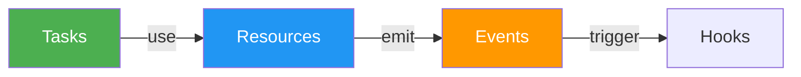

# BlueLibs Runner Documentation Style Guide

This guide ensures consistency across all documentation. Every contributor should follow these standards.

**Last updated:** January 2026 · **Version:** 2.0

**IMPORTANT: No emojis are allowed in any documentation.**

---

## Glossary of Core Terms

Use these terms consistently throughout all documentation:

| Term | Definition | Usage Example |
|------|------------|---------------|
| **Task** | A function with dependency injection, middleware support, and observability. The primary unit for business logic. | `const createUser = r.task("users.create")...` |
| **Resource** | A singleton with lifecycle management (init/dispose). Represents shared services, connections, or state. | `const database = r.resource("app.db")...` |
| **Event** | A typed signal for decoupling components. Enables pub/sub patterns. | `const userCreated = r.event("users.created")...` |
| **Hook** | An event listener. A lightweight function that subscribes to events. | `const onUserCreated = r.hook("onUserCreated").on(userCreated)...` |
| **Middleware** | A wrapper that adds cross-cutting concerns to tasks or resources (caching, retry, timeouts, logging). | `.middleware([cache.with({ ttl: 60000 })])` |
| **Tag** | Metadata attached to components for discovery, filtering, or configuration. | `.tags([globals.tags.debug])` |
| **App** | The root resource that composes all other components. Always named `app`. | `const app = r.resource("app")...` |
| **Runtime** | The object returned by `run()` containing `runTask`, `runEvent`, `dispose`, etc. | `const { runTask, dispose } = await run(app)` |
| **Dispose** | The cleanup function that gracefully shuts down all resources. | `await dispose()` |
| **Config** | The generic type parameter for resources, passed during initialization. | `r.resource<{ port: number }>("server")` |
| **Input** | The data passed to a task when executed. | `await runTask(createUser, { name: "Alice" })` |
| **Output** | The return value of a task. | `const user = await runTask(createUser, input)` |
| **Fluent Builder** | The chainable API pattern using `r.task()`, `r.resource()`, etc. | `r.task("id").dependencies({}).run(...).build()` |

### Terms to Avoid

| Don't Use | Use Instead | Reason |
|-----------|-------------|--------|
| `root` | `app` | Consistency |
| `listener` | `hook` | Modern terminology |
| `handler` | `hook` or `task` | More specific |
| `inject` | `dependencies` | Explicit over magical |
| `module` | `resource` | Runner-specific terminology |
| `provider` | `resource` | Runner-specific terminology |
| `container` | `app` or `resource` | Clearer purpose |

---

## Writing Style

### Tone & Voice

- **Conversational**: Write like you're explaining to a colleague
- **First-person plural**: Use "we" and "let's" (e.g., "Let's build a server")
- **Direct address**: Address the reader as "you"
- **Encouraging**: Use positive language ("Great!", "You've got this!", "That's it!")
- **Practical**: Focus on "how" and "why", not just "what"
- **Confident but humble**: Assert value without arrogance

**Encouraging language placement:**

Use encouraging phrases to celebrate progress:

```markdown
**Good - After examples:**
"That's it! You just built a production-ready API server."

**Good - In learning sections:**
"**What you just learned**: The basic Runner pattern..."

**Good - Celebrating achievements:**
"**What you just built:**"

**Good - After complex concepts:**
"See? Not so scary after all."

**Bad - Overuse:**
Avoid in every paragraph - save for milestone moments.
```

**Confidence without arrogance:**

```markdown
**Good - Confident:**
"BlueLibs Runner is fast. Here are real benchmarks..."

**Good - Humble:**
"Yes, we know there are 47 other frameworks. This one's still different."

**Bad - Too aggressive:**
"Other frameworks are terrible. Use ours instead."

**Bad - Too timid:**
"We think maybe this might possibly work for some people..."
```

**Conversational markers:**

```markdown
**Good - Use rhetorical questions:**
"Ever had too many database connections competing for resources?"

**Good - Use informal transitions:**
"Want to see what 'zero magic' looks like in practice?"

**Good - Use friendly imperatives:**
"Let's start with the simplest possible example."

**Good - Use asides:**
"(And yes, it's less code than most frameworks need for 'Hello World')"
```

### Personality: The "runtime" Character

Include sardonic "runtime" quotes at the end of major sections for personality. The runtime is a self-aware, slightly cynical but ultimately helpful narrator.

```markdown
> **runtime:** "Your quote here about the section topic with mild sarcasm and programmer humor."
```

**Character traits:**
- Sardonic but never mean-spirited
- References common developer pain points
- Self-aware about framework quirks
- Uses technical metaphors with humor
- Occasionally breaks the fourth wall

**Quote placement:**
- End of major concept sections (Tasks, Resources, Events, Middleware)
- End of feature deep-dives (Caching, Retry, Performance)
- End of "Real-World Example" sections
- **NOT** in Quick Reference, API docs, or troubleshooting

**Writing style:**
```markdown
**Good:**
> **runtime:** "Middleware: the onion pattern. A matryoshka doll made of promises."

**Good:**
> **runtime:** "'Zero magic.' Groundbreaking—like a lightbulb that uses no power when it's off."

**Bad - Too harsh:**
> **runtime:** "Your code is terrible and you should feel bad."

**Bad - Too technical (no humor):**
> **runtime:** "The middleware executes in sequence using the next() pattern."

**Bad - Off-topic:**
> **runtime:** "I prefer coffee over tea."
```

**Guidelines:**
- Keep relevant to the section content
- Use mild, inclusive humor (no put-downs)
- Reference common developer experiences
- One quote per major section maximum
- Optional—not every section needs one
- Aim for 1-2 sentences
- Use single quotes for emphasis

### Heading Conventions

```markdown
# Document Title          # Level 1 - Only for the main title
## Major Section          # Level 2 - Top-level sections (Tasks, Resources, Events)
### Sub-Section           # Level 3 - Detailed topics within a section
#### Minor Detail         # Level 4 - Rarely used, for deep specifics only
```

**Heading style:**
- Use sentence case, not title case: "Core concepts" not "Core Concepts"
- Exception: Proper nouns and brand names: "BlueLibs Runner", "TypeScript"
- Use descriptive, action-oriented titles when possible
- Avoid generic headings like "Overview" or "Introduction"

**No decorative symbols in headings:**
- Use clear, descriptive text only
- Avoid decorative symbols or emojis
- Focus on information architecture

```markdown
**Good:**
## Quick Wins: Copy-Paste Solutions
## Tasks
### Task Input Validation

**Good:**
## Quick Reference Cheat Sheet
## Troubleshooting

**Bad:**
## Quick Wins!!! (with decorative symbols)
### Creating Tasks!!!
```

### Section Structure Pattern

Every major section should follow this structure:

1. **Title** (clear and descriptive)
2. **Brief intro** explaining the "why" (1-2 sentences)
3. **Code example** (complete, runnable TypeScript)
4. **Explanation** of the code
5. **Best practices** or guidelines (bullet points)
6. **Optional runtime quote**

### Document-Level Structure

The main README follows this high-level structure:

```markdown
## Introduction & Value Proposition
- Hero section with code example
- Resource links table
- Why Runner? (Problem/Solution comparison)

## Getting Started (Ordered for learning)
- What Is This Thing? (conceptual overview)
- Show Me the Magic (quick wins)
- How Does It Compare? (framework comparison)
- Performance at a Glance (benchmarks)
- What's in the Box? (feature matrix)
- Your First 5 Minutes (absolute minimum)
- Quick Start (full example)
- Learning Guide (common patterns)
- Quick Wins (copy-paste solutions)
- The Big Five (core concepts)

## Core Concepts (Alphabetical)
- Tasks, Resources, Events, Hooks, Middleware, Tags, Errors

## Runtime & Execution
- run() and RunOptions
- Task Interceptors
- Error Boundaries

## Advanced Features (Alphabetical)
- Caching, Retry, Timeouts, Logging, Debug, etc.

## Architecture Patterns
- Optional Dependencies, Serialization, Tunnels, etc.

## Developer Experience
- Quick Reference (bookmark this!)
- Fluent Builders
- Type Helpers
- Testing

## Reference
- Real-World Example
- Performance
- Why Choose Runner?
- Troubleshooting
- Community & Support
```

**Guidelines:**
- Keep "Getting Started" sections in learning order, not alphabetical
- Core concepts can be alphabetical or by importance
- Advanced features should be alphabetical for easy lookup
- Always end with practical sections (testing, troubleshooting, community)

---

## Code Example Standards

### Variable Naming

**Always use these standard names:**

| Purpose | Name | Don't Use |
|---------|------|-----------|
| Root application | `app` | `root`, `main`, `container` |
| Database resource | `db` or `database` | `dbClient`, `dbConnection` |
| Logger | `logger` | `log`, `logging` |
| Config | `config` | `settings`, `options` |
| Server | `server` | `srv`, `httpServer` |
| Runtime result | `{ runTask, dispose }` | `runtime`, `result` |

### Import Statements

**Always show imports** at the top of examples (except in Quick Reference where space is limited):

```typescript
// Good - explicit imports
import { r, run, globals } from "@bluelibs/runner";

const task = r.task("example")...

// Bad - assumes globals
const task = r.task("example")...
```

### Complete, Runnable Examples

Examples should be **copy-paste ready** when possible:

```typescript
// Good - complete and runnable
import { r, run } from "@bluelibs/runner";

const greet = r
  .task("greet")
  .run(async (name: string) => `Hello, ${name}!`)
  .build();

const app = r.resource("app").register([greet]).build();

const { runTask, dispose } = await run(app);
const message = await runTask(greet, "World");
console.log(message); // "Hello, World!"
await dispose();
```

```typescript
// Bad - incomplete, undefined references
const task = r
  .task("example")
  .dependencies({ db, userService }) // Where do these come from?
  .run(async (input, { db }) => {
    // ...
  })
  .build();
```

### When Referencing Undefined Dependencies

If showing a partial example, **explicitly note what's assumed**:

```typescript
// Assuming: db and logger resources are defined elsewhere
const createUser = r
  .task("users.create")
  .dependencies({ db, logger })
  .run(async (input, { db, logger }) => {
    // implementation
  })
  .build();
```

### Explanatory Comments in Code

Use comments to guide the reader, not to explain obvious syntax:

```typescript
// Good - explains concepts:
// 1. Create a simple task (just a function with a name)
const greet = r.task("greet")...

// 2. Put it in a resource (think of it as your app container)
const app = r.resource("app")...

// Good - highlights key points:
return { listener }; // Store for cleanup in dispose()

// Bad - states the obvious:
const greet = r.task("greet"); // Create a task
.build(); // Build the task
```

**Numbered steps in code:**
Use numbered comments for sequential operations:

```typescript
// 1. ONE LINE to add caching with TTL
// 2. ONE LINE to add retry with exponential backoff
// 3. ONE LINE to add authentication
```

**"What you just learned" pattern:**
After code examples, summarize the key takeaway:

```markdown
**What you just learned**: The basic Runner pattern: Define → Register → Run → Execute.
```

### Schema Validation

Use inline validation for simple examples, Zod for real-world examples:

```typescript
// Good - Simple examples - inline validation
.inputSchema<{ name: string }>({ parse: (v) => v })

// Good - Real-world examples - reference Zod
import { z } from "zod";
const UserInput = z.object({ name: z.string(), email: z.string().email() });

.inputSchema<z.infer<typeof UserInput>>(UserInput)
```

### Progressive Complexity

Introduce concepts gradually:

1. **Basic** - Minimal example showing the concept
2. **With Dependencies** - Add DI
3. **With Middleware** - Add cross-cutting concerns
4. **Full Example** - Real-world usage

---

## Cross-Reference Standards

### Internal Links

Use relative markdown anchors for same-document links:

```markdown
See the [Tasks section](#tasks) for more details.
```

### Links to readmes/ Folder

Use relative paths from the composed README location:

```markdown
For advanced patterns, see [Tunnels Documentation](./readmes/TUNNELS.md).
```

### Links to External Resources

Use full URLs with descriptive text:

```markdown
See the [Express documentation](https://expressjs.com/) for middleware patterns.
```

### Back-Links

When writing supplementary docs in `readmes/`, always include a back-link:

```markdown
← [Back to main README](../README.md)
```

---

## Formatting Standards

### Lists

Use bullet points for concepts, numbered lists for sequential steps:

```markdown
**Key features:**
- Type-safe dependency injection
- Automatic cleanup
- Built-in middleware

**Setup steps:**
1. Install the package
2. Define your resources
3. Run your app
```

**Achievement lists:**
Use bold headings for celebration:

```markdown
**What you just built:**
- A full Express API with proper lifecycle management
- Dependency injection (tasks get what they need automatically)
- Built-in logging (via `globals.resources.logger`)
- Graceful shutdown (the `dispose()` method)
```

**Conditional lists:**
Use clear labels to indicate when to use certain approaches:

```markdown
**Make it a task when:**
- It's a core business operation
- You need dependency injection

**Keep it as a regular function when:**
- It's a simple utility
- It's a pure function with no dependencies
```

### Tables

Use tables for comparisons and reference data:

```markdown
| Feature | Runner | Other |
|---------|--------|-------|
| Type-safe DI | Yes | Partial |
| No decorators | Yes | No |
```

### Code Blocks

Always specify the language:

````markdown
```typescript
// TypeScript code
```

```bash
npm install @bluelibs/runner
```

```json
{ "dependencies": { "@bluelibs/runner": "^4.0.0" } }
```
````

**Output formatting:**
Use plain code blocks for terminal output:

````markdown
```
┌─────────────────────────────────────┬───────────────┬──────────────┐
│ Operation                           │ Ops/Second    │ Time/Op      │
├─────────────────────────────────────┼───────────────┼──────────────┤
│ Basic task execution                │ 2.2M          │ ~0.0005 ms   │
└─────────────────────────────────────┴───────────────┴──────────────┘
```
````

**Inline code:**
Use backticks for code terms in prose:

```markdown
**Good:**
The `run()` function returns a `RunResult` object.
Use `globals.resources.logger` for logging.

**Bad:**
The run function returns a RunResult object.
Use globals.resources.logger for logging.
```

---

## Visual Patterns & Layouts

### Comparison Tables

Use comparison tables to highlight framework advantages:

```markdown
| Feature | Runner | NestJS | InversifyJS | TypeDI |
|---------|--------|--------|-------------|--------|
| **Learning Curve** | Gentle | Steep | Steep | Moderate |
| **Magic/Decorators** | None | Heavy | Heavy | Heavy |
| **Bundle Size** | Small | Large | Large | Medium |
```

**Guidelines:**
- Use descriptive text for clarity
- Bold the left column headers
- Keep rows focused (max 8-10 rows)
- Align text for readability
- Use consistent terminology across rows

### Multi-Column Feature Matrix

For comprehensive feature lists, use HTML tables with 3 columns:

```markdown
<table>
<tr>
<td width="33%">

**Core Architecture**
- Dependency Injection
- Lifecycle Management
- Type-safe Everything

</td>
<td width="33%">

**Built-in Features**
- Caching (LRU + Custom)
- Retry with Backoff
- Event System

</td>
<td width="33%">

**Developer Experience**
- Fluent API
- Debug Tools
- Testing Utilities

</td>
</tr>
</table>
```

**Guidelines:**
- Use equal column widths (`33%` for 3 columns, `50%` for 2)
- Use bold headers for each column
- Keep lists concise (5-7 items max)
- Maintain vertical alignment

### Two-Column Comparison Layout

Use for "Problem vs Solution" or "Before vs After":

```markdown
<table>
<tr>
<td width="50%">

### The Problem
Content describing the problem...

\`\`\`typescript
// Bad example
\`\`\`

</td>
<td width="50%">

### The Solution
Content describing the solution...

\`\`\`typescript
// Good example
\`\`\`

</td>
</tr>
</table>
```

### Mermaid Diagrams

Use Mermaid for architecture and flow visualizations:

````markdown

````

**Color palette for diagrams:**
- Tasks: `#4CAF50` (green)
- Resources: `#2196F3` (blue)
- Events: `#FF9800` (orange)
- Hooks: `#FF9800` (orange)
- Middleware: `#9C27B0` (purple)
- Tags: `#607D8B` (gray)

**Guidelines:**
- Use flowcharts for relationships
- Use sequence diagrams for lifecycle
- Keep diagrams simple (max 10 nodes)
- Always add color styling

### Performance Benchmarks

Format benchmark results in monospace tables:

```markdown
\`\`\`
┌─────────────────────────────────────┬───────────────┬──────────────┐
│ Operation                           │ Ops/Second    │ Time/Op      │
├─────────────────────────────────────┼───────────────┼──────────────┤
│ Basic task execution                │ 2.2M          │ ~0.0005 ms   │
│ Task with 5 middlewares             │ 244K          │ ~0.004 ms    │
└─────────────────────────────────────┴───────────────┴──────────────┘
\`\`\`
```

**Guidelines:**
- Use ASCII box drawing characters
- Align numbers to the right
- Include units in headers
- Round to 2-4 significant figures

### TL;DR Summaries

Add "TL;DR" sections after complex comparisons:

```markdown
**TL;DR:** Runner gives you the features of NestJS with the simplicity of plain functions.
```

**Guidelines:**
- Use bold for "TL;DR"
- One sentence maximum
- Place after comparison tables
- Focus on the key takeaway

### Callout Boxes

Use blockquotes for important notes and platform warnings:

```markdown
> **runtime:** "Your quote here about the section topic with mild sarcasm."

> **Platform Note:** `AsyncLocalStorage` is a **Node.js-only** feature.
```

**Types of callouts:**
- `> **runtime:**` - Personality quotes (see Runtime Character section)
- `> **Platform Note:**` - Platform-specific warnings
- `> **Note:**` - Important clarifications
- `> **Tip:**` - Helpful suggestions

---

## File Organization

### README Composition System

The main `README.md` is not edited directly. It is composed from modular chapters located in `guide-units/`.

- **Manifest**: `guide-units/CORE.md` defines the order and files to include.
- **Syntax**: Use `!include: filename.md` on a new line to include a chapter.
- **Generation**: Run `npm run guide:compose` to rebuild the `README.md`.
- **Guidelines**:
    - Each chapter should be self-contained.
    - Use relative markdown anchors for cross-chapter links.
    - Avoid editing `README.md` manually; changes will be overwritten.

### Chapter Files (guide-units/)

- **Naming**: `XX-CHAPTER_NAME.md` (e.g., `05-CORE_CONCEPTS.md`)
- **Order**: Numbered for composition order
- **Size**: Keep under 400 lines when possible; split if larger
- **Self-contained**: Each chapter should make sense on its own

### Supplementary Docs (readmes/)

- **Naming**: `TOPIC_NAME.md` (e.g., `TUNNELS.md`, `MIGRATION.md`)
- **Purpose**: Deep dives that don't fit in main README
- **Back-links**: Always link back to main README

### AI.md

- **Token limit**: Keep under 5000 tokens
- **No personality**: Omit runtime quotes, keep concise
- **Essential only**: Core concepts, minimal examples
- **Sync with README**: Update when README changes significantly

---

## Pre-Commit Checklist

Before committing documentation changes:

- [ ] Variable names follow standards (`app`, not `root`)
- [ ] Imports are shown (or explicitly noted as assumed)
- [ ] Code examples are complete and runnable
- [ ] Cross-references use correct relative paths
- [ ] Glossary terms are used consistently
- [ ] Headings follow level conventions (Level 2 for major sections)
- [ ] **Community & Policies** used instead of "Community and policies"
- [ ] **No emojis used in documentation**
- [ ] Run `npm run guide:compose` to regenerate README.md
- [ ] Verify composed README looks correct

---

## Contribution Workflow

```bash
# 1. Edit the relevant chapter
nano guide-units/05-CORE_CONCEPTS.md

# 2. Regenerate README
npm run guide:compose

# 3. Verify output
git diff README.md

# 4. If AI.md needs updates, edit it directly
nano AI.md

# 5. Commit
git add guide-units/ README.md AI.md
git commit -m "docs: your change description"
```

---

## Quick Wins Section Pattern

The "Quick Wins" section is a special format designed for copy-paste solutions. It should follow this structure:

```markdown
## Quick Wins: Copy-Paste Solutions

**5 real-world problems, solved in minutes.** Just copy, customize, and ship.

### 1. Problem Name (with result description)

\`\`\`typescript
import { r, globals } from "@bluelibs/runner";

const solution = r
  .task("solution")
  .middleware([/* key feature */])
  .run(async (input) => {
    // Implementation with inline comments explaining key points
  })
  .build();

// First call: hits database
// Next 60 seconds: instant from cache
// After 60s: refreshes automatically
\`\`\`

### 2. Next Problem...
```

**Guidelines:**
- Use numbered headings (1. 2. 3.)
- Include import statements
- Add inline comments explaining behavior
- Show results/effects below code blocks
- Keep examples focused (one concept per win)
- Include realistic use cases

---

## Writing Comparisons

### Framework Comparison Tables

Use clear, descriptive text:

```markdown
| Feature | Runner | NestJS | Other |
|---------|--------|--------|-------|
| **Learning Curve** | Gentle | Steep | Moderate |
```

**Standard terminology:**
- Learning curve: Gentle, Moderate, Steep
- Size: Small, Medium, Large
- Support: Yes/Full, Partial, No/None
- Speed: Fast, Moderate, Slow

### "What this means for you" Pattern

After benchmark data, translate to business value:

```markdown
**What this means for you:**
- **Instant feedback** - Tests run in milliseconds, not seconds
- **Lower cloud costs** - Handle more requests with fewer resources
- **Production ready** - Battle-tested at scale
```

**Guidelines:**
- Use standard bullet points
- Bold the key phrase
- Follow with practical explanation
- Keep to 3-5 items

---

## Learning Section Guidelines

### "Your First 5 Minutes" Pattern

Distill concepts to absolute minimum:

```markdown
## Your First 5 Minutes

**New to Runner?** Here's the absolute minimum you need to know:

1. **Tasks** are your business logic functions
2. **Resources** are shared services (database, config, etc.)
3. **You compose them** using `r.resource()` and `r.task()`
4. **You run them** with `run(app)` which gives you `runTask()` and `dispose()`

That's it! Now let's see it in action:
```

**Guidelines:**
- Start with "New to X?" question
- Use numbered list (max 4-5 items)
- End with forward-looking statement
- Link to next section

### Common Patterns Section

Structure as problem-solution pairs:

```markdown
### Pattern 1: Not Everything Needs to Be a Task

When you're starting out, it's tempting to make everything a task. Here's the golden rule: **use regular functions for utilities, use tasks for business operations**.

\`\`\`typescript
// Regular functions are perfect for utilities
const add = (a: number, b: number) => a + b;

// Tasks are great for business operations
const processOrder = r.task("app.processOrder")...
\`\`\`

**Want detailed guidance?** See the [Tasks section](#tasks) below.
```

**Pattern:**
- Use numbered headings (Pattern 1, Pattern 2, etc.)
- Start with common mistake or question
- Bold the golden rule or key insight
- Show code example
- Link to detailed section

---

## Platform-Specific Warnings

Use blockquote warnings for platform limitations:

```markdown
> **Platform Note:** `AsyncLocalStorage` is a **Node.js-only** feature. In browsers and edge runtimes, async context is not available.
```

**Guidelines:**
- Bold "Platform Note:" or similar
- Explain limitation clearly
- Suggest alternative if available
- Place before or within relevant code examples

---

## Dividers and Separators

Use horizontal rules (`---`) to separate major sections:

```markdown
## Section 1

Content...

---

## Section 2

Content...
```

**When to use dividers:**
- Between major document sections (Getting Started → Core Concepts)
- After introduction blocks before main content
- Before community/license sections at end
- **NOT** between every section (use sparingly)

**When NOT to use dividers:**
- Between subsections (use heading hierarchy instead)
- In Quick Reference sections (maintain compact layout)
- In troubleshooting sections (maintain flow)

---

*Last updated: January 2026 · Version 2.0*
