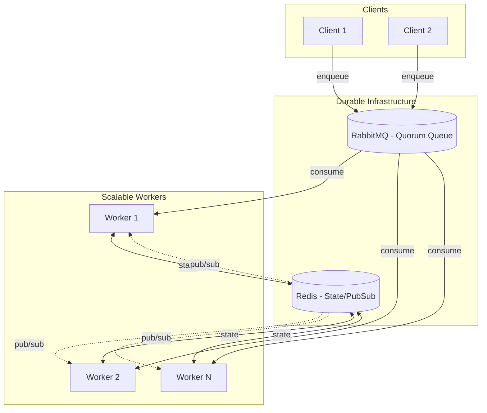
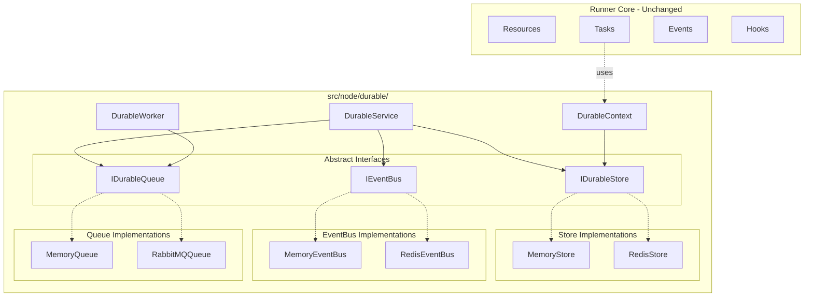
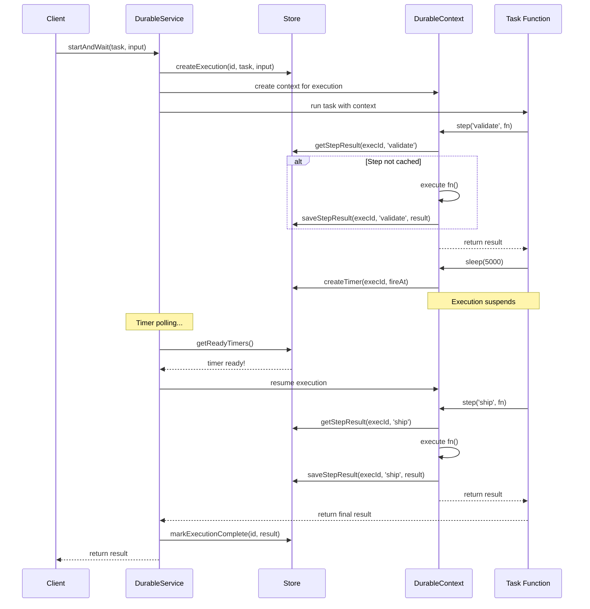
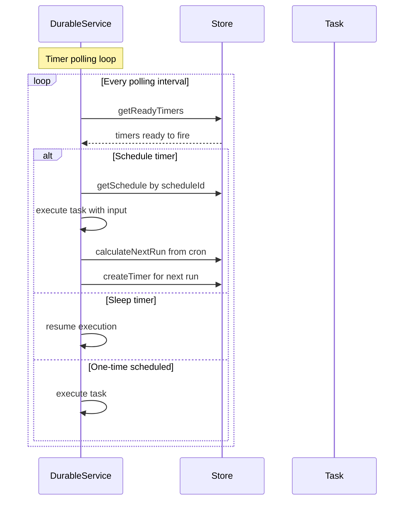
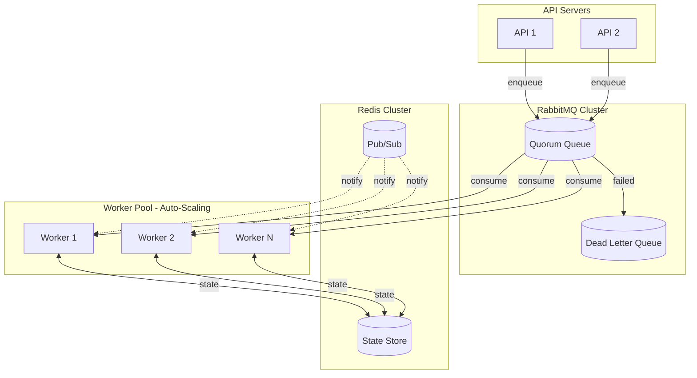
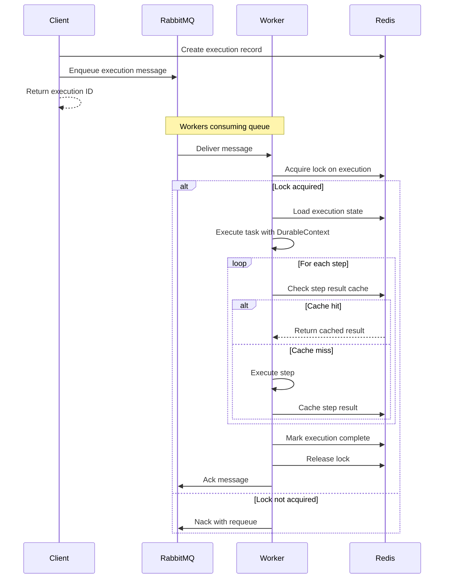

# Durable Workflows (Node-only) — Architecture v2

← [Back to main README](../README.md)

---

> Durable workflows are Runner tasks with "save points". If your process dies, deploys, or scales horizontally, the workflow comes back and continues like nothing happened (except now you can finally sleep at night).

## Table of Contents

- [Start Here](#start-here)
- [Quickstart](#quickstart)
- [Tagging Workflows for Discovery](#tagging-workflows-for-discovery-required)
- [Why You'd Want This (In One Minute)](#why-youd-want-this-in-one-minute)
- [Core Insight](#core-insight)
- [Abstract Interfaces](#abstract-interfaces)
- [API Design](#api-design)
- [Safety & Semantics](#safety--semantics)
- [Signals (wait for external events)](#signals-wait-for-external-events)
- [Testing Utilities](#testing-utilities)
- [Compensation / Rollback Pattern](#compensation--rollback-pattern)
- [Branching with ctx.switch()](#branching-with-ctxswitch)
- [Describing a Flow (Static Shape Export)](#describing-a-flow-static-shape-export)
- [Scheduling & Cron Jobs](#scheduling--cron-jobs)
- [Gotchas & Troubleshooting](#gotchas--troubleshooting)

## Start Here

- If you want the short version: `readmes/DURABLE_WORKFLOWS_AI.md`
- If you're new to Runner concepts (tasks/resources/events/middleware): `readmes/AI.md`
- Platform note (why this is Node-only): `readmes/MULTI_PLATFORM.md`

## Quickstart

### 0) Create a durable resource (Runner-style)

The recommended integration is a **single durable resource** that:

- Executes Runner tasks via DI (`taskRunner.run(...)`).
- Provides a **per-resource** durable context, accessed via `durable.use()`.
- Optionally embeds a worker (`worker: true`) to consume the queue in that process.

### 1) Define a durable task (steps + sleep + signal)

```ts
import { event, r, run } from "@bluelibs/runner";
import { memoryDurableResource } from "@bluelibs/runner/node";

const Approved = event<{ approvedBy: string }>({ id: "app.signals.approved" });

const durable = memoryDurableResource.fork("app.durable");

const durableRegistration = durable.with({
  worker: true, // single-process dev/tests
});

const approveOrder = r
  .task("app.tasks.approveOrder")
  .dependencies({ durable })
  .run(async (input: { orderId: string }, { durable }) => {
    const ctx = durable.use();

    await ctx.step("validate", async () => {
      // fetch order, validate invariants, etc.
      return { ok: true };
    });

    const outcome = await ctx.waitForSignal(Approved, {
      timeoutMs: 86_400_000,
    });
    if (outcome.kind === "timeout") {
      return { status: "timed_out" };
    }

    await ctx.step("ship", async () => {
      // ship only after approval
      return { shipped: true };
    });

    return {
      status: "approved",
      approvedBy: outcome.payload.approvedBy,
    };
  })
  .build();

const app = r
  .resource("app")
  .register([durableRegistration, approveOrder])
  .build();

await run(app, { logs: { printThreshold: null } });
```

## Tagging Workflows for Discovery (Required)

Durable workflows are regular Runner tasks, but **must be tagged with `durableWorkflowTag`**
to make them discoverable at runtime. Always add this tag to your workflow tasks:

```ts
import { r } from "@bluelibs/runner";
import {
  memoryDurableResource,
  durableWorkflowTag,
} from "@bluelibs/runner/node";

const durable = memoryDurableResource.fork("app.durable");

const onboarding = r
  .task("app.workflows.onboarding")
  .dependencies({ durable })
  .tags([durableWorkflowTag.with({ category: "users" })])
  .run(async (_input, { durable }) => {
    const ctx = durable.use();
    await ctx.step("create-user", async () => ({ ok: true }));
    return {
      durable: { executionId: ctx.executionId },
      data: { ok: true },
    };
  })
  .build();

// later, after run(...)
// const durableRuntime = runtime.getResourceValue(durable);
// const workflows = durableRuntime.getWorkflows();
```

The `durableWorkflowTag` is **required** — workflows without this tag will not be discoverable
via `getWorkflows()`. The durable resources (`durableResource`, `memoryDurableResource`,
and `redisDurableResource`) auto-register this tag definition, so you can use it immediately
without manual tag registration.

`durableWorkflowTag` also enforces a unified workflow response shape:
`{ durable: { executionId }, data }`.

### Starting Durable Workflows From Resource Dependencies (HTTP route)

Tagged workflow tasks are discoverable metadata only. Execution is explicit:
start with `durable.start(...)` (fire-and-track) or
`durable.startAndWait(...)` (start-and-wait).

```ts
import express from "express";
import { r, run } from "@bluelibs/runner";
import {
  memoryDurableResource,
  durableWorkflowTag,
} from "@bluelibs/runner/node";

const durable = memoryDurableResource.fork("app.durable");

const approveOrder = r
  .task("app.workflows.approveOrder")
  .dependencies({ durable })
  .tags([durableWorkflowTag.with({ category: "orders" })])
  .run(async (input: { orderId: string }, { durable }) => {
    const ctx = durable.use();
    await ctx.step("approve", async () => ({ approved: true }));
    return {
      durable: { executionId: ctx.executionId },
      data: { orderId: input.orderId, status: "approved" as const },
    };
  })
  .build();

const api = r
  .resource("app.api")
  .register([durable.with({ worker: false }), approveOrder])
  .dependencies({ durable, approveOrder })
  .init(async (_cfg, { durable, approveOrder }) => {
    const app = express();
    app.use(express.json());

    app.post("/orders/:id/approve", async (req, res) => {
      const executionId = await durable.start(approveOrder, {
        orderId: req.params.id,
      });

      res.status(202).json({ executionId });
    });

    app.listen(3000);
  })
  .build();

await run(api);
```

### Production wiring (Redis + RabbitMQ)

For production, swap the in-memory backends:

```ts
import { redisDurableResource } from "@bluelibs/runner/node";

const durable = redisDurableResource.fork("app.durable");

const durableRegistration = durable.with({
  redis: { url: process.env.REDIS_URL! },
  queue: { url: process.env.RABBITMQ_URL! },
  worker: true,
});
```

Isolation note: `redisDurableResource` derives Redis key prefixes, pub/sub prefixes, and default queue names from the durable resource id (the value you pass to `.fork("...")`). Use different ids (or set `{ namespace }`) to run multiple durable "apps" safely on the same Redis/RabbitMQ.

API nodes typically **disable polling and the embedded worker**:

```ts
const durable = redisDurableResource.fork("app.durable");
const durableRegistration = durable.with({
  redis: { url: process.env.REDIS_URL! },
  queue: { url: process.env.RABBITMQ_URL! },
  worker: false,
  polling: { enabled: false },
});
```

In a typical deployment:

- API nodes call `start()` / `signal()` / `wait()`.
- Worker nodes run the durable resource with `worker: true`.

### Scaling in production (recommended topology)

Durable workflows are designed to scale **horizontally**.
The core idea is: **the store is the source of truth**, and the queue distributes work.

**Recommended split:**

- **API nodes** (stateless): accept HTTP/webhooks, call `start()` / `signal()` / `wait()`.
- **Worker nodes** (scalable): consume the durable queue and run executions.

**API node config (no background work):**

```ts
const durable = redisDurableResource.fork("app.durable");
const durableRegistration = durable.with({
  redis: { url: process.env.REDIS_URL! },
  queue: { url: process.env.RABBITMQ_URL! },
  worker: false,
  polling: { enabled: false },
});
```

**Worker node config (does background work):**

```ts
const durable = redisDurableResource.fork("app.durable");
const durableRegistration = durable.with({
  redis: { url: process.env.REDIS_URL! },
  queue: { url: process.env.RABBITMQ_URL! },
  worker: true,
  polling: { enabled: true, interval: 1000 },
});
```

**How it scales:**

- Increase worker replicas: each one consumes from the queue, so throughput scales with workers.
- Crash/redeploy safety: a worker can die at any time; the next worker resumes from the last checkpoint.
- Multi-worker correctness: executions/steps are coordinated through the store, not through in-memory state.

**Timers, sleeps, and schedules (important):**

Timers (used by `ctx.sleep(...)`, signal timeouts, and scheduling) are driven by the durable polling loop.
In multi-process setups you typically either:

- run a **single poller** (one worker replica with `polling.enabled: true`), or
- use a store implementation that provides **atomic timer claiming** so multiple pollers are safe.

If you enable polling in multiple processes without atomic claiming, you may get duplicate resume attempts.
This is still designed to be safe (at-least-once), but it can increase load/noise.

### 2) Start an execution (store the executionId)

```ts
const executionId = await d.start(approveOrder, {
  orderId: "order-123",
});
// store executionId on the order record so your webhook can resume the workflow later
```

### Reading status later (no double-sync required)

If you store the `executionId` in your main database (eg. `orders.durable_execution_id`), you can fetch live workflow status on-demand from the durable store.
This avoids mirroring every durable transition into Postgres.

```ts
import { DurableOperator, RedisStore } from "@bluelibs/runner/node";

const durableStorePrefix = process.env.DURABLE_STORE_PREFIX!; // same value used by your durable runtime config

// Read-only store client for status lookups (same redis url + prefix)
const store = new RedisStore({
  redis: process.env.REDIS_URL!,
  prefix: durableStorePrefix,
});

// Minimal: just the execution row (status/result/error)
const execution = await store.getExecution(executionId);

// Rich: execution + steps + audit (dashboard-like view)
const operator = new DurableOperator(store);
const detail = await operator.getExecutionDetail(executionId);
```

Keep the durable store prefix in one shared config module and reuse it for both workflow runtime wiring and read-only status lookups.

If you already have the durable resource instance (dependency injection), you can use the operator API directly:

```ts
const detail = await durable.operator.getExecutionDetail(executionId);
```

### 3) Resume from the outside (webhook / callback)

```ts
await d.signal(executionId, Approved, { approvedBy: "admin@company.com" });
const result = await d.wait(executionId, { timeout: 30_000 });
```

## Why You'd Want This (In One Minute)

- Your workflow needs to span time: minutes, hours, days (payments, shipping, approvals).
- You want deterministic retries without duplicating side-effects (charge twice, email twice, etc.).
- You want horizontal scaling without "who owns this in-memory timeout?" problems.
- You want explicit, type-safe "outside world pokes the workflow" via signals.

## Core Insight

The key insight (Temporal/Inngest-style) is that workflows are just functions with checkpoints. We provide a `DurableContext` that gives tasks:

1. **`step(id, fn)`** - Execute a function once, cache the result, return cached on replay
2. **`sleep(ms)`** - Durable sleep that survives process restarts
3. **`emit(event, data)`** - Publish a best-effort notification, de-duplicated via `step()` (not guaranteed delivery)
4. **`waitForSignal(signal)`** - Suspend until an external signal is delivered (eg. payment confirmation)

**Scalability Model:** Multiple worker instances can process executions concurrently. Work is distributed via a durable queue (RabbitMQ quorum queues by default), with state stored in Redis.



---

## Abstract Interfaces

Three pluggable interfaces allow swapping backends without changing application code:

### 1. IDurableStore - State Storage

The **Store** is the absolute source of truth. It persists execution state, step results, timers, and schedules. If it's not in the store, it didn't happen.

```typescript
// interfaces/IDurableStore.ts

export interface IDurableStore {
  // Executions (The primary workflow records)
  saveExecution(execution: Execution): Promise<void>;
  getExecution(id: string): Promise<Execution | null>;
  updateExecution(id: string, updates: Partial<Execution>): Promise<void>;
  listIncompleteExecutions(): Promise<Execution[]>;

  // Steps (Memoized results for exactly-once-ish semantics)
  getStepResult(
    executionId: string,
    stepId: string,
  ): Promise<StepResult | null>;
  saveStepResult(result: StepResult): Promise<void>;

  // Timers (Drives sleep(), signal timeouts, and cron)
  createTimer(timer: Timer): Promise<void>;
  getReadyTimers(now?: Date): Promise<Timer[]>;
  markTimerFired(timerId: string): Promise<void>;
  deleteTimer(timerId: string): Promise<void>;

  // Schedules (Cron and Interval orchestration)
  createSchedule(schedule: Schedule): Promise<void>;
  getSchedule(id: string): Promise<Schedule | null>;
  updateSchedule(id: string, updates: Partial<Schedule>): Promise<void>;
  deleteSchedule(id: string): Promise<void>;
  listSchedules(): Promise<Schedule[]>;
  listActiveSchedules(): Promise<Schedule[]>;

  // Optional: Distributed Timer Coordination
  claimTimer?(
    timerId: string,
    workerId: string,
    ttlMs: number,
  ): Promise<boolean>;

  // Optional: Idempotency (dedupe start calls)
  getExecutionIdByIdempotencyKey?(params: {
    taskId: string;
    idempotencyKey: string;
  }): Promise<string | null>;
  setExecutionIdByIdempotencyKey?(params: {
    taskId: string;
    idempotencyKey: string;
    executionId: string;
  }): Promise<boolean>;

  // Optional: Dashboard & Operator API
  listExecutions?(options?: ListExecutionsOptions): Promise<Execution[]>;
  listStepResults?(executionId: string): Promise<StepResult[]>;
  retryRollback?(executionId: string): Promise<void>;
  skipStep?(executionId: string, stepId: string): Promise<void>;
  forceFail?(
    executionId: string,
    error: { message: string; stack?: string },
  ): Promise<void>;
  editStepResult?(
    executionId: string,
    stepId: string,
    newResult: unknown,
  ): Promise<void>;

  // Lifecycle
  init?(): Promise<void>;
  dispose?(): Promise<void>;

  // Optional: Locking (if store handles its own concurrency)
  acquireLock?(resource: string, ttlMs: number): Promise<string | null>;
  releaseLock?(resource: string, lockId: string): Promise<void>;
}
```

**Implementations:**

- `MemoryStore` - Dev/test, no persistence
- `RedisStore` - Production default, distributed locking

### 2. IEventBus - Pub/Sub

For event notifications across workers (timer ready, execution complete, etc).

```typescript
// interfaces/IEventBus.ts

export type EventHandler = (event: BusEvent) => Promise<void>;

export interface IEventBus {
  // Publish event to all subscribers
  publish(channel: string, event: BusEvent): Promise<void>;

  // Subscribe to events on a channel
  subscribe(channel: string, handler: EventHandler): Promise<void>;

  // Unsubscribe from a channel
  unsubscribe(channel: string): Promise<void>;

  // Lifecycle
  init?(): Promise<void>;
  dispose?(): Promise<void>;
}

export interface BusEvent {
  type: string;
  payload: unknown;
  timestamp: Date;
}
```

**Implementations:**

- `MemoryEventBus` - Dev/test, single-process only
- `RedisEventBus` - Production default, uses Redis Pub/Sub

**Serialization note:** `RedisEventBus` serializes events using Runner's serializer (tree mode) so `BusEvent.timestamp: Date` (and other supported built-in types) round-trip correctly across Redis Pub/Sub.

### 3. IDurableQueue - Work Distribution

For distributing execution work across multiple workers with durability guarantees.

```typescript
// interfaces/IDurableQueue.ts

export interface QueueMessage<T = unknown> {
  id: string;
  type: "execute" | "resume" | "schedule";
  payload: T;
  attempts: number;
  maxAttempts: number;
  createdAt: Date;
}

export type MessageHandler<T = unknown> = (
  message: QueueMessage<T>,
) => Promise<void>;

export interface IDurableQueue {
  // Send message to queue
  enqueue<T>(
    message: Omit<QueueMessage<T>, "id" | "createdAt">,
  ): Promise<string>;

  // Start consuming messages (calls handler for each)
  consume<T>(handler: MessageHandler<T>): Promise<void>;

  // Acknowledge successful processing
  ack(messageId: string): Promise<void>;

  // Negative acknowledge (requeue or dead-letter)
  nack(messageId: string, requeue?: boolean): Promise<void>;

  // Lifecycle
  init?(): Promise<void>;
  dispose?(): Promise<void>;
}
```

**Message types note:** Runner currently enqueues `execute` and `resume`. `schedule` is accepted by `DurableWorker` as an alias of `resume` (an execution hint) so custom adapters can use it, but built-in cron/interval scheduling is driven by timers + `resume`.

**Implementations:**

- `MemoryQueue` - Dev/test, no persistence
- `RabbitMQQueue` - Production default, quorum queues for durability

---

## Adapting to Your Flow: Custom Backends

One of Runner's core philosophies is **zero lock-in**. If your team uses Postgres for state or Kafka for queues, you shouldn't have to change your workflow logic to use them.

### Implementing a Custom Store

To implement a custom store (e.g., for SQL), you only need to satisfy the `IDurableStore` interface. The engine is designed to be "dumb" and trust the store for all persistence.

**Minimum Viable Store (Pseudo-SQL):**

```typescript
class MySqlStore implements IDurableStore {
  async saveExecution(e: Execution) {
    await db.query("INSERT INTO durable_executions ...", [e.id, serialize(e)]);
  }

  async getExecution(id: string) {
    const row = await db.query(
      "SELECT data FROM durable_executions WHERE id = ?",
      [id],
    );
    return row ? deserialize(row.data) : null;
  }

  // ... implement other methods by mapping to your DB tables
}
```

> [!TIP]
> Look at [MemoryStore.ts](../src/node/durable/store/MemoryStore.ts) for a clean reference of how to manage in-memory state, or [RedisStore.ts](../src/node/durable/store/RedisStore.ts) for a production-grade implementation using Lua scripts for atomicity.

### Implementing a Custom Queue

If you want to use a different message broker (SQS, Kafka, Redis Streams), implement `IDurableQueue`.

**Key Responsibilities:**

- **`enqueue`**: Push a message (task execution hint) to the broker.
- **`consume`**: Register a listener that calls the provided handler when a message arrives.
- **`ack` / `nack`**: Handle message confirmation/failure.

```typescript
class SqsQueue implements IDurableQueue {
  async enqueue(msg) {
    const res = await sqs.sendMessage({
      QueueUrl,
      MessageBody: JSON.stringify(msg),
    });
    return res.MessageId;
  }

  async consume(handler) {
    // Polling loop or subscription
    const msgs = await sqs.receiveMessage({ QueueUrl });
    for (const m of msgs) {
      await handler(JSON.parse(m.Body));
      await this.ack(m.ReceiptHandle);
    }
  }
}
```

> [!IMPORTANT]
> A queue in Durable Workflows is just a **hint**. If a message is lost, the `polling` loop in `DurableService` acts as a safety net to find and resume stuck executions. However, a reliable queue (like RabbitMQ or SQS) is critical for low-latency distribution and high throughput.

---

## Component Architecture



---

## API Design

### Basic Usage

Durable workflows are **normal Runner tasks** that inject a **durable resource** (created via `durableResource.fork(id)` and registered via `.with(config)`) and call `ctx.step(...)` / `ctx.sleep(...)` from inside their `run` function.

```typescript
import { r, run } from "@bluelibs/runner";
import { durableResource, MemoryStore } from "@bluelibs/runner/node";

// 1. Create store
const store = new MemoryStore();

// 2. Create durable resource definition
const durable = durableResource.fork("app.durable");

// 3. Register durable resource with config
const durableRegistration = durable.with({
  store,
  polling: { enabled: true, interval: 1000 }, // Timer polling interval
});

// 3. Define a task that uses durable context
const processOrder = r
  .task("app.tasks.processOrder")
  .inputSchema<{ orderId: string; customerId: string }>()
  .dependencies({ durable })
  .run(async (input, { durable }) => {
    const ctx = durable.use();

    // Step 1: Validate order (checkpointed)
    const order = await ctx.step("validate", async () => {
      const o = await db.orders.find(input.orderId);
      if (!o) throw new Error("Order not found");
      return o;
    });

    // Step 2: Process payment (checkpointed)
    const payment = await ctx.step("charge-payment", async () => {
      return await payments.charge(order.customerId, order.total);
    });

    // Durable sleep - survives restart
    await ctx.sleep(5000);

    // Step 3: Ship order (checkpointed)
    const shipment = await ctx.step("create-shipment", async () => {
      return await shipping.create(order.id);
    });

    return {
      success: true,
      orderId: order.id,
      trackingId: shipment.trackingId,
    };
  })
  .build();

// 4. Wire up and run
const app = r
  .resource("app")
  .register([durableRegistration, processOrder])
  .build();

const runtime = await run(app);

// 5. Execute durably
const d = runtime.getResourceValue(durable);
const result = await d.startAndWait(processOrder, {
  orderId: "order-123",
  customerId: "cust-456",
});
```

### How It Works

1. **`durable.startAndWait(task, input)`** creates an execution record and runs the task
   - Prefer `startAndWait()` when you want "start and wait for result" in one call.
   - Prefer `start()` + `signal()` + `wait()` when the outside world must resume the workflow later (webhooks, approvals).
2. **`ctx.step(id, fn)`** checks if step was already executed:
   - If yes: returns cached result (replay)
   - If no: executes fn, caches result, returns result
3. **`ctx.sleep(ms)`** creates a timer record, suspends execution, resumes when timer fires
4. **`ctx.waitForSignal(signal)`** records a durable wait checkpoint and suspends execution
5. **`durable.signal(executionId, signal, payload)`** completes the signal checkpoint and resumes the execution
6. If process crashes, **`durableService.recover()`** resumes incomplete executions from their last checkpoint

### `start()` vs `startAndWait()` (clear contract)

- `start(taskOrTaskId, input)`:
  returns immediately with `executionId` (`string`).
- `startAndWait(taskOrTaskId, input)`:
  convenience wrapper for `start(...)` + `wait(executionId)`; returns final workflow result.

`taskOrTaskId` can be:

- an `ITask` (the built task object, returned by `.build()`)
- a task id `string`

It is **not** the injected dependency callable from `.dependencies({ someTask })`. That dependency is a function used to invoke the task directly, not an `ITask` reference.

```ts
// ✅ built task object
const executionIdA = await d.start(approveOrder, { orderId: "o1" });

// ✅ task id string
const executionIdB = await d.start(approveOrder.id, {
  orderId: "o2",
});

// ❌ injected callable dependency (different type)
// await d.start(deps.approveOrder, { orderId: "o3" });
```

### What Happens with the Return Value

Whatever your workflow function returns becomes the **execution result**, persisted in the durable store. You can retrieve it in three ways depending on your pattern:

- **`startAndWait(task, input)`** — starts the workflow **and** waits for it to finish, returning the result directly:

  ```ts
  const result = await d.startAndWait(processOrder, { orderId: "order-123" });
  // result = { success: true, orderId: "order-123", trackingId: "TRK-789" }
  ```

- **`start(task, input)`** + **`wait(executionId)`** — start and wait separately (useful when a webhook or external event resumes the workflow later):

  ```ts
  const executionId = await d.start(approveOrder, {
    orderId: "order-123",
  });
  // ... later (eg. in a webhook handler) ...
  await d.signal(executionId, Approved, { approvedBy: "admin@co.com" });
  const result = await d.wait(executionId, { timeout: 30_000 });
  // result = { status: "approved", approvedBy: "admin@co.com" }
  ```

- **Read from the store** — fetch the persisted result without blocking:
  ```ts
  const execution = await store.getExecution(executionId);
  // execution.status = "completed" | "failed" | "running" | ...
  // execution.result = the return value of your workflow
  ```

If the workflow throws an error instead of returning, the execution is marked as `failed` and `startAndWait()`/`wait()` will reject with that error.

---

## Execution Flow



---

## Safety & Semantics

This section summarizes the safety guarantees and expectations of the durable workflow system.

- **Store is the source of truth**  
  All durable state (executions, steps, timers, schedules) lives in `IDurableStore`. Queues and pub/sub are optimizations on top; correctness must not rely solely on in-memory state or transient messages.

- **At-least-once execution, effectively-once steps**
  - Executions are retried on failure, so the same logical workflow may run more than once.
  - `ctx.step(stepId, fn)` ensures each step function is _observably_ executed at most once per execution: results are memoized in the store and returned on replay.
  - External side effects inside a step must still be designed to be idempotent or safely repeatable (for example, idempotent payment/refund APIs).

- **Sleep and resumption**
  - `ctx.sleep(ms)` persists a timer and marks the execution as `sleeping`.
  - When the timer fires, execution is resumed from the code _after_ `sleep`, and all previous steps are replayed via cached results (no re‑issuing of side effects wrapped in `step`).

- **Event emission without duplicates**
  - `ctx.emit(event, data)` is implemented as one or more internal `step`s under the hood.
  - Each call is assigned a deterministic internal id like `__emit:<eventId>:<index>` so you can emit the same event type multiple times in one workflow.
  - On replay, memoization prevents duplicates for each individual emission.
  - **Determinism note:** those internal `:<index>` suffixes are derived from call order within the workflow. If you change the workflow structure (branching / adding/removing calls), the internal step ids may shift and past executions may no longer replay cleanly.

- **Signals (wait until external confirmation)**
  - `ctx.waitForSignal(signal)` suspends an execution until `durable.signal(executionId, signal, payload)` is called.
  - `stepId` keeps the same return type (payload + timeout error), while `timeoutMs` switches to a `{ kind: "signal" | "timeout" }` outcome.
  - Signals are memoized as steps under `__signal:<signal.id>[:index]` (or `__signal:<id>[:index]` for string ids).
  - Repeated waits use `__signal:<id>:<index>` and are resolved by the first available slot; payloads can be buffered for future waits.
  - **Determinism note:** like `emit`, the `:<index>` suffixes are derived from call order within the workflow; code changes can shift indexes on replay.

- **Retries and timeouts**
  - `StepOptions.retries` and `DurableServiceConfig.execution.maxAttempts` control step‑level and execution‑level retries respectively.
  - `StepOptions.timeout` and `execution.timeout` bound how long a single step or the whole execution may run.
  - **Global Timeouts**: `execution.timeout` measures the total time from the very first attempt (`createdAt`) and is not reset on retries or resumptions.

- **Queue and worker semantics**
  - `IDurableQueue` provides **at-least-once** delivery: messages may be delivered more than once but will not be silently dropped.
  - Workers must treat queue messages as hints to load state from the store, apply `DurableContext` logic, and then `ack` or `nack` the message. Idempotency is achieved by reading/writing through `IDurableStore`, not by trusting the queue alone.

- **Multi-node coordination**
  - `IEventBus` is used to reduce `wait()` latency (publish `execution:<id>` completion events) but does not replace the store.
  - Timers (`sleep`, signal timeouts, schedules) are driven by the durable poller (`DurableService` polling loop). In multi-process setups, run a single poller (`polling: { enabled: true }`) or implement atomic timer claiming in your store.

- **Reserved step ids**
  - Step ids starting with `__` and `rollback:` are reserved for durable internals. Avoid using them in `ctx.step(...)` to prevent collisions with system steps.

These semantics intentionally favor **safety and debuggability** over perfect "exactly-once" guarantees at the infrastructure level. Application code remains explicit and testable, while the system provides strong, well-defined durability guarantees around that code.

---

## Signals (wait for external events)

Durable workflows often need to pause until the outside world confirms something (eg. payment provider callbacks). Use `ctx.waitForSignal()` inside the workflow, and `durable.signal()` from the outside.

Signal summary:

- `stepId` is a stable key only; it does not change return types.
- `waitForSignal({ stepId })` requires a store that supports listing step results (`listStepResults`) so `durable.signal(...)` can find the waiter.
- `timeoutMs` changes the return value to a `{ kind: "signal" | "timeout" }` outcome.
- Without `timeoutMs`, timeouts throw an error (no union result).

Return shapes:

| Call                                           | Returns                                                |
| ---------------------------------------------- | ------------------------------------------------------ |
| `waitForSignal(signal)`                        | `payload` (throws on timeout)                          |
| `waitForSignal(signal, { stepId })`            | `payload` (throws on timeout)                          |
| `waitForSignal(signal, { timeoutMs })`         | `{ kind: "signal", payload }` or `{ kind: "timeout" }` |
| `waitForSignal(signal, { timeoutMs, stepId })` | `{ kind: "signal", payload }` or `{ kind: "timeout" }` |

### Example: `waitUntilPaid()`

```typescript
import { event, r } from "@bluelibs/runner";
import { durableResource, MemoryStore } from "@bluelibs/runner/node";

const Paid = event<{ paidAt: number }>({ id: "app.signals.paid" });
const durable = durableResource.fork("app.durable");
const durableRegistration = durable.with({ store: new MemoryStore() });

export const processOrder = r
  .task("app.tasks.processOrder")
  .dependencies({ durable })
  .run(async (input: { orderId: string }, { durable }) => {
    const ctx = durable.use();

    await ctx.step("reserve", async () => {
      // reserve inventory, create payment intent, etc.
      return { ok: true };
    });

    const payment = await ctx.waitForSignal(Paid);

    await ctx.step("ship", async () => {
      // ship only after payment is confirmed
      return { ok: true, paidAt: payment.paidAt };
    });
  })
  .build();
```

From an API webhook / callback handler:

```typescript
// Store the workflow `executionId` in your domain data when you start it.
// You can get it immediately via `await d.start(task, input)`.
const d = runtime.getResourceValue(durable);
await d.signal(executionId, Paid, { paidAt: Date.now() });
```

### Whichever comes first: signal or timeout

If you need "wait for payment confirmation or continue after 1 day", use the timeout variant:

```typescript
const outcome = await ctx.waitForSignal(Paid, { timeoutMs: 86_400_000 });

if (outcome.kind === "timeout") {
  // mark order as expired, notify user, etc.
  return;
}

// outcome.kind === "signal"
await ctx.step("ship", async () => ({ paidAt: outcome.payload.paidAt }));
```

### Stable `stepId` without changing behavior

You can pass a stable step id for replay stability without changing the return type:

```typescript
const payment = await ctx.waitForSignal(Paid, { stepId: "stable-paid" });
```

---

## Compensation / Rollback Pattern

Instead of a complex saga orchestrator, users implement compensation explicitly:

```typescript
const processOrderWithRollback = r
  .task("app.tasks.processOrder")
  .dependencies({ durable })
  .run(async (input, { durable }) => {
    const ctx = durable.use();

    // Reserve inventory
    const reservation = await ctx
      .step("reserve-inventory")
      .up(async () => inventory.reserve(input.items))
      .down(async (res) => inventory.release(res.reservationId));

    // Charge payment
    const payment = await ctx
      .step("charge-payment")
      .up(async () => payments.charge(input.customerId, input.amount))
      .down(async (p) => payments.refund(p.chargeId));

    try {
      // Ship order - might fail
      const shipment = await ctx.step("ship-order", async () => {
        return await shipping.ship(input.orderId);
      });
      return { success: true, shipment };
    } catch (error) {
      await ctx.rollback();
      return {
        success: false,
        error: error instanceof Error ? error.message : String(error),
      };
    }
  })
  .build();
```

This is more explicit and readable than an automatic saga system.

---

## Branching with ctx.switch()

`ctx.switch()` is a replay-safe branching primitive for durable workflows. Instead of using plain `if/else` (which the flow shape exporter can't capture), model conditional logic with `switch` so that:

1. The branch decision is **persisted** — on replay, matchers are skipped and the cached branch result is returned.
2. The branch structure is **visible** to the flow-shape recorder (via `durable.describe(...)`) for documentation and visualization.

### API

```typescript
const result = await ctx.switch<TValue, TResult>(
  stepId,      // unique step ID (like ctx.step)
  value,       // the value to match against
  branches,    // array of { id, match, run }
  defaultBranch?, // optional { id, run } (no match needed)
);
```

### Example

```typescript
const fulfillOrder = r
  .task("app.tasks.fulfillOrder")
  .dependencies({ durable })
  .run(async (input: { orderId: string; tier: string }, { durable }) => {
    const ctx = durable.use();

    const order = await ctx.step("fetch-order", async () => {
      return await db.orders.findById(input.orderId);
    });

    const result = await ctx.switch(
      "fulfillment-route",
      order.tier,
      [
        {
          id: "premium",
          match: (tier) => tier === "premium",
          run: async () => {
            await ctx.step("express-ship", async () => shipping.express(order));
            return "express-shipped";
          },
        },
        {
          id: "standard",
          match: (tier) => tier === "standard",
          run: async () => {
            await ctx.step("standard-ship", async () =>
              shipping.standard(order),
            );
            return "standard-shipped";
          },
        },
      ],
      {
        id: "manual-review",
        run: async () => {
          await ctx.step("flag-review", async () => flagForReview(order));
          return "needs-review";
        },
      },
    );

    return { orderId: input.orderId, result };
  })
  .build();
```

### How it works

- **First execution**: matchers evaluate in order; the first matching branch's `run()` is called. The branch `id` and result are persisted as a step result.
- **Replay**: the cached `{ branchId, result }` is returned immediately — no matchers or `run()` are re-executed.
- **Audit**: emits a `switch_evaluated` audit entry with `branchId` and `durationMs`.
- **Determinism**: the step ID is user-provided (required), so it's stable across refactors (like `ctx.step`).
- **Fail-fast**: throws if no branch matches and no default is provided.

### Interface

```typescript
interface SwitchBranch<TValue, TResult> {
  id: string;
  match: (value: TValue) => boolean;
  run: (value: TValue) => Promise<TResult>;
}
```

---

## Describing a Flow (Static Shape Export)

Use `durable.describe(...)` to capture the **structure** of a durable workflow without executing it. It returns a serializable `DurableFlowShape` object that you can use for:

- Documentation generation
- Visual workflow diagrams
- Tooling and editor plugins
- API schema exports

### From an existing task (recommended)

Call `describe()` on your durable dependency, then pass your task directly — it shims `durable.use()` and records every `ctx.*` operation:

```typescript
import { r, run } from "@bluelibs/runner";
import { memoryDurableResource } from "@bluelibs/runner/node";

const durable = memoryDurableResource.fork("app.durable");
const app = r
  .resource("app")
  .register([durable.with({})])
  .build();
const runtime = await run(app);

// TInput is inferred from the task:
const shape = await runtime.getResourceValue(durable).describe(approveOrder);

// Or specify input explicitly:
const shape2 = await runtime
  .getResourceValue(durable)
  .describe<{ orderId: string }>(approveOrder, { orderId: "123" });

console.log(shape.nodes);
// [
//   { kind: "step", stepId: "validate", hasCompensation: false },
//   { kind: "waitForSignal", signalId: "app.signals.approved", ... },
//   { kind: "step", stepId: "ship", hasCompensation: false },
//   { kind: "emit", eventId: "app.events.shipped", stepId: "notify" },
// ]
```

That's it. No refactoring — just call `durable.describe(task)` and get the shape.

### Output shape

```typescript
interface DurableFlowShape {
  nodes: FlowNode[];
}

type FlowNode =
  | { kind: "step"; stepId: string; hasCompensation: boolean }
  | { kind: "sleep"; durationMs: number; stepId?: string }
  | {
      kind: "waitForSignal";
      signalId: string;
      timeoutMs?: number;
      stepId?: string;
    }
  | { kind: "emit"; eventId: string; stepId?: string }
  | { kind: "switch"; stepId: string; branchIds: string[]; hasDefault: boolean }
  | { kind: "note"; message: string };
```

### How it works

The recorder runs your task's `run` function with **real runtime dependencies**, but wraps durable resource dependencies so `durable.use()` returns a **recording context**. That context implements `IDurableContext` and captures each `ctx.*` call as a `FlowNode` instead of executing it.

The step builder API (`.up()` / `.down()`) is also supported: `hasCompensation` reflects whether `.down()` was called.

`rollback()` is a no-op in the recorder (it's a runtime concern, not a structural one).

---

## Scheduling & Cron Jobs

### One-Time Scheduled Execution

Run a task at a specific future time:

```typescript
// Schedule a task to run in 1 hour
const executionId = await durable.schedule(
  processReport,
  { reportId: "daily-sales" },
  { at: new Date(Date.now() + 3600000) },
);

// Or use delay helper
const executionId = await durable.schedule(
  sendReminder,
  { userId: "user-123" },
  { delay: 24 * 60 * 60 * 1000 }, // 24 hours from now
);
```

### Recurring Cron Jobs

Define tasks that run on a schedule using cron expressions:

```typescript
// Define a scheduled task
const dailyCleanup = r
  .task("app.tasks.dailyCleanup")
  .dependencies({ durable, db })
  .run(async (input, { durable, db }) => {
    const ctx = durable.use();

    await ctx.step("cleanup-old-sessions", async () => {
      await db.sessions.deleteOlderThan(7, "days");
    });

    await ctx.step("cleanup-temp-files", async () => {
      await fs.rm("./tmp/*", { recursive: true });
    });

    return { cleaned: true };
  })
  .build();

// Create schedules once at startup (in a bootstrap resource/task)
// ensureSchedule() is idempotent — safe to call on every boot and concurrently
await durable.ensureSchedule(
  dailyCleanup,
  {},
  { id: "daily-cleanup", cron: "0 3 * * *" },
);
await durable.ensureSchedule(
  syncInventory,
  { full: false },
  { id: "hourly-sync", cron: "0 * * * *" },
);
await durable.ensureSchedule(
  generateWeeklyReport,
  { type: "weekly" },
  { id: "weekly-report", cron: "0 9 * * MON" },
);
```

### Interval-Based Scheduling

Run tasks at fixed intervals (e.g., every 30 seconds):

```typescript
// ensureSchedule() is idempotent — safe to call on every boot and concurrently
await durable.ensureSchedule(
  healthCheckTask,
  { endpoints: ["api", "db"] },
  { id: "health-check", interval: 30_000 },
);
await durable.ensureSchedule(
  pollExternalApi,
  {},
  { id: "poll-external-api", interval: 5 * 60 * 1000 },
);
await durable.ensureSchedule(
  metricsSync,
  { flush: true },
  { id: "metrics-sync", interval: 60_000 },
);
```

**Interval vs Cron:**

- **Interval**: Fixed delay between executions. Next run = end of previous + interval. Best for polling, health checks.
- **Cron**: Calendar-based. Next run = next matching time. Best for scheduled reports, daily cleanup.

**Interval Behavior (current implementation):**
Intervals are currently measured from when the schedule timer fires / execution is kicked off (not from task completion).
If the task runs longer than the interval, the next run will be scheduled after the interval from _kickoff time_, which can cause overlapping executions unless your task logic (or your infrastructure) prevents it.

```
Task starts at t=0, takes 12s to complete
Interval = 10s

t=0          t=10         t=12
|------------|------------|
  task run A   next run B   A completes
```

If you need "completion-based" intervals (no overlap), implement it explicitly inside the workflow:

- run the work
- then `await ctx.sleep(intervalMs)`
- then loop / re-run (or have the schedule fire less frequently and use durable sleeps inside)

### Cron Expression Format

Standard 5-field cron format:

```
┌───────────── minute (0-59)
│ ┌─────────── hour (0-23)
│ │ ┌───────── day of month (1-31)
│ │ │ ┌─────── month (1-12 or JAN-DEC)
│ │ │ │ ┌───── day of week (0-6 or SUN-SAT)
│ │ │ │ │
* * * * *
```

Common patterns:

- `* * * * *` - Every minute
- `0 * * * *` - Every hour
- `0 0 * * *` - Every day at midnight
- `0 9 * * MON-FRI` - Weekdays at 9am
- `0 0 1 * *` - First of every month

### Schedule Management API

```typescript
// Pause a schedule
await durable.pauseSchedule("daily-cleanup");

// Resume a schedule
await durable.resumeSchedule("daily-cleanup");

// Get schedule status
const status = await durable.getSchedule("daily-cleanup");
// { id, cron, lastRun, nextRun, status: 'active' | 'paused' }

// List all schedules
const schedules = await durable.listSchedules();

// Update schedule cron
await durable.updateSchedule("daily-cleanup", { cron: "0 4 * * *" });

// Remove schedule
await durable.removeSchedule("daily-cleanup");
```

### How Scheduling Works



---

## Core Types

```typescript
// types.ts

export type ExecutionStatus =
  | "pending"
  | "running"
  | "retrying"
  | "sleeping"
  | "completed"
  | "failed"
  | "compensation_failed";

export interface Execution<TInput = unknown, TResult = unknown> {
  id: string;
  taskId: string;
  input: TInput | undefined;
  status: ExecutionStatus;
  result?: TResult;
  error?: {
    message: string;
    stack?: string;
  };
  attempt: number;
  maxAttempts: number;
  timeout?: number;
  createdAt: Date;
  updatedAt: Date;
  completedAt?: Date;
}

export interface StepResult<T = unknown> {
  executionId: string;
  stepId: string;
  result: T;
  completedAt: Date;
}

export type TimerType =
  | "sleep"
  | "timeout"
  | "scheduled"
  | "cron"
  | "retry"
  | "signal_timeout";

export interface Timer {
  id: string;
  executionId?: string; // For sleep/timeout timers
  stepId?: string; // For step-specific timers
  scheduleId?: string; // For cron timers
  type: TimerType;
  fireAt: Date;
  status: "pending" | "fired";
}

export type ScheduleType = "cron" | "interval";

export interface Schedule<TInput = unknown> {
  id: string;
  taskId: string;
  type: ScheduleType;
  pattern: string; // Cron expression or interval (ms)
  input: TInput | undefined;
  status: "active" | "paused";
  lastRun?: Date;
  nextRun?: Date;
  createdAt: Date;
  updatedAt: Date;
}

export interface DurableContextState {
  executionId: string;
  attempt: number;
}
```

---

**Note on Interfaces**: The full technical contracts for `IDurableStore`, `IEventBus`, and `IDurableQueue` are documented in the [Abstract Interfaces](#abstract-interfaces) section.

---

## DurableContext

```typescript
// DurableContext.ts

export interface IDurableContext {
  readonly executionId: string;
  readonly attempt: number;

  /**
   * Execute a step with memoization. On replay, returns cached result.
   */
  step<T>(stepId: string, fn: () => Promise<T>): Promise<T>;
  step<T>(
    stepId: string,
    options: StepOptions,
    fn: () => Promise<T>,
  ): Promise<T>;

  /**
   * Durable sleep that survives process restarts.
   */
  sleep(durationMs: number): Promise<void>;

  /**
   * Emit an event durably (as a step).
   */
  emit<T>(event: IEvent<T>, data: T): Promise<void>;
}

export interface StepOptions {
  retries?: number;
  timeout?: number;
}
```

---

## DurableService

```typescript
// DurableService.ts (simplified interface)

export interface ScheduleConfig<TInput = unknown> {
  id: string;
  task: ITask<TInput, any>;
  cron?: string; // Cron expression (e.g., '0 3 * * *')
  interval?: number; // Interval in ms (e.g., 30000 for 30 seconds)
  input: TInput;
}
// Must specify either cron OR interval, not both

export interface DurableServiceConfig {
  store: IDurableStore;
  queue?: IDurableQueue;
  eventBus?: IEventBus;
  audit?: {
    enabled?: boolean; // Default: false
  };
  polling?: {
    enabled?: boolean; // Default: true
    interval?: number; // Default: 1000ms
  };
  execution?: {
    maxAttempts?: number; // Default: 3
    timeout?: number; // Default: no timeout
  };
  schedules?: ScheduleConfig[]; // Cron schedules to register
}

export interface ScheduleOptions {
  id?: string; // Stable schedule id (required for ensureSchedule)
  at?: Date; // Run at specific time
  delay?: number; // Run after delay (ms)
  cron?: string; // Cron expression (for recurring)
  interval?: number; // Interval in ms (for recurring)
}

export interface IDurableService {
  /**
   * Start a task durably and wait for it to complete.
   */
  startAndWait<TInput, TResult>(
    task: ITask<TInput, Promise<TResult>, any, any, any, any> | string,
    input?: TInput,
    options?: ExecuteOptions,
  ): Promise<TResult>;

  /**
   * Start a task execution and return the ID immediately.
   */
  start<TInput>(
    task: ITask<TInput, Promise<unknown>, any, any, any, any> | string,
    input?: TInput,
    options?: ExecuteOptions,
  ): Promise<string>;

  /**
   * Wait for a previously started execution to complete.
   */
  wait<TResult>(
    executionId: string,
    options?: { timeout?: number; waitPollIntervalMs?: number },
  ): Promise<TResult>;

  /**
   * Deliver a signal payload to a waiting workflow execution.
   */
  signal<TPayload>(
    executionId: string,
    signal: string | IEventDefinition<TPayload>,
    payload: TPayload,
  ): Promise<void>;

  /**
   * Schedule a one-time task execution.
   */
  schedule<TInput>(
    task: ITask<TInput, Promise<any>, any, any, any, any> | string,
    input: TInput,
    options: ScheduleOptions,
  ): Promise<string>;

  /**
   * Idempotently create (or update) a recurring schedule (cron/interval).
   * Safe to call on every boot and concurrently across processes.
   */
  ensureSchedule<TInput>(
    task: ITask<TInput, Promise<any>, any, any, any, any> | string,
    input: TInput,
    options: ScheduleOptions & { id: string },
  ): Promise<string>;

  /**
   * Recover incomplete executions on startup.
   */
  recover(): Promise<void>;

  /**
   * Start timer polling (called automatically on init).
   */
  start(): void;

  /**
   * Stop timer polling (called on dispose).
   */
  stop(): Promise<void>;

  // Schedule management
  pauseSchedule(scheduleId: string): Promise<void>;
  resumeSchedule(scheduleId: string): Promise<void>;
  getSchedule(scheduleId: string): Promise<Schedule | null>;
  listSchedules(): Promise<Schedule[]>;
  updateSchedule(
    scheduleId: string,
    updates: { cron?: string; interval?: number; input?: unknown },
  ): Promise<void>;
  removeSchedule(scheduleId: string): Promise<void>;
}
```

---

## File Structure

```
src/node/durable/
├── index.ts                 # Public exports (from `@bluelibs/runner/node`)
├── core/                    # Engine (store is the source of truth)
│   ├── index.ts
│   ├── types.ts
│   ├── CronParser.ts
│   ├── DurableContext.ts
│   ├── DurableService.ts
│   ├── DurableWorker.ts
│   ├── DurableOperator.ts
│   ├── StepBuilder.ts
│   └── interfaces/
├── store/
│   ├── MemoryStore.ts
│   └── RedisStore.ts
├── queue/
│   ├── MemoryQueue.ts
│   └── RabbitMQQueue.ts
├── bus/
│   ├── MemoryEventBus.ts
│   ├── NoopEventBus.ts
│   └── RedisEventBus.ts
└── __tests__/
    ├── DurableContext.test.ts
    ├── DurableService.integration.test.ts
    ├── DurableService.realBackends.integration.test.ts
    ├── MemoryBackends.test.ts
    ├── RabbitMQQueue.mock.test.ts
    ├── RedisEventBus.mock.test.ts
    └── RedisStore.mock.test.ts
```

---

## Production Setup with Redis + RabbitMQ

For production, use Redis for state/pub-sub and RabbitMQ with quorum queues for durable work distribution.

Install required Node dependencies:

```bash
npm install ioredis amqplib cron-parser
```

### Quick Start - Production Configuration

```typescript
import {
  durableResource,
  RedisStore,
  RedisEventBus,
  RabbitMQQueue,
} from "@bluelibs/runner/node";

// State storage with Redis
const store = new RedisStore({
  redis: process.env.REDIS_URL || "redis://localhost:6379",
  prefix: "durable:",
});

// Pub/Sub with Redis
const eventBus = new RedisEventBus({
  redis: process.env.REDIS_URL || "redis://localhost:6379",
  prefix: "durable:bus:",
});

// Work distribution with RabbitMQ quorum queues
const queue = new RabbitMQQueue({
  url: process.env.RABBITMQ_URL || "amqp://localhost",
  queue: {
    name: "durable-executions",
    quorum: true, // Use quorum queue for durability
    deadLetter: "durable-dlq", // Dead letter queue for failed messages
  },
  prefetch: 10, // Process up to 10 messages concurrently
});

// Create durable resource definition + registration
const durable = durableResource.fork("app.durable");
const durableRegistration = durable.with({
  store,
  eventBus,
  queue,
  worker: true, // starts a queue consumer in this process
  // polling.enabled defaults to true; keep it on for timers/schedules
});
```

If you want API-only nodes to call `start()` / `signal()` / `wait()` **without running the timer poller**, disable polling:

```ts
const durable = durableResource.fork("app.durable");
const durableRegistration = durable.with({
  store,
  eventBus,
  queue,
  worker: false,
  polling: { enabled: false },
});
```

Make sure at least one worker process runs with polling enabled, otherwise sleeps/timeouts/schedules will never fire.

### RabbitMQ Quorum Queues

**Why quorum queues?**

- **Durability** - Messages survive broker restarts
- **Replication** - Messages replicated across nodes
- **Consistency** - Strong guarantees vs classic mirrored queues
- **Dead-letter** - Failed messages go to DLQ for inspection

```typescript
// queue/RabbitMQQueue.ts

export interface RabbitMQQueueConfig {
  url: string;
  queue: {
    name: string;
    quorum?: boolean; // Use quorum queue (default: true)
    deadLetter?: string; // Dead letter exchange
    messageTtl?: number; // Message TTL in ms
  };
  prefetch?: number; // Consumer prefetch (default: 10)
}

export class RabbitMQQueue implements IDurableQueue {
  constructor(config: RabbitMQQueueConfig);

  async init(): Promise<void> {
    // Creates quorum queue with:
    // - x-queue-type: quorum
    // - x-dead-letter-exchange: <deadLetter>
    // - durable: true
  }
}
```

### Redis Store Implementation Details

- **Serialization**: `RedisStore` uses Runner's serializer for persistence. This preserves `Date` objects and other complex types, avoiding "time bombs" where dates become strings after being stored.
- **Performance (SCAN vs KEYS)**: All multi-key searches use Redis `SCAN` for non-blocking iteration. This prevents Redis from freezing when thousands of executions are present.
- **Concurrency & Atomicity**:
  - `updateExecution()` uses a Lua script to perform a read/merge/write update atomically.
  - Execution processing is guarded by `acquireLock()` so only one worker runs an execution attempt at a time.
  - Signal delivery (`durable.signal`) and signal waits (`ctx.waitForSignal`) use a per-execution/per-signal lock when supported by the store, to prevent races between "signal arrives" and "wait is being recorded".

### Optimized Client Waiting

When an `IEventBus` (like `RedisEventBus`) is present, calls to `durable.startAndWait()` or `durable.wait()` use a **reactive event-driven approach**. The service subscribes to completion events for that specific execution ID, resulting in near-instant response times once the workflow finishes, without constant store polling.

### Horizontal Scaling



**Scaling characteristics:**

- **Workers** - Add more worker instances to increase throughput
- **Queue** - RabbitMQ handles work distribution automatically
- **State** - All workers share state via Redis
- **Events** - Redis pub/sub notifies workers of timer events

### Execution Flow with Queue



---

## Integration with Runner Resources

The durable module integrates seamlessly with Runner's resource pattern:

### As a Dependency

```typescript
import { r, run } from "@bluelibs/runner";
import { durableResource, MemoryStore } from "@bluelibs/runner/node";

const durable = durableResource.fork("app.durable");
const durableRegistration = durable.with({
  store: new MemoryStore(),
  worker: true, // single-process: also consumes the queue if configured
});

const processOrder = r
  .task("app.tasks.processOrder")
  .dependencies({ durable })
  .run(async (input, { durable }) => {
    const ctx = durable.use();
    // ... durable task logic
  })
  .build();

const recoverDurable = r
  .resource("app.durable.recover")
  .dependencies({ durable })
  .init(async (_cfg, { durable }) => {
    await durable.recover();
  })
  .build();

const app = r
  .resource("app")
  .register([durableRegistration, processOrder, recoverDurable])
  .build();
await run(app);
```

### Resource Factory Pattern

Runner resources are definitions built at bootstrap time. If you want to pick a store based on environment/config, do it when you create the resource:

```typescript
const store = process.env.REDIS_URL
  ? new RedisStore({ redis: process.env.REDIS_URL })
  : new MemoryStore();

const durable = durableResource.fork("app.durable");
const durableRegistration = durable.with({ store });
```

### Integration with HTTP Exposure

Expose durable task execution over HTTP using Runner's tunnel pattern:

```typescript
import { createHttpClient } from "@bluelibs/runner";
import { nodeExposure } from "@bluelibs/runner/node";

const app = r
  .resource("app")
  .register([
    durable,
    processOrder,
    // Expose tasks over HTTP
    nodeExposure.with({
      http: { basePath: "/__runner", listen: { port: 7070 } },
    }),
  ])
  .build();

// Remote clients can now call durable tasks via HTTP
const client = createHttpClient({ baseUrl: "http://worker:7070/__runner" });
await client.task("app.tasks.processOrder", { orderId: "123" });
```

## Recovery on Startup

```typescript
const recoverDurable = r
  .resource("app.durable.recover")
  .dependencies({ durable })
  .init(async (_cfg, { durable }) => {
    await durable.recover();
  })
  .build();

const app = r
  .resource("app")
  .register([durable, processOrder, recoverDurable])
  .build();
```

The recovery process:

1. Load all incomplete executions (status `pending`, `running`, `sleeping`, or `retrying`)
2. For each, re-execute the task within a new DurableContext
3. The task replays through cached steps automatically
4. Execution continues from where it left off

---

## Testing Utilities

Durable exports a small test harness so you can run workflows with in-memory
backends while keeping the `run()` semantics you use in production.

```ts
import { r, run } from "@bluelibs/runner";
import { createDurableTestSetup, waitUntil } from "@bluelibs/runner/node";

const { durable, durableRegistration, store } = createDurableTestSetup();
const Paid = r.event<{ paidAt: number }>("app.signals.paid").build();

const task = r
  .task("spec.durable.waitForSignal")
  .dependencies({ durable, Paid })
  .run(async (_input: undefined, { durable, Paid }) => {
    const ctx = durable.use();
    const payment = await ctx.waitForSignal(Paid);
    return { ok: true, paidAt: payment.paidAt };
  })
  .build();

const app = r
  .resource("spec.app")
  .register([durableRegistration, Paid, task])
  .build();
const runtime = await run(app);
const durableRuntime = runtime.getResourceValue(durable);

const executionId = await durableRuntime.start(task);

await waitUntil(
  async () => (await store.getExecution(executionId))?.status === "sleeping",
  { timeoutMs: 1000, intervalMs: 5 },
);

await durableRuntime.signal(executionId, Paid, { paidAt: Date.now() });
await durableRuntime.wait(executionId);

await runtime.dispose();
```

`createDurableTestSetup` uses `MemoryStore`, `MemoryEventBus`, and an optional
`MemoryQueue`, so tests stay fast and isolated.

Tip: Use `stepId` for stability in tests without changing behavior, and use `timeoutMs`
when you need an explicit timeout outcome.

### Running tests against real backends (Redis + RabbitMQ)

Runner also ships an integration suite that exercises the durable service with real backends
(Redis for store + pub/sub and RabbitMQ for queue). This suite is part of the normal Jest
test discovery, but it is **skipped by default** to keep local runs hermetic.

To enable it, set `DURABLE_INTEGRATION=1` and provide connection URLs (defaults point to localhost):

```bash
DURABLE_INTEGRATION=1 \
DURABLE_TEST_REDIS_URL=redis://127.0.0.1:6379 \
DURABLE_TEST_RABBIT_URL=amqp://127.0.0.1:5672 \
npm run coverage:ai
```

---

## Comparison with Previous Design

| Aspect              | Previous Design                                             | New Design                                |
| ------------------- | ----------------------------------------------------------- | ----------------------------------------- |
| Components          | 8+ (EventManager, WorkflowEngine, TimerManager, Saga, etc.) | 3 (DurableService, DurableContext, Store) |
| Files               | ~30                                                         | ~12                                       |
| New concepts        | Workflows, Sagas, Compensation, DLQ                         | Just `step()` and `sleep()`               |
| Changes to core     | EventBuilder, TaskBuilder modifications                     | None - pure node extension                |
| Learning curve      | High                                                        | Low                                       |
| Implementation time | 12 weeks                                                    | 2-3 weeks                                 |

## Dashboard & Observability

A basic dashboard middleware is provided to inspect executions, view step results, and perform administrative actions (like retrying failed steps or skipping steps).

The dashboard UI is **pre-built and included** in the published npm package — no build step required.

> [!NOTE]
> **Working from source?** If you've cloned this repo and are developing locally, run `npm run build:dashboard` once to build the UI assets into `dist/ui/`.

```typescript
import {
  createDashboardMiddleware,
  DurableOperator,
} from "@bluelibs/runner/node";

// Create operator
const operator = new DurableOperator(store);

// Expose dashboard on /durable-dashboard
const d = runtime.getResourceValue(durable);
app.use(
  "/durable-dashboard",
  createDashboardMiddleware(d.service, operator, {
    // Require explicit auth for operator actions
    operatorAuth: (req) => req.headers["x-ops-token"] === process.env.OPS_TOKEN,
  }),
);
```

### What is the store?

The **durable store** (`IDurableStore`) is the persistence layer for durable workflows. It is responsible for saving and loading:

- executions (id, task id, input, status, attempt/error, timestamps)
- step results (memoized outputs for `ctx.step(...)`)
- timers and schedules (for `sleep`, signal timeouts, cron/interval scheduling)
- optional audit entries (timeline), and optional operator actions (manual interventions)

You provide a store implementation when you create the durable resource/service:

- `MemoryStore` — in-memory, great for local dev/tests (state is lost on restart)
- `RedisStore` — Redis-backed, appropriate for production durability

### What is `DurableOperator`?

`DurableOperator` is an **operations/admin helper** around the store. It does not execute workflows; it reads/writes durable state to support dashboards and manual interventions:

- query executions for listing (filters/pagination)
- load execution details (execution + step results + audit)
- operator actions: retry rollback, skip steps, force fail, patch a step result

The dashboard middleware uses `DurableOperator` to power its `/api/*` endpoints.

### End-to-End: run the dashboard locally (Express)

1. Mount the dashboard middleware (you can mount under any prefix):

```ts
import express from "express";
import {
  DurableOperator,
  createDashboardMiddleware,
} from "@bluelibs/runner/node";

const app = express();
app.use(
  "/durable-dashboard",
  createDashboardMiddleware(d.service, new DurableOperator(store), {
    operatorAuth: (req) => req.headers["x-ops-token"] === process.env.OPS_TOKEN,
  }),
);
app.listen(3000);
```

> [!NOTE]
> Operator actions are denied by default unless you provide `operatorAuth`. You can opt out with `dangerouslyAllowUnauthenticatedOperator: true` (not recommended).

2. Start a few executions (so you have something to look at), then open:

- `http://localhost:3000/durable-dashboard`

### Audit trail (timeline)

In addition to `StepResult` records, durable can persist a structured audit trail as the workflow runs:

- execution status transitions (pending/running/sleeping/retrying/completed/failed/cancelled)
- step completions (with durations)
- sleep scheduled/completed
- signal waiting/delivered/timed-out
- user-added notes via `ctx.note(...)`

This is implemented via optional `IDurableStore` capabilities:

- Enable it via `durableResource.fork("app.durable").with({ audit: { enabled: true }, ... })` (default: off).
- `appendAuditEntry(entry)`
- `listAuditEntries(executionId)`

Notes are replay-safe: if the workflow replays after a suspend, the same `ctx.note(...)` call does not create duplicates.

### Stream audit entries via Runner events (for mirroring)

If you want to mirror audit entries to cold storage (S3/Glacier/Postgres), enable:

- `audit: { enabled: true, emitRunnerEvents: true }`

Then listen to Runner events (they are excluded from `on("*")` global hooks by default, so subscribe explicitly):

```ts
import { r } from "@bluelibs/runner";
import { durableEvents } from "@bluelibs/runner/node";

const mirrorAudit = r
  .hook("app.hooks.durableAuditMirror")
  .on(durableEvents.audit.appended)
  .run(async (event) => {
    const { entry } = event.data;
    // write entry to your cold store (idempotent by entry.id)
  })
  .build();
```

---

## Gotchas & Troubleshooting

- **Always put side effects inside `ctx.step(...)`**: anything outside a step can run multiple times on retries/replays.
- **Keep step ids stable**: renaming a step id (or changing control-flow so a different call order happens) can break replay determinism for existing executions.
- **Call-order indexing is real**: `emit()` and repeated `waitForSignal()` allocate `:<index>` internally based on call order; refactors that add/remove calls can shift indexes.
- **Signals are "deliver to current wait"**: `durableService.signal(executionId, ...)` delivers to the base signal slot if it's not completed yet (this can buffer the first signal even if the workflow hasn't reached the wait). Additional signals only deliver to subsequent indexed waits; otherwise they are ignored.
- **Don't hang forever**: prefer `durableService.wait(executionId, { timeout: ... })` unless you intentionally want an unbounded wait.
- **Compensation failures are terminal**: if `ctx.rollback()` fails, execution becomes `compensation_failed` and `wait()` rejects. Use `DurableOperator.retryRollback(executionId)` after fixing the underlying issue.
- **Intervals can overlap**: interval schedules are currently measured from kickoff time, not completion time. If you need non-overlapping behavior, implement it via `ctx.sleep()` inside the workflow.
- **Debugging**: inspect step results + timers in the dashboard, or query your `IDurableStore` implementation directly (Redis keys are prefixed by `durable:` by default).

## Idempotency & Deduplication

There are two different "idempotency" problems:

1. **Workflow-level deduplication (start only once)**

- `start(task, input, { idempotencyKey })` supports a store-backed **"start-or-get"** mode.
- It returns the same `executionId` for the same `{ taskId, idempotencyKey }` pair, even if multiple callers race.
- Important: subsequent calls return the existing `executionId` and do **not** overwrite the originally stored `input`.
- Store support: `MemoryStore` and `RedisStore` implement this. Custom stores must implement `getExecutionIdByIdempotencyKey` / `setExecutionIdByIdempotencyKey`.
- You should still persist the returned `executionId` in your domain model for observability and to make webhook handling trivial.

2. **Schedule-level deduplication (create schedule only once)**

- Use `ensureSchedule(...)` with a stable `id`. It is designed to be safe to call on every boot and concurrently across processes.

If you need workflow-level dedupe by business key (for example `orderId`), use it as the `idempotencyKey` (for example `order:${orderId}`), and store the returned `executionId` on the record as well.

## Cancellation (and why it's tricky)

Durable exposes a first-class cancellation API:

- `durableService.cancelExecution(executionId, reason?)`

Semantics:

- Cancellation is **cooperative**, not preemptive: Node cannot reliably interrupt arbitrary async work.
- Cancelling marks the execution as terminal (`cancelled`), unblocks `wait()` / `startAndWait()`, and prevents future resumes (timers/signals won't continue it).
- Already-running code will only stop at the next durable checkpoint (for example the next `ctx.step(...)`, `ctx.sleep(...)`, `ctx.waitForSignal(...)`, or `ctx.emit(...)`).

Administrative alternatives still exist:

- `DurableOperator.forceFail(executionId)` is a blunt instrument to stop and mark `failed`.

## What This Design Deliberately Excludes

1. **Exactly-once external side effects** – The system provides at-least-once execution with effectively-once steps; true exactly-once semantics at the boundary (e.g., payment processors) are left to idempotent APIs and application logic.
2. **Event sourcing** – Steps are modeled as checkpoints, not a full event stream. This keeps the model simple.
3. **Automatic saga orchestration DSLs** – There is no separate workflow language or visual designer. Compensation is regular TypeScript code using `try/catch` and `ctx.step`.
4. **Built-in dashboards** – While a basic dashboard middleware is now included for developer convenience, the core design focuses on a clean API and store schema; sophisticated observability remains the responsibility of the application.
5. **Cross-region or multi-tenant sharding logic** – Multi-region replication and advanced topology concerns are out of scope for v1.

Also intentionally minimal in v1: 6. **Preemptive cancellation** – cancellation is cooperative (checkpoints), not an interrupt/kill mechanism for arbitrary in-flight async work. 7. **Advanced visibility indexes** – `listExecutions` is dashboard-oriented and not a full-blown search/indexing system. 8. **Cron timezone & misfire policies** – cron is evaluated using the process environment defaults; DST/timezone/misfire handling is not configurable yet.

These can all be added in future versions if needed, without changing the core `DurableContext` and `DurableService` APIs.

---

## Why This is Better

1. **Fits Runner's philosophy** - No new concepts, just enhanced tasks
2. **No magic** - What you see is what you get
3. **Explicit over implicit** - Compensation is code, not configuration
4. **Simple mental model** - `step()` = checkpoint, that's it
5. **Easy to understand** - Read the code, know what happens
6. **Easy to test** - MemoryStore for tests, no external dependencies
7. **Easy to debug** - Each step is recorded, replay is deterministic
