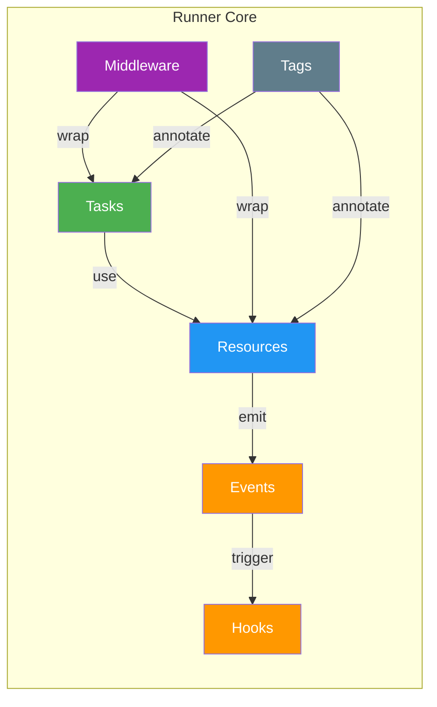
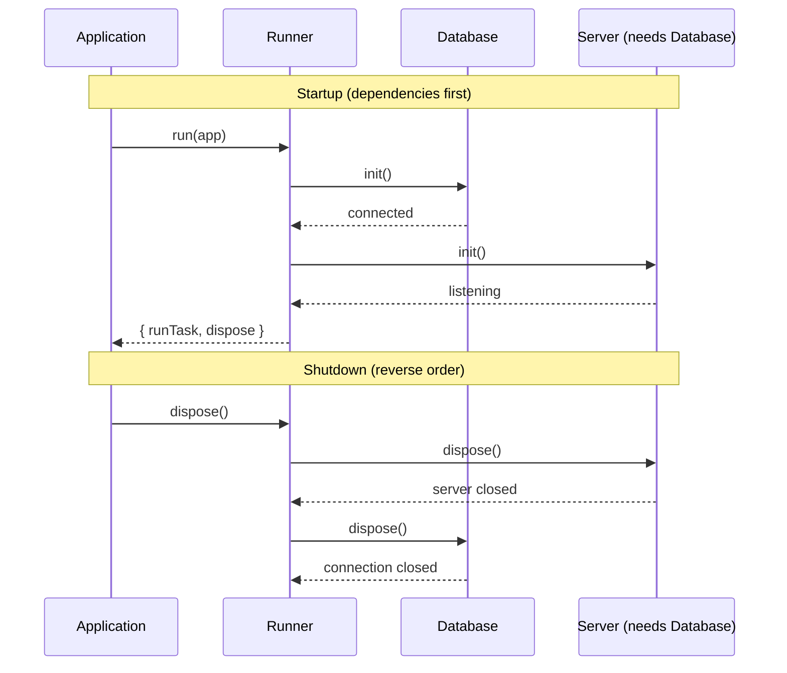

# BlueLibs Runner

## Explicit TypeScript Dependency Injection Toolkit

**Build apps from tasks and resources with explicit dependencies, predictable lifecycle, and first-class testing**

Runner is a TypeScript-first toolkit for building an `app` out of small, typed building blocks. You can find more details and a visual overview at [runner.bluelibs.com](https://runner.bluelibs.com/).

- **Tasks**: async functions with explicit `dependencies`, middleware, and input/output validation
- **Resources**: singletons with `init`/`dispose` lifecycle (databases, clients, servers, caches)
- **Reliability Middleware**: built-in `retry`, `timeout`, `circuitBreaker`, `cache`, and `rateLimit`
- **Remote Lanes**: cross-process execution (the "Distributed Monolith") with zero call-site changes
- **Durable Workflows**: persistent, crash-recoverable async logic for Node.js
- **Events & hooks**: typed signals and subscribers for decoupling
- **Runtime control**: run, observe, test, and dispose your `app` predictably

The goal is simple: keep dependencies explicit, keep lifecycle predictable, and make your runtime easy to control in production and in tests.

<p align="center">
<a href="https://github.com/bluelibs/runner/actions/workflows/ci.yml"></a>
<a href="https://github.com/bluelibs/runner"></a>
<a href="https://bluelibs.github.io/runner/" target="_blank"></a>
<a href="https://www.npmjs.com/package/@bluelibs/runner"></a>
<a href="https://www.npmjs.com/package/@bluelibs/runner"></a>
</p>

```typescript
import { r, run } from "@bluelibs/runner";
import { z } from "zod";

// resources are singletons with lifecycle management and async construction
const db = r
  .resource("app.db")
  .init(async () => {
    const conn = await postgres.connect(process.env.DB_URL);
    return conn;
  })
  .build();

const mailer = r
  .resource("app.mailer")
  .init(async () => ({
    sendWelcome: async (email: string) => {
      console.log(`Sending welcome email to ${email}`);
    },
  }))
  .build();

// Define a task with dependencies, middleware, and zod validation
const createUser = r
  .task("users.create")
  .dependencies({ db, mailer })
  .middleware([middleware.task.retry.with({ retries: 3 })])
  .inputSchema(z.object({ name: z.string(), email: z.string().email() }))
  .run(async (input, { db, mailer }) => {
    const user = await db.users.insert(input);
    await mailer.sendWelcome(user.email);
    return user;
  })
  .build();

// Compose resources and run your application
const app = r
  .resource("app") // top-level app resource
  .register([db, mailer, createUser]) // register all elements
  .build();

const runtime = await run(app);
await runtime.runTask(createUser, { name: "Ada", email: "ada@example.com" });
// await runtime.dispose() when you are done.
```

---

| Resource                                                                                                            | Type    | Description                         |
| ------------------------------------------------------------------------------------------------------------------- | ------- | ----------------------------------- |
| [Official Website & Documentation](https://runner.bluelibs.com/)                                                    | Website | Overview and features               |
| [GitHub Repository](https://github.com/bluelibs/runner)                                                             | GitHub  | Source code, issues, and releases   |
| [Runner Dev Tools](https://github.com/bluelibs/runner-dev)                                                          | GitHub  | Development CLI and tooling         |
| [API Documentation](https://bluelibs.github.io/runner/)                                                             | Docs    | TypeDoc-generated reference         |
| [AI-Friendly Docs](./AI.md)                                                                                 | Docs    | Compact summary (<5000 tokens)      |
| [Full Guide](./FULL_GUIDE.md)                                                                               | Docs    | Complete documentation (composed)   |
| [Support & Release Policy](./ENTERPRISE.md)                                                                 | Docs    | Support windows and deprecation     |
| [Design Documents](https://github.com/bluelibs/runner/tree/main/readmes)                                            | Docs    | Architecture notes and deep dives   |
| [Example: Express + OpenAPI + SQLite](https://github.com/bluelibs/runner/tree/main/examples/express-openapi-sqlite) | Example | REST API with OpenAPI specification |
| [Example: Fastify + MikroORM + PostgreSQL](https://github.com/bluelibs/runner/tree/main/examples/fastify-mikroorm)  | Example | Full-stack application with ORM     |

### Community & Policies

- [Code of Conduct](../.github/CODE_OF_CONDUCT.md)
- [Contributing](../.github/CONTRIBUTING.md)
- [Security](../.github/SECURITY.md)

## Choose Your Path

- **New to Runner**: Start with [Your First 5 Minutes](#your-first-5-minutes)
- **Prefer an end-to-end example**: Jump to [Quick Start](#quick-start) or the [Real-World Example](https://github.com/bluelibs/runner/blob/main/readmes/FULL_GUIDE.md#real-world-example-the-complete-package)
- **Need Node-only capabilities**: See [Durable Workflows](./DURABLE_WORKFLOWS.md)
- **Need remote execution**: See [Remote Lanes](./REMOTE_LANES.md) (expose from Node.js, call from any `fetch` runtime)
- **Care about portability**: Read [Multi-Platform Architecture](./MULTI_PLATFORM.md)
- **Planning upgrades**: See [Support & Release Policy](./ENTERPRISE.md)
- **Want the complete guide**: Read [FULL_GUIDE.md](./FULL_GUIDE.md)
- **Want the short version**: Read [AI.md](./AI.md)

## Platform Support (Quick Summary)

| Capability                                             | Node.js | Browser | Edge | Notes                                      |
| ------------------------------------------------------ | ------- | ------- | ---- | ------------------------------------------ |
| Core runtime (tasks/resources/middleware/events/hooks) | Full    | Full    | Full | Platform adapters hide runtime differences |
| Async Context (`r.asyncContext`)                       | Full    | None    | None | Requires Node.js `AsyncLocalStorage`       |
| Durable workflows (`@bluelibs/runner/node`)            | Full    | None    | None | Node-only module                           |
| Remote Lanes client (`createHttpClient`)               | Full    | Full    | Full | Explicit universal client for `fetch` runtimes |
| Remote Lanes server (`@bluelibs/runner/node`)          | Full    | None    | None | Exposes tasks/events over HTTP             |

---

## Prerequisites

Use these minimums before starting:

| Requirement     | Minimum                 | Notes                                                                   |
| --------------- | ----------------------- | ----------------------------------------------------------------------- |
| Node.js         | `18.x`                  | Enforced by `package.json#engines.node`                                 |
| TypeScript      | `5.6+` (recommended)    | Required for typed DX and examples in this repository                   |
| Package manager | npm / pnpm / yarn / bun | Examples use npm, but any modern package manager works                  |
| `fetch` runtime | Built-in or polyfilled  | Required for explicit remote lane clients (`createHttpClient`) |

If you use the Node-only package (`@bluelibs/runner/node`) for durable workflows or exposure, stay on a supported Node LTS line.

---
## Why Runner?

When a TypeScript service grows past a few dependencies, the pain usually shows up in the same places: startup order becomes tribal knowledge, cross-cutting concerns leak into business logic, and testing means reconstructing half the app. Runner makes those seams explicit. You wire dependencies in code, keep lifecycle in one place, and choose when to execute a unit directly versus through the full runtime.

### The Core Promise

Runner is for teams that want explicit composition without class decorators, reflection, or framework-owned magic.

- **Before Runner**: manual wiring, ad hoc startup and shutdown, inconsistent test setup, policies scattered across handlers
- **With Runner**: explicit dependency maps, resource lifecycle, middleware for cross-cutting concerns, direct unit testing or full runtime execution

### A Small, Runnable Example

Start with one resource, one task, and one app. This example is intentionally small enough to run as-is.

```typescript
import { r, run } from "@bluelibs/runner";

const userStore = r
  .resource("userStore")
  .init(async () => new Map<string, { id: string; email: string }>())
  .build();

const createUser = r
  .task<{ email: string }>("createUser")
  .dependencies({ userStore })
  .run(async (input, { userStore }) => {
    const user = { id: "user-1", email: input.email };
    userStore.set(user.id, user);
    return user;
  })
  .build();

const app = r.resource("app").register([userStore, createUser]).build();

const { runTask, dispose } = await run(app);

console.log(await runTask(createUser, { email: "ada@example.com" }));
await dispose();
```

**What this proves**: the smallest Runner app still has explicit wiring, a runtime boundary, and reusable units.

### Why It Appeals to Senior TypeScript Teams

- **Architecture you can enforce, not just document**: dependency graphs, isolation boundaries, and lifecycle contracts are validated at bootstrap — not left to code review
- **No decorators, no reflection, no magic**: composition is plain TypeScript functions and explicit builder chains — fully tree-shakeable, fully debuggable
- **Lifecycle that doesn't leak**: `init → ready → cooldown → dispose` lives with the resource definition, so startup order and graceful shutdown stop being tribal knowledge
- **Test any unit in isolation or through the full runtime**: call `.run()` directly for a pure unit test, or `runTask()` for the real middleware + validation + DI path — same definition, both modes
- **Cross-cutting concerns without pollution**: retry, rate-limit, caching, circuit-breaker, timeout — attach as middleware instead of wrapping every handler
- **Incremental adoption**: wrap one service or one task, prove the value, then expand — Runner doesn't need to own your whole app

### Tradeoffs and Boundaries

Runner is not trying to be the lowest-ceremony option for tiny scripts.

- You write some setup code up front so the graph stays explicit later.
- The best payoff appears once your app has multiple long-lived services or cross-cutting policies.
- Some features are intentionally platform-specific.
  Async Context, Durable Workflows, and server-side Remote Lanes are Node-only.

### Resources, Tasks, Events, Hooks, Middleware, and Tags

Runner stays understandable because the runtime is built from a small set of definition types with explicit contracts.

> **Naming rule:** User-defined ids are local ids and must not contain `.`. Prefer `send-email` or `user-store`. Dotted `runner.*` and `system.*` ids are reserved for framework internals.



Use the next chapters in this order:

- **Resources**: lifecycle-owned services, config, boundaries, and ownership
- **Tasks**: typed business operations and execution-local context
- **Events & Hooks**: decoupled signaling, reactions, and emission controls
- **Middleware**: reusable policies around tasks and resources
- **Tags**: typed discovery, metadata, and framework behaviors
- **Errors**: reusable typed error helpers and declarative `.throws()` contracts

For specialized features beyond the core concepts:

- **Async Context**: per-request or thread-local state via `r.asyncContext()`
- **Durable Workflows** (Node-only): replay-safe orchestration primitives in [DURABLE_WORKFLOWS.md](./DURABLE_WORKFLOWS.md)
- **Remote Lanes** (Node): distributed events and RPC in [REMOTE_LANES.md](./REMOTE_LANES.md)
- **Serialization**: custom value transport in [SERIALIZER_PROTOCOL.md](./SERIALIZER_PROTOCOL.md)
## Resources

Resources are the long-lived parts of your app: database clients, configuration surfaces, queues, services, caches, and ownership boundaries.
They initialize once, participate in runtime lifecycle phases, and give tasks a stable dependency surface.
They are also the main composition unit in Runner: a resource can own registration, enforce boundaries, expose a value, and define how that part of the system starts and stops.

Most apps begin by building a root resource and passing it to `run(...)`:

```typescript
import { r, run } from "@bluelibs/runner";

const app = r
  .resource("app")
  .register([
    // tasks, events, middleware, child resources
  ])
  .build();

const runtime = await run(app);
```

Once `run(app)` resolves, the returned runtime is your operator-facing handle. The main APIs are:

- `runtime.runTask(...)` to execute tasks
- `runtime.emitEvent(...)` to emit events
- `runtime.getResourceValue(...)` and `runtime.getLazyResourceValue(...)` to read resource values
- `runtime.getResourceConfig(...)` to inspect resolved resource config
- `runtime.getHealth(...)` to evaluate resource health probes
- `runtime.pause()`, `runtime.resume()`, and `runtime.recoverWhen(...)` to control admissions
- `runtime.dispose()` to stop the runtime cleanly

```typescript
import { r } from "@bluelibs/runner";
import { MongoClient } from "mongodb";

type UserData = {
  email: string;
};

const database = r
  .resource("database")
  .init(async () => {
    const client = new MongoClient(process.env.DATABASE_URL as string);
    await client.connect();
    return client;
  })
  .dispose(async (client) => client.close())
  .build();

const userService = r
  .resource("userService")
  .dependencies({ database })
  .init(async (_config, { database }) => ({
    async createUser(userData: UserData) {
      return database.collection("users").insertOne(userData);
    },
    async getUser(id: string) {
      return database.collection("users").findOne({ _id: id });
    },
  }))
  .build();
```

This example assumes the `mongodb` package is installed and `DATABASE_URL` is set.

**What you just learned**: Resources define `init` for creation and `dispose` for cleanup. Dependencies are declared explicitly, and the builder pattern produces a frozen definition.

When you want operator-facing health data, keep the probe small and explicit:

```typescript
const database = r
  .resource("database")
  .init(async () => connectDb())
  .health(async (client) => ({
    status: client?.isConnected() ? "healthy" : "unhealthy",
    message: "database connectivity",
  }))
  .build();
```

### Health Reporting

`health()` is opt-in and pull-based. Runner does not call it automatically during every lifecycle phase. It only runs when you ask for a report.

Runner exposes the same health reporter in two places:

- `resources.health` is a built-in global resource exported through the `resources` namespace. Inject it when you want health checks from inside Runner-managed code.
- `runtime.getHealth(...)` is the operator-facing shortcut on the runtime instance.

Use `resources.health` inside resources, hooks, or tasks when you are already in the dependency graph:

```typescript
import { resources, r } from "@bluelibs/runner";

const app = r
  .resource("app")
  .dependencies({ health: resources.health, logger: resources.logger })
  .ready(async (_value, _config, { health, logger }) => {
    const report = await health.getHealth([database]);
    const databaseEntry = report.find(database);

    if (databaseEntry.status === "unhealthy") {
      await logger.error("Database health check failed", {
        resourceId: databaseEntry.id,
        message: databaseEntry.message,
        details: databaseEntry.details,
      });
    }
  })
  .build();
```

Use `runtime.getHealth(...)` from operator-facing code after `run(app)` resolves:

```typescript
import { resources } from "@bluelibs/runner";

const runtime = await run(app);
const logger = runtime.getResourceValue(resources.logger);

const report = await runtime.getHealth();

const databaseStatus = report.find(database).status;

if (databaseStatus !== "healthy") {
  await logger.error("Operator health check detected a problem", {
    totals: report.totals,
    database: report.find(database),
  });
}
```

The report shape is:

```typescript
{
  totals: {
    resources: number;
    healthy: number;
    degraded: number;
    unhealthy: number;
  };
  report: Array<{
    id: string;
    initialized: boolean;
    status: "healthy" | "degraded" | "unhealthy";
    message?: string;
    details?: unknown;
  }>;
  find(resourceOrId): HealthEntry;
}
```

Important behavior:

- resources without `health()` are skipped instead of receiving a synthetic status
- lazy resources that were never initialized stay asleep and are skipped instead of being probed
- filtered calls such as `getHealth([database])` accept resource definitions or ids
- repeated filtered resources are de-duplicated
- unknown requested resources fail fast
- if `health()` throws, Runner converts that into an `unhealthy` entry with the error message in `message` and the normalized error in `details`
- `report.find(...)` throws when the requested resource is not present in the report
- `id` in each report entry is the canonical runtime path for that resource

Timing matters:

- call `runtime.getHealth(...)` only after `run(...)` resolves and before disposal starts
- do not call `resources.health.getHealth(...)` during bootstrap from `init()`; prefer `ready()` or later

Prefer health probes for current operational state, not deep diagnostics. Keep them fast, explicit, and safe to run on demand.

When a health signal indicates temporary pressure or a downstream outage, use runtime admission control instead of tearing the system down:

```typescript
const runtime = await run(app);

runtime.pause("database is unhealthy");

runtime.recoverWhen({
  everyMs: 5_000,
  check: async () => {
    const report = await runtime.getHealth([database]);
    return report.find(database).status !== "unhealthy";
  },
});
```

`runtime.pause()` is not shutdown. It simply stops admitting new runtime-origin and resource-origin task runs and event emissions while already-running work continues. `runtime.recoverWhen({ everyMs, check })` polls your recovery condition and automatically resumes the runtime once the active paused episode is healthy enough to accept work again.

### Lifecycle and Ownership Rules

Resources move through a deliberate sequence of phases. Understanding which phase to use—and which to leave alone—prevents subtle shutdown bugs. All lifecycle methods are async.

- `init(config, deps, context)` creates the resource value
- `ready(value, config, deps, context)` starts ingress after startup lock
- `runtime.getLazyResourceValue(...)` can wake a startup-unused lazy resource only before shutdown starts; once the runtime enters `coolingDown` or later, that wakeup is rejected fail-fast.
- `cooldown(value, config, deps, context)` stops new ingress **quickly**, a way of saying "stop any additional work, but let in-flight work finish".
  When `dispose.cooldownWindowMs` is greater than `0`, Runner keeps the broader `coolingDown` admission policy open for that bounded post-cooldown window before it enters `disposing`. At the default `0`, Runner skips that wait. Once `disposing` begins, admissions narrow to in-flight continuations plus resource-origin calls from the cooling resource itself and any additional resource definitions returned from `cooldown()`.
- `dispose(value, config, deps, context)` performs final teardown after task/event drain.
- Config-only resources can omit `.init()` and resolve to `undefined`
- user resources contribute their own ownership segment to canonical ids
- the app resource passed to `run(...)` is a normal resource, so direct registrations compile as `app.tasks.x`, `app.events.x`, `app.middleware.task.x`, and so on
- child resources continue that chain, so nested registrations compile as `app.billing.tasks.x`
- only the internal synthetic framework root is transparent, and it does not appear in user-facing ids
- `runtime-framework-root` is reserved for that internal framework root and cannot be used as a user resource id
- If a resource declares `.register(...)`, it is non-leaf and cannot be forked
- `.context(() => initialContext)` provides private and mutable resource-local state shared across lifecycle methods

Do not use `cooldown()` as a general teardown phase for support resources such as databases. Cooldown is designed for ingress points that need to stop accepting new work quickly while letting in-flight work finish.

### Resource Configuration

Resources can be configured with type-safe options.

```typescript
import { r } from "@bluelibs/runner";

type SMTPConfig = {
  smtpUrl: string;
  from: string;
};

const emailer = r
  .resource<SMTPConfig>("emailer")
  .init(async (config) => ({
    send: async (to: string, subject: string, body: string) => {
      // Use config.smtpUrl and config.from
    },
  }))
  .build();

const app = r
  .resource("app")
  .register([
    emailer.with({
      smtpUrl: "smtp://localhost",
      from: "noreply@myapp.com",
    }),
  ])
  .build();
```

### Dynamic Registration and Dependencies

Both `.register()` and `.dependencies()` accept functions when behavior depends on config or environment.

`.register()` as a function — when the registered set depends on config:

```typescript
import { r } from "@bluelibs/runner";

const auditLog = r
  .resource("auditLog")
  .init(async () => ({ write: (message: string) => console.log(message) }))
  .build();

const feature = r
  .resource<{ enableAudit: boolean }>("feature")
  .register((config) => (config.enableAudit ? [auditLog] : []))
  .init(async () => ({ enabled: true }))
  .build();
```

`.dependencies()` as a function — when dependencies are conditional or config-driven:

```typescript
const advancedService = r
  .resource("app.services.advanced")
  .dependencies((_config) => ({
    database,
    logger,
    // Config is what you receive when you register this resource with .with()
    conditionalService:
      process.env.NODE_ENV === "production" ? serviceA : serviceB,
  }))
  .init(async (_config, { database, logger, conditionalService }) => {
    // Same interface as static dependencies
  })
  .build();
```

Use function-based patterns when:

- registered components or dependencies depend on config
- you want one reusable template with environment-specific wiring
- you need to avoid registering optional components in every environment
- you have conditional dependencies based on the resource's `.with(...)` config

**Performance note**: Function-based dependencies have minimal overhead — they're called once during dependency resolution.

### Dependency Resolution Strategy

Runner resolves dependency trees into ordered initialization waves during `run(app)`.
By default, initialized resources run `init()` sequentially.
Set `lifecycleMode: "parallel"` to execute independent resources concurrently within their dependency-safe wave:

```typescript
const runtime = await run(app, {
  lifecycleMode: "parallel",
  // lazy: true // Only init resources explicitly requested or needed
});
```

This speeds up boot times when multiple resources (like DBs or queues) don't depend on each other.

### Circular Type Dependencies (TypeScript)

In the very rare scenarion, when your file structure creates mutual imports (e.g., `a.ts` imports `b.ts`, `b.ts` imports `c.ts`, and `c.ts` imports a task from `a.ts`), TypeScript may fail to infer return types across the cycle even when the Runner graph itself is acyclic.

Fix it with an explicit type annotation on the resource that completes the importing circle:

```typescript
// a.ts - imports { bResource } from "./b.js"
// b.ts - imports { cResource } from "./c.js"

// c.ts - completes the import cycle
import { aTask } from "./a.js";
import type { IResource } from "@bluelibs/runner";

// Break the TypeScript inference chain without affecting runtime behavior.
export const cResource = r
  .resource("c.resource")
  .dependencies({ aTask })
  .init(async (_config, { aTask }) => `value: ${await aTask(undefined)}`)
  .build() as IResource<void, Promise<string>>;
```

This does **not** bypass Runner's bootstrap-time cycle detection — it only fixes TypeScript inference.

### Resource Forking

Fork a leaf resource when you need the same resource behavior under a new identity.

```typescript
import { r } from "@bluelibs/runner";

const mailerBase = r
  .resource<{ smtp: string }>("mailerBase")
  .init(async (cfg) => ({
    send: (to: string) => console.log(`Sending via ${cfg.smtp} to ${to}`),
  }))
  .build();

export const txMailer = mailerBase.fork("txMailer");
export const marketingMailer = mailerBase.fork("marketingMailer");

const orderService = r
  .task("processOrder")
  .dependencies({ mailer: txMailer })
  .run(async (input, { mailer }) => {
    mailer.send(input.customerEmail);
  })
  .build();
```

Fork rules:

- `.fork()` returns a built `IResource`; do not call `.build()` again
- forks clone identity, not structure
- tags, middleware, and type parameters are inherited
- each fork gets independent runtime state
- non-leaf resources must be composed explicitly

### Resource Exports and Isolation Boundaries

Use `.isolate({ exports: [...] })` to define a public surface for a resource subtree and keep everything else private.
When the boundary depends on resource config, use `.isolate((config) => ({ ... }))`.

```typescript
import { r } from "@bluelibs/runner";

const calculateTax = r
  .task("calculateTax")
  .run(async (amount: number) => amount * 0.1)
  .build();

const createInvoice = r
  .task("createInvoice")
  .dependencies({ calculateTax })
  .run(
    async (amount: number, deps) => amount + (await deps.calculateTax(amount)),
  )
  .build();

const billing = r
  .resource("billing")
  .register([calculateTax, createInvoice])
  .isolate({ exports: [createInvoice] })
  // calculateTax will not be visible/usable to resources outside of billing, but createInvoice will be
  .build();
```

Semantics:

- No `isolate.exports` means everything remains public
- `exports: []` or `exports: "none"` makes the subtree private
- `exports` accepts explicit Runner definition or resource references only
- `.isolate((config) => ({ ... }))` resolves once per configured resource instance
- Visibility checks cover dependencies, hook `.on(...)`, tag attachments, and middleware attachment
- Exporting a child resource makes that child's own exported surface transitively visible
- Validation happens during `run(app)`, not declaration time
- Runtime operator APIs are gated only by the root resource's exported surface

Migration note:

- Legacy resource-level `exports` and fluent `.exports(...)` were removed in 6.x
- Use `isolate: { exports: [...] }` with `defineResource(...)`
- Use `.isolate({ exports: [...] })` with fluent builders

### Wiring Access Policy

Use `.isolate({ deny: [...] })`, `.isolate({ only: [...] })`, and `.isolate({ whitelist: [...] })` when visibility alone is not enough.

```typescript
import { r, scope, subtreeOf } from "@bluelibs/runner";

const internalDb = r
  .resource("internalDb")
  .init(async () => ({}))
  .build();

const internalOnlyTag = r.tag("internalOnly").build();

const billing = r
  .resource("billing")
  .register([internalDb, internalOnlyTag])
  .isolate({
    deny: [internalDb, scope([internalOnlyTag], { tagging: false })],
  })
  .build();

const agentTask = r
  .task("agentTask")
  .run(async () => "agent")
  .build();
const agentResource = r.resource("agent").register([agentTask]).build();

const selective = r
  .resource("selective")
  .isolate({
    only: [subtreeOf(agentResource, { types: ["task"] })],
  })
  .build();
```

Mental model:

- `exports` answers: "what does this subtree expose to the outside?"
- `deny` / `only` / `whitelist` answer: "what may consumers inside this subtree wire to across boundaries?"
- Use a direct definition/resource/tag reference for one concrete item.
- Use `subtreeOf(resource, { types? })` for "everything owned by that resource subtree".
- Use `scope(target, channels?)` when the rule should only affect selected channels.

Selector rules:

- `deny` and `only` are mutually exclusive on the same resource
- `deny` and `only` accept definitions, `subtreeOf(...)`, or `scope(...)`
- `whitelist` uses `{ for: [...], targets: [...], channels? }`, and `for` / `targets` accept the same selector forms as `deny` / `only`
- bare strings are invalid in isolation policies; use string selectors only inside `scope(...)`
- `scope("*")` means "everything"
- `scope("system.*")` means "all registered canonical ids matching that segment wildcard"
- `subtreeOf(resource)` is ownership-based, not string-prefix-based
- `.isolate((config) => ({ ... }))` can switch `deny`, `only`, `whitelist`, and `exports` from resource config

Behavior rules:

- `deny` blocks matching cross-boundary references
- `only` allows only matching cross-boundary references
- `whitelist` adds carve-outs for specific consumer -> target relations on this boundary only
- `whitelist` does not override ancestor isolation rules
- `whitelist` does not make private exports public
- enforcement covers dependencies, listening, tagging, and middleware channels
- parent and child isolation rules compose additively
- unknown targets and selector patterns that resolve to nothing fail fast at bootstrap

### Subtree Policies

Resources also support `.subtree(policy)`, `.subtree([policyA, policyB])`, and `.subtree((config) => policy | policy[])` for subtree-wide middleware and validation.

Keep the two APIs distinct:

- `subtreeOf(resource, { types })` is an isolation selector used inside `.isolate(...)`
- `.subtree({ validate })` is a generic resource policy hook that inspects compiled definitions in that resource subtree
- `.subtree([policyA, policyB])` applies multiple subtree policies in declaration order
- `.subtree((config) => ({ ... }))` and `.subtree((config) => [{ ... }, { ... }])` let subtree policy depend on the owning resource config
- `subtree.validate` can be one function or an array of functions
- typed validator branches are also available on `tasks`, `resources`, `hooks`, `events`, `tags`, `taskMiddleware`, and `resourceMiddleware`
- if subtree middleware and local middleware resolve to the same middleware id on one target, Runner fails fast

Use the generic validator with exported type guards when you need type-specific checks:

```typescript
import { isResource, isTask, r, run } from "@bluelibs/runner";
import type { SubtreeViolation } from "@bluelibs/runner";

const app = r
  .resource("app")
  .subtree({
    validate: (definition): SubtreeViolation[] => {
      const violations: SubtreeViolation[] = [];
      if (isTask(definition) && !definition.meta?.title) {
        violations.push({
          code: "missing-task-title",
          message: `Task "${definition.id}" must define meta.title`,
        });
      }

      if (isResource(definition) && definition.init == null) {
        violations.push({
          code: "resource-must-init",
          message: `Resource "${definition.id}" must define init()`,
        });
      }

      return violations;
    },
  })
  .build();

await run(app);
```

Use typed branches when you want item-specific validation without runtime guards:

```typescript
const app = r
  .resource<{ strict: boolean }>("app")
  .subtree((config) => ({
    validate: config.strict
      ? (definition) =>
          isTask(definition) && !definition.meta?.title
            ? [
                {
                  code: "missing-task-title",
                  message: `Task "${definition.id}" must define meta.title`,
                },
              ]
            : []
      : [],
    tasks: {
      validate: (task) =>
        task.meta?.title
          ? []
          : [
              {
                code: "missing-task-title",
                message: `Task "${task.id}" must define meta.title`,
              },
            ],
    },
    taskMiddleware: {
      validate: (middleware) =>
        middleware.meta?.title
          ? []
          : [
              {
                code: "missing-task-middleware-title",
                message: `Task middleware "${middleware.id}" must define meta.title`,
              },
            ],
    },
  }))
  .build();
```

Validation rules:

- validators receive compiled definitions, not raw builder state
- generic and typed validators both run when they match the same definition
- use exported guards such as `isTask(...)`, `isResource(...)`, `isEvent(...)`, `isHook(...)`, `isTag(...)`, `isTaskMiddleware(...)`, and `isResourceMiddleware(...)`
- return `SubtreeViolation[]` for expected policy failures
- do not throw for normal validation failures

### Optional Dependencies

Optional dependencies are for components that may not be registered in a given runtime (for example local dev, feature-flagged modules, or partial deployments).
They are not a substitute for retry/circuit-breaker logic when a registered dependency fails at runtime.

```typescript
import { r } from "@bluelibs/runner";

const registerUser = r
  .task("app.tasks.registerUser")
  .dependencies({
    database, // Required - task fails if missing
    analytics: analyticsService.optional(), // Optional - undefined if missing
    email: emailService.optional(), // Optional - graceful degradation
  })
  .run(async (input, { database, analytics, email }) => {
    // Core logic always runs
    const user = await database.create(input);

    // Optional dependencies are undefined if missing
    await analytics?.track("user.registered");
    await email?.sendWelcome(user.email);

    return user;
  })
  .build();
```

`optional()` handles dependency absence (`undefined`) at wiring time.
If a registered dependency throws, handle that with retry/fallback/circuit-breaker patterns.

Optional dependencies work on tasks, resources, events, async contexts, and errors.

| Use Case                  | Example                                            |
| ------------------------- | -------------------------------------------------- |
| **Non-critical services** | Analytics, metrics, feature flags                  |
| **External integrations** | Third-party APIs that may be flaky                 |
| **Development shortcuts** | Skip services not running locally                  |
| **Feature toggles**       | Conditionally enable functionality                 |
| **Gradual rollouts**      | New services that might not be deployed everywhere |

For components that accept config (like resources), you can compute dependencies from `.with(...)` config:

```typescript
const analyticsAdapter = r
  .resource<{ enableAnalytics?: boolean }>("app.services.analyticsAdapter")
  .dependencies((config) => ({
    database,
    // Only include analytics when enabled in resource config
    ...(config?.enableAnalytics ? { analytics } : {}),
  }))
  .init(async (_config, deps) => ({
    async record(eventName: string) {
      await deps.analytics?.track(eventName);
    },
  }))
  .build();
```

For tasks, prefer static dependencies (required or `.optional()`) and branch at execution time.

### Private Context

Use resource context when lifecycle methods need shared mutable state.

```typescript
import { r } from "@bluelibs/runner";

// Assuming `connectToDatabase` and `createPool` are your own collaborators.
const dbResource = r
  .resource("dbResource")
  .context(() => ({
    connections: new Map<string, unknown>(),
    pools: [] as Array<{ drain(): Promise<void> }>,
  }))
  .init(async (_config, _deps, resourceContext) => {
    const db = await connectToDatabase();
    resourceContext.connections.set("main", db);
    resourceContext.pools.push(createPool(db));
    return db;
  })
  .dispose(async (_db, _config, _deps, resourceContext) => {
    for (const pool of resourceContext.pools) {
      await pool.drain();
    }
  })
  // same for ready() and cooldown() if needed
  .build();
```

### Overrides

Use `r.override(base, fn)` when you need to replace a component's behavior while keeping the same `id` — common in integration testing or when swapping out a library.

Override direction is downstream-only: declare `.overrides([...])` from the resource that owns the target subtree, or from one of its ancestors. Child resources cannot replace definitions owned by a parent or sibling subtree.

```typescript
import { r } from "@bluelibs/runner";

const productionEmailer = r
  .resource("app.emailer")
  .init(async () => new SMTPEmailer())
  .build();

const mockEmailer = r.override(
  productionEmailer,
  async () => new MockEmailer(),
);

const app = r
  .resource("app")
  .register([productionEmailer])
  .overrides([mockEmailer])
  .build();
```

Overrides work on tasks, resources, hooks, and middleware:

```typescript
// Task
const overriddenTask = r.override(originalTask, async () => 2);

// Resource
const overriddenResource = r.override(
  originalResource,
  async () => "mock-conn",
);

const overriddenLifecycleResource = r.override(originalResource, {
  context: () => ({ closed: false }),
  init: async () => "mock-conn",
  dispose: async (_value, _config, _deps, context) => {
    context.closed = true;
  },
});

// Middleware
const overriddenMiddleware = r.override(
  originalMiddleware,
  async ({ task, next }) => {
    const result = await next(task?.input);
    return { wrapped: result };
  },
);
```

`r.override(base, fn)` is behavior-only for tasks, hooks, and middleware:

- task/hook/task-middleware/resource-middleware: callback replaces `run`
- resource function shorthand: callback replaces `init`
- resource object form may override any subset of `context`, `init`, `ready`, `cooldown`, `dispose`
- resource object-form overrides inherit unspecified lifecycle hooks from the base resource
- resource object-form overrides may add `ready`, `cooldown`, or `dispose` even if the base resource did not define them
- hook overrides keep the same `.on` target
- override APIs do not change structural boundaries (dependencies, register tree, subtree policies)

Use the resource object form intentionally: overriding `context` changes the private lifecycle-state contract that `init()`, `ready()`, `cooldown()`, and `dispose()` share.

**`r.override(...)` vs `.overrides([...])` — critical distinction**:

| API                    | What it does                                                          | Applies replacement? |
| ---------------------- | --------------------------------------------------------------------- | -------------------- |
| `r.override(base, fn)` | Creates a new definition with replaced behavior                       | No (not by itself)   |
| `.overrides([...])`    | Registers override requests Runner validates and applies at bootstrap | Yes                  |

Think of `r.override(...)` as _"build replacement definition"_ and `.overrides([...])` as _"apply replacement in this app"_.

Direct registration of an override definition is also valid when you control the composition and only register one version for that id:

```typescript
const customMailer = r.override(realMailer, async () => new MockMailer());

const app = r
  .resource("app")
  .register([customMailer]) // works: only one definition registered for that id
  .build();
```

Common pitfalls:

1. **Creating an override but never applying it** — register it directly or add it to `.overrides([...])`.
2. **Registering both base and override in `.register([...])`** — keep base in `register`, put replacement in `.overrides([...])`.
3. **Override target not in the graph** — ensure the base is registered first. For a separate instance, use a different id or `.fork("new-id")`.
4. **Passing raw definitions to `.overrides([...])`** — wrap with `r.override(base, fn)` first.
5. **Overriding the root app in tests** — prefer a wrapper resource:

```typescript
r.resource("test")
  .register([app])
  .overrides([
    /* mocks */
  ])
  .build();
```

If multiple overrides target the same id, Runner rejects the graph with a duplicate-target override error. Overriding something not registered also throws, with a remediation hint.

> **runtime:** "Overrides: brain transplant surgery at runtime. You register a penguin and replace it with a velociraptor five lines later. Tests pass. Production screams. I simply update the name tag and pray."

> **runtime:** "Resources: I nurse them to life, let them work, then mercifully pull the plug in reverse order. It's a lot like IT support, except I actually follow the runbook."
## Tasks

Tasks are Runner's main business operations. They are async functions with explicit dependency injection, validation, middleware support, and typed outputs.

```typescript
import { r, run } from "@bluelibs/runner";

// Assuming: emailService and logger are resources defined elsewhere.
const sendEmail = r
  .task("sendEmail")
  .dependencies({ emailService, logger })
  .run(async (input, { emailService, logger }) => {
    await logger.info(`Sending email to ${input.to}`);
    return emailService.send(input);
  })
  .build();

const app = r
  .resource("app")
  .register([emailService, logger, sendEmail])
  .build();

const { runTask, dispose } = await run(app);
const result = await runTask(sendEmail, {
  to: "user@example.com",
  subject: "Hi",
  body: "Hello!",
});

await dispose();
```

**What you just learned**: Tasks declare dependencies, execute through the runtime, and produce typed results. You can run them via `runTask()` for production or `.run()` for isolated tests.

> **Note:** Fluent `.build()` outputs are deep-frozen definitions. Treat definitions as immutable and use builder chaining, `.with()`, `.fork()`, `intercept()`, or `r.override(...)` for changes.

> **Note:** `dependencies` can be declared as an object or factory function. Factory output is resolved during bootstrap and must return an object map.

### Input and Result Validation

Tasks support schema-based validation for both input and output.
Use `.inputSchema()` (alias `.schema()`) to validate task input before execution, and `.resultSchema()` to validate the resolved return value.

```typescript
import { Match, r } from "@bluelibs/runner";

const createUser = r
  .task("createUser")
  .inputSchema(
    Match.compile({
      name: Match.NonEmptyString,
      email: Match.Email,
    }),
  )
  .resultSchema<{ id: string; name: string }>({
    parse: (v) => v,
  })
  .run(async (input) => {
    return { id: "user-1", name: input.name };
  })
  .build();
```

Validation runs before/after the task body. Invalid input or output throws immediately.

### Two Ways to Call Tasks

1. `runTask(task, input)` for production and integration flows through the full runtime pipeline
2. `task.run(input, mockDeps)` for isolated unit tests

```typescript
const testResult = await sendEmail.run(
  { to: "test@example.com", subject: "Test", body: "Testing!" },
  { emailService: mockEmailService, logger: mockLogger },
);
```

### When Something Should Be a Task

Make it a task when:

- it is a core business operation
- it needs dependency injection
- it benefits from middleware such as auth, caching, retry, or timeouts
- multiple parts of the app need to reuse it
- you want runtime observability around it

Keep it as a regular function when:

- it is a simple utility
- it is pure and dependency-free
- performance is critical and framework features add no value
- it is only used in one place

### Task Runtime Context

Task `.run(input, deps, context)` receives:

- `input`: validated task input
- `deps`: resolved dependencies
- `context`: execution-local context

Task context includes:

- `context.journal`: typed state shared with middleware
- `context.source`: `{ kind, id }` of the current task invocation

```typescript
import { journal, resources, r } from "@bluelibs/runner";

const auditKey = journal.createKey<{ startedAt: number }>("auditKey");

const sendEmail = r
  .task<{ to: string; body: string }>("sendEmail")
  .dependencies({ logger: resources.logger })
  .run(async (input, { logger }, context) => {
    context.journal.set(auditKey, { startedAt: Date.now() });
    await logger.info(`Sending email to ${input.to}`);
    return { delivered: true };
  })
  .build();
```

### Execution Journal

`ExecutionJournal` is typed state scoped to a single task execution.

- use it when middleware and tasks need shared execution-local state
- `journal.set(key, value)` fails if the key already exists
- pass `{ override: true }` when replacement is intentional
- create custom keys with `journal.createKey<T>(id)`
- use `journal.create()` when you need a manually managed instance

```typescript
import { journal, r } from "@bluelibs/runner";

const traceIdKey = journal.createKey<string>("traceId");

const traceMiddleware = r.middleware
  .task("traceMiddleware")
  .run(async ({ task, next, journal }) => {
    journal.set(traceIdKey, `trace:${task.definition.id}`);
    return next(task.input);
  })
  .build();

const myTask = r
  .task("myTask")
  .middleware([traceMiddleware])
  .run(async (_input, _deps, { journal, source }) => {
    const traceId = journal.get(traceIdKey);
    return { traceId, source };
  })
  .build();
```

API reference:

| Method                              | Description                                                       |
| ----------------------------------- | ----------------------------------------------------------------- |
| `journal.createKey<T>(id)`          | Create a typed key for storing values                             |
| `journal.create()`                  | Create a fresh journal instance for manual forwarding             |
| `journal.set(key, value, options?)` | Store a typed value, throwing unless `override: true` is provided |
| `journal.get(key)`                  | Retrieve a value as `T \| undefined`                              |
| `journal.has(key)`                  | Check if a key exists                                             |

### Cross-Middleware Coordination

The journal is the clean way for middleware layers to coordinate without polluting task input and output contracts.

```typescript
import { journal, r } from "@bluelibs/runner";

export const journalKeys = {
  abortController: journal.createKey<AbortController>(
    "timeout.abortController",
  ),
} as const;

export const timeoutMiddleware = r.middleware
  .task("timeoutMiddleware")
  .run(async ({ task, next, journal }, _deps, config: { ttl: number }) => {
    const controller = new AbortController();
    journal.set(journalKeys.abortController, controller);

    const timeoutPromise = new Promise((_, reject) => {
      setTimeout(() => {
        controller.abort();
        reject(new Error(`Timeout after ${config.ttl}ms`));
      }, config.ttl);
    });

    return Promise.race([next(task.input), timeoutPromise]);
  })
  .build();
```

Export your journal keys when you expect downstream middleware to consume the same execution-local state.

### Manual Journal Management

For advanced orchestration, you can pre-populate and forward a journal explicitly.

```typescript
const customJournal = journal.create();
customJournal.set(traceIdKey, "manual-trace-id");

const orchestratorTask = r
  .task("orchestratorTask")
  .dependencies({ myTask })
  .run(async (input, { myTask }) => {
    return myTask(input, { journal: customJournal });
  })
  .build();
```

### Execution Interception APIs

Use interception when behavior must wrap execution globally or at runtime wiring boundaries.

Available APIs:

- Task catch-all: `taskRunner.intercept((next, input) => Promise<any>, { when? })`
- Local task interception: `deps.someTask.intercept((next, input) => Promise<any>)`

`taskRunner.intercept(...)` is the replacement for old middleware catch-all behavior:

```typescript
import { r } from "@bluelibs/runner";

const telemetryInstaller = r
  .resource("app.telemetry")
  .dependencies({
    taskRunner: resources.taskRunner,
    logger: resources.logger,
  })
  .init(async (_config, { taskRunner, logger }) => {
    taskRunner.intercept(
      async (next, input) => {
        const startedAt = Date.now();
        try {
          return await next(input);
        } finally {
          await logger.info(
            `Task ${input.task.definition.id} took ${Date.now() - startedAt}ms`,
          );
        }
      },
      {
        when: (taskDefinition) => !taskDefinition.id.startsWith("internal."),
      },
    );
  })
  .build();
```

Key rules:

- Register interceptors during resource `init` before the runtime locks.
- `taskRunner.intercept(...)` runs outermost around the task middleware pipeline.
- `deps.someTask.intercept(...)` runs inside task middleware and only for that task.
- When `when(...)` must target one concrete definition, prefer `isSameDefinition(taskDefinition, someTask)` over comparing public ids directly.

### Task Interceptors

Task interceptors (`task.intercept()`) allow resources to dynamically modify task behavior during initialization without tight coupling.

```typescript
import { r, run } from "@bluelibs/runner";

const calculatorTask = r
  .task("app.tasks.calculator")
  .run(async (input: { value: number }) => {
    return { result: input.value + 1 };
  })
  .build();

const interceptorResource = r
  .resource("app.interceptor")
  .dependencies({ calculatorTask })
  .init(async (_config, { calculatorTask }) => {
    calculatorTask.intercept(async (next, input) => {
      const result = await next(input);
      return { ...result, intercepted: true };
    });
  })
  .build();
```

You can inspect which resources installed local interceptors through an injected task dependency:

```typescript
const inspector = r
  .resource("app.inspector")
  .dependencies({ calculatorTask })
  .init(async (_config, { calculatorTask }) => {
    const owners = calculatorTask.getInterceptingResourceIds();
    // eg: ["app.interceptor"]
    return { owners };
  })
  .build();
```

For lifecycle-owned timers inside tasks or resources, depend on `resources.timers`.
`timers.setTimeout()` and `timers.setInterval()` stop accepting new timers once `cooldown()` starts and are cleared during `dispose()`.

> **runtime:** "Tasks: glorified functions with a resume, a chaperone, and a journal. But at least they show up in the logs when something goes wrong—unlike that anonymous arrow function in line 47."
## Events and Hooks

Events let different parts of your app communicate without direct references. Hooks subscribe to those events so producers stay decoupled from listeners.

```typescript
import { r } from "@bluelibs/runner";

// Assuming: userService is a resource defined elsewhere.
const userRegistered = r
  .event("userRegistered")
  .payloadSchema<{ userId: string; email: string }>({ parse: (value) => value })
  .build();

const registerUser = r
  .task("registerUser")
  .dependencies({ userService, userRegistered })
  .run(async (input, { userService, userRegistered }) => {
    const user = await userService.createUser(input);
    await userRegistered({ userId: user.id, email: user.email });
    return user;
  })
  .build();

const sendWelcomeEmail = r
  .hook("sendWelcomeEmail")
  .on(userRegistered)
  .run(async (event) => {
    console.log(`Welcome email sent to ${event.data.email}`);
  })
  .build();

// Events, tasks, and hooks must all be registered in a resource to be active.
const app = r
  .resource("app")
  .register([userService, userRegistered, registerUser, sendWelcomeEmail])
  .build();
```

**What you just learned**: Events are typed signals, hooks subscribe to them, and tasks emit events through dependency injection. Producers stay decoupled from listeners.

Events follow a few core rules that keep the system predictable:

- events carry typed payloads validated by `.payloadSchema()`
- hooks subscribe with `.on(event)` or `.on(onAnyOf(...))`
- `.order(priority)` controls listener priority
- wildcard `.on("*")` listens to all events except those tagged with `tags.excludeFromGlobalHooks`
- `event.stopPropagation()` prevents downstream listeners from running

### Hooks

Hooks are lightweight event subscribers:

- designed for event handling, not task middleware
- can declare dependencies
- do not have task middleware support
- are ideal for side effects, notifications, logging, and synchronization

### Transactional Events

Use transactional events when hooks must be reversible.

```typescript
const orderPlaced = r
  .event("orderPlaced")
  .payloadSchema<{ orderId: string }>({ parse: (value) => value })
  .transactional()
  .build();

const reserveInventory = r
  .hook("reserveInventory")
  .on(orderPlaced)
  .run(async (event) => {
    await reserve(event.data.orderId);

    return async () => {
      await release(event.data.orderId);
    };
  })
  .build();
```

Transactional behavior:

- transactional is event-level metadata, not hook-level metadata
- every executed hook must return an async undo closure
- if a hook fails, previously completed hooks are rolled back in reverse order
- rollback continues even if one undo fails; Runner throws an aggregated rollback error
- `transactional + parallel` is invalid
- `transactional + tags.eventLane` is invalid

### Parallel Event Execution

By default, hooks run sequentially in priority order.
Use `.parallel(true)` on an event to enable concurrent execution within same-priority batches.

### Emission Reports and Failure Modes

Event emitters accept optional controls:

- `failureMode`: `"fail-fast"` or `"aggregate"`
- `throwOnError`: `true` by default
- `report: true`: returns `IEventEmitReport`

```typescript
const report = await userRegistered(
  { userId: input.userId },
  {
    report: true,
    throwOnError: false,
    failureMode: "aggregate",
  },
);
```

For transactional events, fail-fast rollback semantics are enforced regardless of aggregate options.

### Event-Driven Task Wiring

When a task should announce something happened without owning every downstream side effect, emit an event and let hooks react. This example uses `Match.compile` for schema validation instead of the inline `payloadSchema` shown in the opener:

```typescript
import { Match, r } from "@bluelibs/runner";

// Assuming `createUserInDb` is your own persistence collaborator.
const userCreated = r
  .event("userCreated")
  .payloadSchema(
    Match.compile({
      userId: Match.NonEmptyString,
      email: Match.Email,
    }),
  )
  .build();

const registerUser = r
  .task("registerUser")
  .dependencies({ userCreated })
  .run(async (input, { userCreated }) => {
    const user = await createUserInDb(input);
    await userCreated({ userId: user.id, email: user.email });
    return user;
  })
  .build();
```

### Wildcard Events and Global Hook Exclusions

Wildcard hooks are useful for broad observability or debugging:

```typescript
const logAllEventsHook = r
  .hook("logAllEvents")
  .on("*")
  .run((event) => {
    console.log("Event detected", event.id, event.data);
  })
  .build();
```

Use `tags.excludeFromGlobalHooks` when an event should stay out of wildcard listeners.

```typescript
const internalEvent = r
  .event("internalEvent")
  .tags([tags.excludeFromGlobalHooks])
  .build();
```

### Listening to Multiple Events

Use `onAnyOf()` for tuple-friendly inference and `isOneOf()` as a runtime guard.

```typescript
import { isOneOf, onAnyOf, r } from "@bluelibs/runner";

const eUser = r
  .event("userEvent")
  .payloadSchema<{ id: string; email: string }>({ parse: (v) => v })
  .build();
const eAdmin = r
  .event("adminEvent")
  .payloadSchema<{ id: string; role: "admin" | "superadmin" }>({
    parse: (v) => v,
  })
  .build();

const auditSome = r
  .hook("auditSome")
  .on(onAnyOf(eUser, eAdmin))
  .run(async (ev) => {
    if (isOneOf(ev, [eUser, eAdmin])) {
      ev.data.id;
    }
  })
  .build();
```

### System Events

Runner exposes a minimal system event surface:

- `events.ready`
- `events.disposing`
- `events.drained`

```typescript
const systemReadyHook = r
  .hook("systemReady")
  .on(events.ready)
  .run(async () => {
    console.log("System is ready and operational!");
  })
  .build();
```

### `stopPropagation()`

Use `stopPropagation()` when a higher-priority hook must prevent later listeners from running.

```typescript
// Assuming: criticalAlert is an event defined elsewhere.
const emergencyHook = r
  .hook("onCriticalAlert")
  .on(criticalAlert)
  .order(-100)
  .run(async (event) => {
    if (event.data.severity === "critical") {
      event.stopPropagation();
    }
  })
  .build();
```

### Event Interception APIs

Use `eventManager` to intercept event operations globally during resource initialization:

- Event emission: `eventManager.intercept((next, event) => Promise<void>)` — wraps the entire emit batch.
- Hook execution: `eventManager.interceptHook((next, hook, event) => Promise<any>)` — wraps a single hook's callback.

Always await the `next` function and pass the correct arguments.

```typescript
import { r, resources } from "@bluelibs/runner";

const eventTelemetry = r
  .resource("app.eventTelemetry")
  .dependencies({
    eventManager: resources.eventManager,
    logger: resources.logger,
  })
  .init(async (_config, { eventManager, logger }) => {
    // Intercept individual hook executions (e.g. for benchmarking)
    eventManager.interceptHook(async (next, hook, event) => {
      const start = Date.now();
      try {
        return await next(hook, event);
      } finally {
        await logger.debug(
          `Hook ${String(hook.id)} handled ${String(event.id)} in ${Date.now() - start}ms`,
        );
      }
    });

    // Intercept the entire event emission cycle
    eventManager.intercept(async (next, event) => {
      await logger.info(`Event emitted: ${String(event.id)}`);
      // Warning: you must pass the exact 'event' object reference to next()
      return await next(event);
    });
  })
  .build();
```

> **runtime:** "Events and hooks: the pub/sub contract where nobody reads the terms. You emit, I deliver, hooks react, and somehow the welcome email always fires twice in staging."
## Middleware

Middleware wraps tasks and resources so cross-cutting behavior stays explicit and reusable instead of leaking into business logic.

```typescript
import { r } from "@bluelibs/runner";

type AuthConfig = { requiredRole: string };

const authMiddleware = r.middleware
  .task("authMiddleware")
  .run(async ({ task, next }, _deps, config: AuthConfig) => {
    return await next(task.input);
  })
  .build();

const adminTask = r
  .task("adminTask")
  .middleware([authMiddleware.with({ requiredRole: "admin" })])
  .run(async () => "Secret admin data")
  .build();

// Tasks (and resources) must be registered in a resource before the runtime can use them.
// Inline middleware definitions do not need to be registered separately.
const app = r.resource("app").register([adminTask]).build();
```

**What you just learned**: Middleware wraps tasks or resources with reusable, configurable behavior. Attach it with `.middleware([...])` and configure with `.with()`.

Key rules that keep the middleware model predictable:

- create task middleware with `r.middleware.task(id)`
- create resource middleware with `r.middleware.resource(id)`
- attach middleware with `.middleware([...])`
- first listed middleware is the outermost wrapper
- task middleware can attach only to tasks or `subtree.tasks.middleware`
- resource middleware can attach only to resources or `subtree.resources.middleware`

### Task and Resource Middleware

The two middleware channels serve different wrapping targets:

- task middleware wraps task execution and receives `{ task, next, journal }`
- resource middleware wraps resource initialization or resource value resolution and receives `{ resource, next }`
- task middleware is where auth, retry, cache, timeout, tracing, and admission policies usually live
- resource middleware is where retry or timeout around startup/resource creation usually lives

### Cross-Cutting Middleware

Attach middleware at the owning resource when you want subtree-wide behavior.

```typescript
import { resources, r } from "@bluelibs/runner";

const logTaskMiddleware = r.middleware
  .task("logTaskMiddleware")
  .dependencies({ logger: resources.logger })
  .run(async ({ task, next }, { logger }) => {
    await logger.info(`Executing: ${String(task.definition.id)}`);
    const result = await next(task.input);
    await logger.info(`Completed: ${String(task.definition.id)}`);
    return result;
  })
  .build();

const app = r
  .resource("app")
  .register([logTaskMiddleware])
  .subtree({
    tasks: {
      middleware: [logTaskMiddleware],
    },
  })
  .build();
```

Subtree rules:

Subtree validation is return-based. You can import `SubtreeViolation` from Runner, or return the same `{ code, message }` shape inline.

- subtree middleware entries can be conditional with `{ use, when }`
- subtree middleware resolves before local `.middleware([...])`
- if subtree and local middleware resolve to the same middleware id, Runner fails fast instead of letting the local middleware override the subtree one

```typescript
import { isTask, r, run } from "@bluelibs/runner";
import type { SubtreeViolation } from "@bluelibs/runner";

const app = r
  .resource("app")
  .subtree({
    validate: (definition): SubtreeViolation[] => {
      if (!isTask(definition) || definition.meta?.title) {
        return [];
      }

      return [
        {
          code: "missing-meta-title",
          message: `Task "${definition.id}" must define meta.title`,
        },
      ];
    },
  })
  .build();

await run(app);
```

Rules:

- use exported type guards inside `subtree.validate(...)` when the policy only targets tasks, resources, events, hooks, tags, or middleware
- return `SubtreeViolation[]` for expected policy failures
- do not throw for normal validation failures
- invalid validator returns are aggregated into one subtree validation error

### Middleware Type Contracts

Middleware can enforce input and output contracts on the tasks that use it. This is useful for:

- **Authentication**: ensure all tasks using auth-middleware have `userId` in input
- **API standardization**: enforce consistent response shapes across task groups
- **Validation**: guarantee tasks return required fields

```typescript
import { r } from "@bluelibs/runner";

type AuthConfig = { requiredRole: string };
type AuthInput = { user: { role: string } };
type AuthOutput = { executedBy: { role: string; verified: boolean } };

const authMiddleware = r.middleware
  .task<AuthConfig, AuthInput, AuthOutput>("authMiddleware")
  .run(async ({ task, next }, _deps, config) => {
    const input = task.input;
    if (input.user.role !== config.requiredRole) {
      throw new Error("Insufficient permissions");
    }

    const output = await next(input);
    return {
      ...output,
      executedBy: {
        ...output.executedBy,
        verified: true,
      },
    };
  })
  .build();
```

If you use multiple contract middleware, their contracts combine.

### Built-In Middleware

Runner ships with built-in middleware for common reliability, admission-control, caching, and context-enforcement concerns:

| Middleware     | Config                                    | Notes                                                                      |
| -------------- | ----------------------------------------- | -------------------------------------------------------------------------- |
| cache          | `{ ttl, max, ttlAutopurge, keyBuilder }`  | backed by `resources.cache`; customize with `resources.cache.with(...)`    |
| concurrency    | `{ limit, key?, semaphore? }`             | limits in-flight executions                                                |
| circuitBreaker | `{ failureThreshold, resetTimeout }`      | opens after failures, then fails fast                                      |
| debounce       | `{ ms, keyBuilder? }`                     | waits for inactivity, then runs once with the latest input for that key    |
| throttle       | `{ ms, keyBuilder? }`                     | runs immediately, then suppresses burst calls until the window ends        |
| fallback       | `{ fallback }`                            | static value, function, or task fallback                                   |
| rateLimit      | `{ windowMs, max, keyBuilder? }`          | fixed-window admission limit per key, for cases like "50 per second"       |
| requireContext | `{ context }`                             | fails fast when a specific async context must exist before task execution  |
| retry          | `{ retries, stopRetryIf, delayStrategy }` | transient failures with configurable logic                                 |
| timeout        | `{ ttl }`                                 | rejects after the deadline and aborts cooperative work via `AbortSignal`   |

Resource equivalents:

- `middleware.resource.retry`
- `middleware.resource.timeout`

Recommended ordering:

- fallback outermost
- timeout inside retry when you want per-attempt budgets
- rate-limit for admission control such as "max 50 calls per second"
- concurrency for in-flight control
- cache for idempotent reads

### Caching

Avoid recomputing expensive work by caching task results with TTL-based eviction.
Cache is opt-in: you must register `resources.cache`.

#### Provider Contract

When you provide a custom cache backend, this is the contract:

```typescript
import type { ICacheProvider } from "@bluelibs/runner";

interface CacheProviderOptions {
  ttl?: number;
  max?: number;
  ttlAutopurge?: boolean;
}

type CacheProviderFactory = (
  options: CacheProviderOptions,
) => Promise<ICacheProvider>;
```

Notes:

- `options` are merged from `resources.cache.with({ defaultOptions })` and middleware-level cache options.
- `defaultOptions` remain inherited per-task provider options, not a shared global budget.
- `resources.cache.with({ totalBudgetBytes })` adds a shared budget across cache entries for providers that support task-scoped budgeting.
- The built-in in-memory provider supports `totalBudgetBytes` out of the box.
- Node also ships with `resources.redisCacheProvider`, which supports `totalBudgetBytes` with Redis-backed storage.
- Custom providers should enforce their own backend budget policy unless they explicitly support task-scoped budgets.
- `keyBuilder` is middleware-only and is not passed to the provider.
- `has()` is optional, but recommended when `undefined` can be a valid cached value.

#### Default Usage

```typescript
import { middleware, r, resources } from "@bluelibs/runner";

const expensiveTask = r
  .task("app.tasks.expensive")
  .middleware([
    middleware.task.cache.with({
      // lru-cache options by default
      ttl: 60 * 1000, // Cache for 1 minute
      keyBuilder: (taskId, input: { userId: string }) =>
        `${taskId}-${input.userId}`, // optional key builder
    }),
  ])
  .run(async (input: { userId: string }) => {
    // This expensive operation will be cached
    return await doExpensiveCalculation(input.userId);
  })
  .build();

// Resource-level cache configuration
const app = r
  .resource("app.cache")
  .register([
    // You have to register it, cache resource is not enabled by default.
    resources.cache.with({
      totalBudgetBytes: 50 * 1024 * 1024, // Shared 50MB budget across built-in task caches
      defaultOptions: {
        max: 1000, // Per-task maximum items in cache
        ttl: 30 * 1000, // Per-task default TTL
      },
    }),
  ])
  .build();
```

`totalBudgetBytes` is distinct from `defaultOptions.maxSize`:

- `totalBudgetBytes`: one shared budget across built-in in-memory task caches
- `defaultOptions.maxSize`: the inherited `lru-cache` size limit for each task cache instance

#### Node Redis Cache Provider

Node includes an official Redis-backed cache provider built on top of the optional `ioredis` dependency.

```typescript
import { middleware, r, resources } from "@bluelibs/runner/node";

const cachedTask = r
  .task("app.tasks.cached")
  .middleware([
    middleware.task.cache.with({
      ttl: 60 * 1000,
    }),
  ])
  .run(async () => doExpensiveCalculation())
  .build();

const app = r
  .resource("app")
  .register([
    resources.cache.with({
      provider: resources.redisCacheProvider.with({
        redis: process.env.REDIS_URL,
        prefix: "app:cache",
      }),
      totalBudgetBytes: 50 * 1024 * 1024,
      defaultOptions: {
        ttl: 30 * 1000,
      },
    }),
    cachedTask,
  ])
  .build();
```

Notes:

- `redis` accepts either a Redis connection string or a compatible client instance.
- `prefix` scopes the Redis keys used for entries, LRU ordering, and byte accounting.
- When `prefix` is omitted, Runner generates an isolated per-container namespace.
- Set an explicit `prefix` when you want multiple Node processes to share the same cache namespace and budget.
- Redis-backed cache entries are not cleared by `runtime.dispose()`. Persistence is controlled by Redis TTLs, the chosen `prefix`, and your cache limits.

#### Custom Redis Provider Example

```typescript
import { r, resources } from "@bluelibs/runner";
import Redis from "ioredis";

const redis = r
  .resource<{ url: string }>("app.resources.redis")
  .init(async ({ url }) => new Redis(url))
  .dispose(async (client) => client.disconnect())
  .build();

class RedisCache {
  constructor(
    private client: Redis,
    private ttlMs?: number,
    private prefix: string = "cache:",
  ) {}

  async get(key: string): Promise<unknown | undefined> {
    const value = await this.client.get(this.prefix + key);
    return value ? JSON.parse(value) : undefined;
  }

  async set(key: string, value: unknown): Promise<void> {
    const payload = JSON.stringify(value);
    if (this.ttlMs && this.ttlMs > 0) {
      await this.client.setex(
        this.prefix + key,
        Math.ceil(this.ttlMs / 1000),
        payload,
      );
      return;
    }
    await this.client.set(this.prefix + key, payload);
  }

  async clear(): Promise<void> {
    const keys = await this.client.keys(this.prefix + "*");
    if (keys.length > 0) {
      await this.client.del(...keys);
    }
  }
}

const redisCacheProvider = r
  .resource("app.resources.cacheProvider.redis")
  .dependencies({ redis })
  .init(async (_config, { redis }) => {
    return async (options) => new RedisCache(redis, options.ttl);
  })
  .build();

const app = r
  .resource("app")
  .register([
    redis.with({ url: process.env.REDIS_URL! }),
    resources.cache.with({ provider: redisCacheProvider }),
  ])
  .build();
```

**Why would you need this?** For monitoring and metrics, you want to know cache hit rates to optimize your application.

**Journal Introspection**: On cache hits the task `run()` is not executed, but you can still detect cache hits from a wrapping middleware:

```typescript
import { middleware, r } from "@bluelibs/runner";

const cacheJournalKeys = middleware.task.cache.journalKeys;

const cacheLogger = r.middleware
  .task("app.middleware.cacheLogger")
  .run(async ({ task, next, journal }) => {
    const result = await next(task.input);
    const wasHit = journal.get(cacheJournalKeys.hit);
    if (wasHit) console.log("Served from cache");
    return result;
  })
  .build();

const myTask = r
  .task("app.tasks.cached")
  .middleware([cacheLogger, middleware.task.cache.with({ ttl: 60000 })])
  .run(async () => "result")
  .build();
```

### Concurrency Control

Limit concurrent executions to protect databases and external APIs. The concurrency middleware keeps only a fixed number of task instances running at once.

```typescript
import { Semaphore, middleware, r } from "@bluelibs/runner";

// Option 1: Simple limit (shared for all tasks using this middleware instance)
const limitMiddleware = middleware.task.concurrency.with({ limit: 5 });

// Option 2: Explicit semaphore for fine-grained coordination
const dbSemaphore = new Semaphore(10);
const dbLimit = middleware.task.concurrency.with({
  semaphore: dbSemaphore,
});

const heavyTask = r
  .task("app.tasks.heavy")
  .middleware([limitMiddleware])
  .run(async () => {
    // Max 5 of these will run in parallel
  })
  .build();
```

**Key benefits:**

- **Resource protection**: Prevent connection pool exhaustion.
- **Queueing**: Automatically queues excess requests instead of failing.
- **Timeouts**: Supports waiting timeouts and cancellation via `AbortSignal`.

### Circuit Breaker

Trip repeated failures early. When an external service starts failing, the circuit breaker opens so subsequent calls fail fast until a cool-down passes.

```typescript
import { middleware, r } from "@bluelibs/runner";

const resilientTask = r
  .task("app.tasks.remoteCall")
  .middleware([
    middleware.task.circuitBreaker.with({
      failureThreshold: 5, // Trip after 5 failures
      resetTimeout: 30000, // Stay open for 30 seconds
    }),
  ])
  .run(async () => {
    return await callExternalService();
  })
  .build();
```

**How it works:**

1. **CLOSED**: Everything is normal. Requests flow through.
2. **OPEN**: Threshold reached. All requests throw `CircuitBreakerOpenError` immediately.
3. **HALF_OPEN**: After `resetTimeout`, one trial request is allowed.
4. **RECOVERY**: If the trial succeeds, it goes back to **CLOSED**. Otherwise, it returns to **OPEN**.

**Why would you need this?** For alerting, you want to know when the circuit opens to alert on-call engineers.

**Journal Introspection**: Access the circuit breaker's state and failure count within your task when it runs:

```typescript
import { middleware, r } from "@bluelibs/runner";

const circuitBreakerJournalKeys = middleware.task.circuitBreaker.journalKeys;

const myTask = r
  .task("app.tasks.monitored")
  .middleware([
    middleware.task.circuitBreaker.with({
      failureThreshold: 5,
      resetTimeout: 30000,
    }),
  ])
  .run(async (_input, _deps, context) => {
    const state = context?.journal.get(circuitBreakerJournalKeys.state);
    const failures = context?.journal.get(circuitBreakerJournalKeys.failures); // number
    console.log(`Circuit state: ${state}, failures: ${failures}`);
    return "result";
  })
  .build();
```

### Temporal Control: Debounce & Throttle

Control the frequency of task execution over time. This is useful for event-driven tasks that might fire in bursts.

```typescript
import { middleware, r } from "@bluelibs/runner";

// Debounce: Run only after 500ms of inactivity
const saveTask = r
  .task("app.tasks.save")
  .middleware([middleware.task.debounce.with({ ms: 500 })])
  .run(async (data) => {
    // Assuming db is available in the closure
    return await db.save(data);
  })
  .build();

// Throttle: Run at most once every 1000ms
const logTask = r
  .task("app.tasks.log")
  .middleware([middleware.task.throttle.with({ ms: 1000 })])
  .run(async (msg) => {
    console.log(msg);
  })
  .build();
```

**When to use:**

- **Debounce**: Search-as-you-type, autosave, window resize events.
- **Throttle**: Scroll listeners, telemetry pings, high-frequency webhooks.

### Fallback: The Plan B

Define what happens when a task fails. Fallback middleware lets you return a default value or execute an alternative path gracefully.

```typescript
import { middleware, r } from "@bluelibs/runner";

const getPrice = r
  .task("app.tasks.getPrice")
  .middleware([
    middleware.task.fallback.with({
      // Can be a static value, a function, or another task
      fallback: async (input, error) => {
        console.warn(`Price fetch failed: ${error.message}. Using default.`);
        return 9.99;
      },
    }),
  ])
  .run(async () => {
    return await fetchPriceFromAPI();
  })
  .build();
```

**Why would you need this?** For audit trails, you want to know when fallback values were used instead of real data.

**Journal Introspection**: The original task that throws does not continue execution, but you can detect fallback activation from a wrapping middleware:

```typescript
import { middleware, r } from "@bluelibs/runner";

const fallbackJournalKeys = middleware.task.fallback.journalKeys;

const fallbackLogger = r.middleware
  .task("app.middleware.fallbackLogger")
  .run(async ({ task, next, journal }) => {
    const result = await next(task.input);
    const wasActivated = journal.get(fallbackJournalKeys.active);
    const err = journal.get(fallbackJournalKeys.error);
    if (wasActivated) console.log(`Fallback used after: ${err?.message}`);
    return result;
  })
  .build();

const myTask = r
  .task("app.tasks.withFallback")
  .middleware([
    fallbackLogger,
    middleware.task.fallback.with({ fallback: "default" }),
  ])
  .run(async () => {
    throw new Error("Primary failed");
  })
  .build();
```

### Rate Limiting

Protect your system from abuse by limiting the number of requests in a specific window of time.

```typescript
import { middleware, r } from "@bluelibs/runner";

const sensitiveTask = r
  .task("app.tasks.login")
  .middleware([
    middleware.task.rateLimit.with({
      windowMs: 60 * 1000, // 1 minute window
      max: 5, // Max 5 attempts per window
    }),
  ])
  .run(async (credentials) => {
    // Assuming auth service is available
    return await auth.validate(credentials);
  })
  .build();
```

**Key features:**

- **Fixed-window strategy**: Simple, predictable request counting.
- **Isolation**: Limits are tracked per task definition.
- **Error handling**: Throws `RateLimitError` when the limit is exceeded.

**Why would you need this?** For monitoring, you want to see remaining quota to implement client-side throttling.

**Journal Introspection**: When the task runs and the request is allowed, you can read the rate-limit state from the execution journal:

```typescript
import { middleware, r } from "@bluelibs/runner";

const rateLimitJournalKeys = middleware.task.rateLimit.journalKeys;

const myTask = r
  .task("app.tasks.rateLimited")
  .middleware([middleware.task.rateLimit.with({ windowMs: 60000, max: 10 })])
  .run(async (_input, _deps, context) => {
    const remaining = context?.journal.get(rateLimitJournalKeys.remaining); // number
    const resetTime = context?.journal.get(rateLimitJournalKeys.resetTime); // timestamp (ms)
    const limit = context?.journal.get(rateLimitJournalKeys.limit); // number
    console.log(
      `${remaining}/${limit} requests remaining, resets at ${new Date(resetTime)}`,
    );
    return "result";
  })
  .build();
```

### Require Context (Async Context Guard)

Fail fast when a task must run inside a specific async context. This middleware is useful for request-scoped metadata such as request ids, tenant ids, and auth claims where continuing without context would produce incorrect behavior.

```typescript
import { r } from "@bluelibs/runner";

const RequestContext = r
  .asyncContext<{ requestId: string }>("app.asyncContexts.request")
  .build();

const getAuditTrail = r
  .task("app.tasks.getAuditTrail")
  // Shortcut: creates middleware.task.requireContext with this context
  .middleware([RequestContext.require()])
  .run(async () => {
    const { requestId } = RequestContext.use();
    return { requestId, entries: [] };
  })
  .build();
```

If you prefer the explicit middleware form, which is useful in documentation and composition helpers:

```typescript
import { middleware, r } from "@bluelibs/runner";

const TenantContext = r
  .asyncContext<{ tenantId: string }>("app.asyncContexts.tenant")
  .build();

const listProjects = r
  .task("app.tasks.listProjects")
  .middleware([middleware.task.requireContext.with({ context: TenantContext })])
  .run(async () => {
    const { tenantId } = TenantContext.use();
    return await projectRepo.findByTenant(tenantId);
  })
  .build();
```

**What it protects you from:**

- Running tenant-sensitive logic without tenant context.
- Logging and auditing tasks that silently lose request correlation ids.
- Hidden bugs where context is only present in some call paths.

> **Platform Note:** Async context requires `AsyncLocalStorage`, which is Node-only. In browsers and edge runtimes, async context APIs are not available.

**What you just learned**: `requireContext` turns missing async context into an immediate, explicit failure instead of a delayed business-logic bug.

### Retrying Failed Operations

When things go wrong but are likely to work on a subsequent attempt, the built-in retry middleware makes tasks and resources more resilient to transient failures.

```typescript
import { middleware, r } from "@bluelibs/runner";

const flakyApiCall = r
  .task("app.tasks.flakyApiCall")
  .middleware([
    middleware.task.retry.with({
      retries: 5, // Try up to 5 times
      delayStrategy: (attempt) => 100 * Math.pow(2, attempt), // Exponential backoff
      stopRetryIf: (error) => error.message === "Invalid credentials", // Do not retry auth errors
    }),
  ])
  .run(async () => {
    // This might fail due to network issues, rate limiting, etc.
    return await fetchFromUnreliableService();
  })
  .build();

const app = r.resource("app").register([flakyApiCall]).build();
```

The retry middleware can be configured with:

- `retries`: The maximum number of retry attempts (default: 3).
- `delayStrategy`: A function that returns the delay in milliseconds before the next attempt.
- `stopRetryIf`: A function to prevent retries for certain types of errors.

It also works on resources, which is especially useful for startup initialization:

```typescript
import { middleware, r } from "@bluelibs/runner";

const database = r
  .resource<{ connectionString: string }>("app.db")
  .middleware([
    middleware.resource.retry.with({
      retries: 4,
      delayStrategy: (attempt) => 250 * Math.pow(2, attempt),
    }),
  ])
  .init(async ({ connectionString }) => {
    return await connectToDatabase(connectionString);
  })
  .dispose(async (value) => {
    await value.close();
  })
  .build();
```

**Why would you need this?** For logging, you want to log which attempt succeeded or what errors occurred during retries.

**Journal Introspection**: Access the current retry attempt and the last error within your task:

```typescript
import { middleware, r } from "@bluelibs/runner";

const retryJournalKeys = middleware.task.retry.journalKeys;

const myTask = r
  .task("app.tasks.retryable")
  .middleware([middleware.task.retry.with({ retries: 5 })])
  .run(async (_input, _deps, context) => {
    const attempt = context?.journal.get(retryJournalKeys.attempt); // 0-indexed attempt number
    const lastError = context?.journal.get(retryJournalKeys.lastError); // Error from previous attempt, if any
    if ((attempt ?? 0) > 0)
      console.log(`Retry attempt ${attempt} after: ${lastError?.message}`);
    return "result";
  })
  .build();
```

### Timeouts

The built-in timeout middleware prevents operations from hanging indefinitely by racing them against a configurable timeout. It works for both tasks and resources.

```typescript
import { middleware, r } from "@bluelibs/runner";

const apiTask = r
  .task("app.tasks.externalApi")
  .middleware([
    // Works for tasks and resources via middleware.resource.timeout
    middleware.task.timeout.with({ ttl: 5000 }), // 5 second timeout
  ])
  .run(async () => {
    // This operation will be aborted if it takes longer than 5 seconds
    return await fetch("https://slow-api.example.com/data");
  })
  .build();

// Combine with retry for robust error handling
const resilientTask = r
  .task("app.tasks.resilient")
  .middleware([
    // Order matters here. Imagine a big onion.
    // Works for resources as well via middleware.resource.retry
    middleware.task.retry.with({
      retries: 3,
      delayStrategy: (attempt) => 1000 * attempt, // 1s, 2s, 3s delays
    }),
    middleware.task.timeout.with({ ttl: 10000 }), // 10 second timeout per attempt
  ])
  .run(async () => {
    // Each retry attempt gets its own 10-second timeout
    return await unreliableOperation();
  })
  .build();
```

How it works:

- Uses `AbortController` and `Promise.race()` for clean cancellation.
- Throws `TimeoutError` when the timeout is reached.
- Works with any async operation in tasks and resources.
- Integrates seamlessly with retry middleware for layered resilience.
- Zero timeout (`ttl: 0`) throws immediately for testing edge cases.

Best practices:

- Set timeouts based on expected operation duration plus buffer.
- Combine with retry middleware for transient failures.
- Use longer timeouts for resource initialization than task execution.
- Consider network conditions when setting API call timeouts.

Resource timeouts help prevent startup hangs when a dependency never becomes ready:

```typescript
import { middleware, r } from "@bluelibs/runner";

const messageBroker = r
  .resource("app.broker")
  .middleware([
    middleware.resource.timeout.with({ ttl: 15000 }),
    middleware.resource.retry.with({ retries: 2 }),
  ])
  .init(async () => {
    return await connectBroker();
  })
  .dispose(async (value) => {
    await value.close();
  })
  .build();
```

### Policy Examples Worth Keeping

Use timeout and retry when the dangerous failure mode is a task that hangs or a collaborator that fails transiently:

```typescript
import { middleware, r } from "@bluelibs/runner";

// Assuming `unreliableOperation` is your own collaborator.
const robustTask = r
  .task("robustTask")
  .middleware([
    middleware.task.retry.with({ retries: 3 }),
    middleware.task.timeout.with({ ttl: 10_000 }),
  ])
  .run(async () => await unreliableOperation())
  .build();
```

Use cache when the same deterministic request repeats often enough to justify memoization:

```typescript
import { middleware, r } from "@bluelibs/runner";

// Assuming `db` is a resource defined elsewhere.
const getUser = r
  .task<{ id: string }>("getUser")
  .dependencies({ db })
  .middleware([
    middleware.task.cache.with({
      ttl: 60_000,
      keyBuilder: (_taskId, input) => `user:${input.id}`,
    }),
  ])
  .run(async (input, { db }) => {
    return await db.users.findOne({ id: input.id });
  })
  .build();
```

> **Note:** `throttle` and `debounce` shape bursty traffic, but they do not express quotas like "50 calls per second". Use `rateLimit` for that kind of policy.

> **Note:** `rateLimit`, `debounce`, and `throttle` all default to partitioning by `taskId`. Provide `keyBuilder(taskId, input)` when you want per-user, per-tenant, or per-IP behavior. If that key lives in an async context, call `YourContext.use()` directly inside `keyBuilder`.

> **Note:** When tenant-aware middleware runs with `tenantScope`, Runner prefixes the final internal key as `<tenantId>:<baseKey>`. For example, a `keyBuilder` result of `search:ada` becomes `acme:search:ada` when the active tenant value is `acme`. The default behavior is `"auto"`: use the tenant prefix when tenant context exists, otherwise keep the shared key. Use `"required"` when tenant context must exist, and `"off"` only for intentional cross-tenant sharing.

### Resilience Orchestration

In production, one resilience strategy is rarely enough. Runner allows you to compose multiple middleware layers into a "resilience onion" that protects your business logic from multiple failure modes.

A task that calls a remote API might fail due to network blips (needs **Retry**), hang indefinitely (needs **Timeout**), slam the API during traffic spikes (needs **Rate Limit**), or keep failing if the API is down (needs **Circuit Breaker**).

Combine them in the correct order. Like an onion, the outer layers handle broader concerns, while inner layers handle specific execution details.

```typescript
import { r } from "@bluelibs/runner";

const resilientTask = r
  .task("app.tasks.ultimateResilience")
  .middleware([
    // Outer layer: Fallback (the absolute Plan B if everything below fails)
    middleware.task.fallback.with({
      fallback: { status: "offline-mode", data: [] },
    }),

    // Next: Rate Limit (check this before wasting resources or retry budget)
    middleware.task.rateLimit.with({ windowMs: 60000, max: 100 }),

    // Next: Circuit Breaker (stop immediately if the service is known to be down)
    middleware.task.circuitBreaker.with({ failureThreshold: 5 }),

    // Next: Retry (wrap the attempt in a retry loop)
    middleware.task.retry.with({ retries: 3 }),

    // Inner layer: Timeout (enforce limit on EACH individual attempt)
    middleware.task.timeout.with({ ttl: 5000 }),
  ])
  .run(async () => {
    return await fetchDataFromUnreliableSource();
  })
  .build();
```

Best practices for orchestration:

1. **Rate Limit first**: Don't even try to execute or retry if you've exceeded your quota.
2. **Circuit Breaker second**: Don't retry against a service that is known to be failing.
3. **Retry wraps Timeout**: Ensure the timeout applies to the _individual_ attempt, so the retry logic can kick in when one attempt hangs.
4. **Fallback last**: The fallback should be the very last thing that happens if the entire resilience stack fails.

> **runtime:** "Resilience Orchestration: layering defense-in-depth like a paranoid onion. I'm counting your turns, checking the circuit, spinning the retry wheel, and holding a stopwatch—all so you can sleep through a minor server fire."

### Middleware Interception

Use interception when behavior must wrap the middleware composition layer globally or target a single middleware across all its uses.

Available APIs:

- Task middleware layer: `middlewareManager.intercept("task", (next, input) => Promise<any>)`
- Resource middleware layer: `middlewareManager.intercept("resource", (next, input) => Promise<any>)`
- Per-middleware: `middlewareManager.interceptMiddleware(middleware, interceptor)`

Register interceptors during resource `init` before the runtime locks.

`middlewareManager.intercept(...)` wraps every middleware execution on the targeted channel:

```typescript
import { r, resources } from "@bluelibs/runner";

const observabilityInstaller = r
  .resource("app.observability")
  .dependencies({
    middlewareManager: resources.middlewareManager,
    logger: resources.logger,
  })
  .init(async (_config, { middlewareManager, logger }) => {
    middlewareManager.intercept("task", async (next, input) => {
      await logger.info(
        `Middleware entering: ${String(input.task.definition.id)}`,
      );
      const result = await next(input);
      await logger.info(
        `Middleware exiting: ${String(input.task.definition.id)}`,
      );
      return result;
    });
  })
  .build();
```

`interceptMiddleware` targets a single middleware wherever it is applied:

```typescript
middlewareManager.interceptMiddleware(authMiddleware, async (next, input) => {
  // runs every time authMiddleware executes, regardless of which task uses it
  return next(input);
});
```

For context enforcement, use `middleware.task.requireContext.with({ context })` to assert that a specific `IAsyncContext` is present before a task runs. If the context is missing, the task fails immediately with `middlewareContextRequiredError`.

> **runtime:** "Middleware: the onion pattern, except every layer has opinions and a config object. I peel them in order, cry a little, and hand you the result."
## Tags

Tags are Runner's typed discovery system. They attach metadata to definitions, influence framework behavior, and can be consumed as dependencies to discover matching definitions at runtime.

```typescript
import { Match, r } from "@bluelibs/runner";

const httpRoute = r
  .tag("httpRoute")
  .for(["tasks"])
  .configSchema(
    Match.compile({
      method: Match.OneOf("GET", "POST"),
      path: Match.NonEmptyString,
    }),
  )
  .build();

const getHealth = r
  .task("getHealth")
  .tags([httpRoute.with({ method: "GET", path: "/health" })])
  .run(async () => ({ ok: true }))
  .build();

// Tags and definitions using them must be registered in a resource.
const app = r.resource("app").register([httpRoute, getHealth]).build();
```

**What you just learned**: Tags attach typed, schema-validated metadata to definitions. They turn runtime discovery from guesswork into a typed query.

- auto-discovery such as HTTP route registration
- scheduling and startup registration
- cache warmers or policy grouping
- access-control or monitoring metadata
- framework behaviors such as global hook exclusion or health gating

### Scoped Tags

Use `.for(...)` to restrict where a tag can be attached.

- `.for("tasks")` for a single target
- `.for(["tasks", "resources"])` for multiple targets

Accepted targets:

- `"tasks"`
- `"resources"`
- `"events"`
- `"hooks"`
- `"taskMiddlewares"`
- `"resourceMiddlewares"`
- `"errors"`

### Tag Composition Behavior

Repeated `.tags()` calls append by default. Use `{ override: true }` to replace the existing list.

```typescript
import { r } from "@bluelibs/runner";

const apiTag = r.tag("apiTag").build();
const cacheableTag = r.tag("cacheableTag").build();
const internalTag = r.tag("internalTag").build();

const taskWithTags = r
  .task("taskWithTags")
  .tags([apiTag])
  .tags([cacheableTag])
  .tags([internalTag], { override: true })
  .run(async () => "ok")
  .build();
```

### Discovering Components by Tags

Depending on a tag injects a typed accessor over matching definitions.

```typescript
import { events, r } from "@bluelibs/runner";

// Assuming: expressServer is a resource exposing an Express-like { app } instance.
const routeRegistration = r
  .hook("routeRegistration")
  .on(events.ready)
  .dependencies({
    server: expressServer,
    httpRoute,
  })
  .run(async (_event, { server, httpRoute }) => {
    httpRoute.tasks.forEach((entry) => {
      const config = entry.config;
      if (!config) {
        return;
      }

      server.app[config.method.toLowerCase()](config.path, async (req, res) => {
        const result = await entry.run({ ...req.params, ...req.body });
        res.json(result);
      });
    });
  })
  .build();
```

Accessor categories:

- `tasks`
- `resources`
- `events`
- `hooks`
- `taskMiddlewares`
- `resourceMiddlewares`
- `errors`

### Runtime Helpers on Tag Matches

Tag matches are not just metadata snapshots.

- `tasks[]` entries expose `definition`, `config`, and runtime `run(...)`
- `tasks[].intercept(...)` is available in resource dependency context
- `resources[]` entries expose `definition`, `config`, and runtime `value`

Use `tag.startup()` when startup ordering matters: wrapping a tag with `.startup()` in `dependencies` ensures the tag accessor is ready during bootstrap before the resource dependency graph runs, rather than resolving during normal dependency resolution.

### Tag Extraction and Processing

Tags can also be queried directly against definitions.

```typescript
import { r } from "@bluelibs/runner";

const performanceTag = r.tag<{ warnAboveMs: number }>("performanceTag").build();

const performanceMiddleware = r.middleware
  .task("performanceMiddleware")
  .run(async ({ task, next }) => {
    if (!performanceTag.exists(task.definition)) {
      return next(task.input);
    }

    const config = performanceTag.extract(task.definition)!;
    const startTime = Date.now();
    const result = await next(task.input);
    const duration = Date.now() - startTime;

    if (duration > config.warnAboveMs) {
      console.warn(`Task ${task.definition.id} took ${duration}ms`);
    }

    return result;
  })
  .build();
```

### System Tags

Built-in tags can affect framework behavior.

```typescript
import { tags, r } from "@bluelibs/runner";

// Assuming `performCleanup` is your own application function.
const internalTask = r
  .task("internalTask")
  .tags([tags.internal, tags.debug.with({ logTaskInput: true })])
  .run(async () => performCleanup())
  .build();

const internalEvent = r
  .event("internalEvent")
  .tags([tags.excludeFromGlobalHooks])
  .build();
```

Tasks can also opt into runtime health gating with `tags.failWhenUnhealthy.with([db, cache])`.

### Contract Tags

Contract tags enforce input/output typing on any task or resource using them at compile time, without changing runtime behavior.

A tag can declare:

- **Input Contract**: any task using it must accept at least the specified input properties
- **Output Contract**: any task using it must return at least the specified output properties

```typescript
import { r } from "@bluelibs/runner";

// r.tag<Config, InputContract, OutputContract>
const authorizedTag = r
  .tag<void, { userId: string }, void>("app.tags.authorized")
  .build();

// Works: task input is a superset of the contract
const validTask = r
  .task("app.tasks.dashboard")
  .tags([authorizedTag])
  .run(async (input: { userId: string; view: "full" | "mini" }) => {
    return { data: "..." };
  })
  .build();

// Compile error: task input is missing userId
const invalidTask = r
  .task("app.tasks.public")
  .tags([authorizedTag])
  // @ts-expect-error - input doesn't satisfy contract { userId: string }
  .run(async (input: { view: "full" }) => {
    return { data: "..." };
  })
  .build();
```

Output contracts work the same way:

```typescript
const searchableTag = r
  .tag<void, void, { id: string; title: string }>("app.tags.searchable")
  .build();

const productTask = r
  .task("app.products.get")
  .tags([searchableTag])
  .run(async (id: string) => ({
    id,
    title: "Super Gadget",
    price: 99.99, // extra fields are fine
  }))
  .build();
```

For **Resources**, contracts map to the resource shape:

- **Input Contract** → enforced on the **resource configuration** (passed to `.with()` and `init`)
- **Output Contract** → enforced on the **resource value** (returned from `init`)

```typescript
const databaseTag = r
  .tag<
    void,
    { connectionString: string },
    { connect(): Promise<void> }
  >("app.tags.database")
  .build();

const validDb = r
  .resource("app.db")
  .tags([databaseTag])
  .init(async (config) => ({
    async connect() {
      /* ... */
    },
  }))
  .build();
```

If you use `.inputSchema` or `.resultSchema`, their shapes must be supersets of any contract tag contracts.

Fail-fast rule: if a tagged item depends on the same tag, Runner throws during store sanity checks.

> **runtime:** "Type Contracts: The prenup of code. 'If you want to use my authorizedTag, you _will_ bring a userId to the table.' It's not controlling; it's just... strictly typed love."

> **runtime:** "Tags: metadata with a mission. You stick labels on everything, I index them, and at startup someone finally discovers why three tasks share a route prefix. It's like naming your pets—except these ones actually come when called."
## Errors

Typed Runner errors are declared once and injected anywhere. Register them alongside other items and consume them through dependencies.

The injected value is the error helper itself, exposing:

- `.new()`
- `.throw()`
- `.is()`
- `id`
- optional `httpCode`

```typescript
import { r } from "@bluelibs/runner";

const userNotFoundError = r
  .error<{ code: number; message: string }>("userNotFound")
  .httpCode(404)
  .format((d) => `[${d.code}] ${d.message}`)
  .remediation("Verify the user ID exists before calling getUser.")
  .build();

const getUser = r
  .task("getUser")
  .dependencies({ userNotFoundError })
  .run(async (input, { userNotFoundError }) => {
    userNotFoundError.throw({ code: 404, message: `User ${input} not found` });
  })
  .build();
```

**What you just learned**: Runner errors are declared once as typed helpers, injected via dependencies, and consumed with `.throw()`, `.is()`, or `.new()`. They carry structured data, optional HTTP codes, and remediation advice.

The thrown error uses the helper id as its `name`.
By default `message` is `JSON.stringify(data)`, but `.format(...)` lets you produce a human-friendly message.
When `.remediation()` is provided, the advice is appended to `message` and `toString()`, and is also exposed as `error.remediation`.

### Error Helper APIs

```typescript
try {
  userNotFoundError.throw({ code: 404, message: "User not found" });
} catch (err) {
  if (userNotFoundError.is(err, { code: 404 })) {
    console.log(`Caught error: ${err.name} - ${err.message}`);
  }
}

const error = userNotFoundError.new({
  code: 404,
  message: "User not found",
});

throw error;
```

Notes:

- `errorHelper.is(err, partialData?)` is lineage-aware
- `partialData` uses shallow strict matching
- `errorHelper.new(data)` returns the typed `RunnerError` without throwing

### Dynamic Remediation

Remediation can also be a function when advice depends on error data.

```typescript
const quotaExceeded = r
  .error<{ limit: number; message: string }>("quotaExceeded")
  .format((d) => d.message)
  .remediation(
    (d) => `Current limit is ${d.limit}. Upgrade your plan or reduce usage.`,
  )
  .build();
```

### Detecting Any Runner Error

Use `r.error.is(error, partialData?)` when you want to check whether something is any Runner error, not just one specific helper instance.

```typescript
import { r } from "@bluelibs/runner";

// Assuming: riskyOperation is your own application function.
try {
  await riskyOperation();
} catch (err) {
  if (r.error.is(err, { code: 404 })) {
    console.error(`Runner error: ${err.id} (${err.httpCode || "N/A"})`);
  } else {
    console.error("Unexpected error:", err);
  }
}
```

### Declaring Error Contracts with `.throws()`

Use `.throws()` to declare the error ids a definition may produce.
This is declarative metadata for documentation and tooling, not runtime enforcement.

`.throws()` is available on task, resource, hook, and middleware builders.

```typescript
import { r } from "@bluelibs/runner";

const unauthorized = r.error<{ reason: string }>("unauthorized").build();

const userNotFound = r.error<{ userId: string }>("userNotFound").build();

const getUser = r
  .task("getUser")
  .throws([unauthorized, userNotFound, "unauthorized"])
  .run(async () => ({ ok: true }))
  .build();

console.log(getUser.throws);
```

The `throws` list is normalized and deduplicated at definition time.

For dependency cycle detection, use the canonical helper name `circularDependencyError`.

> **runtime:** "Typed errors: because 'Error: something went wrong' is the stack trace equivalent of a shrug emoji. Give your errors a name, a code, and a remediation plan—future-you will mass an appreciation card at 2 AM."
## run() and RunOptions

The `run()` function is your application's entry point. It initializes all resources, wires up dependencies, and returns handles for interacting with your system.

### Basic Usage

```typescript
import { r, run } from "@bluelibs/runner";

const ping = r
  .task("ping.task")
  .run(async () => "pong")
  .build();

const app = r
  .resource("app")
  .register([ping])
  .init(async () => "ready")
  .build();

const result = await run(app);
console.log(result.value); // "ready"
await result.dispose();
```

### What `run()` Returns

An object with the following properties and methods:

| Property                    | Description                                                                                                                                                                                                                                                                                                                                                                                                                                                                                                                                                                                                                                                                                           |
| --------------------------- | ----------------------------------------------------------------------------------------------------------------------------------------------------------------------------------------------------------------------------------------------------------------------------------------------------------------------------------------------------------------------------------------------------------------------------------------------------------------------------------------------------------------------------------------------------------------------------------------------------------------------------------------------------------------------------------------------------- |
| `value`                     | Value returned by the `app` resource's `init()`                                                                                                                                                                                                                                                                                                                                                                                                                                                                                                                                                                                                                                                       |
| `runOptions`                | Normalized effective `run(...)` options captured for this runtime instance, including defaults such as `logs`, `lifecycleMode`, and the resolved `mode`                                                                                                                                                                                                                                                                                                                                                                                                                                                                                                                                               |
| `runTask(...)`              | Run a task by reference or string id                                                                                                                                                                                                                                                                                                                                                                                                                                                                                                                                                                                                                                                                  |
| `emitEvent(...)`            | Emit events (supports `failureMode: "fail-fast" \| "aggregate"`, `throwOnError`, `report`)                                                                                                                                                                                                                                                                                                                                                                                                                                                                                                                                                                                                            |
| `getResourceValue(...)`     | Read a resource's value                                                                                                                                                                                                                                                                                                                                                                                                                                                                                                                                                                                                                                                                               |
| `getLazyResourceValue(...)` | Initialize/read a resource on demand. Available only when `run(..., { lazy: true })` is enabled.                                                                                                                                                                                                                                                                                                                                                                                                                                                                                                                                                                                                      |
| `getResourceConfig(...)`    | Read a resource's resolved config                                                                                                                                                                                                                                                                                                                                                                                                                                                                                                                                                                                                                                                                     |
| `getHealth(resourceDefs?)`  | Evaluate async health probes for all visible health-enabled resources or only the requested subset. Returns `{ totals, report, find(...) }`. Resources without `health()` are excluded. For in-resource dependencies, prefer `resources.health.getHealth(...)`.                                                                                                                                                                                                                                                                                                                                                                                                                                       |
| `state`                     | Current admission state for new work: `"running"` or `"paused"`                                                                                                                                                                                                                                                                                                                                                                                                                                                                                                                                                                                                                                       |
| `pause(reason?)`            | Synchronous idempotent switch that stops new runtime/resource-origin task and event admissions while allowing already-running work to continue                                                                                                                                                                                                                                                                                                                                                                                                                                                                                                                                                        |
| `resume()`                  | Reopen admissions immediately                                                                                                                                                                                                                                                                                                                                                                                                                                                                                                                                                                                                                                                                         |
| `recoverWhen(...)`          | Register paused-state recovery conditions; Runner auto-resumes only when all active conditions for the current pause episode pass                                                                                                                                                                                                                                                                                                                                                                                                                                                                                                                                                                     |
| `root`                      | Read the root resource definition and use `getResourceValue(root)` / `getResourceConfig(root)`                                                                                                                                                                                                                                                                                                                                                                                                                                                                                                                                                                                                        |
| `logger`                    | Logger instance                                                                                                                                                                                                                                                                                                                                                                                                                                                                                                                                                                                                                                                                                       |
| `store`                     | Runtime store with registered resources, tasks, middleware, events, and runtime internals                                                                                                                                                                                                                                                                                                                                                                                                                                                                                                                                                                                                             |
| `dispose()`                 | Transitions to `coolingDown`, runs resource `cooldown()` in reverse dependency order while business admissions remain open, keeps admissions open for `dispose.cooldownWindowMs`, then transitions to `disposing` (locks new business admissions using the cooldown-assembled allowlist), emits `events.disposing` (awaited), waits for in-flight tasks + event hooks to drain (up to `dispose.drainingBudgetMs`, capped by remaining `dispose.totalBudgetMs`), logs a structured `warn` if drain did not complete in time, transitions to `drained` (blocks all new business task/event admissions), emits `events.drained` (lifecycle-bypassed, awaited), then disposes resources and removes hooks |

Note: `dispose()` is blocked while `run()` is still bootstrapping and becomes available once initialization completes.

This object is your main interface to interact with the running application. It can also be declared as a dependency via `resources.runtime`.

Important bootstrap note: when `runtime` is declared as a dependency inside a resource `init()`, startup may still be in progress. You are guaranteed your current resource dependencies are ready, but not that all registered resources in the app are already initialized.

`runtime.getHealth(...)` and `resources.health.getHealth(...)` are available only after `run(...)` finishes bootstrapping and before disposal starts. They only evaluate resources that define `health()`. Resources without `health()` are skipped, and startup-unused lazy resources stay asleep instead of being probed.

For lifecycle-owned polling and delayed work inside resources, depend on `resources.timers`. It is available during `init()`, stops accepting new timers when its `cooldown()` starts, and clears pending timers during `dispose()`.

`runtime.pause()` is not a shutdown. It is a synchronous idempotent admission switch: new runtime/resource-origin task runs and event emissions are rejected immediately, while already-running tasks, hooks, and middleware can continue and finish. `runtime.resume()` reopens admissions immediately. When you want automatic recovery, register one or more `runtime.recoverWhen({ everyMs, check })` conditions while paused; Runner resumes only after every active condition for that pause episode is satisfied.

### Ready-Phase Startup Orchestration

Use `events.ready` for components that should start only after bootstrap is fully complete.

`resource.ready(...)` runs right before `events.ready`:

- Runner locks the store/event manager/logger first.
- Then it runs `ready()` for initialized resources in dependency order.
- Then it emits `events.ready`.

Example:

- In `eventLanesResource` `mode: "network"` (default), Event Lanes consumers attach dequeue workers on `events.ready`.
- This guarantees serializer/resource setup done during `init()` is available before first consumed message is re-emitted.
- Event Lanes also resolves queue `prefetch` from lane bindings at this phase, before `network`-mode consumers start.
- RPC Lanes (`rpcLanesResource`) resolve task/event routing + serve allow-list during `init()`; they do not require a separate ready-phase consumer start.
- Full Event/RPC lane behavior is documented in [REMOTE_LANES.md](./REMOTE_LANES.md).

If a component may process external work immediately, prefer `ready` over direct startup in `init()`.

### RunOptions

Pass as the second argument to `run(app, options)`.

| Option             | Type                                            | Description                                                                                                                                                                                                                                                                                                                                                                                                                                                                                                                        |
| ------------------ | ----------------------------------------------- | ---------------------------------------------------------------------------------------------------------------------------------------------------------------------------------------------------------------------------------------------------------------------------------------------------------------------------------------------------------------------------------------------------------------------------------------------------------------------------------------------------------------------------------- |
| `debug`            | `"normal" \| "verbose" \| Partial<DebugConfig>` | Enables debug resource to log runner internals. `"normal"` logs lifecycle events, `"verbose"` adds input/output. You can also pass a partial config object for fine-grained control.                                                                                                                                                                                                                                                                                                                                               |
| `logs`             | `object`                                        | Configures logging. `printThreshold` sets the minimum level to print (default: "info"). `printStrategy` sets the format (`pretty`, `json`, `json-pretty`, `plain`). `bufferLogs` holds logs until initialization is complete.                                                                                                                                                                                                                                                                                                      |
| `errorBoundary`    | `boolean`                                       | (default: `true`) Installs process-level safety nets (`uncaughtException`/`unhandledRejection`) and routes them to `onUnhandledError`.                                                                                                                                                                                                                                                                                                                                                                                             |
| `shutdownHooks`    | `boolean`                                       | (default: `true`) Installs `SIGINT`/`SIGTERM` signal handlers for graceful shutdown. If a signal arrives during bootstrap, startup is cancelled and initialized resources are rolled back.                                                                                                                                                                                                                                                                                                                                         |
| `dispose`          | `object`                                        | Shutdown configuration. Defaults to `{ totalBudgetMs: 30_000, drainingBudgetMs: 20_000, cooldownWindowMs: 0 }`. `totalBudgetMs` caps the whole shutdown lifecycle. `drainingBudgetMs` caps the in-flight task/event drain wait once `disposing` begins. `cooldownWindowMs` is an optional short bounded post-cooldown window before `disposing`; leave it at `0` to skip the wait, or raise it when you want to keep the broader `coolingDown` admission policy open a bit longer before `disposing` narrows admissions.           |
| `onUnhandledError` | `(info) => void \| Promise<void>`               | Custom handler for unhandled errors captured by the boundary. Receives `{ error, kind, source }` (see [Unhandled Errors](#unhandled-errors)).                                                                                                                                                                                                                                                                                                                                                                                      |
| `dryRun`           | `boolean`                                       | Skips runtime initialization but fully builds and validates the dependency graph. Useful for CI smoke tests. `init()` is not called.                                                                                                                                                                                                                                                                                                                                                                                               |
| `lazy`             | `boolean`                                       | (default: `false`) Skips startup initialization for resources that are not used during bootstrap. In lazy mode, `getResourceValue(...)` throws for startup-unused resources and `getLazyResourceValue(...)` can initialize/read them on demand. When `lazy` is `false`, `getLazyResourceValue(...)` throws a fail-fast error. If combined with `lifecycleMode: "parallel"`, bootstrap-used resources still initialize in dependency-ready parallel waves while startup-unused resources stay deferred.                             |
| `lifecycleMode`    | `"sequential" \| "parallel"`                    | (default: `"sequential"`) Controls startup/disposal scheduling strategy. Use string values directly (for example `lifecycleMode: "parallel"`), no enum import required.                                                                                                                                                                                                                                                                                                                                                            |
| `executionContext` | `boolean \| ExecutionContextOptions`            | (default: disabled) Opt-in execution context that exposes `asyncContexts.execution`, assigns a correlation id to each top-level task/event execution, and enables cycle detection by default. `true` uses defaults. Pass an object to customize: `{ createCorrelationId?: () => string, cycleDetection?: false \| { maxDepth?: number, maxRepetitions?: number } }`. Distinct runtime hook instances are tracked independently by runtime path. Requires AsyncLocalStorage (Node-only); silently disabled on platforms without it. |
| `mode`             | `"dev" \| "prod" \| "test"`                     | Overrides Runner's detected mode. In Node.js, detection defaults to `NODE_ENV` when not provided.                                                                                                                                                                                                                                                                                                                                                                                                                                  |

For available `DebugConfig` keys and examples, see [Debug Resource](#debug-resource).

### Execution Context

When enabled, Runner exposes the current execution state via `asyncContexts.execution`.

```typescript
import { asyncContexts, run } from "@bluelibs/runner";

const runtime = await run(app, {
  executionContext: true,
});

await runtime.runTask(myTask, input);
await runtime.emitEvent(myEvent, payload);

// Inside a task, hook, or interceptor:
const executionContext = asyncContexts.execution.use();
executionContext.correlationId;
executionContext.currentFrame.kind;
executionContext.frames;
```

With `executionContext: true`, Runner automatically creates execution context for top-level runtime task runs and event emissions. You do not need `provide()` just to turn propagation on.

`use()` fails fast when no execution is active. Use `asyncContexts.execution.tryUse()` when the context is optional.

The snapshot shape is:

```typescript
{
  correlationId: string;
  startedAt: number;
  depth: number;
  currentFrame: ExecutionFrame;
  frames: readonly ExecutionFrame[];
}
```

Execution context is branch-local:

- Nested task calls, event emissions, and hook executions append frames to the same causal chain.
- Multiple hooks listening to the same event share the same `correlationId`, but each hook sees its own `currentFrame`.
- Parallel child tasks inherit the parent frames and correlation id, then append their own child frame. Sibling branches are not merged into one shared timeline.

Use `executionContext: { cycleDetection: false }` if you only want correlation ids and causal-chain access without repetition/depth guards.

Use `provide()` only when you want to seed or override the correlation id from an external boundary. Use `record()` when you want the execution tree back.

```typescript
await asyncContexts.execution.provide(
  { correlationId: "req-123" },
  async () => {
    await runtime.runTask(myTask, input);
  },
);

const taskResult = await asyncContexts.execution.record(
  { correlationId: "req-123" },
  () => runtime.runTask(myTask, input),
);
taskResult.result;
taskResult.recording?.roots[0]?.frame;

const eventResult = await asyncContexts.execution.record(
  { correlationId: "req-456" },
  () => runtime.emitEvent(myEvent, payload, { report: true }),
);
eventResult.result.attemptedListeners;
eventResult.recording?.roots;
```

```typescript
const result = await run(app, { dryRun: true });
// result.value is undefined (app not initialized)
// You can inspect result.store.resources / result.store.tasks
await result.dispose();
```

### Patterns

- Minimal boot:

```typescript
await run(app);
```

- Debugging locally:

```typescript
await run(app, { debug: "normal", logs: { printThreshold: "debug" } });
```

- Verbose investigations:

```typescript
await run(app, { debug: "verbose", logs: { printStrategy: "json-pretty" } });
```

- CI validation (no side effects):

```typescript
await run(app, { dryRun: true });
```

- Lazy startup + explicit on-demand resource init:

```typescript
const runtime = await run(app, { lazy: true, lifecycleMode: "parallel" });
const db = await runtime.getLazyResourceValue("app.db");
```

- Custom process error routing:

```typescript
await run(app, {
  errorBoundary: true,
  onUnhandledError: ({ error }) => report(error),
});
```

## Lifecycle Management

When your app stops—whether from Ctrl+C, a deployment, or a crash—you need to stop admitting new work and close resources cleanly. Runner handles this automatically.

### Shutdown Admission Semantics

Runner applies source-aware admission rules during shutdown:

| Phase         | Admission Policy                                                                                                                                                                                                                               |
| ------------- | ---------------------------------------------------------------------------------------------------------------------------------------------------------------------------------------------------------------------------------------------- |
| `running`     | Admit all task/event calls.                                                                                                                                                                                                                    |
| `coolingDown` | Shutdown has started and resources are running `cooldown()`. Business admissions remain open through cooldown execution and, when configured, the bounded `dispose.cooldownWindowMs` window that follows.                                      |
| `disposing`   | Reject fresh external admissions (`runtime`, `resource`) except for cooldown-assembled resource-origin allowances. Allow in-flight internal continuations (`task`, `hook`, `middleware`) while their originating execution is still active.    |
| `drained`     | Reject all new business task/event admissions. Lifecycle events (`events.drained`) are lifecycle-bypassed — their hooks fire, but those hooks cannot start new tasks or emit additional events. Lifecycle flow continues to resource disposal. |

Practical effect for HTTP resources:

- In `coolingDown`, stop ingress quickly and assemble any shutdown-specific admission allowances.
- In `disposing`, stop accepting new requests and apply the final shutdown admission policy.
- Let already in-flight request work finish during the drain budget window.
- In `drained`, business admissions are fully closed; resource cleanup/disposal starts.

### Resource `cooldown()` in Shutdown

`resource.cooldown(...)` is a pre-drain ingress-stop hook. It runs during `coolingDown`, before any optional `dispose.cooldownWindowMs` window, before `disposing`, before `events.disposing`, and before drain waiting.

- Use it to stop intake quickly (for example: stop accepting HTTP requests, mark readiness as false, stop new queue consumption).
- It can be async, but keep it fast and return promptly. Let Runner's drain phase wait for business work.
- After all cooldown hooks finish, Runner keeps the broader `coolingDown` admission policy open for `dispose.cooldownWindowMs` only when that value is greater than `0`. Once `disposing` begins, fresh admissions narrow to allowlisted resource-origin calls and in-flight continuations.
- Do not use `cooldown()` as "wait until all work is done"; that is the runtime drain phase (`dispose.drainingBudgetMs`).
- Apply `cooldown()` primarily to ingress/front-door resources that admit external work into Runner (HTTP APIs, tRPC gateways, queue consumers, websocket gateways).
- Supporting resources that in-flight tasks depend on (for example: database pools, cache clients, message producers) should usually not perform teardown in `cooldown()`. Keep them available until `dispose()`.
- Execution order mirrors resource disposal: reverse dependency waves, with same-wave parallelism when `lifecycleMode: "parallel"` is enabled.

### Resource `ready()` in Startup

`resource.ready(...)` is a post-init startup hook. It runs after Runner locks mutation surfaces and before `events.ready` is emitted.

- Use it to start ingress or consumers only when startup wiring is complete.
- It follows dependency-safe startup order (dependencies before dependents), with same-wave parallelism in `lifecycleMode: "parallel"` mode.
- In lazy mode, if a startup-unused resource is initialized later on-demand, its `ready()` runs immediately once after that lazy initialization.

### How It Works

Resources initialize in dependency order and dispose in **reverse** order. If Resource B depends on Resource A, then:

1. **Startup init**: A initializes first, then B
2. **Startup ready**: A `ready()` runs before B `ready()`
3. **Shutdown**: B disposes first, then A

This ensures a resource can safely use its dependencies during `init()`, `ready()`, `cooldown()`, and `dispose()`.



### Basic Shutdown Handling

> **Platform Note:** This example uses Express and Node.js process signals, so it runs on Node.js.

```typescript
import express from "express";
import { r, run } from "@bluelibs/runner";

type DbConnection = {
  ping: () => Promise<void>;
  close: () => Promise<void>;
};

const connectToDatabase = async (): Promise<DbConnection> => {
  // Replace with your real DB client initialization
  return {
    ping: async () => {},
    close: async () => {},
  };
};

const database = r
  .resource("app.database")
  .init(async () => {
    const conn = await connectToDatabase();
    console.log("Database connected");
    return conn;
  })
  .dispose(async (conn) => {
    await conn.close();
    console.log("Database closed");
  })
  .build();

const server = r
  .resource<{ port: number }>("app.server")
  .dependencies({ database })
  .context(() => ({ isReady: true as boolean }))
  .init(async ({ port }, { database }) => {
    await database.ping(); // Guaranteed to exist: `database` initializes first

    const httpServer = express().listen(port);
    console.log(`Server on port ${port}`);
    return httpServer;
  })
  .cooldown(async (httpServer, _config, _deps, context) => {
    // Intake stop phase: signal "not ready" and stop new connections quickly.
    context.isReady = false;
    httpServer.close();
  })
  .dispose(async (app) => {
    // Final teardown phase: close leftovers, free resources.
    return new Promise((resolve) => {
      app.close(() => {
        console.log("Server closed");
        resolve();
      });
    });
  })
  .build();

const app = r
  .resource("app")
  .register([database, server.with({ port: 3000 })])
  .init(async () => "ready")
  .build();

// Run with automatic shutdown hooks
const { dispose } = await run(app, {
  shutdownHooks: true, // Handle SIGTERM/SIGINT automatically
});

// Or call dispose() manually
await dispose();
```

### Automatic Signal Handling

By default, Runner installs handlers for `SIGTERM` and `SIGINT`.
Signal-based shutdown follows the standard disposal lifecycle sequence described in [Disposal Lifecycle Events](#disposal-lifecycle-events) below.

If a signal arrives while `run(...)` is still bootstrapping, Runner cancels startup and performs the same graceful teardown path.

Signal-based shutdown and manual `runtime.dispose()` follow the same shutdown lifecycle (`coolingDown`, `disposing`, `drained`) and the same admission rules.

```typescript
await run(app, {
  shutdownHooks: true, // default: true
  dispose: {
    totalBudgetMs: 30_000,
    drainingBudgetMs: 20_000,
    cooldownWindowMs: 0,
  },
});
```

To handle signals yourself:

```typescript
const { dispose } = await run(app, { shutdownHooks: false });

process.on("SIGTERM", async () => {
  console.log("Shutting down...");
  await dispose();
  process.exit(0);
});
```

### Disposal Lifecycle Events

Manual `runtime.dispose()` and signal-based shutdown both follow:

1. transition to `coolingDown`
2. resource `cooldown()` (reverse dependency order)
3. optionally keep business admissions open for `dispose.cooldownWindowMs`
4. transition to `disposing`
5. `events.disposing` (awaited)
6. drain wait (`dispose.drainingBudgetMs`, capped by remaining `dispose.totalBudgetMs`)
7. transition to `drained`
8. `events.drained` (lifecycle-bypassed, awaited)
9. resource disposal (within remaining `dispose.totalBudgetMs`)

Important: hooks registered on `events.drained` **do fire** (the emission is lifecycle-bypassed), but those hooks cannot start new tasks or emit additional events — all regular business admissions are blocked once `drained` begins.

### Error Boundary Integration

The framework can automatically handle uncaught exceptions and unhandled rejections:

```typescript
const { dispose, logger } = await run(app, {
  errorBoundary: true, // Catch process-level errors
  shutdownHooks: true, // Graceful shutdown on signals
  onUnhandledError: async ({ error, kind, source }) => {
    // We log it by default
    await logger.error(`Unhandled error: ${error && error.toString()}`);
    // Optionally report to telemetry or decide to dispose/exit
  },
});
```

> **runtime:** "You summon a 'graceful shutdown' with Ctrl‑C like a wizard casting Chill Vibes. Meanwhile I'm speed‑dating every socket, timer, and file handle to say goodbye before the OS pulls the plug. `dispose()`: now with 30% more dignity."

## Unhandled Errors

The `onUnhandledError` callback is invoked by Runner whenever an error escapes normal handling. It receives a structured payload you can ship to logging/telemetry and decide mitigation steps.

```typescript
type UnhandledErrorKind =
  | "process" // uncaughtException / unhandledRejection
  | "task" // task.run threw and wasn't handled
  | "middleware" // middleware threw and wasn't handled
  | "resourceInit" // resource init failed
  | "hook" // hook.run threw and wasn't handled
  | "run"; // failures in run() lifecycle

interface OnUnhandledErrorInfo {
  error: unknown;
  kind?: UnhandledErrorKind;
  source?: string; // additional origin hint (ex: "uncaughtException")
}

type OnUnhandledError = (info: OnUnhandledErrorInfo) => void | Promise<void>;
```

Default behavior (when not provided) logs the normalized error via the created `logger` at `error` level. Provide your own handler to integrate with tools like Sentry/PagerDuty or to trigger shutdown strategies.

Example with telemetry and conditional shutdown:

```typescript
await run(app, {
  errorBoundary: true,
  onUnhandledError: async ({ error, kind, source }) => {
    await telemetry.capture(error as Error, { kind, source });
    // Optionally decide on remediation strategy
    if (kind === "process") {
      // For hard process faults, prefer fast, clean exit after flushing logs
      await flushAll();
      process.exit(1);
    }
  },
});
```

**Best Practices for Shutdown:**

- Resources are disposed in reverse dependency order
- Set reasonable timeouts for cleanup operations
- Save critical state before shutdown
- Notify load balancers and health checks
- Stop accepting new work before cleaning up

> **runtime:** "An error boundary: a trampoline under your tightrope. I'm the one bouncing, cataloging mid‑air exceptions, and deciding whether to end the show or juggle chainsaws with a smile. The audience hears music; I hear stack traces."
## HTTP Server Shutdown Pattern (`cooldown` + `dispose`)

For HTTP servers, split shutdown work into two phases:

- `cooldown()`: stop new intake immediately.
- `dispose()`: finish teardown after Runner (task/event) drain and lifecycle hooks complete.

```typescript
import express from "express";
import type { Server } from "node:http";
import { r } from "@bluelibs/runner";

type ServerContext = {
  app: express.Express;
  listener: Server | null;
  readiness: "up" | "down";
};

const httpServer = r
  .resource<{ port: number }>("app.http.server")
  .context<ServerContext>(() => ({
    app: express(),
    listener: null,
    readiness: "up",
  }))
  .init(async ({ port }, _deps, context) => {
    context.app.get("/health", (_req, res) => {
      const status = context.readiness === "up" ? 200 : 503;
      res.status(status).json({ status: context.readiness });
    });

    context.listener = context.app.listen(port);
    return context.listener;
  })
  .cooldown(async (listener, _config, _deps, context) => {
    // Intake-stop phase: fast and non-blocking in intent.
    context.readiness = "down";
    listener.close();
  })
  .dispose(async (_listener, _config, _deps, context) => {
    // Final teardown phase: force-close leftovers if needed.
    context.listener.closeAllConnections();
    context.listener.closeIdleConnections();
    context.listener = null;
  })
  .build();
```

Why this pattern works:

- `cooldown()` runs before `events.disposing` and before drain wait, so it prevents new HTTP requests from entering.
- In-flight requests/tasks/events still get the normal drain window (`dispose.drainingBudgetMs`).
- `dispose()` runs after drain, so cleanup can focus on leftovers only.
- This is the intended `cooldown()` shape: ingress resources that route to tasks/events.
- Infrastructure dependencies (database connections, cache clients, brokers) should usually skip `cooldown()` and only clean up in `dispose()`, so in-flight work can still finish during drain.

`cooldown()` can be async, but keep it short. Trigger intake stop and return quickly; let Runner's drain phase do the waiting.

When you also want an operator-facing summary, pair ingress readiness with resource-level health probes:

```typescript
const report = await health.getHealth();
// {
//   totals: { resources: 3, healthy: 2, degraded: 1, unhealthy: 0 },
//   report: [...]
// }

const dbStatus = report.find(db).status;
```

Only resources that explicitly define `health()` participate. This keeps health reporting intentional instead of synthesizing fake status for every resource in the graph. Lazy resources that are still sleeping are skipped. Prefer `resources.health` inside resources; keep `runtime.getHealth()` for operator-facing runtime access.

Tasks can also declare a fail-fast policy around critical resources:

```typescript
const writeOrder = r
  .task("app.tasks.writeOrder")
  .tags([tags.failWhenUnhealthy.with([db])])
  .run(async (input) => persistOrder(input))
  .build();
```

When `db.health()` reports `unhealthy`, Runner blocks the task before its logic runs. `degraded` still executes, bootstrap-time task calls are not gated, and sleeping lazy resources remain skipped until they wake up.

For lightweight lifecycle-owned polling or recovery loops, use `resources.timers`:

```typescript
const app = r
  .resource("app")
  .dependencies({ timers: resources.timers, health: resources.health })
  .ready(async (_value, _config, { timers, health }) => {
    const interval = timers.setInterval(async () => {
      const report = await health.getHealth([db]);
      if (report.report[0]?.status === "healthy") {
        interval.cancel();
      }
    }, 1000);
  })
  .build();
```

`resources.timers` is available during `init()` as well. Once the timers resource enters `cooldown()`, it stops accepting new timers, and its `dispose()` clears anything still pending.

---

## Cron Scheduling

Need recurring task execution without bringing in a separate scheduler process? Runner ships with a built-in global cron scheduler.

You mark tasks with `tags.cron.with({...})` (alias: `resources.cron.tag.with({...})`), and `resources.cron` discovers and schedules them at startup. The cron resource is opt-in, so you must register it explicitly.

```typescript
import { r } from "@bluelibs/runner";

const sendDigest = r
  .task("app.tasks.sendDigest")
  .tags([
    tags.cron.with({
      expression: "0 9 * * *",
      timezone: "UTC",
      immediate: false,
      onError: "continue",
    }),
  ])
  .run(async () => {
    // send digest
  })
  .build();

const app = r
  .resource("app")
  .register([
    resources.cron.with({
      // Optional: restrict scheduling to selected task ids/definitions.
      only: [sendDigest],
    }),
    sendDigest,
  ])
  .build();
```

Cron options:

- `expression` (required): 5-field cron expression.
- `input`: static input payload used for each run.
- `timezone`: timezone for parser evaluation.
- `immediate`: run once immediately on startup, then continue schedule.
- `enabled`: set to `false` to disable scheduling without removing the tag.
- `onError`: `"continue"` (default) or `"stop"` for that schedule.
- `silent`: suppress all cron log output for this task when `true` (default `false`).

`resources.cron.with({...})` options:

- `only`: optional array of task ids or task definitions; when set, only those cron-tagged tasks are scheduled.

Operational notes:

- One cron tag per task is supported. If you need multiple schedules, fork the task and tag each fork.
- If `resources.cron` is not registered, cron tags are treated as metadata and no schedules are started.
- Scheduler uses `setTimeout` chaining, which keeps it portable across supported runtimes.
- Startup and execution lifecycle messages are emitted via `resources.logger`.
- On `events.disposing`, cron stops all pending schedules immediately (no new timer-driven runs), while already in-flight cron executions drain under the normal shutdown budgets.

Best practices:

- Keep cron task logic idempotent (retries, restarts, and manual reruns happen).
- Use `timezone` explicitly for business schedules to avoid DST surprises.
- Use `onError: "stop"` only when repeated failure should disable the schedule.
- Keep cron tasks thin; delegate heavy logic to regular tasks for reuse/testing.

> **runtime:** "Cron: because 'I'll remember to run it every morning' is how scripts become folklore. I set the timer, you make the task idempotent, and we both sleep better."

---

## Concurrency Utilities

Runner includes two battle-tested primitives for managing concurrent operations:

| Utility       | What it does                 | Use when                           |
| ------------- | ---------------------------- | ---------------------------------- |
| **Semaphore** | Limits concurrent operations | Rate limiting, connection pools    |
| **Queue**     | Serializes operations        | File writes, sequential processing |

Both ship with Runner—no external dependencies.

---

## Semaphore

Imagine this: Your API has a rate limit of 100 requests/second, but 1,000 users are hammering it at once. Without controls, you get 429 errors. Or your database pool has 20 connections, but you're firing off 100 queries simultaneously—they queue up, time out, and crash your app.

**The problem**: You need to limit how many operations run concurrently, but JavaScript's async nature makes it hard to enforce.

**The naive solution**: Use a simple counter and `Promise.all` with manual tracking. But this is error-prone—it's easy to forget to release a permit, leading to deadlocks.

**The better solution**: Use a Semaphore, a concurrency primitive that automatically manages permits.

### When to Use Semaphore

| Use case                   | Why Semaphore helps                        |
| -------------------------- | ------------------------------------------ |
| API rate limiting          | Prevents 429 errors by throttling requests |
| Database connection pools  | Keeps you within pool size limits          |
| Heavy CPU tasks            | Prevents memory/CPU exhaustion             |
| Third-party service limits | Respects external service quotas           |

### Basic Semaphore Usage

```typescript
import { Semaphore } from "@bluelibs/runner";

// Allow max 5 concurrent database queries
const dbSemaphore = new Semaphore(5);

// Preferred: automatic acquire/release
const users = await dbSemaphore.withPermit(async () => {
  return await db.query("SELECT * FROM users");
}); // Permit released automatically, even if query throws
```

**Pro Tip**: You don't always need to use `Semaphore` manually. The `concurrency` middleware (available via `middleware.task.concurrency`) provides a declarative way to apply these limits to your tasks.

### Manual Acquire/Release

When you need more control:

```typescript
// The elegant approach - automatic cleanup guaranteed!
const users = await dbSemaphore.withPermit(async () => {
  return await db.query("SELECT * FROM users WHERE active = true");
});
```

Prevent operations from hanging indefinitely with configurable timeouts:

```typescript
try {
  // Wait max 5 seconds, then throw timeout error
  await dbSemaphore.acquire({ timeout: 5000 });
  // Your code here
} catch (error) {
  console.log("Operation timed out waiting for permit");
}

// Or with withPermit
const result = await dbSemaphore.withPermit(
  async () => await slowDatabaseOperation(),
  { timeout: 10000 }, // 10 second timeout
);
```

Operations can be cancelled using AbortSignal:

```typescript
const controller = new AbortController();

// Start an operation
const operationPromise = dbSemaphore.withPermit(
  async () => await veryLongOperation(),
  { signal: controller.signal },
);

// Cancel the operation after 3 seconds
setTimeout(() => {
  controller.abort();
}, 3000);

try {
  await operationPromise;
} catch (error) {
  console.log("Operation was cancelled");
}
```

Want to know what's happening under the hood?

```typescript
// Get comprehensive metrics
const metrics = dbSemaphore.getMetrics();
console.log(`
Semaphore Status Report:
  Available permits: ${metrics.availablePermits}/${metrics.maxPermits}
  Operations waiting: ${metrics.waitingCount}
  Utilization: ${(metrics.utilization * 100).toFixed(1)}%
  Disposed: ${metrics.disposed ? "Yes" : "No"}
`);

// Quick checks
console.log(`Available permits: ${dbSemaphore.getAvailablePermits()}`);
console.log(`Queue length: ${dbSemaphore.getWaitingCount()}`);
console.log(`Is disposed: ${dbSemaphore.isDisposed()}`);
```

Properly dispose of semaphores when finished:

```typescript
// Reject all waiting operations and prevent new ones
dbSemaphore.dispose();

// All waiting operations will be rejected with:
// Error: "Semaphore has been disposed"
```

### From Utilities to Middleware

While `Semaphore` and `Queue` provide powerful manual control, Runner often wraps these into declarative middleware for common patterns:

- **concurrency**: Uses `Semaphore` internally to limit task parallelization.
- **temporal**: Uses timers and promise-tracking to implement `debounce` and `throttle`.
- **rateLimit**: Uses fixed-window counting to protect resources from bursts.

**What you just learned**: Utilities are the building blocks; Middleware is the blueprint for common resilience patterns.

> **runtime:** "I provide the bricks and the mortar. You decide if you're building a fortress or just a very complicated way to trip over your own feet. Use the middleware for common paths; use the utilities when you want to play architect."

---

## Queue

Picture this: Two users register at the same time, and your code writes their data simultaneously. The file gets corrupted—half of one user, half of another. Or you run database migrations in parallel and the schema gets into an inconsistent state.

**The problem**: Concurrent operations can corrupt data, produce inconsistent results, or violate business rules that require sequence.

**The naive solution**: Use `await` between operations or a simple array to queue them manually. But this is tedious and error-prone—easy to forget and skip a step.

**The better solution**: Use a Queue, which serializes operations automatically, ensuring they run one-by-one in order.

### When to Use Queue

| Use case             | Why Queue helps                                 |
| -------------------- | ----------------------------------------------- |
| File system writes   | Prevents file corruption from concurrent access |
| Sequential API calls | Maintains request ordering                      |
| Database migrations  | Ensures schema changes apply in order           |
| Audit logs           | Guarantees chronological ordering               |

### Basic Queue Usage

```typescript
import { Queue } from "@bluelibs/runner";

const queue = new Queue();

// Tasks run sequentially, even if queued simultaneously
const [result1, result2] = await Promise.all([
  queue.run(async () => await writeFile("a.txt", "first")),
  queue.run(async () => await writeFile("a.txt", "second")),
]);
// File contains "second" - no corruption from concurrent writes
```

### Cancellation Support

Each task receives an `AbortSignal` for cooperative cancellation:

```typescript
import { Queue } from "@bluelibs/runner";

const queue = new Queue();

// Queue up some work
const result = await queue.run(async (signal) => {
  // Your async task here
  return "Task completed";
});

// Graceful shutdown
await queue.dispose();
```

### AbortController Integration

The Queue provides each task with an `AbortSignal` for cooperative cancellation. Tasks should periodically check this signal to enable early termination.

### Examples

**Example: Long-running Task**

```typescript
const queue = new Queue();

// Task that respects cancellation
const processLargeDataset = queue.run(async (signal) => {
  const items = await fetchLargeDataset();

  for (const item of items) {
    // Check for cancellation before processing each item
    if (signal.aborted) {
      throw new Error("Operation was cancelled");
    }

    await processItem(item);
  }

  return "Dataset processed successfully";
});

// Cancel all running tasks
await queue.dispose({ cancel: true });
```

**Network Request with Timeout**

```typescript
const queue = new Queue();

const fetchWithCancellation = queue.run(async (signal) => {
  try {
    // Pass the signal to fetch for automatic cancellation
    const response = await fetch("https://api.example.com/data", { signal });
    return await response.json();
  } catch (error) {
    if (error.name === "AbortError") {
      console.log("Request was cancelled");
      throw error;
    }
    throw error;
  }
});

// This will cancel the fetch request if still pending
await queue.dispose({ cancel: true });
```

**Example: File Processing with Progress Tracking**

```typescript
const queue = new Queue();

const processFiles = queue.run(async (signal) => {
  const files = await getFileList();
  const results = [];

  for (let i = 0; i < files.length; i++) {
    // Respect cancellation
    signal.throwIfAborted();

    const result = await processFile(files[i]);
    results.push(result);

    // Optional: Report progress
    console.log(`Processed ${i + 1}/${files.length} files`);
  }

  return results;
});
```

#### The Magic Behind the Curtain

- `tail`: The promise chain that maintains FIFO execution order
- `disposed`: Boolean flag indicating whether the queue accepts new tasks
- `abortController`: Centralized cancellation controller that provides `AbortSignal` to all tasks
- `executionContext`: AsyncLocalStorage-based execution bookkeeping for correlation ids and causal-chain tracking

#### Implement Cooperative Cancellation

Tasks should regularly check the `AbortSignal` and respond appropriately:

```typescript
// Preferred: Use signal.throwIfAborted() for immediate termination
signal.throwIfAborted();

// Alternative: Check signal.aborted for custom handling
if (signal.aborted) {
  cleanup();
  throw new Error("Operation cancelled");
}
```

**Integrate with Native APIs**

Many Web APIs accept `AbortSignal`:

- `fetch(url, { signal })`
- `setTimeout(callback, delay, { signal })`
- Custom async operations

**Avoid Nested Queuing**

The Queue prevents deadlocks by rejecting attempts to queue tasks from within running tasks. Structure your code to avoid this pattern.

**Handle AbortError Gracefully**

```typescript
try {
  await queue.run(task);
} catch (error) {
  if (error.name === "AbortError") {
    // Expected cancellation, handle appropriately
    return;
  }
  throw error; // Re-throw unexpected errors
}
```

### Lifecycle Events (Isolated EventManager)

`Queue` also publishes local lifecycle events for lightweight telemetry. Each Queue instance has its own **isolated EventManager**—these events are local to the Queue and are completely separate from the global EventManager used for business-level application events.

- `enqueue` · `start` · `finish` · `error` · `cancel` · `disposed`

```typescript
const q = new Queue();
q.on("start", ({ taskId }) => console.log(`task ${taskId} started`));
await q.run(async () => "ok");
await q.dispose({ cancel: true }); // emits cancel + disposed
```

> **runtime:** "Queue: one line, no cutting, no vibes. Throughput takes a contemplative pause while I prevent you from queuing a queue inside a queue and summoning a small black hole."
## Multi-Tenant Systems

Multi-tenant work in Runner usually means one `run(app)` serving many tenants without mixing their logical state.
The built-in same-runtime pattern uses `asyncContexts.tenant`: provide tenant identity at ingress, require it where correctness depends on it, and let tenant-aware middleware partition its internal state when tenant context exists.

```typescript
import { asyncContexts, middleware, r, run } from "@bluelibs/runner";

const { tenant } = asyncContexts;

const projectRepo = r
  .resource("projectRepo")
  .init(async () => {
    const storage = new Map<string, string[]>();

    return {
      async list() {
        const { tenantId } = tenant.use();
        return storage.get(tenantId) ?? [];
      },
      async add(name: string) {
        const { tenantId } = tenant.use();
        const current = storage.get(tenantId) ?? [];
        current.push(name);
        storage.set(tenantId, current);
      },
    };
  })
  .build();

const listProjects = r
  .task("listProjects")
  .middleware([tenant.require(), middleware.task.cache.with({ ttl: 30_000 })])
  .dependencies({ projectRepo })
  .run(async (_input, { projectRepo }) => projectRepo.list())
  .build();

const app = r.resource("app").register([projectRepo, listProjects]).build();
const runtime = await run(app);

// Starting a task with our custom tenant provider.
const projects = await tenant.provide({ tenantId: "acme" }, async () =>
  runtime.runTask(listProjects),
);
```

This pattern keeps tenant identity in async context instead of global mutable state.
The flow is: ingress provides the tenant, tenant-sensitive tasks require it, downstream code reads it, and middleware such as `cache` uses it to partition internal keys.

Use the built-in tenant accessor in two modes:

- strict: `tenant.use()` when tenant context must exist, throws if not.
- safe: `tenant.tryUse()` or `tenant.has()` in shared or frontend-safe helpers

```typescript
import { asyncContexts } from "@bluelibs/runner";

const { tenant } = asyncContexts;

export function getTelemetryTenantId(): string | undefined {
  return tenant.tryUse()?.tenantId;
}
```

Tenant-sensitive middleware defaults to `tenantScope: "auto"`.
That means `cache`, `rateLimit`, `debounce`, `throttle`, and `concurrency` prefix their internal keys with `tenantId` when tenant context exists, and fall back to the shared non-tenant keyspace when it does not.

- Use `tenant.provide({ tenantId }, fn)` at HTTP, RPC, queue, or job ingress.
- Use `tenant.require()` or `tenant.use()` when running without a tenant would be a correctness bug.
- Omit `tenantScope` for the default `"auto"` behavior.
- Use `tenantScope: "auto"` when you want to make that default explicit in config.
- Use `tenantScope: "required"` when middleware correctness depends on tenant context being present.
- Use `tenantScope: "off"` only for intentional cross-tenant sharing.

```typescript
import { middleware } from "@bluelibs/runner";

middleware.task.rateLimit.with({
  windowMs: 60_000,
  max: 10,
  tenantScope: "required",
});
```

Runner still reads tenant identity from `asyncContexts.tenant`. Destructure it as `const { tenant } = asyncContexts` to keep call sites concise.
If a specific provider or middleware family needs extra metadata, keep that on that provider's own config instead of overloading `tenantScope`.

> **Platform Note:** Async context propagation requires `AsyncLocalStorage`, so this same-runtime tenant pattern is Node-only in practice. On platforms without async local storage, `provide()` still runs the callback but does not propagate tenant state, so shared or frontend-compatible code should treat tenant presence as optional and use `tenant.tryUse()` or `tenant.has()` when probing.
## Serialization

Serialization is where data crosses boundaries: HTTP, queues, storage, or process hops.
Runner's serializer is designed to be **functional first**: plain schemas, plain functions, explicit contracts.

Class decorators are optional. They are excellent DX when you want DTO ergonomics, but they are not required.

### Functional First

Use `Serializer` directly with explicit schema contracts:

```typescript
import { Match, Serializer } from "@bluelibs/runner";

const serializer = new Serializer();

const payloadSchema = Match.ArrayOf(
  Match.ObjectStrict({
    id: Match.NonEmptyString,
    age: Match.Integer,
  }),
);

const payload = serializer.serialize([
  { id: "u1", age: 42 },
  { id: "u2", age: 31 },
]);

const users = serializer.deserialize(payload, { schema: payloadSchema });
// users is validated on deserialize
```

### What It Handles

| Type          | JSON                         | Runner Serializer                                                                              |
| ------------- | ---------------------------- | ---------------------------------------------------------------------------------------------- |
| `Date`        | String                       | Date object                                                                                    |
| `RegExp`      | Lost                         | RegExp object                                                                                  |
| `Map`, `Set`  | Lost                         | Preserved                                                                                      |
| `Uint8Array`  | Lost                         | Preserved                                                                                      |
| `bigint`      | Lost/unsafe numeric coercion | Preserved as `__type: "BigInt"` (decimal string payload)                                       |
| `symbol`      | Lost                         | Supports `Symbol.for(key)` and well-known symbols (unique `Symbol("...")` values are rejected) |
| Circular refs | Error                        | Preserved                                                                                      |
| Self refs     | Error                        | Preserved                                                                                      |

Two operational modes:

- Tree mode: `stringify()` / `parse()` (JSON-like API, type-aware)
- Graph mode: `serialize()` / `deserialize()` (handles circular/self references)

`parse()` ergonomics:

- `serializer.parse(payload)` is an alias of `serializer.deserialize(payload)`.
- `serializer.parse(payload, { schema })` is an ergonomic shorthand for "deserialize + validate/parse with schema".

```typescript
import { Match, Serializer } from "@bluelibs/runner";

const serializer = new Serializer();
const payload = serializer.serialize({ id: "u1", age: 42 });

// Explicit form
const viaDeserialize = serializer.deserialize(payload, {
  schema: Match.ObjectStrict({
    id: Match.NonEmptyString,
    age: Match.Integer,
  }),
});

// Ergonomic alias: same behavior
const viaParse = serializer.parse(payload, {
  schema: Match.ObjectStrict({
    id: Match.NonEmptyString,
    age: Match.Integer,
  }),
});
```

### Safety for Untrusted Payloads

When deserializing untrusted data, tighten defaults:

```typescript
import { Serializer } from "@bluelibs/runner";

const serializer = new Serializer({
  symbolPolicy: "well-known-only",
  allowedTypes: ["Date", "RegExp", "Map", "Set", "Uint8Array", "BigInt"],
  maxDepth: 64,
  maxRegExpPatternLength: 2000,
  allowUnsafeRegExp: false,
});
```

### Custom Types

```typescript
import { Serializer } from "@bluelibs/runner";

class Money {
  constructor(
    public amount: number,
    public currency: string,
  ) {}
}

const serializer = new Serializer();

serializer.addType({
  id: "Money",
  is: (obj): obj is Money => obj instanceof Money,
  serialize: (money) => ({ amount: money.amount, currency: money.currency }),
  deserialize: (json) => new Money(json.amount, json.currency),
  strategy: "value",
});
```

### Class Ergonomics for Serialization (Great DX, Optional)

When DTO classes are your preferred style, combine `@Match.Schema()` with `@Serializer.Field(...)`.
This is purely ergonomic on top of the same runtime contracts.

```typescript
import { Match, Serializer } from "@bluelibs/runner";

@Match.Schema()
class UserDto {
  @Serializer.Field({ from: "abc" })
  @Match.Field(Match.NonEmptyString)
  id!: string;

  @Serializer.Field({
    from: "raw_age",
    deserialize: (value) => Number(value),
    serialize: (value) => String(value),
  })
  @Match.Field(Match.Integer)
  age!: number;
}

const serializer = new Serializer();
const user = serializer.deserialize('{"abc":"u1","raw_age":"42"}', {
  schema: UserDto,
});
```

Notes:

- Decorated class shorthand works for `schema: UserDto` and `schema: [UserDto]`.
- If a class is not decorated with `@Match.Schema()`, constructor shorthand uses constructor semantics (`instanceof`) and usually fails for plain deserialized objects.
- Functional schema style is always available: `schema: Match.fromSchema(UserDto)` and `schema: Match.ArrayOf(Match.fromSchema(UserDto))`.
- `@Serializer.Field(...)` itself does not require `@Match.Schema()` to register metadata.
  It affects class-instance serialization in all cases, but schema-aware deserialize class shorthand (`schema: UserDto`) still needs `@Match.Schema()` for validation to pass.

```typescript
import { Match, Serializer } from "@bluelibs/runner";

class OutboundUser {
  @Serializer.Field({ from: "user_id" })
  id!: string;
}

const serializer = new Serializer();
const outbound = new OutboundUser();
outbound.id = "u1";

// Works without @Match.Schema(): outgoing remap still applies
serializer.stringify(outbound); // {"user_id":"u1"}

class InboundUser {
  @Serializer.Field({ from: "user_id" })
  id!: string;
}

const payload = '{"user_id":"u1"}';

// This usually fails without @Match.Schema() because class shorthand falls back to constructor semantics
// serializer.deserialize(payload, { schema: InboundUser });

@Match.Schema()
class ValidatedInboundUser {
  @Serializer.Field({ from: "user_id" })
  @Match.Field(Match.NonEmptyString)
  id!: string;
}

serializer.deserialize(payload, { schema: ValidatedInboundUser }); // { id: "u1" }
```

> **Note:** File uploads are handled by Remote Lanes HTTP multipart support, not by the serializer.

---

## Runtime Validation

TypeScript protects compile-time contracts. Runtime validation protects trust boundaries.

Start with functional schemas and explicit parsers. Use classes when they improve developer ergonomics.

### Choosing a Style

| Situation                                   | Prefer Functional (`Match.*` / plain schemas) | Prefer Class (`@Match.Schema`, `@Match.Field`) |
| ------------------------------------------- | --------------------------------------------- | ---------------------------------------------- |
| Request/response boundaries                 | Best for explicit, local contracts            | Good when boundary DTOs are shared widely      |
| Dynamic shapes (maps, conditional payloads) | Best fit (`Match.MapOf`, composable patterns) | Usually more verbose                           |
| Large domain models reused across features  | Possible but can become repetitive            | Best readability and reuse                     |
| Wire-field remapping/transforms             | Works, but manual                             | Best DX with `@Serializer.Field(...)`          |
| Team preference                             | Functional programming style                  | OOP/DTO-centric style                          |

Rule of thumb:

- Start functional for most boundaries.
- Move to class-based schemas when the same contract appears in multiple places or when serializer field mapping becomes central.

### `check()` at a Glance

`check(value, patternOrSchema)` supports two modes:

```typescript
import { Match, check } from "@bluelibs/runner";

// Pattern mode: returns the same validated value, typed from pattern
const input = check(
  { userId: "u1", email: "ada@example.com" },
  {
    userId: Match.NonEmptyString,
    email: Match.Email,
  },
);

// Schema mode: calls schema.parse(input) and returns parsed/transformed output
const userInputSchema = Match.compile({
  id: Match.NonEmptyString,
  email: Match.Email,
  age: Match.Integer,
});

const parsed = check(
  { id: "u1", email: "ada@example.com", age: 42 },
  userInputSchema,
);
parsed.age; // number
```

### Shorthand Object Patterns (Real-World)

Plain object patterns are strict by default, recursively.

```typescript
import { Match, check } from "@bluelibs/runner";

const webhookPayload = check(
  {
    tenantId: "123e4567-e89b-42d3-a456-426614174000",
    event: "user.created",
    data: {
      user: {
        id: "u1",
        profile: { email: "ada@example.com" },
      },
    },
  },
  {
    tenantId: Match.UUID,
    event: String,
    data: {
      user: {
        id: Match.NonEmptyString,
        profile: { email: Match.Email },
      },
    },
  },
);
```

Equivalent strict semantics:

- `check(x, { a: { b: String } })` is treated like nested `Match.ObjectStrict({ ... })`.
- Unknown keys are rejected at each plain-object level.
- If you need extra keys, use `Match.ObjectIncluding({ ... })`.
- If keys are dynamic, use `Match.MapOf(valuePattern)`.
- Use `String`/`Number`/`Boolean` constructors for type checks.
- Literal patterns like `"string"` mean exact literal match, not type match.

Common object variants in practice:

```typescript
import { Match, check } from "@bluelibs/runner";

// 1) Strict object (default for plain object patterns)
check(
  { id: "u1", email: "ada@example.com" },
  { id: Match.NonEmptyString, email: Match.Email },
);

// 2) Include extra fields (for forward-compatible payloads)
check(
  { id: "u1", email: "ada@example.com", extra: { source: "web" } },
  Match.ObjectIncluding({
    id: Match.NonEmptyString,
    email: Match.Email,
  }),
);

// 3) Dynamic-key maps (for dictionaries / lookup tables)
check(
  {
    "tenant-a": { retries: 3 },
    "tenant-b": { retries: 5 },
  },
  Match.MapOf(
    Match.ObjectStrict({
      retries: Match.Integer,
    }),
  ),
);
```

### Match Reference

| Pattern / Helper                                             | What It Does                                                   |
| ------------------------------------------------------------ | -------------------------------------------------------------- |
| `String`, `Number`, `Boolean`, `Function`, `Object`, `Array` | Constructor-based validation                                   |
| Class constructor (for example `Date`, `MyClass`)            | Validates via constructor semantics                            |
| Literal values (`"x"`, `42`, `true`, `null`, `undefined`)    | Exact literal match                                            |
| `[pattern]`                                                  | Array where every element matches `pattern`                    |
| Plain object (`{ a: String }`)                               | Strict object validation (same as `Match.ObjectStrict`)        |
| `Match.ObjectStrict({ ... })`                                | Strict object shape (`additionalProperties: false` semantics)  |
| `Match.ObjectIncluding({ ... })`                             | Partial object shape (unknown keys allowed)                    |
| `Match.MapOf(valuePattern)`                                  | Dynamic-key object with uniform value pattern                  |
| `Match.Any`                                                  | Accepts any value                                              |
| `Match.Integer`                                              | Signed 32-bit integer                                          |
| `Match.NonEmptyString`                                       | Non-empty string                                               |
| `Match.Email`                                                | Email-shaped string                                            |
| `Match.UUID`                                                 | Canonical UUID string                                          |
| `Match.URL`                                                  | Absolute URL string                                            |
| `Match.IsoDateString`                                        | ISO datetime string with timezone                              |
| `Match.RegExp(re)`                                           | String matching given regexp                                   |
| `Match.ArrayOf(pattern)`                                     | Array of elements matching pattern                             |
| `Match.NonEmptyArray()` / `Match.NonEmptyArray(pattern)`     | Non-empty array, optional element validation                   |
| `Match.Optional(pattern)`                                    | `undefined` or pattern                                         |
| `Match.Maybe(pattern)`                                       | `undefined`, `null`, or pattern                                |
| `Match.OneOf(...patterns)`                                   | Any one of given patterns                                      |
| `Match.Where((value, parent?) => boolean)`                   | Custom predicate / type guard                                  |
| `Match.WithMessage(pattern, messageOrFormatter)`            | Wraps a pattern with a custom top-level validation message     |
| `Match.Lazy(() => pattern)`                                  | Lazy/recursive pattern                                         |
| `Match.Schema(options?)`                                     | Class schema decorator (`exact`, `schemaId`, `errorPolicy`; see also `base`) |
| `Match.Schema({ base: BaseClass \| () => BaseClass })`       | Composes schema classes without requiring TypeScript `extends` |
| `Match.Field(pattern)`                                       | Decorated field validator                                      |
| `Match.fromSchema(Class, options?)`                          | Schema-like matcher from class metadata                        |
| `Match.WithErrorPolicy(pattern, "first" \| "all")`           | Sets a default validation aggregation policy on a pattern      |
| `Match.compile(pattern)`                                     | Compiles pattern into `{ parse, test, toJSONSchema }`          |
| `Match.test(value, pattern)`                                 | Boolean helper for validation check                            |
| `errors.matchError`                                          | Built-in Runner error helper for match failure                 |

### Additional `check()` Details

- `check(value, pattern, { errorPolicy: "all" })` aggregates all validation issues instead of fail-fast at first mismatch.
- `Match.WithErrorPolicy(pattern, "all")` stores the same aggregate behavior as the default for that Match-native pattern.
- `throwAllErrors` still works as a deprecated alias for `errorPolicy`.
- Recursive and forward patterns are supported via `Match.Lazy(...)`.
- Class-backed recursive graphs are supported with `Match.Schema()` + `Match.fromSchema(...)`.
  Use `Match.fromSchema(() => User)` inside decorated fields when a class needs to reference itself or a class declared later.
- In Runner builders (`inputSchema`, `payloadSchema`, `configSchema`, etc.), explicit `parse(input)` schemas have precedence; otherwise Runner falls back to pattern validation via `check(...)`.
- Decorator class shorthand in builder APIs (for example `.inputSchema(UserDto)` / `.configSchema(UserConfig)`) requires class metadata from `@Match.Schema()`.
- `Match.Schema({ exact, schemaId, errorPolicy })` controls class-level strictness, schema identity, and default validation aggregation; `Match.Schema({ base })` composes schema classes without TypeScript `extends`.
- `@Match.Schema({ errorPolicy: "all" })` gives `Match.fromSchema(MyClass)` the same aggregate-default behavior as `Match.WithErrorPolicy(...)`.
- `Match.WithMessage(pattern, messageOrFormatter)` overrides the thrown match-error message headline while preserving the normal error structure (`id`, `path`, `failures`).
- `messageOrFormatter` accepts a string, `{ message, code?, params? }`, or a callback `(ctx) => string | { message, code?, params? }`.
- When `code` / `params` are provided, Runner copies that metadata onto the owned `failures[]` entries without rewriting the raw leaf `message` text.
- Final match-error `failures` is always a flat array of leaf failures. Nested validation does not produce a tree of failures or a synthetic parent failure like `$.address` unless an actual matcher failed at that path.
- Match-error `path` always comes from the first recorded failure. If a nested field fails first, a parent custom headline may still be used, but `error.path` remains the nested leaf path such as `$.address.city`.
- With `check(value, pattern, { errorPolicy: "all" })`, the default headline is `"Match failed with N errors:\n- msg1\n- msg2"`.
- Leaf wrappers such as `Match.WithMessage(String, ...)` do not replace that aggregate headline; their underlying failures still appear in `error.failures`.
- Subtree wrappers such as plain objects, arrays, `Match.ObjectIncluding(...)`, `Match.MapOf(...)`, `Match.NonEmptyArray(...)`, `Match.Lazy(...)`, or `Match.fromSchema(...)` can replace the aggregate headline while still preserving the nested failures in `error.failures`.
- Decorator-backed schemas are not special here: `Match.WithMessage(Match.fromSchema(AddressSchema), ...)` behaves like any other subtree wrapper.
- In `Match.WithMessage(pattern, fn)`, the callback receives `ctx.error` built from the nested failures collected inside the wrapped pattern. That nested error exposes `path` and `failures`, but its `message` is rebuilt from the raw nested failures and does not preserve any inner `Match.WithMessage(...)` headline from deeper wrappers.
- `Match.Where((value, parent?) => boolean)` receives the immediate parent object/array when validation happens inside a compound value.

#### Recursive Patterns: Which Helper to Use

Use `Match.Lazy(...)` when the recursive thing is a plain Match pattern.

```typescript
import { Match, check } from "@bluelibs/runner";

const createTreePattern = () =>
  Match.ObjectIncluding({
    id: Match.NonEmptyString,
    children: Match.Optional(Match.ArrayOf(Match.Lazy(() => createTreePattern()))),
  });

check(
  {
    id: "root",
    children: [{ id: "child", children: [] }],
  },
  createTreePattern(),
);
```

Use `Match.fromSchema(() => User)` when the recursive thing is a decorated class schema.

```typescript
import { Match, check } from "@bluelibs/runner";

@Match.Schema()
class User {
  @Match.Field(Match.NonEmptyString)
  name!: string;

  @Match.Field(Match.fromSchema(() => User))
  self!: User;

  @Match.Field(Match.ArrayOf(Match.fromSchema(() => User)))
  children!: User[];
}

check(
  (() => {
    const user: Record<string, unknown> = {
      name: "Ada",
      children: [],
    };
    user.self = user;
    return user;
  })(),
  Match.fromSchema(User),
);
```

Rule of thumb:

- `Match.Lazy(...)` is the general recursion tool for plain objects, arrays, unions, and custom Match composition.
- `Match.fromSchema(() => Class)` is the class-schema version when you already use `@Match.Schema()` / `@Match.Field(...)`.

### Custom Match Messages

Use `Match.WithMessage(pattern, messageOrFormatter)` when a validation rule needs a more domain-specific message while keeping the normal error structure (`id`, `path`, `failures`).

```typescript
import { Match, check } from "@bluelibs/runner";

@Match.Schema()
class UserDto {
  @Match.Field(
    Match.WithMessage(
      String,
      ({ value, path, parent }) =>
        `Name must be a string. Received ${String(value)} at ${path} for user ${(parent as { id?: string })?.id ?? "unknown"}.`,
    ),
  )
  name!: string;
}

check({ name: 42 }, Match.fromSchema(UserDto));
```

The same wrapper works in plain `check(...)`:

```typescript
import { Match, check } from "@bluelibs/runner";

check("nope", Match.WithMessage(Match.Email, "Invalid email"));
```

Nested schema wrappers follow the same rules. The outer wrapper can replace the final headline, while the recorded failures still point to the nested leaf paths:

```typescript
import { Match, check } from "@bluelibs/runner";

@Match.Schema()
class AddressDto {
  @Match.Field(
    Match.WithMessage(String, "City must be a string"),
  )
  city!: string;
}

@Match.Schema()
class BillingDetailsDto {
  @Match.Field(
    Match.WithMessage(
      Match.fromSchema(AddressDto),
      ({ error }) => `Address is invalid. Nested validation failed: ${error.message}`,
    ),
  )
  address!: AddressDto;
}

try {
  check(
    { address: { city: 42 } },
    Match.fromSchema(BillingDetailsDto),
  );
} catch (error) {
  const matchError = error as {
    message: string;
    path: string;
    failures: Array<{ path: string; message: string }>;
  };
  // matchError.message ===
  // "Address is invalid. Nested validation failed: Expected string, got number at $.address.city."
  //
  // matchError.path === "$.address.city"
  //
  // matchError.failures === [
  //   {
  //     path: "$.address.city",
  //     message: "Expected string, got number at $.address.city.",
  //     ...
  //   }
  // ]
}
```

> **Note:** The outer formatter sees the raw nested failure summary, not the inner `"City must be a string"` headline. Inner `Match.WithMessage(...)` wrappers affect the thrown headline at their own level, but outer formatter callbacks receive a fresh nested match error rebuilt from raw failures.

Custom `Match.Where(...)` patterns work the same way and solve the standalone-message case:

```typescript
import { Match, check } from "@bluelibs/runner";

const AppMatch = {
  NonZeroPositiveInteger: Match.Where(
    (value: unknown): value is number =>
      typeof value === "number" && Number.isInteger(value) && value > 0,
  ),
} as const;

@Match.Schema()
class JobConfig {
  @Match.Field(
    Match.WithMessage(
      AppMatch.NonZeroPositiveInteger,
      ({ value, path }) =>
        `Retries must be a non-zero positive integer. Received ${String(value)} at ${path}.`,
    ),
  )
  retries!: number;
}

check({ retries: 0 }, Match.fromSchema(JobConfig));
```

Notes:

- `messageOrFormatter` accepts a static string, `{ message, code?, params? }`, or a callback.
- Callback context is `{ value, error, path, pattern, parent }`.
- `path` uses `$` for the root value, `$.email` for a root object field, and `$.users[2].email` for nested array/object paths.
- `value` is intentionally `unknown` because the callback runs only on the failure path.
- `parent` is only present when the value is being validated as part of an object, map, or array element.
- When `errorPolicy: "all"` collects multiple failures, the aggregate error message is `"Match failed with N errors:\n- msg1\n- msg2"` by default; leaf field `Match.WithMessage(...)` wrappers do not replace that summary, while subtree/schema wrappers still can.
- `Match.WithMessage(...)` is runtime-only and does not affect JSON Schema export beyond the wrapped inner pattern.
- `parent` is not attached to the thrown `errors.matchError`; it is runtime-only callback context.

### Second-Pass Validation with `errors.matchError`

Sometimes you want a first structural pass with `check(...)`, then a second domain-specific pass that raises a targeted validation error on an existing field path.

```typescript
import { errors, Match, check } from "@bluelibs/runner";

const input = check(
  { email: "ada@example.com" },
  {
    email: Match.Email,
  },
);

if (!isEmailUnique(input.email)) {
  throw errors.matchError.new({
    path: "$.email",
    failures: [
      {
        path: "$.email",
        expected: "unique email",
        actualType: "string",
        message: "Email already exists.",
      },
    ],
  });
}
```

This is useful when:

- the first pass validates structure and sync shape rules
- the second pass applies business rules that need custom wording
- you still want the result to look like a normal match-validation error

Notes:

- `errors.matchError.new(...)` is the preferred manual construction path.
- Array paths use bracket notation such as `$.users[2].email`.
- If your follow-up rule is asynchronous (for example, checking uniqueness in a database), perform that second pass in task/resource logic rather than inside `Match.Where(...)`.

### Extending Schemas

Schema extension works in both functional and class-based styles.

Functional extension (compose patterns):

```typescript
import { Match, check } from "@bluelibs/runner";

const baseUserPattern = {
  id: Match.NonEmptyString,
  email: Match.Email,
};

const adminUserPattern = {
  ...baseUserPattern,
  role: Match.OneOf("admin", "owner"),
  permissions: Match.NonEmptyArray(String),
};

// strict by default because plain object pattern => ObjectStrict semantics
const adminUser = check(
  {
    id: "u1",
    email: "admin@example.com",
    role: "admin",
    permissions: ["users.read", "users.write"],
  },
  adminUserPattern,
);
```

Class extension (compose schema metadata):

```typescript
import { Match, check } from "@bluelibs/runner";

@Match.Schema()
class BaseUserSchema {
  @Match.Field(Match.NonEmptyString)
  id!: string;
}

@Match.Schema({ base: BaseUserSchema })
class AdminUserSchema {
  @Match.Field(Match.OneOf("admin", "owner"))
  role!: string;
}

check({ id: "u1", role: "admin" }, Match.fromSchema(AdminUserSchema));
```

Notes:

- `Match.Schema({ base })` composes schemas even when classes do not use TypeScript `extends`.
- Lazy base is supported: `Match.Schema({ base: () => BaseUserSchema })` for forward references.
- You can tighten or relax class strictness at usage site with `Match.fromSchema(MyClass, { exact: true | false })`.

### Boundary Validation in Runner APIs

All builder schema entry points share the same parse contract: `{ parse(input): T }`.

```typescript
import { Match, r } from "@bluelibs/runner";

const createUser = r
  .task("app.tasks.createUser")
  .inputSchema(
    Match.ObjectStrict({
      name: Match.NonEmptyString,
      email: Match.Email,
    }),
  )
  .run(async (input) => ({ id: "user-1", ...input }))
  .build();

const database = r
  .resource("app.resources.database")
  .configSchema(
    Match.ObjectStrict({
      host: Match.NonEmptyString,
      port: Match.Integer,
    }),
  )
  .init(async (config) => config)
  .build();

const userCreated = r
  .event("app.events.userCreated")
  .payloadSchema(
    Match.ObjectStrict({
      userId: Match.NonEmptyString,
    }),
  )
  .build();

const timeout = r.middleware
  .task("app.middleware.timeout")
  .configSchema(
    Match.ObjectStrict({
      ttl: Match.Integer,
    }),
  )
  .run(async ({ next }) => next())
  .build();
```

Any schema library is valid if it implements `parse(input)`. Zod works directly and remains a great fit for richer refinement/transforms.

### Class Ergonomics for Validation (Great DX, Optional)

Class-backed contracts can be very readable in larger domains:

```typescript
import { Match, r } from "@bluelibs/runner";

@Match.Schema()
class CreateUserInput {
  @Match.Field(Match.NonEmptyString)
  name!: string;

  @Match.Field(Match.Email)
  email!: string;
}

const createUser = r
  .task("app.tasks.createUser")
  .inputSchema(CreateUserInput)
  .run(async (input) => ({ id: "user-1", ...input }))
  .build();
```

Keep the same rule: classes are optional ergonomics over runtime validation primitives.

### Combine Validation + Serialization on the Same Class

You can combine `@Match.Field(...)` and `@Serializer.Field(...)` to validate and transform wire payloads with one DTO contract.

```typescript
import { Match, Serializer } from "@bluelibs/runner";

@Match.Schema()
class PaymentDto {
  @Serializer.Field({ from: "order_id" })
  @Match.Field(Match.NonEmptyString)
  orderId!: string;

  @Serializer.Field({
    from: "amount_cents",
    deserialize: (value) => Number(value),
    serialize: (value: number) => String(value),
  })
  @Match.Field(Match.Integer)
  amountCents!: number;

  @Match.Field(Match.OneOf("USD", "EUR", "GBP"))
  currency!: string;
}

const serializer = new Serializer();

const payment = serializer.deserialize(
  '{"order_id":"ord-1","amount_cents":"2599","currency":"USD"}',
  { schema: PaymentDto },
);
```

Why this is powerful:

- Alias inbound/outbound wire keys (`order_id` <-> `orderId`).
- Transform values at field level (for example string cents <-> numeric cents).
- Keep runtime validation and serialization mapping in one place.

### JSON Schema Export

Use `Match.toJSONSchema(pattern, { strict? })` when you need machine-readable contracts for tooling or external systems.

- Output target is JSON Schema Draft 2020-12.
- Default (`strict: false`): runtime-only constructs export permissive annotated nodes (`x-runner-match-kind` metadata).
- Strict (`strict: true`): runtime-only patterns (currently `Match.Where` and `Function`) fail fast with `runner.errors.check.jsonSchemaUnsupportedPattern`.
- `Match.RegExp(re)` exports `type: "string"` + `pattern: re.source` (flags exported as metadata).
- `Match.fromSchema(...)` exports recursive class graphs using `$defs/$ref`.
- `Match.ObjectStrict(...)` exports strict object schemas (`additionalProperties: false`).
- `Match.MapOf(...)` exports dictionary schemas (`additionalProperties: <value schema>`).

Unsupported in strict mode (fail-fast):

- `Match.Where(...)`
- `Function` constructor pattern
- Custom class constructor patterns
- Literal `undefined`, `bigint`, `symbol`
- `Match.Optional(...)` / `Match.Maybe(...)` outside object-property context
## Observability Strategy (Logs, Metrics, and Traces)

Runner gives you primitives for all three observability signals:

- **Logs**: structured application/runtime events via `resources.logger`
- **Metrics**: numeric health and performance indicators from your resources/tasks/middleware
- **Traces**: distributed timing and call-path correlation using your tracing stack (for example OpenTelemetry)

Use all three together. Logs explain what happened, metrics tell you when it is happening repeatedly, and traces show where latency accumulates.
Runner provides the integration points (interceptors, context propagation, structured logs), while tracer backends are installed and configured by your application.

For resource-level operational status, Runner also supports optional async `resource.health(...)` probes and aggregates them through `resources.health.getHealth(...)` and `runtime.getHealth(...)`. Only resources that explicitly opt in are counted, and sleeping lazy resources are skipped, which keeps the report aligned with the checks you actually trust.

### Naming Conventions

Keep names stable and low-cardinality:

- **Metric names**: `{domain}_{unit}` or `{domain}_{action}_{unit}` (for example: `tasks_duration_ms`, `queue_wait_ms`, `http_requests_total`)
- **Metric labels**: prefer bounded values (`task_id`, `result`, `env`), avoid user ids/emails/request bodies
- **Trace spans**: `{component}:{operation}` (for example: `task:app.tasks.createUser`, `resource:app.db.init`)
- **Log source**: always include a stable `source` (task/resource id)

### Baseline Production Dashboard

At minimum, chart these for every service:

- Request/task throughput (`requests_total`, `tasks_total`)
- Error rate (`requests_failed_total` / `tasks_failed_total`)
- Latency percentiles (`p50`, `p95`, `p99`)
- Resource saturation (queue depth, semaphore utilization, event-loop lag)
- Dependency health (database/cache/external API failure and latency)

### Baseline Alerts

Start with practical, non-noisy alerts:

- Error rate above threshold for 5+ minutes
- P95 latency above SLO for 10+ minutes
- No successful requests/tasks for a critical service window
- Dependency outage (consecutive failures crossing a threshold)
- Event-loop lag sustained above operational limit

### Correlation Checklist

For incident response, ensure each signal can be joined:

- Emit `requestId` / `correlationId` in logs
- Attach task/resource ids to spans and logs
- Keep metric labels aligned with the same service/component ids

---

## Logging

_Structured logging with predictable shape and pluggable transports_

Runner ships a structured logger with consistent fields, onLog hooks, and multiple print strategies so you can pipe logs to consoles or external transports without custom glue.

### Basic Logging

```typescript
import { r } from "@bluelibs/runner";

const app = r
  .resource("app")
  .dependencies({ logger: resources.logger })
  .init(async (_config, { logger }) => {
    logger.info("Starting business process"); //  Visible by default
    logger.warn("This might take a while"); //  Visible by default
    logger.error("Oops, something went wrong", {
      //  Visible by default
      error: new Error("Database connection failed"),
    });
    logger.critical("System is on fire", {
      //  Visible by default
      data: { temperature: "9000°C" },
    });
    logger.debug("Debug information"); //  Hidden by default
    logger.trace("Very detailed trace"); //  Hidden by default

    logger.onLog(async (log) => {
      // Sub-loggers instantiated .with() share the same log callbacks.
      // Catch logs
    });
  })
  .build();

run(app, {
  logs: {
    printThreshold: "info", // use null to disable printing, and hook into onLog(), if in 'test' mode default is null unless specified
    printStrategy: "pretty", // you also have "plain", "json" and "json-pretty" with circular dep safety for JSON formatting.
    bufferLogs: false, // Starts sending out logs only after the system emits the ready event. Useful for when you're sending them out.
  },
});
```

### Log Levels

The logger supports six log levels with increasing severity:

| Level      | Severity | When to Use                                 | Color   |
| ---------- | -------- | ------------------------------------------- | ------- |
| `trace`    | 0        | Ultra-detailed debugging info               | Gray    |
| `debug`    | 1        | Development and debugging information       | Cyan    |
| `info`     | 2        | General information about normal operations | Green   |
| `warn`     | 3        | Something's not right, but still working    | Yellow  |
| `error`    | 4        | Errors that need attention                  | Red     |
| `critical` | 5        | System-threatening issues                   | Magenta |

```typescript
// All log levels are available as methods
logger.trace("Ultra-detailed debugging info");
logger.debug("Development debugging");
logger.info("Normal operation");
logger.warn("Something's fishy");
logger.error("Houston, we have a problem");
logger.critical("DEFCON 1: Everything is broken");
```

### Structured Logging

The logger accepts rich, structured data that makes debugging actually useful:

```typescript
const userTask = r
  .task("createUser")
  .dependencies({ logger: resources.logger })
  .run(async (input, { logger }) => {
    // Basic message
    logger.info("Creating new user");

    // With structured data
    logger.info("User creation attempt", {
      source: userTask.id,
      data: {
        email: input.email,
        registrationSource: "web",
        timestamp: new Date().toISOString(),
      },
    });

    // With error information
    try {
      // Replace with your own persistence/service call
      const user = await Promise.resolve({
        id: "user-1",
        email: input.email,
      });
      logger.info("User created successfully", {
        data: { userId: user.id, email: user.email },
      });
    } catch (error) {
      const safeError =
        error instanceof Error ? error : new Error(String(error));

      logger.error("User creation failed", {
        error: safeError,
        data: {
          attemptedEmail: input.email,
        },
      });
    }
  })
  .build();
```

### Add Structured Logging Early

When production visibility is weak, structured task logging is usually the first policy worth adding.

```typescript
import { resources, r } from "@bluelibs/runner";

const chargeCard = async (input: { orderId: string; amount: number }) => ({
  id: `txn:${input.orderId}`,
});

const processPayment = r
  .task("processPayment")
  .dependencies({ logger: resources.logger })
  .run(async (input: { orderId: string; amount: number }, { logger }) => {
    await logger.info("Processing payment", {
      data: { orderId: input.orderId, amount: input.amount },
    });

    try {
      const result = await chargeCard(input);
      await logger.info("Payment successful", {
        data: { transactionId: result.id },
      });
      return result;
    } catch (error) {
      await logger.error("Payment failed", {
        error,
        data: { orderId: input.orderId, amount: input.amount },
      });
      throw error;
    }
  })
  .build();
```

This keeps operational context close to the business action without inventing ad hoc logging conventions per task.

### Context-Aware Logging

Create logger instances with bound context for consistent metadata across related operations:

```typescript
const RequestContext = r
  .asyncContext<{ requestId: string; userId: string }>("request")
  .build();

const requestHandler = r
  .task("handleRequest")
  .dependencies({ logger: resources.logger })
  .run(async (requestData, { logger }) => {
    const request = RequestContext.use();

    // Create a contextual logger with bound metadata with source and context
    const requestLogger = logger.with({
      // Logger already comes with the source set. You can override it or add more context as needed.
      source: requestHandler.id,
      additionalContext: {
        requestId: request.requestId,
        userId: request.userId,
      },
    });

    // All logs from this logger will include the bound context
    requestLogger.info("Processing request", {
      data: { endpoint: requestData.path },
    });

    requestLogger.debug("Validating input", {
      data: { inputSize: JSON.stringify(requestData).length },
    });

    // Context is automatically included in all log events
    requestLogger.error("Request processing failed", {
      error: new Error("Invalid input"),
      data: { stage: "validation" },
    });
  })
  .build();
```

### Integration with Winston

Want to use Winston as your transport? No problem - integrate it seamlessly:

```typescript
import winston from "winston";
import { r } from "@bluelibs/runner";

// Create Winston logger, put it in a resource if used from various places.
const winstonLogger = winston.createLogger({
  level: "info",
  format: winston.format.combine(
    winston.format.timestamp(),
    winston.format.errors({ stack: true }),
    winston.format.json(),
  ),
  transports: [
    new winston.transports.File({ filename: "error.log", level: "error" }),
    new winston.transports.File({ filename: "combined.log" }),
    new winston.transports.Console({
      format: winston.format.simple(),
    }),
  ],
});

// Bridge BlueLibs logs to Winston using hooks
const winstonBridgeResource = r
  .resource("winstonBridge")
  .dependencies({ logger: resources.logger })
  .init(async (_config, { logger }) => {
    // Map log levels (BlueLibs -> Winston)
    const levelMapping = {
      trace: "silly",
      debug: "debug",
      info: "info",
      warn: "warn",
      error: "error",
      critical: "error", // Winston doesn't have critical, use error
    };

    logger.onLog((log) => {
      // Convert Runner log to Winston format
      const winstonMeta = {
        source: log.source,
        timestamp: log.timestamp,
        data: log.data,
        context: log.context,
        ...(log.error && { error: log.error }),
      };

      const winstonLevel = levelMapping[log.level] || "info";
      winstonLogger.log(winstonLevel, log.message, winstonMeta);
    });
  })
  .build();
```

### Custom Log Formatters

Want to customize how logs are printed? You can override the print behavior:

```typescript
// Custom logger with JSON output
class JSONLogger extends Logger {
  print(log: ILog) {
    console.log(
      JSON.stringify(
        {
          timestamp: log.timestamp.toISOString(),
          level: log.level.toUpperCase(),
          source: log.source,
          message: log.message,
          data: log.data,
          context: log.context,
          error: log.error,
        },
        null,
        2,
      ),
    );
  }
}

// Custom logger resource
const customLogger = r
  .resource("customLogger")
  .init(
    async () =>
      new JSONLogger({
        printThreshold: "info",
        printStrategy: "json",
        bufferLogs: false,
      }),
  )
  .build();

// Or you could simply add it as "resources.logger" and override the default logger
```

### Log Structure

Every log event contains:

```typescript
interface ILog {
  level: LogLevels; // "trace" | "debug" | "info" | "warn" | "error" | "critical"
  source?: string; // Where the log came from
  message: unknown; // The main log message (can be object or string)
  timestamp: Date; // When the log was created
  error?: {
    // Structured error information
    name: string;
    message: string;
    stack?: string;
  };
  data?: Record<string, unknown>; // Additional structured data, it's about the log itself
  context?: Record<string, unknown>; // Bound context from logger.with(), it's about the context in which the log was created
}
```

## Debug Resource

_Debug hooks for tasks, resources, and events without shipping extra overhead when disabled_

The Debug Resource instruments the execution pipeline so you can trace task/resource lifecycle, inputs/outputs, and events. When not registered it stays out of the hot path; when enabled you can pick exactly which signals to record.

### Quick Start with Debug

```typescript
run(app, { debug: "verbose" });
```

### Debug Levels

**"normal"** - Balanced visibility for development:

- Task and resource lifecycle events
- Event emissions
- Hook executions
- Error tracking
- Performance timing data

**"verbose"** - Detailed visibility for deep debugging:

- All "normal" features plus:
- Task input/output logging
- Resource configuration and results

**Custom Configuration**:

```typescript
import { r } from "@bluelibs/runner";

const app = r
  .resource("app")
  .register([
    resources.debug.with({
      logTaskInput: true,
      logTaskOutput: false,
      logResourceConfig: true,
      logResourceValue: false,
      logEventEmissionOnRun: true,
      logEventEmissionInput: false,
      // ... other fine-grained options
    }),
  ])
  .build();
```

### Accessing Debug Levels Programmatically

The debug configuration levels can be accessed via `debug.levels`:

```typescript
import { r } from "@bluelibs/runner";

// Use in custom configurations
const customConfig = {
  ...debug.levels.normal, // or .verbose
  logTaskInput: true, // Override specific settings
};

// Register with custom configuration
const app = r
  .resource("app")
  .register([resources.debug.with(customConfig)])
  .build();
```

### Per-Component Debug Configuration

Use debug tags to configure debugging on individual components, when you're interested in just a few verbose ones.

```typescript
import { r } from "@bluelibs/runner";

const criticalTask = r
  .task("critical")
  .tags([tags.debug.with("verbose")])
  .run(async (input) => {
    // This task will have verbose debug logging
    return await processPayment(input);
  })
  .build();
```

### Integration with Run Options

```typescript
import { run } from "@bluelibs/runner";

// Debug options at startup
const { store, dispose } = await run(app, {
  debug: "verbose", // Enable debug globally
});

// Access the runtime store for introspection
console.log(`Tasks registered: ${store.tasks.size}`);
console.log(`Events registered: ${store.events.size}`);
```

### Performance Impact

The debug resource is designed for zero production overhead:

- **Disabled**: No performance impact whatsoever
- **Enabled**: Minimal overhead (~0.1ms per operation)
- **Filtering**: System components are automatically excluded from debug logs
- **Buffering**: Logs are batched for better performance

### Debugging Tips & Best Practices

Use Structured Data Liberally

```typescript
// Bad - hard to search and filter
await logger.error(`Failed to process user ${userId} order ${orderId}`);

// Good - searchable and filterable
await logger.error("Order processing failed", {
  data: {
    userId,
    orderId,
    step: "payment",
    paymentMethod: "credit_card",
  },
});
```

Include Context in Errors

```typescript
// Include relevant context with errors
try {
  await processPayment(order);
} catch (error) {
  await logger.error("Payment processing failed", {
    error,
    data: {
      orderId: order.id,
      amount: order.total,
      currency: order.currency,
      paymentMethod: order.paymentMethod,
      attemptNumber: order.paymentAttempts,
    },
  });
}
```

Use Different Log Levels Appropriately

```typescript
// Good level usage
await logger.debug("Cache hit", { data: { key, ttl: remainingTTL } });
await logger.info("User logged in", { data: { userId, loginMethod } });
await logger.warn("Rate limit approaching", {
  data: { current: 95, limit: 100 },
});
await logger.error("Database connection failed", {
  error,
  data: { attempt: 3 },
});
await logger.critical("System out of memory", { data: { available: "0MB" } });
```

Create Domain-Specific Loggers

```typescript
// Create loggers with domain context
const paymentLogger = logger.with({ source: "payment.processor" });
const authLogger = logger.with({ source: "auth.service" });
const emailLogger = logger.with({ source: "email.service" });

// Use throughout your domain
await paymentLogger.info("Processing payment", { data: paymentData });
await authLogger.warn("Failed login attempt", { data: { email, ip } });
```

> **runtime:** "'Zero‑overhead when disabled.' Groundbreaking—like a lightbulb that uses no power when it's off. Flip to `debug: 'verbose'` and behold a 4K documentary of your mistakes, narrated by your stack traces."
## Meta and Internals

This section covers internal services, execution boundaries, and extending components with metadata. These patterns are mostly needed when building advanced orchestration or developer tools on top of Runner.

---

## Meta

Think about generating API documentation automatically from your tasks, or building an admin dashboard that shows what each task does without reading code. Or you need to categorize tasks by feature for billing purposes. How do you attach descriptive information to components?

**The problem**: You need to document what components do and categorize them, but there's no standard place to store this metadata.

**The naive solution**: Use naming conventions or external documentation. But this gets out of sync easily and doesn't integrate with tooling.

**The better solution**: Use Meta, a structured way to describe what your components do.

### When to Use Meta

| Use case         | Why Meta helps                                 |
| ---------------- | ---------------------------------------------- |
| API docs         | Generate documentation from component metadata |
| Admin dashboards | Display component descriptions                 |
| Billing          | Categorize tasks by feature for metering       |
| Discovery        | Search components by title/description         |

### Metadata Properties

Every component can have these basic metadata properties:

```typescript
interface IMeta {
  title?: string; // Human-readable name
  description?: string; // What this component does
}
```

Use `.tags([...])` for behavioral categorization/filtering. Keep `.meta(...)` focused on descriptive documentation fields.

### Simple Documentation Example

```typescript
const userService = r
  .resource("app.services.user")
  .meta({
    title: "User Management Service",
    description:
      "Handles user creation, authentication, and profile management",
  })
  .dependencies({ database })
  .init(async (_config, { database }) => ({
    createUser: async (userData) => {
      /* ... */
    },
    authenticateUser: async (credentials) => {
      /* ... */
    },
  }))
  .build();

const sendWelcomeEmail = r
  .task("app.tasks.sendWelcomeEmail")
  .meta({
    title: "Send Welcome Email",
    description: "Sends a welcome email to newly registered users",
  })
  .dependencies({ emailService })
  .run(async (userData, { emailService }) => {
    // Email sending logic
  })
  .build();
```

### Extending Metadata: Custom Properties

For advanced use cases, you can extend the metadata interfaces to add your own properties:

```typescript
// In your types file
declare module "@bluelibs/runner" {
  interface ITaskMeta {
    author?: string;
    version?: string;
    deprecated?: boolean;
    apiVersion?: "v1" | "v2" | "v3";
    costLevel?: "low" | "medium" | "high";
  }

  interface IResourceMeta {
    healthCheck?: string; // URL for health checking
    dependencies?: string[]; // External service dependencies
    scalingPolicy?: "auto" | "manual";
  }
}

// Now use your custom properties
const expensiveApiTask = r
  .task("app.tasks.ai.generateImage")
  .meta({
    title: "AI Image Generation",
    description: "Uses OpenAI DALL-E to generate images from text prompts",
    author: "AI Team",
    version: "2.1.0",
    apiVersion: "v2",
    costLevel: "high", // Custom property!
  })
  .run(async (prompt) => {
    // AI generation logic
  })
  .build();

const database = r
  .resource("app.database.primary")
  .meta({
    title: "Primary PostgreSQL Database",
    healthCheck: "/health/db", // Custom property!
    dependencies: ["postgresql", "connection-pool"],
    scalingPolicy: "auto",
  })
  // .init(async () => { /* ... */ })
  .build();
```

Metadata transforms your components from anonymous functions into self-documenting, discoverable, and controllable building blocks. Use it wisely, and your future self (and your team) will thank you.

> **runtime:** "Ah, metadata—comments with delusions of grandeur. `title`, `description`, `tags`: perfect for machines to admire while I chase the only field that matters: `run`. Wake me when the tags start writing tests."

## Namespacing

Runner supports **scoped local names** during registration, then compiles everything to canonical runtime IDs.

You can define local names inside a resource subtree:

```typescript
const createUser = r
  .task("createUser")
  .run(async () => null)
  .build();

const userRegistered = r.event("userRegistered").build();
const db = r
  .resource("db")
  .init(async () => ({}))
  .build();

const app = r
  .resource("app")
  .register([createUser, userRegistered, db])
  .build();
```

At runtime/store level, IDs become canonical:

| Kind                | Local name -> Canonical ID                         |
| ------------------- | -------------------------------------------------- |
| Resource            | `db` -> `app.db`                                   |
| Task                | `createUser` -> `app.tasks.createUser`             |
| Event               | `userRegistered` -> `app.events.userRegistered`    |
| Hook                | `onUserRegistered` -> `app.hooks.onUserRegistered` |
| Task Middleware     | `auth` -> `app.middleware.task.auth`               |
| Resource Middleware | `audit` -> `app.middleware.resource.audit`         |
| Tag                 | `public` -> `app.tags.public`                      |
| Error               | `invalidInput` -> `app.errors.invalidInput`        |
| Async Context       | `request` -> `app.asyncContexts.request`           |

Important behavior:

- Inside `run(...)`, middleware, hooks, lane policies, and validators, `definition.id` is always the canonical runtime ID.
- Original definition objects are not mutated; per-run compiled definitions are stored internally (run isolation safe).
- Canonical ids are composed structurally from owner resources; prefer local definition ids and reference-based wiring.
- Only the internal synthetic framework root is transparent; user resources always contribute their own ownership segment to canonical ids.
- Local names fail fast if they use reserved segments: `tasks`, `resources`, `events`, `hooks`, `tags`, `errors`, `asyncContexts`.
- All definition ids fail fast when they start/end with `.`, contain empty segments (`..`), or equal a reserved standalone local name.

> **runtime:** "You give me short names in your little subtree village. I issue passports with full addresses at the border. Everybody wins, and nobody argues about dots all day."

## Internal Services

Runner registers a set of built-in system resources during bootstrap. These are the engine parts exposed as injectable dependencies for advanced scenarios. Prefer higher-level APIs where they exist; reach for these only when you need direct control.

| Resource                      | What it gives you                                                                                                                                                                                                                 |
| ----------------------------- | --------------------------------------------------------------------------------------------------------------------------------------------------------------------------------------------------------------------------------- |
| `resources.runtime`           | The same handle returned by `run(app)`, scoped to this app. Use inside resources to call `runTask`, `emitEvent`, `getResourceValue`, or inspect `runtime.root` without passing the outer handle manually.                         |
| `resources.taskRunner`        | The `TaskRunner` that executes tasks. Install global interceptors here during `init()` — before the runtime locks.                                                                                                                |
| `resources.eventManager`      | The `EventManager` powering event emission and hook dispatch. Register global event or hook interceptors here.                                                                                                                    |
| `resources.middlewareManager` | The `MiddlewareManager` that composes task and resource middleware chains. Use `intercept("task" \| "resource", ...)` or `interceptMiddleware(mw, ...)` to wrap execution globally.                                               |
| `resources.store`             | The flat definition registry built from the compiled graph. Query any definition by canonical id, iterate definitions by kind, or inspect the full registered surface.                                                            |
| `resources.logger`            | The built-in structured logger. Supports `debug`, `info`, `warn`, and `error` log levels.                                                                                                                                         |
| `resources.health`            | The health reporter. Call `health.getHealth([...])` to poll resource health probes from inside the graph.                                                                                                                         |
| `resources.cache`             | The default LRU cache backing `middleware.task.cache`. Replace it with a Redis-backed provider via `resources.cache.with(...)` to share state across instances.                                                                   |
| `resources.timers`            | Lifecycle-aware timer management. `timers.setTimeout` and `timers.setInterval` stop accepting new work once `cooldown()` starts and are cleared during `dispose()`. Prefer these over raw `setTimeout` inside resources or tasks. |

Bootstrap timing: inside resource `init()`, `resources.runtime` is available early, but that does **not** mean every registered resource is initialized. Runner guarantees that declared dependencies are ready; unrelated resources may still be pending — especially with `lifecycleMode: "parallel"` or `lazy: true`.

```typescript
import { r, resources } from "@bluelibs/runner";

// Example: install a global task interceptor and query the store.
const telemetry = r
  .resource("app.telemetry")
  .dependencies({
    taskRunner: resources.taskRunner,
    store: resources.store,
    logger: resources.logger,
  })
  .init(async (_config, { taskRunner, store, logger }) => {
    // Intercept all tasks globally during init, before the runtime locks.
    taskRunner.intercept(async (next, input) => {
      const start = Date.now();
      try {
        return await next(input);
      } finally {
        await logger.info(
          `${input.task.definition.id} took ${Date.now() - start}ms`,
        );
      }
    });

    // Inspect the registered surface via the store.
    const allTasks = store.getDefinitionsByKind("task");
    await logger.debug(
      `Registered tasks: ${allTasks.map((t) => t.id).join(", ")}`,
    );
  })
  .build();
```

> **runtime:** "'Use with caution,' they whisper, tossing you the app credentials to the universe. Yes, reach into the `store`. Rewire fate. When the graph looks like spaghetti art, I'll frame it and label it 'experimental.'"
## Testing

Runner's explicit dependency injection makes testing straightforward. Call `.run()` on a task with plain mocks for fast unit tests, or spin up the full runtime when you need middleware and lifecycle behavior.

### Three Testing Approaches

| Approach                | Speed    | What runs          | Best for                     |
| ----------------------- | -------- | ------------------ | ---------------------------- |
| **Unit test**           | Fast     | Just your function | Logic, edge cases            |
| **Focused Integration** | Moderate | Subtree + runtime  | Feature modules in isolation |
| **Full Integration**    | Slower   | Full pipeline      | End-to-end flows, wiring     |

### Unit Testing (Fast, Isolated)

Call `.run()` directly on any task with mock dependencies. This bypasses middleware and runtime — you're testing pure business logic.

```typescript
// Assuming: registerUser task is defined with { userService, userRegistered } dependencies
describe("registerUser task", () => {
  it("creates user and emits event", async () => {
    const mockUserService = {
      createUser: jest.fn().mockResolvedValue({
        id: "user-123",
        name: "Alice",
        email: "alice@example.com",
      }),
    };
    const mockUserRegistered = jest.fn().mockResolvedValue(undefined);

    // Call the task directly — no runtime needed
    const result = await registerUser.run(
      { name: "Alice", email: "alice@example.com" },
      { userService: mockUserService, userRegistered: mockUserRegistered },
    );

    expect(result.id).toBe("user-123");
    expect(mockUserRegistered).toHaveBeenCalledWith({
      userId: "user-123",
      email: "alice@example.com",
    });
  });

  it("propagates service errors", async () => {
    const mockUserService = {
      createUser: jest
        .fn()
        .mockRejectedValue(new Error("Email already exists")),
    };

    await expect(
      registerUser.run(
        { name: "Bob", email: "taken@example.com" },
        { userService: mockUserService, userRegistered: jest.fn() },
      ),
    ).rejects.toThrow("Email already exists");
  });
});
```

**What you just learned**: `.run(input, mocks)` gives you one-line unit tests — no runtime, no lifecycle, no middleware. Just your function and its dependencies.

### Focused Integration Testing (Moderate, Subtree Only)

Because Runner applications are explicit graphs of definitions, you don't need to spin up the entire app to test a feature module. You can spin up a specific resource (or a subset of resources) and mock only the external dependencies that module requires.

This is extremely powerful because you get real middleware, event dispatching, and lifecycle events running exclusively for that isolated subtree, while overriding anything it would otherwise expect from the rest of the application.

```typescript
import { run, r } from "@bluelibs/runner";
import {
  notificationsResource,
  processNotificationQueue,
} from "./notifications";
import { emailResource } from "./email";

describe("Notifications module", () => {
  it("processes notifications correctly", async () => {
    // Override whatever external dependencies the notifications subtree relies on
    const mockEmailProvider = r.override(emailResource, async () => ({
      send: jest.fn().mockResolvedValue(true),
    }));

    // Create a focused test harness
    const testHarness = r
      .resource("test-harness")
      .register([
        notificationsResource,
        emailResource, // owns/registers emailResource in the graph
      ])
      .overrides([mockEmailProvider]) // can mock it.
      .build();

    const { runTask, dispose } = await run(testHarness);
    try {
      // You are now testing real middleware, hooks, and tasks
      // contained just in `notificationsResource` without booting up
      // databases, queues, or other unrelated heavy systems.
      await runTask(processNotificationQueue, { batchId: "123" });

      // ... assertions ...
    } finally {
      await dispose();
    }
  });
});
```

The important rule is ownership: an override only works if the target definition is actually registered in the harness graph, and the harness declares the override from the same resource that owns that subtree or from one of its ancestors. If a dependency is contributed by another resource, register that owning resource in the test harness, then override the specific definition you want to swap.

### Full Integration Testing (Full Pipeline)

Use `run()` to start the full app with middleware, events, and lifecycle. Swap infrastructure with `override()`.

Important:

- `r.override(base, fn)` creates a replacement definition.
- `.overrides([...])` only accepts override-produced definitions.
- If you place both base and replacement in `.register([...])`, you'll get duplicate-id registration errors.

```typescript
import { run, r } from "@bluelibs/runner";

describe("User registration flow", () => {
  it("creates user, sends email, and tracks analytics", async () => {
    // Swap infrastructure with test doubles
    const mockDb = r.override(realDb, async () => new InMemoryDatabase());
    const mockMailer = r.override(realMailer, async () => ({
      send: jest.fn().mockResolvedValue(true),
    }));

    const testApp = r
      .resource("test")
      .register([...productionComponents])
      .overrides([mockDb, mockMailer])
      .build();

    const { runTask, getResourceValue, dispose } = await run(testApp);

    try {
      // Middleware, events, and hooks all fire
      const user = await runTask(registerUser, {
        name: "Charlie",
        email: "charlie@test.com",
      });

      expect(user.id).toBeDefined();

      const mailer = await getResourceValue(mockMailer);
      expect(mailer.send).toHaveBeenCalled();
    } finally {
      await dispose();
    }
  });
});
```

### Capturing Execution Context In Integration Tests

Sometimes the final assertion is not enough and you want to inspect the exact execution path for one runtime call. Enable `executionContext` and wrap the task run in `asyncContexts.execution.record(...)` to capture the full execution tree.

This is useful when you want to verify that a task emitted an event, that hooks executed downstream, or that Runner followed the path you expect through nested task calls.

```typescript
import { asyncContexts, run } from "@bluelibs/runner";

describe("Notifications module", () => {
  it("captures the execution tree for one integration run", async () => {
    const runtime = await run(notificationsResource, {
      executionContext: true,
      logs: { printThreshold: null },
    });

    try {
      const { result, recording } = await asyncContexts.execution.record(() =>
        runtime.runTask(processNotificationQueue, { batchId: "123" }),
      );

      expect(result).toBeDefined();
      expect(recording).toBeDefined();
      expect(recording?.roots).toHaveLength(1);

      const root = recording!.roots[0]!;
      expect(root.frame.kind).toBe("task");
      expect(root.frame.id).toContain("processNotificationQueue");
      expect(root.status).toBe("completed");
      expect(root.error).toBeUndefined();
      expect(Array.isArray(root.children)).toBe(true);
    } finally {
      await runtime.dispose();
    }
  });
});
```

The recording is a tree of `ExecutionRecordNode` values. The runtime does not store task inputs or outputs here, only execution structure, timing, and status.

```typescript
interface ExecutionFrame {
  kind: "task" | "event" | "hook";
  id: string;
  source: RuntimeCallSource;
  timestamp: number;
}

interface ExecutionRecordNode {
  id: string;
  frame: ExecutionFrame;
  startedAt: number;
  endedAt: number | undefined;
  status: "running" | "completed" | "failed";
  error: unknown;
  children: readonly ExecutionRecordNode[];
}

interface ExecutionRecordSnapshot {
  correlationId: string;
  startedAt: number;
  finishedAt: number;
  roots: readonly ExecutionRecordNode[];
}
```

> **Platform Note:** Execution context relies on `AsyncLocalStorage`, so this pattern is Node-only in practice.

### Observation Strategies For Integration Tests

When an integration test fails, the real question is usually: what is the cleanest surface to observe? Prefer the smallest strategy that proves the behavior you care about.

#### 1. Override a collaborator and assert on the mock

Use this when you care that your code called an external dependency correctly.

- Best for: mailers, gateways, queues, repositories, SDK wrappers
- Assertion style: "Was this dependency called with the right data?"

#### 2. Add a test probe resource

Use a small test-only resource when you want to observe built-in systems such as `resources.logger`, `resources.eventManager`, `resources.taskRunner`, or `resources.middlewareManager` without replacing them.

```typescript
import { r, resources } from "@bluelibs/runner";

const testProbe = r
  .resource("testProbe")
  .dependencies({
    eventManager: resources.eventManager,
    logger: resources.logger,
  })
  .init(async (_config, { eventManager, logger }) => {
    const emittedEventIds: string[] = [];
    const logs: string[] = [];

    eventManager.intercept(async (next, emission) => {
      emittedEventIds.push(String(emission.id));
      return next(emission);
    });

    logger.onLog((log) => {
      logs.push(log.message);
    });

    return { emittedEventIds, logs };
  })
  .build();
```

- Best for: "Which events were emitted?", "What did the logger receive?", "Did global interception fire?"
- Assertion style: get the probe value with `runtime.getResourceValue(testProbe)` and inspect what it captured

#### 3. Record the execution tree

Use `asyncContexts.execution.record(...)` when you want the causal path back for one test run.

- Best for: nested task -> event -> hook chains, repeated paths, loop diagnosis
- Assertion style: inspect `recording.roots`, `frame.kind`, `children`, and `correlationId`

#### 4. Assert on resulting resource state

Use `runtime.getResourceValue(...)` when the most important signal is durable in-memory state after the run finishes.

- Best for: stores, accumulators, caches, in-memory projections
- Assertion style: "What state does the resource hold now?"

In practice:

- Start with collaborator assertions when the dependency call is the contract.
- Use a probe resource when you need to observe framework-level behavior.
- Use execution recording when the sequence itself matters.
- Use resource-state assertions when outcomes are easier to verify than intermediate steps.

### Testing Tips

**Always dispose** — resources hold connections, timers, and listeners. Leaking them causes flaky tests.

```typescript
const { dispose } = await run(app);
try {
  // ... tests
} finally {
  await dispose();
}
```

**Prefer task references over string ids** — you get type-safe inputs and autocomplete:

```typescript
// Type-safe — autocomplete works
await runTask(registerUser, { name: "Alice", email: "alice@test.com" });

// Works but no type checking, and can fail when refactoring
await runTask("app.tasks.registerUser", {
  name: "Alice",
  email: "alice@test.com",
});
```

**Logs are suppressed** by default when `NODE_ENV=test`. Enable them for debugging:

```typescript
await run(app, { debug: "verbose" });
```

> **runtime:** "Testing: an elaborate puppet show where every string behaves. Then production walks in, kicks the stage, and asks for pagination. Still — nice coverage badge."
