# BlueLibs Runner

## Explicit TypeScript Dependency Injection Toolkit

**Build apps from tasks and resources with explicit dependencies, predictable lifecycle, and first-class testing**

Runner is a TypeScript-first toolkit for building an `app` out of small, typed building blocks. You can find more details and a visual overview at [runner.bluelibs.com](https://runner.bluelibs.com/).

- **Tasks**: async business actions with explicit `dependencies`, middleware, and input/output validation
- **Resources**: singletons with a four-phase lifecycle: `init`, `ready`, `cooldown`, `dispose`
- **Reliability Middleware**: built-in `retry`, `timeout`, `circuitBreaker`, `cache`, and `rateLimit`
- **Remote Lanes**: cross-process execution (the "Distributed Monolith") with zero call-site changes
- **Durable Workflows**: persistent, crash-recoverable async logic for Node.js
- **Events & hooks**: typed signals and subscribers for decoupling
- **Runtime control**: run, observe, test, pause, recover, and dispose your `app` predictably

The goal is simple: keep dependencies explicit, keep lifecycle predictable, and make your runtime easy to control in production and in tests.

## Versioning & Support

Runner follows a simple support policy so teams can plan upgrades without guesswork.

- **`6.x`**: actively maintained. New features, improvements, bug fixes, and documentation updates land here first.
- **`5.x`**: LTS through **December 31, 2026**. Critical fixes and important maintenance can continue there, but new development is focused on `6.x`.

If you are starting a new project, use `6.x`.
If you are on `5.x`, you have a stable upgrade window through the end of 2026.

See [Support & Release Policy](./ENTERPRISE.md) for the full versioning and support policy.

<p align="center">
<a href="https://github.com/bluelibs/runner/actions/workflows/ci.yml"></a>
<a href="https://github.com/bluelibs/runner"></a>
<a href="https://bluelibs.github.io/runner/" target="_blank"></a>
<a href="https://www.npmjs.com/package/@bluelibs/runner"></a>
<a href="https://www.npmjs.com/package/@bluelibs/runner"></a>
</p>

```typescript
import { r, run } from "@bluelibs/runner";

const userCreated = r
  .event<{ id: string; email: string }>("userCreated")
  .build();

const userStore = r
  .resource("userStore")
  .init(async () => new Map<string, { id: string; email: string }>())
  .build();

const createUser = r
  .task<{ email: string }>("createUser")
  .dependencies({ userStore, userCreated })
  .run(async (input, { userStore, userCreated }) => {
    const user = { id: "user-1", email: input.email };

    userStore.set(user.id, user);
    await userCreated(user);

    return user;
  })
  .build();

const sendWelcomeEmail = r
  .hook("sendWelcomeEmail")
  .on(userCreated)
  .run(async (event) => {
    console.log(`Welcome ${event.data.email}`);
  })
  .build();

const app = r
  .resource("app")
  .register([userStore, createUser, sendWelcomeEmail])
  .build();

const runtime = await run(app);
await runtime.runTask(createUser, { email: "ada@example.com" });
await runtime.dispose();
```

This example is intentionally runnable with only `@bluelibs/runner`, `typescript`, and `tsx`.

> **Note:** User-defined ids are local ids. Prefer `createUser`, `userStore`, and `sendWelcomeEmail`. Runner composes canonical ids such as `app.tasks.createUser` at runtime.

---

| Resource                                                                                                            | Type    | Description                         |
| ------------------------------------------------------------------------------------------------------------------- | ------- | ----------------------------------- |
| [Official Website & Documentation](https://runner.bluelibs.com/)                                                    | Website | Overview and features               |
| [GitHub Repository](https://github.com/bluelibs/runner)                                                             | GitHub  | Source code, issues, and releases   |
| [Runner Dev Tools](https://github.com/bluelibs/runner-dev)                                                          | GitHub  | Development CLI and tooling         |
| [API Documentation](https://bluelibs.github.io/runner/)                                                             | Docs    | TypeDoc-generated reference         |
| [Compact Guide](./COMPACT_GUIDE.md)                                                                         | Docs    | Compact summary (<10,000 tokens)    |
| [Full Guide](./FULL_GUIDE.md)                                                                               | Docs    | Complete documentation (composed)   |
| [Support & Release Policy](./ENTERPRISE.md)                                                                 | Docs    | Support windows and deprecation     |
| [Design Documents](https://github.com/bluelibs/runner/tree/main/readmes)                                            | Docs    | Architecture notes and deep dives   |
| [Example: AWS Lambda Quickstart](https://github.com/bluelibs/runner/tree/main/examples/aws-lambda-quickstart)       | Example | API Gateway + Lambda integration    |
| [Example: Express + OpenAPI + SQLite](https://github.com/bluelibs/runner/tree/main/examples/express-openapi-sqlite) | Example | REST API with OpenAPI specification |
| [Example: Fastify + MikroORM + PostgreSQL](https://github.com/bluelibs/runner/tree/main/examples/fastify-mikroorm)  | Example | Full-stack application with ORM     |

### Community & Policies

- [Code of Conduct](../.github/CODE_OF_CONDUCT.md)
- [Contributing](../.github/CONTRIBUTING.md)
- [Security](../.github/SECURITY.md)

## Choose Your Path

- **New to Runner**: Start with [Your First 5 Minutes](#your-first-5-minutes)
- **Prefer an end-to-end example**: Jump to [Quick Start](#quick-start) or the [Real-World Example](https://github.com/bluelibs/runner/blob/main/readmes/FULL_GUIDE.md#real-world-example-the-complete-package)
- **Need Node-only capabilities**: See [Durable Workflows](./DURABLE_WORKFLOWS.md)
- **Need remote execution**: See [Remote Lanes](./REMOTE_LANES.md) (expose from Node.js, call from any `fetch` runtime)
- **Care about portability**: Read [Multi-Platform Architecture](./MULTI_PLATFORM.md)
- **Planning upgrades**: See [Support & Release Policy](./ENTERPRISE.md)
- **Want the complete guide**: Read [FULL_GUIDE.md](./FULL_GUIDE.md)
- **Want the short version**: Read [COMPACT_GUIDE.md](./COMPACT_GUIDE.md)

## Platform Support (Quick Summary)

| Capability                                             | Node.js | Browser | Edge | Notes                                                                                        |
| ------------------------------------------------------ | ------- | ------- | ---- | -------------------------------------------------------------------------------------------- |
| Core runtime (tasks/resources/middleware/events/hooks) | Full    | Full    | Full | Platform adapters hide runtime differences                                                   |
| Async Context (`r.asyncContext`)                       | Full    | None    | None | Requires `AsyncLocalStorage`; Bun/Deno may support it via the universal build when available |
| Durable workflows (`@bluelibs/runner/node`)            | Full    | None    | None | Node-only module                                                                             |
| Remote Lanes client (`createHttpClient`)               | Full    | Full    | Full | Explicit universal client for `fetch` runtimes                                               |
| Remote Lanes server (`@bluelibs/runner/node`)          | Full    | None    | None | Exposes tasks/events over HTTP                                                               |

---

## Prerequisites

Use these minimums before starting:

| Requirement     | Minimum                 | Notes                                                          |
| --------------- | ----------------------- | -------------------------------------------------------------- |
| Node.js         | `22.x+`                 | Enforced by `package.json#engines.node`                        |
| TypeScript      | `5.6+` (recommended)    | Required for typed DX and examples in this repository          |
| Package manager | npm / pnpm / yarn / bun | Examples use npm, but any modern package manager works         |
| `fetch` runtime | Built-in or polyfilled  | Required for explicit remote lane clients (`createHttpClient`) |

If you use the Node-only package (`@bluelibs/runner/node`) for durable workflows or exposure, stay on a supported Node LTS line.

---
## Why Runner?

When a TypeScript service grows past a few dependencies, the pain usually shows up in the same places: startup order becomes tribal knowledge, cross-cutting concerns leak into business logic, and testing means reconstructing half the app. Runner makes those seams explicit. You wire dependencies in code, keep lifecycle in one place, and choose when to execute a unit directly versus through the full runtime.

### The Core Promise

Runner is for teams that want explicit composition without class decorators, reflection, or framework-owned magic.

- **Before Runner**: manual wiring, ad hoc startup and shutdown, inconsistent test setup, policies scattered across handlers
- **With Runner**: explicit dependency maps, resource lifecycle, middleware for cross-cutting concerns, direct unit testing or full runtime execution

### A Small, Runnable Example

Start with one resource, one task, and one app. This example is intentionally small enough to run as-is.

```typescript
import { r, run } from "@bluelibs/runner";

const userStore = r
  .resource("userStore")
  .init(async () => new Map<string, { id: string; email: string }>())
  .build();

const createUser = r
  .task<{ email: string }>("createUser")
  .dependencies({ userStore })
  .run(async (input, { userStore }) => {
    const user = { id: "user-1", email: input.email };
    userStore.set(user.id, user);
    return user;
  })
  .build();

const app = r.resource("app").register([userStore, createUser]).build();

const { runTask, dispose } = await run(app);

console.log(await runTask(createUser, { email: "ada@example.com" }));
await dispose();
```

**What this proves**: the smallest Runner app still has explicit wiring, a runtime boundary, and reusable units.

### Why It Appeals to Senior TypeScript Teams

- **Architecture you can enforce, not just document**: dependency graphs, isolation boundaries, and lifecycle contracts are validated at bootstrap — not left to code review
- **No decorators, no reflection, no magic**: composition is plain TypeScript functions and explicit builder chains — fully tree-shakeable, fully debuggable
- **Lifecycle that doesn't leak**: `init → ready → cooldown → dispose` lives with the resource definition, so startup order and graceful shutdown stop being tribal knowledge
- **Test any unit in isolation or through the full runtime**: call `.run()` directly for a pure unit test, or `runTask()` for the real middleware + validation + DI path — same definition, both modes
- **Cross-cutting concerns without pollution**: retry, rate-limit, caching, circuit-breaker, timeout — attach as middleware instead of wrapping every handler
- **Incremental adoption**: wrap one service or one task, prove the value, then expand — Runner doesn't need to own your whole app

### Tradeoffs and Boundaries

Runner is not trying to be the lowest-ceremony option for tiny scripts.

- You write some setup code up front so the graph stays explicit later.
- The best payoff appears once your app has multiple long-lived services or cross-cutting policies.
- Some features are intentionally platform-specific.
  Async Context, Durable Workflows, and server-side Remote Lanes are Node-only.

### Resources, Tasks, Events, Hooks, Middleware, and Tags

Runner stays understandable because the runtime is built from a small set of definition types with explicit contracts.

> **Naming rule:** User-defined ids are local ids and must not contain `.`. Prefer `send-email` or `user-store`.

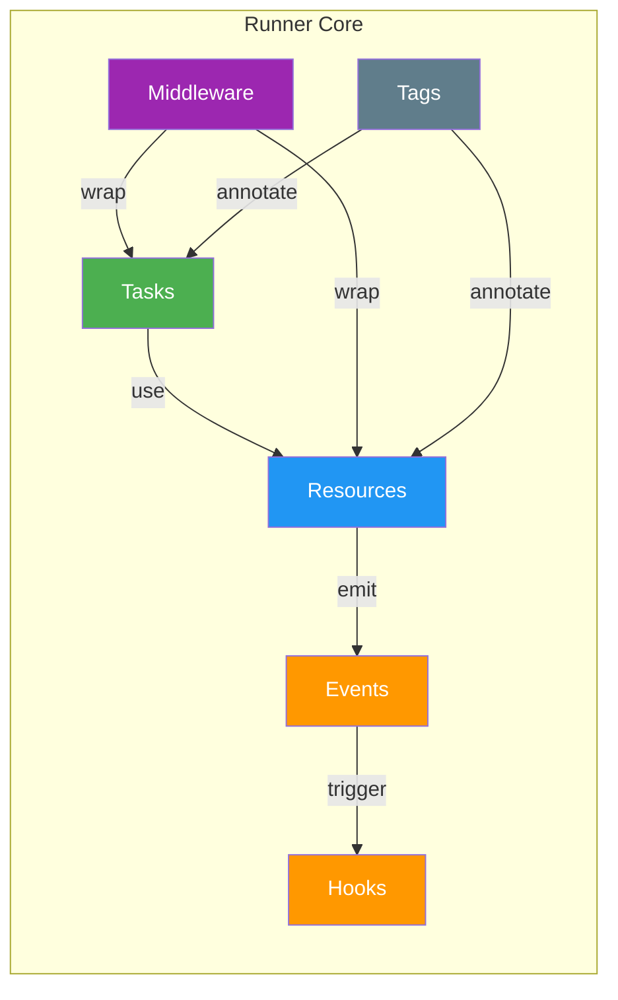

Use the next chapters in this order:

- **Resources**: lifecycle-owned services, config, boundaries, and ownership
- **Tasks**: typed business operations and execution-local context
- **Events & Hooks**: decoupled signaling, reactions, and emission controls
- **Middleware**: reusable policies around tasks and resources
- **Tags**: typed discovery, metadata, and framework behaviors
- **Errors**: reusable typed error helpers and declarative `.throws()` contracts

For specialized features beyond the core concepts:

- **Async Context**: per-request or thread-local state via `r.asyncContext()`
- **Durable Workflows** (Node-only): replay-safe orchestration primitives in [DURABLE_WORKFLOWS.md](./DURABLE_WORKFLOWS.md)
- **Remote Lanes** (Node): distributed events and RPC in [REMOTE_LANES.md](./REMOTE_LANES.md)
- **Serialization**: custom value transport in [SERIALIZER_PROTOCOL.md](./SERIALIZER_PROTOCOL.md)
## Resources

Resources are the long-lived parts of your app: database clients, configuration surfaces, queues, services, caches, and ownership boundaries.
They initialize once, participate in runtime lifecycle phases, and give tasks a stable dependency surface.
They are also the main composition unit in Runner: a resource can own registration, enforce boundaries, expose a value, and define how that part of the system starts and stops.

Most apps begin by building a root resource and passing it to `run(...)`:

```typescript
import { r, run } from "@bluelibs/runner";

const app = r
  .resource("app")
  .register([
    // tasks, events, middleware, child resources
  ])
  .build();

const runtime = await run(app);
```

Once `run(app)` resolves, the returned runtime is your operator-facing handle. The main APIs are:

- `runtime.runTask(...)` to execute tasks
- `runtime.emitEvent(...)` to emit events
- `runtime.getResourceValue(...)` and `runtime.getLazyResourceValue(...)` to read resource values
- `runtime.getResourceConfig(...)` to inspect resolved resource config
- `runtime.getHealth(...)` to evaluate resource health probes
- `runtime.pause()`, `runtime.resume()`, and `runtime.recoverWhen(...)` to control admissions
- `runtime.dispose()` to stop the runtime cleanly
- `runtime.dispose({ force: true })` to skip graceful shutdown orchestration and jump directly to resource `dispose()`

```typescript
import { r } from "@bluelibs/runner";
import { MongoClient } from "mongodb";

type UserData = {
  email: string;
};

const database = r
  .resource("database")
  .init(async () => {
    const client = new MongoClient(process.env.DATABASE_URL as string);
    await client.connect();
    return client;
  })
  .dispose(async (client) => client.close())
  .build();

const userService = r
  .resource("userService")
  .dependencies({ database })
  .init(async (_config, { database }) => ({
    async createUser(userData: UserData) {
      return database.collection("users").insertOne(userData);
    },
    async getUser(id: string) {
      return database.collection("users").findOne({ _id: id });
    },
  }))
  .build();
```

This example assumes the `mongodb` package is installed and `DATABASE_URL` is set.

**What you just learned**: Resources define `init` for creation and `dispose` for cleanup. Dependencies are declared explicitly, and the builder pattern produces a frozen definition.

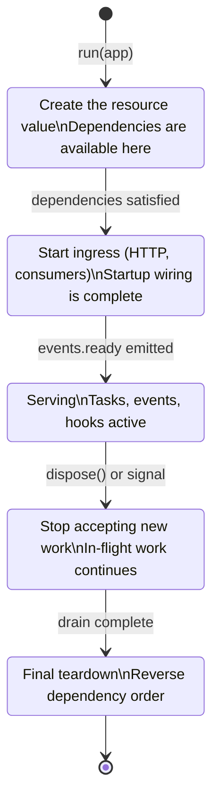

When you want operator-facing health data, keep the probe small and explicit:

```typescript
const database = r
  .resource("database")
  .init(async () => connectDb())
  .health(async (client) => ({
    status: client?.isConnected() ? "healthy" : "unhealthy",
    message: "database connectivity",
  }))
  .build();
```

### Health Reporting

`health()` is opt-in and pull-based. Runner does not call it automatically during every lifecycle phase. It only runs when you ask for a report.

Runner exposes the same health reporter in two places:

- `resources.health` is a built-in global resource exported through the `resources` namespace. Inject it when you want health checks from inside Runner-managed code.
- `runtime.getHealth(...)` is the operator-facing shortcut on the runtime instance.

Use `resources.health` inside resources, hooks, or tasks when you are already in the dependency graph:

```typescript
import { resources, r } from "@bluelibs/runner";

const app = r
  .resource("app")
  .dependencies({ health: resources.health, logger: resources.logger })
  .ready(async (_value, _config, { health, logger }) => {
    const report = await health.getHealth([database]);
    const databaseEntry = report.find(database);

    if (databaseEntry.status === "unhealthy") {
      await logger.error("Database health check failed", {
        resourceId: databaseEntry.id,
        message: databaseEntry.message,
        details: databaseEntry.details,
      });
    }
  })
  .build();
```

Use `runtime.getHealth(...)` from operator-facing code after `run(app)` resolves:

```typescript
import { resources } from "@bluelibs/runner";

const runtime = await run(app);
const logger = runtime.getResourceValue(resources.logger);

const report = await runtime.getHealth();

const databaseStatus = report.find(database).status;

if (databaseStatus !== "healthy") {
  await logger.error("Operator health check detected a problem", {
    totals: report.totals,
    database: report.find(database),
  });
}
```

The report shape is:

```typescript
{
  totals: {
    resources: number;
    healthy: number;
    degraded: number;
    unhealthy: number;
  };
  report: Array<{
    id: string;
    initialized: boolean;
    status: "healthy" | "degraded" | "unhealthy";
    message?: string;
    details?: unknown;
  }>;
  find(resourceOrId): HealthEntry;
}
```

Important behavior:

- resources without `health()` are skipped instead of receiving a synthetic status
- lazy resources that were never initialized stay asleep and are skipped instead of being probed
- filtered calls such as `getHealth([database])` accept resource definitions or ids
- repeated filtered resources are de-duplicated
- unknown requested resources fail fast
- if `health()` throws, Runner converts that into an `unhealthy` entry with the error message in `message` and the normalized error in `details`
- `report.find(...)` throws when the requested resource is not present in the report
- `id` in each report entry is the canonical runtime path for that resource

Timing matters:

- call `runtime.getHealth(...)` only after `run(...)` resolves and before disposal starts
- do not call `resources.health.getHealth(...)` during bootstrap from `init()`; prefer `ready()` or later

Prefer health probes for current operational state, not deep diagnostics. Keep them fast, explicit, and safe to run on demand.

When a health signal indicates temporary pressure or a downstream outage, use runtime admission control instead of tearing the system down:

```typescript
const runtime = await run(app);

runtime.pause("database is unhealthy");

runtime.recoverWhen({
  everyMs: 5_000,
  check: async () => {
    const report = await runtime.getHealth([database]);
    return report.find(database).status !== "unhealthy";
  },
});
```

`runtime.pause()` is not shutdown. It simply stops admitting new runtime-origin and resource-origin task runs and event emissions while already-running work continues. `runtime.recoverWhen({ everyMs, check })` polls your recovery condition and automatically resumes the runtime once the active paused episode is healthy enough to accept work again.

### Lifecycle and Ownership Rules

Resources move through a deliberate sequence of phases. Understanding which phase to use—and which to leave alone—prevents subtle shutdown bugs. All lifecycle methods are async.

- `init(config, deps, context)` creates the resource value
- `ready(value, config, deps, context)` starts ingress after startup lock
- `runtime.getLazyResourceValue(...)` can wake a startup-unused lazy resource only before shutdown starts; once the runtime enters `coolingDown` or later, that wakeup is rejected fail-fast.
- `cooldown(value, config, deps, context)` stops new ingress **quickly**, a way of saying "stop any additional work, but let in-flight work finish".
  Runner fully awaits `cooldown()` before it enters `disposing`, so cooldown-specific admission targets are registered before admissions narrow. Time spent in `cooldown()` still consumes the remaining `dispose.totalBudgetMs` budget for the later bounded waits, but cooldown itself is not cut off early. When `dispose.cooldownWindowMs` is greater than `0`, Runner keeps the broader `coolingDown` admission policy open for that bounded post-cooldown window before it enters `disposing`. At the default `0`, Runner skips that wait. Once `disposing` begins, admissions narrow to in-flight continuations plus resource-origin calls from the cooling resource itself and any additional resource definitions returned from `cooldown()`.
- `dispose(value, config, deps, context)` performs final teardown after task/event drain.
- Config-only resources can omit `.init()` and resolve to `undefined`
- user resources contribute their own ownership segment to canonical ids
- the app resource passed to `run(...)` is a normal resource, so direct registrations compile as `app.tasks.x`, `app.events.x`, `app.middleware.task.x`, and so on
- child resources continue that chain, so nested registrations compile as `app.billing.tasks.x`
- only the internal synthetic framework root is transparent, and it does not appear in user-facing ids
- `runtime-framework-root` is reserved for that internal framework root and cannot be used as a user resource id
- If a resource declares `.register(...)`, it is non-leaf and cannot be forked
- `.context(() => initialContext)` provides private and mutable resource-local state shared across lifecycle methods

Do not use `cooldown()` as a general teardown phase for support resources such as databases. Cooldown is designed for ingress points that need to stop accepting new work quickly while letting in-flight work finish.

### Resource Configuration

Resources can be configured with type-safe options.

- resource definitions expose `.extract(entry)` to read config from a matching `resource.with(...)` entry

```typescript
import { r } from "@bluelibs/runner";

type SMTPConfig = {
  smtpUrl: string;
  from: string;
};

const emailer = r
  .resource<SMTPConfig>("emailer")
  .init(async (config) => ({
    send: async (to: string, subject: string, body: string) => {
      // Use config.smtpUrl and config.from
    },
  }))
  .build();

const app = r
  .resource("app")
  .register([
    emailer.with({
      smtpUrl: "smtp://localhost",
      from: "noreply@myapp.com",
    }),
  ])
  .build();
```

### Dynamic Registration and Dependencies

Both `.register()` and `.dependencies()` accept functions when behavior depends on config or environment.

`.register()` as a function — when the registered set depends on config:

```typescript
import { r } from "@bluelibs/runner";

const auditLog = r
  .resource("auditLog")
  .init(async () => ({ write: (message: string) => console.log(message) }))
  .build();

const feature = r
  .resource<{ enableAudit: boolean }>("feature")
  .register((config) => (config.enableAudit ? [auditLog] : []))
  .init(async () => ({ enabled: true }))
  .build();
```

`.dependencies()` as a function — when dependencies are conditional or config-driven:

```typescript
const advancedService = r
  .resource("advancedService")
  .dependencies((_config, mode) => ({
    database,
    logger,
    conditionalService: mode === "prod" ? serviceA : serviceB,
  }))
  .init(async (_config, { database, logger, conditionalService }) => {
    // Same interface as static dependencies
  })
  .build();
```

Use function-based patterns when:

- registered components or dependencies depend on config
- you want one reusable template with environment-specific wiring
- you need to avoid registering optional components in every environment
- you have conditional dependencies based on the resource's `.with(...)` config

**Performance note**: Function-based dependencies have minimal overhead — they're called once during dependency resolution.

### Dependency Resolution Strategy

Runner resolves dependency trees into ordered initialization waves during `run(app)`.
By default, initialized resources run `init()` sequentially.
Set `lifecycleMode: "parallel"` to execute independent resources concurrently within their dependency-safe wave:

```typescript
const runtime = await run(app, {
  lifecycleMode: "parallel",
  // lazy: true // Only init resources explicitly requested or needed
});
```

This speeds up boot times when multiple resources (like DBs or queues) don't depend on each other.

```mermaid
gantt
    title Parallel Initialization Waves (lifecycleMode: "parallel")
    dateFormat X
    axisFormat %s

    section Wave 1
    Database         :w1a, 0, 3
    Cache            :w1b, 0, 2

    section Wave 2
    UserService (needs DB)  :w2a, 3, 5

    section Wave 3
    App (needs all)         :w3a, 5, 6
```

Independent resources in the same wave initialize concurrently. Each wave waits for the previous wave to complete before starting.

### Circular Type Dependencies (TypeScript)

In the rare scenarios, when your file structure creates mutual imports for example:

- resources 'A' registers task 'T'
- task 'T' depends on resource 'A'
- both 'A' and 'T' are defined in separate files

This is allowed in runtime, but TypeScript's static analysis will complain about circular type dependencies. And it defaults it to `any` and transforming register() and dependencies() to functions does not help because the circular dependency is still there.

The solution is to cast register() from resource 'A' to return `RegisterableItem[]` instead of the inferred tuple type. This breaks the circular type dependency while preserving autocompletion.

```typescript
import { r } from "@bluelibs/runner";
import type { RegisterableItem } from "@bluelibs/runner";

const t = r.resource("A").register((): RegisterableItem[] => {
  return [taskT];
});
```

If you encounter other, more complex circular type dependencies, consider casting the entire resource to `IResource`.

### Resource Forking

Fork a leaf resource when you need the same resource behavior under a new identity.

```typescript
import { r } from "@bluelibs/runner";

const mailerBase = r
  .resource<{ smtp: string }>("mailerBase")
  .init(async (cfg) => ({
    send: (to: string) => console.log(`Sending via ${cfg.smtp} to ${to}`),
  }))
  .build();

export const txMailer = mailerBase.fork("txMailer");
export const marketingMailer = mailerBase.fork("marketingMailer");

const orderService = r
  .task("processOrder")
  .dependencies({ mailer: txMailer })
  .run(async (input, { mailer }) => {
    mailer.send(input.customerEmail);
  })
  .build();
```

Fork rules:

- `.fork()` returns a built `IResource`; do not call `.build()` again
- forks clone identity, not structure
- tags, middleware, and type parameters are inherited
- each fork gets independent runtime state
- non-leaf resources must be composed explicitly

### Resource Exports and Isolation Boundaries

Use `.isolate({ exports: [...] })` to define a public surface for a resource subtree and keep everything else private.
When the boundary depends on resource config, use `.isolate((config) => ({ ... }))`.

```typescript
import { r } from "@bluelibs/runner";

const calculateTax = r
  .task("calculateTax")
  .run(async (amount: number) => amount * 0.1)
  .build();

const createInvoice = r
  .task("createInvoice")
  .dependencies({ calculateTax })
  .run(
    async (amount: number, deps) => amount + (await deps.calculateTax(amount)),
  )
  .build();

const billing = r
  .resource("billing")
  .register([calculateTax, createInvoice])
  .isolate({ exports: [createInvoice] })
  // calculateTax will not be visible/usable to resources outside of billing, but createInvoice will be
  .build();
```

Semantics:

- No `isolate.exports` means everything remains public
- `exports: []` or `exports: "none"` makes the subtree private
- `exports` accepts explicit Runner definition or resource references only
- `.isolate((config) => ({ ... }))` resolves once per configured resource instance
- Visibility checks cover dependencies, hook `.on(...)`, tag attachments, and middleware attachment
- Exporting a child resource makes that child's own exported surface transitively visible
- Validation happens during `run(app)`, not declaration time
- Runtime operator APIs are gated only by the root resource's exported surface

Migration note:

- Legacy resource-level `exports` and fluent `.exports(...)` were removed in 6.x
- Use `isolate: { exports: [...] }` with `defineResource(...)`
- Use `.isolate({ exports: [...] })` with fluent builders

### Wiring Access Policy

Use `.isolate({ deny: [...] })`, `.isolate({ only: [...] })`, and `.isolate({ whitelist: [...] })` when visibility alone is not enough.

```typescript
import { r, scope, subtreeOf } from "@bluelibs/runner";

const internalDb = r
  .resource("internalDb")
  .init(async () => ({}))
  .build();

const internalOnlyTag = r.tag("internalOnly").build();

const billing = r
  .resource("billing")
  .register([internalDb, internalOnlyTag])
  .isolate({
    deny: [internalDb, scope([internalOnlyTag], { tagging: false })],
  })
  .build();

const agentTask = r
  .task("agentTask")
  .run(async () => "agent")
  .build();
const agentResource = r.resource("agent").register([agentTask]).build();

const selective = r
  .resource("selective")
  .isolate({
    only: [subtreeOf(agentResource, { types: ["task"] })],
  })
  .build();
```

Mental model:

- `exports` answers: "what does this subtree expose to the outside?"
- `deny` / `only` / `whitelist` answer: "what may consumers inside this subtree wire to across boundaries?"
- Use a direct definition/resource/tag reference for one concrete item.
- Use `subtreeOf(resource, { types? })` for "everything owned by that resource subtree".
- Use `scope(target, channels?)` when the rule should only affect selected channels.

Selector rules:

- `deny` and `only` are mutually exclusive on the same resource
- `deny` and `only` accept definitions, `subtreeOf(...)`, or `scope(...)`
- `whitelist` uses `{ for: [...], targets: [...], channels? }`, and `for` / `targets` accept the same selector forms as `deny` / `only`
- bare strings are invalid in isolation policies; use string selectors only inside `scope(...)`
- `scope("*")` means "everything"
- `scope("system.*")` means "all registered canonical ids matching that segment wildcard"
- `subtreeOf(resource)` is ownership-based, not string-prefix-based
- `.isolate((config) => ({ ... }))` can switch `deny`, `only`, `whitelist`, and `exports` from resource config

Behavior rules:

- `deny` blocks matching cross-boundary references
- `only` allows only matching cross-boundary references
- `whitelist` adds carve-outs for specific consumer -> target relations on this boundary only
- `whitelist` does not override ancestor isolation rules
- `whitelist` does not make private exports public
- enforcement covers dependencies, listening, tagging, and middleware channels
- parent and child isolation rules compose additively
- unknown targets and selector patterns that resolve to nothing fail fast at bootstrap

### Subtree Policies

Resources also support `.subtree(policy)`, `.subtree([policyA, policyB])`, and `.subtree((config) => policy | policy[])` for subtree-wide middleware and validation.

Keep the two APIs distinct:

- `subtreeOf(resource, { types })` is an isolation selector used inside `.isolate(...)`
- `.subtree({ validate })` is a generic resource policy hook that inspects compiled definitions in that resource subtree
- `.subtree([policyA, policyB])` applies multiple subtree policies in declaration order
- `.subtree((config) => ({ ... }))` and `.subtree((config) => [{ ... }, { ... }])` let subtree policy depend on the owning resource config
- `subtree.validate` can be one function or an array of functions
- typed validator branches are also available on `tasks`, `resources`, `hooks`, `events`, `tags`, `taskMiddleware`, and `resourceMiddleware`
- `subtree.middleware.identityScope` can enforce a required identityScope policy for identity-aware task middleware tagged with `tags.identityScoped`
- if subtree middleware and local middleware resolve to the same middleware id on one target, Runner fails fast

Use the generic validator with exported type guards when you need type-specific checks:

```typescript
import { isResource, isTask, r, run } from "@bluelibs/runner";
import type { SubtreeViolation } from "@bluelibs/runner";

const app = r
  .resource("app")
  .subtree({
    validate: (definition): SubtreeViolation[] => {
      const violations: SubtreeViolation[] = [];
      if (isTask(definition) && !definition.meta?.title) {
        violations.push({
          code: "missing-task-title",
          message: `Task "${definition.id}" must define meta.title`,
        });
      }

      if (isResource(definition) && definition.init == null) {
        violations.push({
          code: "resource-must-init",
          message: `Resource "${definition.id}" must define init()`,
        });
      }

      return violations;
    },
  })
  .build();

await run(app);
```

Use typed branches when you want item-specific validation without runtime guards:

```typescript
const app = r
  .resource<{ strict: boolean }>("app")
  .subtree((config) => ({
    validate: config.strict
      ? (definition) =>
          isTask(definition) && !definition.meta?.title
            ? [
                {
                  code: "missing-task-title",
                  message: `Task "${definition.id}" must define meta.title`,
                },
              ]
            : []
      : [],
    tasks: {
      validate: (task) =>
        task.meta?.title
          ? []
          : [
              {
                code: "missing-task-title",
                message: `Task "${task.id}" must define meta.title`,
              },
            ],
    },
    taskMiddleware: {
      validate: (middleware) =>
        middleware.meta?.title
          ? []
          : [
              {
                code: "missing-task-middleware-title",
                message: `Task middleware "${middleware.id}" must define meta.title`,
              },
            ],
    },
  }))
  .build();
```

Validation rules:

- validators receive compiled definitions, not raw builder state
- generic and typed validators both run when they match the same definition
- use exported guards such as `isTask(...)`, `isResource(...)`, `isEvent(...)`, `isHook(...)`, `isTag(...)`, `isTaskMiddleware(...)`, and `isResourceMiddleware(...)`
- definitions still expose `.id`, but policy checks that need one exact definition should prefer `isSameDefinition(...)` over comparing ids directly
- when a subtree task validator checks whether `task.middleware` contains a specific middleware definition, compare each entry with `isSameDefinition(middlewareEntry, someMiddleware)` instead of `middlewareEntry.id === someMiddleware.id`
- return `SubtreeViolation[]` for expected policy failures
- do not throw for normal validation failures

### Optional Dependencies

Optional dependencies are for components that may not be registered in a given runtime (for example local dev, feature-flagged modules, or partial deployments).
They are not a substitute for retry/circuit-breaker logic when a registered dependency fails at runtime.

```typescript
import { r } from "@bluelibs/runner";

const registerUser = r
  .task("registerUser")
  .dependencies({
    database, // Required - task fails if missing
    analytics: analyticsService.optional(), // Optional - undefined if missing
    email: emailService.optional(), // Optional - graceful degradation
  })
  .run(async (input, { database, analytics, email }) => {
    // Core logic always runs
    const user = await database.create(input);

    // Optional dependencies are undefined if missing
    await analytics?.track("user.registered");
    await email?.sendWelcome(user.email);

    return user;
  })
  .build();
```

`optional()` handles dependency absence (`undefined`) at wiring time.
If a registered dependency throws, handle that with retry/fallback/circuit-breaker patterns.

Optional dependencies work on tasks, resources, events, async contexts, and errors.

| Use Case                  | Example                                            |
| ------------------------- | -------------------------------------------------- |
| **Non-critical services** | Analytics, metrics, feature flags                  |
| **External integrations** | Third-party APIs that may be flaky                 |
| **Development shortcuts** | Skip services not running locally                  |
| **Feature toggles**       | Conditionally enable functionality                 |
| **Gradual rollouts**      | New services that might not be deployed everywhere |

For components that accept config (like resources), you can compute dependencies from `.with(...)` config:

```typescript
const analyticsAdapter = r
  .resource<{ enableAnalytics?: boolean }>("analyticsAdapter")
  .dependencies((config) => ({
    database,
    // Only include analytics when enabled in resource config
    ...(config?.enableAnalytics ? { analytics } : {}),
  }))
  .init(async (_config, deps) => ({
    async record(eventName: string) {
      await deps.analytics?.track(eventName);
    },
  }))
  .build();
```

For tasks, prefer static dependencies (required or `.optional()`) and branch at execution time.

### Private Context

Use resource context when lifecycle methods need shared mutable state.

```typescript
import { r } from "@bluelibs/runner";

// Assuming `connectToDatabase` and `createPool` are your own collaborators.
const dbResource = r
  .resource("dbResource")
  .context(() => ({
    connections: new Map<string, unknown>(),
    pools: [] as Array<{ drain(): Promise<void> }>,
  }))
  .init(async (_config, _deps, resourceContext) => {
    const db = await connectToDatabase();
    resourceContext.connections.set("main", db);
    resourceContext.pools.push(createPool(db));
    return db;
  })
  .dispose(async (_db, _config, _deps, resourceContext) => {
    for (const pool of resourceContext.pools) {
      await pool.drain();
    }
  })
  // same for ready() and cooldown() if needed
  .build();
```

### Overrides

Use `r.override(base, fn)` when you need to replace a component's behavior while keeping the same `id` — common in integration testing or when swapping out a library.

Override direction is downstream-only: declare `.overrides([...])` from the resource that owns the target subtree, or from one of its ancestors. Child resources cannot replace definitions owned by a parent or sibling subtree.

```typescript
import { r } from "@bluelibs/runner";

const productionEmailer = r
  .resource("emailer")
  .init(async () => new SMTPEmailer())
  .build();

const mockEmailer = r.override(
  productionEmailer,
  async () => new MockEmailer(),
);

const app = r
  .resource("app")
  .register([productionEmailer])
  .overrides([mockEmailer])
  .build();
```

Overrides work on tasks, resources, hooks, and middleware:

```typescript
// Task
const overriddenTask = r.override(originalTask, async () => 2);

// Resource
const overriddenResource = r.override(
  originalResource,
  async () => "mock-conn",
);

const overriddenLifecycleResource = r.override(originalResource, {
  context: () => ({ closed: false }),
  init: async () => "mock-conn",
  dispose: async (_value, _config, _deps, context) => {
    context.closed = true;
  },
});

// Middleware
const overriddenMiddleware = r.override(
  originalMiddleware,
  async ({ task, next }) => {
    const result = await next(task?.input);
    return { wrapped: result };
  },
);
```

`r.override(base, fn)` is behavior-only for tasks, hooks, and middleware:

- task/hook/task-middleware/resource-middleware: callback replaces `run`
- resource function shorthand: callback replaces `init`
- resource object form may override any subset of `context`, `init`, `ready`, `cooldown`, `dispose`
- resource object-form overrides inherit unspecified lifecycle hooks from the base resource
- resource object-form overrides may add `ready`, `cooldown`, or `dispose` even if the base resource did not define them
- hook overrides keep the same `.on` target
- override APIs do not change structural boundaries (dependencies, register tree, subtree policies)
- duplicate override targets fail fast outside `test`; in `test`, the outermost declaring resource wins, and same-resource duplicates use the last declaration

Use the resource object form intentionally: overriding `context` changes the private lifecycle-state contract that `init()`, `ready()`, `cooldown()`, and `dispose()` share.

**`r.override(...)` vs `.overrides([...])` — critical distinction**:

| API                    | What it does                                                          | Applies replacement? |
| ---------------------- | --------------------------------------------------------------------- | -------------------- |
| `r.override(base, fn)` | Creates a new definition with replaced behavior                       | No (not by itself)   |
| `.overrides([...])`    | Registers override requests Runner validates and applies at bootstrap | Yes                  |

Think of `r.override(...)` as _"build replacement definition"_ and `.overrides([...])` as _"apply replacement in this app"_.

Direct registration of an override definition is also valid when you control the composition and only register one version for that id:

```typescript
const customMailer = r.override(realMailer, async () => new MockMailer());

const app = r
  .resource("app")
  .register([customMailer]) // works: only one definition registered for that id
  .build();
```

Common pitfalls:

1. **Creating an override but never applying it** — register it directly or add it to `.overrides([...])`.
2. **Registering both base and override in `.register([...])`** — keep base in `register`, put replacement in `.overrides([...])`.
3. **Override target not in the graph** — ensure the base is registered first. For a separate instance, use a different id or `.fork("new-id")`.
4. **Passing raw definitions to `.overrides([...])`** — wrap with `r.override(base, fn)` first.
5. **Overriding the root app in tests** — prefer a wrapper resource:

```typescript
r.resource("test")
  .register([app])
  .overrides([
    /* mocks */
  ])
  .build();
```

If multiple overrides target the same id, Runner rejects the graph with a duplicate-target override error outside `test` mode. In `test` mode, duplicates are allowed so a wrapper harness can replace a deeper mock, and the outermost declaring resource wins. Overriding something not registered still throws, with a remediation hint.
## Tasks

Tasks are Runner's main business operations. They are async functions with explicit dependency injection, validation, middleware support, and typed outputs.

```typescript
import { r, run } from "@bluelibs/runner";

// Assuming: emailService and logger are resources defined elsewhere.
const sendEmail = r
  .task("sendEmail")
  .dependencies({ emailService, logger })
  .run(async (input, { emailService, logger }) => {
    await logger.info(`Sending email to ${input.to}`);
    return emailService.send(input);
  })
  .build();

const app = r
  .resource("app")
  .register([emailService, logger, sendEmail])
  .build();

const { runTask, dispose } = await run(app);
const result = await runTask(sendEmail, {
  to: "user@example.com",
  subject: "Hi",
  body: "Hello!",
});

await dispose();
```

**What you just learned**: Tasks declare dependencies, execute through the runtime, and produce typed results. You can run them via `runTask()` for production or `.run()` for isolated tests.

> **Note:** Fluent `.build()` outputs are deep-frozen definitions. Treat definitions as immutable and use builder chaining, `.with()`, `.fork()`, `intercept()`, or `r.override(...)` for changes.

> **Note:** `dependencies` can be declared as an object or factory function. Factory output is resolved during bootstrap and must return an object map.

### Input and Result Validation

Tasks support schema-based validation for both input and output.
Use `.inputSchema()` (alias `.schema()`) to validate task input before execution, and `.resultSchema()` to validate the resolved return value.

```typescript
import { Match, r } from "@bluelibs/runner";

const createUser = r
  .task("createUser")
  .inputSchema({
    name: Match.NonEmptyString,
    email: Match.Email,
  })
  .resultSchema({ id: Match.NonEmptyString, name: Match.NonEmptyString })
  .run(async (input) => {
    return { id: "user-1", name: input.name };
  })
  .build();
```

Validation runs before/after the task body. Invalid input or output throws immediately.

### Two Ways to Call Tasks

1. `runTask(task, input)` for production and integration flows through the full runtime pipeline
2. `task.run(input, mockDeps)` for isolated unit tests when you only want the task body

```typescript
const testResult = await sendEmail.run(
  { to: "test@example.com", subject: "Test", body: "Testing!" },
  { emailService: mockEmailService, logger: mockLogger },
);
```

Direct `.run(...)` calls skip runtime validation, middleware, lifecycle wiring, execution context propagation, and health-gated admission checks.

### When Something Should Be a Task

Make it a task when:

- it is a core business operation
- it needs dependency injection
- it benefits from middleware such as auth, caching, retry, or timeouts
- multiple parts of the app need to reuse it
- you want runtime observability around it

Keep it as a regular function when:

- it is a simple utility
- it is pure and dependency-free
- performance is critical and framework features add no value
- it is only used in one place

### Task Runtime Context

Task `.run(input, deps, context)` receives:

- `input`: validated task input
- `deps`: resolved dependencies
- `context`: execution-local context

Task context includes:

- `context.journal`: typed state shared with middleware
- `context.source`: `{ kind, id }` of the current task invocation, where `id` is the canonical runtime source id
- `context.signal`: the cooperative `AbortSignal` for the current execution when cancellation is active

```typescript
import { journal, resources, r } from "@bluelibs/runner";

const auditKey = journal.createKey<{ startedAt: number }>("auditKey");

const sendEmail = r
  .task<{ to: string; body: string }>("sendEmail")
  .dependencies({ logger: resources.logger })
  .run(async (input, { logger }, context) => {
    if (context.signal?.aborted) {
      return { delivered: false };
    }
    context.journal.set(auditKey, { startedAt: Date.now() });
    await logger.info(`Sending email to ${input.to}`);
    return { delivered: true };
  })
  .build();
```

### Execution Journal

`ExecutionJournal` is typed state scoped to a single task execution.

- use it when middleware and tasks need shared execution-local state
- `journal.set(key, value)` fails if the key already exists
- pass `{ override: true }` when replacement is intentional
- create custom keys with `journal.createKey<T>(id)`
- use `journal.create()` when you need a manually managed instance

```typescript
import { journal, r } from "@bluelibs/runner";

const traceIdKey = journal.createKey<string>("traceId");

const traceMiddleware = r.middleware
  .task("traceMiddleware")
  .run(async ({ task, next, journal }) => {
    journal.set(traceIdKey, `trace:${task.definition.id}`);
    return next(task.input);
  })
  .build();

const myTask = r
  .task("myTask")
  .middleware([traceMiddleware])
  .run(async (_input, _deps, { journal, source }) => {
    const traceId = journal.get(traceIdKey);
    return { traceId, source };
  })
  .build();
```

API reference:

| Method                              | Description                                                       |
| ----------------------------------- | ----------------------------------------------------------------- |
| `journal.createKey<T>(id)`          | Create a typed key for storing values                             |
| `journal.create()`                  | Create a fresh journal instance for manual forwarding             |
| `journal.set(key, value, options?)` | Store a typed value, throwing unless `override: true` is provided |
| `journal.get(key)`                  | Retrieve a value as `T \| undefined`                              |
| `journal.has(key)`                  | Check if a key exists                                             |

### Cross-Middleware Coordination

The journal is the clean way for middleware layers to coordinate without polluting task input and output contracts.

```typescript
import { journal, r } from "@bluelibs/runner";

export const journalKeys = {
  abortController: journal.createKey<AbortController>(
    "timeout.abortController",
  ),
} as const;

export const timeoutMiddleware = r.middleware
  .task("timeoutMiddleware")
  .run(async ({ task, next, journal }, _deps, config: { ttl: number }) => {
    const controller =
      journal.get(journalKeys.abortController) ?? new AbortController();
    if (!journal.has(journalKeys.abortController)) {
      journal.set(journalKeys.abortController, controller);
    }

    const timer = setTimeout(() => {
      controller.abort(`Timeout after ${config.ttl}ms`);
    }, config.ttl);

    try {
      return await next(task.input);
    } finally {
      clearTimeout(timer);
    }
  })
  .build();
```

Prefer `context.signal` for task code and hook code. It stays `undefined` until a real cancellation source is present. Use journal keys only when middleware layers need to share execution-local control surfaces such as the timeout controller.

### Task Cancellation

Task calls can pass a cooperative signal:

```typescript
const controller = new AbortController();

const promise = runTask(sendEmail, input, {
  signal: controller.signal,
});

controller.abort("User cancelled send");

await promise;
```

Cancellation behavior:

- `signal` is optional
- top-level callers can pass `runTask(task, input, { signal })`
- with execution context enabled, nested task and event dependency calls can inherit the ambient execution signal automatically
- timeout middleware, forwarded task journals, and inbound HTTP/RPC request aborts still feed the same cooperative task signal when cancellation is active
- when no real cancellation source exists, `context.signal` stays `undefined`

For the full propagation model, including `executionContext: { frames: "off", cycleDetection: false }`, see [Execution Context and Signal Propagation](#execution-context-and-signal-propagation).

Export your journal keys when you expect downstream middleware to consume the same execution-local state.

### Manual Journal Management

For advanced orchestration, you can pre-populate and forward a journal explicitly.

```typescript
const customJournal = journal.create();
customJournal.set(traceIdKey, "manual-trace-id");

const orchestratorTask = r
  .task("orchestratorTask")
  .dependencies({ myTask })
  .run(async (input, { myTask }) => {
    return myTask(input, { journal: customJournal });
  })
  .build();
```

### Execution Interception APIs

Use interception when behavior must wrap execution globally or at runtime wiring boundaries.

Available APIs:

- Task catch-all: `taskRunner.intercept((next, input) => Promise<any>, { when? })`
- Local task interception: `deps.someTask.intercept((next, input) => Promise<any>)`

`taskRunner.intercept(...)` is the replacement for old middleware catch-all behavior:

```typescript
import { r, resources } from "@bluelibs/runner";

const telemetryInstaller = r
  .resource("telemetry")
  .dependencies({
    taskRunner: resources.taskRunner,
    logger: resources.logger,
  })
  .init(async (_config, { taskRunner, logger }) => {
    taskRunner.intercept(
      async (next, input) => {
        const startedAt = Date.now();
        try {
          return await next(input);
        } finally {
          await logger.info(
            `Task ${input.task.definition.id} took ${Date.now() - startedAt}ms`,
          );
        }
      },
      {
        when: (taskDefinition) => !taskDefinition.id.startsWith("internal."),
      },
    );
  })
  .build();
```

Key rules:

- Register interceptors during resource `init` before the runtime locks.
- `taskRunner.intercept(...)` runs outermost around the task middleware pipeline.
- `deps.someTask.intercept(...)` runs inside task middleware and only for that task.
- When `when(...)` must target one concrete definition, prefer `isSameDefinition(taskDefinition, someTask)` over comparing public ids directly, including configured wrappers such as `resource.with(...)` and middleware `.with(...)`.

### Task Interceptors

Task interceptors (`task.intercept()`) allow resources to dynamically modify task behavior during initialization without tight coupling.

```typescript
import { r, run } from "@bluelibs/runner";

const calculatorTask = r
  .task("calculator")
  .run(async (input: { value: number }) => {
    return { result: input.value + 1 };
  })
  .build();

const interceptorResource = r
  .resource("interceptor")
  .dependencies({ calculatorTask })
  .init(async (_config, { calculatorTask }) => {
    calculatorTask.intercept(async (next, input) => {
      const result = await next(input);
      return { ...result, intercepted: true };
    });
  })
  .build();
```

You can inspect which resources installed local interceptors through an injected task dependency:

```typescript
const inspector = r
  .resource("inspector")
  .dependencies({ calculatorTask })
  .init(async (_config, { calculatorTask }) => {
    const owners = calculatorTask.getInterceptingResourceIds();
    // eg: ["app.interceptor"]
    return { owners };
  })
  .build();
```

For lifecycle-owned timers inside tasks or resources, depend on `resources.timers`.
`timers.setTimeout()` and `timers.setInterval()` stop accepting new timers once `cooldown()` starts and are cleared during `dispose()`.
## Events and Hooks

Events let different parts of your app communicate without direct references. Hooks subscribe to those events so producers stay decoupled from downstream reactions.

```typescript
import { Match, r } from "@bluelibs/runner";

// Assuming: userService is a resource defined elsewhere.
const userRegistered = r
  .event("userRegistered")
  .payloadSchema({ userId: String, email: Match.Email })
  .build();

const registerUser = r
  .task("registerUser")
  .dependencies({ userService, userRegistered })
  .run(async (input, { userService, userRegistered }) => {
    const user = await userService.createUser(input);
    await userRegistered({ userId: user.id, email: user.email });
    return user;
  })
  .build();

const sendWelcomeEmail = r
  .hook("sendWelcomeEmail")
  .on(userRegistered)
  .run(async (event) => {
    console.log(`Welcome email sent to ${event.data.email}`);
  })
  .build();

// Events, tasks, and hooks must all be registered in a resource to be active.
const app = r
  .resource("app")
  .register([userService, userRegistered, registerUser, sendWelcomeEmail])
  .build();
```

**What you just learned**: Events are typed signals, hooks subscribe to them, and tasks emit events through dependency injection. Producers stay decoupled from hook execution.

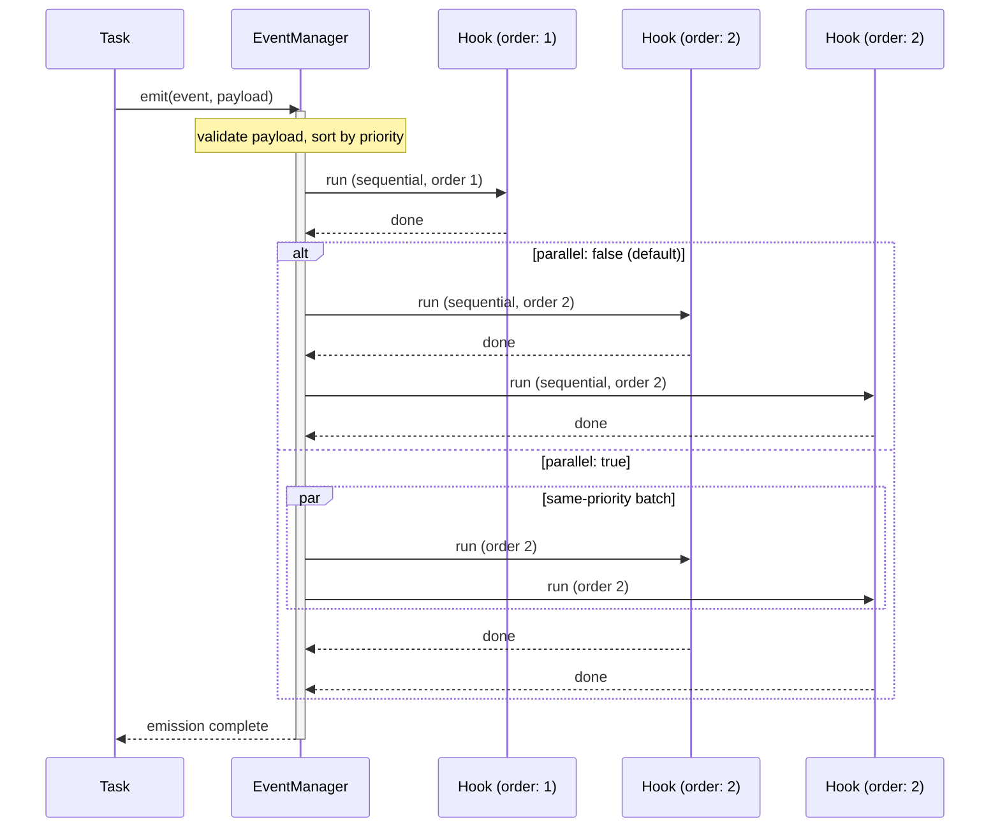

Events follow a few core rules that keep the system predictable:

- events carry typed payloads validated by `.payloadSchema()`
- hooks subscribe with exact events, `onAnyOf(...)`, `subtreeOf(resource)`, predicates, or arrays mixing those selector forms
- `.order(priority)` controls hook priority
- wildcard `.on("*")` listens to all events except those tagged with `tags.excludeFromGlobalHooks`
- `event.stopPropagation()` prevents downstream hooks from running

### Hooks

Hooks are lightweight event subscribers:

- designed for event handling, not task middleware
- can declare dependencies
- do not have task middleware support
- are ideal for side effects, notifications, logging, and synchronization

### Transactional Events

Use transactional events when hooks must be reversible.

```typescript
const orderPlaced = r
  .event("orderPlaced")
  .payloadSchema({ orderId: Match.NonEmptyString })
  .transactional()
  .build();

const reserveInventory = r
  .hook("reserveInventory")
  .on(orderPlaced)
  .run(async (event) => {
    await reserve(event.data.orderId);

    return async () => {
      await release(event.data.orderId);
    };
  })
  .build();
```

Transactional behavior:

- transactional is event-level metadata, not hook-level metadata
- every executed hook must return an async undo closure
- if a hook fails, previously completed hooks are rolled back in reverse order
- rollback continues even if one undo fails; Runner throws an aggregated rollback error
- `transactional + parallel` is invalid
- `transactional + eventLane.applyTo(...)` is invalid

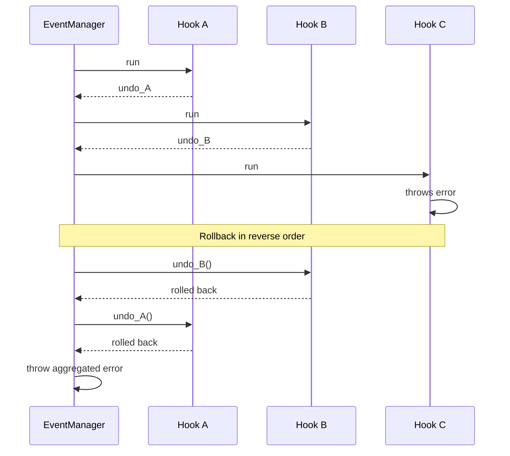

### Parallel Event Execution

By default, hooks run sequentially in priority order.
Use `.parallel(true)` on an event to enable concurrent execution within same-priority batches.

### Emission Reports and Failure Modes

Event emitters accept optional controls:

- `failureMode`: `"fail-fast"` or `"aggregate"`
- `throwOnError`: `true` by default
- `report: true`: returns `IEventEmitReport`

```typescript
const report = await userRegistered(
  { userId: input.userId },
  {
    report: true,
    throwOnError: false,
    failureMode: "aggregate",
  },
);
```

For transactional events, fail-fast rollback semantics are enforced regardless of aggregate options.

### Event Cancellation

Injected event emitters accept a cooperative signal, and hooks receive it as `event.signal` when the emission is cancellation-aware:

```typescript
const controller = new AbortController();

await userCreated({ userId: "u1" }, { signal: controller.signal });
```

Cancellation behavior:

- `signal` is optional
- top-level callers can pass `emit(payload, { signal })`
- with execution context enabled, nested task and event dependency calls can inherit the ambient execution signal automatically
- sequential events stop admitting new hooks once cancelled
- parallel events let the current batch settle, then stop before the next batch
- transactional events roll back already-completed hooks before the cancellation escapes

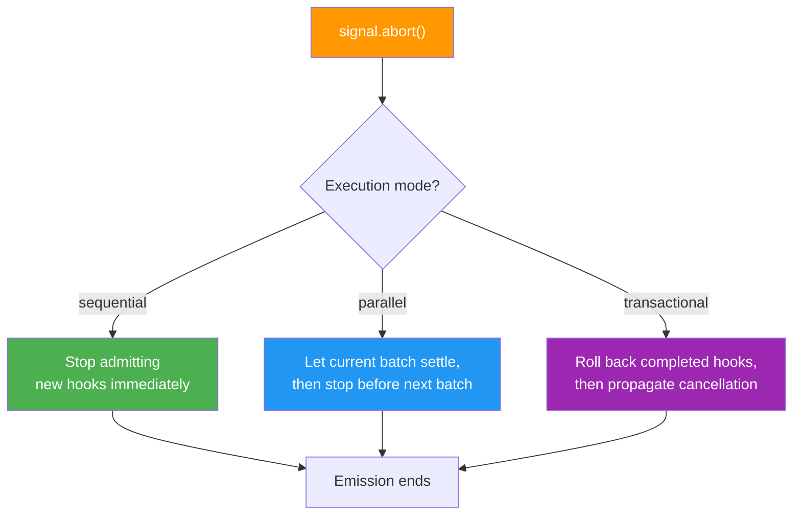

`event.signal` stays `undefined` until a real source is explicitly provided or inherited from the current execution. Internal framework code can call `eventManager.emit(event, payload, { source, signal })` when it needs explicit source control.

For the full propagation model, including lightweight execution context, see [Execution Context and Signal Propagation](#execution-context-and-signal-propagation).

Low-level note:

- `EventManager.emit(...)`, `emitLifecycle(...)`, and `emitWithResult(...)` prefer a merged call-options object: `{ source, signal, report, failureMode, throwOnError }`
- dependency-injected event emitters do not ask for `source` because Runner fills that in for you

### Event-Driven Task Wiring

When a task should announce something happened without owning every downstream side effect, emit an event and let hooks react. Inline Match patterns are usually the clearest option:

```typescript
import { Match, r } from "@bluelibs/runner";

// Assuming `createUserInDb` is your own persistence collaborator.
const userCreated = r
  .event("userCreated")
  .payloadSchema({
    userId: Match.NonEmptyString,
    email: Match.Email,
  })
  .build();

const registerUser = r
  .task("registerUser")
  .dependencies({ userCreated })
  .run(async (input, { userCreated }) => {
    const user = await createUserInDb(input);
    await userCreated({ userId: user.id, email: user.email });
    return user;
  })
  .build();
```

### Wildcard Events and Global Hook Exclusions

Wildcard hooks are useful for broad observability or debugging:

```typescript
const logAllEventsHook = r
  .hook("logAllEvents")
  .on("*")
  .run((event) => {
    console.log("Event detected", event.id, event.data);
  })
  .build();
```

Use `tags.excludeFromGlobalHooks` when an event should stay out of wildcard hooks.

```typescript
import { tags, r } from "@bluelibs/runner";

const internalEvent = r
  .event("internalEvent")
  .tags([tags.excludeFromGlobalHooks])
  .build();
```

`tags.excludeFromGlobalHooks` affects only literal wildcard hooks. Explicit selector-based hooks such as `subtreeOf(...)` and predicates can still match those events when they are otherwise visible.

### Selector-Based Hook Targets

Hooks can subscribe structurally at bootstrap time:

```typescript
import { defineHook, subtreeOf, tags } from "@bluelibs/runner";

const subtreeListener = defineHook({
  id: "subtreeListener",
  on: subtreeOf(featureResource),
  run: async (event) => {
    console.log(event.id);
  },
});

const taggedListener = defineHook({
  id: "taggedListener",
  on: (event) => tags.audit.exists(event),
  run: async (event) => {
    console.log(event.id);
  },
});
```

Selector rules:

- selectors resolve once against registered canonical event definitions during bootstrap
- selector matches are narrowed to events the hook may listen to on the `listening` channel
- exact direct event refs still fail fast when visibility is violated
- arrays may mix exact events, `subtreeOf(...)`, and predicates, but `"*"` must remain standalone
- selector-based hooks lose payload autocomplete because the final matched set is runtime-resolved
- exact event refs and `onAnyOf(...)` keep the usual payload inference

### Listening to Multiple Events

Use `onAnyOf()` for tuple-friendly exact-event inference and `isOneOf()` as a runtime guard.
`isOneOf()` is intended for Runner-provided emissions that retain definition
identity. Plain `{ id }`-shaped objects are not treated as exact event matches.

```typescript
import { Match, isOneOf, onAnyOf, r } from "@bluelibs/runner";

const eUser = r
  .event("userEvent")
  .payloadSchema({ id: String, email: Match.Email })
  .build();
const eAdmin = r
  .event("adminEvent")
  .payloadSchema({
    id: String,
    role: Match.OneOf("admin", "superadmin"),
  })
  .build();

const auditSome = r
  .hook("auditSome")
  .on(onAnyOf(eUser, eAdmin))
  .run(async (ev) => {
    if (isOneOf(ev, [eUser, eAdmin])) {
      ev.data.id;
    }
  })
  .build();
```

### System Events

Runner exposes a minimal system event surface:

- `events.ready`
- `events.disposing`
- `events.drained`

```typescript
const systemReadyHook = r
  .hook("systemReady")
  .on(events.ready)
  .run(async () => {
    console.log("System is ready and operational!");
  })
  .build();
```

### `stopPropagation()`

Use `stopPropagation()` when a higher-priority hook must prevent later hooks from running.

```typescript
// Assuming: criticalAlert is an event defined elsewhere.
const emergencyHook = r
  .hook("onCriticalAlert")
  .on(criticalAlert)
  .order(-100)
  .run(async (event) => {
    if (event.data.severity === "critical") {
      event.stopPropagation();
    }
  })
  .build();
```

### Event Interception APIs

Use `eventManager` to intercept event operations globally during resource initialization:

- Event emission: `eventManager.intercept((next, event) => Promise<void>)` — wraps the entire emit batch.
- Hook execution: `eventManager.interceptHook((next, hook, event) => Promise<any>)` — wraps a single hook's callback.

Always await the `next` function and pass the correct arguments.

```typescript
import { r, resources } from "@bluelibs/runner";

const eventTelemetry = r
  .resource("eventTelemetry")
  .dependencies({
    eventManager: resources.eventManager,
    logger: resources.logger,
  })
  .init(async (_config, { eventManager, logger }) => {
    // Intercept individual hook executions (e.g. for benchmarking)
    eventManager.interceptHook(async (next, hook, event) => {
      const start = Date.now();
      try {
        return await next(hook, event);
      } finally {
        await logger.debug(
          `Hook ${String(hook.id)} handled ${String(event.id)} in ${Date.now() - start}ms`,
        );
      }
    });

    // Intercept the entire event emission cycle
    eventManager.intercept(async (next, event) => {
      await logger.info(`Event emitted: ${String(event.id)}`);
      // Warning: you must pass the exact 'event' object reference to next()
      return await next(event);
    });
  })
  .build();
```
## Middleware

Middleware wraps tasks and resources so cross-cutting behavior stays explicit and reusable instead of leaking into business logic.

```typescript
import { errors, r } from "@bluelibs/runner";

type AuthConfig = { requiredRole: string };

const authMiddleware = r.middleware
  .task("authMiddleware")
  .run(async ({ task, next }, _deps, config: AuthConfig) => {
    return await next(task.input);
  })
  .build();

const adminTask = r
  .task("adminTask")
  .middleware([authMiddleware.with({ requiredRole: "admin" })])
  .run(async () => "Secret admin data")
  .build();

// Tasks (and resources) must be registered in a resource before the runtime can use them.
// Inline middleware definitions do not need to be registered separately.
const app = r.resource("app").register([adminTask]).build();
```

**What you just learned**: Middleware wraps tasks or resources with reusable, configurable behavior. Attach it with `.middleware([...])` and configure with `.with()`.

Key rules that keep the middleware model predictable:

- create task middleware with `r.middleware.task(id)`
- create resource middleware with `r.middleware.resource(id)`
- attach middleware with `.middleware([...])`
- first listed middleware is the outermost wrapper
- task middleware can attach only to tasks or `subtree.tasks.middleware`
- resource middleware can attach only to resources or `subtree.resources.middleware`
- middleware definitions expose `.extract(entry)` to read config from a matching configured middleware attachment

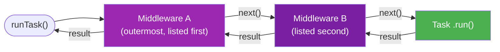

### Task and Resource Middleware

The two middleware channels serve different wrapping targets:

- task middleware wraps task execution and receives `{ task, next, journal }`
- resource middleware wraps resource initialization or resource value resolution and receives `{ resource, next }`
- task middleware is where auth, retry, cache, timeout, tracing, and admission policies usually live
- resource middleware is where retry or timeout around startup/resource creation usually lives

### Cross-Cutting Middleware

Attach middleware at the owning resource when you want subtree-wide behavior.

```typescript
import { resources, r } from "@bluelibs/runner";

const logTaskMiddleware = r.middleware
  .task("logTaskMiddleware")
  .dependencies({ logger: resources.logger })
  .run(async ({ task, next }, { logger }) => {
    await logger.info(`Executing: ${String(task.definition.id)}`);
    const result = await next(task.input);
    await logger.info(`Completed: ${String(task.definition.id)}`);
    return result;
  })
  .build();

const app = r
  .resource("app")
  .register([logTaskMiddleware])
  .subtree({
    tasks: {
      middleware: [logTaskMiddleware],
    },
  })
  .build();
```

Subtree rules:

Subtree validation is return-based. You can import `SubtreeViolation` from Runner, or return the same `{ code, message }` shape inline.

- subtree middleware entries can be conditional with `{ use, when }`
- subtree middleware resolves before local `.middleware([...])`
- if subtree and local middleware resolve to the same middleware id, Runner fails fast instead of letting the local middleware override the subtree one

```typescript
import { isTask, r, run } from "@bluelibs/runner";
import type { SubtreeViolation } from "@bluelibs/runner";

const app = r
  .resource("app")
  .subtree({
    validate: (definition): SubtreeViolation[] => {
      if (!isTask(definition) || definition.meta?.title) {
        return [];
      }

      return [
        {
          code: "missing-meta-title",
          message: `Task "${definition.id}" must define meta.title`,
        },
      ];
    },
  })
  .build();

await run(app);
```

Rules:

- use exported type guards inside `subtree.validate(...)` when the policy only targets tasks, resources, events, hooks, tags, or middleware
- return `SubtreeViolation[]` for expected policy failures
- do not throw for normal validation failures
- invalid validator returns are aggregated into one subtree validation error

### Middleware Type Contracts

Middleware can enforce input and output contracts on the tasks that use it, and middleware tags can also enforce middleware config contracts. This is useful for:

- **Authentication**: ensure all tasks using auth-middleware have `userId` in input
- **API standardization**: enforce consistent response shapes across task groups
- **Validation**: guarantee tasks return required fields

```typescript
import { r } from "@bluelibs/runner";

type AuthConfig = { requiredRole: string };
type AuthInput = { user: { role: string } };
type AuthOutput = { executedBy: { role: string; verified: boolean } };

const authMiddleware = r.middleware
  .task<AuthConfig, AuthInput, AuthOutput>("authMiddleware")
  .run(async ({ task, next }, _deps, config) => {
    const input = task.input;
    if (input.user.role !== config.requiredRole) {
      throw errors.genericError.new({ message: "Insufficient permissions" });
    }

    const output = await next(input);
    return {
      ...output,
      executedBy: {
        ...output.executedBy,
        verified: true,
      },
    };
  })
  .build();
```

If you use multiple contract middleware, their contracts combine.
If you tag middleware with a contract tag whose config includes extra fields, that contract also flows into the middleware's dependency callbacks, `run(...)`, `.with(...)`, `.config`, and `.extract(...)`.

### Built-In Middleware

Runner ships with built-in middleware for common reliability, admission-control, caching, and context-enforcement concerns:

| Middleware      | Config                                     | Notes                                                                                 |
| --------------- | ------------------------------------------ | ------------------------------------------------------------------------------------- |
| cache           | `{ ttl, max, ttlAutopurge, keyBuilder }`   | backed by `resources.cache`; `keyBuilder` may return a string or `{ cacheKey, refs }` |
| concurrency     | `{ limit, key?, semaphore? }`              | limits in-flight executions                                                           |
| circuitBreaker  | `{ failureThreshold, resetTimeout }`       | opens after failures, then fails fast                                                 |
| debounce        | `{ ms, keyBuilder?, maxKeys? }`            | waits for inactivity, then runs once with the latest input for that key               |
| throttle        | `{ ms, keyBuilder?, maxKeys? }`            | runs immediately, then suppresses burst calls until the window ends                   |
| fallback        | `{ fallback }`                             | static value, function, or task fallback                                              |
| identityChecker | `{ tenant?, user?, roles? }`               | blocks task execution unless the active identity satisfies the gate                   |
| rateLimit       | `{ windowMs, max, keyBuilder?, maxKeys? }` | fixed-window admission limit per key, for cases like "50 per second"                  |
| requireContext  | `{ context }`                              | fails fast when a specific async context must exist before task execution             |
| retry           | `{ retries, stopRetryIf, delayStrategy }`  | transient failures with configurable logic                                            |
| timeout         | `{ ttl }`                                  | rejects after the deadline and aborts cooperative work via `AbortSignal`              |

Resource equivalents:

- `middleware.resource.retry`
- `middleware.resource.timeout`

Recommended ordering:

- fallback outermost
- identityChecker near the outside when auth should fail before expensive work
- timeout inside retry when you want per-attempt budgets
- rate-limit for admission control such as "max 50 calls per second"
- concurrency for in-flight control
- cache for idempotent reads

### Caching

Avoid recomputing expensive work by caching task results with TTL-based eviction.
Cache is opt-in: register `resources.cache` so Runner wires the backing store and auto-registers `middleware.task.cache` for cached tasks.

#### Provider Contract

When you provide a custom cache backend, this is the contract:

```typescript
import type { ICacheProvider } from "@bluelibs/runner";

interface CacheProviderInput {
  taskId: string;
  options: {
    ttl?: number;
    max?: number;
    ttlAutopurge?: boolean;
  };
  totalBudgetBytes?: number;
}

type CacheProviderFactory = (
  input: CacheProviderInput,
) => Promise<ICacheProvider>;

interface ICacheProvider {
  get(key: string): unknown | Promise<unknown>;
  set(
    key: string,
    value: unknown,
    metadata?: { refs?: readonly string[] },
  ): unknown | Promise<unknown>;
  clear(): void | Promise<void>;
  invalidateRefs(refs: readonly string[]): number | Promise<number>;
  has?(key: string): boolean | Promise<boolean>;
}
```

Notes:

- `input.options` are merged from `resources.cache.with({ defaultOptions })` and middleware-level cache options.
- `input.taskId` identifies the task-specific cache instance being created.
- `defaultOptions` remain inherited per-task provider options, not a shared global budget.
- `resources.cache.with({ totalBudgetBytes })` is passed to providers as `input.totalBudgetBytes`.
- The built-in in-memory provider supports `totalBudgetBytes` out of the box.
- Node also ships with `resources.redisCacheProvider`, which supports `totalBudgetBytes` with Redis-backed storage.
- Custom providers should enforce their own backend budget policy when `input.totalBudgetBytes` is provided.
- `keyBuilder` is middleware-only and is not passed to the provider.
- When `keyBuilder(...)` returns `{ cacheKey, refs }`, middleware passes those refs to `set(..., metadata)` for provider-side indexing.
- Without `keyBuilder`, cache keys default to `taskId + serialized input` and fail fast when the input cannot be serialized.
- `resources.cache.invalidateRefs(ref | ref[])` fans out across cache-enabled tasks and deletes matching entries.
- `has()` is optional, but recommended when `undefined` can be a valid cached value.

#### Default Usage

```typescript
import { middleware, r, resources } from "@bluelibs/runner";

const expensiveTask = r
  .task("expensiveTask")
  .middleware([
    middleware.task.cache.with({
      // lru-cache options by default
      ttl: 60 * 1000, // Cache for 1 minute
      keyBuilder: (_taskId, input: { userId: string }) =>
        `user:${input.userId}`, // optional when the default serialized-input key is too granular
    }),
  ])
  .run(async (input: { userId: string }) => {
    // This expensive operation will be cached
    return await doExpensiveCalculation(input.userId);
  })
  .build();

// Resource-level cache configuration
const app = r
  .resource("app")
  .register([
    resources.cache.with({
      totalBudgetBytes: 50 * 1024 * 1024, // Shared 50MB budget across built-in task caches
      defaultOptions: {
        max: 1000, // Per-task maximum items in cache
        ttl: 30 * 1000, // Per-task default TTL
      },
    }),
  ])
  .build();
```

#### Ref-Based Invalidation

Use semantic refs when multiple cached tasks should be refreshed after the same write.

```typescript
import { asyncContexts, middleware, r, resources } from "@bluelibs/runner";

const CacheRefs = {
  getTenantId() {
    return asyncContexts.identity.use().tenantId;
  },
  user(id: string) {
    return `tenant:${this.getTenantId()}:user:${id}` as const;
  },
};

const getUser = r
  .task<{ userId: string; includeTeams?: boolean }>("getUser")
  .middleware([
    middleware.task.cache.with({
      ttl: 60_000,
      keyBuilder: (_taskId, input) => ({
        cacheKey: `user:${input.userId}:teams:${input.includeTeams ? "1" : "0"}`,
        refs: [CacheRefs.user(input.userId)],
      }),
    }),
  ])
  .run(async (input) => {
    return await doExpensiveCalculation(input.userId);
  })
  .build();

const updateUser = r
  .task<{ userId: string }>("updateUser")
  .dependencies({ cache: resources.cache })
  .run(async (input, { cache }) => {
    await saveUser(input.userId);
    await cache.invalidateRefs(CacheRefs.user(input.userId)); // or array of refs for multiple invalidations
    return { ok: true };
  })
  .build();
```

Notes:

- `keyBuilder(canonicalTaskId, input)` may return either a plain string or `{ cacheKey, refs? }`.
- Runner stores refs as plain strings. Type safety usually lives in app helpers such as `CacheRefs.user(id)`. (refs are used for cache invalidation)
- Refs do not follow `identityScope` intentionally. If you want tenant-aware invalidation, read the active identity inside your app helper, for example `CacheRefs.getTenantId()`, and build the ref string there so writes and invalidations always match.

`totalBudgetBytes` is distinct from `defaultOptions.maxSize`:

- `totalBudgetBytes`: one shared budget across cache instances for providers that enforce shared budgets, including the built-in in-memory provider and `resources.redisCacheProvider`
- `defaultOptions.maxSize`: the inherited `lru-cache` size limit for each task cache instance

#### Node Redis Cache Provider

Node includes an official Redis-backed cache provider built on top of the optional `ioredis` dependency.

```typescript
import { middleware, r, resources } from "@bluelibs/runner/node";

const cachedTask = r
  .task("cachedTask")
  .middleware([
    middleware.task.cache.with({
      ttl: 60 * 1000,
    }),
  ])
  .run(async () => doExpensiveCalculation())
  .build();

const app = r
  .resource("app")
  .register([
    resources.cache.with({
      provider: resources.redisCacheProvider.with({
        redis: process.env.REDIS_URL,
        prefix: "app:cache",
      }),
      totalBudgetBytes: 50 * 1024 * 1024,
      defaultOptions: {
        ttl: 30 * 1000,
      },
    }),
    cachedTask,
  ])
  .build();
```

Notes:

- `redis` accepts either a Redis connection string or a compatible client instance.
- `prefix` scopes the Redis keys used for entries, LRU ordering, and byte accounting.
- When `prefix` is omitted, Runner generates an isolated per-container namespace.
- Set an explicit `prefix` when you want multiple Node processes to share the same cache namespace and budget.
- Redis-backed cache entries are not cleared by `runtime.dispose()`. Persistence is controlled by Redis TTLs, the chosen `prefix`, and your cache limits.

#### Custom Redis Provider Example

```typescript
import { r, resources } from "@bluelibs/runner";
import Redis from "ioredis";

const redis = r
  .resource<{ url: string }>("redis")
  .init(async ({ url }) => new Redis(url))
  .dispose(async (client) => client.disconnect())
  .build();

class RedisCache {
  constructor(
    private client: Redis,
    private ttlMs?: number,
    private prefix: string = "cache:",
  ) {}

  async get(key: string): Promise<unknown | undefined> {
    const value = await this.client.get(this.prefix + key);
    return value ? JSON.parse(value) : undefined;
  }

  async set(
    key: string,
    value: unknown,
    _metadata?: { refs?: readonly string[] },
  ): Promise<void> {
    const payload = JSON.stringify(value);
    if (this.ttlMs && this.ttlMs > 0) {
      await this.client.setex(
        this.prefix + key,
        Math.ceil(this.ttlMs / 1000),
        payload,
      );
      return;
    }
    await this.client.set(this.prefix + key, payload);
  }

  async invalidateRefs(_refs: readonly string[]): Promise<number> {
    return 0;
  }

  async clear(): Promise<void> {
    const keys = await this.client.keys(this.prefix + "*");
    if (keys.length > 0) {
      await this.client.del(...keys);
    }
  }
}

const redisCacheProvider = r
  .resource("redisCacheProvider")
  .dependencies({ redis })
  .init(async (_config, { redis }) => {
    return async ({ options }) => new RedisCache(redis, options.ttl);
  })
  .build();

const app = r
  .resource("app")
  .register([
    redis.with({ url: process.env.REDIS_URL! }),
    resources.cache.with({ provider: redisCacheProvider }),
  ])
  .build();
```

**Why would you need this?** For monitoring and metrics, you want to know cache hit rates to optimize your application.

**Journal Introspection**: On cache hits the task `run()` is not executed, but you can still detect cache hits from a wrapping middleware:

```typescript
import { middleware, r } from "@bluelibs/runner";

const cacheJournalKeys = middleware.task.cache.journalKeys;

const cacheLogger = r.middleware
  .task("cacheLogger")
  .run(async ({ task, next, journal }) => {
    const result = await next(task.input);
    const wasHit = journal.get(cacheJournalKeys.hit);
    if (wasHit) console.log("Served from cache");
    return result;
  })
  .build();

const myTask = r
  .task("cachedTask")
  .middleware([cacheLogger, middleware.task.cache.with({ ttl: 60000 })])
  .run(async () => "result")
  .build();
```

### Concurrency Control

Limit concurrent executions to protect databases and external APIs. The concurrency middleware keeps only a fixed number of task instances running at once.

```typescript
import { Semaphore, middleware, r } from "@bluelibs/runner";

// Option 1: Simple limit (shared for all tasks using this middleware instance)
const limitMiddleware = middleware.task.concurrency.with({ limit: 5 });

// Option 2: Explicit semaphore for fine-grained coordination
const dbSemaphore = new Semaphore(10);
const dbLimit = middleware.task.concurrency.with({
  semaphore: dbSemaphore,
});

const heavyTask = r
  .task("heavyTask")
  .middleware([limitMiddleware])
  .run(async () => {
    // Max 5 of these will run in parallel
  })
  .build();
```

**Key benefits:**

- **Resource protection**: Prevent connection pool exhaustion.
- **Queueing**: Automatically queues excess requests instead of failing.
- **Timeouts**: Supports waiting timeouts and cancellation via `AbortSignal`.

### Circuit Breaker

Trip repeated failures early. When an external service starts failing, the circuit breaker opens so subsequent calls fail fast until a cool-down passes.

```typescript
import { middleware, r } from "@bluelibs/runner";

const resilientTask = r
  .task("remoteCall")
  .middleware([
    middleware.task.circuitBreaker.with({
      failureThreshold: 5, // Trip after 5 failures
      resetTimeout: 30000, // Stay open for 30 seconds
    }),
  ])
  .run(async () => {
    return await callExternalService();
  })
  .build();
```

**How it works:**

1. **CLOSED**: Everything is normal. Requests flow through.
2. **OPEN**: Threshold reached. All requests throw `CircuitBreakerOpenError` immediately.
3. **HALF_OPEN**: After `resetTimeout`, one trial request is allowed.
4. **RECOVERY**: If the trial succeeds, it goes back to **CLOSED**. Otherwise, it returns to **OPEN**.

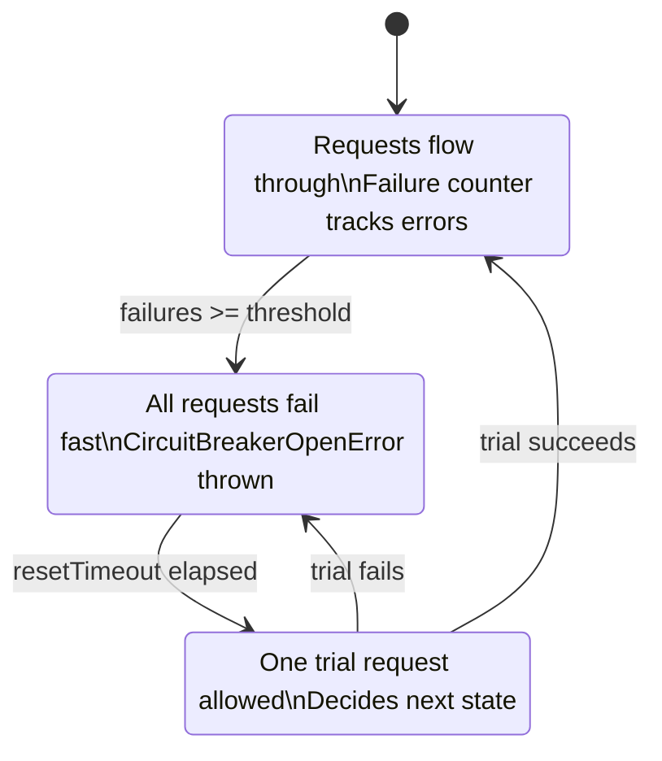

**Why would you need this?** For alerting, you want to know when the circuit opens to alert on-call engineers.

**Journal Introspection**: Access the circuit breaker's state and failure count within your task when it runs:

```typescript
import { middleware, r } from "@bluelibs/runner";

const circuitBreakerJournalKeys = middleware.task.circuitBreaker.journalKeys;

const myTask = r
  .task("monitoredTask")
  .middleware([
    middleware.task.circuitBreaker.with({
      failureThreshold: 5,
      resetTimeout: 30000,
    }),
  ])
  .run(async (_input, _deps, context) => {
    const state = context?.journal.get(circuitBreakerJournalKeys.state);
    const failures = context?.journal.get(circuitBreakerJournalKeys.failures); // number
    console.log(`Circuit state: ${state}, failures: ${failures}`);
    return "result";
  })
  .build();
```

### Temporal Control: Debounce & Throttle

Control the frequency of task execution over time. This is useful for event-driven tasks that might fire in bursts.

By default, Runner buckets `debounce` and `throttle` by `taskId + serialized input`, so different payloads stay isolated unless you intentionally provide a broader `keyBuilder(...)`.

```typescript
import { middleware, r } from "@bluelibs/runner";

// Debounce: Run only after 500ms of inactivity
const saveTask = r
  .task<{ docId: string; content: string }>("saveTask")
  .middleware([
    middleware.task.debounce.with({
      ms: 500,
      keyBuilder: (_taskId, input) => `doc:${input.docId}`,
    }),
  ])
  .run(async (data) => {
    // Assuming db is available in the closure
    return await db.save(data);
  })
  .build();

// Throttle: Run at most once every 1000ms
const logTask = r
  .task<{ channel: string; message: string }>("logTask")
  .middleware([
    middleware.task.throttle.with({
      ms: 1000,
      keyBuilder: (_taskId, input) => `channel:${input.channel}`,
    }),
  ])
  .run(async (msg) => {
    console.log(msg);
  })
  .build();
```

**When to use:**

- **Debounce**: Search-as-you-type, autosave, window resize events.
- **Throttle**: Scroll listeners, telemetry pings, high-frequency webhooks.

### Fallback: The Plan B

Define what happens when a task fails. Fallback middleware lets you return a default value or execute an alternative path gracefully.

```typescript
import { errors, middleware, r } from "@bluelibs/runner";

const getPrice = r
  .task("getPrice")
  .middleware([
    middleware.task.fallback.with({
      // Can be a static value, a function, or another task
      fallback: async (input, error) => {
        console.warn(`Price fetch failed: ${error.message}. Using default.`);
        return 9.99;
      },
    }),
  ])
  .run(async () => {
    return await fetchPriceFromAPI();
  })
  .build();
```

**Why would you need this?** For audit trails, you want to know when fallback values were used instead of real data.

**Journal Introspection**: The original task that throws does not continue execution, but you can detect fallback activation from a wrapping middleware:

```typescript
import { middleware, r } from "@bluelibs/runner";

const fallbackJournalKeys = middleware.task.fallback.journalKeys;

const fallbackLogger = r.middleware
  .task("fallbackLogger")
  .run(async ({ task, next, journal }) => {
    const result = await next(task.input);
    const wasActivated = journal.get(fallbackJournalKeys.active);
    const err = journal.get(fallbackJournalKeys.error);
    if (wasActivated) console.log(`Fallback used after: ${err?.message}`);
    return result;
  })
  .build();

const myTask = r
  .task("taskWithFallback")
  .middleware([
    fallbackLogger,
    middleware.task.fallback.with({ fallback: "default" }),
  ])
  .run(async () => {
    throw errors.genericError.new({ message: "Primary failed" });
  })
  .build();
```

### Rate Limiting

Protect your system from abuse by limiting the number of requests in a specific window of time.

```typescript
import { middleware, r } from "@bluelibs/runner";

const sensitiveTask = r
  .task("loginTask")
  .middleware([
    middleware.task.rateLimit.with({
      windowMs: 60 * 1000, // 1 minute window
      max: 5, // Max 5 attempts per window
      maxKeys: 1_000, // Optional hard cap for distinct live keys
      keyBuilder: (_taskId, input: { email: string }) =>
        input.email.toLowerCase(),
    }),
  ])
  .run(async (credentials) => {
    // Assuming auth service is available
    return await auth.validate(credentials);
  })
  .build();
```

**Key features:**

- **Fixed-window strategy**: Simple, predictable request counting.
- **Isolation**: Limits are tracked per task storage identity by default.
- **Error handling**: Throws the built-in typed Runner rate-limit error.

**Why would you need this?** For monitoring, you want to see remaining quota to implement client-side throttling.

**Journal Introspection**: When the task runs and the request is allowed, you can read the rate-limit state from the execution journal:

```typescript
import { middleware, r } from "@bluelibs/runner";

const rateLimitJournalKeys = middleware.task.rateLimit.journalKeys;

const myTask = r
  .task("rateLimitedTask")
  .middleware([middleware.task.rateLimit.with({ windowMs: 60000, max: 10 })])
  .run(async (_input, _deps, context) => {
    const remaining = context?.journal.get(rateLimitJournalKeys.remaining); // number
    const resetTime = context?.journal.get(rateLimitJournalKeys.resetTime); // timestamp (ms)
    const limit = context?.journal.get(rateLimitJournalKeys.limit); // number
    console.log(
      `${remaining}/${limit} requests remaining, resets at ${new Date(resetTime)}`,
    );
    return "result";
  })
  .build();
```

### Require Context (Async Context Guard)

Fail fast when a task must run inside a specific async context. This middleware is useful for request-scoped metadata such as request ids, tenant ids, and auth claims where continuing without context would produce incorrect behavior.

```typescript
import { r } from "@bluelibs/runner";

const RequestContext = r
  .asyncContext<{ requestId: string }>("requestContext")
  .build();

const getAuditTrail = r
  .task("getAuditTrail")
  // Shortcut: creates middleware.task.requireContext with this context
  .middleware([RequestContext.require()])
  .run(async () => {
    const { requestId } = RequestContext.use();
    return { requestId, entries: [] };
  })
  .build();
```

If you prefer the explicit middleware form, which is useful in documentation and composition helpers:

```typescript
import { middleware, r } from "@bluelibs/runner";

const IdentityContext = r
  .asyncContext<{ tenantId: string }>("tenantContext")
  .build();

const listProjects = r
  .task("listProjects")
  .middleware([
    middleware.task.requireContext.with({ context: IdentityContext }),
  ])
  .run(async () => {
    const { tenantId } = IdentityContext.use();
    return await projectRepo.findByTenant(tenantId);
  })
  .build();
```

**What it protects you from:**

- Running tenant-sensitive logic without tenant context.
- Logging and auditing tasks that silently lose request correlation ids.
- Hidden bugs where context is only present in some call paths.

> **Platform Note:** Async context requires `AsyncLocalStorage`. The Node build supports it directly, and compatible Bun/Deno runtimes can support it through the universal path when that primitive is available. In browsers and runtimes without async-local storage, async context APIs are not available.

**What you just learned**: `requireContext` turns missing async context into an immediate, explicit failure instead of a delayed business-logic bug.

### Retrying Failed Operations

When things go wrong but are likely to work on a subsequent attempt, the built-in retry middleware makes tasks and resources more resilient to transient failures.

```typescript
import { middleware, r } from "@bluelibs/runner";

const flakyApiCall = r
  .task("flakyApiCall")
  .middleware([
    middleware.task.retry.with({
      retries: 5, // Try up to 5 times
      delayStrategy: (attempt) => 100 * Math.pow(2, attempt), // Exponential backoff
      stopRetryIf: (error) => error.message === "Invalid credentials", // Do not retry auth errors
    }),
  ])
  .run(async () => {
    // This might fail due to network issues, rate limiting, etc.
    return await fetchFromUnreliableService();
  })
  .build();

const app = r.resource("app").register([flakyApiCall]).build();
```

The retry middleware can be configured with:

- `retries`: The maximum number of retry attempts (default: 3).
- `delayStrategy`: A function that returns the delay in milliseconds before the next attempt.
- `stopRetryIf`: A function to prevent retries for certain types of errors.

It also works on resources, which is especially useful for startup initialization:

```typescript
import { middleware, r } from "@bluelibs/runner";

const database = r
  .resource<{ connectionString: string }>("database")
  .middleware([
    middleware.resource.retry.with({
      retries: 4,
      delayStrategy: (attempt) => 250 * Math.pow(2, attempt),
    }),
  ])
  .init(async ({ connectionString }) => {
    return await connectToDatabase(connectionString);
  })
  .dispose(async (value) => {
    await value.close();
  })
  .build();
```

**Why would you need this?** For logging, you want to log which attempt succeeded or what errors occurred during retries.

**Journal Introspection**: Access the current retry attempt and the last error within your task:

```typescript
import { middleware, r } from "@bluelibs/runner";

const retryJournalKeys = middleware.task.retry.journalKeys;

const myTask = r
  .task("retryableTask")
  .middleware([middleware.task.retry.with({ retries: 5 })])
  .run(async (_input, _deps, context) => {
    const attempt = context?.journal.get(retryJournalKeys.attempt); // 0-indexed attempt number
    const lastError = context?.journal.get(retryJournalKeys.lastError); // Error from previous attempt, if any
    if ((attempt ?? 0) > 0)
      console.log(`Retry attempt ${attempt} after: ${lastError?.message}`);
    return "result";
  })
  .build();
```

### Timeouts

The built-in timeout middleware prevents operations from hanging indefinitely by racing them against a configurable timeout. It works for both tasks and resources.

```typescript
import { middleware, r } from "@bluelibs/runner";

const apiTask = r
  .task("externalApiTask")
  .middleware([
    // Works for tasks and resources via middleware.resource.timeout
    middleware.task.timeout.with({ ttl: 5000 }), // 5 second timeout
  ])
  .run(async () => {
    // This operation will be aborted if it takes longer than 5 seconds
    return await fetch("https://slow-api.example.com/data");
  })
  .build();

// Combine with retry for robust error handling
const resilientTask = r
  .task("resilientTask")
  .middleware([
    // Order matters here. Imagine a big onion.
    // Works for resources as well via middleware.resource.retry
    middleware.task.retry.with({
      retries: 3,
      delayStrategy: (attempt) => 1000 * attempt, // 1s, 2s, 3s delays
    }),
    middleware.task.timeout.with({ ttl: 10000 }), // 10 second timeout per attempt
  ])
  .run(async () => {
    // Each retry attempt gets its own 10-second timeout
    return await unreliableOperation();
  })
  .build();
```

How it works:

- Uses `AbortController` and `Promise.race()` for clean cancellation.
- Throws `TimeoutError` when the timeout is reached.
- Works with any async operation in tasks and resources.
- Integrates seamlessly with retry middleware for layered resilience.
- Zero timeout (`ttl: 0`) throws immediately for testing edge cases.

Best practices:

- Set timeouts based on expected operation duration plus buffer.
- Combine with retry middleware for transient failures.
- Use longer timeouts for resource initialization than task execution.
- Consider network conditions when setting API call timeouts.

Resource timeouts help prevent startup hangs when a dependency never becomes ready:

```typescript
import { middleware, r } from "@bluelibs/runner";

const messageBroker = r
  .resource("broker")
  .middleware([
    middleware.resource.timeout.with({ ttl: 15000 }),
    middleware.resource.retry.with({ retries: 2 }),
  ])
  .init(async () => {
    return await connectBroker();
  })
  .dispose(async (value) => {
    await value.close();
  })
  .build();
```

### Policy Examples Worth Keeping

Use timeout and retry when the dangerous failure mode is a task that hangs or a collaborator that fails transiently:

```typescript
import { middleware, r } from "@bluelibs/runner";

// Assuming `unreliableOperation` is your own collaborator.
const robustTask = r
  .task("robustTask")
  .middleware([
    middleware.task.retry.with({ retries: 3 }),
    middleware.task.timeout.with({ ttl: 10_000 }),
  ])
  .run(async () => await unreliableOperation())
  .build();
```

Use cache when the same deterministic request repeats often enough to justify memoization:

```typescript
import { middleware, r } from "@bluelibs/runner";

// Assuming `db` is a resource defined elsewhere.
const getUser = r
  .task<{ id: string }>("getUser")
  .dependencies({ db })
  .middleware([
    middleware.task.cache.with({
      ttl: 60_000,
      keyBuilder: (_taskId, input) => ({
        cacheKey: `user:${input.id}`,
        refs: [`user:${input.id}`],
      }),
    }),
  ])
  .run(async (input, { db }) => {
    return await db.users.findOne({ id: input.id });
  })
  .build();
```

> **Note:** `throttle` and `debounce` shape bursty traffic, but they do not express quotas like "50 calls per second". Use `rateLimit` for that kind of policy.

> **Note:** `cache`, `debounce`, and `throttle` default to partitioning by `canonicalTaskId + ":" + serialized input`, and they fail fast when the input cannot be serialized. `rateLimit` defaults to `canonicalTaskId` so quotas stay meaningful even when inputs vary. Provide `keyBuilder(canonicalTaskId, input)` when you want broader grouping such as per-user, per-tenant, or per-IP behavior, or when your input includes non-serializable values for the middlewares that serialize by default. The `canonicalTaskId` passed to the builder is the full runtime task id, so sibling resources with the same local task id do not share middleware state by accident. Use `identityScope: { tenant: false }` when the key should stay global even if identity context exists, then read your identity async context directly inside `keyBuilder` only if your app-specific grouping still needs it.

> **Note:** When identity-aware middleware runs with tenant partitioning enabled, Runner prefixes the final internal key as `<tenantId>:<baseKey>`. For example, a `keyBuilder` result of `search:ada` becomes `acme:search:ada`. Use `identityScope: { tenant: true }` for strict tenant partitioning, add `user: true` for `<tenantId>:<userId>:<baseKey>`, and set `required: false` when identity should only refine the key when available. Omit `identityScope` to use the default tenant-aware keyspace whenever identity context exists, or set `identityScope: { tenant: false }` to keep one shared keyspace across all identities. If your app has users but no tenant model, provide a constant tenant such as `tenantId: "app"` at ingress and then use tenant+user scoping normally. Cache refs stay raw and are invalidated exactly as returned by `keyBuilder`.

### Resilience Orchestration

In production, one resilience strategy is rarely enough. Runner allows you to compose multiple middleware layers into a "resilience onion" that protects your business logic from multiple failure modes.

A task that calls a remote API might fail due to network blips (needs **Retry**), hang indefinitely (needs **Timeout**), slam the API during traffic spikes (needs **Rate Limit**), or keep failing if the API is down (needs **Circuit Breaker**).

Combine them in the correct order. Like an onion, the outer layers handle broader concerns, while inner layers handle specific execution details.

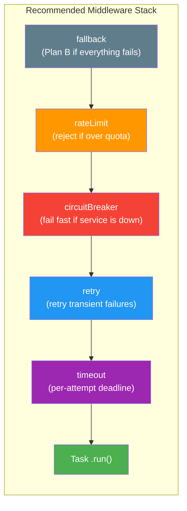

```typescript
import { r } from "@bluelibs/runner";

const resilientTask = r
  .task("ultimateResilience")
  .middleware([
    // Outer layer: Fallback (the absolute Plan B if everything below fails)
    middleware.task.fallback.with({
      fallback: { status: "offline-mode", data: [] },
    }),

    // Next: Rate Limit (check this before wasting resources or retry budget)
    middleware.task.rateLimit.with({ windowMs: 60000, max: 100 }),

    // Next: Circuit Breaker (stop immediately if the service is known to be down)
    middleware.task.circuitBreaker.with({ failureThreshold: 5 }),

    // Next: Retry (wrap the attempt in a retry loop)
    middleware.task.retry.with({ retries: 3 }),

    // Inner layer: Timeout (enforce limit on EACH individual attempt)
    middleware.task.timeout.with({ ttl: 5000 }),
  ])
  .run(async () => {
    return await fetchDataFromUnreliableSource();
  })
  .build();
```

Best practices for orchestration:

1. **Rate Limit first**: Don't even try to execute or retry if you've exceeded your quota.
2. **Circuit Breaker second**: Don't retry against a service that is known to be failing.
3. **Retry wraps Timeout**: Ensure the timeout applies to the _individual_ attempt, so the retry logic can kick in when one attempt hangs.
4. **Fallback last**: The fallback should be the very last thing that happens if the entire resilience stack fails.

### Middleware Interception

Use interception when behavior must wrap the middleware composition layer globally or target a single middleware across all its uses.

Available APIs:

- Task middleware layer: `middlewareManager.intercept("task", (next, input) => Promise<any>)`
- Resource middleware layer: `middlewareManager.intercept("resource", (next, input) => Promise<any>)`
- Per-middleware: `middlewareManager.interceptMiddleware(middleware, interceptor)`

Register interceptors during resource `init` before the runtime locks.

`middlewareManager.intercept(...)` wraps every middleware execution on the targeted channel:

```typescript
import { r, resources } from "@bluelibs/runner";

const observabilityInstaller = r
  .resource("observability")
  .dependencies({
    middlewareManager: resources.middlewareManager,
    logger: resources.logger,
  })
  .init(async (_config, { middlewareManager, logger }) => {
    middlewareManager.intercept("task", async (next, input) => {
      await logger.info(
        `Middleware entering: ${String(input.task.definition.id)}`,
      );
      const result = await next(input);
      await logger.info(
        `Middleware exiting: ${String(input.task.definition.id)}`,
      );
      return result;
    });
  })
  .build();
```

`interceptMiddleware` targets a single middleware wherever it is applied:

```typescript
middlewareManager.interceptMiddleware(authMiddleware, async (next, input) => {
  // runs every time authMiddleware executes, regardless of which task uses it
  return next(input);
});
```

For context enforcement, use `middleware.task.requireContext.with({ context })` to assert that a specific `IAsyncContext` is present before a task runs. If the context is missing, the task fails immediately with `middlewareContextRequiredError`.
## Tags

Tags are Runner's typed discovery system. They attach metadata to definitions, influence framework behavior, and can be consumed as dependencies to discover matching definitions at runtime.

```typescript
import { Match, r } from "@bluelibs/runner";

const httpRoute = r
  .tag("httpRoute")
  .for(["tasks"])
  .configSchema(
    Match.compile({
      method: Match.OneOf("GET", "POST"),
      path: Match.NonEmptyString,
    }),
  )
  .build();

const getHealth = r
  .task("getHealth")
  .tags([httpRoute.with({ method: "GET", path: "/health" })])
  .run(async () => ({ ok: true }))
  .build();

// Tags and definitions using them must be registered in a resource.
const app = r.resource("app").register([httpRoute, getHealth]).build();
```

**What you just learned**: Tags attach typed, schema-validated metadata to definitions. They turn runtime discovery from guesswork into a typed query.

- auto-discovery such as HTTP route registration
- scheduling and startup registration
- cache warmers or policy grouping
- access-control or monitoring metadata
- framework behaviors such as global hook exclusion or health gating

### Scoped Tags

Use `.for(...)` to restrict where a tag can be attached.

- `.for("tasks")` for a single target
- `.for(["tasks", "resources"])` for multiple targets

Accepted targets:

- `"tasks"`
- `"resources"`
- `"events"`
- `"hooks"`
- `"taskMiddlewares"`
- `"resourceMiddlewares"`
- `"errors"`

### Tag Composition Behavior

Repeated `.tags()` calls append by default. Use `{ override: true }` to replace the existing list.

```typescript
import { r } from "@bluelibs/runner";

const apiTag = r.tag("apiTag").build();
const cacheableTag = r.tag("cacheableTag").build();
const internalTag = r.tag("internalTag").build();

const taskWithTags = r
  .task("taskWithTags")
  .tags([apiTag])
  .tags([cacheableTag])
  .tags([internalTag], { override: true })
  .run(async () => "ok")
  .build();
```

### Discovering Components by Tags

Depending on a tag injects a typed accessor over matching definitions.

```typescript
import { events, r } from "@bluelibs/runner";

// Assuming: expressServer is a resource exposing an Express-like { app } instance.
const routeRegistration = r
  .hook("routeRegistration")
  .on(events.ready)
  .dependencies({
    server: expressServer,
    httpRoute,
  })
  .run(async (_event, { server, httpRoute }) => {
    httpRoute.tasks.forEach((entry) => {
      const config = entry.config;
      if (!config) {
        return;
      }

      server.app[config.method.toLowerCase()](config.path, async (req, res) => {
        const result = await entry.run({ ...req.params, ...req.body });
        res.json(result);
      });
    });
  })
  .build();
```

Accessor categories:

- `tasks`
- `resources`
- `events`
- `hooks`
- `taskMiddlewares`
- `resourceMiddlewares`
- `errors`

### Runtime Helpers on Tag Matches

Tag matches are not just metadata snapshots.

- `tasks[]` entries expose `definition`, `config`, and runtime `run(...)`
- `tasks[].intercept(...)` is available in resource dependency context
- `resources[]` entries expose `definition`, `config`, and runtime `value`

Use `tag.startup()` when startup ordering matters: wrapping a tag with `.startup()` in `dependencies` ensures the tag accessor is ready during bootstrap before the resource dependency graph runs, rather than resolving during normal dependency resolution.

### When to Use Tags

Use tags when you want discovery or policy over a changing set of definitions:

- route registration
- startup auto-registration
- policy groups such as health gating or internal-only components
- framework extensions that should discover tasks/resources without direct references

Prefer direct dependencies when one component already knows the exact collaborator it needs.

### Tag Extraction and Processing

Tags can also be queried directly against definitions.

```typescript
import { r } from "@bluelibs/runner";

const performanceTag = r.tag<{ warnAboveMs: number }>("performanceTag").build();

const performanceMiddleware = r.middleware
  .task("performanceMiddleware")
  .run(async ({ task, next }) => {
    if (!performanceTag.exists(task.definition)) {
      return next(task.input);
    }

    const config = performanceTag.extract(task.definition)!;
    const startTime = Date.now();
    const result = await next(task.input);
    const duration = Date.now() - startTime;

    if (duration > config.warnAboveMs) {
      console.warn(`Task ${task.definition.id} took ${duration}ms`);
    }

    return result;
  })
  .build();
```

### Built-in Tags

Built-in tags can affect framework behavior.

```typescript
import { tags, r } from "@bluelibs/runner";

// Assuming `performCleanup` is your own application function.
const observedTask = r
  .task("observedTask")
  .tags([tags.debug.with("verbose")])
  .run(async () => performCleanup())
  .build();

const internalEvent = r
  .event("internalEvent")
  .tags([tags.excludeFromGlobalHooks])
  .build();
```

Tasks can also opt into runtime health gating with `tags.failWhenUnhealthy.with([db, cache])`.

### Contract Tags

Contract tags enforce input/output typing on any task or resource using them at compile time, without changing runtime behavior.

A tag can declare:

- **Input Contract**: any task using it must accept at least the specified input properties
- **Output Contract**: any task using it must return at least the specified output properties

```typescript
import { r } from "@bluelibs/runner";

// r.tag<Config, InputContract, OutputContract>
const authorizedTag = r
  .tag<void, { userId: string }, void>("authorizedTag")
  .build();

// Works: task input is a superset of the contract
const validTask = r
  .task("dashboard")
  .tags([authorizedTag])
  .run(async (input: { userId: string; view: "full" | "mini" }) => {
    return { data: "..." };
  })
  .build();

// Compile error: task input is missing userId
const invalidTask = r
  .task("publicDashboard")
  .tags([authorizedTag])
  // @ts-expect-error - input doesn't satisfy contract { userId: string }
  .run(async (input: { view: "full" }) => {
    return { data: "..." };
  })
  .build();
```

Output contracts work the same way:

```typescript
const searchableTag = r
  .tag<void, void, { id: string; title: string }>("searchableTag")
  .build();

const productTask = r
  .task("getProduct")
  .tags([searchableTag])
  .run(async (id: string) => ({
    id,
    title: "Super Gadget",
    price: 99.99, // extra fields are fine
  }))
  .build();
```

For **Resources**, contracts map to the resource shape:

- **Input Contract** → enforced on the **resource configuration** (passed to `.with()` and `init`)
- **Output Contract** → enforced on the **resource value** (returned from `init`)

```typescript
const databaseTag = r
  .tag<
    void,
    { connectionString: string },
    { connect(): Promise<void> }
  >("databaseTag")
  .build();

const validDb = r
  .resource("database")
  .tags([databaseTag])
  .init(async (config) => ({
    async connect() {
      /* ... */
    },
  }))
  .build();
```

If you use `.inputSchema` or `.resultSchema`, their shapes must be supersets of any contract tag contracts.

Fail-fast rule: if a tagged item depends on the same tag, Runner throws during store sanity checks.
## Errors

Typed Runner errors are declared once and can be used in two ways:

- recommended app/runtime usage: register them, inject them through dependencies, and prefer `throw errorHelper.new({ ... })`
- local/helper usage: call `.new()`, `.throw()`, or `.is()` directly on the built helper even outside `run(...)`

Registering an error makes it part of the Runner definition graph, so it can be injected, discovered, and referenced declaratively via `.throws(...)`. The helper itself does not require a running runtime for local construction or `.is()` checks.

The injected value is the error helper itself, exposing:

- `.new()`
- `.throw()`
- `.is()`
- `id`
- optional `httpCode`

```typescript
import { r } from "@bluelibs/runner";

const userNotFoundError = r
  .error<{ code: number; message: string }>("userNotFound")
  .httpCode(404)
  .format((d) => `[${d.code}] ${d.message}`)
  .remediation("Verify the user ID exists before calling getUser.")
  .build();

const getUser = r
  .task("getUser")
  .dependencies({ userNotFoundError })
  .run(async (input, { userNotFoundError }) => {
    throw userNotFoundError.new({
      code: 404,
      message: `User ${input} not found`,
    });
  })
  .build();
```

**What you just learned**: Runner errors are declared once as typed helpers, injected via dependencies, and consumed with `.new()`, `.throw()`, or `.is()`. In app code, prefer `throw helper.new(...)`; it keeps the `throw` explicit, tends to preserve sharper TypeScript inference at the throw site, and avoids adding the helper method itself to the stack. They carry structured data, optional HTTP codes, and remediation advice.

The thrown error uses the helper id as its `name`.
By default `message` is `JSON.stringify(data)`, but `.format(...)` lets you produce a human-friendly message.
When `.remediation()` is provided, the advice is appended to `message` and `toString()`, and is also exposed as `error.remediation`.

### Error Helper APIs

```typescript
try {
  userNotFoundError.throw({ code: 404, message: "User not found" });
} catch (err) {
  if (userNotFoundError.is(err, { code: 404 })) {
    console.log(`Caught error: ${err.name} - ${err.message}`);
  }
}

const error = userNotFoundError.new({
  code: 404,
  message: "User not found",
});

throw error;
```

Notes:

- `errorHelper.is(err, partialData?)` is lineage-aware and works on errors created locally with the same helper, even outside `run(...)`
- `partialData` uses shallow strict matching
- `errorHelper.new(data)` returns the typed `RunnerError` without throwing
- prefer `throw errorHelper.new(data)` in snippets and application code
- `errorHelper.throw(data)` remains a valid shorthand when you want helper-managed throwing in one call
- `.new()` / `.throw()` / `.is()` do not require the helper to be registered
- registration is required when you want DI, store visibility, tag/discovery participation, or `.throws(...)` contracts to refer to that definition inside the app graph
- `errors.genericError` is the built-in fallback for ad-hoc message-only errors; prefer domain-specific helpers when the contract is stable

### Dynamic Remediation

Remediation can also be a function when advice depends on error data.

```typescript
const quotaExceeded = r
  .error<{ limit: number; message: string }>("quotaExceeded")
  .format((d) => d.message)
  .remediation(
    (d) => `Current limit is ${d.limit}. Upgrade your plan or reduce usage.`,
  )
  .build();
```

### Detecting Any Runner Error

Use `r.error.is(error, partialData?)` when you want to check whether something is any Runner error, not just one specific helper instance.

```typescript
import { r } from "@bluelibs/runner";

// Assuming: riskyOperation is your own application function.
try {
  await riskyOperation();
} catch (err) {
  if (r.error.is(err, { code: 404 })) {
    console.error(`Runner error: ${err.id} (${err.httpCode || "N/A"})`);
  } else {
    console.error("Unexpected error:", err);
  }
}
```

### Declaring Error Contracts with `.throws()`

Use `.throws()` to declare the error ids a definition may produce.
This is declarative metadata for documentation and tooling, not runtime enforcement.

`.throws()` is available on task, resource, hook, and middleware builders.

```typescript
import { r } from "@bluelibs/runner";

const unauthorized = r.error<{ reason: string }>("unauthorized").build();

const userNotFound = r.error<{ userId: string }>("userNotFound").build();

const getUser = r
  .task("getUser")
  .throws([unauthorized, userNotFound])
  .run(async () => ({ ok: true }))
  .build();

console.log(getUser.throws);
```

The `throws` list accepts Runner error helpers only, and is normalized and deduplicated at definition time.

Recommended practice:

- inject registered error helpers inside tasks/resources/hooks/middleware that are part of the Runner graph
- prefer `throw helper.new({ ... })` in runtime code and snippets; reserve `.throw({ ... })` as shorthand, not the default recommendation
- use standalone local helpers for isolated utility code, tests, or pre-runtime construction when DI is not needed
- do not assume `.throws(...)` alone makes an error injectable; injection still depends on registration

For dependency cycle detection, use the canonical helper name `circularDependencyError`.
## run() and RunOptions

The `run()` function is your application's entry point. It initializes all resources, wires up dependencies, and returns handles for interacting with your system.

### Basic Usage

```typescript
import { r, run } from "@bluelibs/runner";

const ping = r
  .task("ping")
  .run(async () => "pong")
  .build();

const app = r
  .resource("app")
  .register([ping])
  .init(async () => "ready")
  .build();

const result = await run(app);
console.log(result.value); // "ready"
await result.dispose();
```

### What `run()` Returns

An object with the following properties and methods:

| Property                    | Description |
| --------------------------- | ----------- |
| `value`                     | Value returned by the root resource `init()`. |
| `runOptions`                | Normalized effective `run(...)` options for this runtime. |
| `runTask(...)`              | Run a task by definition or string id. |
| `emitEvent(...)`            | Emit an event with optional failure/report controls. |
| `getResourceValue(...)`     | Read an already initialized resource value. |
| `getLazyResourceValue(...)` | Initialize and read a resource on demand in lazy mode. |
| `getResourceConfig(...)`    | Read a resource's resolved config. |
| `getHealth(resourceDefs?)`  | Evaluate health probes for visible health-enabled resources. |
| `state`                     | Current admission state: `"running"` or `"paused"`. |
| `pause(reason?)`            | Stop new runtime/resource-origin admissions while in-flight work continues. |
| `resume()`                  | Reopen admissions immediately. |
| `recoverWhen(...)`          | Register paused-state recovery conditions. |
| `root`                      | Root resource definition for this runtime. |
| `logger`                    | Logger instance for the runtime. |
| `store`                     | Runtime store with registered definitions and internals. |
| `dispose()`                 | Start graceful shutdown and await full disposal. |
| `dispose({ force: true })`  | Skip graceful shutdown orchestration and jump straight to resource disposal. |

Note: `dispose()` is blocked while `run()` is still bootstrapping and becomes available once initialization completes. `force: true` is manual-only; signal-based shutdown stays graceful.

This object is your main interface to interact with the running application. It can also be declared as a dependency via `resources.runtime`.

Mode access:

- `runtime.mode` is the resolved effective mode for this container.
- Inside resources, prefer `resources.mode` when you only need the mode and not the full runtime capability surface.

Important bootstrap note: when `runtime` is declared as a dependency inside a resource `init()`, startup may still be in progress. You are guaranteed your current resource dependencies are ready, but not that all registered resources in the app are already initialized.

`runtime.getHealth(...)` and `resources.health.getHealth(...)` are available only after `run(...)` finishes bootstrapping and before disposal starts. They only evaluate resources that define `health()`. Resources without `health()` are skipped, and startup-unused lazy resources stay asleep instead of being probed.

For lifecycle-owned polling and delayed work inside resources, depend on `resources.timers`. It is available during `init()`, stops accepting new timers when its `cooldown()` starts, and clears pending timers during `dispose()`.

`runtime.pause()` is not a shutdown. It is a synchronous idempotent admission switch: new runtime/resource-origin task runs and event emissions are rejected immediately, while already-running tasks, hooks, and middleware can continue and finish. `runtime.resume()` reopens admissions immediately. When you want automatic recovery, register one or more `runtime.recoverWhen({ everyMs, check })` conditions while paused; Runner resumes only after every active condition for that pause episode is satisfied.

### Ready-Phase Startup Orchestration

Use `events.ready` for components that should start only after bootstrap is fully complete.

`resource.ready(...)` runs right before `events.ready`:

- Runner locks the store/event manager/logger first.
- Then it runs `ready()` for initialized resources in dependency order.
- Then it emits `events.ready`.

Example:

- In `eventLanesResource` `mode: "network"` (default), Event Lanes consumers attach dequeue workers on `events.ready`.
- This guarantees serializer/resource setup done during `init()` is available before first consumed message is re-emitted.
- Event Lanes also resolves queue `prefetch` from lane bindings at this phase, before `network`-mode consumers start.
- RPC Lanes (`rpcLanesResource`) resolve task/event routing + serve allow-list during `init()`; they do not require a separate ready-phase consumer start.
- Full Event/RPC lane behavior is documented in [REMOTE_LANES.md](./REMOTE_LANES.md).

If a component may process external work immediately, prefer `ready` over direct startup in `init()`.

### RunOptions

Pass as the second argument to `run(app, options)`.

| Option             | Type                                            | Description |
| ------------------ | ----------------------------------------------- | ----------- |
| `debug`            | `"normal" \| "verbose" \| Partial<DebugConfig>` | Enable runtime debug output. |
| `logs`             | `object`                                        | Configure log printing, formatting, and buffering. |
| `errorBoundary`    | `boolean`                                       | Install process-level unhandled error capture. |
| `shutdownHooks`    | `boolean`                                       | Install `SIGINT` / `SIGTERM` graceful shutdown hooks. |
| `signal`           | `AbortSignal`                                   | Outer runtime shutdown trigger. Aborting it cancels bootstrap before readiness or starts graceful disposal after readiness, and stays separate from `context.signal`. |
| `dispose`          | `object`                                        | Configure shutdown budgets: `totalBudgetMs`, `drainingBudgetMs`, `abortWindowMs`, and `cooldownWindowMs`. |
| `onUnhandledError` | `(info) => void \| Promise<void>`               | Custom handler for unhandled errors caught by Runner. |
| `dryRun`           | `boolean`                                       | Validate the graph without running resource lifecycle. |
| `lazy`             | `boolean`                                       | Skip startup-unused resources until `getLazyResourceValue(...)` wakes them. |
| `lifecycleMode`    | `"sequential" \| "parallel"`                    | Control startup and disposal scheduling strategy. |
| `executionContext` | `boolean \| ExecutionContextOptions`            | Enable correlation ids, execution frames, and inherited execution signals. |
| `identity`         | `IAsyncContext<IIdentity>`                      | Override which async context Runner reads for identity-aware framework behavior. |
| `mode`             | `"dev" \| "prod" \| "test"`                     | Override Runner's detected runtime mode. |

For available `DebugConfig` keys and examples, see [Debug Resource](#debug-resource).

### Execution Context

When enabled, Runner exposes the current execution state via `asyncContexts.execution`.
Treat that surface as a runtime-owned accessor for correlation ids, inherited execution signals, and optional frame tracing. Use `r.asyncContext(...)` for business state; use `asyncContexts.execution` for runtime execution metadata.

```typescript
import { asyncContexts, run } from "@bluelibs/runner";

const runtime = await run(app, {
  executionContext: { frames: "off", cycleDetection: false },
});

const executionContext = asyncContexts.execution.use();
executionContext.correlationId;
executionContext.signal;
```

When `executionContext` is enabled, Runner automatically creates execution context for top-level runtime task runs and event emissions. You do not need `provide()` just to turn propagation on.

`use()` fails fast when no execution is active. Use `asyncContexts.execution.tryUse()` when the context is optional.

Use `executionContext: true` for full tracing, or `executionContext: { frames: "off", cycleDetection: false }` for the lightweight signal/correlation mode.

Use `provide()` only when you want to seed execution metadata from an external boundary such as a correlation id or an existing `AbortSignal`.
Use `record()` when you want the execution tree back.

The important signal split is:

- pass a signal explicitly at the boundary with `runTask(..., { signal })` or `emitEvent(..., { signal })`
- once execution context is enabled, nested injected task and event calls can inherit that ambient execution signal automatically

See [Execution Context and Signal Propagation](#execution-context-and-signal-propagation) in Advanced Features for the full snapshot shapes, propagation rules, `provide()` / `record()` patterns, and a minimal HTTP request example.

```typescript
const result = await run(app, { dryRun: true });
// result.value is undefined (app not initialized)
// You can inspect result.store.resources / result.store.tasks
await result.dispose();
```

### Patterns

- Minimal boot:

```typescript
await run(app);
```

- Debugging locally:

```typescript
await run(app, { debug: "normal", logs: { printThreshold: "debug" } });
```

- Verbose investigations:

```typescript
await run(app, { debug: "verbose", logs: { printStrategy: "json_pretty" } });
```

- CI validation (no side effects):

```typescript
await run(app, { dryRun: true });
```

- Lazy startup + explicit on-demand resource init:

```typescript
const runtime = await run(app, { lazy: true, lifecycleMode: "parallel" });
const db = await runtime.getLazyResourceValue("app.db");
```

- Custom process error routing:

```typescript
await run(app, {
  errorBoundary: true,
  onUnhandledError: ({ error }) => report(error),
});
```

## Lifecycle Management

When your app stops—whether from Ctrl+C, a deployment, or a crash—you need to stop admitting new work and close resources cleanly. Runner handles this automatically.

### Shutdown Admission Semantics

Runner applies source-aware admission rules during shutdown:

| Phase         | Admission Policy                                                                                                                                                                                                                               |
| ------------- | ---------------------------------------------------------------------------------------------------------------------------------------------------------------------------------------------------------------------------------------------- |
| `running`     | Admit all task/event calls.                                                                                                                                                                                                                    |
| `coolingDown` | Shutdown has started and resources are running `cooldown()`. Business admissions remain open through cooldown execution and, when configured, the bounded `dispose.cooldownWindowMs` window that follows.                                      |
| `disposing`   | Reject fresh external admissions (`runtime`, `resource`) except for cooldown-assembled resource-origin allowances. Allow in-flight internal continuations (`task`, `hook`, `middleware`) while their originating execution is still active.    |
| `drained`     | Reject all new business task/event admissions. Lifecycle events (`events.drained`) are lifecycle-bypassed — their hooks fire, but those hooks cannot start new tasks or emit additional events. Lifecycle flow continues to resource disposal. |

Practical effect for HTTP resources:

- In `coolingDown`, stop ingress quickly and assemble any shutdown-specific admission allowances.
- In `disposing`, stop accepting new requests and apply the final shutdown admission policy.
- Let already in-flight request work finish during the drain budget window.
- If the drain budget expires first and `dispose.abortWindowMs > 0`, Runner aborts its active task signals and waits that extra bounded window before continuing into `drained`.
  These are the task-local cooperative `AbortSignal`s Runner created for currently in-flight task trees, not arbitrary external caller signals.
- In `drained`, business admissions are fully closed; resource cleanup/disposal starts.

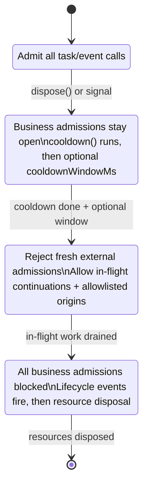

### Resource `cooldown()` in Shutdown

`resource.cooldown(...)` is a pre-drain ingress-stop hook. It runs during `coolingDown`, before any optional `dispose.cooldownWindowMs` window, before `disposing`, before `events.disposing`, and before drain waiting.

- Use it to stop intake quickly (for example: stop accepting HTTP requests, mark readiness as false, stop new queue consumption).
- It can be async, but keep it fast and return promptly. Let Runner's drain phase wait for business work.
- After all cooldown hooks finish, Runner keeps the broader `coolingDown` admission policy open for `dispose.cooldownWindowMs` only when that value is greater than `0`. Once `disposing` begins, fresh admissions narrow to allowlisted resource-origin calls and in-flight continuations.
- Do not use `cooldown()` as "wait until all work is done"; that is the runtime drain phase (`dispose.drainingBudgetMs`).
- Apply `cooldown()` primarily to ingress/front-door resources that admit external work into Runner (HTTP APIs, tRPC gateways, queue consumers, websocket gateways).
- Supporting resources that in-flight tasks depend on (for example: database pools, cache clients, message producers) should usually not perform teardown in `cooldown()`. Keep them available until `dispose()`.
- Execution order mirrors resource disposal: reverse dependency waves, with same-wave parallelism when `lifecycleMode: "parallel"` is enabled.

### Resource `ready()` in Startup

`resource.ready(...)` is a post-init startup hook. It runs after Runner locks mutation surfaces and before `events.ready` is emitted.

- Use it to start ingress or consumers only when startup wiring is complete.
- It follows dependency-safe startup order (dependencies before dependents), with same-wave parallelism in `lifecycleMode: "parallel"` mode.
- In lazy mode, if a startup-unused resource is initialized later on-demand, its `ready()` runs immediately once after that lazy initialization.

### How It Works

Resources initialize in dependency order and dispose in **reverse** order. If Resource B depends on Resource A, then:

1. **Startup init**: A initializes first, then B
2. **Startup ready**: A `ready()` runs before B `ready()`
3. **Shutdown**: B disposes first, then A

This ensures a resource can safely use its dependencies during `init()`, `ready()`, `cooldown()`, and `dispose()`.

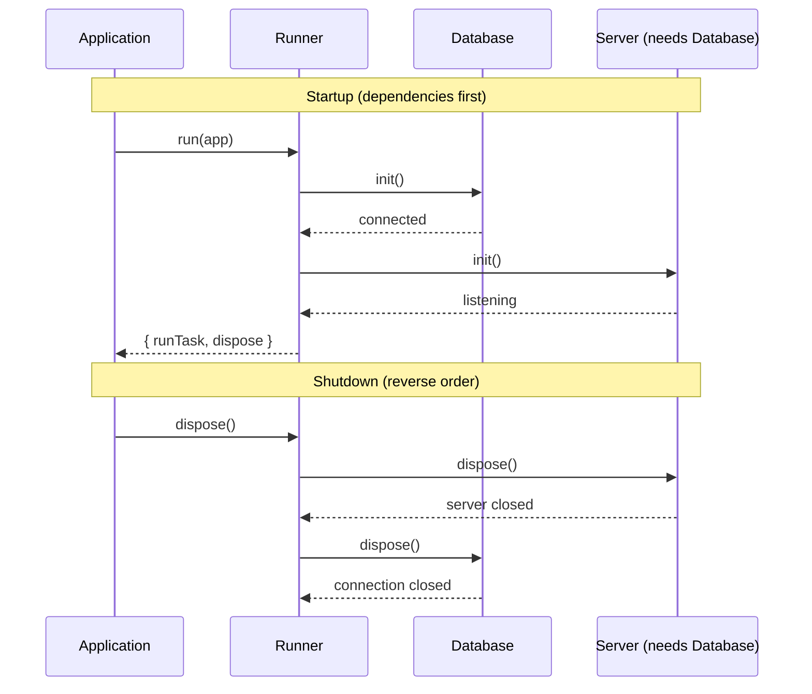

### Basic Shutdown Handling

> **Platform Note:** This example uses Express and Node.js process signals, so it runs on Node.js.

```typescript
import express from "express";
import { r, run } from "@bluelibs/runner";

type DbConnection = {
  ping: () => Promise<void>;
  close: () => Promise<void>;
};

const connectToDatabase = async (): Promise<DbConnection> => {
  // Replace with your real DB client initialization
  return {
    ping: async () => {},
    close: async () => {},
  };
};

const database = r
  .resource("database")
  .init(async () => {
    const conn = await connectToDatabase();
    console.log("Database connected");
    return conn;
  })
  .dispose(async (conn) => {
    await conn.close();
    console.log("Database closed");
  })
  .build();

const server = r
  .resource<{ port: number }>("server")
  .dependencies({ database })
  .context(() => ({ isReady: true as boolean }))
  .init(async ({ port }, { database }) => {
    await database.ping(); // Guaranteed to exist: `database` initializes first

    const httpServer = express().listen(port);
    console.log(`Server on port ${port}`);
    return httpServer;
  })
  .cooldown(async (httpServer, _config, _deps, context) => {
    // Intake stop phase: signal "not ready" and stop new connections quickly.
    context.isReady = false;
    httpServer.close();
  })
  .dispose(async (app) => {
    // Final teardown phase: close leftovers, free resources.
    return new Promise((resolve) => {
      app.close(() => {
        console.log("Server closed");
        resolve();
      });
    });
  })
  .build();

const app = r
  .resource("app")
  .register([database, server.with({ port: 3000 })])
  .init(async () => "ready")
  .build();

// Run with automatic shutdown hooks
const { dispose } = await run(app, {
  shutdownHooks: true, // Handle SIGTERM/SIGINT automatically
});

// Or call dispose() manually
await dispose();
```

### Automatic Signal Handling

By default, Runner installs handlers for `SIGTERM` and `SIGINT`.
Signal-based shutdown follows the standard disposal lifecycle sequence described in [Disposal Lifecycle Events](#disposal-lifecycle-events) below.

If a signal arrives while `run(...)` is still bootstrapping, Runner cancels startup, stops remaining `ready()` / `events.ready` work at the next safe boundary, and performs the same graceful teardown path.

Signal-based shutdown, `run(..., { signal })`, and manual `runtime.dispose()` follow the same graceful shutdown lifecycle (`coolingDown`, `disposing`, `drained`) and the same admission rules.

```typescript
await run(app, {
  shutdownHooks: true, // default: true
  dispose: {
    totalBudgetMs: 30_000,
    drainingBudgetMs: 20_000,
    abortWindowMs: 0,
    cooldownWindowMs: 0,
  },
});
```

You can also let an outer owner drive shutdown directly:

```typescript
const controller = new AbortController();
const runtime = await run(app, {
  shutdownHooks: false,
  signal: controller.signal,
});

controller.abort("container shutdown");
```

That signal cancels bootstrap before readiness or starts runtime disposal after readiness. It does not become `context.signal` and is not exposed through the injected `runtime` resource.

To handle signals yourself:

```typescript
const { dispose } = await run(app, { shutdownHooks: false });

process.on("SIGTERM", async () => {
  console.log("Shutting down...");
  await dispose();
  process.exit(0);
});
```

### Disposal Lifecycle Events

Manual `runtime.dispose()` and signal-based shutdown both follow:

1. transition to `coolingDown`
2. resource `cooldown()` (reverse dependency order)
3. optionally keep business admissions open for `dispose.cooldownWindowMs`
4. transition to `disposing`
5. `events.disposing` (awaited)
6. drain wait (`dispose.drainingBudgetMs`, capped by remaining `dispose.totalBudgetMs`)
7. optionally abort Runner-owned active task signals and wait `dispose.abortWindowMs` (also capped by remaining `dispose.totalBudgetMs`)
8. transition to `drained`
9. `events.drained` (lifecycle-bypassed, awaited)
10. fully awaited resource disposal

`runtime.dispose({ force: true })` is the exception:

1. transition directly to shutdown lockdown
2. skip any remaining graceful phases that have not started yet
3. this can skip `cooldown()`
4. this can skip `dispose.cooldownWindowMs`
5. this can skip `events.disposing`
6. this can skip drain wait
7. this can skip `dispose.abortWindowMs`
8. this can skip `events.drained`
9. fully awaited resource disposal

Important: `force: true` does not preempt lifecycle work that is already in flight, such as an active `cooldown()` call that has already started running.

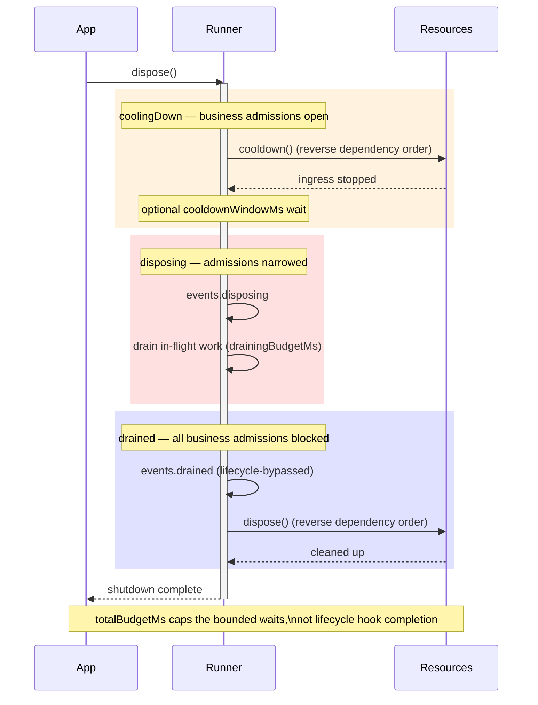

Important: hooks registered on `events.drained` **do fire** (the emission is lifecycle-bypassed), but those hooks cannot start new tasks or emit additional events — all regular business admissions are blocked once `drained` begins.

Important: `runtime.dispose({ force: true })` does not emit `events.disposing` or `events.drained`. It is meant for operator-controlled "stop waiting and tear down now" situations.

### Error Boundary Integration

The framework can automatically handle uncaught exceptions and unhandled rejections:

```typescript
const { dispose, logger } = await run(app, {
  errorBoundary: true, // Catch process-level errors
  shutdownHooks: true, // Graceful shutdown on signals
  onUnhandledError: async ({ error, kind, source }) => {
    // We log it by default
    await logger.error(`Unhandled error: ${error && error.toString()}`);
    // Optionally report to telemetry or decide to dispose/exit
  },
});
```

## Unhandled Errors

The `onUnhandledError` callback is invoked by Runner whenever an error escapes normal handling. It receives a structured payload you can ship to logging/telemetry and decide mitigation steps.

```typescript
type UnhandledErrorKind =
  | "process" // uncaughtException / unhandledRejection
  | "task" // task.run threw and wasn't handled
  | "middleware" // middleware threw and wasn't handled
  | "resourceInit" // resource init failed
  | "hook" // hook.run threw and wasn't handled
  | "run"; // failures in run() lifecycle

interface OnUnhandledErrorInfo {
  error: unknown;
  kind?: UnhandledErrorKind;
  source?: string; // additional origin hint (ex: "uncaughtException")
}

type OnUnhandledError = (info: OnUnhandledErrorInfo) => void | Promise<void>;
```

Default behavior (when not provided) logs the normalized error via the created `logger` at `error` level. Provide your own handler to integrate with tools like Sentry/PagerDuty or to trigger shutdown strategies.

Example with telemetry and conditional shutdown:

```typescript
await run(app, {
  errorBoundary: true,
  onUnhandledError: async ({ error, kind, source }) => {
    await telemetry.capture(error as Error, { kind, source });
    // Optionally decide on remediation strategy
    if (kind === "process") {
      // For hard process faults, prefer fast, clean exit after flushing logs
      await flushAll();
      process.exit(1);
    }
  },
});
```

**Best Practices for Shutdown:**

- Resources are disposed in reverse dependency order
- Set reasonable timeouts for cleanup operations
- Save critical state before shutdown
- Notify load balancers and health checks
- Stop accepting new work before cleaning up
## HTTP Server Shutdown Pattern (`cooldown` + `dispose`)

For HTTP servers, split shutdown work into two phases:

- `cooldown()`: stop new intake immediately.
- `dispose()`: finish teardown after Runner (task/event) drain and lifecycle hooks complete.

> **Platform Note:** The HTTP examples in this section use Express and Node's HTTP server APIs, so they run on Node.js.

```typescript
import express from "express";
import type { Server } from "node:http";
import { r } from "@bluelibs/runner";

type ServerContext = {
  app: express.Express;
  listener: Server | null;
  readiness: "up" | "down";
};

const httpServer = r
  .resource<{ port: number }>("httpServer")
  .context<ServerContext>(() => ({
    app: express(),
    listener: null,
    readiness: "up",
  }))
  .init(async ({ port }, _deps, context) => {
    context.app.get("/health", (_req, res) => {
      const status = context.readiness === "up" ? 200 : 503;
      res.status(status).json({ status: context.readiness });
    });

    context.listener = context.app.listen(port);
    return context.listener;
  })
  .cooldown(async (listener, _config, _deps, context) => {
    // Intake-stop phase: fast and non-blocking in intent.
    context.readiness = "down";
    listener.close();
  })
  .dispose(async (_listener, _config, _deps, context) => {
    // Final teardown phase: force-close leftovers if needed.
    context.listener.closeAllConnections();
    context.listener.closeIdleConnections();
    context.listener = null;
  })
  .build();
```

Why this pattern works:

- `cooldown()` runs before `events.disposing` and before drain wait, so it prevents new HTTP requests from entering.
- In-flight requests/tasks/events still get the normal drain window (`dispose.drainingBudgetMs`).
- `dispose()` runs after drain, so cleanup can focus on leftovers only.
- This is the intended `cooldown()` shape: ingress resources that route to tasks/events.
- Infrastructure dependencies (database connections, cache clients, brokers) should usually skip `cooldown()` and only clean up in `dispose()`, so in-flight work can still finish during drain.

`cooldown()` can be async, but keep it short. Trigger intake stop and return quickly; let Runner's drain phase do the waiting.

When you also want an operator-facing summary, pair ingress readiness with resource-level health probes:

```typescript
const report = await health.getHealth();
// {
//   totals: { resources: 3, healthy: 2, degraded: 1, unhealthy: 0 },
//   report: [...]
// }

const dbStatus = report.find(db).status;
```

Only resources that explicitly define `health()` participate. This keeps health reporting intentional instead of synthesizing fake status for every resource in the graph. Lazy resources that are still sleeping are skipped. Prefer `resources.health` inside resources; keep `runtime.getHealth()` for operator-facing runtime access.

Tasks can also declare a fail-fast policy around critical resources:

```typescript
const writeOrder = r
  .task("writeOrder")
  .tags([tags.failWhenUnhealthy.with([db])])
  .run(async (input) => persistOrder(input))
  .build();
```

When `db.health()` reports `unhealthy`, Runner blocks the task before its logic runs. `degraded` still executes, bootstrap-time task calls are not gated, and sleeping lazy resources remain skipped until they wake up.

For lightweight lifecycle-owned polling or recovery loops, use `resources.timers`:

```typescript
const app = r
  .resource("app")
  .dependencies({ timers: resources.timers, health: resources.health })
  .ready(async (_value, _config, { timers, health }) => {
    const interval = timers.setInterval(async () => {
      const report = await health.getHealth([db]);
      if (report.report[0]?.status === "healthy") {
        interval.cancel();
      }
    }, 1000);
  })
  .build();
```

`resources.timers` is available during `init()` as well. Once the timers resource enters `cooldown()`, it stops accepting new timers, and its `dispose()` clears anything still pending.

---

## Execution Context and Signal Propagation

Execution context has two jobs:

- expose runtime execution metadata such as `correlationId`
- carry the ambient execution `signal` through nested task and event dependency calls

This is a runtime surface, not a business-state async context. Use `r.asyncContext(...)` for tenant, auth, locale, or request metadata you own. Use `asyncContexts.execution` when you want Runner's execution metadata and signal propagation.

That second job matters now because signal propagation has two layers:

- explicit call-site signal: `runTask(task, input, { signal })` or `emit(payload, { signal })`
- ambient execution signal: when execution context is enabled, nested dependency calls can inherit the first signal already attached to the current execution tree

Think of the explicit signal as the boundary input and execution context as the propagation mechanism.

### Full vs Lightweight Mode

Use full mode when you need tracing and cycle protection:

```typescript
const runtime = await run(app, {
  executionContext: true,
});
```

Use lightweight mode when you mainly want cheap signal inheritance and correlation ids:

```typescript
const runtime = await run(app, {
  executionContext: { frames: "off", cycleDetection: false },
});
```

Snapshot behavior:

- both modes expose `correlationId`, `startedAt`, `signal`, and `framesMode`
- `framesMode: "full"` also exposes `depth`, `currentFrame`, and `frames`
- `framesMode: "off"` skips frame-stack bookkeeping entirely

Use lightweight mode when you want the signal propagation and correlation benefits without paying for execution-tree tracing on every task or event.

### How Signal Propagation Works

Runner keeps the model intentionally simple:

- the first signal seen in the execution tree becomes the ambient execution signal
- omitted nested task/event dependency calls inherit that ambient signal
- an explicit nested `signal` applies only to that direct child call or emission subtree
- explicit nested signals do not replace the already-inherited ambient execution signal
- if no real signal exists, `context.signal` and `event.signal` stay `undefined`

This keeps cancellation cheap for normal flows and predictable for nested orchestration.

### Minimal HTTP Boundary Example

This is the smallest useful pattern for request-scoped cancellation:

```typescript
import express from "express";
import type { Server } from "node:http";
import { r, run } from "@bluelibs/runner";

const getProfile = r
  .task("getProfile")
  .run(async ({ userId }, _deps, context) => {
    const response = await fetch(`https://api.example.com/users/${userId}`, {
      signal: context.signal,
    });

    return response.json();
  })
  .build();

const httpServer = r
  .resource<{ port: number }>("httpServer")
  .context(() => ({ listener: null as Server | null }))
  .dependencies({ getProfile })
  .ready(async (_value, { port }, { getProfile }, context) => {
    const app = express();

    app.get("/profile/:userId", async (req, res) => {
      const controller = new AbortController();
      req.on("close", () => controller.abort("Client disconnected"));

      try {
        const profile = await getProfile(
          { userId: req.params.userId },
          { signal: controller.signal },
        );

        res.json(profile);
      } catch (error) {
        res.status(499).json({ error: String(error) });
      }
    });

    context.listener = app.listen(port);
  })
  .dispose(async (_value, _config, _deps, context) => {
    await new Promise<void>((resolve) => context.listener?.close(() => resolve()));
  })
  .build();

const appResource = r
  .resource("app")
  .register([getProfile, httpServer.with({ port: 3000 })])
  .build();

await run(appResource, {
  executionContext: { frames: "off", cycleDetection: false },
});
```

Why this works:

- the Express resource is the ingress boundary
- the request creates one `AbortController` and passes its `signal` into the injected task call
- `getProfile` sees that signal as `context.signal`
- if no boundary signal is passed, `context.signal` stays `undefined`

This is the common shape for routers, RPC handlers, queue consumers, and other ingress points: inject the boundary signal once, then let execution context carry it through the execution tree.

### `provide()` and `record()`

Use `provide()` when the external boundary already has execution metadata you want Runner to reuse:

```typescript
import { asyncContexts } from "@bluelibs/runner";

await asyncContexts.execution.provide(
  {
    correlationId: req.headers["x-request-id"] as string,
    signal: controller.signal,
  },
  () => runtime.runTask(handleRequest, input),
);
```

Use `record()` when you want the full execution tree back for tests or debugging:

```typescript
import { asyncContexts } from "@bluelibs/runner";

const { result, recording } = await asyncContexts.execution.record(() =>
  runtime.runTask(handleRequest, input, { signal: controller.signal }),
);
```

If the runtime uses lightweight mode, `record()` temporarily promotes the callback to full frame tracking.

`provide()` and `record()` do not create cancellation on their own. They only seed an existing signal into the execution tree when you already have one at the boundary.

### Cycle Protection

Cycle protection still comes in layers:

- declared `.dependencies(...)` cycles fail during bootstrap graph validation
- declared hook-driven event bounce graphs fail during bootstrap event-emission validation
- dynamic runtime loops such as `task -> event -> hook -> task` need full execution context with cycle detection enabled

Lightweight mode is for propagation, not runtime loop detection.

---

## Async Context For Business State

Use `r.asyncContext(...)` when you need request-local business state such as tenant identity, auth claims, locale, or request ids.

Unlike `asyncContexts.execution`, this is your application contract. You define the value shape, decide whether it is required, and optionally define how it crosses transport boundaries. Inside one async execution tree, the active value also stays visible to nested `run()` work, so a tenant or request context can flow into a nested runtime when you intentionally compose things that way.

### Smallest Useful Pattern

```typescript
import { Match, r, run } from "@bluelibs/runner";

const requestContext = r
  .asyncContext("requestContext")
  .schema({
    requestId: Match.NonEmptyString,
    tenantId: Match.NonEmptyString,
    locale: Match.Optional(String),
  })
  .build();

const listProjects = r
  .task("listProjects")
  .dependencies({ requestContext })
  .middleware([requestContext.require()])
  .run(async (_input, { requestContext }) => {
    const request = requestContext.use();

    return {
      tenantId: request.tenantId,
      requestId: request.requestId,
      locale: request.locale ?? "en",
    };
  })
  .build();

const app = r
  .resource("app")
  .register([requestContext, listProjects])
  .build();

const runtime = await run(app);

await requestContext.provide(
  {
    requestId: "req_123",
    tenantId: "acme",
    locale: "en",
  },
  () => runtime.runTask(listProjects),
);
```

Why this pattern works:

- `provide(value, fn)` binds the value to the current async execution tree before `fn` runs.
- nested `run()` calls created inside that same async execution tree inherit the active value too, which is rare but useful for tenant-aware orchestration.
- `.schema(...)` validates the value when you call `provide(...)`, so bad ingress data fails fast.
- registering the context makes it injectable through `.dependencies({ requestContext })`.
- `requestContext.require()` is a shorthand for `middleware.task.requireContext.with({ context: requestContext })`.

### Access Patterns

Pick the accessor that matches how strict the call site should be:

- `use()`: read the value and throw immediately when it is missing.
- `tryUse()`: read the value when present, otherwise return `undefined`.
- `has()`: check whether the context is active.
- `require()`: turn missing context into middleware-level failure before task logic starts.
- `optional()`: inject the context as an optional dependency in apps where registration is conditional.

```typescript
const maybeAudit = r
  .task("maybeAudit")
  .dependencies({ requestContext: requestContext.optional() })
  .run(async (_input, { requestContext }) => {
    return requestContext?.tryUse()?.requestId;
  })
  .build();
```

Use `use()` or `require()` when continuing without context would be a correctness bug. Use `tryUse()` or `has()` in shared helpers, optional integrations, or platform-neutral code paths.

### Transport and Serialization

By default, async contexts use Runner's serializer. That is enough for in-process flows and many transport cases.

Add custom `serialize(...)` and `parse(...)` only when you need a specific wire format for HTTP or remote-lane boundaries:

```typescript
import { Match, Serializer, createHttpClient, r } from "@bluelibs/runner";

const requestContextShape = Match.Object({
  requestId: Match.NonEmptyString,
  tenantId: Match.NonEmptyString,
});

const requestContext = r
  .asyncContext("requestContext")
  .schema(requestContextShape)
  .serialize((value) => JSON.stringify(value))
  .parse((raw) => requestContextShape.parse(JSON.parse(raw)))
  .build();

const client = createHttpClient({
  baseUrl: "https://api.example.com",
  serializer: new Serializer(),
  contexts: [requestContext],
});

await requestContext.provide(
  { requestId: "req_42", tenantId: "acme" },
  () => client.task("listProjects"),
);
```

Transport rules:

- define `.schema(...)` before custom `.serialize(...)` or `.parse(...)` so the builder can keep the resolved value type aligned.
- `createHttpClient({ contexts: [...] })` snapshots only the contexts you list.
- remote lanes hydrate only registered contexts that are also allowlisted with `eventLane.asyncContexts([...])` or `rpcLane.asyncContexts([...])`.
- custom serialization is about transport compatibility, not normal in-process access.

> **Platform Note:** User-defined async contexts require `AsyncLocalStorage`. They work on the Node build and on compatible Bun/Deno universal runtimes that expose async-local storage. In browsers and other runtimes without it, `use()`, `tryUse()`, and `provide()` are not available for user-defined `r.asyncContext(...)` contracts.

For Runner's identity-aware security behavior, prefer the pattern in [`04c-security`](./04c-security.md): use the built-in `asyncContexts.identity` when `{ tenantId }` is enough, or pass your own registered `r.asyncContext(...).configSchema(...)` to `run(..., { identity })` when you need a richer contract.

---

## Cron Scheduling

Need recurring task execution without bringing in a separate scheduler process? Runner ships with a built-in global cron scheduler.

You mark tasks with `tags.cron.with({...})` (alias: `resources.cron.tag.with({...})`), and `resources.cron` discovers and schedules them at startup. The cron resource is opt-in, so you must register it explicitly.

```typescript
import { r } from "@bluelibs/runner";

const sendDigest = r
  .task("sendDigest")
  .tags([
    tags.cron.with({
      expression: "0 9 * * *",
      timezone: "UTC",
      immediate: false,
      onError: "continue",
    }),
  ])
  .run(async () => {
    // send digest
  })
  .build();

const app = r
  .resource("app")
  .register([
    resources.cron.with({
      // Optional: restrict scheduling to selected task ids/definitions.
      only: [sendDigest],
    }),
    sendDigest,
  ])
  .build();
```

Cron options:

- `expression` (required): 5-field cron expression.
- `input`: static input payload used for each run.
- `timezone`: timezone for parser evaluation.
- `immediate`: run once immediately on startup, then continue schedule.
- `enabled`: set to `false` to disable scheduling without removing the tag.
- `onError`: `"continue"` (default) or `"stop"` for that schedule.
- `silent`: suppress all cron log output for this task when `true` (default `false`).

`resources.cron.with({...})` options:

- `only`: optional array of task ids or task definitions; when set, only those cron-tagged tasks are scheduled.

Operational notes:

- One cron tag per task is supported. If you need multiple schedules, fork the task and tag each fork.
- If `resources.cron` is not registered, cron tags are treated as metadata and no schedules are started.
- Scheduler uses `setTimeout` chaining, which keeps it portable across supported runtimes.
- Startup and execution lifecycle messages are emitted via `resources.logger`.
- On `events.disposing`, cron stops all pending schedules immediately (no new timer-driven runs), while already in-flight cron executions drain under the normal shutdown budgets.

Best practices:

- Keep cron task logic idempotent (retries, restarts, and manual reruns happen).
- Use `timezone` explicitly for business schedules to avoid DST surprises.
- Use `onError: "stop"` only when repeated failure should disable the schedule.
- Keep cron tasks thin; delegate heavy logic to regular tasks for reuse/testing.

---

## Concurrency Utilities

Runner includes two battle-tested primitives for managing concurrent operations:

| Utility       | What it does                 | Use when                           |
| ------------- | ---------------------------- | ---------------------------------- |
| **Semaphore** | Limits concurrent operations | Rate limiting, connection pools    |
| **Queue**     | Serializes operations        | File writes, sequential processing |

Both ship with Runner—no external dependencies.

---

## Semaphore

Imagine this: Your API has a rate limit of 100 requests/second, but 1,000 users are hammering it at once. Without controls, you get 429 errors. Or your database pool has 20 connections, but you're firing off 100 queries simultaneously—they queue up, time out, and crash your app.

**The problem**: You need to limit how many operations run concurrently, but JavaScript's async nature makes it hard to enforce.

**The naive solution**: Use a simple counter and `Promise.all` with manual tracking. But this is error-prone—it's easy to forget to release a permit, leading to deadlocks.

**The better solution**: Use a Semaphore, a concurrency primitive that automatically manages permits.

### When to Use Semaphore

| Use case                   | Why Semaphore helps                        |
| -------------------------- | ------------------------------------------ |
| API rate limiting          | Prevents 429 errors by throttling requests |
| Database connection pools  | Keeps you within pool size limits          |
| Heavy CPU tasks            | Prevents memory/CPU exhaustion             |
| Third-party service limits | Respects external service quotas           |

### Basic Semaphore Usage

```typescript
import { Semaphore } from "@bluelibs/runner";

// Allow max 5 concurrent database queries
const dbSemaphore = new Semaphore(5);

// Preferred: automatic acquire/release
const users = await dbSemaphore.withPermit(async () => {
  return await db.query("SELECT * FROM users");
}); // Permit released automatically, even if query throws
```

**Pro Tip**: You don't always need to use `Semaphore` manually. The `concurrency` middleware (available via `middleware.task.concurrency`) provides a declarative way to apply these limits to your tasks.

### Manual Acquire/Release

When you need more control:

```typescript
// The elegant approach - automatic cleanup guaranteed!
const users = await dbSemaphore.withPermit(async () => {
  return await db.query("SELECT * FROM users WHERE active = true");
});
```

Prevent operations from hanging indefinitely with configurable timeouts:

```typescript
try {
  // Wait max 5 seconds, then throw timeout error
  await dbSemaphore.acquire({ timeout: 5000 });
  // Your code here
} catch (error) {
  console.log("Operation timed out waiting for permit");
}

// Or with withPermit
const result = await dbSemaphore.withPermit(
  async () => await slowDatabaseOperation(),
  { timeout: 10000 }, // 10 second timeout
);
```

Operations can be cancelled using AbortSignal:

```typescript
const controller = new AbortController();

// Start an operation
const operationPromise = dbSemaphore.withPermit(
  async () => await veryLongOperation(),
  { signal: controller.signal },
);

// Cancel the operation after 3 seconds
setTimeout(() => {
  controller.abort();
}, 3000);

try {
  await operationPromise;
} catch (error) {
  console.log("Operation was cancelled");
}
```

Want to know what's happening under the hood?

```typescript
// Get comprehensive metrics
const metrics = dbSemaphore.getMetrics();
console.log(`
Semaphore Status Report:
  Available permits: ${metrics.availablePermits}/${metrics.maxPermits}
  Operations waiting: ${metrics.waitingCount}
  Utilization: ${(metrics.utilization * 100).toFixed(1)}%
  Disposed: ${metrics.disposed ? "Yes" : "No"}
`);

// Quick checks
console.log(`Available permits: ${dbSemaphore.getAvailablePermits()}`);
console.log(`Queue length: ${dbSemaphore.getWaitingCount()}`);
console.log(`Is disposed: ${dbSemaphore.isDisposed()}`);
```

Properly dispose of semaphores when finished:

```typescript
// Reject all waiting operations and prevent new ones
dbSemaphore.dispose();

// All waiting operations will be rejected with:
// Error: "Semaphore has been disposed"
```

### From Utilities to Middleware

While `Semaphore` and `Queue` provide powerful manual control, Runner often wraps these into declarative middleware for common patterns:

- **concurrency**: Uses `Semaphore` internally to limit task parallelization.
- **temporal**: Uses timers and promise-tracking to implement `debounce` and `throttle`.
- **rateLimit**: Uses fixed-window counting to protect resources from bursts.

**What you just learned**: Utilities are the building blocks; Middleware is the blueprint for common resilience patterns.

---

## Queue

Picture this: Two users register at the same time, and your code writes their data simultaneously. The file gets corrupted—half of one user, half of another. Or you run database migrations in parallel and the schema gets into an inconsistent state.

**The problem**: Concurrent operations can corrupt data, produce inconsistent results, or violate business rules that require sequence.

**The naive solution**: Use `await` between operations or a simple array to queue them manually. But this is tedious and error-prone—easy to forget and skip a step.

**The better solution**: Use a Queue, which serializes operations automatically, ensuring they run one-by-one in order.

### When to Use Queue

| Use case             | Why Queue helps                                 |
| -------------------- | ----------------------------------------------- |
| File system writes   | Prevents file corruption from concurrent access |
| Sequential API calls | Maintains request ordering                      |
| Database migrations  | Ensures schema changes apply in order           |
| Audit logs           | Guarantees chronological ordering               |

### Basic Queue Usage

```typescript
import { Queue } from "@bluelibs/runner";

const queue = new Queue();

// Tasks run sequentially, even if queued simultaneously
const [result1, result2] = await Promise.all([
  queue.run(async () => await writeFile("a.txt", "first")),
  queue.run(async () => await writeFile("a.txt", "second")),
]);
// File contains "second" - no corruption from concurrent writes
```

### Cancellation Support

Each task receives an `AbortSignal` for cooperative cancellation. Plain `queue.dispose()` drains already-queued work, while `queue.dispose({ cancel: true })` switches into teardown mode and aborts the active task cooperatively:

```typescript
import { Queue } from "@bluelibs/runner";

const queue = new Queue();

// Queue up some work
const result = await queue.run(async (signal) => {
  // Your async task here
  return "Task completed";
});

// Graceful drain
await queue.dispose();
```

### AbortController Integration

The Queue provides each task with an `AbortSignal` for cooperative cancellation. Tasks should periodically check this signal to enable early termination when you explicitly dispose with `{ cancel: true }`.

### Examples

**Example: Long-running Task**

```typescript
const queue = new Queue();

// Task that respects cancellation
const processLargeDataset = queue.run(async (signal) => {
  const items = await fetchLargeDataset();

  for (const item of items) {
    signal.throwIfAborted();

    await processItem(item);
  }

  return "Dataset processed successfully";
});

// Cancel all running tasks
await queue.dispose({ cancel: true });
```

**Network Request with Timeout**

```typescript
const queue = new Queue();

const fetchWithCancellation = queue.run(async (signal) => {
  try {
    // Pass the signal to fetch for automatic cancellation
    const response = await fetch("https://api.example.com/data", { signal });
    return await response.json();
  } catch (error) {
    if (error.name === "AbortError") {
      console.log("Request was cancelled");
      throw error;
    }
    throw error;
  }
});

// This will cancel the fetch request if still pending
await queue.dispose({ cancel: true });
```

**Example: File Processing with Progress Tracking**

```typescript
const queue = new Queue();

const processFiles = queue.run(async (signal) => {
  const files = await getFileList();
  const results = [];

  for (let i = 0; i < files.length; i++) {
    // Respect cancellation
    signal.throwIfAborted();

    const result = await processFile(files[i]);
    results.push(result);

    // Optional: Report progress
    console.log(`Processed ${i + 1}/${files.length} files`);
  }

  return results;
});
```

#### The Magic Behind the Curtain

- `tail`: The promise chain that maintains FIFO execution order
- `disposed`: Boolean flag indicating whether the queue accepts new tasks
- `abortController`: Centralized cancellation controller that provides `AbortSignal` to all tasks
- `executionContext`: AsyncLocalStorage-based execution bookkeeping for correlation ids and causal-chain tracking

#### Implement Cooperative Cancellation

Tasks should regularly check the `AbortSignal` and respond appropriately:

```typescript
// Preferred: Use signal.throwIfAborted() for immediate termination
signal.throwIfAborted();

// Alternative: Check signal.aborted for custom handling
if (signal.aborted) {
  cleanup();
  signal.throwIfAborted();
}
```

**Integrate with Native APIs**

Many Web APIs accept `AbortSignal`:

- `fetch(url, { signal })`
- `setTimeout(callback, delay, { signal })`
- Custom async operations

**Avoid Nested Queuing**

The Queue prevents deadlocks by rejecting attempts to queue tasks from within running tasks. Structure your code to avoid this pattern.

**Handle AbortError Gracefully**

```typescript
try {
  await queue.run(task);
} catch (error) {
  if (error.name === "AbortError") {
    // Expected cancellation, handle appropriately
    return;
  }
  throw error; // Re-throw unexpected errors
}
```

### Lifecycle Events (Isolated EventManager)

`Queue` also publishes local lifecycle events for lightweight telemetry. Each Queue instance has its own **isolated EventManager**—these events are local to the Queue and are completely separate from the global EventManager used for business-level application events.

- `enqueue` · `start` · `finish` · `error` · `cancel` · `disposed`

```typescript
const q = new Queue();
q.on("start", ({ taskId }) => console.log(`task ${taskId} started`));
await q.run(async () => "ok");
await q.dispose({ cancel: true }); // emits cancel + disposed
```
## Serialization

Serialization is where data crosses boundaries: HTTP, queues, storage, or process hops.
Runner's serializer is designed to be **functional first**: plain schemas, plain functions, explicit contracts.

Class decorators are optional. They are excellent DX when you want DTO ergonomics, but they are not required.

### Functional First

Use `Serializer` directly with explicit schema contracts:

```typescript
import { Match, Serializer } from "@bluelibs/runner";

const serializer = new Serializer();

const payloadSchema = Match.ArrayOf(
  Match.ObjectStrict({
    id: Match.NonEmptyString,
    age: Match.Integer,
  }),
);

const payload = serializer.serialize([
  { id: "u1", age: 42 },
  { id: "u2", age: 31 },
]);

const users = serializer.deserialize(payload, { schema: payloadSchema });
// users is validated on deserialize
```

### What It Handles

| Type          | JSON                         | Runner Serializer                                                                              |
| ------------- | ---------------------------- | ---------------------------------------------------------------------------------------------- |
| `Date`        | String                       | Date object                                                                                    |
| `RegExp`      | Lost                         | RegExp object                                                                                  |
| `Map`, `Set`  | Lost                         | Preserved                                                                                      |
| `Uint8Array`  | Lost                         | Preserved                                                                                      |
| `bigint`      | Lost/unsafe numeric coercion | Preserved as `__type: "BigInt"` (decimal string payload)                                       |
| `symbol`      | Lost                         | Supports `Symbol.for(key)` and well-known symbols (unique `Symbol("...")` values are rejected) |
| Circular refs | Error                        | Preserved                                                                                      |
| Self refs     | Error                        | Preserved                                                                                      |

Two operational modes:

- Tree mode: `stringify()` / `parse()` (JSON-like API, type-aware)
- Graph mode: `serialize()` / `deserialize()` (handles circular/self references)

`parse()` ergonomics:

- `serializer.parse(payload)` is the ergonomic tree-style alias when you do not need to emphasize graph semantics.
- `serializer.parse(payload, { schema })` remains a shorthand for "deserialize + validate/parse with schema".
- when circular references or graph reconstruction matter, prefer the explicit `serialize()` / `deserialize()` names in examples and production code

```typescript
import { Match, Serializer } from "@bluelibs/runner";

const serializer = new Serializer();
const payload = serializer.serialize({ id: "u1", age: 42 });

// Explicit form
const viaDeserialize = serializer.deserialize(payload, {
  schema: Match.ObjectStrict({
    id: Match.NonEmptyString,
    age: Match.Integer,
  }),
});

// Ergonomic alias: same behavior
const viaParse = serializer.parse(payload, {
  schema: Match.ObjectStrict({
    id: Match.NonEmptyString,
    age: Match.Integer,
  }),
});
```

### Safety for Untrusted Payloads

When deserializing untrusted data, tighten defaults:

```typescript
import { Serializer } from "@bluelibs/runner";

const serializer = new Serializer({
  symbolPolicy: "well-known-only",
  allowedTypes: ["Date", "RegExp", "Map", "Set", "Uint8Array", "BigInt"],
  maxDepth: 64,
  maxRegExpPatternLength: 2000,
  allowUnsafeRegExp: false,
});
```

### Serializer Resources in Runner

`resources.serializer` is the built-in default serializer resource.

When one boundary needs a separate serializer contract, the simplest option is
to define a dedicated resource that returns `new Serializer({...})`.

If you want to reuse the built-in serializer resource contract and config
schema, fork `resources.serializer` and configure that fork with `.with({...})`.

- Use `allowedTypes: [...]` when you want to restrict deserialization to
  specific built-in or custom type ids.
- Use `new Serializer({ types: [...] })` to pre-register explicit
  `addType({ ... })` definitions.
- Use `new Serializer({ schemas: [...] })` or `serializer.addSchema(DtoClass)`
  to register `@Match.Schema()` DTO classes as serializer-aware types.

```typescript
import { resources, r, Serializer } from "@bluelibs/runner";

const rpcSerializer = r
  .resource("rpcSerializer")
  .init(
    async () =>
      new Serializer({
        symbolPolicy: "well-known-only",
        allowedTypes: ["Date", "Map"],
        maxDepth: 64,
      }),
  )
  .build();

const rpcSerializerFork =
  resources.serializer.fork("app.resources.rpcSerializer");

const app = r
  .resource("app")
  .register([
    rpcSerializer,
    rpcSerializerFork.with({
      symbolPolicy: "well-known-only",
      allowedTypes: ["Date", "Map"],
      maxDepth: 64,
    }),
    // pass either `rpcSerializer` or `rpcSerializerFork`
    // to the boundary that should use it
  ])
  .build();
```

> **Note:** `.with(config)` is a registration-time entry. Register the
> configured serializer resource you want the runtime to use, then pass the bare
> resource definition to whichever boundary depends on it. `fork(...)` is the
> easiest way to create a second serializer definition with the same built-in
> config contract but a different identity.

### Custom Types

```typescript
import { Serializer } from "@bluelibs/runner";

class Money {
  constructor(
    public amount: number,
    public currency: string,
  ) {}
}

const serializer = new Serializer();

serializer.addType({
  id: "Money",
  is: (obj): obj is Money => obj instanceof Money,
  serialize: (money) => ({ amount: money.amount, currency: money.currency }),
  deserialize: (json) => new Money(json.amount, json.currency),
  strategy: "value",
});
```

You can also register explicit custom types at construction time:

```typescript
const serializer = new Serializer({
  types: [
    {
      id: "Money",
      is: (obj): obj is Money => obj instanceof Money,
      serialize: (money) => ({
        amount: money.amount,
        currency: money.currency,
      }),
      deserialize: (json) => new Money(json.amount, json.currency),
      strategy: "value",
    },
  ],
});
```

### Decorator Compatibility

Decorator-backed schemas and DTOs share the same compatibility rules across both serialization and validation:

- `@bluelibs/runner` uses standard ES decorators by default.
- They do not rely on `emitDecoratorMetadata` or `reflect-metadata`; Runner stores its own schema and serializer field metadata explicitly.
- The default `@bluelibs/runner` package now ensures `Symbol.metadata` exists when the runtime does not provide it yet, so ES decorators work out of the box from the main import path.
- Native/runtime-provided `Symbol.metadata` values are preserved; Runner only initializes the symbol when it is absent.
- For legacy TypeScript decorators (`experimentalDecorators`), import `Match` and `Serializer` from `@bluelibs/runner/decorators/legacy`. That compatibility entrypoint still includes the full `Match` helper surface (`ObjectIncluding`, `ArrayOf`, `fromSchema`, and `check(...)`), not only decorator helpers.

### Class Ergonomics for Serialization (Great DX, Optional)

When DTO classes are your preferred style, combine `@Match.Schema()` with `@Serializer.Field(...)`.
This is purely ergonomic on top of the same runtime contracts.

```typescript
import { Match, Serializer } from "@bluelibs/runner";

@Match.Schema()
class UserDto {
  @Serializer.Field({ from: "abc" })
  @Match.Field(Match.NonEmptyString)
  id!: string;

  @Serializer.Field({
    from: "raw_age",
    deserialize: (value) => Number(value),
    serialize: (value) => String(value),
  })
  @Match.Field(Match.Integer)
  age!: number;
}

const serializer = new Serializer();
const user = serializer.deserialize('{"abc":"u1","raw_age":"42"}', {
  schema: UserDto,
});
```

Notes:

- Decorated class shorthand works for `schema: UserDto` and `schema: [UserDto]`.
- Decorated class schemas hydrate on deserialize, so `serializer.deserialize(..., { schema: UserDto })` returns a `UserDto` instance and nested `Match.fromSchema(...)` nodes hydrate recursively as well. (supports cycles too)
- Hydration reattaches the class prototype onto validated data; it does not call the class constructor.
- If a class is not decorated with `@Match.Schema()`, constructor shorthand uses constructor semantics (`instanceof`) and usually fails for plain deserialized objects.
- Functional schema style is always available: `schema: Match.fromSchema(UserDto)` and `schema: Match.ArrayOf(Match.fromSchema(UserDto))`.
- `@Serializer.Field(...)` itself does not require `@Match.Schema()` to register metadata.
  It affects class-instance serialization in all cases, but schema-aware deserialize class shorthand (`schema: UserDto`) still needs `@Match.Schema()` for validation to pass.
- Register the DTO with `serializer.addSchema(UserDto)` or
  `new Serializer({ schemas: [UserDto] })` when you want the serializer to emit
  a typed payload and restore the DTO without passing `{ schema }`.

```typescript
import { Match, Serializer } from "@bluelibs/runner";

class OutboundUser {
  @Serializer.Field({ from: "user_id" })
  id!: string;
}

const serializer = new Serializer();
const outbound = new OutboundUser();
outbound.id = "u1";

// Works without @Match.Schema(): outgoing remap still applies
serializer.stringify(outbound); // {"user_id":"u1"}

class InboundUser {
  @Serializer.Field({ from: "user_id" })
  id!: string;
}

const payload = '{"user_id":"u1"}';

// This usually fails without @Match.Schema() because class shorthand falls back to constructor semantics
// serializer.deserialize(payload, { schema: InboundUser });

@Match.Schema()
class ValidatedInboundUser {
  @Serializer.Field({ from: "user_id" })
  @Match.Field(Match.NonEmptyString)
  id!: string;
}

serializer.deserialize(payload, { schema: ValidatedInboundUser }); // ValidatedInboundUser { id: "u1" }
```

### Combine Validation + Serialization on the Same Class

You can combine `@Match.Field(...)` and `@Serializer.Field(...)` to validate and transform wire payloads with one DTO contract.

```typescript
import { Match, Serializer } from "@bluelibs/runner";

@Match.Schema()
class PaymentDto {
  @Serializer.Field({ from: "order_id" })
  @Match.Field(Match.NonEmptyString)
  orderId!: string;

  @Serializer.Field({
    from: "amount_cents",
    deserialize: (value) => Number(value),
    serialize: (value: number) => String(value),
  })
  @Match.Field(Match.Integer)
  amountCents!: number;

  @Match.Field(Match.OneOf("USD", "EUR", "GBP"))
  currency!: string;
}

const serializer = new Serializer();

const payment = serializer.deserialize(
  '{"order_id":"ord-1","amount_cents":"2599","currency":"USD"}',
  { schema: PaymentDto },
);
```

Why this is powerful:

- Alias inbound/outbound wire keys (`order_id` <-> `orderId`).
- Transform values at field level (for example string cents <-> numeric cents).
- Keep runtime validation and serialization mapping in one place.

> **Note:** File uploads are handled by Remote Lanes HTTP multipart support, not by the serializer.

---

## Runtime Validation

TypeScript protects compile-time contracts. Runtime validation protects trust boundaries.

Start with functional schemas and explicit parsers. Use classes when they improve developer ergonomics.

### Choosing a Style

| Situation                                   | Prefer Functional (`Match.*` / plain schemas) | Prefer Class (`@Match.Schema`, `@Match.Field`) |
| ------------------------------------------- | --------------------------------------------- | ---------------------------------------------- |
| Request/response boundaries                 | Best for explicit, local contracts            | Good when boundary DTOs are shared widely      |
| Dynamic shapes (maps, conditional payloads) | Best fit (`Match.MapOf`, composable patterns) | Usually more verbose                           |
| Large domain models reused across features  | Possible but can become repetitive            | Best readability and reuse                     |
| Wire-field remapping/transforms             | Works, but manual                             | Best DX with `@Serializer.Field(...)`          |
| Team preference                             | Functional programming style                  | OOP/DTO-centric style                          |

Rule of thumb:

- Start functional for most boundaries.
- Move to class-based schemas when the same contract appears in multiple places or when serializer field mapping becomes central.

### `check()` at a Glance

`check(value, patternOrSchema)` supports two modes:

```typescript
import { Match, check } from "@bluelibs/runner";

// Pattern mode: returns the same validated value, typed from pattern
const input = check(
  { userId: "u1", email: "ada@example.com" },
  {
    userId: Match.NonEmptyString,
    email: Match.Email,
  },
);

// Schema mode: calls schema.parse(input) and returns parsed/transformed output
const userInputSchema = Match.compile({
  id: Match.NonEmptyString,
  email: Match.Email,
  age: Match.Integer,
});

const parsed = check(
  { id: "u1", email: "ada@example.com", age: 42 },
  userInputSchema,
);
parsed.age; // number

type UserInput = Match.infer<typeof userInputSchema>;
```

Hydration rule of thumb:

- `check(value, pattern)` validates and returns the same value reference on success.
- Any `parse(...)` path may hydrate class-schema nodes.
  That includes `Match.compile(pattern).parse(...)`, `Match.fromSchema(User).parse(...)`, and Match-native helper `.parse(...)` calls.
- Hydration uses prototype assignment for decorated class schemas and does not call constructors during parse.
- `type Output = Match.infer<typeof schema>` is the ergonomic type-level alias for inferring Match patterns and schema-like values.

Numeric ranges:

```typescript
import { Match, check } from "@bluelibs/runner";

const percentage = check(50, Match.Range({ min: 0, max: 100 }));
const openInterval = Match.Range({ min: 0, max: 1, inclusive: false });
const integerRange = Match.Range({ min: 1, max: 10, integer: true });

percentage; // number
openInterval.test(0.5); // true
integerRange.parse(3);
```

- `Match.Range({ min?, max?, inclusive?, integer? })` matches finite numbers within the configured bounds.
- `inclusive` defaults to `true`; `inclusive: false` makes both bounds exclusive.
- `integer: true` restricts the range to integers, so `Match.Range({ min: 5, max: 10, integer: true })` is the short form for “integer between 5 and 10”.

### Shorthand Object Patterns (Real-World)

Plain object patterns are strict by default, recursively.

```typescript
import { Match, check } from "@bluelibs/runner";

const webhookPayload = check(
  {
    tenantId: "123e4567-e89b-42d3-a456-426614174000",
    event: "user.created",
    data: {
      user: {
        id: "u1",
        profile: { email: "ada@example.com" },
      },
    },
  },
  {
    tenantId: Match.UUID,
    event: String,
    data: {
      user: {
        id: Match.NonEmptyString,
        profile: { email: Match.Email },
      },
    },
  },
);
```

Equivalent strict semantics:

- `check(x, { a: { b: String } })` is treated like nested `Match.ObjectStrict({ ... })`.
- Unknown keys are rejected at each plain-object level.
- If you need extra keys, use `Match.ObjectIncluding({ ... })`.
- If keys are dynamic, use `Match.MapOf(valuePattern)`.
- Use `String`/`Number`/`Boolean` constructors for type checks.
- Literal patterns like `"string"` mean exact literal match, not type match.

Common object variants in practice:

```typescript
import { Match, check } from "@bluelibs/runner";

// 1) Strict object (default for plain object patterns)
check(
  { id: "u1", email: "ada@example.com" },
  { id: Match.NonEmptyString, email: Match.Email },
);

// 2) Include extra fields (for forward-compatible payloads)
check(
  { id: "u1", email: "ada@example.com", extra: { source: "web" } },
  Match.ObjectIncluding({
    id: Match.NonEmptyString,
    email: Match.Email,
  }),
);

// 3) Dynamic-key maps (for dictionaries / lookup tables)
check(
  {
    "tenant-a": { retries: 3 },
    "tenant-b": { retries: 5 },
  },
  Match.MapOf(
    Match.ObjectStrict({
      retries: Match.Integer,
    }),
  ),
);
```

Object-pattern decision guide:

| If you want...                                  | Prefer                         |
| ----------------------------------------------- | ------------------------------ |
| A normal strict object shape                    | Plain object `{ ... }`         |
| Explicit strictness for readability/composition | `Match.ObjectStrict({ ... })`  |
| Extra unknown keys allowed                      | `Match.ObjectIncluding({ ... })` |
| Dynamic string keys with one value shape        | `Match.MapOf(valuePattern)`    |

Rule of thumb:

- Start with a plain object for the common strict case.
- Use `Match.ObjectStrict(...)` when you want the strictness to be explicit inside larger composed patterns or helpers.
- Use `Match.ObjectIncluding(...)` when payloads are forward-compatible or intentionally allow extra fields.

### Match Reference

| Pattern / Helper                                             | What It Does                                                                 |
| ------------------------------------------------------------ | ---------------------------------------------------------------------------- |
| `String`, `Number`, `Boolean`, `Function`, `Object`, `Array` | Constructor-based validation                                                 |
| Class constructor (for example `Date`, `MyClass`)            | Validates via constructor semantics                                          |
| Literal values (`"x"`, `42`, `true`, `null`, `undefined`)    | Exact literal match                                                          |
| `[pattern]`                                                  | Array where every element matches `pattern`                                  |
| Plain object (`{ a: String }`)                               | Strict object validation (same as `Match.ObjectStrict`)                      |
| `Match.ObjectStrict({ ... })`                                | Strict object shape (`additionalProperties: false` semantics)                |
| `Match.ObjectIncluding({ ... })`                             | Partial object shape (unknown keys allowed)                                  |
| `Match.MapOf(valuePattern)`                                  | Dynamic-key object with uniform value pattern                                |
| `Match.Any`                                                  | Accepts any value                                                            |
| `Match.Integer`                                              | Signed 32-bit integer                                                        |
| `Match.Range({ min?, max?, inclusive?, integer? })`         | Finite-number or integer range with optional inclusive/exclusive min/max bounds |
| `Match.NonEmptyString`                                       | Non-empty string                                                             |
| `Match.Email`                                                | Email-shaped string                                                          |
| `Match.UUID`                                                 | Canonical UUID string                                                        |
| `Match.URL`                                                  | Absolute URL string                                                          |
| `Match.IsoDateString`                                        | ISO datetime string with timezone                                            |
| `Match.RegExp(re)`                                           | String matching given regexp                                                 |
| `Match.ArrayOf(pattern)`                                     | Array of elements matching pattern                                           |
| `Match.NonEmptyArray()` / `Match.NonEmptyArray(pattern)`     | Non-empty array, optional element validation                                 |
| `Match.Optional(pattern)`                                    | `undefined` or pattern                                                       |
| `Match.Maybe(pattern)`                                       | `undefined`, `null`, or pattern                                              |
| `Match.OneOf(...patterns)`                                   | Any one of given patterns                                                    |
| `Match.Where((value, parent?) => boolean, messageOrFormatter?)` | Custom predicate / type guard with optional native message sugar          |
| `Match.WithMessage(pattern, messageOrFormatter)`             | Wraps a pattern with a custom top-level validation message                   |
| `Match.Lazy(() => pattern)`                                  | Lazy/recursive pattern                                                       |
| `Match.Schema(options?)`                                     | Class schema decorator (`exact`, `schemaId`, `errorPolicy`; see also `base`) |
| `Match.Schema({ base: BaseClass \| () => BaseClass })`       | Composes schema classes without requiring TypeScript `extends`               |
| `Match.Field(pattern)`                                       | Decorated field validator                                                    |
| `Match.fromSchema(Class, options?)`                          | Schema-like matcher from class metadata                                      |
| `Match.WithErrorPolicy(pattern, "first" \| "all")`           | Sets a default validation aggregation policy on a pattern                    |
| `Match.compile(pattern)`                                     | Compiles pattern into `{ parse, test, toJSONSchema }`                        |
| `Match.test(value, pattern)`                                 | Boolean helper for validation check                                          |
| `errors.matchError`                                          | Built-in Runner error helper for match failure                               |

### Additional `check()` Details

- Match-native helpers and built-in tokens also expose `.parse()`, `.test()`, and `.toJSONSchema()` directly.
- `check(value, pattern, { errorPolicy: "all" })` aggregates all validation issues instead of fail-fast at first mismatch.
- `Match.WithErrorPolicy(pattern, "all")` stores the same aggregate behavior as the default for that Match-native pattern.
- `throwAllErrors` still works as a deprecated alias for `errorPolicy`.
- Recursive and forward patterns are supported via `Match.Lazy(...)`.
- Class-backed recursive graphs are supported with `Match.Schema()` + `Match.fromSchema(...)`.
  Use `Match.fromSchema(() => User)` inside decorated fields when a class needs to reference itself or a class declared later.
- In Runner builders (`inputSchema`, `payloadSchema`, `configSchema`, etc.), explicit `parse(input)` schemas have precedence; otherwise Runner falls back to pattern validation via `check(...)`.
- Decorator class shorthand in builder APIs (for example `.inputSchema(UserDto)` / `.configSchema(UserConfig)`) requires class metadata from `@Match.Schema()`.
- `Match.Schema({ exact, schemaId, errorPolicy })` controls class-level strictness, schema identity, and default validation aggregation; `Match.Schema({ base })` composes schema classes without TypeScript `extends`.
- `@Match.Schema({ errorPolicy: "all" })` gives `Match.fromSchema(MyClass)` the same aggregate-default behavior as `Match.WithErrorPolicy(...)`.
- `Match.WithMessage(pattern, messageOrFormatter)` overrides the thrown match-error message headline while preserving the normal error structure (`id`, `path`, `failures`).
- `messageOrFormatter` accepts a string, `{ message, code?, params? }`, or a callback `(ctx) => string | { message, code?, params? }`.
- When `code` / `params` are provided, Runner copies that metadata onto the owned `failures[]` entries without rewriting the raw leaf `message` text.
- Final match-error `failures` is always a flat array of leaf failures. Nested validation does not produce a tree of failures or a synthetic parent failure like `$.address` unless an actual matcher failed at that path.
- Match-error `path` always comes from the first recorded failure. If a nested field fails first, a parent custom headline may still be used, but `error.path` remains the nested leaf path such as `$.address.city`.
- With `check(value, pattern, { errorPolicy: "all" })`, the default headline is an aggregate summary of the collected failures. The exact formatting may change over time.
- Leaf wrappers such as `Match.WithMessage(String, ...)` do not replace that aggregate headline; their underlying failures still appear in `error.failures`.
- Subtree wrappers such as plain objects, arrays, `Match.ObjectIncluding(...)`, `Match.MapOf(...)`, `Match.NonEmptyArray(...)`, `Match.Lazy(...)`, or `Match.fromSchema(...)` can replace the aggregate headline while still preserving the nested failures in `error.failures`.
- Decorator-backed schemas are not special here: `Match.WithMessage(Match.fromSchema(AddressSchema), ...)` behaves like any other subtree wrapper.
- In `Match.WithMessage(pattern, fn)`, the callback receives `ctx.error` built from the nested failures collected inside the wrapped pattern. That nested error exposes `path` and `failures`, but its `message` is rebuilt from the raw nested failures and does not preserve any inner `Match.WithMessage(...)` headline from deeper wrappers.
- `Match.Where((value, parent?) => boolean, messageOrFormatter?)` receives the immediate parent object/array when validation happens inside a compound value.

#### Recursive Patterns: Which Helper to Use

Use `Match.Lazy(...)` when the recursive thing is a plain Match pattern.

```typescript
import { Match, check } from "@bluelibs/runner";

const createTreePattern = () =>
  Match.ObjectIncluding({
    id: Match.NonEmptyString,
    children: Match.Optional(
      Match.ArrayOf(Match.Lazy(() => createTreePattern())),
    ),
  });

check(
  {
    id: "root",
    children: [{ id: "child", children: [] }],
  },
  createTreePattern(),
);
```

Use `Match.fromSchema(() => User)` when the recursive thing is a decorated class schema.

```typescript
import { Match, check } from "@bluelibs/runner";

@Match.Schema()
class User {
  @Match.Field(Match.NonEmptyString)
  name!: string;

  @Match.Field(Match.fromSchema(() => User))
  self!: User;

  @Match.Field(Match.ArrayOf(Match.fromSchema(() => User)))
  children!: User[];
}

check(
  (() => {
    const user: Record<string, unknown> = {
      name: "Ada",
      children: [],
    };
    user.self = user;
    return user;
  })(),
  Match.fromSchema(User),
);
```

Rule of thumb:

- `Match.Lazy(...)` is the general recursion tool for plain objects, arrays, unions, and custom Match composition.
- `Match.fromSchema(() => Class)` is the class-schema version when you already use `@Match.Schema()` / `@Match.Field(...)`.

### Reusable Custom Patterns

You do not need a separate low-level registration API to create your own Match patterns. The public pattern-authoring story is simple: compose existing `Match.*` helpers into named constants and reuse those constants everywhere.

```typescript
import { Match, check } from "@bluelibs/runner";

const AppMatch = {
  UserId: Match.WithMessage(
    Match.NonEmptyString,
    "User id must be a non-empty string.",
  ),
  Slug: Match.WithMessage(
    Match.RegExp(/^[a-z0-9]+(?:-[a-z0-9]+)*$/),
    "Slug must be kebab-case.",
  ),
  RetryCount: Match.Where(
    (value: unknown): value is number =>
      typeof value === "number" && Number.isInteger(value) && value >= 0,
    "Retry count must be a non-negative integer.",
  ),
  UserRecord: Match.ObjectIncluding({
    id: Match.NonEmptyString,
    email: Match.Email,
  }),
  UserList: Match.ArrayOf(
    Match.ObjectIncluding({
      id: Match.NonEmptyString,
      email: Match.Email,
    }),
  ),
} as const;

check("user-1", AppMatch.UserId);
AppMatch.Slug.test("runner-core");
AppMatch.UserRecord.parse({ id: "u1", email: "ada@example.com" });
```

This gives you reusable, named patterns without exposing internals. Because these are still normal Match-native patterns, they work anywhere Match works:

- `check(value, AppMatch.Slug)`
- `Match.compile({ slug: AppMatch.Slug })`
- `@Match.Field(AppMatch.UserId)`
- `Match.ArrayOf(AppMatch.UserRecord)`

Rule of thumb:

- Prefer composition first. Most custom patterns are just named combinations of built-ins, objects, arrays, unions, regexes, and wrappers.
- Use `Match.WithMessage(...)` when the main need is a better domain-specific error message for any existing pattern.
- Use `Match.Where(...)` when you need custom runtime logic or a custom type guard.
- Use `Match.Where(..., messageOrFormatter)` as shorthand for the common `Match.WithMessage(Match.Where(...), ...)` case.
- Prefer `Match.RegExp(...)`, built-in tokens, object patterns, and array patterns when you want strong JSON Schema export.
- `Match.Where(...)` is runtime-only. In non-strict JSON Schema export it becomes metadata; in strict mode it is rejected because arbitrary predicates cannot be represented faithfully.

### Custom Match Messages

Use `Match.WithMessage(pattern, messageOrFormatter)` when a validation rule needs a more domain-specific message while keeping the normal error structure (`id`, `path`, `failures`).

```typescript
import { Match, check } from "@bluelibs/runner";

@Match.Schema()
class UserDto {
  @Match.Field(
    Match.WithMessage(
      String,
      ({ value, path, parent }) =>
        `Name must be a string. Received ${String(value)} at ${path} for user ${(parent as { id?: string })?.id ?? "unknown"}.`,
    ),
  )
  name!: string;
}

check({ name: 42 }, Match.fromSchema(UserDto));
```

The same wrapper works in plain `check(...)`:

```typescript
import { Match, check } from "@bluelibs/runner";

check("nope", Match.WithMessage(Match.Email, "Invalid email"));
```

Nested schema wrappers follow the same rules. The outer wrapper can replace the final headline, while the recorded failures still point to the nested leaf paths:

```typescript
import { Match, check } from "@bluelibs/runner";

@Match.Schema()
class AddressDto {
  @Match.Field(Match.WithMessage(String, "City must be a string"))
  city!: string;
}

@Match.Schema()
class BillingDetailsDto {
  @Match.Field(
    Match.WithMessage(
      Match.fromSchema(AddressDto),
      ({ error }) =>
        `Address is invalid. Nested validation failed: ${error.message}`,
    ),
  )
  address!: AddressDto;
}

try {
  check({ address: { city: 42 } }, Match.fromSchema(BillingDetailsDto));
} catch (error) {
  const matchError = error as {
    message: string;
    path: string;
    failures: Array<{ path: string; message: string }>;
  };
  // matchError.message ===
  // "Address is invalid. Nested validation failed: Expected string, got number at $.address.city."
  //
  // matchError.path === "$.address.city"
  //
  // matchError.failures === [
  //   {
  //     path: "$.address.city",
  //     message: "Expected string, got number at $.address.city.",
  //     ...
  //   }
  // ]
}
```

> **Note:** The outer formatter sees the raw nested failure summary, not the inner `"City must be a string"` headline. Inner `Match.WithMessage(...)` wrappers affect the thrown headline at their own level, but outer formatter callbacks receive a fresh nested match error rebuilt from raw failures.

Custom `Match.Where(...)` patterns support the same message contract directly, so the common standalone-message case can stay compact:

```typescript
import { Match, check } from "@bluelibs/runner";

const AppMatch = {
  NonZeroPositiveInteger: Match.Where(
    (value: unknown): value is number =>
      typeof value === "number" && Number.isInteger(value) && value > 0,
    ({ value, path }) =>
      `Retries must be a non-zero positive integer. Received ${String(value)} at ${path}.`,
  ),
} as const;

@Match.Schema()
class JobConfig {
  @Match.Field(AppMatch.NonZeroPositiveInteger)
  retries!: number;
}

check({ retries: 0 }, Match.fromSchema(JobConfig));
```

Notes:

- `messageOrFormatter` accepts a static string, `{ message, code?, params? }`, or a callback.
- `Match.Where(..., messageOrFormatter)` is ergonomic sugar for `Match.WithMessage(Match.Where(...), messageOrFormatter)`.
- Callback context is `{ value, error, path, pattern, parent }`.
- `path` uses `$` for the root value, `$.email` for a root object field, and `$.users[2].email` for nested array/object paths.
- `value` is intentionally `unknown` because the callback runs only on the failure path.
- `parent` is only present when the value is being validated as part of an object, map, or array element.
- When `errorPolicy: "all"` collects multiple failures, Runner emits an aggregate summary by default; leaf field `Match.WithMessage(...)` wrappers do not replace that summary, while subtree/schema wrappers still can.
- `Match.WithMessage(...)` is runtime-only and does not affect JSON Schema export beyond the wrapped inner pattern.
- `parent` is not attached to the thrown `errors.matchError`; it is runtime-only callback context.

### Second-Pass Validation with `errors.matchError`

Sometimes you want a first structural pass with `check(...)`, then a second domain-specific pass that raises a targeted validation error on an existing field path.

```typescript
import { errors, Match, check } from "@bluelibs/runner";

const input = check(
  { email: "ada@example.com" },
  {
    email: Match.Email,
  },
);

if (!isEmailUnique(input.email)) {
  throw errors.matchError.new({
    path: "$.email",
    failures: [
      {
        path: "$.email",
        expected: "unique email",
        actualType: "string",
        message: "Email already exists.",
      },
    ],
  });
}
```

This is useful when:

- the first pass validates structure and sync shape rules
- the second pass applies business rules that need custom wording
- you still want the result to look like a normal match-validation error

Notes:

- `errors.matchError.new(...)` is the preferred manual construction path.
- Array paths use bracket notation such as `$.users[2].email`.
- If your follow-up rule is asynchronous (for example, checking uniqueness in a database), perform that second pass in task/resource logic rather than inside `Match.Where(...)`.

### Extending Schemas

Schema extension works in both functional and class-based styles.

Functional extension (compose patterns):

```typescript
import { Match, check } from "@bluelibs/runner";

const baseUserPattern = {
  id: Match.NonEmptyString,
  email: Match.Email,
};

const adminUserPattern = {
  ...baseUserPattern,
  role: Match.OneOf("admin", "owner"),
  permissions: Match.NonEmptyArray(String),
};

// strict by default because plain object pattern => ObjectStrict semantics
const adminUser = check(
  {
    id: "u1",
    email: "admin@example.com",
    role: "admin",
    permissions: ["users.read", "users.write"],
  },
  adminUserPattern,
);
```

Class extension (compose schema metadata):

```typescript
import { Match, check } from "@bluelibs/runner";

@Match.Schema()
class BaseUserSchema {
  @Match.Field(Match.NonEmptyString)
  id!: string;
}

@Match.Schema({ base: BaseUserSchema })
class AdminUserSchema {
  @Match.Field(Match.OneOf("admin", "owner"))
  role!: string;
}

check({ id: "u1", role: "admin" }, Match.fromSchema(AdminUserSchema));
```

Notes:

- `Match.Schema({ base })` composes schemas even when classes do not use TypeScript `extends`.
- Lazy base is supported: `Match.Schema({ base: () => BaseUserSchema })` for forward references.
- You can tighten or relax class strictness at usage site with `Match.fromSchema(MyClass, { exact: true | false })`.

### Boundary Validation in Runner APIs

All builder schema entry points share the same parse contract: `{ parse(input): T }`.
The cross-cutting idea here is simple: Runner consumes parsed values, so the same schema source can validate and transform data at every boundary.

```typescript
import { Match, r } from "@bluelibs/runner";

const createUserInput = Match.compile({
  name: Match.NonEmptyString,
  email: Match.Email,
});

const createUser = r
  .task("createUser")
  .inputSchema(createUserInput)
  .run(async (input) => ({ id: "user-1", ...input }))
  .build();
```

- `.inputSchema(...)`, `.resultSchema(...)`, `.configSchema(...)`, `.payloadSchema(...)`, and `.dataSchema(...)` all follow this same parse contract.
- Decorated class shorthand such as `.inputSchema(UserDto)` or `.configSchema(AppConfig)` requires `@Match.Schema()` metadata.
- Detailed builder-specific examples belong in the task/resource/event/error chapters; this section focuses on the shared schema contract across all of them.
- Any schema library is valid if it implements `parse(input)`. Zod works directly and remains a great fit for richer refinement/transforms.

Minimal custom `CheckSchemaLike` example:

```typescript
import {
  check,
  errors,
  type CheckSchemaLike,
  type MatchJsonSchema,
} from "@bluelibs/runner";

function createStepRange(
  options: { min?: number; max?: number; step: number },
): CheckSchemaLike<number> {
  return {
    parse(input: unknown): number {
      const fail = (message: string): never => {
        throw errors.genericError.new({ message });
      };

      const value = Number(input);

      if (!Number.isFinite(value)) {
        fail("Expected a finite number.");
      }

      if (options.min !== undefined && value < options.min) {
        fail(`Expected number >= ${options.min}.`);
      }

      if (options.max !== undefined && value > options.max) {
        fail(`Expected number <= ${options.max}.`);
      }

      if (value % options.step !== 0) {
        fail(`Expected a multiple of ${options.step}.`);
      }

      return value;
    },

    toJSONSchema(): MatchJsonSchema {
      return {
        type: "number",
        ...(options.min !== undefined ? { minimum: options.min } : {}),
        ...(options.max !== undefined ? { maximum: options.max } : {}),
        multipleOf: options.step,
      };
    },
  };
}

const StepRange = createStepRange({ min: 0, max: 10, step: 2 });

check(8, StepRange);
StepRange.toJSONSchema();
```

Notes:

- `CheckSchemaLike` is a top-level schema contract: use it with `check(value, schema)` and Runner builder schema slots such as `.inputSchema(...)` / `.configSchema(...)` / `.payloadSchema(...)`.
- Prefer a normal thrown error or `errors.genericError` for `CheckSchemaLike` validation failures.
- Use `errors.matchError.new(...)` only when you intentionally want Match-style `path` / `failures` metadata at the top level.
- Runner does not rebase a manually thrown schema-like `errors.matchError` into an enclosing raw Match object or `@Match.Field(...)` path. If you need automatic nested paths such as `$.stepRange`, prefer Match-native composition such as `Match.Range(...)`, `Match.RegExp(...)`, `Match.WithMessage(...)`, or `Match.Where(...)`.
- `CheckSchemaLike` is not a public nested Match-pattern extension point. A plain object like `{ parse, toJSONSchema }` placed inside a raw Match object shape is interpreted as a plain object pattern, not as a nested parse-schema node.

### Class Ergonomics for Validation (Great DX, Optional)

Class-backed contracts can be very readable in larger domains:

```typescript
import { Match, r } from "@bluelibs/runner";

@Match.Schema()
class CreateUserInput {
  @Match.Field(Match.NonEmptyString)
  name!: string;

  @Match.Field(Match.Email)
  email!: string;
}

const createUser = r
  .task("createUser")
  .inputSchema(CreateUserInput)
  .run(async (input) => ({ id: "user-1", ...input }))
  .build();
```

Keep the same rule: classes are optional ergonomics over runtime validation primitives, and the same decorator compatibility rules from earlier in this chapter apply here too.

### JSON Schema Export

Use `Match.toJSONSchema(pattern, { strict? })` when you need machine-readable contracts for tooling or external systems.

- Output target is JSON Schema Draft 2020-12.
- Default (`strict: false`): runtime-only constructs export permissive annotated nodes (`x-runner-match-kind` metadata).
- Strict (`strict: true`): runtime-only patterns (currently `Match.Where` and `Function`) throw `check-jsonSchemaUnsupportedPattern`.
- `Match.RegExp(re)` exports `type: "string"` + `pattern: re.source` (flags exported as metadata).
- `Match.fromSchema(...)` exports recursive class graphs using `$defs/$ref`.
- `Match.ObjectStrict(...)` exports strict object schemas (`additionalProperties: false`).
- `Match.MapOf(...)` exports dictionary schemas (`additionalProperties: <value schema>`).

You can catch strict-export failures via the public `errors` namespace:

```ts
import { Match, errors } from "@bluelibs/runner";

try {
  Match.toJSONSchema(Match.Where(() => true), { strict: true });
} catch (error) {
  if (errors.checkJsonSchemaUnsupportedPatternError.is(error)) {
    console.error(error.id, error.message);
  }
}
```

Unsupported in strict mode (fail-fast):

- `Match.Where(...)`
- `Function` constructor pattern
- Custom class constructor patterns
- Literal `undefined`, `bigint`, `symbol`
- `Match.Optional(...)` / `Match.Maybe(...)` outside object-property context
## Security

Runner gives you the right hooks to propagate identity, partition framework-managed state, and enforce task-level access rules without scattering security checks through the system.
Authentication itself is still decided by your app: Runner does not choose your auth provider, session model, token strategy, or user lookup flow.
In Runner, "identity" means the async-context payload used to partition framework-managed state and enforce identity gates. It is not an identity-provider or authentication-service abstraction.

The story usually looks like this:

- If you do nothing, Runner uses the built-in `asyncContexts.identity` as the active runtime identity context.
- If your app needs extra runtime-validated fields such as `userId`, define your own async context, register it, and pass it to `run(app, { identity })` so Runner switches its internal identity-aware middleware to that context for this runtime.
- If your SaaS has users but no real tenant model, you can still use the built-in identity-aware middleware by providing a constant tenant such as `tenantId: "app"` at ingress and treating it as your single shared tenant namespace.

From there, the pattern is straightforward: ingress binds identity, tasks and helpers read it, middleware can partition internal state with it, and task identity gates can block execution when the active identity is missing or not authorized.

### Built-In Default

Use `asyncContexts.identity` when the built-in identity shape is enough, for example `{ tenantId, userId? }`.

```typescript
import { asyncContexts, middleware, r, run } from "@bluelibs/runner";

const { identity } = asyncContexts;

const projectRepo = r
  .resource("projectRepo")
  .init(async () => {
    const storage = new Map<string, string[]>();

    return {
      async list() {
        const { tenantId } = identity.use();
        return storage.get(tenantId) ?? [];
      },
    };
  })
  .build();

const listProjects = r
  .task("listProjects")
  .middleware([identity.require(), middleware.task.cache.with({ ttl: 30_000 })])
  .dependencies({ projectRepo })
  .run(async (_input, { projectRepo }) => projectRepo.list())
  .build();

const app = r.resource("app").register([projectRepo, listProjects]).build();
const runtime = await run(app);

await identity.provide({ tenantId: "acme" }, () =>
  runtime.runTask(listProjects),
);
```

This keeps tenant identity in async context instead of global mutable state.
The flow is simple: ingress provides the identity, identity-sensitive tasks require it, downstream code reads it, and identity-aware middleware partitions internal keys with `<tenantId>:` when identity context exists.
That same identity value also remains visible to nested `run()` calls created inside the same async execution tree, which is uncommon but useful when one runtime intentionally orchestrates another without dropping identity awareness.

### Custom Identity Context

Use a custom async context when identity-aware framework behavior should follow a richer contract such as `{ tenantId, userId }`.

```typescript
import { middleware, r, run } from "@bluelibs/runner";

const identity = r
  .asyncContext("appTenant")
  .configSchema({
    tenantId: String,
    userId: String,
    locale: String,
  })
  .build();

const listProjects = r
  .task("listProjects")
  .middleware([
    identity.require(),
    middleware.task.cache.with({
      ttl: 30_000,
      identityScope: { tenant: true },
    }),
  ])
  .run(async () => {
    const { tenantId, userId } = identity.use();
    return { tenantId, userId };
  })
  .build();

const app = r.resource("app").register([identity, listProjects]).build();
const runtime = await run(app, { identity });

await identity.provide({ tenantId: "acme", userId: "u1" }, () =>
  runtime.runTask(listProjects),
);
```

Why this pattern matters:

- your app keeps using its own context directly for `provide()`, `use()`, and `require()`
- Runner internals read that same context for identity-aware middleware behavior
- `.configSchema(...)` validates your richer ingress contract before `provide(...)` binds it

If that custom identity context is already registered in the app graph, your app can also depend on it directly in the usual way.
If it is not registered, `run(app, { identity })` still auto-registers it under the runner namespace for runtime dependency usage.
Transport features remain stricter: HTTP clients, exposure, and remote lanes can only serialize or hydrate contexts that are registered and explicitly forwarded.

### Access Patterns

Once identity is available, there are two normal access styles:

- strict: `identity.use()` when running without an identity would be a correctness bug
- safe: `identity.tryUse()` or `identity.has()` in shared helpers that may execute outside identity-bound work
- `identity.require()` only enforces that an identity value exists. With the built-in `asyncContexts.identity`, that means tenant identity is present, not that `userId` exists too. Prefer your own authorization middleware when access rules depend on the active user. If you still want user presence enforced at identity binding time, make `userId` required in your custom identity context schema and pass that context to `run(..., { identity })`.

```typescript
import { asyncContexts } from "@bluelibs/runner";

const { identity } = asyncContexts;

export function getTelemetryTenantId(): string | undefined {
  return identity.tryUse()?.tenantId;
}
```

### Identity Scope

Identity-aware middleware automatically uses the tenant keyspace when identity context exists, even when you omit `identityScope`.
That means `cache`, `rateLimit`, `debounce`, `throttle`, and `concurrency` prefix their internal keys with `<tenantId>:` by default whenever a tenant identity is active.

This is the "partition state" part of the story. It affects middleware-managed buckets and keys, not whether a task is allowed to run.

- Use `identity.provide({ tenantId }, fn)` at HTTP, RPC, queue, or job ingress.
- Use `identity.require()` or `identity.use()` when running without an identity would be a correctness bug.
- `identity.require()` does not validate optional fields such as `userId` or `roles` on the built-in identity context. Prefer `middleware.task.identityChecker` or `subtree({ tasks: { identity: ... } })` when access rules depend on the active user, or use a custom identity context when you want those fields required as part of the identity contract itself.
- Omit `identityScope` to use the default tenant-aware behavior without requiring identity to exist.
- Use `identityScope: { tenant: false }` when middleware state should stay global across all identities, even if tenant context exists.
- Use `identityScope: { tenant: true }` when middleware correctness depends on `tenantId` being present and tenant-only partitioning is enough.
- Use `identityScope: { tenant: true, user: true }` when middleware correctness depends on both `tenantId` and `userId`, and you want strict per-user isolation as `<tenantId>:<userId>:...`.
- `required` defaults to `true` whenever `identityScope` is present with `tenant: true`. That means Runner throws `identityContextRequiredError` if the scoped identity fields are missing. Set `required: false` only when identity should refine the key when present instead of being mandatory.
- Resource subtree policy can enforce one shared middleware scope with `subtree({ middleware: { identityScope: { tenant: true, user: true } } })`. Runner applies that policy only to task middleware tagged with `tags.identityScoped`, fills missing `identityScope`, and requires the same effective scope when middleware config already declares one.
- If your app is effectively single-tenant, an explicit constant such as `tenantId: "app"` is a reasonable way to keep using these scopes without inventing fake tenant logic elsewhere.
- `tenantId` must be a non-empty string, cannot contain `:`, and cannot be `__global__` because identity-aware middleware reserves those for internal namespace partitioning.
- When user-aware identity scope is enabled, `userId` must also be a non-empty string and cannot contain `:`.
- When roles are present on the identity payload, they must be a string array with no empty entries.
- Cache refs stay raw. If invalidation should respect tenant or user boundaries, build refs through an app helper such as `CacheRefs.getTenantId()` so `keyBuilder` and `invalidateRefs(...)` share the exact same tenant-aware ref format.

Quick choice guide:

- Omit `identityScope` for the default automatic tenant scope that activates only when identity exists.
- Use `{ tenant: false }` when middleware-managed state must stay shared across tenants and users.
- Use `{ tenant: true }` when the task must run inside a tenant and tenant-only isolation is enough.
- Use `{ tenant: true, user: true }` when the task must run inside a tenant and each user needs a separate middleware bucket.
- Add `required: false` when tenant or user data should only refine an existing key rather than being mandatory. Otherwise the default `required: true` behavior fails fast with `identityContextRequiredError`.
- If the app has users but no tenant model, provide a constant tenant such as `"app"` and then use `{ tenant: true, user: true }` for per-user buckets under that one shared tenant.

### Task Identity Gates

Task identity gates are separate from `identityScope`.
`identityScope` partitions middleware-managed state such as cache keys or rate-limit buckets.
Task identity gates are the "allow or block execution" part of the story.

- `subtree({ tasks: { identity: {} } })` means every task in that subtree requires tenant identity.
- Mentioning `tasks.identity` implies `tenant: true`, so `{ user: true }` means tenant + user and `{ roles: ["ADMIN"] }` still requires tenant.
- `subtree({ tasks: { identity: ... } })` is declarative sugar for runner-owned `identityChecker` middleware attached to matching tasks.
- `roles` use OR semantics inside one gate: at least one configured role must match.
- Runner treats roles literally. If your app has inherited roles such as `ADMIN -> MANAGER -> USER`, expand the effective roles in your auth layer before binding identity, then gate on the lowest role the task actually needs.
- Nested resources add gates additively, so all owner-resource layers must pass.
- `middleware.task.identityChecker.with({ ... })` uses the same gate contract for one explicit middleware layer.
- Explicit identity-sensitive config fails fast at boot on platforms without `AsyncLocalStorage`. That includes `tasks.identity`, `middleware.task.identityChecker`, middleware `identityScope` values that enable tenant partitioning, and `subtree.middleware.identityScope` values that enable tenant partitioning.

```typescript
import { asyncContexts, r, run } from "@bluelibs/runner";

const approveRefund = r.task("approveRefund").run(async () => "ok").build();

const supportArea = r
  .resource("supportArea")
  .subtree({
    tasks: {
      identity: { roles: ["SUPPORT"] },
    },
  })
  .register([approveRefund])
  .build();

const app = r
  .resource("app")
  .subtree({
    tasks: {
      identity: { user: true, roles: ["ADMIN"] },
    },
  })
  .register([supportArea])
  .build();

const runtime = await run(app);

await asyncContexts.identity.provide(
  { tenantId: "acme", userId: "u1", roles: ["ADMIN", "SUPPORT"] },
  () => runtime.runTask(approveRefund),
);
```

`approveRefund` inherits both subtree gates, so the call above passes only because the active identity satisfies tenant + user and both role layers: `ADMIN` from `app` and `SUPPORT` from `supportArea`.

```typescript
import { middleware } from "@bluelibs/runner";

middleware.task.identityChecker.with({
  tenant: true, // by default
  user: true,
  roles: ["ADMIN", "SUPPORT"], // has ADMIN or SUPPORT role
});
```

Examples of middleware state partitioning:

```typescript
import { middleware } from "@bluelibs/runner";

// Tenant must exist. Keys look like: <tenantId>:...
middleware.task.rateLimit.with({
  windowMs: 60_000,
  max: 10,
  identityScope: { tenant: true },
});

// Tenant + user must both exist. Keys look like: <tenantId>:<userId>:...
middleware.task.cache.with({
  ttl: 30_000,
  identityScope: { tenant: true, user: true },
});

// Tenant and user refine the key only when identity exists.
middleware.task.debounce.with({
  ms: 250,
  identityScope: { required: false, tenant: true, user: true },
});
```

Runner still validates `tenantId` at middleware read time.
Extra fields belong to your app-level contract, so validate them in your custom identity context schema when correctness depends on them.

The practical split is:

- identity context answers "who is this execution running as?"
- `identityScope` answers "should middleware-managed state be partitioned by that identity?"
- task identity gates answer "is this task allowed to run under this identity?"

> **Platform Note:** Identity propagation requires `AsyncLocalStorage`. The built-in `asyncContexts.identity` degrades gently on unsupported runtimes: `tryUse()` returns `undefined`, `has()` returns `false`, and `provide()` still executes the callback without propagation. In contrast, `run(app, { identity: customIdentityContext })` fails fast when `AsyncLocalStorage` is unavailable.
## Observability Strategy (Logs, Metrics, and Traces)

Runner gives you integration points for the three core observability signals:

- **Logs**: structured runtime and business events through `resources.logger`
- **Metrics**: counters, timers, and gauges you record from interceptors, tasks, and resources
- **Traces**: correlation ids and execution boundaries that you can bridge into your tracing stack

Use all three together. Logs explain what happened, metrics tell you whether it keeps happening, and traces show where latency and failures accumulate.

For resource-level operational status, Runner also supports optional `resource.health(...)` probes and aggregates them through `resources.health.getHealth(...)` and `runtime.getHealth(...)`. Health is opt-in and intentionally separate from logs/metrics/traces.

### Naming Conventions

Keep names stable and low-cardinality:

- **Metric names**: `{domain}_{action}_{unit}` such as `tasks_total`, `tasks_duration_ms`, `http_requests_total`
- **Metric labels**: bounded values such as `task_id`, `result`, `env`, `dependency`
- **Trace span names**: `{component}:{operation}` such as `task:createUser` or `resource:database.init`
- **Log source**: a stable component id or subsystem name such as `createUser`, `database`, or `billing.http`

Avoid user ids, emails, payload bodies, or request paths with unbounded values as labels. Cardinality explosions are very educational right until they start billing you.

## Logging

Runner ships a structured logger with consistent fields, print controls, and `onLog(...)` hooks for custom transports.

### Basic Logging

```typescript
import { resources, r, run } from "@bluelibs/runner";

const app = r
  .resource("app")
  .dependencies({ logger: resources.logger })
  .init(async (_config, { logger }) => {
    await logger.info("Starting business process");
    await logger.warn("This may take a while");
    await logger.error("Database connection failed", {
      error: new Error("Connection refused"),
    });
    await logger.critical("System is on fire", {
      data: { subsystem: "billing" },
    });
    await logger.debug("Debug details");
    await logger.trace("Very detailed trace");
  })
  .build();

await run(app, {
  logs: {
    printThreshold: "info",
    printStrategy: "pretty",
    bufferLogs: true,
  },
});
```

`bufferLogs: true` buffers log output until startup completes. Leave it `false` when you want logs printed as they happen during bootstrap.

### Log Levels

The logger supports six levels:

| Level      | Use for                                           |
| ---------- | ------------------------------------------------- |
| `trace`    | Ultra-detailed debugging                          |
| `debug`    | Development-time diagnostics                      |
| `info`     | Normal lifecycle and business progress            |
| `warn`     | Degraded but still functioning behavior           |
| `error`    | Failures that need attention                      |
| `critical` | System-threatening failures or emergency fallback |

### Print Controls

Use `run(app, { logs })` to control console output:

| Option           | Meaning                                                                     |
| ---------------- | --------------------------------------------------------------------------- |
| `printThreshold` | Lowest printed level. Use `null` to disable console printing entirely.      |
| `printStrategy`  | `"pretty"`, `"plain"`, `"json"`, or `"json_pretty"`.                        |
| `bufferLogs`     | When `true`, buffer logs until startup completes, then flush them in order. |

> **Note:** In `NODE_ENV=test`, Runner defaults `logs.printThreshold` to `null`. If you want test logs printed, set `logs.printThreshold` explicitly.

### Structured Logging

Structured data makes logs useful after the adrenaline hits.

```typescript
import { resources, r } from "@bluelibs/runner";

const createUser = r
  .task<{ email: string }>("createUser")
  .dependencies({ logger: resources.logger })
  .run(async (input, { logger }) => {
    await logger.info("User creation attempt", {
      source: "createUser",
      data: {
        email: input.email,
        registrationSource: "web",
      },
    });

    try {
      const user = await Promise.resolve({
        id: "user-1",
        email: input.email,
      });

      await logger.info("User created successfully", {
        data: { userId: user.id },
      });

      return user;
    } catch (error) {
      await logger.error("User creation failed", {
        error,
        data: { attemptedEmail: input.email },
      });
      throw error;
    }
  })
  .build();
```

### Context-Aware Logging

Use `logger.with(...)` when a request, tenant, or workflow needs stable metadata across multiple log calls.

```typescript
import { resources, r } from "@bluelibs/runner";

const requestContext = r
  .asyncContext<{ requestId: string; userId: string }>("requestContext")
  .build();

const handleRequest = r
  .task<{ path: string }>("handleRequest")
  .dependencies({ logger: resources.logger })
  .run(async (input, { logger }) => {
    const request = requestContext.use();

    const requestLogger = logger.with({
      source: "http.request",
      additionalContext: {
        requestId: request.requestId,
        userId: request.userId,
      },
    });

    await requestLogger.info("Processing request", {
      data: { path: input.path },
    });
  })
  .build();
```

### Transport Hooks

`logger.onLog(...)` is the simplest bridge to external sinks such as Winston, Datadog, OTLP exporters, or a custom transport resource.

```typescript
import { resources, r } from "@bluelibs/runner";

// Assuming `shipLogToCollector` is your transport function.
const logShipping = r
  .resource("logShipping")
  .dependencies({ logger: resources.logger })
  .init(async (_config, { logger }) => {
    logger.onLog(async (log) => {
      await shipLogToCollector(log);
    });
  })
  .build();
```

## Metrics

Runner does not ship a metrics backend. The intended pattern is: install counters/timers in interceptors, then publish them to Prometheus, OpenTelemetry metrics, StatsD, or your own telemetry service.

### Task Metrics with `taskRunner.intercept(...)`

```typescript
import { resources, r } from "@bluelibs/runner";

type Metrics = {
  increment: (
    name: string,
    labels?: Record<string, string>,
  ) => Promise<void> | void;
  observe: (
    name: string,
    value: number,
    labels?: Record<string, string>,
  ) => Promise<void> | void;
};

const metrics = r
  .resource<Metrics>("metrics")
  .init(async () => ({
    increment: async () => {},
    observe: async () => {},
  }))
  .build();

const taskMetrics = r
  .resource("taskMetrics")
  .dependencies({
    taskRunner: resources.taskRunner,
    metrics,
  })
  .init(async (_config, { taskRunner, metrics }) => {
    taskRunner.intercept(async (next, input) => {
      const startedAt = Date.now();
      const labels = { task_id: input.task.definition.id };

      try {
        const result = await next(input);
        await metrics.increment("tasks_total", { ...labels, result: "ok" });
        await metrics.observe(
          "tasks_duration_ms",
          Date.now() - startedAt,
          labels,
        );
        return result;
      } catch (error) {
        await metrics.increment("tasks_total", { ...labels, result: "error" });
        await metrics.observe(
          "tasks_duration_ms",
          Date.now() - startedAt,
          labels,
        );
        throw error;
      }
    });
  })
  .build();
```

This keeps metrics policy in one place and avoids duplicating timer logic in every task.

### Event Metrics with `eventManager.intercept(...)`

```typescript
import { resources, r } from "@bluelibs/runner";

const eventMetrics = r
  .resource("eventMetrics")
  .dependencies({
    eventManager: resources.eventManager,
    metrics,
  })
  .init(async (_config, { eventManager, metrics }) => {
    eventManager.intercept(async (next, emission) => {
      const labels = { event_id: emission.definition.id };
      await metrics.increment("events_emitted_total", labels);
      return next(emission);
    });
  })
  .build();
```

## Traces

Runner does not include a tracer backend, but it does provide the execution metadata needed to correlate work across nested task and event calls.

### Correlation via `executionContext`

Enable execution context at runtime when you want correlation ids and inherited execution signals:

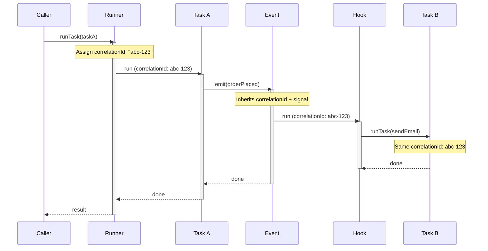

```typescript
import { run } from "@bluelibs/runner";

const runtime = await run(app, {
  executionContext: { frames: "off", cycleDetection: false },
});
```

Then read the current execution context from inside tasks, hooks, or interceptors:

```typescript
import { asyncContexts, resources, r } from "@bluelibs/runner";

const traceAwareTask = r
  .task("traceAwareTask")
  .dependencies({ logger: resources.logger })
  .run(async (_input, { logger }) => {
    const execution = asyncContexts.execution.tryUse();

    await logger.info("Running task", {
      data: {
        correlationId: execution?.correlationId,
      },
    });
  })
  .build();
```

### Bridging to a Tracer

Install tracing bridges during resource `init()` so they wrap the full runtime pipeline:

```typescript
import { asyncContexts, resources, r } from "@bluelibs/runner";

// Assuming `tracer` is your tracing SDK instance.
const tracing = r
  .resource("tracing")
  .dependencies({ taskRunner: resources.taskRunner })
  .init(async (_config, { taskRunner }) => {
    taskRunner.intercept(async (next, input) => {
      const execution = asyncContexts.execution.tryUse();
      const span = tracer.startSpan(`task:${input.task.definition.id}`, {
        attributes: {
          correlationId: execution?.correlationId,
          taskId: input.task.definition.id,
        },
      });

      try {
        return await next(input);
      } catch (error) {
        span.recordException(error);
        throw error;
      } finally {
        span.end();
      }
    });
  })
  .build();
```

This pattern keeps tracing backend choice in your app while Runner provides the stable runtime boundaries.

## Debug Resource

`debug` is Runner's built-in runtime instrumentation surface. Use it when you want to inspect lifecycle, middleware, task, or hook behavior without changing application code.

```typescript
await run(app, {
  debug: "normal",
  logs: { printThreshold: "debug", printStrategy: "pretty" },
});
```

Common modes:

- `debug: "normal"` for lifecycle and execution flow
- `debug: "verbose"` when you also want more detailed payload-level inspection
- `debug: { ...partialConfig }` for targeted instrumentation

Use `debug` for temporary diagnosis, not as a substitute for durable logs or metrics.
## Meta and Internals

This chapter covers two advanced surfaces:

- `meta(...)` for descriptive, tool-friendly component metadata
- built-in runtime services such as `resources.taskRunner` and `resources.store`

Most apps do not need these on day one. They become valuable when you build tooling, policy layers, discovery flows, or framework-style infrastructure on top of Runner.

## Meta

Use `meta(...)` when you need human-friendly descriptions that stay attached to the definition itself.

### When to Use Meta

| Use case         | Why Meta helps                                 |
| ---------------- | ---------------------------------------------- |
| API docs         | Generate docs from the actual Runner graph     |
| Admin dashboards | Display component descriptions                 |
| Billing          | Categorize features for metering               |
| Discovery        | Search components by title or description      |

### Metadata Properties

Every definition can use the base metadata shape:

```typescript
interface IMeta {
  title?: string;
  description?: string;
}
```

Use `.tags([...])` for behavioral grouping or policy. Keep `.meta(...)` focused on descriptive fields that help humans and tooling understand what a component is for.

### Simple Documentation Example

This example assumes `database` and `emailService` are dependencies defined elsewhere in your app.

```typescript
import { r } from "@bluelibs/runner";

const userService = r
  .resource("userService")
  .meta({
    title: "User Management Service",
    description:
      "Handles user creation, authentication, and profile management",
  })
  .dependencies({ database })
  .init(async (_config, { database }) => ({
    createUser: async (userData: { email: string }) => {
      return database.insert(userData);
    },
  }))
  .build();

const sendWelcomeEmail = r
  .task("sendWelcomeEmail")
  .meta({
    title: "Send Welcome Email",
    description: "Sends a welcome email to a newly registered user",
  })
  .dependencies({ emailService })
  .run(async (userData: { email: string }, { emailService }) => {
    await emailService.sendWelcome(userData.email);
  })
  .build();
```

### Extending Metadata

You can extend Runner's metadata interfaces with your own properties:

```typescript
declare module "@bluelibs/runner" {
  interface ITaskMeta {
    author?: string;
    version?: string;
    apiVersion?: "v1" | "v2" | "v3";
    costLevel?: "low" | "medium" | "high";
  }

  interface IResourceMeta {
    healthCheck?: string;
    dependencies?: string[];
    scalingPolicy?: "auto" | "manual";
  }
}

import { r } from "@bluelibs/runner";

const generateImage = r
  .task("generateImage")
  .meta({
    title: "AI Image Generation",
    description: "Generates images from prompts",
    author: "AI Team",
    version: "2.1.0",
    apiVersion: "v2",
    costLevel: "high",
  })
  .run(async (_prompt: string) => null)
  .build();

const database = r
  .resource("database")
  .meta({
    title: "Primary PostgreSQL Database",
    healthCheck: "/health/db",
    dependencies: ["postgresql", "connection-pool"],
    scalingPolicy: "auto",
  })
  .build();
```

## Namespacing

Runner definitions use **local ids** at authoring time and **canonical ids** at runtime.

You define local ids:

```typescript
import { r } from "@bluelibs/runner";

const createUser = r.task("createUser").run(async () => null).build();
const userRegistered = r.event("userRegistered").build();
const database = r.resource("database").init(async () => ({})).build();

const app = r
  .resource("app")
  .register([createUser, userRegistered, database])
  .build();
```

Runner composes canonical ids from ownership:

| Kind                | Local id -> Canonical id                         |
| ------------------- | ------------------------------------------------ |
| Resource            | `database` -> `app.database`                     |
| Task                | `createUser` -> `app.tasks.createUser`           |
| Event               | `userRegistered` -> `app.events.userRegistered`  |
| Hook                | `onUserRegistered` -> `app.hooks.onUserRegistered` |
| Task Middleware     | `auth` -> `app.middleware.task.auth`             |
| Resource Middleware | `audit` -> `app.middleware.resource.audit`       |
| Tag                 | `public` -> `app.tags.public`                    |
| Error               | `invalidInput` -> `app.errors.invalidInput`      |
| Async Context       | `requestContext` -> `app.asyncContexts.requestContext` |

Important behavior:

- prefer local ids in builders
- use references such as `runTask(createUser, input)` whenever possible
- canonical ids appear in runtime/store surfaces, logs, and discovery APIs
- only the internal synthetic framework root is transparent; user resources always contribute their own ownership segment
- reserved local ids fail fast: `tasks`, `resources`, `events`, `hooks`, `tags`, `errors`, `asyncContexts`

## Internal Services

Runner registers a set of built-in resources during bootstrap. These are useful when you need direct control over runtime behavior.

These built-ins sit under two synthetic framework namespace resources:

- `system`: owns locked internal infrastructure such as `resources.store`, `resources.eventManager`, `resources.taskRunner`, `resources.middlewareManager`, `resources.runtime`, and lifecycle events
- `runner`: owns built-in utility globals such as `resources.mode`, `resources.health`, `resources.timers`, `resources.logger`, `resources.serializer`, `resources.queue`, core tags, middleware, framework errors, and optional debug/execution-context resources

Both namespace resources are real Runner resources and expose `.meta.title` / `.meta.description` for docs and tooling. They also enforce the same metadata contract across the framework-owned resources, events, hooks, tags, and middleware they register. The transparent `runtime-framework-root` above them remains internal-only and does not appear in user-facing canonical ids.

| Resource                      | What it gives you                                                                                                                                                                                                                 |
| ----------------------------- | --------------------------------------------------------------------------------------------------------------------------------------------------------------------------------------------------------------------------------- |
| `resources.mode`              | The resolved runtime mode as a read-only value (`"dev" \| "prod" \| "test"`). Prefer this when you only need mode-aware branching.                                                                                              |
| `resources.runtime`           | The same handle returned by `run(app)`, scoped to this app. Use it inside resources to call `runTask`, `emitEvent`, or inspect the runtime without passing the outer handle manually.                                            |
| `resources.taskRunner`        | The `TaskRunner` that executes tasks. Install global task interceptors here during `init()`.                                                                                                                                     |
| `resources.eventManager`      | The `EventManager` that powers event emission and hook dispatch. Register global event or hook interceptors here.                                                                                                                 |
| `resources.middlewareManager` | The `MiddlewareManager` that composes task and resource middleware chains. Use `intercept("task" \| "resource", ...)` or `interceptMiddleware(...)` for global wrapping.                                                        |
| `resources.store`             | The flat definition registry built from the compiled graph. Query definitions by canonical id, iterate by kind, or inspect the full registered surface.                                                                          |
| `resources.logger`            | The built-in structured logger. Supports `trace`, `debug`, `info`, `warn`, `error`, and `critical`.                                                                                                                             |
| `resources.health`            | The health reporter. Call `health.getHealth([...])` to poll resource health probes from inside the graph.                                                                                                                         |
| `resources.cache`             | The default LRU cache backing `middleware.task.cache`. Replace it with a custom or Redis-backed provider when you need shared state.                                                                                             |
| `resources.timers`            | Lifecycle-aware timer management. `setTimeout` and `setInterval` stop accepting new work once `cooldown()` starts and are cleared during `dispose()`.                                                                            |

Bootstrap timing matters: inside resource `init()`, `resources.runtime` exists early, but not every unrelated resource is initialized yet. Runner guarantees declared dependencies, not whole-world readiness.

### Example: Install a Global Task Interceptor

```typescript
import { r, resources } from "@bluelibs/runner";

const telemetry = r
  .resource("telemetry")
  .dependencies({
    taskRunner: resources.taskRunner,
    store: resources.store,
    logger: resources.logger,
  })
  .init(async (_config, { taskRunner, store, logger }) => {
    taskRunner.intercept(async (next, input) => {
      const startedAt = Date.now();

      try {
        return await next(input);
      } finally {
        await logger.info("Task completed", {
          data: {
            taskId: input.task.definition.id,
            durationMs: Date.now() - startedAt,
          },
        });
      }
    });

    const allTasks = store.getDefinitionsByKind("task");
    await logger.debug("Registered tasks", {
      data: { taskIds: allTasks.map((task) => task.id) },
    });
  })
  .build();
```

Reach for these internal services when you are building framework-level behavior, not for normal business code. If a higher-level API exists, prefer that first.
## Testing

Runner's explicit dependency graph makes testing flexible. You can test one task like a normal function, boot a focused subtree, or run the full application pipeline.

### Three Testing Approaches

| Approach                | Speed    | What runs                | What it skips                                  | Best for                     |
| ----------------------- | -------- | ------------------------ | ---------------------------------------------- | ---------------------------- |
| **Unit test**           | Fast     | Just your task function  | Runtime wiring, validation, middleware, hooks  | Logic, edge cases            |
| **Focused Integration** | Moderate | Subtree + real runtime   | Unrelated modules you did not register         | Feature modules in isolation |
| **Full Integration**    | Slower   | Full runtime pipeline    | Nothing intentional                            | End-to-end flows, wiring     |

### Unit Testing (Fast, Isolated)

Call `.run()` directly on a task with mock dependencies when you want pure business logic tests.

```typescript
describe("registerUser task", () => {
  it("creates a user and emits an event", async () => {
    const mockUserService = {
      createUser: jest.fn().mockResolvedValue({
        id: "user-123",
        name: "Alice",
        email: "alice@example.com",
      }),
    };
    const mockUserRegistered = jest.fn().mockResolvedValue(undefined);

    const result = await registerUser.run(
      { name: "Alice", email: "alice@example.com" },
      {
        userService: mockUserService,
        userRegistered: mockUserRegistered,
      },
    );

    expect(result.id).toBe("user-123");
    expect(mockUserRegistered).toHaveBeenCalledWith({
      userId: "user-123",
      email: "alice@example.com",
    });
  });
});
```

Important boundary:

- `.run(input, mocks)` exercises your task body only
- it does **not** run middleware, runtime validation, lifecycle hooks, execution context propagation, or health-gated admission rules

Use this path when that omission is exactly what you want.

### Focused Integration Testing (Moderate, Subtree Only)

You do not need to boot the whole application to test one feature module. Build a small harness resource, register the subtree you care about, and override the external dependencies around it.

```typescript
import { run, r } from "@bluelibs/runner";
import {
  notificationsResource,
  processNotificationQueue,
} from "./notifications";
import { emailResource } from "./email";

describe("Notifications module", () => {
  it("processes notifications correctly", async () => {
    const mockEmailProvider = r.override(emailResource, async () => ({
      send: jest.fn().mockResolvedValue(true),
    }));

    const testHarness = r
      .resource("testHarness")
      .register([
        notificationsResource,
        emailResource,
      ])
      .overrides([mockEmailProvider])
      .build();

    const { runTask, dispose } = await run(testHarness, {
      mode: "test",
      logs: { printThreshold: null },
    });

    try {
      await runTask(processNotificationQueue, { batchId: "123" });
      // assertions...
    } finally {
      await dispose();
    }
  });
});
```

Ownership rule:

- an override only works if the target definition is actually registered in the harness graph
- the override must be declared by the same owning resource or one of its ancestors

> **Note:** You do not need to pass `mode: "test"` explicitly when your test runner already sets `NODE_ENV=test`. Runner auto-detects `test` mode from the environment unless you override `mode` yourself.

When multiple overrides target the same definition in resolved `test` mode, the outermost declaring resource wins.

### Full Integration Testing (Full Pipeline)

Use `run()` against the full app graph when you want the real middleware, hooks, validation, lifecycle, and dependency wiring.

```typescript
import { run, r } from "@bluelibs/runner";

describe("User registration flow", () => {
  it("creates a user, sends email, and tracks analytics", async () => {
    const mockDb = r.override(realDb, async () => new InMemoryDatabase());
    const mockMailer = r.override(realMailer, async () => ({
      send: jest.fn().mockResolvedValue(true),
    }));

    const testApp = r
      .resource("testApp")
      .register([...productionComponents])
      .overrides([mockDb, mockMailer])
      .build();

    const { runTask, getResourceValue, dispose } = await run(testApp, {
      mode: "test",
      logs: { printThreshold: null },
    });

    try {
      const user = await runTask(registerUser, {
        name: "Charlie",
        email: "charlie@test.com",
      });

      expect(user.id).toBeDefined();

      const mailer = getResourceValue(realMailer);
      expect(mailer.send).toHaveBeenCalled();
    } finally {
      await dispose();
    }
  });
});
```

Important override rules:

- `r.override(base, fn)` creates a replacement definition
- `.overrides([...])` accepts override definitions only
- duplicate override targets are allowed only in resolved `test` mode, whether that came from `mode: "test"` or auto-detected `NODE_ENV=test`
- in `test` mode, ancestor/descendant conflicts resolve to the outermost declaring resource
- in `test` mode, same-resource duplicates resolve to the last declaration
- unrelated duplicate override sources still fail fast, even in `test` mode
- duplicate override targets fail fast outside `test` mode
- do not place both base and override in `.register([...])`

### Capturing Execution Context in Integration Tests

Sometimes you want to assert the actual runtime path, not just the final result. Enable `executionContext` and wrap the call in `asyncContexts.execution.record(...)`.

```typescript
import { asyncContexts, run } from "@bluelibs/runner";

describe("Notifications module", () => {
  it("captures the execution tree for one integration run", async () => {
    const runtime = await run(notificationsResource, {
      executionContext: true,
      logs: { printThreshold: null },
    });

    try {
      const { result, recording } = await asyncContexts.execution.record(() =>
        runtime.runTask(processNotificationQueue, { batchId: "123" }),
      );

      expect(result).toBeDefined();
      expect(recording?.roots).toHaveLength(1);

      const root = recording!.roots[0]!;
      expect(root.frame.kind).toBe("task");
      expect(root.status).toBe("completed");
      expect(Array.isArray(root.children)).toBe(true);
    } finally {
      await runtime.dispose();
    }
  });
});
```

> **Platform Note:** Execution context relies on `AsyncLocalStorage`. The Node build supports it directly, and compatible Bun/Deno runtimes can support it when that primitive is available.

### Observation Strategies for Integration Tests

When an integration test fails, the real question is usually: what is the smallest surface that proves the behavior you care about?

#### 1. Override a collaborator and assert on the mock

Best when you care that an external dependency was called.

#### 2. Add a test probe resource

Best when you need to capture state from hooks, events, or resource lifecycle.

#### 3. Record the execution tree

Best when you need to prove that a task emitted an event, that hooks ran, or that the path through nested tasks is correct.

#### 4. Assert on resulting resource state

Best when the meaningful outcome is durable state, not an intermediate call.

### Logging During Tests

By default, Runner suppresses console log printing in `NODE_ENV=test` by setting `logs.printThreshold` to `null`.

If you want logs printed during a test run:

```typescript
await run(app, {
  mode: "test",
  debug: "verbose",
  logs: {
    printThreshold: "debug",
    printStrategy: "pretty",
  },
});
```

`debug: "verbose"` increases Runner instrumentation. `logs.printThreshold` controls whether anything is printed to the console.

### Testing Tips

- prefer task references over string ids so you keep type safety and autocomplete
- always `dispose()` the runtime in integration tests
- keep focused harnesses small so failures point at one feature, not the whole app
- use `.run()` for pure business logic and `runTask()` for runtime behavior
- when a test needs logs, set `logs.printThreshold` explicitly

```typescript
await runTask(registerUser, { name: "Alice", email: "alice@test.com" });

await runTask("app.tasks.registerUser", {
  name: "Alice",
  email: "alice@test.com",
});
```

The string form works, but task references are safer and easier to refactor.
