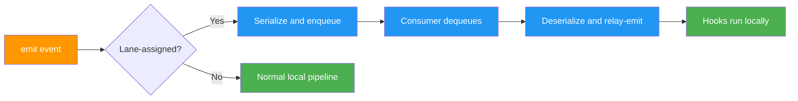
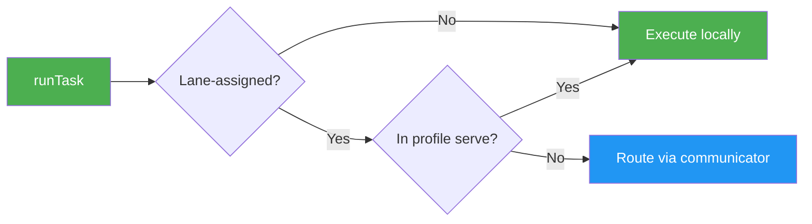
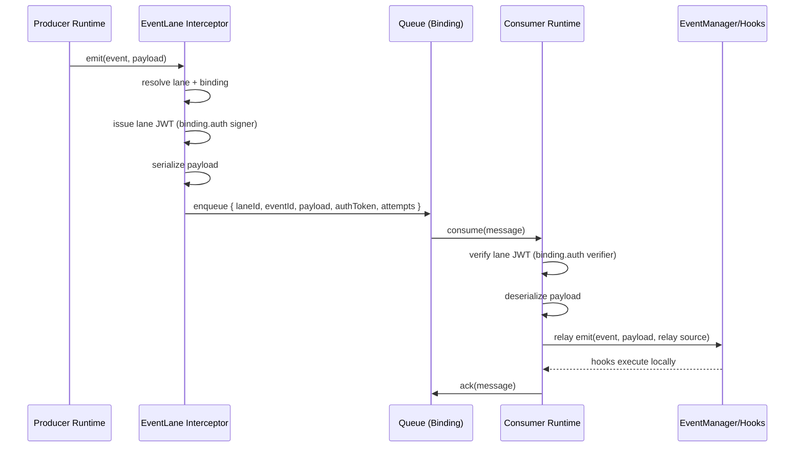
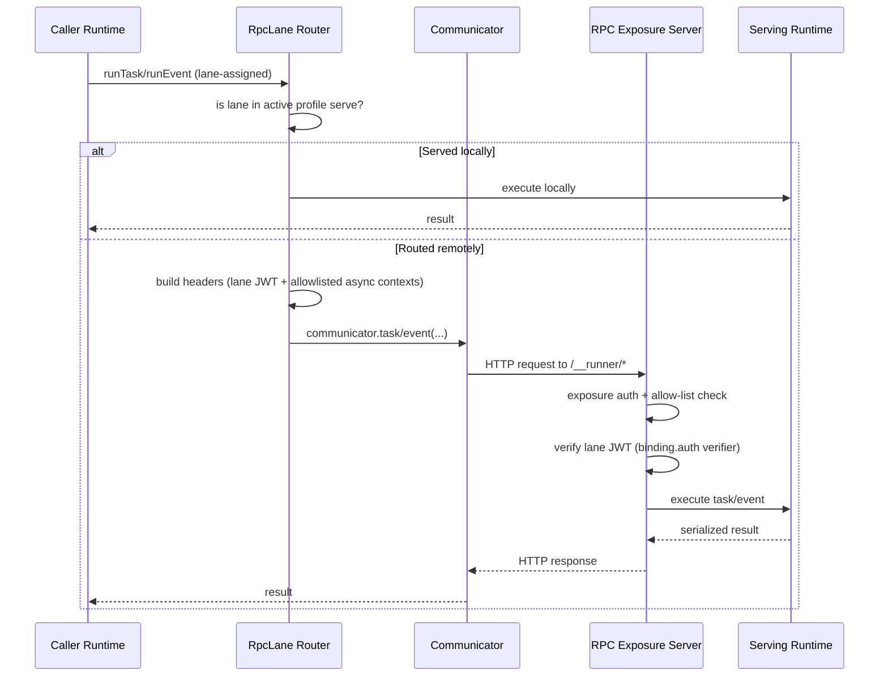

# Runner Remote Lanes

← [Back to main README](../README.md) | [Full guide](./FULL_GUIDE.md)

---

When your Runner system grows beyond a single process — separate workers for email, a billing service on its own box, event propagation across microservices — you need a routing layer that doesn't rewrite your domain model. Remote Lanes are that layer.

- **Event Lanes**: async, queue-backed event delivery
- **RPC Lanes**: sync RPC calls for lane-assigned tasks/events

Both are **topology-driven** and implemented as Node runtime resources. Topology means you declare which runtime profiles consume or serve which lanes, and which infrastructure (queues or communicators) backs each lane.

## Start Here: Event Lane or RPC Lane?

Use this table when you're choosing a lane system for a new flow.

| Concern           | Event Lanes                       | RPC Lanes                             |
| ----------------- | --------------------------------- | ------------------------------------- |
| Latency model     | asynchronous                      | synchronous                           |
| Delivery model    | queue-driven delivery and retries | request/response call path            |
| Caller experience | emit and continue                 | await remote result                   |
| Coupling          | lower temporal coupling           | tighter temporal coupling             |
| Failure surface   | enqueue/consume and retry policy  | remote call and communicator contract |

**TL;DR:** Use **RPC Lanes for request/response**, and **Event Lanes for async propagation**.

A common architecture combines both: issue a command via RPC Lane, then propagate the domain result via Event Lane. For example, the API calls `billing.tasks.chargeCard` over RPC, and the billing service emits `billing.events.cardCharged` over an Event Lane for downstream projections.

## How Lanes Plug Into Runner Core

Remote Lanes work through runtime interception and decoration — they never touch your core domain definitions.

- Event Lanes register an event emission interceptor. Only lane-assigned events are intercepted; everything else passes through unchanged.
- RPC Lanes decorate lane-assigned task execution at runtime and route lane-assigned events through an event interceptor.
- Non-lane-assigned tasks and events continue through normal Runner behavior.

Your task and event definitions stay exactly the same. Lane routing is attached purely by resource configuration.

### Design Boundary: Lanes Route Work, Hooks Decide Side Effects

Remote lanes (`lane` / `profile` / `binding`) are infrastructure controls: routing, delivery mode, reliability, and scale.

- Use lanes/profiles to decide **where and how** work runs.
- Use hook/task logic (feature flags, business rules, tenant/region policy) to decide **what should happen**.

Runner intentionally does **not** provide lane/profile-level hook allow/deny gating. We want to avoid coupling transport topology to domain behavior, because that creates hidden behavior and a larger config/test matrix.

In practice:

- If you need throughput/locality/fault-isolation changes, adjust lane topology.
- If you need to enable/disable a side effect, do it in hook business logic.
- If semantics truly differ, split events instead of transport-filtering hooks.

Related transactional boundary: transactional events are in-process rollback semantics, so `transactional + eventLane` is invalid by design.

### Event Lane Data Flow



### RPC Lane Routing



## Local Development Without Extra Microservices

You don't need RabbitMQ or a separate RPC service running locally to develop with lanes. Here are three paths, ordered from fastest feedback to most realistic.

### Path 1: `transparent` Mode (Fast Smoke Test)

Use when you want lane assignments present but transport bypassed entirely.

- **Pros**: fastest local loop, zero queue/communicator setup
- **Cons**: does not exercise transport boundaries

```typescript
import { r } from "@bluelibs/runner";
import { eventLanesResource, rpcLanesResource } from "@bluelibs/runner/node";

const lane = r.eventLane("app.lanes.notifications").build();
const rpc = r.rpcLane("app.rpc.billing").build();

const topologyEvents = r.eventLane.topology({
  profiles: { local: { consume: [] } },
  bindings: [],
});

const topologyRpc = r.rpcLane.topology({
  profiles: { local: { serve: [] } },
  bindings: [],
});

const app = r
  .resource("app")
  .register([
    eventLanesResource.with({
      profile: "local",
      topology: topologyEvents,
      mode: "transparent",
    }),
    rpcLanesResource.with({
      profile: "local",
      topology: topologyRpc,
      mode: "transparent",
    }),
  ])
  .build();
```

### Path 2: `local-simulated` Mode (Serializer Boundary Test)

Use when you want local execution with transport-like serialization behavior.

- **Pros**: catches serializer boundary issues early
- **Cons**: still not a true broker/network failure surface

```typescript
import { r } from "@bluelibs/runner";
import { eventLanesResource, rpcLanesResource } from "@bluelibs/runner/node";

const eventLane = r.eventLane("app.lanes.audit").build();
const rpcLane = r.rpcLane("app.rpc.users").build();

const app = r
  .resource("app")
  .register([
    eventLanesResource.with({
      profile: "local",
      mode: "local-simulated",
      topology: r.eventLane.topology({
        profiles: { local: { consume: [] } },
        bindings: [],
      }),
    }),
    rpcLanesResource.with({
      profile: "local",
      mode: "local-simulated",
      topology: r.rpcLane.topology({
        profiles: { local: { serve: [] } },
        bindings: [],
      }),
    }),
  ])
  .build();
```

### Path 3: Two Local Runtimes in One Process (Profile Topology Test)

Use when you want to emulate producer/consumer separation without deploying extra services.

- **Pros**: validates profile routing and worker startup behavior
- **Cons**: still single-process reliability characteristics

```typescript
import { r, run } from "@bluelibs/runner";
import {
  eventLanesResource,
  MemoryEventLaneQueue,
} from "@bluelibs/runner/node";

const lane = r.eventLane("app.lanes.notifications").build();
const queue = new MemoryEventLaneQueue();

const topology = r.eventLane.topology({
  profiles: {
    api: { consume: [] },
    worker: { consume: [lane] },
  },
  bindings: [{ lane, queue }],
});

const apiApp = r
  .resource("app.api")
  .register([
    eventLanesResource.with({ profile: "api", topology, mode: "network" }),
  ])
  .build();

const workerApp = r
  .resource("app.worker")
  .register([
    eventLanesResource.with({ profile: "worker", topology, mode: "network" }),
  ])
  .build();

const apiRuntime = await run(apiApp);
const workerRuntime = await run(workerApp);
```

> **runtime:** "Three modes of local development. Because 'it works on my machine' is not a deployment strategy."

## Event Lanes in Network Mode

Use Event Lanes for fire-and-forget queue semantics and decoupled worker consumption. The producer emits and moves on; a consumer dequeues, deserializes, and re-emits locally so hooks run on the worker side.

### Quick Start

```typescript
import { globals, r } from "@bluelibs/runner";
import {
  eventLanesResource,
  MemoryEventLaneQueue,
} from "@bluelibs/runner/node";

// 1. Define a lane — a logical routing channel
const notificationsLane = r.eventLane("app.lanes.notifications").build();

// 2. Tag the event for lane routing
const notificationRequested = r
  .event<{ userId: string; channel: "email" | "sms" }>(
    "app.events.notificationRequested",
  )
  .tags([globals.tags.eventLane.with({ lane: notificationsLane })])
  .build();

// 3. Hook runs on the consumer side after relay
// Assuming: deliverNotification is defined elsewhere
const sendNotification = r
  .hook("app.hooks.sendNotification")
  .on(notificationRequested)
  .run(async (event) => {
    await deliverNotification(event.data);
  })
  .build();

// 4. Wire topology: who consumes what, and which queue backs each lane
const topology = r.eventLane.topology({
  profiles: {
    api: { consume: [] },
    worker: { consume: [notificationsLane] },
  },
  bindings: [
    {
      lane: notificationsLane,
      queue: new MemoryEventLaneQueue(),
      prefetch: 8,
      maxAttempts: 3,
      retryDelayMs: 250,
    },
  ],
});

// 5. Register and run
const app = r
  .resource("app")
  .register([
    notificationRequested,
    sendNotification,
    eventLanesResource.with({
      profile: process.env.RUNNER_PROFILE || "worker",
      topology,
      mode: "network",
    }),
  ])
  .build();
```

**What you just learned**: Lane definition, event tagging, topology wiring, and profile-based consumer routing — the full Event Lane pattern.

### Event Lane Network Lifecycle (Auth + Serialization)



### Event Lane Message Envelope (What Actually Travels)

When an event is routed through an Event Lane in `mode: "network"`, Runner wraps it in an internal transport envelope.

Wire payload (simplified):

```json
{
  "id": "uuid",
  "laneId": "app.lanes.notifications",
  "eventId": "app.events.notificationRequested",
  "payload": "{\"userId\":\"u1\",\"channel\":\"email\"}",
  "source": { "kind": "runtime", "id": "app" },
  "createdAt": "2026-02-28T12:00:00.000Z",
  "attempts": 0,
  "maxAttempts": 3,
  "orderingKey": "optional",
  "metadata": { "optional": true }
}
```

Field intent:

- `payload`: serialized event data string (not raw object)
- `attempts`: transport-managed retry counter
- `maxAttempts`: retry budget from lane binding
- `laneId` + `eventId`: routing and relay target
- `source`: provenance for diagnostics/behavior

Delivery lifecycle:

1. Producer emits event -> Runner intercepts and enqueues envelope with `attempts: 0`.
2. Consumer dequeues -> queue adapter increments to current delivery attempt (`attempts + 1`) before handler path.
3. On failure with retries left -> message is requeued with updated `attempts`.
4. On final failure (`attempts >= maxAttempts`) -> `nack(false)` and broker policy (for example DLQ) decides final settlement.

Important boundary:

- `attempts` is transport metadata, not business payload. Application code should not set or depend on it directly.

### RabbitMQ Notes and Operational Knobs

For production, swap `MemoryEventLaneQueue` for `RabbitMQEventLaneQueue`. It supports practical operational controls:

- `prefetch`: consumer back-pressure per worker
- `maxAttempts` + `retryDelayMs`: retry policy at lane binding level
- `publishConfirm`: wait for broker publish confirmations (recommended for durability)
- `reconnect`: connection/channel recovery policy for broker drops
- `queue.deadLetter`: dead-letter policy wiring on queue declaration

```typescript
import { RabbitMQEventLaneQueue } from "@bluelibs/runner/node";

new RabbitMQEventLaneQueue({
  url: process.env.RABBITMQ_URL,
  queue: {
    name: "runner.notifications",
    durable: true,
    deadLetter: {
      queue: "runner.notifications.dlq",
      exchange: "",
      routingKey: "runner.notifications.dlq",
    },
  },
  publishConfirm: true,
  reconnect: {
    enabled: true,
    maxAttempts: 10,
    initialDelayMs: 200,
    maxDelayMs: 2000,
  },
});
```

> **runtime:** "publishConfirm: true. Because 'the broker probably got it' is not a delivery guarantee."

## RPC Lanes in Network Mode

Use RPC Lanes when one Runner needs to call another Runner and wait for the result. The caller awaits a response; the routing decision (local vs. remote) is made by the active profile's `serve` list.

### Quick Start

```typescript
import { globals, r } from "@bluelibs/runner";
import { rpcLanesResource } from "@bluelibs/runner/node";

// 1. Define a lane
const billingLane = r.rpcLane("app.rpc.billing").build();

// 2. Tag the task for lane routing
const chargeCard = r
  .task("billing.tasks.chargeCard")
  .tags([globals.tags.rpcLane.with({ lane: billingLane })])
  .run(async (input: { amount: number }) => ({
    ok: true,
    amount: input.amount,
  }))
  .build();

// 3. Create a communicator for the remote side
const billingCommunicator = r
  .resource("app.resources.billingCommunicator")
  .init(
    r.rpcLane.httpClient({
      client: "mixed",
      baseUrl: process.env.BILLING_RPC_URL as string,
      auth: { token: process.env.RUNNER_RPC_TOKEN as string }, // exposure HTTP auth
    }),
  )
  .build();

// 4. Wire topology: who serves what, and which communicator reaches each lane
const topology = r.rpcLane.topology({
  profiles: {
    api: { serve: [] },
    billing: { serve: [billingLane] },
  },
  bindings: [{ lane: billingLane, communicator: billingCommunicator }],
});

// 5. Register and run
const app = r
  .resource("app")
  .register([
    chargeCard,
    billingCommunicator,
    rpcLanesResource.with({
      profile: "api",
      topology,
      mode: "network",
    }),
  ])
  .build();
```

**What you just learned**: RPC lane definition, task tagging, communicator wiring, and profile-based serve routing — the full RPC Lane pattern.

### Routing Branches (`mode: "network"`)

| Condition                             | Result                                 |
| ------------------------------------- | -------------------------------------- |
| lane is in active profile `serve`     | execute locally                        |
| lane is not in active profile `serve` | execute remotely via lane communicator |
| task/event is not lane-assigned       | use normal local Runner path           |

> **runtime:** "Serve it or ship it. There is no 'maybe call the other service.'"

### RPC Lane Network Lifecycle (Routing + Exposure + Lane Auth)



## Common Patterns

### Command via RPC, then Propagate via Event Lane

A typical microservice boundary: the API calls billing synchronously (RPC Lane), and billing broadcasts the result asynchronously (Event Lane) for downstream projections.

```typescript
// API service: calls billing via RPC Lane, waits for result
const result = await runTask(chargeCard, { amount: 42 });

// Billing service hook: after charging, emits domain event via Event Lane
// -> order service, analytics workers, and audit consumers pick it up asynchronously
const onCardCharged = r
  .hook("billing.hooks.onCardCharged")
  .on(chargeCardCompleted)
  .run(async (event) => {
    await emitEvent(cardCharged, {
      orderId: event.data.orderId,
      amount: event.data.amount,
    });
  })
  .build();
```

### Multi-Worker Prefetch Topology

Multiple worker processes consume from the same queue. Each worker gets `prefetch` messages at a time, providing natural back-pressure.

```typescript
const topology = r.eventLane.topology({
  profiles: {
    api: { consume: [] },
    worker: { consume: [emailLane, smsLane] },
  },
  bindings: [
    { lane: emailLane, queue: emailQueue, prefetch: 16 },
    { lane: smsLane, queue: smsQueue, prefetch: 4 },
  ],
});
// Deploy N worker instances — each gets its own prefetch window
```

### Progressive Profile Expansion

Start with one profile that does everything, then split as traffic grows. Bindings stay the same — only the profile assignment changes per deployment.

```typescript
// Phase 1: monolith — one profile consumes all lanes
const topology = r.eventLane.topology({
  profiles: {
    mono: { consume: [emailLane, analyticsLane] },
  },
  bindings: [
    { lane: emailLane, queue: emailQueue },
    { lane: analyticsLane, queue: analyticsQueue },
  ],
});

// Phase 2: split workers — add profiles, same bindings
const topology = r.eventLane.topology({
  profiles: {
    emailWorker: { consume: [emailLane] },
    analyticsWorker: { consume: [analyticsLane] },
  },
  bindings: [
    { lane: emailLane, queue: emailQueue },
    { lane: analyticsLane, queue: analyticsQueue },
  ],
});
```

## DLQ, Retries, and Failure Ownership

Keep responsibilities clearly separated:

**Transport-level (lane binding + broker config):**

- `maxAttempts` + `retryDelayMs` at the lane binding level control retry budget before final failure
- DLQ behavior is **broker/queue-policy owned**
- Runner settles final consumer failure with `nack(false)` — it does **not** manually publish to a DLQ queue
- If your queue has no dead-letter configuration, a final `nack(false)` discards the message per broker behavior

**Business-level (task/hook middleware + domain logic):**

- Use task middleware (`retry`, `circuitBreaker`, `fallback`) for business-level resilience
- Use domain compensation patterns for recovery flows

> **runtime:** "Retry at the transport layer. Compensate at the business layer. Panic at the ops layer."

## Testing Lanes

### Unit Tests: `transparent` Mode

Use `transparent` mode when you want to test business logic without transport noise. Lane assignments are present but transport is completely bypassed — hooks run locally as if no lane existed.

```typescript
import { r, run } from "@bluelibs/runner";
import { eventLanesResource } from "@bluelibs/runner/node";

// Assuming: myEvent and myHook are defined elsewhere
const app = r
  .resource("app")
  .register([
    myEvent,
    myHook,
    eventLanesResource.with({
      profile: "test",
      mode: "transparent",
      topology: r.eventLane.topology({
        profiles: { test: { consume: [] } },
        bindings: [],
      }),
    }),
  ])
  .build();

const { emitEvent, dispose } = await run(app);
await emitEvent(myEvent, { userId: "u1" }); // hooks run locally, no queue involved
await dispose();
```

### Boundary Tests: `local-simulated` Mode

Use `local-simulated` when you want to verify that your event payloads survive serialization. This catches issues with Dates, RegExp, class instances, and other non-JSON-safe types before they hit production.

When binding auth is configured (`binding.auth`), `local-simulated` also enforces JWT signing+verification so local simulation tests both payload shape and lane security behavior.

```typescript
eventLanesResource.with({
  profile: "test",
  mode: "local-simulated",
  topology: r.eventLane.topology({
    profiles: { test: { consume: [] } },
    bindings: [],
  }),
});
```

### Integration Tests: `MemoryEventLaneQueue`

Use `MemoryEventLaneQueue` for full lane routing tests without external infrastructure. This exercises the real enqueue/consume/relay path in-process.

```typescript
import { r, run } from "@bluelibs/runner";
import {
  eventLanesResource,
  MemoryEventLaneQueue,
} from "@bluelibs/runner/node";

const lane = r.eventLane("app.lanes.test").build();
const queue = new MemoryEventLaneQueue();

const topology = r.eventLane.topology({
  profiles: { test: { consume: [lane] } },
  bindings: [{ lane, queue }],
});

// Assuming: myEvent and myHook are defined elsewhere
const app = r
  .resource("app")
  .register([
    myEvent,
    myHook,
    eventLanesResource.with({ profile: "test", topology, mode: "network" }),
  ])
  .build();

const { emitEvent, dispose } = await run(app);
await emitEvent(myEvent, { userId: "u1" }); // enqueues, consumes, relays, hooks run
await dispose();
```

## Debugging

When things go sideways, start with verbose mode:

```typescript
const runtime = await run(app, { debug: "verbose" });
```

This enables Event Lanes routing diagnostics. Look for these entries:

| Diagnostic                       | Meaning                                                                  |
| -------------------------------- | ------------------------------------------------------------------------ |
| `event-lanes.enqueue`            | Event was intercepted and enqueued to the lane's queue                   |
| `event-lanes.relay-emit`         | Consumer dequeued and re-emitted the event locally                       |
| `event-lanes.skip-inactive-lane` | Event's lane is not consumed by the active profile (nacked with requeue) |

If you see `skip-inactive-lane`, your active profile likely doesn't include the lane in its `consume` list.

## Pros and Cons by Mode

| Mode              | Pros                                                                                              | Cons                                    | Misuse Warning                                                 |
| ----------------- | ------------------------------------------------------------------------------------------------- | --------------------------------------- | -------------------------------------------------------------- |
| `network`         | true transport behavior, real queue/communicator integration, realistic failure surfaces          | infra required, slower local loop       | Do not skip this mode before production rollout                |
| `transparent`     | fastest local feedback, zero transport dependencies, queues/communicators not required to resolve | hides serialization and network effects | Do not treat passing transparent tests as transport validation |
| `local-simulated` | tests serializer boundary and relay paths locally, queues/communicators not required to resolve   | no real network or broker behavior      | Do not assume retry/DLQ behavior from local simulation         |

Key rules:

- `mode` is authoritative and sits above topology/profile routing.
- In `transparent` and `local-simulated`, profile routing (`consume`/`serve`) is ignored for transport decisions.
- Only `network` uses queue/communicator bindings for remote routing.

## Security and Exposure

RPC lane HTTP exposure is available through `rpcLanesResource.with({ exposure: { http: ... } })` in `mode: "network"` only. Attempting to use `exposure.http` in other modes fails fast at startup. Exposure HTTP is only started when the active profile serves at least one RPC lane.

Security defaults:

- Exposure remains **fail-closed** unless you explicitly configure otherwise
- Always configure `http.auth` with a token or a validator task (edge gate)
- Run behind trusted network boundaries and infrastructure gateway controls (rate-limits, network policy)
- Keep anonymous exposure disabled unless explicitly needed
- Exposure HTTP bootstrap is `listen`-based; custom `http.Server` injection is not part of the contract

There are two independent security layers:

1. **Exposure HTTP auth** (`exposure.http.auth`) controls who can hit `POST /__runner/task/...` and `POST /__runner/event/...`.
2. **Lane JWT auth** (`binding.auth`) controls lane-authorized produce/consume behavior.

You usually want both.

```typescript
const activeProfile = (process.env.RUNNER_PROFILE as "api" | "billing") ?? "api";
const billingLane = r.rpcLane("app.rpc.billing").build();
const topology = r.rpcLane.topology({
  profiles: {
    api: { serve: [] },
    billing: { serve: [billingLane] },
  },
  bindings: [
    {
      lane: billingLane,
      communicator: billingCommunicator,
      auth: {
        mode: "jwt_asymmetric",
        algorithm: "EdDSA",
        privateKey: process.env.BILLING_PRIVATE_KEY as string,
        publicKey: process.env.BILLING_PUBLIC_KEY as string,
      },
    },
  ],
});

rpcLanesResource.with({
  profile: activeProfile,
  topology,
  mode: "network",
  exposure: {
    http: {
      basePath: "/__runner",
      listen: { port: 7070 },
      auth: { token: process.env.RUNNER_RPC_TOKEN as string }, // HTTP edge gate
    },
  },
});
```

Binding auth (JWT):

- JWT mode is configured only at `binding.auth`.
- Supported modes: `none`, `jwt_hmac`, `jwt_asymmetric`.
- `local-simulated` enforces auth when configured (it does not bypass lane JWT checks).
- For asymmetric mode (`jwt_asymmetric`), producers sign with **private keys**, consumers verify with **public keys**.
- This principle is identical for RPC and Event Lanes.

Asymmetric JWT should prove these two properties in your setup:

1. **Producer cannot produce with only public key material**.
2. **Consumer cannot verify with only private key material**.

```typescript
// Producer profile (not serving lane): needs signer material (private key)
const producerTopology = r.rpcLane.topology({
  profiles: { api: { serve: [] } },
  bindings: [
    {
      lane: billingLane,
      communicator: billingCommunicator,
      auth: {
        mode: "jwt_asymmetric",
        privateKey: process.env.BILLING_PRIVATE_KEY as string,
      },
    },
  ],
});

// Consumer profile (serving lane): needs verifier material (public key)
const consumerTopology = r.rpcLane.topology({
  profiles: { billing: { serve: [billingLane] } },
  bindings: [
    {
      lane: billingLane,
      communicator: billingCommunicator,
      auth: {
        mode: "jwt_asymmetric",
        publicKey: process.env.BILLING_PUBLIC_KEY as string,
      },
    },
  ],
});
```

Fail-fast proof snippets (recommended in integration tests):

```typescript
// 1) Producer with only public key -> signer missing (cannot mint lane token)
await expect(run(producerAppWithPublicKeyOnly)).rejects.toMatchObject({
  name: "runner.errors.remoteLanes.auth.signerMissing",
});

// 2) Consumer with only private key -> verifier missing (cannot verify lane token)
await expect(run(consumerAppWithPrivateKeyOnly)).rejects.toMatchObject({
  name: "runner.errors.remoteLanes.auth.verifierMissing",
});
```

Event Lane parity example (same asymmetric role split):

```typescript
const activeProfile = (process.env.RUNNER_PROFILE as "api" | "worker") ?? "api";
const notificationsLane = r.eventLane("app.events.notifications").build();
const topology = r.eventLane.topology({
  profiles: {
    api: { consume: [] }, // producer profile
    worker: { consume: [notificationsLane] }, // consumer profile
  },
  bindings: [
    {
      lane: notificationsLane,
      queue: new MemoryEventLaneQueue(),
      auth: {
        mode: "jwt_asymmetric",
        privateKey: process.env.EVENTS_PRIVATE_KEY as string, // producer path
        publicKey: process.env.EVENTS_PUBLIC_KEY as string, // consumer path
      },
    },
  ],
});

eventLanesResource.with({
  profile: activeProfile,
  topology,
  mode: "network",
});
```

`local-simulated` note:

- Auth is still enforced.
- For `jwt_asymmetric`, the same runtime signs and verifies during simulation, so binding auth must provide both sides of material.
- RPC lane `asyncContexts` allowlist still applies in `local-simulated` (default `[]`, so no implicit forwarding).

## Migration Notes (v6)

Legacy tunnel event routing (`events` + `emit` + `eventDeliveryMode`) is removed in v6. Here's what replaces it:

| Legacy tunnel pattern                    | v6 replacement                                          |
| ---------------------------------------- | ------------------------------------------------------- |
| `tunnelResource.with({ events: [...] })` | `eventLanesResource.with({ topology, profile })`        |
| `tunnelResource.with({ emit: [...] })`   | Tag events with `globals.tags.eventLane.with({ lane })` |
| `eventDeliveryMode: "queue"`             | Event Lanes `mode: "network"` with queue binding        |
| Sync tunnel task calls                   | RPC Lanes `mode: "network"` with communicator binding   |

Transport/wire details for HTTP RPC are in [TUNNEL_HTTP_POLICY.md](./TUNNEL_HTTP_POLICY.md).

## Troubleshooting Checklist

When routing does not behave as expected, check in this order:

1. **Lane binding exists** for each lane-assigned definition used in `network` mode.
2. **Active profile includes expected lanes** — `consume` for event workers, `serve` for RPC servers.
3. **Queue/communicator dependencies resolve** in the runtime container.
4. **Runtime mode is what you think it is** — `transparent` and `local-simulated` bypass network routing entirely.
5. **Queue dead-letter policy is configured** if you expect failed messages in a DLQ.
6. **Debug mode is on** — `run(app, { debug: "verbose" })` shows lane routing diagnostics.

## Reference Contracts

### Core Guard Rails

- Lane ids must be non-empty strings.
- Event definitions cannot be assigned to both lane systems (`eventLane` + `rpcLane`) across tags and/or `applyTo`.
- A definition cannot be assigned to two different lanes in the same lane system.
- `applyTo` string targets are validated against container definitions and fail fast on invalid type/id.
- `transactional + globals.tags.eventLane` is invalid.
- `transactional + parallel` is invalid.

### Event Lane Contract

| Concept          | API                                                              |
| ---------------- | ---------------------------------------------------------------- |
| Lane definition  | `r.eventLane("...").applyTo([...])?.build()`                     |
| Event tagging    | `globals.tags.eventLane.with({ lane, orderingKey?, metadata? })` |
| Topology         | `r.eventLane.topology({ profiles, bindings })`                   |
| Profile consume  | `profiles[profile].consume: lane[]`                              |
| Binding          | `{ lane, queue, prefetch?, maxAttempts?, retryDelayMs? }`        |
| Runtime resource | `eventLanesResource.with({ profile, topology, mode? })`          |

### RPC Lane Contract

| Concept            | API                                                              |
| ------------------ | ---------------------------------------------------------------- |
| Lane definition    | `r.rpcLane("...").applyTo([...])?.asyncContexts([...])?.build()` |
| Task/event tagging | `globals.tags.rpcLane.with({ lane })`                            |
| Topology           | `r.rpcLane.topology({ profiles, bindings })`                     |
| Profile serve      | `profiles[profile].serve: lane[]`                                |
| Binding            | `{ lane, communicator, auth?, allowAsyncContext? }`              |
| Runtime resource   | `rpcLanesResource.with({ profile, topology, mode?, exposure? })` |

### Communicator Contract

| Method            | Signature                            | Required           |
| ----------------- | ------------------------------------ | ------------------ |
| `task`            | `(id, input?) => Promise<unknown>`   | Yes (for task RPC) |
| `event`           | `(id, payload?) => Promise<void>`    | Optional           |
| `eventWithResult` | `(id, payload?) => Promise<unknown>` | Optional           |
