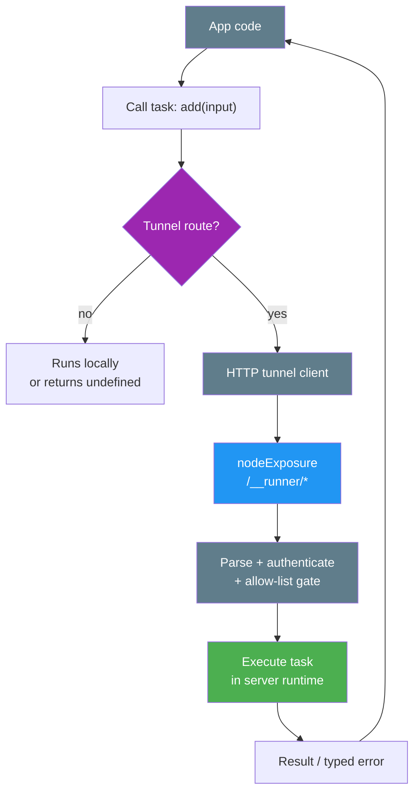

# Runner Tunnels (v2)

← [Back to main README](../README.md) | [Tunnels section in FULL_GUIDE](./FULL_GUIDE.md#tunnels-bridging-runners)

---

Tunnels let you **call a task in another process** (or emit an event remotely) while keeping your application code written as if everything is local.

Think: **one codebase, many processes** — you scale out by moving execution, not by rewriting APIs.

Use tunnels when you want:

- a tiny, controlled HTTP surface (`/__runner/*`) instead of ad-hoc endpoints,
- task semantics preserved (validation, middleware, typed errors, async context),
- the parts that cross the wire (input/output, async context values, typed error payloads) to be encoded/decoded via Runner’s `Serializer`,
- the option to switch between local execution and remote execution by configuration.

---

## TL;DR (Node backend devs)

If you're building Node services and want to call tasks remotely while keeping the code “as if local”:

- **Default Node client**: use `createHttpMixedClient` (fast serialized JSON when it can, Smart when it must).
- **You keep Runner semantics over the wire**:
  - **typed errors**: `{ id, data }` round-trip and can be rethrown locally (with an `errorRegistry`)
  - **async context**: active contexts are shipped in `x-runner-context` (Serializer-encoded) and hydrated on the server for the execution
- **Production defaults**:
  - configure `http.auth` (token and/or validator tasks)
  - enable server allow-lists via a `globals.tags.tunnel` resource in `mode: "server"` (or `"both"`)

### Quick start (Node to Node)

Server runtime (expose a small HTTP surface):

```ts
import { r, run } from "@bluelibs/runner";
import { nodeExposure } from "@bluelibs/runner/node";

export const add = r
  .task("app.tasks.add")
  .run(async (input: { a: number; b: number }) => input.a + input.b)
  .build();

export const app = r
  .resource("app")
  .register([
    add,
    nodeExposure.with({
      http: {
        basePath: "/__runner",
        listen: { port: 7070 },
        auth: { token: "dev-secret" },
      },
    }),
  ])
  .build();

await run(app);
```

Client runtime (call remote tasks directly):

```ts
import { Serializer } from "@bluelibs/runner";
import { createHttpMixedClient } from "@bluelibs/runner/node";

const client = createHttpMixedClient({
  baseUrl: "http://127.0.0.1:7070/__runner",
  auth: { token: "dev-secret" },
  serializer: new Serializer(),
});

const sum = await client.task<{ a: number; b: number }, number>(
  "app.tasks.add",
  { a: 1, b: 2 },
);
```

## The story (the mental model)

You already have Runner tasks:

- they’re typed,
- they can have middleware,
- they run inside a DI runtime,
- they’re easy to test.

Then you hit the “now it has to run somewhere else” moment:

- the browser needs to call server tasks,
- a CLI needs to trigger work in the API service,
- service A wants to reuse service B’s task without importing B’s entire runtime.

**Tunnels solve that moment** with three pieces:

1. **Exposure (server-side)**: `nodeExposure` exposes a small HTTP surface:
   - `POST {basePath}/task/{taskId}`
   - `POST {basePath}/event/{eventId}`
   - `GET|POST {basePath}/discovery`

2. **Clients (caller-side)**: HTTP clients that speak Runner’s tunnel protocol:
   - universal (`createHttpClient` / `globals.resources.httpClientFactory`) for browser + Node (JSON + browser `FormData`)
   - Node streaming (`createHttpSmartClient`, `createHttpMixedClient`) for multipart + duplex streams
   - minimal fetch (`globals.tunnels.http.createClient` / `createExposureFetch`) for JSON-only

3. **Tunnel resources (optional, but where the magic happens)**: a resource tagged with `globals.tags.tunnel` that:
   - **selects** tasks/events it wants to route,
   - and in `mode: "client"` it **patches those tasks** so calling them delegates to the tunnel client.

Your app keeps calling `await tasks.processPayment(input)`.  
Only the **execution location** changes.

### Tunnel call flow (diagram)

There are two phases:

1. **Init time (client runtime)**: tunnel resources in `mode: "client"` select tasks/events and patch them to delegate remotely.
2. **Call time**: your code calls the task; it either routes through the tunnel client or runs locally. On the server, `nodeExposure` parses + authenticates and (optionally) applies allow-lists before executing the task.



---

## The happy path (an end-to-end walkthrough)

This section is intentionally a “story you can follow”, not a reference dump.

### Step 1 — Create tasks/events as usual (server runtime)

```ts
import { r } from "@bluelibs/runner";

export const add = r
  .task("app.tasks.add")
  .run(async (input: { a: number; b: number }) => input.a + input.b)
  .build();

export const audit = r
  .event("app.events.audit")
  .payloadSchema<{ msg: string }>({ parse: (v) => v })
  .build();
```

### Step 2 — Add `nodeExposure` (server runtime)

`nodeExposure` is a **Node-only** resource from `@bluelibs/runner/node`.

```ts
import { r } from "@bluelibs/runner";
import { nodeExposure } from "@bluelibs/runner/node";

export const app = r
  .resource("app")
  .register([
    add,
    audit,
    nodeExposure.with({
      http: {
        basePath: "/__runner", // default
        listen: { port: 7070 }, // default host is 127.0.0.1
        auth: { token: "dev-secret" }, // strongly recommended
        // If you call this from a browser (or any cross-origin client), configure CORS:
        // cors: { origin: "http://localhost:3000", credentials: true },
      },
    }),
  ])
  .build();
```

At this point you have an HTTP surface, but you still need to decide what’s reachable and how the client calls it.

### Step 3 — Decide your exposure policy (server allow-list)

Runner can run in two modes:

- **Fail-closed**: if you don’t register any _server-mode_ HTTP tunnel resource, `nodeExposure` rejects task/event requests with 403 (exposure disabled).
- **Allow-listed**: once the runtime contains at least one tunnel resource whose value has `mode: "server"` (or `"both"`) and `transport: "http"`, `nodeExposure` enforces allow-lists and rejects non-allow-listed ids with 403.

To opt into allow-lists, register a server-mode tunnel resource (it does not route calls; it declares “what may be reached”):

```ts
import { r, globals } from "@bluelibs/runner";

const httpExposure = r
  .resource("app.tunnels.httpExposure")
  .tags([globals.tags.tunnel])
  .init(async () => ({
    transport: "http" as const,
    mode: "server" as const,
    tasks: ["app.tasks.add"],
    events: ["app.events.audit"],
  }))
  .build();

export const app = r
  .resource("app")
  .register([
    add,
    audit,
    httpExposure,
    nodeExposure.with({
      http: { listen: { port: 7070 }, auth: { token: "dev-secret" } },
    }),
  ])
  .build();
```

Now `GET {basePath}/discovery` (auth required) tells you exactly what’s reachable.

> [!NOTE]
> **Legacy open behavior** (not recommended): set `http.dangerouslyAllowOpenExposure: true` in `nodeExposure.with({ http: { ... } })`.

### Step 4 — Call it from somewhere else (client runtime)

You have two common styles. Pick one per boundary.

#### Style A — Transparent routing via a tunnel resource (feels “local”)

If you want your code to call `add(...)` directly and let the tunnel decide where it runs, register a **client-mode** tunnel resource.

This is the “no call-site changes” style: your application code still calls `await add({ a, b })`. The only thing that changes is **runtime composition** (server registers the real task; client registers a phantom task with the same id + a tunnel resource).

The key trick is: the _caller runtime_ must also have a task definition with the same id — but it shouldn’t contain the real implementation. That’s what **phantom tasks** are for.

The tunnel middleware will:

- select tasks/events based on `tasks` / `events`,
- patch selected tasks so calling them delegates to `tunnel.run(task, input)`,
- enforce exclusivity (a task can be owned by only one tunnel client).

```ts
import { r, globals } from "@bluelibs/runner";

// In the caller runtime, define a phantom with the same id as the server task.
// Your app code can keep calling `await add(...)`.
export const add = r.task
  .phantom<{ a: number; b: number }, number>("app.tasks.add")
  .build();

const tunnelClient = r
  .resource("app.tunnels.client")
  .tags([globals.tags.tunnel])
  .dependencies({ clientFactory: globals.resources.httpClientFactory })
  .init(async (_cfg, { clientFactory }) => {
    const client = clientFactory({
      baseUrl: "http://127.0.0.1:7070/__runner",
      auth: { token: "dev-secret" },
    });

    return {
      transport: "http" as const,
      mode: "client" as const,
      tasks: [add.id],
      // Important: create the client once (in init) and reuse it.
      run: async (task, input) => await client.task(task.id, input),
      // events + emit are optional; see “Events” below.
    };
  })
  .build();

export const app = r
  .resource("app")
  .register([add, tunnelClient])
  .build();
```

Now calling `await add({ a: 1, b: 2 })` will execute the server’s `app.tasks.add` over HTTP.
If the tunnel isn’t registered (or doesn’t select this id), the phantom resolves to `undefined`.

This is great when you want “remote” to be a configuration concern rather than a call-site concern.

#### Style B — Explicit client calls (simple and explicit)

If you want the boundary to be obvious in code, call the client directly — but **don’t create a client for every call**.

Instead, create it once in a resource and inject it where needed:

```ts
import { r, globals } from "@bluelibs/runner";

const remoteClient = r
  .resource("app.remote.client")
  .dependencies({ clientFactory: globals.resources.httpClientFactory })
  .init(async (_cfg, { clientFactory }) => {
    return clientFactory({
      baseUrl: "http://127.0.0.1:7070/__runner",
      auth: { token: "dev-secret" },
    });
  })
  .build();

export const callRemote = r
  .task("app.tasks.callRemote")
  .dependencies({ remoteClient })
  .run(async (_input, { remoteClient }) => {
    return await remoteClient.task<{ a: number; b: number }, number>(
      "app.tasks.add",
      { a: 1, b: 2 },
    );
  })
  .build();
```

---

## What actually happens under the hood (in one page)

### 1) Tunnel resource middleware patches tasks/events

Any resource tagged with `globals.tags.tunnel` is inspected at init time.

If its value has `mode: "client"` or `"both"`:

- tasks selected by `tasks` are patched: their `run()` becomes `tunnel.run(task, input)`
- `task.isTunneled = true` and the task is marked as “owned” by that tunnel
- if a second tunnel selects the same task id, Runner throws during init (to avoid ambiguous routing)
- events selected by `events` are intercepted; depending on `eventDeliveryMode`, emissions are mirrored/forwarded/etc

If the value has `mode: "server"` or `"none"`:

- nothing is patched (server-mode is about allow-lists and discovery, not routing).

### 2) `nodeExposure` enforces auth and allow-lists, then runs the task/event

For each request:

- auth is validated (static token and/or validator tasks)
- allow-list is enforced when enabled (403 if not allow-listed)
- request is parsed (JSON / multipart / octet-stream)
- async context is optionally hydrated from `x-runner-context`
- the task is executed (or event emitted)
- response is sent:
  - JSON envelope for standard results
  - raw stream for streaming results

---

## Choosing the right client

If you're in Node and you’re unsure, start with **Mixed**.

| You need… | Use | Notes |
| --- | --- | --- |
| Fast JSON task calls (default) | `createHttpMixedClient` | Uses `Serializer` over `fetch` when possible |
| Node streams / duplex (`application/octet-stream`) | `createHttpSmartClient` (or Mixed with `forceSmart`) | Smart uses `http.request` and supports duplex |
| Node multipart uploads (streams/buffers) | `createHttpSmartClient` (or Mixed) | Universal client can’t send Node streams |
| Browser/edge calls (plus browser `FormData`) | `createHttpClient` | Works in any `fetch` runtime |
| Smallest JSON-only surface | `createExposureFetch` | No universal multipart helpers |

### Universal client (`createHttpClient`, `globals.resources.httpClientFactory`)

Use when:

- you’re in a browser/edge runtime, or shared code,
- you only need JSON + browser uploads (`FormData`).

What it can’t do:

- Node duplex streams
- Node multipart streaming uploads

### Node clients (`createHttpSmartClient`, `createHttpMixedClient`)

Use when:

- you want Node streaming/duplex,
- you want Node multipart uploads (streams/buffers),
- you want “auto-switch” based on input shape.

Why there are two:

- **Smart** is the “full power” Node client (uses `http.request`): it supports
  - raw-body duplex (`Content-Type: application/octet-stream`),
  - Node multipart streaming uploads (manifest + streams/buffers),
  - streamed responses (server returns a readable stream).
- **Mixed** is a convenience wrapper: it uses the fast **serialized JSON** path (Runner `Serializer` over `fetch`) when it can, and falls back to Smart when it must.
  - The auto-switch is based on **input shape**: it detects **stream inputs** and **Node File sentinels**.
  - It cannot infer “this task will return a stream” when the input is plain JSON — use `forceSmart` (or Smart directly) for those tasks.

Recommendation:

- use **Mixed** as the default Node client (serialized JSON when possible, Smart when needed).
- if you have tasks that may **return a stream even for plain JSON inputs** (ex: downloads), either:
  - set `forceSmart: true` (or a predicate) on Mixed, or
  - use **Smart** directly.

### Pure fetch (`globals.tunnels.http.createClient`, `createExposureFetch`)

Use when:

- you want the smallest surface (JSON-only) without the universal multipart helpers.

Example:

```ts
import { globals, Serializer } from "@bluelibs/runner";

const client = globals.tunnels.http.createClient({
  url: "http://127.0.0.1:7070/__runner",
  auth: { token: "dev-secret" },
  serializer: new Serializer(),
});

const sum = await client.task<{ a: number; b: number }, number>(
  "app.tasks.add",
  { a: 1, b: 2 },
);
```

---

## Auth (static token + dynamic validators)

`nodeExposure` supports:

1. **Static token**: `http.auth.token` (string or string[]) compared via timing-safe compare.
2. **Validator tasks**: any task tagged `globals.tags.authValidator` can approve a request by returning `{ ok: true }`.

Authorization rule:

- if neither a token nor validator tasks exist, exposure is open (backwards compatible)
- otherwise, a request is allowed if **either** the static token matches **or** **any** validator approves

Validator input includes `{ headers, method, url, path }`.

Production checklist:

- set `http.auth` (token and/or validators) and treat exposure as a real API surface
- enable server allow-lists (next section) so you only expose the task/event ids you intend to support
- configure body limits (`http.limits`) to match your payload expectations
- keep `/discovery` behind auth (and avoid exposing it publicly if you don’t need it)

---

## Server allow-lists (the “small HTTP surface” promise)

Allow-lists are computed from **initialized tunnel resources** whose values are:

- `mode: "server"` or `mode: "both"`
- and `transport` is `"http"` (or omitted)

Those tunnel resources’ `tasks` and `events` selectors determine what is reachable.

Why this is a nice pattern:

- it keeps security policy near your Runner composition (not scattered through HTTP handlers),
- it’s explicit (and debuggable via `/discovery`),
- it supports both “list ids” and “select by predicate”.

---

## Versioning (pragmatic)

Treat task/event ids as your public RPC surface. For **breaking changes**, create a new id by appending a numeric suffix:

- `app.tasks.invoice.create` (v1)
- `app.tasks.invoice.create.2`
- `app.tasks.invoice.create.3`

In practice:

- the server registers both versions during a migration window
- the allow-list can expose both (or only the new one)
- clients migrate at their own pace
- once all clients are upgraded, you remove the old id and stop allow-listing it

Example (server registers two tasks):

```ts
export const createInvoice = r
  .task("app.tasks.invoice.create")
  .run(async () => {
    return { id: "inv_1" };
  })
  .build();

export const createInvoice2 = r
  .task("app.tasks.invoice.create.2")
  .run(async () => {
    return { id: "inv_1", version: 2 as const };
  })
  .build();
```

Example (client chooses explicitly):

```ts
await client.task("app.tasks.invoice.create.2", {
  /* ... */
});
```

For **non-breaking** evolution, prefer keeping the same id and making schemas backward-compatible (add optional fields, accept unions, return supersets).

---

## Files & uploads (multipart with a manifest)

Runner file uploads are **not** serializer types.

Instead, inputs contain **file sentinels** that look like:

```ts
{ $runnerFile: "File", id: "F1", meta: { name: "a.txt", type?: "...", size?: 123 } }
```

Client helpers add a sidecar (`_web` or `_node`) that provides the actual bytes/stream. That sidecar is stripped before sending.

### Browser / universal

For browser uploads, create a file sentinel with a `_web` sidecar containing the Blob:

```ts
// Browser file upload - create the sentinel directly
const file = {
  $runnerFile: "File" as const,
  id: "F1",
  meta: { name: "a.bin" },
  _web: { blob: new Blob([1, 2, 3]) },
};

await client.task("app.tasks.upload", { file });
```

### Node

Use `createNodeFile` and a Node client (Smart or Mixed):

```ts
import { createNodeFile, createHttpMixedClient } from "@bluelibs/runner/node";
import { Readable } from "stream";

const client = createHttpMixedClient({ baseUrl, serializer, auth: { token } });

await client.task("app.tasks.upload", {
  file: createNodeFile(
    { name: "a.bin", type: "application/octet-stream" },
    { stream: Readable.from([Buffer.from("hello")]) },
    "F1",
  ),
});
```

### On the server

When `Content-Type` is multipart:

- the client sends a `__manifest` field containing JSON `{ input: ... }`
- file parts are named `file:{id}`
- `nodeExposure` hydrates file sentinels into `InputFile` objects (Node streams, single-use)

Default safety limits:

- JSON body: 2MB (configurable)
- multipart: fileSize 20MB, files 10, fields 100, fieldSize 1MB (configurable)

Example server task that receives an `InputFile` and persists it:

```ts
import { r, type InputFile } from "@bluelibs/runner";

export const upload = r
  .task("app.tasks.upload")
  .run(async (input: { file: InputFile<NodeJS.ReadableStream> }) => {
    const { path, bytesWritten } = await input.file.toTempFile();
    return { path, bytesWritten };
  })
  .build();
```

---

## Streaming & duplex (octet-stream) + `useExposureContext()`

If you need true streaming request bodies (or duplex request/response), use **Node smart/mixed client** + `Content-Type: application/octet-stream`.

Server-side, in the exposed task:

- `input` is `undefined` (the request body is the stream)
- use `useExposureContext()` to access:
  - `req` (readable stream)
  - `res` (write/stream your response)
  - `signal` (aborts when the client disconnects)

Streaming responses:

- if your task returns a Node `Readable` (or `{ stream: Readable }`), exposure will pipe it directly to the HTTP response
- if your task writes the response itself, exposure does not append a JSON envelope

---

## Events (and event delivery modes)

A tunnel resource can also select events and implement `emit(emission)`.

Delivery modes (set via `eventDeliveryMode` on the tunnel value):

- `"local-only"`: never call remote
- `"remote-only"`: only call remote (skip local listeners)
- `"remote-first"`: try remote, fall back to local on remote error
- `"mirror"` (default): run local listeners, then call remote (remote failure propagates)

`nodeExposure` supports an optional “event with result” flow:

- the client sends `{ payload, returnPayload: true }`
- the server rejects if the event is marked `parallel`
- if accepted, the server responds with `{ ok: true, result: <final payload> }`

---

## Typed errors over tunnels

On the server:

- if an error matches a Runner-registered error helper (for example built via `r.error("...").build()`), exposure includes `{ id, data }` in the response envelope
- 500 errors that are not app-defined are sanitized (message becomes `"Internal Error"`)

On the client:

- if the client has an `errorRegistry`, it can rethrow typed errors locally using `{ id, data }`
- the factories (`globals.resources.httpClientFactory` and Node mixed factory) auto-inject the registry from the runtime
- `{ id, data }` is transported through the tunnel using the configured `Serializer`, so `data` can be any Serializer-supported value (not just plain JSON)

---

## Async context propagation (`x-runner-context`)

If you use Runner async contexts (via `defineAsyncContext` / `r.asyncContext(...)`):

- clients snapshot active contexts and send them in the `x-runner-context` header
- the server hydrates known contexts for the duration of the task/event execution

The header contains a serializer-encoded map: `{ [contextId]: serializedValue }`.

This uses the same `Serializer` instance you pass to your tunnel client, so context values can be any Serializer-supported value.

---

## Tunnel middleware policy (`globals.tags.tunnelPolicy`)

By default, a tunneled task **does not** run caller-side task middleware.

If you want specific middleware to still run on the caller (for example, “only auth + tracing”), add a tunnel policy tag to the task:

```ts
import { r, globals } from "@bluelibs/runner";

export const riskyTask = r
  .task("app.tasks.risky")
  .tags([
    globals.tags.tunnelPolicy.with({
      client: { middlewareAllowList: ["app.middleware.auth"] },
    }),
  ])
  .run(async () => "ok")
  .build();
```

Notes:

- the **client** side whitelist is enforced by the local runtime when the task is tunneled
- the **server** side whitelist is declarative (it’s included for symmetry, but a remote executor must choose to enforce it)
- for backwards compatibility, `{ client: [...] }` (legacy) and `{ middlewareAllowList: { client: [...] } }` (previous) are accepted forms

---

## Phantom tasks (remote-only APIs that stay type-safe)

Phantom tasks are **typed placeholders** intended to be executed through tunnels.

- they do not have `.run()`
- when called without a matching tunnel route, they resolve to `undefined`

```ts
import { r } from "@bluelibs/runner";

export const remoteHello = r.task
  .phantom<{ name: string }, string>("app.tasks.remoteHello")
  .build();
```

When you want "missing route" to be a hard error, check for `undefined`:

```ts
const value = await remoteHello({ name: "Ada" });
if (value === undefined) {
  throw new Error(`Task ${remoteHello.id} was not routed through a tunnel`);
}
return value;
```

This pattern pairs well with client-mode tunnel resources: the phantom gives you type safety, the tunnel provides the transport.

---

## Testing

The goal when testing tunnel-ed code is usually: “exercise my app logic” without paying the price of real HTTP, while still having at least one integration test that hits `nodeExposure`.

### 1) Swap the HTTP client for a mocked one (unit tests)

If your code uses `globals.resources.httpClientFactory`, you can inject a fake `fetchImpl` when building the client:

```ts
const fakeFetch: typeof fetch = async (_url, _init) =>
  new Response(JSON.stringify({ ok: true, result: 3 }), {
    headers: { "content-type": "application/json" },
  });

const client = clientFactory({
  baseUrl: "http://example.test/__runner",
  fetchImpl: fakeFetch,
  auth: { token: "dev-secret" },
});
```

Now you can assert:

- which headers were sent (`x-runner-token`, `x-runner-context`)
- which body was serialized
- how typed errors are rethrown on the client side

### 2) Use an in-memory tunnel (no HTTP at all)

For code that calls **phantom tasks**, you can test by registering a tunnel resource whose `run()` is just a local function:

```ts
import { r, globals } from "@bluelibs/runner";

const addRemote = r.task
  .phantom<{ a: number; b: number }, number>("app.tasks.add")
  .build();

const memoryTunnel = r
  .resource("tests.tunnels.memory")
  .tags([globals.tags.tunnel])
  .init(async () => ({
    mode: "client" as const,
    tasks: [addRemote.id],
    run: async (_task, input: { a: number; b: number }) => input.a + input.b,
  }))
  .build();
```

This keeps the “tunneled call shape” (task id selection, ownership, middleware policy) but eliminates transport variability.

### 3) Make limits testable (small payloads)

If you want to cover “413 Payload too large” paths deterministically, set small limits in the exposure config in your test runtime:

```ts
nodeExposure.with({
  http: {
    listen: { port: 0 }, // pick any available port in your harness
    limits: { json: { maxSize: 64 }, multipart: { fileSize: 128 } },
  },
});
```

---

## Troubleshooting checklist (the fast kind)

1. 401 Unauthorized
   - confirm the client sends the correct header (default `x-runner-token`)
   - if you use validators, ensure one returns `{ ok: true }`

2. 403 Forbidden (exposure disabled / allow-list)
   - confirm you registered a server-mode HTTP tunnel resource
   - confirm the id is in its `tasks`/`events` selector
   - check `GET {basePath}/discovery`

3. 404 Not Found
   - the id is not registered in the server runtime

4. Unexpected local execution
   - confirm a client-mode tunnel resource selected that task id
   - confirm no tunnel ownership conflict happened during init

5. Uploads/streams not working
   - universal client only supports browser `Blob`/`FormData`
   - use Node Mixed/Smart clients for Node streams and Node multipart uploads

6. 499 Client Closed Request
   - the caller aborted or disconnected; in tasks, check `useExposureContext().signal`

---

## Reference (what to look up next)

- `readmes/TUNNEL_HTTP_POLICY.md` for the wire protocol details
- `src/globals/middleware/tunnel.middleware.ts` for task patching + event delivery modes
- `src/node/exposure/*` for server parsing, auth, allow-lists, streaming, and context hydration
